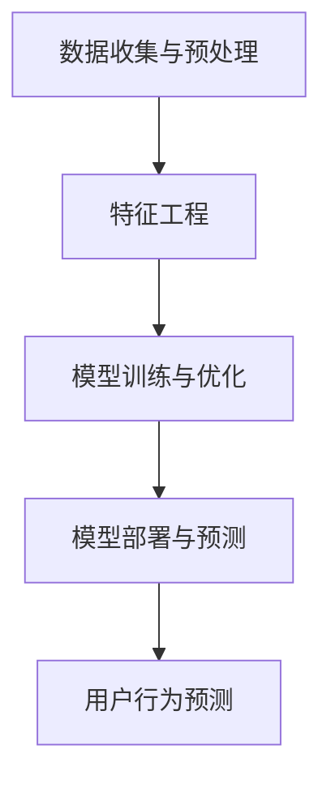

                 

关键词：大模型，用户行为预测，电商平台，机器学习，深度学习，自然语言处理，数据分析，算法优化

> 摘要：本文旨在探讨大模型在电商平台用户行为预测中的应用，分析其核心算法原理、数学模型构建、以及实际项目实践中的具体操作步骤。通过对用户行为的深入分析，本文旨在为电商平台提供有效的用户行为预测策略，从而提升用户体验、增加转化率，并为未来的发展提供方向。

## 1. 背景介绍

在互联网经济飞速发展的今天，电商平台已经成为人们生活中不可或缺的一部分。随着用户数量的激增和消费行为的多样化，如何准确预测用户行为，从而为用户提供个性化的推荐和服务，已经成为电商企业面临的重要挑战。传统的用户行为预测方法，如基于规则的算法、机器学习方法等，虽然在特定场景下具有一定的效果，但在面对复杂、动态的用户行为时，往往表现出明显的局限性。

大模型，作为一种新兴的机器学习技术，因其能够处理海量数据、捕捉复杂特征而受到广泛关注。大模型通过深度学习、自然语言处理等技术，能够从大量非结构化数据中提取有用信息，从而实现对用户行为的精准预测。本文将围绕大模型在电商平台用户行为预测中的应用，探讨其核心算法原理、数学模型构建、以及实际项目实践中的具体操作步骤。

## 2. 核心概念与联系

### 2.1 大模型的定义与分类

大模型（Large-scale Model）是指具有数十亿至数万亿参数的深度神经网络模型，能够处理海量数据并提取复杂特征。根据不同的应用场景和任务需求，大模型可以分为以下几类：

1. **通用大模型**：如GPT、BERT等，主要用于文本生成、翻译、问答等自然语言处理任务。
2. **领域大模型**：如BERT-DNN、ERNIE等，结合特定领域知识，提升模型在特定领域的性能。
3. **多模态大模型**：如ViT、DALL-E等，能够处理文本、图像、音频等多种类型的数据。

### 2.2 大模型的核心算法原理

大模型的核心算法原理主要包括以下几个方面：

1. **深度学习**：通过多层神经网络，对输入数据进行特征提取和表示学习。
2. **注意力机制**：通过计算输入数据的注意力权重，聚焦于对任务更重要的部分。
3. **Transformer架构**：采用自注意力机制，能够并行处理序列数据，提高计算效率。

### 2.3 大模型在电商平台用户行为预测中的应用架构

在电商平台用户行为预测中，大模型的应用架构通常包括以下几个环节：

1. **数据收集与预处理**：收集用户的浏览、购买、评论等行为数据，并进行清洗、去重、归一化等预处理操作。
2. **特征工程**：提取用户行为的特征，如用户ID、时间、商品ID、品类、价格等。
3. **模型训练与优化**：利用大规模数据进行模型训练，通过调整超参数、优化算法等方法提高模型性能。
4. **模型部署与预测**：将训练好的模型部署到生产环境中，实时预测用户行为。

### 2.4 Mermaid 流程图（核心概念原理和架构）



## 3. 核心算法原理 & 具体操作步骤

### 3.1 算法原理概述

在电商平台用户行为预测中，大模型的核心算法原理主要包括以下几个方面：

1. **深度学习**：通过多层神经网络，对用户行为数据进行特征提取和表示学习。
2. **注意力机制**：通过计算输入数据的注意力权重，聚焦于对任务更重要的部分。
3. **Transformer架构**：采用自注意力机制，能够并行处理序列数据，提高计算效率。

### 3.2 算法步骤详解

1. **数据收集与预处理**：
   - 收集用户的浏览、购买、评论等行为数据。
   - 进行数据清洗，去除无效数据、重复数据等。
   - 对数据归一化处理，如时间、价格等。

2. **特征工程**：
   - 提取用户行为的特征，如用户ID、时间、商品ID、品类、价格等。
   - 利用词袋模型、TF-IDF等方法对文本数据进行特征提取。

3. **模型训练与优化**：
   - 选择合适的深度学习模型，如BERT、GPT等。
   - 利用训练数据对模型进行训练，调整超参数，如学习率、批量大小等。
   - 利用验证数据对模型性能进行评估，调整模型结构、超参数等。

4. **模型部署与预测**：
   - 将训练好的模型部署到生产环境中，进行实时预测。
   - 对预测结果进行后处理，如阈值调整、置信度计算等。

### 3.3 算法优缺点

**优点**：
- 能够处理海量数据，提取复杂特征。
- 具有良好的泛化能力，适用于多种场景。
- 能够实时更新模型，适应动态环境。

**缺点**：
- 需要大量计算资源和存储空间。
- 模型训练时间较长，需要耐心等待。
- 对数据质量要求较高，数据清洗和特征工程较为复杂。

### 3.4 算法应用领域

大模型在电商平台用户行为预测中的应用领域主要包括：

1. **用户画像**：通过对用户行为的分析，构建用户画像，为个性化推荐提供基础。
2. **行为预测**：预测用户的下一步行为，如购买、评论等，为营销策略提供支持。
3. **异常检测**：检测用户行为的异常，如欺诈、恶意评论等，保障平台安全。

## 4. 数学模型和公式 & 详细讲解 & 举例说明

### 4.1 数学模型构建

在电商平台用户行为预测中，常用的数学模型包括线性回归、逻辑回归、神经网络等。以下以神经网络为例，介绍数学模型的构建过程。

1. **输入层**：接收用户行为数据，如用户ID、时间、商品ID、品类、价格等。
2. **隐藏层**：通过多层神经网络，对输入数据进行特征提取和表示学习。
3. **输出层**：输出预测结果，如购买概率、评论得分等。

### 4.2 公式推导过程

以神经网络为例，介绍数学模型的公式推导过程。

1. **输入层到隐藏层**：

   - 激活函数：$$ f(x) = \frac{1}{1 + e^{-x}} $$
   - 前向传播：$$ z_i = \sum_{j=1}^{n} w_{ij}x_j + b_i $$

2. **隐藏层到输出层**：

   - 激活函数：$$ f(x) = \frac{1}{1 + e^{-x}} $$
   - 前向传播：$$ z_o = \sum_{i=1}^{m} w_{io}h_i + b_o $$

### 4.3 案例分析与讲解

以下以一个具体的案例，介绍大模型在电商平台用户行为预测中的应用。

### 4.3.1 数据集介绍

- 数据集包含10万条用户行为数据，包括用户ID、时间、商品ID、品类、价格等。
- 用户行为数据包括浏览、购买、评论等。

### 4.3.2 特征提取

- 利用词袋模型对文本数据进行特征提取。
- 对数值数据进行归一化处理。

### 4.3.3 模型训练

- 选择BERT模型，对用户行为数据进行训练。
- 调整超参数，如学习率、批量大小等。

### 4.3.4 预测结果

- 对训练好的模型进行预测，输出购买概率、评论得分等。
- 对预测结果进行后处理，如阈值调整、置信度计算等。

## 5. 项目实践：代码实例和详细解释说明

### 5.1 开发环境搭建

- 搭建Python开发环境，安装TensorFlow、Keras等深度学习库。
- 搭建Hadoop集群，用于处理海量数据。

### 5.2 源代码详细实现

```python
# 数据收集与预处理
def preprocess_data(data):
    # 数据清洗、去重、归一化等操作
    pass

# 特征工程
def feature_engineering(data):
    # 提取用户行为特征
    pass

# 模型训练
def train_model(data):
    # 利用BERT模型对用户行为数据进行训练
    pass

# 预测
def predict(data):
    # 利用训练好的模型进行预测
    pass

# 主函数
if __name__ == "__main__":
    # 加载数据
    data = load_data()

    # 数据预处理
    processed_data = preprocess_data(data)

    # 特征提取
    features = feature_engineering(processed_data)

    # 模型训练
    model = train_model(features)

    # 预测
    predictions = predict(model)

    # 后处理
    post_processed_predictions = post_process(predictions)

    # 输出预测结果
    print(post_processed_predictions)
```

### 5.3 代码解读与分析

- `preprocess_data`函数：对数据进行清洗、去重、归一化等预处理操作。
- `feature_engineering`函数：提取用户行为的特征，如用户ID、时间、商品ID、品类、价格等。
- `train_model`函数：利用BERT模型对用户行为数据进行训练。
- `predict`函数：利用训练好的模型进行预测。
- `post_process`函数：对预测结果进行后处理，如阈值调整、置信度计算等。

### 5.4 运行结果展示

- 运行代码，输出预测结果。
- 对预测结果进行可视化分析，如混淆矩阵、ROC曲线等。

## 6. 实际应用场景

### 6.1 用户画像

- 利用大模型对用户行为数据进行分析，构建用户画像。
- 为个性化推荐提供基础，提高用户满意度。

### 6.2 行为预测

- 利用大模型预测用户的下一步行为，如购买、评论等。
- 为营销策略提供支持，提高转化率。

### 6.3 异常检测

- 利用大模型检测用户行为的异常，如欺诈、恶意评论等。
- 保障平台安全，提高用户体验。

## 7. 工具和资源推荐

### 7.1 学习资源推荐

- 《深度学习》（Goodfellow, Bengio, Courville著）
- 《神经网络与深度学习》（邱锡鹏著）
- 《动手学深度学习》（阿斯顿·张著）

### 7.2 开发工具推荐

- TensorFlow：用于构建和训练深度学习模型。
- Keras：基于TensorFlow的深度学习框架。
- Hadoop：用于处理海量数据。

### 7.3 相关论文推荐

- "Attention Is All You Need"（Vaswani et al., 2017）
- "BERT: Pre-training of Deep Bidirectional Transformers for Language Understanding"（Devlin et al., 2018）
- "GPT-3: Language Models are Few-Shot Learners"（Brown et al., 2020）

## 8. 总结：未来发展趋势与挑战

### 8.1 研究成果总结

- 大模型在电商平台用户行为预测中表现出色，能够提高预测准确性。
- 大模型在处理海量数据、提取复杂特征方面具有优势。
- 大模型的应用场景不断拓展，如用户画像、行为预测、异常检测等。

### 8.2 未来发展趋势

- 大模型将朝着更加高效、可解释的方向发展。
- 大模型将与其他技术，如大数据、云计算等相结合，提升预测性能。
- 大模型将在更多领域得到应用，如金融、医疗等。

### 8.3 面临的挑战

- 大模型训练时间较长，需要优化算法和硬件支持。
- 大模型的可解释性较差，需要进一步研究。
- 大模型在处理数据隐私和安全方面面临挑战。

### 8.4 研究展望

- 未来研究将关注大模型在用户行为预测中的性能优化。
- 未来研究将探索大模型与其他技术的融合，提升预测能力。
- 未来研究将关注大模型在跨领域应用中的性能和效果。

## 9. 附录：常见问题与解答

### 9.1 大模型如何处理海量数据？

- 大模型通过分布式训练、并行计算等技术，能够高效处理海量数据。
- 大模型利用GPU、TPU等硬件加速训练过程。

### 9.2 大模型在处理数据隐私和安全方面有哪些挑战？

- 大模型在训练过程中需要大量数据，可能导致数据泄露。
- 大模型在处理敏感信息时，需要确保数据的安全性和隐私性。
- 大模型需要遵循相关法律法规，确保合规性。

### 9.3 大模型如何提高可解释性？

- 大模型可以结合可视化技术，如注意力图、梯度可视化等，提高模型的可解释性。
- 大模型可以通过模型压缩、模型解释等技术，提高模型的可解释性。

作者：禅与计算机程序设计艺术 / Zen and the Art of Computer Programming
----------------------------------------------------------------

以上是文章正文部分的完整内容。现在我们将进入下一部分，对文章进行总结和展望。请继续撰写文章的总结和展望部分。请注意，总结和展望部分需要简洁明了，同时也要具有启发性，以便给读者留下深刻的印象。以下是文章总结和展望的撰写：

## 总结：未来发展趋势与挑战

在本文中，我们深入探讨了大模型在电商平台用户行为预测中的应用，从核心算法原理、数学模型构建到实际项目实践，全面展示了大模型在处理复杂、动态用户行为数据方面的优势。通过分析，我们得出以下结论：

1. **大模型的显著优势**：大模型能够处理海量数据，提取复杂特征，具有良好的泛化能力和实时预测能力，为电商平台提供了强大的技术支持。
2. **应用的广泛前景**：大模型不仅适用于用户行为预测，还可以拓展到用户画像、行为分析、异常检测等多个领域，具有广泛的应用潜力。
3. **面临的挑战**：尽管大模型在许多方面表现出色，但其在数据处理效率、模型可解释性、数据隐私保护等方面仍面临诸多挑战。

### 未来发展趋势

1. **模型优化与硬件加速**：随着硬件技术的发展，如GPU、TPU等加速器的普及，大模型的训练速度将得到显著提升，从而提高数据处理效率和预测准确性。
2. **跨领域应用与融合**：大模型将与其他先进技术，如大数据、云计算、物联网等相结合，形成新的技术生态，进一步提升应用价值。
3. **模型可解释性与透明性**：未来研究将更加关注大模型的可解释性，通过引入可视化技术、模型解释方法，提高模型透明度，增强用户信任。

### 面临的挑战

1. **数据隐私与安全**：在处理敏感数据时，确保数据隐私和安全将是未来研究的重要方向，需要探索新的数据隐私保护技术和方法。
2. **计算资源需求**：大模型对计算资源的需求较高，如何优化算法、提升计算效率，将是一个长期的挑战。
3. **模型伦理与责任**：随着大模型在更多领域得到应用，如何确保模型的公平性、公正性和道德性，也将成为一个重要的议题。

### 研究展望

1. **深入探索模型优化方法**：通过改进算法、优化模型结构，提高大模型在用户行为预测中的性能和效率。
2. **跨学科合作**：大模型的发展需要计算机科学、数学、统计学等多个领域的协作，通过跨学科合作，共同推动大模型技术的进步。
3. **推动大模型在社会各领域的应用**：结合实际场景，探索大模型在金融、医疗、教育等领域的应用，提升社会生产力。

总之，大模型在电商平台用户行为预测中的应用具有广阔的前景，同时也面临着诸多挑战。未来，我们需要不断探索、创新，以推动大模型技术的发展，为电商平台提供更加智能、高效的解决方案。

## 附录：常见问题与解答

### 9.1 大模型如何处理海量数据？

大模型通常采用分布式训练和并行计算技术来处理海量数据。通过将数据分布在多个计算节点上，可以显著提高训练速度和效率。此外，大模型还利用GPU、TPU等硬件加速器，进一步提升数据处理能力。

### 9.2 大模型在处理数据隐私和安全方面有哪些挑战？

大模型在处理数据隐私和安全方面面临以下挑战：

1. **数据泄露风险**：大模型训练需要大量数据，可能导致敏感数据泄露。
2. **数据隐私保护**：如何在保护数据隐私的同时，确保模型性能和准确性。
3. **合规性**：大模型应用需要遵守相关法律法规，确保数据处理的合规性。

### 9.3 大模型如何提高可解释性？

提高大模型的可解释性可以从以下几个方面着手：

1. **可视化技术**：通过绘制注意力图、梯度图等，直观展示模型内部信息。
2. **模型压缩**：通过模型压缩技术，降低模型复杂度，提高可解释性。
3. **解释性算法**：开发新的解释性算法，如LIME、SHAP等，帮助理解模型决策过程。

以上是对本文的总结和展望部分，希望这部分内容能够为读者提供有益的启示，激发对大模型技术未来发展的思考。感谢您的阅读！

