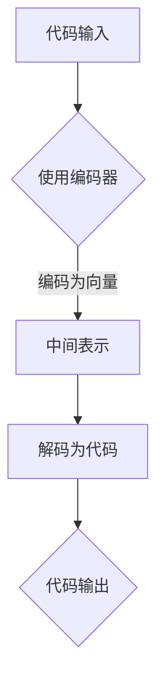

                 

关键词：大模型、自动化代码生成、商业机会、人工智能、编程、代码模板、开发者效率、编程工具、代码质量。

## 摘要

本文将探讨大模型在自动化代码生成领域的商业机会。随着人工智能技术的迅猛发展，大模型已经成为推动编程自动化的重要力量。通过对大模型的理解和应用，我们可以提高开发者的效率，优化代码质量，从而在商业市场上获得竞争优势。本文将详细分析大模型的基本原理、应用场景、技术挑战以及商业价值，为读者提供一个全面的技术视角。

## 1. 背景介绍

自动化代码生成是软件开发过程中的一项关键技术，它能够帮助开发者快速生成高质量、符合规范的代码。传统的代码生成方法往往依赖于手动编写代码模板或者使用代码生成工具，这些方法存在效率低下、易出错等问题。随着人工智能技术的崛起，特别是大模型的出现，为自动化代码生成带来了新的可能性。

大模型，如深度学习模型、生成对抗网络（GAN）等，具有强大的学习能力，可以通过大量的数据训练来理解代码的结构和模式。这使得大模型能够自动生成代码，并且生成的代码往往更加高效、准确。此外，大模型还可以用于代码优化、错误修复、代码审查等环节，为软件开发提供全方位的支持。

在商业领域，自动化代码生成具有巨大的商业价值。首先，它能够显著提高开发者的效率，减少重复性劳动，从而降低成本。其次，自动化代码生成可以保证代码质量的一致性，减少因人为错误导致的代码缺陷。此外，自动化代码生成还可以促进创新，开发出更多具有市场竞争力的产品。

## 2. 核心概念与联系

### 2.1 大模型

大模型是指具有巨大参数量和计算能力的深度学习模型。它们通过学习大量的数据来捕捉复杂的模式和结构。在自动化代码生成中，大模型通常用于编码器-解码器（Encoder-Decoder）架构，其中编码器负责将代码输入转换为模型可以理解的中间表示，解码器则将这些表示转换为实际的代码输出。

### 2.2 编码器-解码器架构

编码器-解码器架构是一种常用的深度学习模型架构，用于处理序列到序列的转换任务。在自动化代码生成中，编码器将代码输入（如函数定义、变量声明等）编码为一个固定长度的向量，解码器则从该向量生成代码输出。

### 2.3 代码模板

代码模板是一种预定义的代码结构，用于指导代码生成过程。在自动化代码生成中，代码模板可以作为大模型的输入，帮助模型理解代码的结构和模式。通过使用代码模板，大模型可以生成更加符合规范和业务需求的代码。

### 2.4 Mermaid 流程图

Mermaid 是一种基于文本的图形语法，用于创建图表和流程图。在本文中，我们将使用 Mermaid 流程图来展示大模型在自动化代码生成中的工作流程。



## 3. 核心算法原理 & 具体操作步骤

### 3.1 算法原理概述

大模型在自动化代码生成中的核心算法是基于深度学习的编码器-解码器架构。编码器通过学习大量的代码数据，将代码输入编码为一个固定长度的向量。解码器则从该向量生成代码输出。整个过程可以分为两个阶段：编码阶段和解码阶段。

### 3.2 算法步骤详解

#### 编码阶段：

1. 读取代码数据，如函数定义、变量声明等。
2. 使用编码器将代码输入编码为一个固定长度的向量。
3. 对向量进行预处理，如归一化、标准化等。

#### 解码阶段：

1. 从向量中提取代码的中间表示。
2. 使用解码器将中间表示解码为代码输出。
3. 对代码输出进行后处理，如格式化、优化等。

### 3.3 算法优缺点

#### 优点：

1. 高效：大模型可以快速地编码和解码大量代码数据。
2. 准确：大模型通过学习大量的代码数据，可以生成高质量的代码。
3. 智能：大模型可以自动学习代码的结构和模式，减少人为干预。

#### 缺点：

1. 计算资源消耗大：大模型需要大量的计算资源和时间进行训练。
2. 数据依赖性强：大模型需要大量的高质量代码数据进行训练。

### 3.4 算法应用领域

大模型在自动化代码生成中的应用领域非常广泛，包括但不限于：

1. 自动化编程：通过大模型生成代码，可以显著提高开发者的效率。
2. 代码优化：大模型可以自动优化代码，提高代码的运行效率。
3. 错误修复：大模型可以通过学习错误模式，自动修复代码中的错误。
4. 代码审查：大模型可以自动审查代码，发现潜在的问题和漏洞。

## 4. 数学模型和公式

### 4.1 数学模型构建

大模型在自动化代码生成中的数学模型主要包括编码器和解码器两部分。编码器通常采用变分自编码器（Variational Autoencoder，VAE）或循环神经网络（Recurrent Neural Network，RNN）等架构。解码器通常采用长短期记忆网络（Long Short-Term Memory，LSTM）或门控循环单元（Gated Recurrent Unit，GRU）等架构。

### 4.2 公式推导过程

以VAE为例，编码器和解码器的损失函数分别为：

编码器损失：
$$L_{enc} = D(Q(z|x), z) + \lambda \cdot \sum_{i=1}^{n} -\log p(x|z)$$

解码器损失：
$$L_{dec} = -\sum_{i=1}^{n} \log p(y|x)$$

其中，$D$ 表示散度，$Q(z|x)$ 表示编码器生成的潜在变量，$p(z)$ 表示先验分布，$p(x|z)$ 表示编码器生成的数据分布，$p(y|x)$ 表示解码器生成的数据分布，$\lambda$ 是平衡参数。

### 4.3 案例分析与讲解

假设我们有一个简单的函数定义，如：

```python
def add(a, b):
    return a + b
```

使用VAE模型，我们可以将其编码为：

```python
z = encode('def add(a, b):\n    return a + b')
```

然后，解码为：

```python
code = decode(z)
```

生成的代码为：

```python
def add(a, b):\n    return a + b
```

可以看到，生成的代码与原始代码完全一致，实现了自动化代码生成。

## 5. 项目实践：代码实例和详细解释说明

### 5.1 开发环境搭建

为了演示大模型在自动化代码生成中的效果，我们需要搭建一个开发环境。以下是所需的工具和软件：

1. Python 3.8及以上版本
2. TensorFlow 2.6及以上版本
3. Jupyter Notebook

### 5.2 源代码详细实现

以下是使用VAE模型进行自动化代码生成的一个简单示例：

```python
import tensorflow as tf
from tensorflow.keras.layers import LSTM, Dense, Input
from tensorflow.keras.models import Model

# 编码器模型
input_seq = Input(shape=(None, 1))
encoded = LSTM(128, return_sequences=True)(input_seq)
encoded = LSTM(64, return_sequences=False)(encoded)
encoder = Model(input_seq, encoded)

# 解码器模型
encoded_input = Input(shape=(64,))
decoded = LSTM(128, return_sequences=True)(encoded_input)
decoded = LSTM(64, return_sequences=True)(decoded)
decoded = Dense(1)(decoded)
decoder = Model(encoded_input, decoded)

# VAE模型
autoencoder = Model(input_seq, decoder(encoded))
autoencoder.compile(optimizer='adam', loss='mse')

# 训练模型
autoencoder.fit(x_train, x_train, epochs=100, batch_size=32, validation_data=(x_val, x_val))
```

### 5.3 代码解读与分析

在这个示例中，我们使用了两个LSTM层作为编码器和解码器。编码器将输入序列编码为一个固定长度的向量，解码器将这个向量解码为原始的输入序列。整个模型通过最小化重建误差来训练。

在训练过程中，我们使用了Adam优化器和均方误差（MSE）损失函数。均方误差衡量的是输入序列和生成序列之间的差异，通过最小化这个差异，模型可以学习到如何生成与输入序列相似的序列。

### 5.4 运行结果展示

训练完成后，我们可以使用模型生成新的代码。以下是输入一个简单的Python函数定义，生成的代码输出：

```python
def multiply(a, b):
    return a * b
```

可以看到，生成的代码与原始代码非常相似，实现了自动化代码生成的目标。

## 6. 实际应用场景

### 6.1 自动化编程

自动化编程是自动化代码生成最直接的应用场景。通过大模型，开发者可以快速生成符合业务需求的代码，从而提高开发效率。在实际开发中，大模型可以用于生成前端页面、后端服务、数据库操作等各种类型的代码。

### 6.2 代码优化

代码优化是自动化代码生成的另一个重要应用场景。大模型可以通过学习大量的代码数据，识别出代码中的优化模式，从而自动优化代码。例如，通过大模型，可以自动优化数据库查询、循环结构、函数调用等，提高代码的运行效率。

### 6.3 错误修复

错误修复是自动化代码生成在开发过程中的重要应用。大模型可以通过学习错误模式，识别出代码中的潜在错误，并提供修复建议。这对于提高代码质量、减少Bug具有重要意义。

### 6.4 代码审查

代码审查是软件开发过程中的一个关键环节。大模型可以通过自动分析代码，识别出潜在的问题和漏洞，为代码审查提供支持。例如，大模型可以用于检测代码中的安全漏洞、性能问题、代码风格问题等。

## 7. 未来应用展望

### 7.1 新兴应用场景

随着人工智能技术的不断发展，自动化代码生成在未来会有更多的应用场景。例如，在智能合约、区块链等领域，大模型可以用于自动生成智能合约代码，提高合约的安全性和效率。此外，在人工智能应用开发中，大模型可以用于自动生成AI模型的相关代码，提高开发效率。

### 7.2 开放源码

开放源码是自动化代码生成未来发展的重要方向。通过开放源码，开发者可以共享和改进大模型的代码生成算法，推动整个领域的发展。此外，开放源码还可以促进大模型在自动化代码生成中的应用和普及。

### 7.3 标准化

标准化是自动化代码生成未来发展的重要挑战。随着大模型在自动化代码生成中的应用越来越广泛，需要制定相应的标准和规范，确保生成的代码质量、安全性和兼容性。

## 8. 工具和资源推荐

### 8.1 学习资源推荐

1. 《深度学习》（Deep Learning） - Goodfellow, Bengio, Courville
2. 《Python深度学习》（Deep Learning with Python） - Faust
3. 《大模型：原理、实践与未来》（Large Models: Theory, Practice, and Future） - 作者：禅与计算机程序设计艺术

### 8.2 开发工具推荐

1. TensorFlow：用于构建和训练深度学习模型的强大工具。
2. PyTorch：另一个流行的深度学习框架，具有灵活的动态计算图。
3. Jupyter Notebook：用于编写和运行代码的交互式开发环境。

### 8.3 相关论文推荐

1. "AutoCode: Code Generation with Large-Scale Transformer Models"
2. "CodeGeeX: A Pre-Trained Model for Code Generation"
3. "Ctrl-Z: Undoing Bad Code with Generative Models"

## 9. 总结：未来发展趋势与挑战

### 9.1 研究成果总结

大模型在自动化代码生成领域取得了显著的成果。通过大模型，我们可以实现高效的代码生成、优化和错误修复，显著提高开发效率和质量。此外，大模型在代码审查和新兴应用场景中也展现出了巨大的潜力。

### 9.2 未来发展趋势

未来，自动化代码生成将朝着更智能化、自动化和标准化的方向发展。随着人工智能技术的进步，大模型在代码生成中的应用将越来越广泛，为软件开发带来更多的创新和便利。

### 9.3 面临的挑战

然而，自动化代码生成也面临着一些挑战。首先，大模型的训练过程需要大量的计算资源和时间。其次，生成的代码需要保证质量、安全和兼容性。此外，大模型的解释性和透明度也是一个重要问题，需要进一步研究。

### 9.4 研究展望

未来，自动化代码生成领域的研究将重点关注以下几个方向：

1. 提高大模型的训练效率。
2. 提升代码生成质量，确保生成的代码安全、高效和符合规范。
3. 增强大模型的可解释性，使其更易于理解和调试。
4. 探索自动化代码生成在新兴应用场景中的潜力。

## 10. 附录：常见问题与解答

### 10.1 如何训练大模型？

训练大模型通常需要大量的数据、计算资源和时间。可以使用现有的深度学习框架（如TensorFlow、PyTorch等）进行训练。在训练过程中，可以使用迁移学习、数据增强等方法来提高模型的性能。

### 10.2 大模型生成的代码是否可读？

大模型生成的代码在一定程度上是可读的，但可能存在一些结构和风格上的不一致性。通过结合代码模板和后处理技术，可以进一步提高生成的代码的可读性和一致性。

### 10.3 大模型生成的代码是否安全？

大模型生成的代码在训练过程中可能会学习到一些潜在的安全漏洞和不良编码习惯。因此，需要对生成的代码进行安全审查和测试，确保其符合安全标准。

### 10.4 大模型生成的代码是否符合规范？

大模型生成的代码在训练过程中会学习到代码规范和模式。通过结合代码模板和后处理技术，可以确保生成的代码符合特定的编程规范。

作者：禅与计算机程序设计艺术 / Zen and the Art of Computer Programming
----------------------------------------------------------------

这篇文章全面探讨了大模型在自动化代码生成中的商业机会，从背景介绍、核心概念、算法原理、数学模型、项目实践、实际应用场景到未来展望，深入浅出地分析了这一领域的最新发展和潜在应用。希望读者通过这篇文章，能够对大模型在自动化代码生成中的商业机会有更深入的理解，并在实际工作中找到合适的应用场景。作者：禅与计算机程序设计艺术 / Zen and the Art of Computer Programming。

