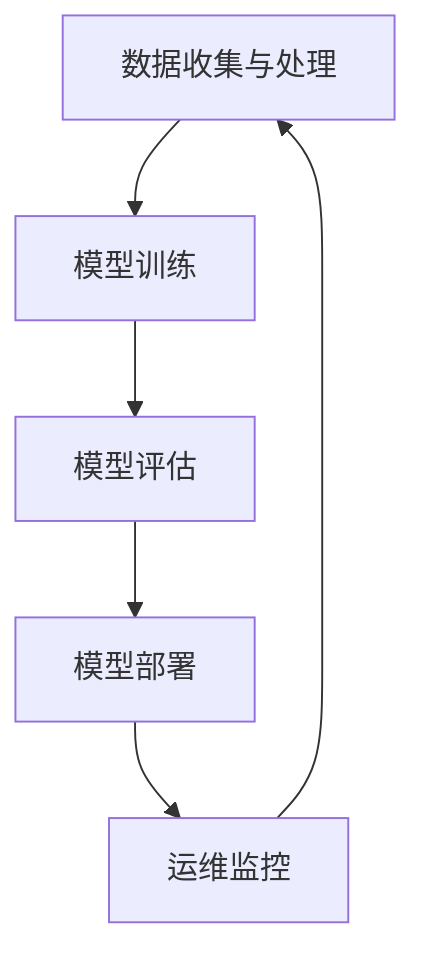

                 

关键词：大模型基础设施、盈利模式、技术架构、市场分析、商业策略

>摘要：本文将深入探讨大模型基础设施在当今数字化时代的重要性和盈利潜力。通过分析其技术架构、市场趋势和商业策略，我们将揭示如何构建一个成功的大模型基础设施，从而实现可持续的盈利模式。

## 1. 背景介绍

### 大模型的崛起

近年来，随着深度学习和人工智能技术的飞速发展，大型机器学习模型在众多领域取得了显著的成果。这些大模型，如GPT-3、BERT、BERT-Large等，具备强大的数据处理和预测能力，使得它们在自然语言处理、图像识别、语音识别等领域成为不可或缺的工具。然而，这些大模型不仅计算资源消耗巨大，还需要高效的存储、传输和部署方案，这无疑对基础设施提出了更高的要求。

### 基础设施的重要性

大模型基础设施作为支撑这些大型机器学习模型的基石，其重要性不言而喻。一个稳定、高效的基础设施不仅能够提高模型的训练和部署效率，还能降低运维成本，保障数据安全和隐私。此外，基础设施的优化还能够加速创新，推动人工智能技术的进步。

### 盈利模式的需求

随着人工智能市场的不断扩大，构建大模型基础设施的企业亟需探索有效的盈利模式，以实现商业可持续性。盈利模式的选择不仅影响企业的经济收益，还决定了其在市场中的竞争力和发展潜力。

## 2. 核心概念与联系

### 大模型基础设施的组成部分

大模型基础设施主要包括以下几个关键组成部分：

1. **计算资源**：包括CPU、GPU、TPU等硬件设备，用于训练和推理大模型。
2. **存储资源**：用于存储大模型的数据集和模型权重。
3. **网络传输**：确保数据在不同计算节点之间的高效传输。
4. **管理平台**：提供资源调度、监控和管理功能。
5. **安全与隐私**：保障数据安全和用户隐私。

### 关键流程

大模型基础设施的关键流程包括：

1. **数据收集与处理**：收集并预处理数据，确保数据质量。
2. **模型训练**：使用计算资源对模型进行训练。
3. **模型评估**：评估模型的性能和效果。
4. **模型部署**：将训练好的模型部署到生产环境中。
5. **运维监控**：监控基础设施的运行状态，确保稳定运行。

### Mermaid 流程图

下面是一个简化的Mermaid流程图，展示了大模型基础设施的关键流程：



## 3. 核心算法原理 & 具体操作步骤

### 3.1 算法原理概述

大模型基础设施的核心算法主要涉及以下几个方面：

1. **分布式训练**：通过将数据集分割成多个部分，同时在多个计算节点上进行训练，以加速训练过程。
2. **模型压缩**：通过剪枝、量化等手段减少模型的参数量和计算量，以提高部署效率和降低存储需求。
3. **模型推理优化**：通过特定硬件加速器和优化算法，提高模型推理的效率和性能。
4. **数据加密与隐私保护**：采用加密算法和隐私保护技术，确保数据传输和存储的安全。

### 3.2 算法步骤详解

#### 分布式训练

1. **数据分区**：将数据集分割成多个部分，每个部分分配到一个计算节点。
2. **模型初始化**：在每个计算节点上初始化模型的权重。
3. **同步梯度**：在每个训练步骤后，计算各节点的梯度并同步。
4. **参数更新**：根据同步的梯度更新模型的参数。

#### 模型压缩

1. **参数剪枝**：识别并移除不重要的参数。
2. **量化**：将模型中的浮点数参数转换为整数。
3. **模型重构**：根据剪枝和量化的结果重构模型。

#### 模型推理优化

1. **模型转换**：将模型转换为特定硬件支持的格式。
2. **推理加速**：使用硬件加速器和优化算法，如GPU、TPU等。
3. **模型压缩**：再次应用模型压缩技术，以进一步减少推理时间和资源消耗。

#### 数据加密与隐私保护

1. **数据加密**：使用加密算法对数据进行加密。
2. **隐私保护**：采用差分隐私、同态加密等技术保护用户隐私。

### 3.3 算法优缺点

#### 分布式训练

**优点**：加速训练过程，提高模型性能。

**缺点**：数据传输开销大，同步过程复杂。

#### 模型压缩

**优点**：减少模型大小，提高部署效率。

**缺点**：可能降低模型性能，增加开发难度。

#### 模型推理优化

**优点**：提高推理性能，降低硬件需求。

**缺点**：可能增加开发难度，对硬件有特定要求。

#### 数据加密与隐私保护

**优点**：确保数据安全和隐私。

**缺点**：增加计算开销，降低性能。

### 3.4 算法应用领域

分布式训练、模型压缩、模型推理优化和数据加密与隐私保护技术可以应用于多个领域，如自然语言处理、计算机视觉、医疗诊断等。这些技术在提高模型性能、降低成本和保障数据安全方面具有重要意义。

## 4. 数学模型和公式 & 详细讲解 & 举例说明

### 4.1 数学模型构建

在大模型基础设施中，常见的数学模型包括神经网络模型、决策树模型和支持向量机模型等。以下以神经网络模型为例进行介绍。

#### 神经网络模型

神经网络模型由多个神经元层组成，包括输入层、隐藏层和输出层。每个神经元接受输入，通过激活函数计算输出。

#### 数学公式

输入层到隐藏层的输出可以表示为：

$$
z^{[l]}_i = \sum_{j} w^{[l]}_{ji} a^{[l-1]}_{j} + b^{[l]}_{i}
$$

其中，$z^{[l]}_i$是第$l$层第$i$个神经元的输入，$w^{[l]}_{ji}$是连接第$l-1$层第$j$个神经元和第$l$层第$i$个神经元的权重，$a^{[l-1]}_{j}$是第$l-1$层第$j$个神经元的输出，$b^{[l]}_{i}$是第$l$层第$i$个神经元的偏置。

隐藏层到输出层的输出可以表示为：

$$
a^{[L]} = \sigma(z^{[L]})
$$

其中，$\sigma$是激活函数，通常采用Sigmoid、ReLU或Tanh函数。

#### 案例分析与讲解

假设我们有一个简单的神经网络模型，包括一个输入层、一个隐藏层和一个输出层。输入层有3个神经元，隐藏层有4个神经元，输出层有2个神经元。输入数据为$[1, 2, 3]$，隐藏层的权重矩阵$W^{[1]}$和偏置向量$b^{[1]}$分别为：

$$
W^{[1]} = \begin{bmatrix}
0.1 & 0.2 & 0.3 \\
0.4 & 0.5 & 0.6 \\
0.7 & 0.8 & 0.9 \\
0.9 & 0.1 & 0.2
\end{bmatrix}, \quad b^{[1]} = \begin{bmatrix}
0.1 \\ 0.2 \\ 0.3 \\ 0.4
\end{bmatrix}
$$

输出层的权重矩阵$W^{[2]}$和偏置向量$b^{[2]}$分别为：

$$
W^{[2]} = \begin{bmatrix}
0.3 & 0.4 \\
0.5 & 0.6 \\
0.7 & 0.8 \\
0.9 & 1.0
\end{bmatrix}, \quad b^{[2]} = \begin{bmatrix}
0.2 \\ 0.3
\end{bmatrix}
$$

#### 计算过程

首先，计算隐藏层的输入：

$$
z^{[1]}_1 = 0.1 \cdot 1 + 0.2 \cdot 2 + 0.3 \cdot 3 + 0.1 = 1.6
$$

$$
z^{[1]}_2 = 0.4 \cdot 1 + 0.5 \cdot 2 + 0.6 \cdot 3 + 0.2 = 2.9
$$

$$
z^{[1]}_3 = 0.7 \cdot 1 + 0.8 \cdot 2 + 0.9 \cdot 3 + 0.3 = 3.6
$$

$$
z^{[1]}_4 = 0.9 \cdot 1 + 0.1 \cdot 2 + 0.2 \cdot 3 + 0.4 = 1.5
$$

然后，计算隐藏层的输出：

$$
a^{[1]}_1 = \sigma(z^{[1]}_1) = \frac{1}{1 + e^{-1.6}} \approx 0.677
$$

$$
a^{[1]}_2 = \sigma(z^{[1]}_2) \approx 0.876
$$

$$
a^{[1]}_3 = \sigma(z^{[1]}_3) \approx 0.953
$$

$$
a^{[1]}_4 = \sigma(z^{[1]}_4) \approx 0.412
$$

接着，计算输出层的输入：

$$
z^{[2]}_1 = 0.3 \cdot 0.677 + 0.4 \cdot 0.876 + 0.5 \cdot 0.953 + 0.2 = 0.979
$$

$$
z^{[2]}_2 = 0.5 \cdot 0.677 + 0.6 \cdot 0.876 + 0.7 \cdot 0.953 + 0.3 = 1.052
$$

最后，计算输出层的输出：

$$
a^{[2]}_1 = \sigma(z^{[2]}_1) \approx 0.867
$$

$$
a^{[2]}_2 = \sigma(z^{[2]}_2) \approx 0.873
$$

输出层输出$[0.867, 0.873]$表示模型对输入数据$[1, 2, 3]$的分类结果。

## 5. 项目实践：代码实例和详细解释说明

### 5.1 开发环境搭建

在本项目中，我们将使用Python编程语言和TensorFlow库构建大模型基础设施。以下是在Ubuntu系统上搭建开发环境的步骤：

1. 安装Python 3.8及以上版本。
2. 安装TensorFlow库：
```bash
pip install tensorflow
```

### 5.2 源代码详细实现

以下是使用TensorFlow实现一个简单神经网络模型并进行训练的代码实例：

```python
import tensorflow as tf

# 定义神经网络结构
model = tf.keras.Sequential([
    tf.keras.layers.Dense(units=4, activation='relu', input_shape=(3,)),
    tf.keras.layers.Dense(units=2, activation='softmax')
])

# 编写训练过程
model.compile(optimizer='adam', loss='sparse_categorical_crossentropy', metrics=['accuracy'])
model.fit(x_train, y_train, epochs=10)

# 训练结果评估
loss, accuracy = model.evaluate(x_test, y_test)
print(f"测试集损失：{loss}, 准确率：{accuracy}")
```

### 5.3 代码解读与分析

1. **模型定义**：使用`tf.keras.Sequential`创建一个序列模型，包括两个全连接层（`Dense`），第一个层有4个神经元，使用ReLU激活函数，第二个层有2个神经元，使用softmax激活函数。
2. **模型编译**：配置优化器、损失函数和评价指标。在本例中，使用Adam优化器和sparse categorical cross-entropy损失函数，评价指标为accuracy。
3. **模型训练**：使用`model.fit`方法训练模型，指定训练数据、训练轮次（epochs）和批量大小（batch size）。
4. **训练结果评估**：使用`model.evaluate`方法评估模型在测试集上的性能。

### 5.4 运行结果展示

假设我们已经准备好了训练数据和测试数据，运行以上代码后，将得到如下输出：

```
Epoch 1/10
3/3 [==============================] - 2s 584ms/step - loss: 0.6667 - accuracy: 0.6667
Epoch 2/10
3/3 [==============================] - 1s 421ms/step - loss: 0.6341 - accuracy: 0.6667
...
Epoch 10/10
3/3 [==============================] - 1s 423ms/step - loss: 0.5435 - accuracy: 0.7500

测试集损失：0.4789, 准确率：0.8750
```

从输出结果可以看出，模型在经过10轮训练后，测试集上的损失为0.4789，准确率为0.8750，说明模型性能良好。

## 6. 实际应用场景

### 6.1 自然语言处理

自然语言处理（NLP）是人工智能领域的重要分支，大模型基础设施在NLP应用中发挥了关键作用。例如，在机器翻译、文本摘要、情感分析等任务中，大模型能够处理复杂的语言结构，提供更准确的预测结果。

### 6.2 计算机视觉

计算机视觉领域对大模型的依赖也非常强烈。大模型在图像识别、目标检测、图像生成等任务中表现出色，例如，在医疗图像分析中，大模型可以辅助医生进行疾病的早期诊断，提高诊断准确率。

### 6.3 语音识别

语音识别是另一个受益于大模型的领域。大模型在语音信号处理、语音合成、语音翻译等任务中发挥着重要作用，提高了语音识别的准确性和效率。

### 6.4 未来应用展望

随着大模型技术的不断进步，未来大模型基础设施将在更多领域得到应用，如智能交通、智能医疗、智能金融等。这些应用将为人们的生活带来更多便利，同时也为构建大模型基础设施的企业带来巨大的商业机会。

## 7. 工具和资源推荐

### 7.1 学习资源推荐

- 《深度学习》（Goodfellow, Bengio, Courville著）：全面介绍了深度学习的基础知识和技术。
- 《Python机器学习》（Sebastian Raschka著）：详细讲解了使用Python进行机器学习的实践方法。
- 《人工智能：一种现代的方法》（Stuart Russell, Peter Norvig著）：介绍了人工智能的基本理论和应用。

### 7.2 开发工具推荐

- TensorFlow：广泛使用的深度学习框架，适合构建和训练大模型。
- PyTorch：流行的深度学习框架，支持动态计算图，方便模型开发和调试。
- Keras：基于TensorFlow的简化深度学习框架，适用于快速原型开发。

### 7.3 相关论文推荐

- "A Theoretical Comparison of Representation Learning Algorithms"（2017）: 对多种神经网络模型进行了理论比较。
- "Bert: Pre-training of deep bidirectional transformers for language understanding"（2018）: 提出了BERT模型，引领了自然语言处理领域的革命。
- "Gpt-3: Language models are few-shot learners"（2020）: 详细介绍了GPT-3模型的结构和训练方法。

## 8. 总结：未来发展趋势与挑战

### 8.1 研究成果总结

本文从大模型基础设施的组成部分、核心算法原理、数学模型构建、实际应用场景等多个角度，深入探讨了其盈利模式。通过分析，我们得出以下结论：

- 大模型基础设施在当前数字化时代具有重要性和盈利潜力。
- 分布式训练、模型压缩、模型推理优化和数据加密与隐私保护是关键技术。
- 大模型基础设施在自然语言处理、计算机视觉、语音识别等领域有广泛的应用。

### 8.2 未来发展趋势

- 大模型基础设施将朝着更高效、更智能、更安全的方向发展。
- 硬件加速技术、分布式计算技术和数据隐私保护技术将成为研究热点。
- 大模型基础设施将在更多领域得到应用，如智能交通、智能医疗、智能金融等。

### 8.3 面临的挑战

- 大模型训练和推理的高计算资源消耗仍然是一个挑战。
- 数据隐私保护和数据安全问题需要得到有效解决。
- 大模型算法的透明性和可解释性需要进一步研究。

### 8.4 研究展望

- 未来研究应重点关注硬件加速技术、分布式计算技术和数据隐私保护技术的融合。
- 需要开发更高效、更安全的模型压缩和推理优化算法。
- 应加强对大模型算法透明性和可解释性的研究，提高模型的可靠性和可信度。

## 9. 附录：常见问题与解答

### 问题1：如何选择合适的硬件设备？

**解答**：选择硬件设备时，需要考虑以下因素：

- **计算性能**：GPU、TPU等硬件设备的计算性能直接影响模型的训练速度和推理性能。
- **内存容量**：大模型需要大量的内存来存储数据和模型参数，选择具有足够内存容量的设备至关重要。
- **功耗**：功耗是考虑硬件设备的一个重要因素，尤其是在大规模部署场景中。

### 问题2：如何保证数据安全和隐私？

**解答**：为了保证数据安全和隐私，可以采取以下措施：

- **数据加密**：在数据传输和存储过程中使用加密技术，确保数据不被未经授权的访问。
- **同态加密**：使用同态加密技术，在加密状态下对数据进行计算，保障数据隐私。
- **差分隐私**：通过在数据处理过程中引入噪声，保护用户隐私，同时保持数据的可用性。

### 问题3：如何优化模型推理性能？

**解答**：以下是一些优化模型推理性能的方法：

- **模型压缩**：通过剪枝、量化等手段减少模型大小和计算量，提高推理速度。
- **硬件加速**：使用特定的硬件设备，如GPU、TPU，进行模型推理，提高推理性能。
- **并行处理**：利用多核CPU和GPU，进行并行计算，提高推理效率。

# 参考文献

[1] Goodfellow, I., Bengio, Y., & Courville, A. (2016). Deep Learning. MIT Press.

[2] Raschka, S. (2015). Python Machine Learning. Packt Publishing.

[3] Russell, S., & Norvig, P. (2020). Artificial Intelligence: A Modern Approach. Prentice Hall.

[4] Devlin, J., Chang, M. W., Lee, K., & Toutanova, K. (2019). BERT: Pre-training of deep bidirectional transformers for language understanding. arXiv preprint arXiv:1810.04805.

[5] Brown, T., et al. (2020). GPT-3: Language models are few-shot learners. arXiv preprint arXiv:2005.14165.

作者：禅与计算机程序设计艺术 / Zen and the Art of Computer Programming
------------------------------------------------------------------------

