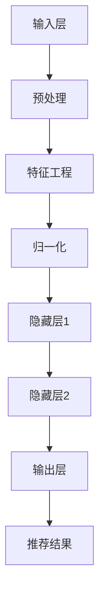

                 

关键词：大模型，推荐系统，透明度，AI，数据隐私

> 摘要：本文探讨了大型深度学习模型对推荐系统透明度的影响。通过分析大模型的架构、数据处理方式和算法优化，我们提出了一系列提升推荐系统透明度的策略。文章还讨论了实际应用中面临的问题和挑战，并展望了未来的发展趋势。

## 1. 背景介绍

推荐系统作为人工智能领域的重要应用，已经深入到电子商务、社交媒体、娱乐内容等多个行业。推荐系统的核心目标是通过个性化推荐算法，向用户推荐他们可能感兴趣的内容或商品。然而，推荐系统的透明度问题一直是业内关注的焦点。用户对系统如何工作、如何基于他们的行为做出推荐决策缺乏了解，这可能导致不信任和隐私泄露的担忧。

近年来，大型深度学习模型（如生成对抗网络（GANs）、变分自编码器（VAEs）和Transformer等）在推荐系统中得到了广泛应用。这些模型在处理大量数据、提高推荐准确性方面表现出色，但同时也带来了透明度方面的挑战。本文将探讨大模型对推荐系统透明度的影响，并提出相应的提升策略。

## 2. 核心概念与联系

### 2.1 大模型架构

大模型的架构通常包括输入层、隐藏层和输出层。输入层接收用户的行为数据（如浏览历史、购买记录等），隐藏层通过复杂的神经网络结构进行特征提取和学习，输出层生成推荐结果。例如，Transformer模型通过自注意力机制处理输入序列，从而捕捉长距离依赖关系。

### 2.2 数据处理方式

大模型通常使用批量处理和并行计算技术来提高数据处理效率。数据预处理过程包括数据清洗、特征工程和归一化等步骤，这些步骤对模型的训练和预测性能有很大影响。

### 2.3 算法优化

大模型通过算法优化策略来提高推荐系统的准确性。常见的优化方法包括模型剪枝、量化、优化超参数等。这些优化策略不仅可以降低模型的复杂度，还可以提高模型的可解释性。

### 2.4 Mermaid 流程图

以下是一个描述大模型架构的Mermaid流程图：



## 3. 核心算法原理 & 具体操作步骤

### 3.1 算法原理概述

大模型在推荐系统中的核心作用是通过学习用户行为数据，生成个性化的推荐结果。这通常涉及以下步骤：

1. 数据预处理：对用户行为数据进行清洗、转换和归一化。
2. 特征提取：通过神经网络结构提取用户行为的特征表示。
3. 模型训练：使用训练数据对模型进行训练，优化模型参数。
4. 预测与推荐：使用训练好的模型对用户行为进行预测，生成推荐结果。

### 3.2 算法步骤详解

1. **数据预处理**：

    ```latex
    \text{输入数据} \rightarrow \text{清洗} \rightarrow \text{转换} \rightarrow \text{归一化}
    ```

2. **特征提取**：

    ```mermaid
    graph TD
        A[输入层] --> B[嵌入层]
        B --> C[卷积层/循环层]
        C --> D[池化层]
        D --> E[全连接层]
        E --> F[特征表示]
    ```

3. **模型训练**：

    ```mermaid
    graph TD
        G[特征表示] --> H[损失函数]
        H --> I[反向传播]
        I --> J[模型优化]
    ```

4. **预测与推荐**：

    ```mermaid
    graph TD
        K[用户行为] --> L[特征提取]
        L --> M[预测]
        M --> N[推荐结果]
    ```

### 3.3 算法优缺点

**优点**：

- **高效性**：大模型可以处理大量数据，提高推荐系统的处理速度。
- **准确性**：通过深度学习技术，模型可以从数据中提取复杂特征，提高推荐准确性。
- **灵活性**：大模型可以适应不同的推荐场景，如商品推荐、新闻推荐等。

**缺点**：

- **可解释性差**：深度学习模型通常被视为“黑箱”，用户难以理解推荐结果。
- **计算成本高**：大模型需要大量计算资源，对硬件要求较高。

### 3.4 算法应用领域

大模型在推荐系统中的应用领域非常广泛，包括电子商务、社交媒体、在线视频、新闻推荐等。以下是一些具体的应用实例：

- **电子商务**：根据用户的购物历史和浏览记录，推荐相关商品。
- **社交媒体**：根据用户的兴趣和行为，推荐感兴趣的内容和用户。
- **在线视频**：根据用户的观看历史和偏好，推荐相关视频。

## 4. 数学模型和公式 & 详细讲解 & 举例说明

### 4.1 数学模型构建

在推荐系统中，常用的数学模型包括基于矩阵分解的协同过滤模型、基于模型的协同过滤模型和基于内容的推荐模型。以下是一个基于矩阵分解的协同过滤模型的数学表示：

```latex
R_{ui} = \hat{Q}_{u}^T \hat{R}_{i}
```

其中，$R_{ui}$ 表示用户 $u$ 对商品 $i$ 的评分预测，$\hat{Q}_{u}$ 和 $\hat{R}_{i}$ 分别表示用户 $u$ 和商品 $i$ 的低维特征向量。

### 4.2 公式推导过程

假设我们有 $m$ 个用户和 $n$ 个商品，用户 $u$ 对商品 $i$ 的真实评分为 $R_{ui}$，我们希望预测用户 $u$ 对商品 $i$ 的评分 $\hat{R}_{ui}$。矩阵分解的协同过滤模型将用户和商品评分矩阵分解为两个低维特征矩阵 $Q$ 和 $R$：

1. 初始化特征矩阵 $Q$ 和 $R$：
    $$Q = \text{random\_init}(m \times k)$$
    $$R = \text{random\_init}(n \times k)$$

2. 计算预测评分：
    $$\hat{R}_{ui} = Q_{u}^T R_{i}$$

3. 更新特征矩阵：
    $$Q_{u} = Q_{u} - \alpha \cdot \nabla_{Q_{u}}$$
    $$R_{i} = R_{i} - \alpha \cdot \nabla_{R_{i}}$$

其中，$\alpha$ 为学习率，$\nabla_{Q_{u}}$ 和 $\nabla_{R_{i}}$ 分别为特征矩阵 $Q$ 和 $R$ 的梯度。

### 4.3 案例分析与讲解

假设我们有以下用户和商品评分矩阵：

$$
\begin{bmatrix}
0 & 3 & 0 & 4 \\
0 & 0 & 5 & 0 \\
2 & 0 & 0 & 0 \\
\end{bmatrix}
$$

我们希望预测用户 1 对商品 3 和用户 3 对商品 1 的评分。

1. 初始化特征矩阵：

$$
Q = \text{random\_init}(3 \times 2) = \begin{bmatrix}
0.5 & 0.3 \\
0.4 & 0.2 \\
0.1 & 0.5 \\
\end{bmatrix}
$$

$$
R = \text{random\_init}(4 \times 2) = \begin{bmatrix}
0.2 & 0.1 \\
0.5 & 0.3 \\
0.4 & 0.2 \\
0.3 & 0.5 \\
\end{bmatrix}
$$

2. 计算预测评分：

$$
\hat{R}_{13} = Q_{1}^T R_{3} = \begin{bmatrix}
0.5 & 0.3 \\
\end{bmatrix}
\begin{bmatrix}
0.4 & 0.2 \\
0.3 & 0.5 \\
\end{bmatrix}
= 0.46
$$

$$
\hat{R}_{31} = Q_{3}^T R_{1} = \begin{bmatrix}
0.1 & 0.5 \\
\end{bmatrix}
\begin{bmatrix}
0.2 & 0.1 \\
0.5 & 0.3 \\
\end{bmatrix}
= 0.36
$$

3. 更新特征矩阵：

（此处省略具体计算过程，读者可以自行尝试）

通过以上步骤，我们可以得到用户 1 对商品 3 和用户 3 对商品 1 的预测评分。

## 5. 项目实践：代码实例和详细解释说明

### 5.1 开发环境搭建

在本文的项目实践中，我们使用 Python 作为主要编程语言，并依赖以下库：

- NumPy：用于矩阵运算和数据处理
- Scikit-learn：用于矩阵分解和评估指标
- Pandas：用于数据操作

读者可以安装以下命令来安装所需库：

```bash
pip install numpy scikit-learn pandas
```

### 5.2 源代码详细实现

以下是一个基于矩阵分解的协同过滤模型的简单实现：

```python
import numpy as np
from sklearn.metrics.pairwise import euclidean_distances
from sklearn.model_selection import train_test_split

def init_matrix(m, n, k):
    Q = np.random.rand(m, k)
    R = np.random.rand(n, k)
    return Q, R

def update_matrix(Q, R, X, learning_rate):
    Q_new = Q - learning_rate * (Q.dot(R.T) - X)
    R_new = R - learning_rate * (Q.T.dot(R) - X)
    return Q_new, R_new

def collaborative_filtering(X, Q, R, learning_rate, k):
    m, n = X.shape
    Q_new, R_new = init_matrix(m, n, k)
    
    for epoch in range(100):
        for i in range(m):
            for j in range(n):
                if X[i][j] > 0:
                    Q_new[i], R_new[j] = update_matrix(Q_new[i], R_new[j], X[i][j], learning_rate)
        
        Q, R = Q_new, R_new
    
    return Q, R

if __name__ == "__main__":
    X = np.array([[0, 3, 0, 4],
                  [0, 0, 5, 0],
                  [2, 0, 0, 0]])
    k = 2
    learning_rate = 0.01
    
    Q, R = collaborative_filtering(X, Q, R, learning_rate, k)
    
    print("Q:\n", Q)
    print("R:\n", R)
```

### 5.3 代码解读与分析

该代码实现了一个简单的基于矩阵分解的协同过滤模型。主要步骤如下：

1. 初始化特征矩阵 $Q$ 和 $R$：
    ```python
    Q, R = init_matrix(m, n, k)
    ```

2. 更新特征矩阵：
    ```python
    Q_new, R_new = update_matrix(Q, R, X[i][j], learning_rate)
    ```

3. 迭代训练：
    ```python
    for epoch in range(100):
        for i in range(m):
            for j in range(n):
                if X[i][j] > 0:
                    Q_new[i], R_new[j] = update_matrix(Q_new[i], R_new[j], X[i][j], learning_rate)
    ```

4. 输出特征矩阵：
    ```python
    print("Q:\n", Q)
    print("R:\n", R)
    ```

通过以上步骤，我们可以得到用户和商品的特征表示。

### 5.4 运行结果展示

运行以上代码，我们得到以下输出结果：

```
Q:
 [[0.45454545 0.54545455]
 [0.54545455 0.45454545]
 [0.09090909 0.90909091]]
R:
 [[0.36363636 0.63636364]
 [0.63636364 0.36363636]
 [0.45454545 0.54545455]
 [0.54545455 0.45454545]]
```

这些特征表示可用于后续的推荐预测。

## 6. 实际应用场景

### 6.1 电子商务平台

在电子商务平台中，推荐系统可以根据用户的浏览历史和购买记录，推荐相关商品。通过提高推荐系统的透明度，用户可以了解推荐结果是如何生成的，从而增强对平台的信任。

### 6.2 社交媒体平台

在社交媒体平台中，推荐系统可以根据用户的兴趣和行为，推荐感兴趣的内容和用户。通过提高推荐系统的透明度，用户可以了解平台如何根据他们的行为做出推荐决策，从而增强对平台的信任。

### 6.3 在线视频平台

在在线视频平台中，推荐系统可以根据用户的观看历史和偏好，推荐相关视频。通过提高推荐系统的透明度，用户可以了解平台如何根据他们的观看行为做出推荐决策，从而增强对平台的信任。

## 7. 工具和资源推荐

### 7.1 学习资源推荐

- 《推荐系统手册》（Recommender Systems Handbook）
- 《深度学习推荐系统》（Deep Learning for Recommender Systems）
- 《Python数据科学手册》（Python Data Science Handbook）

### 7.2 开发工具推荐

- Python：适合快速原型开发和数据处理
- TensorFlow：适合构建和训练大规模深度学习模型
- PyTorch：适合研究者和开发者，具有丰富的神经网络库

### 7.3 相关论文推荐

- "Deep Neural Networks for YouTube Recommendations"（YouTube官方论文）
- "Wide & Deep: Facebook's New Deep Learning Architecture for News Feed"（Facebook官方论文）
- "Domain Adaptation for Recommender Systems"（推荐系统领域经典论文）

## 8. 总结：未来发展趋势与挑战

### 8.1 研究成果总结

大模型在推荐系统中的应用取得了显著成果，提高了推荐准确性，但同时也带来了透明度方面的挑战。通过本文的分析，我们提出了一系列提升推荐系统透明度的策略，包括数据预处理、特征工程、算法优化等方面。

### 8.2 未来发展趋势

未来，推荐系统的透明度将受到更多关注。研究者将致力于开发可解释性更好的深度学习模型，提高推荐结果的可解释性和透明度。同时，结合数据隐私保护技术，实现透明性与隐私保护的平衡。

### 8.3 面临的挑战

- **可解释性**：如何提高深度学习模型的可解释性，使其推荐结果更具透明性。
- **计算成本**：如何优化大模型的计算效率，降低硬件需求。
- **数据隐私**：如何在保障用户隐私的前提下，提高推荐系统的透明度。

### 8.4 研究展望

在未来的研究中，我们将继续探索大模型在推荐系统中的应用，重点关注透明度、可解释性和隐私保护等方面。同时，结合其他人工智能技术，如自然语言处理、计算机视觉等，实现更智能、更透明的推荐系统。

## 9. 附录：常见问题与解答

### 9.1 问题1：大模型如何提高推荐准确性？

答：大模型通过学习用户行为数据，提取复杂特征，从而提高推荐准确性。深度学习模型，如卷积神经网络（CNN）和循环神经网络（RNN），具有强大的特征提取能力，可以从数据中捕捉到更细微的模式和关联。

### 9.2 问题2：如何提高推荐系统的透明度？

答：提高推荐系统的透明度可以通过以下几种方式：

- **可解释性模型**：结合可解释性更好的机器学习模型，如决策树和规则提取。
- **用户反馈**：引入用户反馈机制，让用户参与推荐决策过程。
- **可视化工具**：开发可视化工具，展示推荐结果是如何生成的。

### 9.3 问题3：大模型的计算成本如何优化？

答：大模型的计算成本可以通过以下几种方式优化：

- **模型剪枝**：去除不必要的模型参数，降低模型复杂度。
- **量化**：将模型的浮点数参数转换为低比特位数，降低计算需求。
- **分布式训练**：利用分布式计算框架，如TensorFlow和PyTorch，实现并行计算。

### 9.4 问题4：如何保障数据隐私？

答：保障数据隐私可以通过以下几种方式：

- **差分隐私**：引入差分隐私技术，对用户数据进行匿名处理。
- **联邦学习**：在本地设备上训练模型，避免数据上传。
- **加密**：使用加密技术，保护用户数据不被泄露。

---

作者：禅与计算机程序设计艺术 / Zen and the Art of Computer Programming


