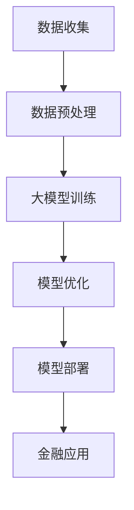

                 

关键词：大模型、金融科技、人工智能、算法、数据驱动、智能化金融

摘要：本文深入探讨了大型模型对金融科技领域的促进作用，分析了大模型在金融科技中的核心概念和架构，详细讲解了其算法原理、数学模型及公式，通过实际项目实践展示了大模型在金融科技中的具体应用，并对未来发展趋势和挑战进行了展望。

## 1. 背景介绍

随着人工智能技术的飞速发展，深度学习算法以及大型模型（如GPT、BERT等）的出现，数据驱动和智能化成为了金融科技（FinTech）领域的热点。金融科技正在通过大数据分析、机器学习和人工智能等前沿技术，彻底变革传统的金融服务模式。大模型在金融科技中的应用，不仅提升了数据处理能力，也为金融分析、风险管理、客户服务和个性化推荐等方面带来了革命性的变革。

本文将探讨大模型在金融科技中的应用，分析其核心概念、算法原理、数学模型、实际应用场景，以及未来发展的趋势和挑战。

## 2. 核心概念与联系

### 2.1 大模型概念

大模型（Large Models），通常指的是具有数十亿甚至数万亿参数的神经网络模型。这些模型能够通过大量数据训练，从中学习到复杂的模式和知识，实现高度自动化的数据处理和分析。

### 2.2 金融科技与人工智能的关系

金融科技（FinTech）与人工智能（AI）的关系密不可分。人工智能技术为金融科技提供了强大的数据处理和分析能力，使得金融机构能够更快速、准确地做出决策。同时，金融科技的应用场景也为人工智能提供了丰富的训练数据，促进了人工智能技术的不断进步。

下面是一个简化的 Mermaid 流程图，展示了大模型在金融科技中的核心概念和架构：



## 3. 核心算法原理 & 具体操作步骤

### 3.1 算法原理概述

大模型的核心算法是基于深度学习，特别是卷积神经网络（CNN）和递归神经网络（RNN）。通过多层神经网络结构，大模型可以捕捉到数据中的复杂模式和关系。

### 3.2 算法步骤详解

1. **数据收集**：从金融市场中收集大量交易数据、用户行为数据等。
2. **数据预处理**：清洗数据，进行特征工程，将数据转换为适合训练的格式。
3. **大模型训练**：使用训练数据集，通过反向传播算法进行模型训练，不断调整模型参数。
4. **模型优化**：通过验证数据集，评估模型性能，并进行超参数调整。
5. **模型部署**：将训练好的模型部署到生产环境中，进行实际应用。
6. **金融应用**：利用大模型进行金融分析、风险管理、客户服务等领域。

### 3.3 算法优缺点

**优点**：
- **强大的数据处理能力**：大模型能够处理大量数据，捕捉复杂模式。
- **自动化程度高**：模型能够自动学习数据中的规律，降低人工干预。

**缺点**：
- **计算资源需求大**：训练大模型需要大量的计算资源和时间。
- **解释性较差**：大模型的决策过程往往缺乏透明性，难以解释。

### 3.4 算法应用领域

大模型在金融科技中的主要应用领域包括：
- **金融市场预测**：利用历史数据，预测市场趋势。
- **风险管理**：评估风险，优化投资组合。
- **客户服务**：个性化推荐，提升用户体验。
- **欺诈检测**：识别和预防金融欺诈行为。

## 4. 数学模型和公式 & 详细讲解 & 举例说明

### 4.1 数学模型构建

大模型的数学基础是深度学习中的多层感知机（MLP）和循环神经网络（RNN）。以下是MLP的基本公式：

$$
z_l = \sigma(W_l \cdot a_{l-1} + b_l)
$$

其中，$z_l$ 是第 $l$ 层的激活值，$\sigma$ 是激活函数，$W_l$ 是权重矩阵，$a_{l-1}$ 是前一层的激活值，$b_l$ 是偏置。

### 4.2 公式推导过程

以多层感知机为例，我们通过反向传播算法来推导权重和偏置的更新公式。反向传播算法的基本思想是，通过计算输出误差，逆向更新每个神经元的权重和偏置。

### 4.3 案例分析与讲解

假设我们有一个二元分类问题，输入特征为 $X$，输出为 $y$。通过训练，我们得到了一个多层感知机模型，其输出为：

$$
\hat{y} = \sigma(W_2 \cdot \sigma(W_1 \cdot X + b_1) + b_2)
$$

给定一个测试样本 $X_t$，我们希望预测其标签 $y_t$。通过计算损失函数（如交叉熵损失），我们可以调整模型的权重和偏置，使得预测结果更接近真实值。

## 5. 项目实践：代码实例和详细解释说明

### 5.1 开发环境搭建

在开始项目之前，我们需要搭建一个适合训练大模型的环境。通常，我们可以使用Python和TensorFlow等工具。

### 5.2 源代码详细实现

以下是一个简单的Python代码实例，展示了如何使用TensorFlow构建一个多层感知机模型：

```python
import tensorflow as tf

# 构建模型
model = tf.keras.Sequential([
    tf.keras.layers.Dense(64, activation='relu', input_shape=(784,)),
    tf.keras.layers.Dense(10, activation='softmax')
])

# 编译模型
model.compile(optimizer='adam', loss='categorical_crossentropy', metrics=['accuracy'])

# 训练模型
model.fit(x_train, y_train, epochs=5, batch_size=64)
```

### 5.3 代码解读与分析

上述代码首先定义了一个包含两个隐藏层（一个64个神经元，一个10个神经元）的多层感知机模型。接着，使用交叉熵损失函数和adam优化器编译模型，并通过训练数据集进行训练。

### 5.4 运行结果展示

在完成模型训练后，我们可以使用测试数据集评估模型性能，并观察模型的预测结果。

```python
test_loss, test_acc = model.evaluate(x_test, y_test)
print(f"Test accuracy: {test_acc}")
```

## 6. 实际应用场景

大模型在金融科技中的实际应用场景非常广泛，以下是一些具体案例：

### 6.1 金融市场预测

利用大模型，可以对股票市场进行预测，从而帮助投资者做出更明智的决策。

### 6.2 风险管理

大模型可以评估金融产品的风险，优化投资组合，降低投资风险。

### 6.3 客户服务

通过个性化推荐，提升客户服务体验，增加客户满意度。

### 6.4 欺诈检测

利用大模型识别和预防金融欺诈行为，保护用户资金安全。

## 7. 工具和资源推荐

### 7.1 学习资源推荐

- 《深度学习》（Goodfellow, Bengio, Courville）
- 《Python深度学习》（François Chollet）

### 7.2 开发工具推荐

- TensorFlow
- PyTorch

### 7.3 相关论文推荐

- "Distributed Representations of Words and Phrases and their Compositionality"
- "Understanding Deep Learning Requires Reinterpreting the Nature of Statistical Learning"

## 8. 总结：未来发展趋势与挑战

### 8.1 研究成果总结

大模型在金融科技中的应用已经取得了显著的成果，如金融市场预测、风险管理和客户服务等。

### 8.2 未来发展趋势

- **更高效的大模型算法**：优化大模型训练算法，降低计算资源需求。
- **跨领域融合**：将大模型与其他领域（如生物信息学、自然科学）结合，拓展应用范围。

### 8.3 面临的挑战

- **数据隐私与安全**：如何在保护用户隐私的前提下，充分利用金融数据。
- **算法解释性**：提升大模型的可解释性，增强用户信任。

### 8.4 研究展望

大模型在金融科技中的应用前景广阔，未来将不断推动金融科技的发展。

## 9. 附录：常见问题与解答

### 9.1 什么是大模型？

大模型通常指的是具有数十亿甚至数万亿参数的神经网络模型，能够处理大量数据并学习复杂的模式。

### 9.2 大模型在金融科技中有哪些应用？

大模型在金融科技中的应用包括金融市场预测、风险管理、客户服务和欺诈检测等。

### 9.3 如何评估大模型的效果？

可以使用交叉验证、混淆矩阵、ROC曲线等指标来评估大模型的效果。

### 9.4 大模型有哪些优缺点？

大模型的优点包括强大的数据处理能力和自动化程度高；缺点包括计算资源需求大和解释性较差。

---

作者：禅与计算机程序设计艺术 / Zen and the Art of Computer Programming

