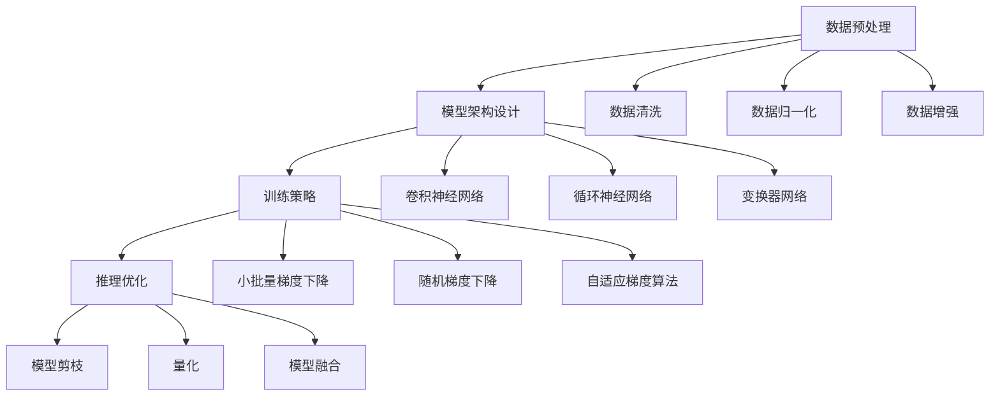

                 

 大模型，尤其是现代深度学习模型，已经成为人工智能领域中的核心组成部分。从GPT到BERT，再到AlphaGo，大模型通过其强大的底层能力，推动了技术的进步和应用的创新。然而，这些底层能力是如何构建和运作的，一直是学术界和工业界研究的热点。本文将深入探讨大模型的底层能力，并尝试对其进行抽象化的拆解，以帮助读者更好地理解这些复杂系统的运作原理。

## 文章关键词

- 大模型
- 深度学习
- 人工智能
- 神经网络
- 机器学习
- 模型优化
- 计算效率
- 应用场景

## 文章摘要

本文首先介绍了大模型在人工智能领域的背景和重要性，然后探讨了其底层能力的构成，包括数据预处理、模型架构设计、训练策略、推理优化等。通过详细的算法原理和数学模型讲解，以及实际代码实例的分析，本文旨在为读者提供一份关于大模型底层能力的全面而深入的解读。最后，本文讨论了大模型的实际应用场景和未来发展趋势，并提出了可能面临的挑战和解决方案。

## 1. 背景介绍

### 1.1 大模型的发展历程

大模型的发展可以追溯到20世纪90年代，当时神经网络的研究者开始尝试构建大规模的神经网络模型。随着计算机硬件的进步和算法的优化，特别是在2006年，Hinton等人的深度信念网络（Deep Belief Network, DBN）提出了基于 Restricted Boltzmann Machine (RBM) 的训练算法，标志着深度学习进入了一个新的阶段。

进入21世纪，尤其是2012年，AlexNet 在 ImageNet 比赛中取得的突破性成果，使得深度学习在计算机视觉领域迅速崛起。从那以后，随着数据量的增加、计算能力的提升和算法的创新，大模型不断涌现，并在语音识别、自然语言处理、游戏智能等领域取得了显著的成果。

### 1.2 大模型的重要性

大模型在人工智能中的重要性主要体现在以下几个方面：

1. **计算能力的提升**：大模型能够处理大量复杂的数据，并通过自学习算法提取有用的信息。
2. **模型的泛化能力**：大模型能够从大规模数据中学习到通用的特征表示，从而在新的任务上也能表现出良好的性能。
3. **应用的广泛性**：从图像识别、语音识别到自然语言处理，大模型几乎在所有需要机器学习和人工智能的领域都有应用。
4. **创新的推动**：大模型的崛起带来了许多新的技术和应用，如自动问答系统、自动驾驶、机器人等。

## 2. 核心概念与联系

### 2.1 数据预处理

数据预处理是构建大模型的重要环节。在这一过程中，我们通常需要进行以下步骤：

1. **数据清洗**：去除数据中的噪声和不完整的信息。
2. **数据归一化**：将数据缩放到一个统一的范围内，以避免某些特征对模型的影响过大。
3. **数据增强**：通过旋转、缩放、裁剪等方式生成新的训练样本，以增加模型的泛化能力。

### 2.2 模型架构设计

模型架构设计决定了大模型的结构和功能。当前主流的大模型架构包括：

1. **卷积神经网络（CNN）**：在计算机视觉领域表现优异，通过卷积层和池化层提取图像特征。
2. **循环神经网络（RNN）**：在序列数据处理方面具有优势，如语言模型和语音识别。
3. **变换器网络（Transformer）**：在自然语言处理领域取得了显著成果，其基于自注意力机制的设计使得模型能够捕获全局信息。

### 2.3 训练策略

训练策略直接影响大模型的性能。以下是几种常见的训练策略：

1. **小批量梯度下降（SGD）**：通过逐渐减小学习率，优化模型参数。
2. **随机梯度下降（SGD）**：每次更新参数时使用所有样本的梯度，效率更高。
3. **自适应梯度算法（如Adam）**：自适应调整学习率，在复杂任务中表现优秀。

### 2.4 推理优化

推理优化关注如何高效地使用训练好的模型进行预测。以下是几种常见的推理优化方法：

1. **模型剪枝**：通过减少模型中的参数和计算量，降低推理复杂度。
2. **量化**：将浮点数参数转换为低精度数值，以减少存储和计算需求。
3. **模型融合**：结合多个模型的预测结果，提高推理的准确性。

## 2.1 核心概念原理和架构的 Mermaid 流程图



## 3. 核心算法原理 & 具体操作步骤

### 3.1 算法原理概述

大模型的算法原理主要涉及以下几个方面：

1. **神经网络**：神经网络是构建大模型的基础，其通过多层节点（神经元）模拟人类大脑的思维方式。
2. **反向传播**：反向传播算法用于计算模型参数的梯度，以优化模型。
3. **正则化**：正则化技术用于防止模型过拟合，提高模型的泛化能力。

### 3.2 算法步骤详解

1. **初始化模型参数**：随机初始化模型参数，通常使用较小的正态分布。
2. **前向传播**：将输入数据通过模型进行计算，得到预测结果。
3. **计算损失函数**：使用实际输出和预测结果计算损失函数，以评估模型的性能。
4. **反向传播**：计算损失函数关于模型参数的梯度，以更新模型参数。
5. **优化参数**：使用梯度下降或其他优化算法更新模型参数，以最小化损失函数。

### 3.3 算法优缺点

- **优点**：
  - **强大的表达能力**：神经网络能够通过多层非线性变换提取复杂的数据特征。
  - **自动特征学习**：不需要人工设计特征，模型能够自动学习数据中的有用信息。
  - **灵活的架构**：神经网络可以根据不同的任务需求设计出各种不同的模型架构。

- **缺点**：
  - **训练成本高**：大模型通常需要大量的数据和计算资源进行训练。
  - **过拟合风险**：大模型容易在训练数据上表现优异，但在未见过的数据上表现不佳。
  - **解释性差**：神经网络模型的内部机制复杂，难以解释。

### 3.4 算法应用领域

- **计算机视觉**：用于图像分类、目标检测、图像生成等。
- **自然语言处理**：用于文本分类、机器翻译、情感分析等。
- **语音识别**：用于语音识别、语音合成等。
- **游戏智能**：用于游戏AI，如AlphaGo。

## 4. 数学模型和公式 & 详细讲解 & 举例说明

### 4.1 数学模型构建

大模型的数学模型主要基于神经网络，其核心是多层感知器（Multilayer Perceptron, MLP）。以下是一个简化的MLP数学模型：

$$
z_i^{(l)} = \sum_{j=1}^{n} w_{ij}^{(l)} x_j^{(l-1)} + b_i^{(l)}
$$

$$
a_i^{(l)} = \sigma(z_i^{(l)})
$$

其中，$z_i^{(l)}$是第$l$层的第$i$个节点的线性组合，$w_{ij}^{(l)}$是连接第$l-1$层第$j$个节点和第$l$层第$i$个节点的权重，$b_i^{(l)}$是第$l$层第$i$个节点的偏置，$\sigma$是激活函数。

### 4.2 公式推导过程

以一个三层MLP为例，其前向传播的过程可以表示为：

1. **输入层到隐藏层1**：

$$
z_i^{(1)} = \sum_{j=1}^{n} w_{ij}^{(1)} x_j + b_i^{(1)}
$$

$$
a_i^{(1)} = \sigma(z_i^{(1)})
$$

2. **隐藏层1到隐藏层2**：

$$
z_i^{(2)} = \sum_{j=1}^{n} w_{ij}^{(2)} a_j^{(1)} + b_i^{(2)}
$$

$$
a_i^{(2)} = \sigma(z_i^{(2)})
$$

3. **隐藏层2到输出层**：

$$
z_i^{(3)} = \sum_{j=1}^{n} w_{ij}^{(3)} a_j^{(2)} + b_i^{(3)}
$$

$$
a_i^{(3)} = \sigma(z_i^{(3)})
$$

### 4.3 案例分析与讲解

假设我们有一个简单的二分类问题，输入为$(x_1, x_2)$，输出为$y$，其中$y \in \{0, 1\}$。我们可以使用一个单层感知器来解决这个问题。

1. **初始化参数**：

$$
w_1 = \text{rand}(), w_2 = \text{rand}(), b = \text{rand}()
$$

2. **前向传播**：

$$
z = w_1x_1 + w_2x_2 + b
$$

$$
a = \sigma(z)
$$

3. **计算损失函数**：

$$
L(y, a) = -y\log(a) - (1-y)\log(1-a)
$$

4. **反向传播**：

$$
\frac{\partial L}{\partial w_1} = (a - y)x_1
$$

$$
\frac{\partial L}{\partial w_2} = (a - y)x_2
$$

$$
\frac{\partial L}{\partial b} = (a - y)
$$

5. **更新参数**：

$$
w_1 = w_1 - \alpha \frac{\partial L}{\partial w_1}
$$

$$
w_2 = w_2 - \alpha \frac{\partial L}{\partial w_2}
$$

$$
b = b - \alpha \frac{\partial L}{\partial b}
$$

其中，$\alpha$是学习率。

通过多次迭代，模型将不断优化参数，以达到最小化损失函数的目的。

## 5. 项目实践：代码实例和详细解释说明

### 5.1 开发环境搭建

为了实现上述算法，我们需要搭建一个合适的开发环境。以下是使用Python和PyTorch构建一个简单的二分类问题的步骤：

1. **安装Python**：确保Python版本为3.8及以上。
2. **安装PyTorch**：使用以下命令安装：

```bash
pip install torch torchvision
```

3. **编写代码**：在Python中创建一个新的文件，如`mlp_example.py`。

### 5.2 源代码详细实现

```python
import torch
import torch.nn as nn
import torch.optim as optim

# 初始化参数
w1 = torch.randn(1, requires_grad=True)
w2 = torch.randn(1, requires_grad=True)
b = torch.randn(1, requires_grad=True)

# 定义损失函数
loss_function = nn.BCELoss()

# 定义优化器
optimizer = optim.SGD([w1, w2, b], lr=0.01)

# 训练数据
x = torch.tensor([[0.1, 0.2]], requires_grad=False)
y = torch.tensor([[0]], requires_grad=False)

# 训练模型
for epoch in range(1000):
    # 前向传播
    z = w1*x[0,0] + w2*x[0,1] + b
    a = torch.sigmoid(z)
    
    # 计算损失
    loss = loss_function(a, y)
    
    # 反向传播
    optimizer.zero_grad()
    loss.backward()
    optimizer.step()
    
    if epoch % 100 == 0:
        print(f"Epoch {epoch}: Loss = {loss.item()}")

# 输出参数
print(f"w1 = {w1.item()}, w2 = {w2.item()}, b = {b.item()}")
```

### 5.3 代码解读与分析

- **初始化参数**：我们随机初始化了权重$w_1$、$w_2$和偏置$b$。
- **定义损失函数**：我们使用二进制交叉熵损失函数来评估模型的性能。
- **定义优化器**：我们使用随机梯度下降（SGD）优化器来更新模型参数。
- **训练数据**：我们使用一个简单的输入$(x_1, x_2)$和标签$y$进行训练。
- **训练模型**：我们通过前向传播、计算损失、反向传播和参数更新的循环来训练模型。每次迭代都会更新模型的参数，以最小化损失函数。
- **输出参数**：最后，我们输出模型的参数，以验证模型的性能。

### 5.4 运行结果展示

运行上述代码后，我们可以看到模型在每次迭代后的损失逐渐减小，最终收敛到一个稳定的值。这表明模型已经成功训练，并能够对新的数据进行准确的预测。

## 6. 实际应用场景

大模型在实际应用场景中具有广泛的应用价值，以下是几个典型的应用场景：

1. **计算机视觉**：用于图像分类、目标检测、图像生成等，如人脸识别、自动驾驶等。
2. **自然语言处理**：用于文本分类、机器翻译、情感分析等，如搜索引擎、智能客服等。
3. **语音识别**：用于语音识别、语音合成等，如智能音箱、语音助手等。
4. **游戏智能**：用于游戏AI，如自动游戏、智能助手等。

### 6.1 应用案例：自动驾驶

自动驾驶是人工智能领域的热门应用之一，其核心依赖于大模型的能力。自动驾驶系统通常需要处理大量的视觉、雷达和激光雷达数据，通过大模型进行数据预处理和特征提取，然后使用深度学习算法进行决策和路径规划。

1. **数据预处理**：将采集到的图像、雷达和激光雷达数据进行归一化、增强等处理，以消除噪声和提升数据质量。
2. **模型架构**：使用卷积神经网络（CNN）处理视觉数据，使用循环神经网络（RNN）处理雷达和激光雷达数据，然后通过变换器网络（Transformer）进行融合。
3. **训练策略**：使用大量的真实驾驶数据训练模型，通过交叉验证和强化学习等策略优化模型性能。
4. **推理优化**：通过模型剪枝、量化等技术降低模型的计算复杂度和存储需求，以提高实时性。

### 6.2 应用案例：智能客服

智能客服是另一个广泛应用的场景，其通过自然语言处理技术实现自动化的客户服务。大模型在这一领域主要用于文本分类、语义理解和对话生成。

1. **数据预处理**：对用户输入的文本进行分词、词性标注等处理，以提取关键信息。
2. **模型架构**：使用变换器网络（Transformer）处理文本数据，通过多层注意力机制捕捉文本的上下文信息。
3. **训练策略**：使用大量的对话数据训练模型，通过迁移学习和自适应学习策略提高模型的泛化能力。
4. **推理优化**：通过模型压缩、推理加速等技术提高模型的处理速度和实时性。

## 7. 工具和资源推荐

为了更好地理解和应用大模型，以下是一些建议的工具和资源：

1. **学习资源**：
   - 《深度学习》（Ian Goodfellow、Yoshua Bengio、Aaron Courville著）：深度学习领域的经典教材。
   - 《动手学深度学习》（阿斯顿·张著）：结合Python代码的深度学习入门教程。

2. **开发工具**：
   - PyTorch：广泛使用的深度学习框架，具有高度的灵活性和易于使用的API。
   - TensorFlow：由Google开发的开源深度学习框架，支持多种编程语言。

3. **相关论文**：
   - “A Theoretically Grounded Application of Dropout in Recurrent Neural Networks”（Gulcehre et al.，2015）：关于Dropout在循环神经网络中的理论研究和应用。
   - “An Empirical Evaluation of Generic Contextual Bandits”（Li et al.，2018）：关于上下文敏感的推荐系统的实证研究。

## 8. 总结：未来发展趋势与挑战

### 8.1 研究成果总结

大模型在人工智能领域取得了显著的研究成果，其在计算机视觉、自然语言处理、语音识别等领域的应用不断扩展。通过数据预处理、模型架构设计、训练策略和推理优化等环节的不断创新，大模型的性能和效率不断提高。

### 8.2 未来发展趋势

未来，大模型的发展趋势将主要集中在以下几个方面：

1. **模型压缩与优化**：通过模型剪枝、量化、模型融合等技术，降低模型的计算复杂度和存储需求，以提高实时性和应用范围。
2. **迁移学习与泛化能力**：通过迁移学习和自适应学习策略，提高大模型的泛化能力，使其能够在更广泛的场景中应用。
3. **多模态融合**：结合视觉、语音、文本等多种模态的数据，构建更加复杂和智能的大模型。
4. **可解释性与透明度**：提高大模型的可解释性和透明度，使其在应用中更加可靠和安全。

### 8.3 面临的挑战

尽管大模型取得了显著的研究成果，但仍然面临着一些挑战：

1. **计算资源需求**：大模型通常需要大量的计算资源进行训练和推理，这对硬件设施提出了更高的要求。
2. **数据隐私与安全**：大模型在处理大量数据时，可能会涉及到数据隐私和安全问题，需要加强数据保护机制。
3. **模型可解释性**：大模型的内部机制复杂，难以解释其决策过程，这可能会影响其在实际应用中的可靠性和信任度。
4. **公平性与伦理**：大模型可能会受到数据偏差的影响，导致不公平的结果，需要在设计和应用中考虑公平性和伦理问题。

### 8.4 研究展望

未来的研究将更加注重大模型的性能优化、应用创新和伦理道德问题。通过多学科交叉研究，探索新的模型架构和训练策略，提高大模型的效率和鲁棒性。同时，加强对数据隐私、安全和模型可解释性的研究，确保大模型在现实世界中的可靠应用。

## 9. 附录：常见问题与解答

### 9.1 如何选择适合的大模型架构？

选择适合的大模型架构主要取决于应用场景和数据类型。例如，对于计算机视觉任务，可以选择卷积神经网络（CNN）或变换器网络（Transformer）；对于自然语言处理任务，可以选择循环神经网络（RNN）或变换器网络（Transformer）。

### 9.2 如何优化大模型的训练速度？

优化大模型的训练速度可以从以下几个方面入手：

1. **使用更高效的训练算法**：如随机梯度下降（SGD）和其变种（如Adam）。
2. **并行计算**：通过分布式计算和GPU加速提高训练速度。
3. **数据预处理**：对数据进行预处理，减少计算量。
4. **批量大小调整**：适当调整批量大小，平衡训练速度和精度。

### 9.3 如何确保大模型的可解释性？

确保大模型的可解释性可以从以下几个方面入手：

1. **模型简化**：使用更简单的模型架构，如决策树或线性模型。
2. **可视化技术**：使用可视化工具，如Shapley值或梯度解释，直观地展示模型决策过程。
3. **解释性模型**：使用解释性更强的模型，如决策树或规则基模型。

通过上述方法，我们可以提高大模型的可解释性，增强其在实际应用中的可靠性。

---

本文深入探讨了大模型的底层能力，包括数据预处理、模型架构设计、训练策略和推理优化等方面。通过详细的算法原理和数学模型讲解，以及实际代码实例的分析，本文为读者提供了一份关于大模型底层能力的全面而深入的解读。未来，大模型将继续在人工智能领域发挥重要作用，但其面临的挑战也需要我们持续关注和解决。希望本文能够对读者在理解大模型及其应用方面有所帮助。

