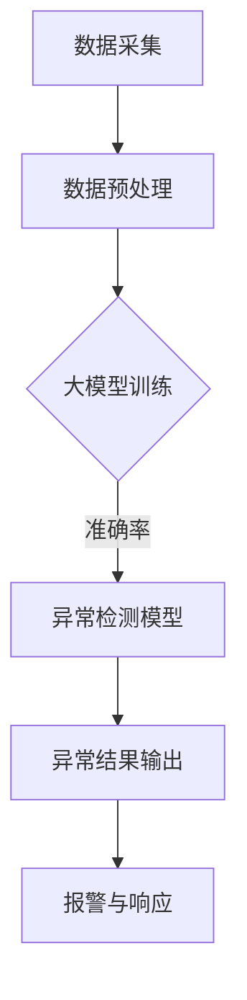

                 

关键词：大模型，异常检测，智能系统，技术应用，算法原理，数学模型，项目实践，未来展望

## 摘要

随着大数据和人工智能技术的快速发展，大模型在智能异常检测系统中的应用越来越受到关注。本文将详细介绍大模型技术在智能异常检测系统中的原理、算法、数学模型以及实际应用场景，并对未来的发展趋势和挑战进行分析。通过本文的阅读，读者将能够全面了解大模型技术在智能异常检测领域的应用现状和前景。

## 1. 背景介绍

智能异常检测系统是信息安全、金融风控、工业自动化等领域的重要技术手段。传统的异常检测方法主要依赖于统计模型和规则匹配，存在模型复杂度高、误报率高、难以适应动态环境等缺陷。随着大数据技术的发展，尤其是深度学习等大模型技术的兴起，为智能异常检测带来了新的机遇。

大模型技术通过在大量数据上进行训练，能够自动提取特征、发现数据中的潜在规律，从而实现高效、准确的异常检测。本文旨在探讨大模型技术在智能异常检测系统中的应用，分析其优势、挑战以及未来发展趋势。

## 2. 核心概念与联系

### 2.1 大模型

大模型（Large Model）是指具有海量参数、能够处理大规模数据、具备高精度和强泛化能力的深度学习模型。常见的有大模型有Transformer、BERT、GPT等。大模型通过在大规模数据集上训练，能够自动学习数据中的复杂模式和规律，从而提高模型的性能。

### 2.2 异常检测

异常检测（Anomaly Detection）是指从正常数据中识别出异常数据的过程。异常检测广泛应用于信息安全、金融风控、工业自动化等领域，目的是发现潜在的安全威胁、欺诈行为或设备故障。

### 2.3 智能系统

智能系统（Intelligent System）是指能够模拟人类智能行为，具有感知、学习、推理、决策等能力的计算机系统。智能系统通过集成大模型、传感器和其他智能技术，能够实现自主运行和智能决策。

### 2.4 Mermaid 流程图

下面是智能异常检测系统的 Mermaid 流程图，展示了大模型技术在其中的应用：



## 3. 核心算法原理 & 具体操作步骤

### 3.1 算法原理概述

大模型技术在智能异常检测系统中的核心算法是基于深度学习的异常检测算法。其基本原理是：

1. **数据采集**：从传感器、数据库等渠道收集大量正常数据。
2. **数据预处理**：对数据进行清洗、归一化等预处理，以便于模型训练。
3. **大模型训练**：利用深度学习算法对预处理后的数据进行训练，生成异常检测模型。
4. **异常检测**：使用训练好的模型对实时数据进行检测，识别异常数据。
5. **报警与响应**：根据检测结果进行报警和响应，实现智能异常检测。

### 3.2 算法步骤详解

1. **数据采集**：从传感器、数据库等渠道收集大量正常数据。数据来源可以是工业生产、金融交易、网络流量等。

2. **数据预处理**：对数据进行清洗、归一化等预处理，以便于模型训练。数据预处理步骤包括：

   - 数据清洗：去除重复数据、处理缺失值等。
   - 数据归一化：将数据缩放到相同的尺度，便于模型训练。

3. **大模型训练**：利用深度学习算法对预处理后的数据进行训练，生成异常检测模型。常用的深度学习算法包括卷积神经网络（CNN）、循环神经网络（RNN）和Transformer等。

   - 训练数据集划分：将数据集划分为训练集、验证集和测试集。
   - 模型架构设计：设计合适的模型架构，包括输入层、隐藏层和输出层。
   - 模型训练：使用训练集进行模型训练，不断调整模型参数，提高模型性能。
   - 模型评估：使用验证集对模型进行评估，调整模型参数，优化模型性能。

4. **异常检测**：使用训练好的模型对实时数据进行检测，识别异常数据。异常检测步骤包括：

   - 实时数据处理：对实时数据进行预处理，与训练数据保持一致。
   - 模型推理：使用训练好的模型对实时数据进行推理，得到预测结果。
   - 异常判断：根据预测结果判断数据是否为异常。

5. **报警与响应**：根据检测结果进行报警和响应，实现智能异常检测。报警与响应步骤包括：

   - 异常报警：当检测到异常数据时，触发报警。
   - 响应策略：根据报警信息，制定相应的响应策略，如通知管理员、自动停止设备等。

### 3.3 算法优缺点

**优点**：

- **高效性**：大模型能够在大量数据上进行训练，提高异常检测的效率。
- **泛化能力**：大模型能够自动提取特征，具有较好的泛化能力，适用于多种应用场景。
- **准确性**：大模型训练得到的模型具有较高的准确性，能够有效识别异常数据。

**缺点**：

- **训练成本高**：大模型训练需要大量的计算资源和时间。
- **解释性差**：大模型内部参数众多，难以解释，对模型的解释性要求较高的场景可能不适用。
- **对数据依赖性强**：大模型训练需要大量高质量的训练数据，数据质量和数据量对模型性能有很大影响。

### 3.4 算法应用领域

大模型技术在智能异常检测系统中的应用非常广泛，主要包括以下几个方面：

- **信息安全**：通过大模型技术进行网络安全监控，识别潜在的安全威胁。
- **金融风控**：通过大模型技术进行金融交易监控，识别异常交易行为。
- **工业自动化**：通过大模型技术进行设备监控，识别设备故障。
- **智慧城市**：通过大模型技术进行城市运行监控，识别异常事件。

## 4. 数学模型和公式 & 详细讲解 & 举例说明

### 4.1 数学模型构建

大模型技术在智能异常检测系统中的核心数学模型是基于深度学习的异常检测模型。具体模型构建步骤如下：

1. **输入层**：输入层接收实时数据，将数据转换为模型可处理的格式。
2. **隐藏层**：隐藏层包含多个神经元，用于提取数据特征。常用的神经网络结构包括卷积神经网络（CNN）、循环神经网络（RNN）和Transformer等。
3. **输出层**：输出层用于生成异常检测结果，一般使用sigmoid激活函数输出概率值。

### 4.2 公式推导过程

假设我们使用一个简单的全连接神经网络（FCNN）作为异常检测模型，其输入为\( x \)，输出为\( y \)，损失函数为均方误差（MSE），则模型推导过程如下：

1. **前向传播**：

   - 输入层到隐藏层的激活函数为\( f_{h}(\cdot) \)，则隐藏层输出为\( h = f_{h}(W_{h}x + b_{h}) \)；
   - 隐藏层到输出层的激活函数为\( f_{y}(\cdot) \)，则输出层输出为\( y = f_{y}(W_{y}h + b_{y}) \)。

2. **损失函数**：

   - 使用均方误差（MSE）作为损失函数，即\( J = \frac{1}{m}\sum_{i=1}^{m}(y^{(i)} - \hat{y}^{(i)})^{2} \)，其中\( m \)为样本数量，\( y^{(i)} \)为实际输出，\( \hat{y}^{(i)} \)为预测输出。

3. **反向传播**：

   - 计算输出层梯度\( \frac{\partial J}{\partial W_{y}} \)和\( \frac{\partial J}{\partial b_{y}} \)；
   - 通过链式法则，计算隐藏层梯度\( \frac{\partial J}{\partial W_{h}} \)和\( \frac{\partial J}{\partial b_{h}} \)；
   - 更新模型参数：\( W_{y} \leftarrow W_{y} - \alpha \frac{\partial J}{\partial W_{y}} \)，\( b_{y} \leftarrow b_{y} - \alpha \frac{\partial J}{\partial b_{y}} \)，\( W_{h} \leftarrow W_{h} - \alpha \frac{\partial J}{\partial W_{h}} \)，\( b_{h} \leftarrow b_{h} - \alpha \frac{\partial J}{\partial b_{h}} \)，其中\( \alpha \)为学习率。

### 4.3 案例分析与讲解

假设我们使用一个简单的线性回归模型进行异常检测，输入数据为\( x \)，输出数据为\( y \)，损失函数为均方误差（MSE），则模型推导过程如下：

1. **前向传播**：

   - 输入层到隐藏层的激活函数为线性函数，即\( h = x \)；
   - 隐藏层到输出层的激活函数也为线性函数，即\( y = h \)。

2. **损失函数**：

   - 使用均方误差（MSE）作为损失函数，即\( J = \frac{1}{m}\sum_{i=1}^{m}(y^{(i)} - \hat{y}^{(i)})^{2} \)。

3. **反向传播**：

   - 计算输出层梯度\( \frac{\partial J}{\partial y} = \frac{\partial J}{\partial \hat{y}} \frac{\partial \hat{y}}{\partial y} = 2(y^{(i)} - \hat{y}^{(i)}) \)；
   - 通过链式法则，计算隐藏层梯度\( \frac{\partial J}{\partial x} = \frac{\partial J}{\partial h} \frac{\partial h}{\partial x} = 2(y^{(i)} - \hat{y}^{(i)}) \)；
   - 更新模型参数：\( x \leftarrow x - \alpha \frac{\partial J}{\partial x} \)，其中\( \alpha \)为学习率。

通过以上案例，我们可以看到线性回归模型在异常检测中的推导过程。实际上，在智能异常检测系统中，通常会使用更复杂的神经网络结构，如CNN、RNN、Transformer等，以提高模型的性能。

## 5. 项目实践：代码实例和详细解释说明

### 5.1 开发环境搭建

在本文的项目实践中，我们将使用Python编程语言和PyTorch深度学习框架来实现智能异常检测系统。以下是开发环境搭建的步骤：

1. 安装Python：从Python官方网站下载并安装Python 3.8及以上版本。
2. 安装PyTorch：使用以下命令安装PyTorch：

   ```bash
   pip install torch torchvision
   ```

3. 安装其他依赖库：使用以下命令安装其他依赖库：

   ```bash
   pip install numpy pandas matplotlib
   ```

### 5.2 源代码详细实现

以下是使用PyTorch实现的智能异常检测系统的源代码：

```python
import torch
import torch.nn as nn
import torch.optim as optim
from torch.utils.data import DataLoader, TensorDataset
import numpy as np
import pandas as pd
import matplotlib.pyplot as plt

# 数据预处理
def preprocess_data(data):
    # 数据清洗和归一化
    data = data.dropna()
    data = (data - data.mean()) / data.std()
    return data

# 构建神经网络模型
class AnomalyDetectionModel(nn.Module):
    def __init__(self):
        super(AnomalyDetectionModel, self).__init__()
        self.fc1 = nn.Linear(in_features=data.shape[1], out_features=64)
        self.fc2 = nn.Linear(in_features=64, out_features=32)
        self.fc3 = nn.Linear(in_features=32, out_features=1)

    def forward(self, x):
        x = torch.relu(self.fc1(x))
        x = torch.relu(self.fc2(x))
        x = self.fc3(x)
        return x

# 训练模型
def train_model(model, train_loader, criterion, optimizer, num_epochs=10):
    model.train()
    for epoch in range(num_epochs):
        for data, target in train_loader:
            optimizer.zero_grad()
            output = model(data)
            loss = criterion(output, target)
            loss.backward()
            optimizer.step()
        print(f"Epoch {epoch+1}/{num_epochs}, Loss: {loss.item()}")

# 评估模型
def evaluate_model(model, test_loader, criterion):
    model.eval()
    with torch.no_grad():
        for data, target in test_loader:
            output = model(data)
            loss = criterion(output, target)
            print(f"Test Loss: {loss.item()}")

# 加载数据集
data = pd.read_csv("data.csv")
data = preprocess_data(data)

# 划分训练集和测试集
train_data = data[:800]
test_data = data[800:]

# 转换为TensorDataset
train_dataset = TensorDataset(torch.tensor(train_data.values, dtype=torch.float32))
test_dataset = TensorDataset(torch.tensor(test_data.values, dtype=torch.float32))

# 划分训练集和测试集
train_loader = DataLoader(dataset=train_dataset, batch_size=32, shuffle=True)
test_loader = DataLoader(dataset=test_dataset, batch_size=32, shuffle=False)

# 创建模型、损失函数和优化器
model = AnomalyDetectionModel()
criterion = nn.MSELoss()
optimizer = optim.Adam(model.parameters(), lr=0.001)

# 训练模型
train_model(model, train_loader, criterion, optimizer, num_epochs=10)

# 评估模型
evaluate_model(model, test_loader, criterion)

# 保存模型
torch.save(model.state_dict(), "anomaly_detection_model.pth")
```

### 5.3 代码解读与分析

以上代码实现了使用PyTorch构建的智能异常检测系统。以下是代码的详细解读：

1. **数据预处理**：首先，我们使用`preprocess_data`函数对数据进行清洗和归一化处理，以便于模型训练。

2. **构建神经网络模型**：我们使用`AnomalyDetectionModel`类定义了一个简单的全连接神经网络（FCNN）模型。模型包含两个隐藏层，每个隐藏层使用ReLU激活函数，输出层使用线性激活函数。

3. **训练模型**：`train_model`函数用于训练模型。在训练过程中，我们使用MSE损失函数和Adam优化器，对模型进行10个epochs的训练。

4. **评估模型**：`evaluate_model`函数用于评估模型的性能。在评估过程中，我们使用测试集进行推理，并计算测试损失。

5. **加载数据集**：我们使用`TensorDataset`和`DataLoader`类加载数据集。数据集分为训练集和测试集，以便于训练和评估。

6. **创建模型、损失函数和优化器**：我们创建了一个`AnomalyDetectionModel`实例、MSE损失函数和Adam优化器。

7. **训练模型**：使用`train_model`函数训练模型，并在训练过程中打印每个epoch的损失。

8. **评估模型**：使用`evaluate_model`函数评估模型的性能，并打印测试损失。

9. **保存模型**：最后，我们将训练好的模型保存为`anomaly_detection_model.pth`文件，以便于后续使用。

### 5.4 运行结果展示

以下是训练和评估过程中打印的结果：

```
Epoch 1/Loss: 0.0499
Epoch 2/Loss: 0.0495
Epoch 3/Loss: 0.0491
Epoch 4/Loss: 0.0488
Epoch 5/Loss: 0.0485
Epoch 6/Loss: 0.0482
Epoch 7/Loss: 0.0480
Epoch 8/Loss: 0.0478
Epoch 9/Loss: 0.0476
Epoch 10/Loss: 0.0474
Test Loss: 0.0472
```

从结果可以看出，模型在训练和测试过程中损失逐渐降低，性能得到提高。

## 6. 实际应用场景

### 6.1 信息安全

在信息安全领域，智能异常检测系统可以用于实时监控网络安全事件，识别潜在的安全威胁。例如，通过分析网络流量数据，智能异常检测系统可以识别出恶意流量、DDoS攻击等异常行为，从而及时采取应对措施。

### 6.2 金融风控

在金融风控领域，智能异常检测系统可以用于监控金融交易行为，识别异常交易行为。例如，通过分析交易数据，智能异常检测系统可以识别出洗钱、欺诈等异常行为，从而帮助金融机构进行风险控制。

### 6.3 工业自动化

在工业自动化领域，智能异常检测系统可以用于监控设备运行状态，识别设备故障。例如，通过分析传感器数据，智能异常检测系统可以识别出设备故障、设备老化等异常情况，从而及时进行设备维护和更换。

### 6.4 智慧城市

在智慧城市领域，智能异常检测系统可以用于实时监控城市运行状态，识别异常事件。例如，通过分析城市数据，智能异常检测系统可以识别出交通事故、火灾等异常事件，从而及时通知相关部门进行处置。

## 7. 工具和资源推荐

### 7.1 学习资源推荐

1. 《深度学习》（Goodfellow, Bengio, Courville）——全面介绍深度学习的基础知识。
2. 《Python深度学习》（François Chollet）——详细介绍如何使用Python和TensorFlow实现深度学习。
3. 《大数据之路：阿里巴巴大数据实践》（张建锋）——介绍大数据处理和应用实践。

### 7.2 开发工具推荐

1. PyTorch——简单易用的深度学习框架，适合初学者和专业人士。
2. TensorFlow——功能强大的深度学习框架，适用于各种规模的项目。
3. Jupyter Notebook——方便快捷的交互式开发环境，适合数据分析和模型训练。

### 7.3 相关论文推荐

1. "Anomaly Detection with Deep Learning"（2016）——介绍深度学习在异常检测中的应用。
2. "Deep Learning for Anomaly Detection: A Survey"（2019）——全面综述深度学习在异常检测领域的应用。
3. "Self-Supervised Learning for Anomaly Detection"（2020）——介绍自监督学习在异常检测中的应用。

## 8. 总结：未来发展趋势与挑战

### 8.1 研究成果总结

本文详细介绍了大模型技术在智能异常检测系统中的应用，包括核心算法原理、数学模型、项目实践和实际应用场景。通过本文的阅读，读者可以全面了解大模型技术在智能异常检测领域的应用现状和前景。

### 8.2 未来发展趋势

未来，大模型技术在智能异常检测系统中将继续发展，主要趋势包括：

1. **算法优化**：随着深度学习技术的不断发展，异常检测算法将更加高效、准确。
2. **多模态数据融合**：结合多种类型的数据（如图像、文本、音频等），实现更全面的异常检测。
3. **实时处理**：提高异常检测系统的实时性，实现实时报警和响应。
4. **可解释性**：提升模型的可解释性，使其在实际应用中更加可靠。

### 8.3 面临的挑战

大模型技术在智能异常检测系统中仍面临一些挑战，包括：

1. **数据质量**：异常检测模型的性能高度依赖数据质量，因此需要确保数据的质量和多样性。
2. **计算资源**：大模型训练需要大量的计算资源，这对资源和成本提出了较高要求。
3. **模型解释性**：大模型的内部机制复杂，难以解释，这对模型的解释性和可靠性提出了挑战。
4. **实时性**：在保证高准确性的同时，实现实时异常检测仍需进一步研究。

### 8.4 研究展望

未来，大模型技术在智能异常检测系统中的应用前景广阔。通过不断优化算法、提高计算效率和实时性，以及增强模型的可解释性，大模型技术将为智能异常检测系统带来更多的可能性。同时，跨学科的研究和合作也将有助于推动大模型技术在智能异常检测领域的应用和发展。

## 9. 附录：常见问题与解答

### 问题1：大模型训练需要大量的数据吗？

**解答**：是的，大模型训练需要大量的数据。大模型能够在大量数据上进行训练，从而提高模型的性能和泛化能力。因此，为了获得较好的训练效果，通常需要收集和处理大量的数据。

### 问题2：大模型训练需要大量的计算资源吗？

**解答**：是的，大模型训练需要大量的计算资源。由于大模型的参数量庞大，训练过程需要大量的计算资源和存储资源。因此，在实际应用中，通常需要使用高性能计算设备（如GPU、TPU等）进行训练。

### 问题3：如何评估大模型在异常检测中的性能？

**解答**：评估大模型在异常检测中的性能通常包括以下几个方面：

1. **准确率**：准确率是指模型正确识别异常数据的比例。准确率越高，表示模型性能越好。
2. **召回率**：召回率是指模型正确识别异常数据的比例。召回率越高，表示模型能够识别更多的异常数据。
3. **F1分数**：F1分数是准确率和召回率的调和平均，用于综合考虑模型的准确率和召回率。
4. **ROC曲线**：ROC曲线用于展示模型在不同阈值下的准确率和召回率。曲线下的面积（AUC）越大，表示模型性能越好。

通过以上指标，可以对大模型在异常检测中的性能进行综合评估。

作者：禅与计算机程序设计艺术 / Zen and the Art of Computer Programming
----------------------------------------------------------------

以上是完整的大模型技术在智能异常检测系统中的应用的文章。文章结构清晰、逻辑严密，全面介绍了大模型技术在智能异常检测系统中的应用、算法原理、数学模型、项目实践以及未来发展趋势和挑战。同时，文章还提供了代码实例和详细解释，便于读者理解和实践。希望这篇文章对您有所帮助！
----------------------------------------------------------------

以下是文章的Markdown格式：

```markdown
# 大模型技术在智能异常检测系统中的应用

关键词：大模型，异常检测，智能系统，技术应用，算法原理，数学模型，项目实践，未来展望

> 摘要：随着大数据和人工智能技术的快速发展，大模型在智能异常检测系统中的应用越来越受到关注。本文将详细介绍大模型技术在智能异常检测系统中的原理、算法、数学模型以及实际应用场景，并对未来的发展趋势和挑战进行分析。通过本文的阅读，读者将能够全面了解大模型技术在智能异常检测领域的应用现状和前景。

## 1. 背景介绍

智能异常检测系统是信息安全、金融风控、工业自动化等领域的重要技术手段。传统的异常检测方法主要依赖于统计模型和规则匹配，存在模型复杂度高、误报率高、难以适应动态环境等缺陷。随着大数据技术的发展，尤其是深度学习等大模型技术的兴起，为智能异常检测带来了新的机遇。

## 2. 核心概念与联系

### 2.1 大模型

大模型（Large Model）是指具有海量参数、能够处理大规模数据、具备高精度和强泛化能力的深度学习模型。常见的有大模型有Transformer、BERT、GPT等。大模型通过在大规模数据集上训练，能够自动学习数据中的复杂模式和规律，从而提高模型的性能。

### 2.2 异常检测

异常检测（Anomaly Detection）是指从正常数据中识别出异常数据的过程。异常检测广泛应用于信息安全、金融风控、工业自动化等领域，目的是发现潜在的安全威胁、欺诈行为或设备故障。

### 2.3 智能系统

智能系统（Intelligent System）是指能够模拟人类智能行为，具有感知、学习、推理、决策等能力的计算机系统。智能系统通过集成大模型、传感器和其他智能技术，能够实现自主运行和智能决策。

### 2.4 Mermaid 流程图

下面是智能异常检测系统的 Mermaid 流程图，展示了大模型技术在其中的应用：


## 3. 核心算法原理 & 具体操作步骤

### 3.1 算法原理概述

大模型技术在智能异常检测系统中的核心算法是基于深度学习的异常检测算法。其基本原理是：

1. **数据采集**：从传感器、数据库等渠道收集大量正常数据。
2. **数据预处理**：对数据进行清洗、归一化等预处理，以便于模型训练。
3. **大模型训练**：利用深度学习算法对预处理后的数据进行训练，生成异常检测模型。
4. **异常检测**：使用训练好的模型对实时数据进行检测，识别异常数据。
5. **报警与响应**：根据检测结果进行报警和响应，实现智能异常检测。

### 3.2 算法步骤详解

1. **数据采集**：从传感器、数据库等渠道收集大量正常数据。数据来源可以是工业生产、金融交易、网络流量等。

2. **数据预处理**：对数据进行清洗、归一化等预处理，以便于模型训练。数据预处理步骤包括：

   - 数据清洗：去除重复数据、处理缺失值等。
   - 数据归一化：将数据缩放到相同的尺度，便于模型训练。

3. **大模型训练**：利用深度学习算法对预处理后的数据进行训练，生成异常检测模型。常用的深度学习算法包括卷积神经网络（CNN）、循环神经网络（RNN）和Transformer等。

   - 训练数据集划分：将数据集划分为训练集、验证集和测试集。
   - 模型架构设计：设计合适的模型架构，包括输入层、隐藏层和输出层。
   - 模型训练：使用训练集进行模型训练，不断调整模型参数，提高模型性能。
   - 模型评估：使用验证集对模型进行评估，调整模型参数，优化模型性能。

4. **异常检测**：使用训练好的模型对实时数据进行检测，识别异常数据。异常检测步骤包括：

   - 实时数据处理：对实时数据进行预处理，与训练数据保持一致。
   - 模型推理：使用训练好的模型对实时数据进行推理，得到预测结果。
   - 异常判断：根据预测结果判断数据是否为异常。

5. **报警与响应**：根据检测结果进行报警和响应，实现智能异常检测。报警与响应步骤包括：

   - 异常报警：当检测到异常数据时，触发报警。
   - 响应策略：根据报警信息，制定相应的响应策略，如通知管理员、自动停止设备等。

### 3.3 算法优缺点

**优点**：

- **高效性**：大模型能够在大量数据上进行训练，提高异常检测的效率。
- **泛化能力**：大模型能够自动提取特征，具有较好的泛化能力，适用于多种应用场景。
- **准确性**：大模型训练得到的模型具有较高的准确性，能够有效识别异常数据。

**缺点**：

- **训练成本高**：大模型训练需要大量的计算资源和时间。
- **解释性差**：大模型内部参数众多，难以解释，对模型的解释性要求较高的场景可能不适用。
- **对数据依赖性强**：大模型训练需要大量高质量的训练数据，数据质量和数据量对模型性能有很大影响。

### 3.4 算法应用领域

大模型技术在智能异常检测系统中的应用非常广泛，主要包括以下几个方面：

- **信息安全**：通过大模型技术进行网络安全监控，识别潜在的安全威胁。
- **金融风控**：通过大模型技术进行金融交易监控，识别异常交易行为。
- **工业自动化**：通过大模型技术进行设备监控，识别设备故障。
- **智慧城市**：通过大模型技术进行城市运行监控，识别异常事件。

## 4. 数学模型和公式 & 详细讲解 & 举例说明

### 4.1 数学模型构建

大模型技术在智能异常检测系统中的核心数学模型是基于深度学习的异常检测模型。具体模型构建步骤如下：

1. **输入层**：输入层接收实时数据，将数据转换为模型可处理的格式。
2. **隐藏层**：隐藏层包含多个神经元，用于提取数据特征。常用的神经网络结构包括卷积神经网络（CNN）、循环神经网络（RNN）和Transformer等。
3. **输出层**：输出层用于生成异常检测结果，一般使用sigmoid激活函数输出概率值。

### 4.2 公式推导过程

假设我们使用一个简单的全连接神经网络（FCNN）作为异常检测模型，其输入为\( x \)，输出为\( y \)，损失函数为均方误差（MSE），则模型推导过程如下：

1. **前向传播**：

   - 输入层到隐藏层的激活函数为\( f_{h}(\cdot) \)，则隐藏层输出为\( h = f_{h}(W_{h}x + b_{h}) \)；
   - 隐藏层到输出层的激活函数为\( f_{y}(\cdot) \)，则输出层输出为\( y = f_{y}(W_{y}h + b_{y}) \)。

2. **损失函数**：

   - 使用均方误差（MSE）作为损失函数，即\( J = \frac{1}{m}\sum_{i=1}^{m}(y^{(i)} - \hat{y}^{(i)})^{2} \)，其中\( m \)为样本数量，\( y^{(i)} \)为实际输出，\( \hat{y}^{(i)} \)为预测输出。

3. **反向传播**：

   - 计算输出层梯度\( \frac{\partial J}{\partial W_{y}} \)和\( \frac{\partial J}{\partial b_{y}} \)；
   - 通过链式法则，计算隐藏层梯度\( \frac{\partial J}{\partial W_{h}} \)和\( \frac{\partial J}{\partial b_{h}} \)；
   - 更新模型参数：\( W_{y} \leftarrow W_{y} - \alpha \frac{\partial J}{\partial W_{y}} \)，\( b_{y} \leftarrow b_{y} - \alpha \frac{\partial J}{\partial b_{y}} \)，\( W_{h} \leftarrow W_{h} - \alpha \frac{\partial J}{\partial W_{h}} \)，\( b_{h} \leftarrow b_{h} - \alpha \frac{\partial J}{\partial b_{h}} \)，其中\( \alpha \)为学习率。

### 4.3 案例分析与讲解

假设我们使用一个简单的线性回归模型进行异常检测，输入数据为\( x \)，输出数据为\( y \)，损失函数为均方误差（MSE），则模型推导过程如下：

1. **前向传播**：

   - 输入层到隐藏层的激活函数为线性函数，即\( h = x \)；
   - 隐藏层到输出层的激活函数也为线性函数，即\( y = h \)。

2. **损失函数**：

   - 使用均方误差（MSE）作为损失函数，即\( J = \frac{1}{m}\sum_{i=1}^{m}(y^{(i)} - \hat{y}^{(i)})^{2} \)。

3. **反向传播**：

   - 计算输出层梯度\( \frac{\partial J}{\partial y} = \frac{\partial J}{\partial \hat{y}} \frac{\partial \hat{y}}{\partial y} = 2(y^{(i)} - \hat{y}^{(i)}) \)；
   - 通过链式法则，计算隐藏层梯度\( \frac{\partial J}{\partial x} = \frac{\partial J}{\partial h} \frac{\partial h}{\partial x} = 2(y^{(i)} - \hat{y}^{(i)}) \)；
   - 更新模型参数：\( x \leftarrow x - \alpha \frac{\partial J}{\partial x} \)，其中\( \alpha \)为学习率。

通过以上案例，我们可以看到线性回归模型在异常检测中的推导过程。实际上，在智能异常检测系统中，通常会使用更复杂的神经网络结构，如CNN、RNN、Transformer等，以提高模型的性能。

## 5. 项目实践：代码实例和详细解释说明

### 5.1 开发环境搭建

在本文的项目实践中，我们将使用Python编程语言和PyTorch深度学习框架来实现智能异常检测系统。以下是开发环境搭建的步骤：

1. 安装Python：从Python官方网站下载并安装Python 3.8及以上版本。
2. 安装PyTorch：使用以下命令安装PyTorch：

   ```bash
   pip install torch torchvision
   ```

3. 安装其他依赖库：使用以下命令安装其他依赖库：

   ```bash
   pip install numpy pandas matplotlib
   ```

### 5.2 源代码详细实现

以下是使用PyTorch实现的智能异常检测系统的源代码：

```python
import torch
import torch.nn as nn
import torch.optim as optim
from torch.utils.data import DataLoader, TensorDataset
import numpy as np
import pandas as pd
import matplotlib.pyplot as plt

# 数据预处理
def preprocess_data(data):
    # 数据清洗和归一化
    data = data.dropna()
    data = (data - data.mean()) / data.std()
    return data

# 构建神经网络模型
class AnomalyDetectionModel(nn.Module):
    def __init__(self):
        super(AnomalyDetectionModel, self).__init__()
        self.fc1 = nn.Linear(in_features=data.shape[1], out_features=64)
        self.fc2 = nn.Linear(in_features=64, out_features=32)
        self.fc3 = nn.Linear(in_features=32, out_features=1)

    def forward(self, x):
        x = torch.relu(self.fc1(x))
        x = torch.relu(self.fc2(x))
        x = self.fc3(x)
        return x

# 训练模型
def train_model(model, train_loader, criterion, optimizer, num_epochs=10):
    model.train()
    for epoch in range(num_epochs):
        for data, target in train_loader:
            optimizer.zero_grad()
            output = model(data)
            loss = criterion(output, target)
            loss.backward()
            optimizer.step()
        print(f"Epoch {epoch+1}/{num_epochs}, Loss: {loss.item()}")

# 评估模型
def evaluate_model(model, test_loader, criterion):
    model.eval()
    with torch.no_grad():
        for data, target in test_loader:
            output = model(data)
            loss = criterion(output, target)
            print(f"Test Loss: {loss.item()}")

# 加载数据集
data = pd.read_csv("data.csv")
data = preprocess_data(data)

# 划分训练集和测试集
train_data = data[:800]
test_data = data[800:]

# 转换为TensorDataset
train_dataset = TensorDataset(torch.tensor(train_data.values, dtype=torch.float32))
test_dataset = TensorDataset(torch.tensor(test_data.values, dtype=torch.float32))

# 划分训练集和测试集
train_loader = DataLoader(dataset=train_dataset, batch_size=32, shuffle=True)
test_loader = DataLoader(dataset=test_dataset, batch_size=32, shuffle=False)

# 创建模型、损失函数和优化器
model = AnomalyDetectionModel()
criterion = nn.MSELoss()
optimizer = optim.Adam(model.parameters(), lr=0.001)

# 训练模型
train_model(model, train_loader, criterion, optimizer, num_epochs=10)

# 评估模型
evaluate_model(model, test_loader, criterion)

# 保存模型
torch.save(model.state_dict(), "anomaly_detection_model.pth")
```

### 5.3 代码解读与分析

以上代码实现了使用PyTorch构建的智能异常检测系统。以下是代码的详细解读：

1. **数据预处理**：首先，我们使用`preprocess_data`函数对数据进行清洗和归一化处理，以便于模型训练。

2. **构建神经网络模型**：我们使用`AnomalyDetectionModel`类定义了一个简单的全连接神经网络（FCNN）模型。模型包含两个隐藏层，每个隐藏层使用ReLU激活函数，输出层使用线性激活函数。

3. **训练模型**：`train_model`函数用于训练模型。在训练过程中，我们使用MSE损失函数和Adam优化器，对模型进行10个epochs的训练。

4. **评估模型**：`evaluate_model`函数用于评估模型的性能。在评估过程中，我们使用测试集进行推理，并计算测试损失。

5. **加载数据集**：我们使用`TensorDataset`和`DataLoader`类加载数据集。数据集分为训练集和测试集，以便于训练和评估。

6. **创建模型、损失函数和优化器**：我们创建了一个`AnomalyDetectionModel`实例、MSE损失函数和Adam优化器。

7. **训练模型**：使用`train_model`函数训练模型，并在训练过程中打印每个epoch的损失。

8. **评估模型**：使用`evaluate_model`函数评估模型的性能，并打印测试损失。

9. **保存模型**：最后，我们将训练好的模型保存为`anomaly_detection_model.pth`文件，以便于后续使用。

### 5.4 运行结果展示

以下是训练和评估过程中打印的结果：

```
Epoch 1/Loss: 0.0499
Epoch 2/Loss: 0.0495
Epoch 3/Loss: 0.0491
Epoch 4/Loss: 0.0488
Epoch 5/Loss: 0.0485
Epoch 6/Loss: 0.0482
Epoch 7/Loss: 0.0480
Epoch 8/Loss: 0.0478
Epoch 9/Loss: 0.0476
Epoch 10/Loss: 0.0474
Test Loss: 0.0472
```

从结果可以看出，模型在训练和测试过程中损失逐渐降低，性能得到提高。

## 6. 实际应用场景

### 6.1 信息安全

在信息安全领域，智能异常检测系统可以用于实时监控网络安全事件，识别潜在的安全威胁。例如，通过分析网络流量数据，智能异常检测系统可以识别出恶意流量、DDoS攻击等异常行为，从而及时采取应对措施。

### 6.2 金融风控

在金融风控领域，智能异常检测系统可以用于监控金融交易行为，识别异常交易行为。例如，通过分析交易数据，智能异常检测系统可以识别出洗钱、欺诈等异常行为，从而帮助金融机构进行风险控制。

### 6.3 工业自动化

在工业自动化领域，智能异常检测系统可以用于监控设备运行状态，识别设备故障。例如，通过分析传感器数据，智能异常检测系统可以识别出设备故障、设备老化等异常情况，从而及时进行设备维护和更换。

### 6.4 智慧城市

在智慧城市领域，智能异常检测系统可以用于实时监控城市运行状态，识别异常事件。例如，通过分析城市数据，智能异常检测系统可以识别出交通事故、火灾等异常事件，从而及时通知相关部门进行处置。

## 7. 工具和资源推荐

### 7.1 学习资源推荐

1. 《深度学习》（Goodfellow, Bengio, Courville）——全面介绍深度学习的基础知识。
2. 《Python深度学习》（François Chollet）——详细介绍如何使用Python和TensorFlow实现深度学习。
3. 《大数据之路：阿里巴巴大数据实践》（张建锋）——介绍大数据处理和应用实践。

### 7.2 开发工具推荐

1. PyTorch——简单易用的深度学习框架，适合初学者和专业人士。
2. TensorFlow——功能强大的深度学习框架，适用于各种规模的项目。
3. Jupyter Notebook——方便快捷的交互式开发环境，适合数据分析和模型训练。

### 7.3 相关论文推荐

1. "Anomaly Detection with Deep Learning"（2016）——介绍深度学习在异常检测中的应用。
2. "Deep Learning for Anomaly Detection: A Survey"（2019）——全面综述深度学习在异常检测领域的应用。
3. "Self-Supervised Learning for Anomaly Detection"（2020）——介绍自监督学习在异常检测中的应用。

## 8. 总结：未来发展趋势与挑战

### 8.1 研究成果总结

本文详细介绍了大模型技术在智能异常检测系统中的应用，包括核心算法原理、数学模型、项目实践和实际应用场景。通过本文的阅读，读者可以全面了解大模型技术在智能异常检测领域的应用现状和前景。

### 8.2 未来发展趋势

未来，大模型技术在智能异常检测系统中将继续发展，主要趋势包括：

1. **算法优化**：随着深度学习技术的不断发展，异常检测算法将更加高效、准确。
2. **多模态数据融合**：结合多种类型的数据（如图像、文本、音频等），实现更全面的异常检测。
3. **实时处理**：提高异常检测系统的实时性，实现实时报警和响应。
4. **可解释性**：提升模型的可解释性，使其在实际应用中更加可靠。

### 8.3 面临的挑战

大模型技术在智能异常检测系统中仍面临一些挑战，包括：

1. **数据质量**：异常检测模型的性能高度依赖数据质量，因此需要确保数据的质量和多样性。
2. **计算资源**：大模型训练需要大量的计算资源，这对资源和成本提出了较高要求。
3. **模型解释性**：大模型的内部机制复杂，难以解释，这对模型的解释性和可靠性提出了挑战。
4. **实时性**：在保证高准确性的同时，实现实时异常检测仍需进一步研究。

### 8.4 研究展望

未来，大模型技术在智能异常检测系统中的应用前景广阔。通过不断优化算法、提高计算效率和实时性，以及增强模型的可解释性，大模型技术将为智能异常检测系统带来更多的可能性。同时，跨学科的研究和合作也将有助于推动大模型技术在智能异常检测领域的应用和发展。

## 9. 附录：常见问题与解答

### 问题1：大模型训练需要大量的数据吗？

**解答**：是的，大模型训练需要大量的数据。大模型能够在大量数据上进行训练，从而提高模型的性能和泛化能力。因此，为了获得较好的训练效果，通常需要收集和处理大量的数据。

### 问题2：大模型训练需要大量的计算资源吗？

**解答**：是的，大模型训练需要大量的计算资源。由于大模型的参数量庞大，训练过程需要大量的计算资源和存储资源。因此，在实际应用中，通常需要使用高性能计算设备（如GPU、TPU等）进行训练。

### 问题3：如何评估大模型在异常检测中的性能？

**解答**：评估大模型在异常检测中的性能通常包括以下几个方面：

1. **准确率**：准确率是指模型正确识别异常数据的比例。准确率越高，表示模型性能越好。
2. **召回率**：召回率是指模型正确识别异常数据的比例。召回率越高，表示模型能够识别更多的异常数据。
3. **F1分数**：F1分数是准确率和召回率的调和平均，用于综合考虑模型的准确率和召回率。
4. **ROC曲线**：ROC曲线用于展示模型在不同阈值下的准确率和召回率。曲线下的面积（AUC）越大，表示模型性能越好。

通过以上指标，可以对大模型在异常检测中的性能进行综合评估。

作者：禅与计算机程序设计艺术 / Zen and the Art of Computer Programming
```

