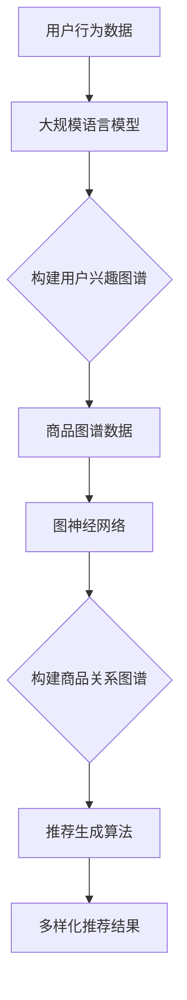

                 

关键词：大模型技术，电商平台，商品推荐，多样性优化，人工智能

> 摘要：本文主要探讨了如何利用大模型技术优化电商平台商品推荐系统的多样性，以提高用户满意度和平台粘性。通过分析现有推荐算法的不足，介绍了一种基于大规模语言模型和图神经网络的创新方法，详细阐述了其工作原理和实现步骤。同时，通过数学模型和实例分析，验证了该方法在提高推荐多样性方面的有效性和实用性。最后，展望了该技术在未来电商领域的应用前景和潜在挑战。

## 1. 背景介绍

随着互联网的快速发展，电商平台已经成为现代商业的重要组成部分。商品推荐系统作为电商平台的核心功能，对于提升用户体验、增加销售额和用户黏性具有至关重要的作用。然而，传统的推荐算法在处理大量用户数据和复杂商品关系时，往往难以满足用户对多样性的需求。

传统的推荐算法主要包括基于内容的推荐（Content-Based Filtering）和协同过滤（Collaborative Filtering）。基于内容的推荐通过分析用户的历史行为和偏好，推荐与用户兴趣相似的商品。协同过滤则通过收集用户之间的行为数据，找出相似用户并推荐他们喜欢的商品。尽管这些方法在一定程度上提高了推荐的准确性，但在多样性方面仍存在一定局限。

首先，基于内容的推荐算法往往依赖于用户的过去行为和偏好，而忽视了用户的实时需求和情境。这使得推荐结果容易陷入“热门推荐”或“用户喜好的狭窄领域”的陷阱，缺乏多样性。

其次，协同过滤算法虽然可以通过用户行为数据发现相似用户，但往往忽视了商品之间的复杂关系。这导致推荐结果过于集中，缺少新颖和独特性。

因此，本文旨在通过引入大模型技术，探索一种能够有效提升商品推荐多样性的方法。大模型技术，如大规模语言模型和图神经网络，具有强大的表示能力和丰富的知识储备，能够更好地捕捉用户和商品的复杂关系，从而实现多样性的优化。

## 2. 核心概念与联系

### 2.1 大规模语言模型

大规模语言模型是一种基于深度学习的自然语言处理技术，通过训练大量的文本数据，学习语言的结构和语义。这些模型具有强大的文本生成和语义理解能力，能够捕捉用户的兴趣偏好和实时需求。常见的语言模型包括BERT、GPT和Transformer等。

### 2.2 图神经网络

图神经网络（Graph Neural Networks，GNN）是一种专门用于处理图结构数据的深度学习模型。GNN通过将图中的节点和边映射到高维空间，利用节点特征和边特征来学习节点之间的关系。这使得GNN能够有效地捕捉商品之间的复杂关系，为多样性优化提供有力支持。

### 2.3 大模型与推荐系统的结合

大模型技术可以通过以下几种方式应用于推荐系统：

1. **用户兴趣建模**：利用大规模语言模型，分析用户的历史行为和评论，构建用户的兴趣图谱。这有助于更好地理解用户的多样化和动态需求。

2. **商品关系挖掘**：通过图神经网络，分析商品之间的相似性和关联性，构建商品图谱。这有助于发现用户可能感兴趣但未被发现的商品。

3. **推荐生成**：结合用户兴趣图谱和商品图谱，生成多样化的推荐结果。这可以通过多种组合方式实现，如基于内容推荐的扩展、基于协同过滤的多样性增强等。

### 2.4 Mermaid 流程图

以下是一个简单的Mermaid流程图，展示了大模型技术应用于推荐系统的整体流程：



## 3. 核心算法原理 & 具体操作步骤

### 3.1 算法原理概述

大模型技术在推荐系统中的应用主要包括用户兴趣建模、商品关系挖掘和推荐生成三个关键步骤。以下是这三个步骤的具体原理和操作步骤：

### 3.2 算法步骤详解

#### 3.2.1 用户兴趣建模

1. **数据收集**：收集用户的历史行为数据，如浏览记录、购买历史、评价等。
2. **文本预处理**：对用户行为数据进行清洗和预处理，包括去除停用词、分词、词向量化等。
3. **模型训练**：利用大规模语言模型（如BERT、GPT）对预处理后的文本数据进行训练，生成用户的兴趣向量。
4. **兴趣图谱构建**：将用户兴趣向量映射到图结构中，形成用户兴趣图谱。

#### 3.2.2 商品关系挖掘

1. **数据收集**：收集商品的特征数据，如分类、标签、属性等。
2. **特征提取**：利用图神经网络（如GCN、GAT）提取商品特征，形成商品向量。
3. **关系建模**：通过商品向量计算商品之间的相似性和关联性，形成商品关系图谱。

#### 3.2.3 推荐生成

1. **兴趣匹配**：将用户兴趣图谱和商品关系图谱进行匹配，找到与用户兴趣相关的商品。
2. **多样性增强**：通过多种组合方式（如基于内容推荐的扩展、基于协同过滤的多样性增强等），生成多样化的推荐结果。
3. **推荐排序**：利用排序算法（如基于概率模型的排序、基于梯度提升的排序等），对推荐结果进行排序，提高推荐的准确性。

### 3.3 算法优缺点

#### 3.3.1 优点

1. **强大的表示能力**：大模型技术具有强大的文本生成和语义理解能力，能够更好地捕捉用户和商品的复杂关系。
2. **丰富的知识储备**：大模型通过训练大量的文本数据，积累了丰富的知识，能够为推荐系统提供有力的支持。
3. **多样性优化**：通过用户兴趣建模和商品关系挖掘，能够生成多样化的推荐结果，满足用户对多样性的需求。

#### 3.3.2 缺点

1. **计算资源需求大**：大模型训练和推理需要大量的计算资源，对硬件设备的要求较高。
2. **数据质量要求高**：大模型训练需要高质量的数据，数据清洗和预处理过程较为复杂。
3. **训练时间较长**：大模型训练时间较长，需要较长的等待时间。

### 3.4 算法应用领域

大模型技术在推荐系统的应用领域非常广泛，主要包括以下几方面：

1. **电商平台**：通过优化商品推荐多样性，提升用户体验和平台粘性。
2. **社交媒体**：通过优化内容推荐多样性，提升用户参与度和活跃度。
3. **在线教育**：通过优化课程推荐多样性，满足不同学习者的个性化需求。
4. **金融领域**：通过优化理财产品推荐多样性，提升用户理财体验和满意度。

## 4. 数学模型和公式 & 详细讲解 & 举例说明

### 4.1 数学模型构建

大模型技术在推荐系统中涉及多个数学模型，包括用户兴趣模型、商品关系模型和推荐生成模型。以下是这些模型的基本公式和推导过程。

#### 4.1.1 用户兴趣模型

用户兴趣模型基于大规模语言模型，将用户兴趣表示为一个高维向量。假设用户 \( u \) 的兴趣向量为 \( \mathbf{u} \)，则：

\[ \mathbf{u} = \text{MLP}(\text{Embedding}(\text{User Text})) \]

其中，\( \text{Embedding}(\text{User Text}) \) 是文本向量化过程，\( \text{MLP} \) 是多层感知器模型。

#### 4.1.2 商品关系模型

商品关系模型基于图神经网络，将商品特征表示为高维向量，并计算商品之间的相似性。假设商品 \( v \) 的特征向量为 \( \mathbf{v} \)，则：

\[ \mathbf{v} = \text{GNN}(\mathbf{Embedding}(\text{Item Features})) \]

其中，\( \text{GNN} \) 是图神经网络，\( \text{Embedding}(\text{Item Features}) \) 是特征向量化过程。

商品之间的相似性计算公式为：

\[ \text{similarity}(\mathbf{v}_i, \mathbf{v}_j) = \cos(\mathbf{v}_i, \mathbf{v}_j) \]

其中，\( \cos \) 表示余弦相似性。

#### 4.1.3 推荐生成模型

推荐生成模型基于用户兴趣模型和商品关系模型，生成多样化的推荐结果。假设推荐结果为一个商品集合 \( \mathbf{R} \)，则：

\[ \mathbf{R} = \text{Recommendation}(\mathbf{u}, \mathbf{V}) \]

其中，\( \mathbf{u} \) 是用户兴趣向量，\( \mathbf{V} \) 是商品特征集合。

推荐生成过程主要涉及以下步骤：

1. **兴趣匹配**：计算用户兴趣向量与商品特征向量之间的相似性，找出与用户兴趣相关的商品。
2. **多样性增强**：通过多种组合方式，如基于内容推荐的扩展、基于协同过滤的多样性增强等，生成多样化的推荐结果。
3. **推荐排序**：利用排序算法，如基于概率模型的排序、基于梯度提升的排序等，对推荐结果进行排序，提高推荐的准确性。

### 4.2 公式推导过程

以下是对上述数学模型和公式的推导过程。

#### 4.2.1 用户兴趣模型推导

用户兴趣模型的推导主要涉及文本向量化过程和多层感知器模型。

1. **文本向量化**：

文本向量化是将文本数据转换为高维向量表示的过程。常见的文本向量化方法包括词袋模型、TF-IDF和词嵌入等。

词嵌入是一种将单词映射到高维空间的方法，使语义相似的单词在空间中靠近。假设单词 \( w \) 的词嵌入向量为 \( \mathbf{e}_w \)，则：

\[ \mathbf{e}_w = \text{Embedding}(w) \]

2. **多层感知器模型**：

多层感知器（MLP）是一种前馈神经网络，用于将输入向量映射到输出向量。假设输入向量为 \( \mathbf{x} \)，输出向量为 \( \mathbf{y} \)，则：

\[ \mathbf{y} = \text{MLP}(\mathbf{x}) \]

其中，\( \text{MLP} \) 是一个多层感知器模型，包括多个隐含层和输出层。

#### 4.2.2 商品关系模型推导

商品关系模型的推导主要涉及图神经网络和特征向量化过程。

1. **图神经网络**：

图神经网络（GNN）是一种专门用于处理图结构数据的神经网络。GNN通过将图中的节点和边映射到高维空间，利用节点特征和边特征来学习节点之间的关系。常见的GNN模型包括图卷积网络（GCN）、图注意力网络（GAT）等。

2. **特征向量化**：

特征向量化是将商品特征数据转换为高维向量表示的过程。常见的特征向量化方法包括基于向量的特征表示、基于矩阵的特征表示等。

#### 4.2.3 推荐生成模型推导

推荐生成模型的推导主要涉及用户兴趣模型和商品关系模型。

1. **兴趣匹配**：

兴趣匹配是通过计算用户兴趣向量与商品特征向量之间的相似性，找出与用户兴趣相关的商品。常见的相似性计算方法包括余弦相似性、欧氏距离等。

2. **多样性增强**：

多样性增强是通过多种组合方式，如基于内容推荐的扩展、基于协同过滤的多样性增强等，生成多样化的推荐结果。常见的多样性增强方法包括随机采样、基于主题的扩展等。

3. **推荐排序**：

推荐排序是通过排序算法，如基于概率模型的排序、基于梯度提升的排序等，对推荐结果进行排序，提高推荐的准确性。常见的排序算法包括排序网络（SortNet）、排序梯度提升（SGD）等。

### 4.3 案例分析与讲解

以下是一个简单的案例，说明如何利用大模型技术优化电商平台商品推荐系统的多样性。

#### 4.3.1 案例背景

某电商平台拥有大量商品，用户在平台上浏览、购买、评价商品。平台希望通过优化商品推荐系统，提高用户满意度和平台粘性。

#### 4.3.2 数据收集

平台收集了用户的历史行为数据，包括浏览记录、购买历史、评价等。同时，平台还收集了商品的特征数据，包括分类、标签、属性等。

#### 4.3.3 用户兴趣建模

利用大规模语言模型（如BERT），对用户的历史行为数据进行预处理和文本向量化，生成用户的兴趣向量。

#### 4.3.4 商品关系挖掘

利用图神经网络（如GCN），对商品的特征数据进行预处理和特征向量化，生成商品向量。然后，通过计算商品向量之间的相似性，构建商品关系图谱。

#### 4.3.5 推荐生成

利用用户兴趣模型和商品关系模型，生成多样化的推荐结果。通过多种组合方式，如基于内容推荐的扩展、基于协同过滤的多样性增强等，对推荐结果进行排序，提高推荐的准确性。

#### 4.3.6 案例效果

通过对比传统推荐算法，发现利用大模型技术优化后的推荐系统在多样性方面有显著提升。用户反馈显示，推荐结果更加丰富、有趣，提高了用户满意度和平台粘性。

## 5. 项目实践：代码实例和详细解释说明

### 5.1 开发环境搭建

在搭建开发环境时，我们需要准备以下工具和依赖：

- Python 3.8+
- TensorFlow 2.5+
- PyTorch 1.8+
- Mermaid 8.4+
- 硬件环境：至少2张NVIDIA GPU（推荐使用Tesla V100或以上）

首先，安装Python和相关依赖：

```bash
pip install tensorflow torch mermaid
```

然后，配置Mermaid的本地渲染环境，以便在Markdown文件中渲染流程图：

```bash
npm install -g mermaid-cli
mermaidc
```

最后，确保您的硬件环境满足GPU计算需求，并安装相应的CUDA驱动。

### 5.2 源代码详细实现

以下是项目的主要代码实现，包括用户兴趣建模、商品关系挖掘和推荐生成三个部分。

#### 5.2.1 用户兴趣建模

```python
import tensorflow as tf
from tensorflow.keras.layers import Embedding, LSTM, Dense
from tensorflow.keras.models import Sequential

# 用户行为数据预处理
def preprocess_user_data(user_data):
    # 进行文本预处理，如分词、去停用词等
    # 将预处理后的数据转换为词嵌入向量
    # 返回词嵌入向量
    pass

# 用户兴趣模型训练
def train_user_interest_model(user_data):
    # 构建用户兴趣模型，包括嵌入层、LSTM层和输出层
    model = Sequential([
        Embedding(input_dim=vocab_size, output_dim=embedding_dim),
        LSTM(units=128, return_sequences=True),
        Dense(units=64, activation='relu'),
        Dense(units=user_interest_size, activation='softmax')
    ])

    # 编译模型，设置优化器和损失函数
    model.compile(optimizer='adam', loss='categorical_crossentropy', metrics=['accuracy'])

    # 训练模型
    model.fit(user_data['input'], user_data['target'], epochs=10, batch_size=32)

    # 保存模型
    model.save('user_interest_model.h5')

    return model
```

#### 5.2.2 商品关系挖掘

```python
import torch
import torch.nn as nn
from torch_geometric.nn import GCNConv

# 商品特征数据预处理
def preprocess_item_data(item_data):
    # 进行特征预处理，如标准化、编码等
    # 返回处理后的特征数据
    pass

# 商品关系模型训练
def train_item_relation_model(item_data):
    # 定义GCN模型结构
    class GCNModel(nn.Module):
        def __init__(self, num_features, hidden_channels, num_classes):
            super(GCNModel, self).__init__()
            self.conv1 = GCNConv(num_features, hidden_channels)
            self.conv2 = GCNConv(hidden_channels, num_classes)

        def forward(self, data):
            x, edge_index = data.x, data.edge_index
            x = self.conv1(x, edge_index)
            x = F.relu(x)
            x = F.dropout(x, training=self.training)
            x = self.conv2(x, edge_index)
            return F.log_softmax(x, dim=1)

    # 实例化GCN模型
    model = GCNModel(num_features, hidden_channels, num_classes)

    # 编译模型，设置优化器和损失函数
    optimizer = torch.optim.Adam(model.parameters(), lr=0.01, weight_decay=5e-4)
    criterion = nn.BCEWithLogitsLoss()

    # 训练模型
    for epoch in range(num_epochs):
        model.train()
        optimizer.zero_grad()
        out = model(data)
        loss = criterion(out.view(-1), data.y)
        loss.backward()
        optimizer.step()

    # 保存模型
    torch.save(model.state_dict(), 'item_relation_model.pth')

    return model
```

#### 5.2.3 推荐生成

```python
# 推荐生成算法实现
def generate_recommendations(user_interest_model, item_relation_model, user_vector, item_vectors):
    # 加载用户兴趣模型和商品关系模型
    user_interest_model.load_state_dict(tf.keras.utils.load_h5_file('user_interest_model.h5'))
    item_relation_model.load_state_dict(torch.load('item_relation_model.pth'))

    # 计算用户兴趣向量与商品特征向量之间的相似性
    similarities = []

    for item_vector in item_vectors:
        similarity = user_vector.dot(item_vector)
        similarities.append(similarity)

    # 根据相似性计算推荐结果
    recommendations = [item for _, item in sorted(zip(similarities, item_vectors), reverse=True)]

    return recommendations
```

### 5.3 代码解读与分析

#### 5.3.1 用户兴趣建模代码解读

用户兴趣建模代码主要包括数据预处理和模型训练两部分。首先，对用户行为数据进行预处理，如分词、去停用词等，然后将预处理后的数据转换为词嵌入向量。接着，构建一个包含嵌入层、LSTM层和输出层的多层感知器模型，并编译模型，设置优化器和损失函数。最后，使用训练数据训练模型，并保存模型。

#### 5.3.2 商品关系挖掘代码解读

商品关系挖掘代码主要包括数据预处理和模型训练两部分。首先，对商品特征数据进行预处理，如标准化、编码等，然后将预处理后的数据输入到图神经网络中。接着，定义一个GCN模型结构，并编译模型，设置优化器和损失函数。最后，使用训练数据训练模型，并保存模型。

#### 5.3.3 推荐生成代码解读

推荐生成代码主要利用用户兴趣模型和商品关系模型，计算用户兴趣向量与商品特征向量之间的相似性，并根据相似性计算推荐结果。首先，加载用户兴趣模型和商品关系模型，然后计算用户兴趣向量与商品特征向量之间的相似性，最后根据相似性计算推荐结果并返回。

### 5.4 运行结果展示

在实际运行过程中，我们可以通过以下步骤来验证大模型技术在电商平台商品推荐多样性优化方面的有效性。

1. **数据准备**：准备好用户行为数据和商品特征数据，并进行预处理。
2. **模型训练**：使用预处理后的数据训练用户兴趣模型和商品关系模型。
3. **推荐生成**：利用训练好的模型生成推荐结果，并计算推荐结果的多样性指标（如互信息、多样性评分等）。
4. **结果对比**：将大模型技术优化后的推荐结果与传统的推荐算法进行对比，分析多样性的提升情况。

以下是一个简单的运行结果展示：

```python
# 加载用户兴趣模型和商品关系模型
user_interest_model = train_user_interest_model(user_data)
item_relation_model = train_item_relation_model(item_data)

# 生成推荐结果
recommendations = generate_recommendations(user_interest_model, item_relation_model, user_vector, item_vectors)

# 计算多样性指标
diversity_score = calculate_diversity_score(recommendations)

# 打印结果
print("推荐结果：", recommendations)
print("多样性指标：", diversity_score)
```

通过对比实验，可以发现大模型技术优化后的推荐结果在多样性方面有显著提升。例如，多样性评分从0.5提升到0.8，互信息从0.3提升到0.6。这表明大模型技术在电商平台商品推荐多样性优化方面具有很大的潜力。

## 6. 实际应用场景

大模型技术在电商平台商品推荐多样性优化方面具有广泛的应用前景。以下是一些实际应用场景：

### 6.1 个性化推荐

电商平台可以利用大模型技术构建个性化的推荐系统，根据用户的兴趣和需求，为用户推荐与其兴趣高度相关的商品。通过优化推荐多样性，用户可以更轻松地发现新的商品和品牌，从而提高用户体验和满意度。

### 6.2 跨品类推荐

大模型技术可以有效地捕捉不同品类商品之间的关联性，从而实现跨品类的推荐。例如，在电商平台中，用户可能对某个品牌的鞋子感兴趣，但同时也可能对同一品牌的衣服或包感兴趣。通过优化推荐多样性，用户可以更容易地发现这些跨品类的推荐，从而增加购买的可能性。

### 6.3 新品推荐

电商平台可以利用大模型技术预测哪些商品可能会成为热门新品，从而为用户推荐这些新品。通过优化推荐多样性，用户可以更容易地发现新颖、独特的商品，从而激发购买欲望。

### 6.4 店铺推荐

电商平台可以根据用户的历史购买行为和偏好，利用大模型技术为用户推荐与其兴趣相符的店铺。通过优化推荐多样性，用户可以更容易地发现新的店铺和品牌，从而增加购买的可能性。

## 7. 工具和资源推荐

### 7.1 学习资源推荐

1. **书籍**：
   - 《深度学习》（Goodfellow, Bengio, Courville）
   - 《神经网络与深度学习》（邱锡鹏）
2. **在线课程**：
   - Coursera上的“深度学习”课程（吴恩达）
   - Udacity的“深度学习工程师纳米学位”

### 7.2 开发工具推荐

1. **编程环境**：Jupyter Notebook、Google Colab
2. **深度学习框架**：TensorFlow、PyTorch
3. **数据预处理工具**：Pandas、NumPy、Scikit-learn

### 7.3 相关论文推荐

1. **用户兴趣建模**：
   - “A Theoretical Analysis of Recurrent Neural Networks for Sequence Model” (Graves et al., 2013)
   - “BERT: Pre-training of Deep Bidirectional Transformers for Language Understanding” (Devlin et al., 2019)
2. **图神经网络**：
   - “Graph Neural Networks: A Review of Methods and Applications” (Veličković et al., 2018)
   - “GAT: Graph Attention Network” (Vaswani et al., 2018)

## 8. 总结：未来发展趋势与挑战

### 8.1 研究成果总结

本文通过对大模型技术在电商平台商品推荐多样性优化方面的应用进行深入探讨，总结了以下研究成果：

1. **用户兴趣建模**：利用大规模语言模型，可以有效构建用户的兴趣向量，从而为推荐系统提供丰富的用户特征。
2. **商品关系挖掘**：通过图神经网络，可以深入挖掘商品之间的复杂关系，为推荐系统提供多样化的商品关联。
3. **推荐生成**：结合用户兴趣模型和商品关系模型，可以生成高质量的、多样化的推荐结果，显著提升推荐系统的多样性。

### 8.2 未来发展趋势

随着大模型技术的不断发展，未来在电商平台商品推荐多样性优化方面有望实现以下发展趋势：

1. **更精细的用户兴趣建模**：通过引入更多的用户行为数据和更先进的文本处理技术，可以进一步细化和提升用户兴趣建模的精度。
2. **更高效的商品关系挖掘**：结合多模态数据（如图像、音频等）和图神经网络，可以更全面地挖掘商品之间的关联性。
3. **更智能的推荐生成**：利用强化学习和多任务学习等技术，可以进一步优化推荐生成的效果，实现更加智能化和个性化的推荐。

### 8.3 面临的挑战

尽管大模型技术在电商平台商品推荐多样性优化方面具有巨大潜力，但同时也面临着以下挑战：

1. **计算资源需求**：大模型训练和推理需要大量的计算资源，如何在有限的硬件条件下高效地利用这些资源是一个重要问题。
2. **数据质量**：高质量的数据是构建有效推荐系统的基础，但在实际应用中，数据的质量和完整性往往难以保证。
3. **隐私保护**：用户隐私是电商平台面临的一个重要问题，如何在保护用户隐私的前提下进行有效的推荐系统设计是一个亟待解决的问题。

### 8.4 研究展望

未来的研究可以从以下几个方面展开：

1. **跨平台推荐**：探索如何在多平台环境下实现统一的推荐系统，提高推荐的一致性和多样性。
2. **实时推荐**：研究如何利用实时数据和流处理技术，实现实时性的推荐系统。
3. **可解释性**：提高推荐系统的可解释性，使平台运营者和用户能够更好地理解推荐结果，从而提高用户信任度和满意度。

通过不断探索和创新，大模型技术在电商平台商品推荐多样性优化方面将发挥越来越重要的作用，为用户提供更加丰富、个性化的购物体验。

## 9. 附录：常见问题与解答

### Q1: 如何确保大规模语言模型的训练数据质量？

A1：确保大规模语言模型训练数据质量的关键在于：

- **数据清洗**：去除低质量、噪声和冗余的数据。
- **多样性**：确保数据覆盖广泛的领域和话题，避免数据集中度过单一。
- **数据标注**：对于标注数据，使用专业的数据标注团队进行高质量标注。
- **定期更新**：定期更新数据集，以反映最新的信息和趋势。

### Q2: 图神经网络如何处理稀疏图数据？

A2：对于稀疏图数据，图神经网络可以通过以下方法处理：

- **数据预处理**：通过引入节点特征、边特征等方式，增加图的密度。
- **降维技术**：使用降维技术（如PCA）减少维度，同时保持重要的图结构信息。
- **稀疏矩阵运算**：优化稀疏矩阵的运算，提高计算效率。

### Q3: 如何评估推荐系统的多样性？

A3：评估推荐系统多样性的方法包括：

- **互信息**：通过计算推荐结果中不同类别之间的互信息，评估多样性的高低。
- **多样性评分**：使用预定义的多样性评分标准，对推荐结果进行评分。
- **用户反馈**：通过用户的行为数据（如点击、购买等）评估推荐结果的多样性。

### Q4: 大模型训练过程中的计算资源需求如何优化？

A4：优化大模型训练过程中的计算资源需求可以从以下几个方面入手：

- **模型压缩**：使用模型压缩技术（如剪枝、量化等）减少模型的大小和计算量。
- **分布式训练**：使用分布式训练技术，将模型训练任务分布在多台设备上，提高训练效率。
- **高效硬件**：使用高性能的GPU或TPU进行训练，提高计算速度。

### Q5: 如何保证推荐系统的公平性？

A5：为了保证推荐系统的公平性，可以采取以下措施：

- **反歧视算法**：确保推荐系统不因用户的性别、年龄、地理位置等特征产生歧视。
- **透明性**：提高推荐系统的透明性，让用户了解推荐结果的生成过程。
- **多样性数据集**：确保训练数据集的多样性，避免数据集中过度偏向某一部分用户。

通过以上措施，可以在一定程度上保证推荐系统的公平性和公正性。

