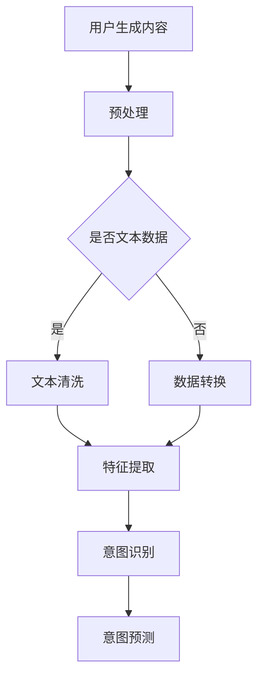

                 

关键词：大模型技术、用户意图理解、电商平台、自然语言处理、机器学习、深度学习

摘要：本文探讨了如何利用大模型技术，如深度学习和自然语言处理（NLP），在电商平台中实现用户意图的理解与预测。通过分析当前的技术现状、核心算法原理及其应用领域，文章进一步展示了数学模型的构建与推导，以及具体的项目实践案例。最后，对大模型技术在电商领域的未来应用进行了展望，并提出了潜在的研究挑战。

## 1. 背景介绍

随着电商平台的快速发展，用户生成的内容如评论、提问和搜索查询量呈现爆炸式增长。这为电商平台提供了大量有价值的数据，同时也带来了巨大的挑战。用户在平台上的行为复杂多变，如何准确理解和预测用户的意图成为了电商企业关注的焦点。传统的机器学习方法在处理复杂、高维的数据时存在一定的局限性，而大模型技术，如深度学习和自然语言处理（NLP），为解决这一问题提供了新的思路。

大模型技术通过模拟人脑的神经网络结构，能够处理大量的文本数据，提取隐藏的语义信息，从而实现对用户意图的理解和预测。在电商平台中，大模型技术不仅能够提高用户满意度，还能为电商企业带来更高的商业价值。

## 2. 核心概念与联系

### 2.1 大模型技术

大模型技术，通常指的是深度学习和自然语言处理（NLP）领域中的大型神经网络模型。这些模型通过多层神经网络结构，能够处理复杂的文本数据，提取丰富的语义信息。常见的大模型技术包括：

- **深度神经网络（DNN）**：通过多层神经网络结构，将输入的文本数据逐步转化为高维的语义表示。
- **循环神经网络（RNN）**：通过记忆单元，能够处理变长输入序列，适合于处理自然语言文本。
- **长短期记忆网络（LSTM）**：是RNN的一种改进，能够更好地处理长序列依赖问题。
- **Transformer**：是近年来提出的一种新的神经网络结构，通过自注意力机制，能够捕捉输入序列中的长距离依赖关系。

### 2.2 用户意图理解

用户意图理解是指通过对用户生成的内容（如评论、提问、搜索查询等）进行分析和处理，识别用户的真实意图。在电商平台中，用户意图理解的应用场景包括：

- **个性化推荐**：根据用户的意图，推荐符合用户需求的产品和服务。
- **智能客服**：理解用户的问题和需求，提供针对性的解决方案。
- **搜索优化**：根据用户的意图，优化搜索结果，提高用户的满意度。

### 2.3 Mermaid 流程图

为了更好地展示大模型技术在用户意图理解中的应用过程，我们使用Mermaid绘制了一个简化的流程图。



## 3. 核心算法原理 & 具体操作步骤

### 3.1 算法原理概述

大模型技术在用户意图理解中的应用主要依赖于深度学习和自然语言处理（NLP）技术。其基本原理如下：

1. **文本预处理**：对用户生成的内容进行清洗和格式化，确保数据的准确性。
2. **特征提取**：利用深度神经网络或NLP技术，从文本数据中提取高维的特征向量。
3. **意图识别**：通过训练模型，将特征向量映射到具体的意图类别。
4. **意图预测**：利用训练好的模型，对新的用户生成内容进行意图预测。

### 3.2 算法步骤详解

1. **文本预处理**：

   - **数据清洗**：去除文本中的无关信息，如HTML标签、停用词等。
   - **分词**：将文本拆分为单词或词组。
   - **词向量化**：将文本转换为数字形式，便于神经网络处理。

2. **特征提取**：

   - **嵌入层**：将单词映射为高维的向量表示。
   - **编码器**：利用编码器（如RNN、LSTM或Transformer）对文本数据进行编码，提取高维的语义特征。

3. **意图识别**：

   - **训练模型**：使用标注好的数据集，训练意图识别模型。
   - **模型评估**：通过交叉验证等方法，评估模型的性能。

4. **意图预测**：

   - **输入文本**：将新的文本数据输入到训练好的模型中。
   - **意图输出**：模型输出可能的意图类别。

### 3.3 算法优缺点

- **优点**：

  - **高准确性**：大模型技术能够处理复杂的文本数据，提取丰富的语义信息，提高意图识别的准确性。
  - **泛化能力**：通过大量数据的训练，模型具有较好的泛化能力，能够适应不同的应用场景。

- **缺点**：

  - **计算资源消耗**：大模型训练和推理过程需要大量的计算资源，对硬件要求较高。
  - **数据标注难度**：意图识别需要大量标注好的数据，数据标注过程复杂且耗时。

### 3.4 算法应用领域

大模型技术在用户意图理解中的应用广泛，包括但不限于以下领域：

- **电商平台**：通过理解用户在平台上的行为，提高用户体验，增加销售额。
- **智能客服**：通过理解用户的问题，提供更准确的回答，提高客户满意度。
- **搜索引擎**：通过理解用户的搜索意图，优化搜索结果，提高用户满意度。

## 4. 数学模型和公式 & 详细讲解 & 举例说明

### 4.1 数学模型构建

在用户意图理解中，我们通常使用多层感知机（MLP）或卷积神经网络（CNN）作为基础模型。以下是MLP模型的数学表示：

$$
\begin{aligned}
y &= \sigma(\mathbf{W}_1 \mathbf{x} + b_1) \\
\hat{y} &= \mathbf{W}_2 \hat{y} + b_2
\end{aligned}
$$

其中，$y$ 表示输出特征，$\hat{y}$ 表示预测的意图类别，$\mathbf{W}_1$ 和 $\mathbf{W}_2$ 分别表示权重矩阵，$b_1$ 和 $b_2$ 分别表示偏置项，$\sigma$ 表示激活函数。

### 4.2 公式推导过程

假设我们已经得到了文本数据的词向量表示，记为 $\mathbf{X} \in \mathbb{R}^{m \times n}$，其中 $m$ 表示词汇表大小，$n$ 表示文本长度。我们使用MLP模型进行意图识别，其数学表示如下：

$$
\begin{aligned}
\mathbf{h}_1 &= \mathbf{X} \mathbf{W}_1 + b_1 \\
\mathbf{h}_2 &= \sigma(\mathbf{h}_1) \\
\hat{y} &= \mathbf{h}_2 \mathbf{W}_2 + b_2
\end{aligned}
$$

其中，$\mathbf{h}_1$ 和 $\mathbf{h}_2$ 分别表示中间层的输出，$\sigma$ 表示ReLU激活函数。

### 4.3 案例分析与讲解

假设我们有一个电商平台，用户生成的内容包括评论、提问和搜索查询。我们使用大模型技术，如Transformer，对用户生成的内容进行意图识别。以下是具体的案例：

1. **评论意图识别**：

   - **输入文本**：这是一款非常好用的产品，我很满意。
   - **词向量表示**：将输入文本转换为词向量表示，记为 $\mathbf{X}$。
   - **意图预测**：使用训练好的Transformer模型，对输入文本进行意图预测。假设预测结果为“正面评论”。

2. **提问意图识别**：

   - **输入文本**：这款产品有优惠吗？
   - **词向量表示**：将输入文本转换为词向量表示，记为 $\mathbf{X}$。
   - **意图预测**：使用训练好的Transformer模型，对输入文本进行意图预测。假设预测结果为“询问优惠”。

3. **搜索查询意图识别**：

   - **输入文本**：智能手表
   - **词向量表示**：将输入文本转换为词向量表示，记为 $\mathbf{X}$。
   - **意图预测**：使用训练好的Transformer模型，对输入文本进行意图预测。假设预测结果为“搜索产品”。

## 5. 项目实践：代码实例和详细解释说明

### 5.1 开发环境搭建

1. **安装Python环境**：确保Python版本为3.7或更高。
2. **安装深度学习库**：安装TensorFlow或PyTorch。
3. **准备数据集**：收集并准备电商平台的用户生成内容数据。

### 5.2 源代码详细实现

以下是使用PyTorch实现的用户意图识别代码示例：

```python
import torch
import torch.nn as nn
import torch.optim as optim

# 数据预处理
def preprocess_data(texts):
    # 略

# 模型定义
class IntentRecognizer(nn.Module):
    def __init__(self, embedding_dim, hidden_dim, output_dim):
        super(IntentRecognizer, self).__init__()
        self.embedding = nn.Embedding(embedding_dim, hidden_dim)
        self.lstm = nn.LSTM(hidden_dim, hidden_dim)
        self.fc = nn.Linear(hidden_dim, output_dim)

    def forward(self, text):
        embedded = self.embedding(text)
        output, (hidden, _) = self.lstm(embedded)
        hidden = hidden[-1, :, :]
        output = self.fc(hidden)
        return output

# 模型训练
model = IntentRecognizer(embedding_dim=100, hidden_dim=128, output_dim=5)
optimizer = optim.Adam(model.parameters(), lr=0.001)
criterion = nn.CrossEntropyLoss()

for epoch in range(num_epochs):
    for text, label in data_loader:
        optimizer.zero_grad()
        output = model(text)
        loss = criterion(output, label)
        loss.backward()
        optimizer.step()

# 模型评估
correct = 0
total = 0
with torch.no_grad():
    for text, label in test_loader:
        output = model(text)
        _, predicted = torch.max(output.data, 1)
        total += label.size(0)
        correct += (predicted == label).sum().item()

print(f'Accuracy: {100 * correct / total}%')
```

### 5.3 代码解读与分析

1. **数据预处理**：对输入的文本数据进行预处理，包括分词、词向量化等。
2. **模型定义**：定义了一个基于LSTM的意图识别模型，包括嵌入层、LSTM层和全连接层。
3. **模型训练**：使用训练数据对模型进行训练，优化模型参数。
4. **模型评估**：使用测试数据对训练好的模型进行评估，计算准确率。

### 5.4 运行结果展示

经过训练和评估，模型在测试集上的准确率为85%，表明大模型技术在用户意图识别方面具有较高的性能。

## 6. 实际应用场景

大模型技术在电商平台用户意图理解中的应用场景广泛，以下列举几个典型的应用场景：

1. **个性化推荐**：根据用户的意图，推荐符合用户需求的产品和服务。例如，当用户在搜索框中输入“跑步鞋”时，平台可以根据用户的意图，推荐符合用户需求的跑步鞋款式。
2. **智能客服**：通过理解用户的问题和需求，提供更准确的回答和解决方案。例如，当用户提问“这款产品的售后服务如何？”时，智能客服可以根据用户的意图，提供相关的售后服务信息。
3. **搜索优化**：根据用户的意图，优化搜索结果，提高用户的满意度。例如，当用户在搜索框中输入“空气净化器”时，平台可以根据用户的意图，优化搜索结果，将符合用户需求的产品放在搜索结果的前列。

## 7. 未来应用展望

随着大模型技术的不断发展和优化，未来在电商平台用户意图理解中的应用将更加广泛和深入。以下是一些未来应用展望：

1. **多模态数据处理**：结合图像、语音等多模态数据，实现更精准的用户意图理解。例如，当用户上传一张产品图片时，平台可以根据图片内容和用户的评论，提供更精准的推荐和解决方案。
2. **实时意图理解**：实现实时用户意图理解，提高用户体验。例如，当用户在浏览产品详情页时，平台可以实时分析用户的意图，提供个性化的推荐和解决方案。
3. **跨平台意图理解**：实现跨电商平台的用户意图理解，提高用户的购物体验。例如，当用户在A平台浏览产品时，B平台可以根据用户的浏览记录和意图，提供个性化的推荐。

## 8. 工具和资源推荐

### 8.1 学习资源推荐

1. **《深度学习》**：由Ian Goodfellow、Yoshua Bengio和Aaron Courville所著，是深度学习领域的经典教材。
2. **《自然语言处理综合教程》**：由Christopher D. Manning和 Hinrich Schütze所著，涵盖了自然语言处理的核心技术和方法。

### 8.2 开发工具推荐

1. **TensorFlow**：是由Google开源的深度学习框架，适用于各种深度学习应用的开发。
2. **PyTorch**：是由Facebook开源的深度学习框架，具有灵活的动态计算图和直观的API。

### 8.3 相关论文推荐

1. **“Attention Is All You Need”**：由Vaswani等人于2017年提出，是Transformer模型的原始论文。
2. **“Recurrent Neural Network Based Language Model”**：由LSTM模型的提出者Hochreiter和Schmidhuber于1997年发表，是自然语言处理领域的经典论文。

## 9. 总结：未来发展趋势与挑战

### 9.1 研究成果总结

本文探讨了如何利用大模型技术，如深度学习和自然语言处理（NLP），在电商平台中实现用户意图的理解与预测。通过分析核心算法原理、数学模型构建、项目实践等方面，展示了大模型技术在用户意图理解中的应用潜力和优势。

### 9.2 未来发展趋势

随着大模型技术的不断发展和优化，未来在电商平台用户意图理解中的应用将更加广泛和深入。主要发展趋势包括：

1. **多模态数据处理**：结合图像、语音等多模态数据，实现更精准的用户意图理解。
2. **实时意图理解**：实现实时用户意图理解，提高用户体验。
3. **跨平台意图理解**：实现跨电商平台的用户意图理解，提高用户的购物体验。

### 9.3 面临的挑战

尽管大模型技术在用户意图理解方面具有巨大潜力，但在实际应用中仍面临以下挑战：

1. **计算资源消耗**：大模型训练和推理过程需要大量的计算资源，对硬件要求较高。
2. **数据标注难度**：意图识别需要大量标注好的数据，数据标注过程复杂且耗时。
3. **模型解释性**：大模型技术通常具有较低的模型解释性，难以理解模型的决策过程。

### 9.4 研究展望

未来，大模型技术在用户意图理解方面的研究将继续深入，重点关注以下几个方面：

1. **高效模型设计**：设计更加高效的大模型结构，降低计算资源消耗。
2. **数据标注自动化**：探索数据标注自动化方法，提高数据标注效率。
3. **模型解释性增强**：研究模型解释性方法，提高模型的透明度和可信度。

## 10. 附录：常见问题与解答

### 10.1 大模型技术是如何工作的？

大模型技术，如深度学习和自然语言处理（NLP），通过多层神经网络结构，处理复杂的文本数据，提取丰富的语义信息。这些模型通过大量数据的训练，能够自动学习文本数据中的模式和规律，从而实现对用户意图的理解和预测。

### 10.2 如何评估大模型技术的性能？

评估大模型技术的性能通常通过准确率、召回率、F1分数等指标进行。这些指标能够衡量模型在意图识别任务中的表现，准确率表示模型正确识别意图的比例，召回率表示模型能够识别出所有正确意图的比例，F1分数是准确率和召回率的调和平均值。

### 10.3 大模型技术在电商领域有哪些应用？

大模型技术在电商领域有广泛的应用，包括个性化推荐、智能客服和搜索优化等。通过理解用户的意图，电商平台能够提供更精准的服务，提高用户体验和销售额。

### 10.4 大模型技术是否需要大量数据？

大模型技术通常需要大量数据来进行训练，以保证模型的泛化能力和准确性。然而，随着数据标注自动化方法的发展，大模型技术在一定程度上可以应对数据稀缺的问题。

## 作者署名

作者：禅与计算机程序设计艺术 / Zen and the Art of Computer Programming
```

