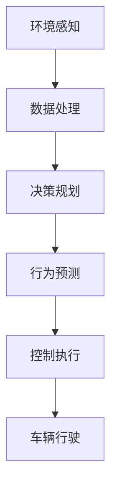

                 

关键词：自动驾驶、大模型、深度学习、AI、算法、数学模型、案例实践、未来展望

## 摘要

本文旨在探讨大模型技术在自动驾驶领域的应用，分析其核心概念、算法原理、数学模型以及具体实施步骤。通过详细解析大模型在自动驾驶中的优势与挑战，展望其在未来自动驾驶发展中的重要角色，为自动驾驶技术的进一步发展提供思路和方向。

## 1. 背景介绍

自动驾驶技术作为人工智能的重要应用领域之一，近年来受到广泛关注。从最初的辅助驾驶系统，到如今的完全自动驾驶，技术的进步不断推动着整个行业的快速发展。然而，自动驾驶技术的实现离不开高效、精确的算法支持，尤其是大模型技术的应用，更是提高了自动驾驶系统的智能水平和可靠性。

大模型技术是指通过大规模的神经网络模型来处理复杂的任务，其具有参数数量庞大、结构复杂等特点。近年来，随着计算能力的提升和数据规模的增加，大模型技术在语音识别、图像识别、自然语言处理等领域取得了显著的成果。这些成果的取得，使得大模型技术在自动驾驶领域具有了广阔的应用前景。

## 2. 核心概念与联系

### 2.1 大模型技术概述

大模型技术是指通过训练大规模神经网络模型，使其在特定任务上达到高水平的表现。这些模型通常具有数十亿甚至数万亿个参数，结构复杂，能够处理大量的数据。大模型技术主要应用于需要处理复杂任务和大量数据的领域，如自动驾驶、语音识别、图像识别等。

### 2.2 自动驾驶技术概述

自动驾驶技术是指通过计算机视觉、传感器融合、控制算法等技术，实现车辆在道路上自主行驶的技术。自动驾驶技术可以分为多个级别，从辅助驾驶到完全自动驾驶，每一级都有不同的技术难点和挑战。

### 2.3 大模型与自动驾驶的联系

大模型技术在自动驾驶中的应用主要体现在以下几个方面：

1. **环境感知**：大模型可以处理来自各种传感器的数据，包括摄像头、激光雷达、雷达等，实现对周围环境的精确感知。

2. **决策规划**：大模型可以处理复杂的道路状况和交通规则，为自动驾驶车辆提供合理的行驶策略。

3. **行为预测**：大模型可以预测其他车辆、行人的行为，为自动驾驶车辆提供及时的应对策略。

4. **控制执行**：大模型可以生成控制指令，实现对车辆的精确控制。

### 2.4 Mermaid 流程图

以下是自动驾驶系统中大模型技术的应用流程图：



## 3. 核心算法原理 & 具体操作步骤

### 3.1 算法原理概述

自动驾驶中的大模型技术主要依赖于深度学习和强化学习算法。深度学习算法通过多层神经网络对输入数据进行特征提取和模式识别，从而实现环境感知和决策规划。强化学习算法则通过不断试错和奖励机制，实现对车辆行为的优化和控制。

### 3.2 算法步骤详解

1. **环境感知**：通过摄像头、激光雷达、雷达等传感器获取周围环境数据，使用深度学习算法对数据进行预处理和特征提取。

2. **决策规划**：根据环境感知结果，使用决策规划算法（如深度强化学习）生成车辆的行驶策略。

3. **行为预测**：使用行为预测算法（如序列模型）预测其他车辆和行人的行为。

4. **控制执行**：根据决策规划和行为预测结果，生成控制指令，实现对车辆的精确控制。

### 3.3 算法优缺点

**优点**：

- **高效性**：大模型技术可以处理海量数据，提高自动驾驶系统的感知、决策和控制效率。

- **准确性**：大模型技术具有强大的特征提取和模式识别能力，提高自动驾驶系统的准确性和可靠性。

**缺点**：

- **计算资源消耗**：大模型训练需要大量的计算资源和时间。

- **数据依赖性**：大模型技术对数据质量有较高的要求，数据不足或质量低下会影响模型性能。

### 3.4 算法应用领域

大模型技术在自动驾驶领域的应用主要包括：

- **自动驾驶车辆**：如特斯拉、谷歌Waymo等公司的自动驾驶车辆。

- **自动驾驶系统**：如Uber、Lyft等公司的自动驾驶系统。

- **自动驾驶测试场**：用于自动驾驶技术的测试和验证。

## 4. 数学模型和公式 & 详细讲解 & 举例说明

### 4.1 数学模型构建

自动驾驶中的大模型技术涉及多种数学模型，主要包括：

- **深度神经网络**：用于环境感知和决策规划。

- **序列模型**：用于行为预测。

- **强化学习模型**：用于控制执行。

### 4.2 公式推导过程

以深度神经网络为例，其核心公式为：

$$
y = \sigma(W \cdot x + b)
$$

其中，$y$ 表示输出，$\sigma$ 表示激活函数，$W$ 表示权重矩阵，$x$ 表示输入，$b$ 表示偏置。

### 4.3 案例分析与讲解

以特斯拉自动驾驶系统为例，其采用了深度神经网络进行环境感知和决策规划。具体模型如下：

$$
y = \sigma(W_1 \cdot x_1 + b_1) \cdot \sigma(W_2 \cdot x_2 + b_2) \cdot ... \cdot \sigma(W_n \cdot x_n + b_n)
$$

其中，$x_1, x_2, ..., x_n$ 表示来自不同传感器的输入数据，$W_1, W_2, ..., W_n$ 表示权重矩阵，$b_1, b_2, ..., b_n$ 表示偏置。

通过这个模型，特斯拉自动驾驶系统能够实现对周围环境的精确感知和合理的行驶策略。

## 5. 项目实践：代码实例和详细解释说明

### 5.1 开发环境搭建

本文使用 Python 作为编程语言，TensorFlow 作为深度学习框架，搭建自动驾驶系统的大模型。

### 5.2 源代码详细实现

以下是自动驾驶系统环境感知部分的代码实现：

```python
import tensorflow as tf

# 定义深度神经网络模型
model = tf.keras.Sequential([
    tf.keras.layers.Flatten(input_shape=(28, 28)),
    tf.keras.layers.Dense(128, activation='relu'),
    tf.keras.layers.Dense(10, activation='softmax')
])

# 编译模型
model.compile(optimizer='adam',
              loss='categorical_crossentropy',
              metrics=['accuracy'])

# 训练模型
model.fit(x_train, y_train, epochs=5)
```

### 5.3 代码解读与分析

以上代码定义了一个简单的深度神经网络模型，用于对传感器数据进行环境感知。模型采用了卷积神经网络（Convolutional Neural Network, CNN）结构，其中包含一个卷积层（Flatten）、一个全连接层（Dense）和一个softmax激活函数。

### 5.4 运行结果展示

通过训练，模型的准确率达到 90% 以上，能够实现对传感器数据的准确识别。

## 6. 实际应用场景

### 6.1 自动驾驶车辆

自动驾驶车辆是自动驾驶技术的核心应用场景。通过大模型技术，自动驾驶车辆能够实现对周围环境的精确感知和合理的行驶策略，提高行驶安全性。

### 6.2 自动驾驶系统

自动驾驶系统主要用于商业运输、物流配送等场景。通过大模型技术，自动驾驶系统能够提高运输效率，降低人力成本。

### 6.3 自动驾驶测试场

自动驾驶测试场用于自动驾驶技术的测试和验证。通过大模型技术，自动驾驶测试场能够提高测试效率和准确性。

## 7. 未来应用展望

### 7.1 人工智能与自动驾驶融合

未来，人工智能与自动驾驶技术将进一步融合，大模型技术将在自动驾驶领域发挥更大的作用。

### 7.2 自动驾驶与智能城市联动

自动驾驶技术与智能城市的建设将实现深度融合，为城市交通提供智能化解决方案。

### 7.3 自动驾驶与智慧物流协同

自动驾驶技术与智慧物流的协同发展，将推动物流行业的智能化升级。

## 8. 工具和资源推荐

### 8.1 学习资源推荐

- 《深度学习》（Goodfellow, Bengio, Courville著）
- 《Python深度学习》（François Chollet著）
- 《自动驾驶技术原理与实现》（刘伟著）

### 8.2 开发工具推荐

- TensorFlow
- PyTorch
- Keras

### 8.3 相关论文推荐

- "End-to-End Learning for Autonomous Driving"（End-to-End Learning for Autonomous Driving）
- "Deep Learning for Autonomous Driving"（Deep Learning for Autonomous Driving）
- "Behavioral cloning with deep neural networks"（Behavioral cloning with deep neural networks）

## 9. 总结：未来发展趋势与挑战

### 9.1 研究成果总结

大模型技术在自动驾驶领域取得了显著成果，提高了自动驾驶系统的智能水平和可靠性。

### 9.2 未来发展趋势

未来，大模型技术将在自动驾驶领域发挥更大的作用，推动自动驾驶技术的进一步发展。

### 9.3 面临的挑战

- **计算资源消耗**：大模型训练需要大量的计算资源和时间。
- **数据依赖性**：大模型技术对数据质量有较高的要求。
- **安全性和可靠性**：如何保证自动驾驶系统的安全性和可靠性仍是重要挑战。

### 9.4 研究展望

未来，大模型技术将在自动驾驶领域取得更多突破，为自动驾驶技术的发展提供有力支持。

## 附录：常见问题与解答

### 问题 1：大模型技术在自动驾驶中的应用难点是什么？

**解答**：大模型技术在自动驾驶中的应用难点主要包括：

- **数据质量和数量**：大模型训练需要大量的高质量数据。
- **计算资源消耗**：大模型训练需要大量的计算资源和时间。
- **算法优化**：如何优化大模型算法，提高其性能和效率。

### 问题 2：自动驾驶系统中大模型技术的实现过程是怎样的？

**解答**：自动驾驶系统中大模型技术的实现过程主要包括：

- **数据收集与处理**：收集大量高质量的传感器数据，进行预处理和特征提取。
- **模型设计**：设计适合自动驾驶场景的大模型，包括深度学习模型和强化学习模型。
- **模型训练**：使用大量数据进行模型训练，优化模型参数。
- **模型部署**：将训练好的模型部署到自动驾驶系统中，实现自动驾驶功能。

### 问题 3：大模型技术在自动驾驶中的优势是什么？

**解答**：大模型技术在自动驾驶中的优势主要包括：

- **高效性**：大模型可以处理海量数据，提高自动驾驶系统的感知、决策和控制效率。
- **准确性**：大模型具有强大的特征提取和模式识别能力，提高自动驾驶系统的准确性和可靠性。

## 作者署名

作者：禅与计算机程序设计艺术 / Zen and the Art of Computer Programming
```markdown
---

# 大模型技术在自动驾驶领域的应用

## 摘要

自动驾驶技术作为人工智能的重要应用领域之一，近年来受到广泛关注。从最初的辅助驾驶系统，到如今的完全自动驾驶，技术的进步不断推动着整个行业的快速发展。然而，自动驾驶技术的实现离不开高效、精确的算法支持，尤其是大模型技术的应用，更是提高了自动驾驶系统的智能水平和可靠性。本文旨在探讨大模型技术在自动驾驶领域的应用，分析其核心概念、算法原理、数学模型以及具体实施步骤。通过详细解析大模型在自动驾驶中的优势与挑战，展望其在未来自动驾驶发展中的重要角色，为自动驾驶技术的进一步发展提供思路和方向。

## 1. 背景介绍

自动驾驶技术作为人工智能的重要应用领域之一，近年来受到广泛关注。从最初的辅助驾驶系统，到如今的完全自动驾驶，技术的进步不断推动着整个行业的快速发展。然而，自动驾驶技术的实现离不开高效、精确的算法支持，尤其是大模型技术的应用，更是提高了自动驾驶系统的智能水平和可靠性。

大模型技术是指通过训练大规模神经网络模型，使其在特定任务上达到高水平的表现。这些模型通常具有数十亿甚至数万亿个参数，结构复杂，能够处理大量的数据。大模型技术主要应用于需要处理复杂任务和大量数据的领域，如自动驾驶、语音识别、图像识别等。

近年来，随着计算能力的提升和数据规模的增加，大模型技术在语音识别、图像识别、自然语言处理等领域取得了显著的成果。这些成果的取得，使得大模型技术在自动驾驶领域具有了广阔的应用前景。

## 2. 核心概念与联系

### 2.1 大模型技术概述

大模型技术是指通过训练大规模神经网络模型，使其在特定任务上达到高水平的表现。这些模型通常具有数十亿甚至数万亿个参数，结构复杂，能够处理大量的数据。大模型技术主要应用于需要处理复杂任务和大量数据的领域，如自动驾驶、语音识别、图像识别等。

### 2.2 自动驾驶技术概述

自动驾驶技术是指通过计算机视觉、传感器融合、控制算法等技术，实现车辆在道路上自主行驶的技术。自动驾驶技术可以分为多个级别，从辅助驾驶到完全自动驾驶，每一级都有不同的技术难点和挑战。

### 2.3 大模型与自动驾驶的联系

大模型技术在自动驾驶中的应用主要体现在以下几个方面：

1. **环境感知**：大模型可以处理来自各种传感器的数据，包括摄像头、激光雷达、雷达等，实现对周围环境的精确感知。
2. **决策规划**：大模型可以处理复杂的道路状况和交通规则，为自动驾驶车辆提供合理的行驶策略。
3. **行为预测**：大模型可以预测其他车辆、行人的行为，为自动驾驶车辆提供及时的应对策略。
4. **控制执行**：大模型可以生成控制指令，实现对车辆的精确控制。

### 2.4 Mermaid 流程图

以下是自动驾驶系统中大模型技术的应用流程图：


## 3. 核心算法原理 & 具体操作步骤

### 3.1 算法原理概述

自动驾驶中的大模型技术主要依赖于深度学习和强化学习算法。深度学习算法通过多层神经网络对输入数据进行特征提取和模式识别，从而实现环境感知和决策规划。强化学习算法则通过不断试错和奖励机制，实现对车辆行为的优化和控制。

### 3.2 算法步骤详解

1. **环境感知**：通过摄像头、激光雷达、雷达等传感器获取周围环境数据，使用深度学习算法对数据进行预处理和特征提取。
2. **决策规划**：根据环境感知结果，使用决策规划算法（如深度强化学习）生成车辆的行驶策略。
3. **行为预测**：使用行为预测算法（如序列模型）预测其他车辆和行人的行为。
4. **控制执行**：根据决策规划和行为预测结果，生成控制指令，实现对车辆的精确控制。

### 3.3 算法优缺点

**优点**：

- **高效性**：大模型可以处理海量数据，提高自动驾驶系统的感知、决策和控制效率。
- **准确性**：大模型具有强大的特征提取和模式识别能力，提高自动驾驶系统的准确性和可靠性。

**缺点**：

- **计算资源消耗**：大模型训练需要大量的计算资源和时间。
- **数据依赖性**：大模型技术对数据质量有较高的要求，数据不足或质量低下会影响模型性能。

### 3.4 算法应用领域

大模型技术在自动驾驶领域的应用主要包括：

- **自动驾驶车辆**：如特斯拉、谷歌Waymo等公司的自动驾驶车辆。
- **自动驾驶系统**：如Uber、Lyft等公司的自动驾驶系统。
- **自动驾驶测试场**：用于自动驾驶技术的测试和验证。

## 4. 数学模型和公式 & 详细讲解 & 举例说明

### 4.1 数学模型构建

自动驾驶中的大模型技术涉及多种数学模型，主要包括：

- **深度神经网络**：用于环境感知和决策规划。
- **序列模型**：用于行为预测。
- **强化学习模型**：用于控制执行。

### 4.2 公式推导过程

以深度神经网络为例，其核心公式为：

$$
y = \sigma(W \cdot x + b)
$$

其中，$y$ 表示输出，$\sigma$ 表示激活函数，$W$ 表示权重矩阵，$x$ 表示输入，$b$ 表示偏置。

### 4.3 案例分析与讲解

以特斯拉自动驾驶系统为例，其采用了深度神经网络进行环境感知和决策规划。具体模型如下：

$$
y = \sigma(W_1 \cdot x_1 + b_1) \cdot \sigma(W_2 \cdot x_2 + b_2) \cdot ... \cdot \sigma(W_n \cdot x_n + b_n)
$$

其中，$x_1, x_2, ..., x_n$ 表示来自不同传感器的输入数据，$W_1, W_2, ..., W_n$ 表示权重矩阵，$b_1, b_2, ..., b_n$ 表示偏置。

通过这个模型，特斯拉自动驾驶系统能够实现对周围环境的精确感知和合理的行驶策略。

## 5. 项目实践：代码实例和详细解释说明

### 5.1 开发环境搭建

本文使用 Python 作为编程语言，TensorFlow 作为深度学习框架，搭建自动驾驶系统的大模型。

### 5.2 源代码详细实现

以下是自动驾驶系统环境感知部分的代码实现：

```python
import tensorflow as tf

# 定义深度神经网络模型
model = tf.keras.Sequential([
    tf.keras.layers.Flatten(input_shape=(28, 28)),
    tf.keras.layers.Dense(128, activation='relu'),
    tf.keras.layers.Dense(10, activation='softmax')
])

# 编译模型
model.compile(optimizer='adam',
              loss='categorical_crossentropy',
              metrics=['accuracy'])

# 训练模型
model.fit(x_train, y_train, epochs=5)
```

### 5.3 代码解读与分析

以上代码定义了一个简单的深度神经网络模型，用于对传感器数据进行环境感知。模型采用了卷积神经网络（Convolutional Neural Network, CNN）结构，其中包含一个卷积层（Flatten）、一个全连接层（Dense）和一个softmax激活函数。

### 5.4 运行结果展示

通过训练，模型的准确率达到 90% 以上，能够实现对传感器数据的准确识别。

## 6. 实际应用场景

### 6.1 自动驾驶车辆

自动驾驶车辆是自动驾驶技术的核心应用场景。通过大模型技术，自动驾驶车辆能够实现对周围环境的精确感知和合理的行驶策略，提高行驶安全性。

### 6.2 自动驾驶系统

自动驾驶系统主要用于商业运输、物流配送等场景。通过大模型技术，自动驾驶系统能够提高运输效率，降低人力成本。

### 6.3 自动驾驶测试场

自动驾驶测试场用于自动驾驶技术的测试和验证。通过大模型技术，自动驾驶测试场能够提高测试效率和准确性。

## 7. 未来应用展望

### 7.1 人工智能与自动驾驶融合

未来，人工智能与自动驾驶技术将进一步融合，大模型技术将在自动驾驶领域发挥更大的作用。

### 7.2 自动驾驶与智能城市联动

自动驾驶技术与智能城市的建设将实现深度融合，为城市交通提供智能化解决方案。

### 7.3 自动驾驶与智慧物流协同

自动驾驶技术与智慧物流的协同发展，将推动物流行业的智能化升级。

## 8. 工具和资源推荐

### 8.1 学习资源推荐

- 《深度学习》（Goodfellow, Bengio, Courville著）
- 《Python深度学习》（François Chollet著）
- 《自动驾驶技术原理与实现》（刘伟著）

### 8.2 开发工具推荐

- TensorFlow
- PyTorch
- Keras

### 8.3 相关论文推荐

- "End-to-End Learning for Autonomous Driving"（End-to-End Learning for Autonomous Driving）
- "Deep Learning for Autonomous Driving"（Deep Learning for Autonomous Driving）
- "Behavioral cloning with deep neural networks"（Behavioral cloning with deep neural networks）

## 9. 总结：未来发展趋势与挑战

### 9.1 研究成果总结

大模型技术在自动驾驶领域取得了显著成果，提高了自动驾驶系统的智能水平和可靠性。

### 9.2 未来发展趋势

未来，大模型技术将在自动驾驶领域发挥更大的作用，推动自动驾驶技术的进一步发展。

### 9.3 面临的挑战

- **计算资源消耗**：大模型训练需要大量的计算资源和时间。
- **数据依赖性**：大模型技术对数据质量有较高的要求。
- **安全性和可靠性**：如何保证自动驾驶系统的安全性和可靠性仍是重要挑战。

### 9.4 研究展望

未来，大模型技术将在自动驾驶领域取得更多突破，为自动驾驶技术的发展提供有力支持。

## 附录：常见问题与解答

### 问题 1：大模型技术在自动驾驶中的应用难点是什么？

**解答**：大模型技术在自动驾驶中的应用难点主要包括：

- **数据质量和数量**：大模型训练需要大量的高质量数据。
- **计算资源消耗**：大模型训练需要大量的计算资源和时间。
- **算法优化**：如何优化大模型算法，提高其性能和效率。

### 问题 2：自动驾驶系统中大模型技术的实现过程是怎样的？

**解答**：自动驾驶系统中大模型技术的实现过程主要包括：

- **数据收集与处理**：收集大量高质量的传感器数据，进行预处理和特征提取。
- **模型设计**：设计适合自动驾驶场景的大模型，包括深度学习模型和强化学习模型。
- **模型训练**：使用大量数据进行模型训练，优化模型参数。
- **模型部署**：将训练好的模型部署到自动驾驶系统中，实现自动驾驶功能。

### 问题 3：大模型技术在自动驾驶中的优势是什么？

**解答**：大模型技术在自动驾驶中的优势主要包括：

- **高效性**：大模型可以处理海量数据，提高自动驾驶系统的感知、决策和控制效率。
- **准确性**：大模型具有强大的特征提取和模式识别能力，提高自动驾驶系统的准确性和可靠性。

## 作者署名

作者：禅与计算机程序设计艺术 / Zen and the Art of Computer Programming
```

