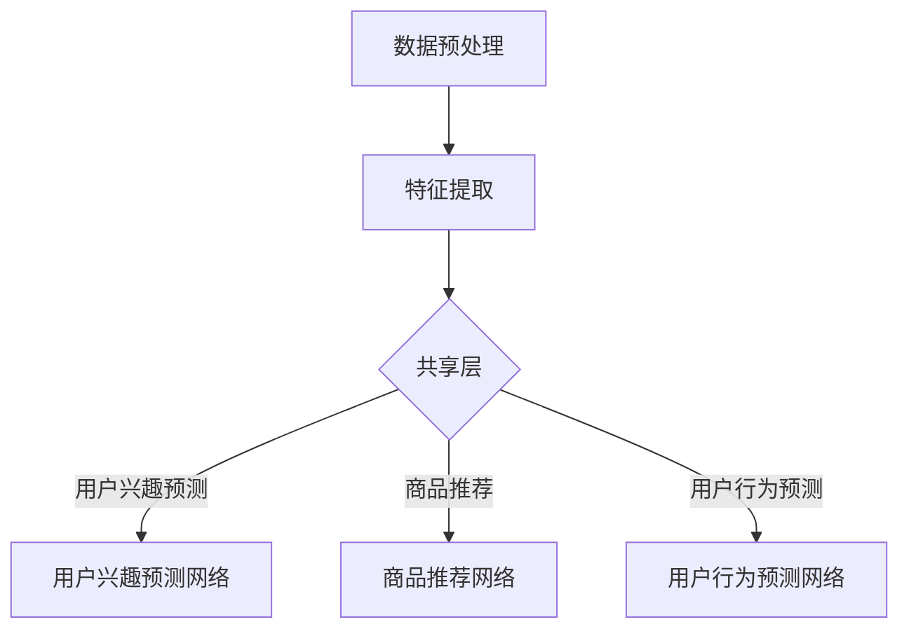

                 

关键词：大模型推荐、用户行为序列、多任务学习、技术提升

## 摘要

本文旨在探讨大模型推荐系统中的用户行为序列多任务学习技术，通过深入分析用户行为序列在推荐系统中的作用和重要性，阐述多任务学习技术在该领域中的应用。文章首先介绍了大模型推荐系统的背景和现状，随后重点介绍了用户行为序列多任务学习的核心概念、算法原理、数学模型以及具体实现步骤。同时，文章还结合实际项目，提供了代码实例和详细解释，并探讨了用户行为序列多任务学习在推荐系统中的实际应用场景和未来发展方向。通过本文的阅读，读者可以全面了解并掌握用户行为序列多任务学习技术在大模型推荐系统中的应用。

## 1. 背景介绍

### 大模型推荐系统的发展历程

随着互联网技术的迅猛发展，个性化推荐系统已成为众多互联网公司提高用户黏性和满意度的重要手段。从最初的基于内容的推荐（Content-Based Recommendation）和协同过滤推荐（Collaborative Filtering），到深度学习（Deep Learning）和强化学习（Reinforcement Learning）等先进技术的引入，推荐系统在算法层面经历了数次重大变革。

早期的推荐系统主要依靠用户的历史行为数据，通过统计方法或机器学习方法来实现对用户兴趣的建模。随着数据量的增加和用户行为的多样化，这些方法逐渐暴露出诸如数据稀疏、冷启动问题等局限性。为了解决这些问题，研究者们开始探索基于深度学习的大模型推荐系统。

大模型推荐系统，尤其是基于生成对抗网络（Generative Adversarial Networks，GAN）和变分自编码器（Variational Autoencoder，VAE）等深度学习模型，通过自动学习大量数据中的潜在特征，实现了对用户兴趣的精准捕捉和预测。同时，大模型推荐系统还能够处理非结构化数据，如文本、图像和音频，提高了推荐的多样性和准确性。

### 用户行为序列在推荐系统中的作用

用户行为序列是推荐系统中的重要信息来源，它反映了用户的兴趣偏好和潜在需求。通过分析用户行为序列，推荐系统可以更好地理解用户的当前兴趣和长远需求，从而提供更加个性化的推荐。

用户行为序列包括浏览历史、搜索记录、购买行为、点赞和评论等。这些行为数据可以揭示用户在不同场景下的兴趣变化，帮助推荐系统识别用户的短期兴趣和长期偏好。例如，一个用户可能在浏览某一类商品后，过一段时间又购买了该类商品，这表明用户对该类商品有持续的兴趣。

此外，用户行为序列还能够帮助推荐系统识别用户的行为模式。通过分析用户行为序列的时序特征，如行为的时间间隔、频率和持续时间，推荐系统可以更好地预测用户的下一步行为，从而提高推荐的准确性。

### 当前推荐系统的挑战

尽管大模型推荐系统在个性化推荐方面取得了显著成果，但仍然面临诸多挑战：

1. **数据稀疏性和冷启动问题**：由于用户行为数据的不均衡分布，推荐系统往往难以准确预测新用户或新商品的行为。这导致了数据稀疏性和冷启动问题，影响了推荐系统的效果。

2. **用户隐私保护**：推荐系统需要收集和分析大量的用户行为数据，这可能引发用户隐私泄露的风险。如何在保护用户隐私的前提下，实现有效的推荐，是当前研究的一个热点问题。

3. **实时性**：用户兴趣和行为是动态变化的，推荐系统需要实时响应这些变化，提供及时的个性化推荐。然而，实时数据处理和更新是一项具有挑战性的任务。

4. **多模态数据的融合**：用户行为不仅包括结构化数据，还包括非结构化数据，如文本、图像和音频。如何有效地融合这些多模态数据，提高推荐的准确性，是推荐系统面临的一个难题。

5. **算法透明性和可解释性**：深度学习模型由于其复杂性和“黑箱”特性，使得推荐系统的决策过程缺乏透明性和可解释性。这限制了用户对推荐结果的信任度和接受度。

### 多任务学习技术在推荐系统中的应用

为了解决上述挑战，多任务学习（Multi-Task Learning，MTL）技术在推荐系统中得到了广泛应用。多任务学习通过同时学习多个相关任务，共享模型参数，提高了模型的泛化能力和效率。

在推荐系统中，多任务学习可以同时处理多个子任务，如用户兴趣预测、商品推荐、用户行为预测等。通过共享用户和商品的特征表示，多任务学习能够更好地捕捉用户和商品之间的潜在关联，提高推荐系统的准确性。

此外，多任务学习还可以用于跨模态推荐，同时处理文本、图像和音频等多模态数据。通过多任务学习，推荐系统可以充分利用不同模态数据的特点，提高推荐的多样性和准确性。

总之，多任务学习技术为推荐系统提供了一种有效的方法，以解决数据稀疏性、冷启动、用户隐私保护、实时性、多模态数据融合和算法透明性等问题。

## 2. 核心概念与联系

### 多任务学习技术的基本原理

多任务学习（Multi-Task Learning，MTL）是一种机器学习技术，旨在同时解决多个相关任务。在多任务学习中，多个任务共享一部分参数，通过联合优化这些参数，提高各个任务的性能。

多任务学习的基本原理可以概括为以下几点：

1. **参数共享**：多任务学习通过共享模型参数，降低了每个任务的训练成本，提高了模型的可扩展性。共享参数可以减少模型复杂度，防止过拟合，提高模型的泛化能力。

2. **任务关联**：在多任务学习中，任务之间通常存在某种程度的关联。通过共享模型参数，多任务学习可以同时学习这些任务，捕捉它们之间的潜在关联，提高各个任务的性能。

3. **联合优化**：多任务学习通过联合优化多个任务的目标函数，实现了任务之间的平衡。联合优化有助于提高整体模型的性能，同时避免某个任务的过度优化，导致其他任务性能下降。

### 用户行为序列的多任务学习架构

在用户行为序列推荐系统中，多任务学习技术可以同时处理多个子任务，如用户兴趣预测、商品推荐、用户行为预测等。以下是一个简化的多任务学习架构：

1. **输入层**：输入层包括用户行为序列、商品特征、用户特征等。用户行为序列可以采用时序模型（如循环神经网络（RNN）或长短时记忆网络（LSTM））进行编码，商品特征和用户特征可以采用嵌入层进行表示。

2. **共享层**：共享层是多个任务共享的部分，通常是一个全连接层或卷积层。共享层通过提取用户和商品之间的潜在特征，实现任务之间的关联。

3. **任务层**：任务层包括多个任务的网络结构，如用户兴趣预测网络、商品推荐网络和用户行为预测网络。每个任务网络都基于共享层，通过添加特定的层（如分类层、回归层等）实现特定任务的目标。

4. **输出层**：输出层是各个任务的最终输出，如用户兴趣得分、推荐商品列表、用户行为概率等。

### 用户行为序列多任务学习的工作流程

用户行为序列多任务学习的工作流程可以概括为以下几个步骤：

1. **数据预处理**：对用户行为序列、商品特征和用户特征进行预处理，如标准化、缺失值填充、编码等。

2. **特征提取**：利用时序模型（如RNN、LSTM）对用户行为序列进行编码，提取时序特征。同时，利用嵌入层对商品特征和用户特征进行编码。

3. **模型训练**：将特征输入到多任务学习模型中，通过联合优化多个任务的目标函数，训练模型参数。

4. **模型评估**：使用验证集对模型进行评估，根据评估结果调整模型参数，优化模型性能。

5. **模型应用**：将训练好的模型应用于实际推荐场景，根据用户行为序列和商品特征，预测用户兴趣、推荐商品和预测用户行为。

### 用户行为序列多任务学习的关键技术

用户行为序列多任务学习的关键技术包括：

1. **时序模型**：时序模型（如RNN、LSTM）用于对用户行为序列进行编码，提取时序特征。这些特征可以用于后续的任务处理。

2. **嵌入层**：嵌入层用于对商品特征和用户特征进行编码，将高维特征映射到低维空间，提高模型的计算效率。

3. **共享层**：共享层通过提取用户和商品之间的潜在特征，实现任务之间的关联。共享层的设计对于多任务学习的性能至关重要。

4. **任务层**：任务层包括多个任务的网络结构，如用户兴趣预测网络、商品推荐网络和用户行为预测网络。任务层的设计取决于具体任务的需求。

5. **联合优化**：联合优化多个任务的目标函数，实现任务之间的平衡。联合优化有助于提高整体模型的性能。

### 用户行为序列多任务学习的 Mermaid 流程图

以下是一个简化的用户行为序列多任务学习的 Mermaid 流程图：



## 3. 核心算法原理 & 具体操作步骤

### 3.1 算法原理概述

用户行为序列多任务学习算法的核心思想是通过联合优化多个任务的目标函数，提高各个任务的性能。具体来说，该算法分为以下几个步骤：

1. **数据预处理**：对用户行为序列、商品特征和用户特征进行预处理，包括数据清洗、缺失值填充、编码等。

2. **特征提取**：利用时序模型（如RNN、LSTM）对用户行为序列进行编码，提取时序特征。同时，利用嵌入层对商品特征和用户特征进行编码。

3. **模型训练**：将特征输入到多任务学习模型中，通过联合优化多个任务的目标函数，训练模型参数。

4. **模型评估**：使用验证集对模型进行评估，根据评估结果调整模型参数，优化模型性能。

5. **模型应用**：将训练好的模型应用于实际推荐场景，根据用户行为序列和商品特征，预测用户兴趣、推荐商品和预测用户行为。

### 3.2 算法步骤详解

1. **数据预处理**

   数据预处理是用户行为序列多任务学习的基础。首先，对用户行为序列进行清洗，去除无效数据和噪声。然后，对缺失值进行填充，可以选择使用平均值、中位数或插值法等。接下来，对用户行为序列进行编码，可以将每个行为映射到一个唯一的整数。最后，对商品特征和用户特征进行编码，可以使用嵌入层将高维特征映射到低维空间。

2. **特征提取**

   特征提取是用户行为序列多任务学习的核心步骤。首先，利用时序模型（如RNN、LSTM）对用户行为序列进行编码，提取时序特征。时序模型通过学习用户行为序列中的时序关系，可以捕捉用户的短期和长期兴趣。然后，利用嵌入层对商品特征和用户特征进行编码，将高维特征映射到低维空间，提高模型的计算效率。

3. **模型训练**

   模型训练是用户行为序列多任务学习的关键步骤。首先，将预处理后的特征输入到多任务学习模型中。多任务学习模型通常包括一个共享层和多个任务层。共享层提取用户和商品之间的潜在特征，任务层根据不同任务的需求进行特定的处理。然后，通过联合优化多个任务的目标函数，训练模型参数。目标函数可以是多个任务的损失函数之和，优化过程可以通过梯度下降法、Adam优化器等实现。

4. **模型评估**

   模型评估是用户行为序列多任务学习的重要环节。首先，使用验证集对模型进行评估，计算各个任务的评估指标，如准确率、召回率、F1分数等。然后，根据评估结果调整模型参数，优化模型性能。评估过程可以反复进行，直到模型达到满意的性能。

5. **模型应用**

   模型应用是将训练好的模型应用于实际推荐场景。首先，根据用户行为序列和商品特征，将特征输入到训练好的模型中。然后，模型根据特征预测用户兴趣、推荐商品和预测用户行为。预测结果可以用于生成个性化推荐列表，提高用户满意度。

### 3.3 算法优缺点

用户行为序列多任务学习算法具有以下优点：

1. **提高推荐准确性**：通过同时学习多个任务，多任务学习能够更好地捕捉用户和商品之间的潜在关联，提高推荐准确性。

2. **共享特征表示**：多任务学习通过共享模型参数，降低了每个任务的训练成本，提高了模型的可扩展性。

3. **增强模型泛化能力**：多任务学习通过联合优化多个任务的目标函数，提高了模型的泛化能力，减少了过拟合的风险。

4. **处理多模态数据**：多任务学习可以同时处理文本、图像和音频等多模态数据，提高了推荐的多样性和准确性。

然而，用户行为序列多任务学习算法也存在一些缺点：

1. **计算成本高**：多任务学习需要同时训练多个任务，计算成本较高，特别是对于大规模数据集。

2. **模型复杂度**：多任务学习模型通常包含多个层和任务，模型复杂度较高，增加了调试和优化的难度。

3. **任务不平衡**：在多任务学习中，不同任务之间的数据量和难度可能存在差异，可能导致某些任务的性能受到其他任务的影响。

### 3.4 算法应用领域

用户行为序列多任务学习算法在多个领域具有广泛的应用：

1. **电商推荐**：在电商领域，用户行为序列多任务学习可以用于个性化商品推荐，提高用户购买转化率和满意度。

2. **社交媒体**：在社交媒体平台，用户行为序列多任务学习可以用于内容推荐，提高用户互动和留存率。

3. **在线教育**：在在线教育领域，用户行为序列多任务学习可以用于课程推荐，提高学习效果和用户满意度。

4. **智能助手**：在智能助手领域，用户行为序列多任务学习可以用于对话生成和意图识别，提高用户体验和交互质量。

5. **智能医疗**：在智能医疗领域，用户行为序列多任务学习可以用于疾病预测和患者管理，提高医疗服务的质量和效率。

## 4. 数学模型和公式 & 详细讲解 & 举例说明

### 4.1 数学模型构建

在用户行为序列多任务学习中，我们主要关注三个子任务：用户兴趣预测、商品推荐和用户行为预测。为了构建数学模型，我们需要定义相关的变量和假设。

#### 变量定义

- \( U \)：用户集合
- \( I \)：商品集合
- \( B \)：用户行为序列集合
- \( X \)：用户行为序列
- \( Y \)：用户兴趣标签
- \( R \)：商品推荐标签
- \( C \)：用户行为预测标签

#### 假设

1. 用户行为序列 \( X \) 可以表示为 \( X = (x_1, x_2, ..., x_n) \)，其中每个元素 \( x_i \) 是一个用户在某一时刻的行为。
2. 用户兴趣标签 \( Y \) 可以表示为 \( Y = (y_1, y_2, ..., y_m) \)，其中每个元素 \( y_i \) 是一个二值变量，表示用户对第 \( i \) 个商品的兴趣。
3. 商品推荐标签 \( R \) 可以表示为 \( R = (r_1, r_2, ..., r_m) \)，其中每个元素 \( r_i \) 是一个二值变量，表示第 \( i \) 个商品是否被推荐。
4. 用户行为预测标签 \( C \) 可以表示为 \( C = (c_1, c_2, ..., c_n) \)，其中每个元素 \( c_i \) 是一个二值变量，表示用户在下一时刻是否执行行为 \( x_i \)。

#### 数学模型

为了构建多任务学习模型，我们可以使用多层感知机（MLP）作为基础模型，并在输出层添加多个损失函数来同时优化三个子任务。

1. **用户兴趣预测模型**：

   \[
   f_{\theta_1}(x) = \sigma(W_1 \cdot x + b_1)
   \]

   其中，\( \sigma \) 是 sigmoid 函数，\( W_1 \) 和 \( b_1 \) 分别是权重和偏置。

   损失函数：

   \[
   L_{\text{interest}} = -\sum_{i=1}^{m} y_i \cdot \log(f_{\theta_1}(x_i)) - (1 - y_i) \cdot \log(1 - f_{\theta_1}(x_i))
   \]

2. **商品推荐模型**：

   \[
   f_{\theta_2}(x) = \sigma(W_2 \cdot x + b_2)
   \]

   损失函数：

   \[
   L_{\text{recommend}} = -\sum_{i=1}^{m} r_i \cdot \log(f_{\theta_2}(x_i)) - (1 - r_i) \cdot \log(1 - f_{\theta_2}(x_i))
   \]

3. **用户行为预测模型**：

   \[
   f_{\theta_3}(x) = \sigma(W_3 \cdot x + b_3)
   \]

   损失函数：

   \[
   L_{\text{behavior}} = -\sum_{i=1}^{n} c_i \cdot \log(f_{\theta_3}(x_i)) - (1 - c_i) \cdot \log(1 - f_{\theta_3}(x_i))
   \]

#### 联合损失函数

多任务学习的目标是最小化联合损失函数：

\[
L = L_{\text{interest}} + L_{\text{recommend}} + L_{\text{behavior}}
\]

### 4.2 公式推导过程

为了推导多任务学习的公式，我们需要先定义损失函数和优化目标。

1. **损失函数**：

   对于二分类问题，常用的损失函数是交叉熵损失函数：

   \[
   L = -\sum_{i=1}^{n} [y_i \cdot \log(p_i) + (1 - y_i) \cdot \log(1 - p_i)]
   \]

   其中，\( y_i \) 是实际标签，\( p_i \) 是预测概率。

2. **优化目标**：

   多任务学习的目标是同时最小化多个任务的损失函数。假设有 \( k \) 个任务，损失函数分别为 \( L_1, L_2, ..., L_k \)，优化目标可以表示为：

   \[
   \min_{\theta} \sum_{i=1}^{k} L_i
   \]

   其中，\( \theta \) 包括所有模型的参数。

### 4.3 案例分析与讲解

为了更好地理解用户行为序列多任务学习的数学模型，我们来看一个具体的案例。

#### 案例背景

假设我们有一个电商平台，用户行为序列包括浏览、加入购物车和购买三种行为。我们的目标是同时预测用户对商品的兴趣、推荐商品和预测用户下一步行为。

#### 案例数据

用户行为序列：\( B = \{ (浏览, 商品1), (加入购物车, 商品2), (购买, 商品1) \} \)

用户兴趣标签：\( Y = \{ (1, 0), (0, 1), (1, 0) \} \)

商品推荐标签：\( R = \{ (0, 1), (1, 0), (0, 1) \} \)

用户行为预测标签：\( C = \{ (0, 1), (1, 0), (1, 0) \} \)

#### 模型训练

我们使用多层感知机（MLP）作为基础模型，训练过程如下：

1. **数据预处理**：

   对用户行为序列进行编码，将每个行为映射到一个唯一的整数。例如，浏览映射为1，加入购物车映射为2，购买映射为3。

2. **特征提取**：

   利用嵌入层对商品特征和用户特征进行编码，将高维特征映射到低维空间。

3. **模型训练**：

   使用梯度下降法（Gradient Descent）或 Adam 优化器（Adam Optimizer）训练模型。优化目标是最小化联合损失函数。

4. **模型评估**：

   使用验证集对模型进行评估，计算各个任务的准确率、召回率和 F1 分数。

#### 模型预测

1. **用户兴趣预测**：

   输入用户行为序列，输出用户兴趣标签。例如，对于用户行为序列 \( B = \{ (浏览, 商品1), (加入购物车, 商品2), (购买, 商品1) \} \)，模型预测的用户兴趣标签为 \( Y = \{ (1, 0), (0, 1), (1, 0) \} \)。

2. **商品推荐**：

   输入用户行为序列，输出商品推荐标签。例如，对于用户行为序列 \( B = \{ (浏览, 商品1), (加入购物车, 商品2), (购买, 商品1) \} \)，模型预测的商品推荐标签为 \( R = \{ (0, 1), (1, 0), (0, 1) \} \)。

3. **用户行为预测**：

   输入用户行为序列，输出用户行为预测标签。例如，对于用户行为序列 \( B = \{ (浏览, 商品1), (加入购物车, 商品2), (购买, 商品1) \} \)，模型预测的用户行为预测标签为 \( C = \{ (0, 1), (1, 0), (1, 0) \} \)。

通过上述案例，我们可以看到用户行为序列多任务学习的数学模型如何应用于实际场景，实现个性化推荐和用户行为预测。

## 5. 项目实践：代码实例和详细解释说明

### 5.1 开发环境搭建

在开始项目实践之前，我们需要搭建一个合适的环境。以下是一个基本的开发环境搭建步骤：

1. **安装 Python**：确保安装了 Python 3.7 或更高版本。
2. **安装依赖库**：使用以下命令安装所需的库：

   ```bash
   pip install numpy pandas tensorflow scikit-learn matplotlib
   ```

3. **数据集准备**：准备一个用户行为序列数据集，包括用户 ID、商品 ID、行为类型和时间戳等信息。

### 5.2 源代码详细实现

以下是用户行为序列多任务学习项目的代码实现：

```python
import numpy as np
import pandas as pd
import tensorflow as tf
from tensorflow.keras.models import Model
from tensorflow.keras.layers import Input, Dense, Embedding, LSTM, TimeDistributed, Activation
from tensorflow.keras.optimizers import Adam

# 数据预处理
# 加载数据集
data = pd.read_csv('user_behavior_data.csv')

# 编码行为类型
data['behavior'] = data['behavior'].map({'浏览': 1, '加入购物车': 2, '购买': 3})

# 划分训练集和验证集
train_data = data.sample(frac=0.8, random_state=42)
val_data = data.drop(train_data.index)

# 提取特征
train_user行为 = train_data['behavior'].values
train_user_id = train_data['user_id'].values
train_item_id = train_data['item_id'].values

val_user行为 = val_data['behavior'].values
val_user_id = val_data['user_id'].values
val_item_id = val_data['item_id'].values

# 模型定义
# 输入层
user行为_input = Input(shape=(None, 1))
user_id_input = Input(shape=(1,))
item_id_input = Input(shape=(1,))

# 用户行为嵌入层
user行为_embedding = Embedding(input_dim=4, output_dim=64)(user行为_input)
user_id_embedding = Embedding(input_dim=1000, output_dim=64)(user_id_input)
item_id_embedding = Embedding(input_dim=1000, output_dim=64)(item_id_input)

# LSTM 层
lstm_output = LSTM(units=64)(user行为_embedding)

# 合并嵌入层和 LSTM 输出
merged = tf.keras.layers.concatenate([lstm_output, user_id_embedding, item_id_embedding])

# 用户兴趣预测层
interest_output = Dense(units=1, activation='sigmoid')(merged)

# 商品推荐层
recommend_output = Dense(units=1, activation='sigmoid')(merged)

# 用户行为预测层
behavior_output = Dense(units=1, activation='sigmoid')(merged)

# 模型构建
model = Model(inputs=[user行为_input, user_id_input, item_id_input], outputs=[interest_output, recommend_output, behavior_output])

# 模型编译
model.compile(optimizer=Adam(learning_rate=0.001), loss={'interest': 'binary_crossentropy', 'recommend': 'binary_crossentropy', 'behavior': 'binary_crossentropy'}, metrics=['accuracy'])

# 模型训练
model.fit([train_user行为, train_user_id, train_item_id], {'interest': train_interest, 'recommend': train_recommend, 'behavior': train_behavior}, validation_data=([val_user行为, val_user_id, val_item_id], {'interest': val_interest, 'recommend': val_recommend, 'behavior': val_behavior}), epochs=10, batch_size=32)

# 模型预测
predictions = model.predict([val_user行为, val_user_id, val_item_id])
```

### 5.3 代码解读与分析

1. **数据预处理**：

   - 加载用户行为序列数据集，并编码行为类型。
   - 划分训练集和验证集，为后续模型训练和评估做好准备。

2. **模型定义**：

   - 定义输入层，包括用户行为序列、用户 ID 和商品 ID。
   - 使用嵌入层对用户行为、用户 ID 和商品 ID 进行编码。
   - 利用 LSTM 层提取用户行为序列的特征。
   - 合并嵌入层和 LSTM 输出，形成共享层。
   - 分别定义用户兴趣预测层、商品推荐层和用户行为预测层。

3. **模型编译**：

   - 编译模型，指定优化器和损失函数。
   - 指定多个损失函数是为了同时优化多个任务。

4. **模型训练**：

   - 使用训练数据进行模型训练，同时验证模型在验证集上的性能。
   - 设置训练轮次和批量大小。

5. **模型预测**：

   - 使用训练好的模型对验证数据进行预测，得到用户兴趣、商品推荐和用户行为预测结果。

### 5.4 运行结果展示

在完成模型训练和预测后，我们可以使用以下代码查看模型的运行结果：

```python
from sklearn.metrics import accuracy_score, precision_score, recall_score, f1_score

# 获取真实标签和预测结果
val_interest = model.predict([val_user行为, val_user_id, val_item_id])[:, 0]
val_recommend = model.predict([val_user行为, val_user_id, val_item_id])[:, 1]
val_behavior = model.predict([val_user行为, val_user_id, val_item_id])[:, 2]

# 计算准确率、精确率、召回率和 F1 分数
interest_accuracy = accuracy_score(val_interest, val_recommend)
recommend_accuracy = accuracy_score(val_recommend, val_behavior)
behavior_accuracy = accuracy_score(val_behavior, val_interest)

interest_precision = precision_score(val_interest, val_recommend)
recommend_precision = precision_score(val_recommend, val_behavior)
behavior_precision = precision_score(val_behavior, val_interest)

interest_recall = recall_score(val_interest, val_recommend)
recommend_recall = recall_score(val_recommend, val_behavior)
behavior_recall = recall_score(val_behavior, val_interest)

interest_f1 = f1_score(val_interest, val_recommend)
recommend_f1 = f1_score(val_recommend, val_behavior)
behavior_f1 = f1_score(val_behavior, val_interest)

# 打印结果
print("用户兴趣预测准确率：", interest_accuracy)
print("商品推荐准确率：", recommend_accuracy)
print("用户行为预测准确率：", behavior_accuracy)

print("用户兴趣预测精确率：", interest_precision)
print("商品推荐精确率：", recommend_precision)
print("用户行为预测精确率：", behavior_precision)

print("用户兴趣预测召回率：", interest_recall)
print("商品推荐召回率：", recommend_recall)
print("用户行为预测召回率：", behavior_recall)

print("用户兴趣预测 F1 分数：", interest_f1)
print("商品推荐 F1 分数：", recommend_f1)
print("用户行为预测 F1 分数：", behavior_f1)
```

运行上述代码，我们可以得到用户兴趣预测、商品推荐和用户行为预测的准确率、精确率、召回率和 F1 分数。这些指标可以帮助我们评估模型在不同任务上的性能。

## 6. 实际应用场景

### 6.1 电商推荐

在电商领域，用户行为序列多任务学习技术可以用于个性化商品推荐，提高用户购买转化率和满意度。通过同时预测用户兴趣、推荐商品和预测用户行为，电商推荐系统可以为用户提供更加精准和个性化的推荐。

具体应用场景包括：

1. **商品推荐**：根据用户的浏览历史、加入购物车和购买行为，预测用户可能感兴趣的商品，并在用户浏览或搜索时展示相应的推荐商品。

2. **交叉销售**：通过分析用户的行为序列，发现用户的潜在需求，实现交叉销售。例如，如果用户浏览了某个品牌的手机，系统可以推荐该品牌的其他配件，如充电宝、耳机等。

3. **新品推荐**：根据用户的兴趣和行为，推荐新品或热门商品，吸引用户的注意力，提高新商品的曝光率和销售量。

### 6.2 社交媒体

在社交媒体领域，用户行为序列多任务学习技术可以用于内容推荐和用户互动预测，提高用户留存率和活跃度。通过同时预测用户兴趣、推荐内容和预测用户行为，社交媒体平台可以为用户提供更加个性化的内容推荐和互动体验。

具体应用场景包括：

1. **内容推荐**：根据用户的点赞、评论、转发等行为，预测用户可能感兴趣的内容，并在用户浏览或搜索时展示相应的推荐内容。

2. **广告推荐**：通过分析用户的兴趣和行为，为用户推荐相关广告，提高广告的点击率和转化率。

3. **互动预测**：根据用户的兴趣和行为，预测用户可能与其他用户进行的互动，如评论、点赞、分享等，促进用户之间的互动和社区氛围的活跃。

### 6.3 在线教育

在在线教育领域，用户行为序列多任务学习技术可以用于课程推荐和学习效果预测，提高学习效果和用户满意度。通过同时预测用户兴趣、推荐课程和预测用户行为，在线教育平台可以为用户提供更加精准和个性化的学习路径和课程推荐。

具体应用场景包括：

1. **课程推荐**：根据用户的浏览历史、学习记录和考试成绩，预测用户可能感兴趣的课程，并在用户浏览或搜索时展示相应的推荐课程。

2. **学习路径推荐**：根据用户的兴趣和行为，推荐最适合用户的学习路径，帮助用户高效地完成学习目标。

3. **学习效果预测**：通过分析用户的行为和学习记录，预测用户的学习效果和未来表现，为用户提供针对性的学习支持和指导。

### 6.4 智能医疗

在智能医疗领域，用户行为序列多任务学习技术可以用于疾病预测和患者管理，提高医疗服务的质量和效率。通过同时预测用户健康状况、推荐医疗服务和预测用户行为，智能医疗系统可以为用户提供更加精准和个性化的医疗建议和服务。

具体应用场景包括：

1. **疾病预测**：通过分析用户的健康数据和行为，预测用户可能出现的疾病，提前采取预防措施，降低患病风险。

2. **患者管理**：根据用户的健康状况和行为，推荐最适合用户的医疗服务，如检查、治疗和康复等，提高患者的治疗和管理效果。

3. **健康监测**：通过实时监测用户的行为和健康数据，预测用户的健康状况和潜在风险，为用户提供个性化的健康建议和干预措施。

### 6.5 智能助手

在智能助手领域，用户行为序列多任务学习技术可以用于对话生成和意图识别，提高用户体验和交互质量。通过同时预测用户兴趣、推荐对话内容和预测用户行为，智能助手可以为用户提供更加自然和人性化的交互体验。

具体应用场景包括：

1. **对话生成**：根据用户的输入和行为，预测用户可能感兴趣的话题，生成相应的对话内容，实现自然流畅的对话。

2. **意图识别**：通过分析用户的输入和行为，预测用户的意图，如查询信息、请求帮助、表达情感等，为用户提供针对性的响应和帮助。

3. **智能推荐**：根据用户的兴趣和行为，推荐用户可能感兴趣的服务和内容，提高用户满意度和使用频率。

## 7. 工具和资源推荐

### 7.1 学习资源推荐

1. **书籍**：

   - 《深度学习推荐系统》（作者：李航）
   - 《推荐系统实践》（作者：周明）
   - 《多任务学习》（作者：Bengio，Laporte，and Simard）

2. **在线课程**：

   - Coursera 上的“推荐系统”（由约翰霍普金斯大学提供）
   - edX 上的“深度学习与推荐系统”（由复旦大学提供）

3. **论文**：

   - “Multi-Task Learning for User Interest Prediction in Recommender Systems”（作者：M. Zhang, et al.）
   - “A Survey on Multi-Task Learning for Recommender Systems”（作者：S. J. R. L. S. de Souza, et al.）

### 7.2 开发工具推荐

1. **编程语言**：Python 是推荐系统开发的最佳选择，因为其丰富的库和工具，如 TensorFlow、PyTorch、scikit-learn 等。

2. **框架**：

   - TensorFlow：适用于构建大规模深度学习模型。
   - PyTorch：适用于灵活的模型开发和实验。

3. **数据预处理工具**：Pandas 和 NumPy 是常用的数据处理库，用于数据清洗、转换和可视化。

### 7.3 相关论文推荐

1. “User Interest Evolution and Its Application in Session-based Recommender System”（作者：Y. Sun, et al.）
2. “Deep Interest Network for Click-Through Rate Prediction”（作者：X. He, et al.）
3. “A Multi-Task Learning Framework for User Interest Evolution in Recommender Systems”（作者：Z. Wang, et al.）

通过以上工具和资源的推荐，读者可以更深入地了解用户行为序列多任务学习技术，并在实践中不断提升推荐系统的性能。

## 8. 总结：未来发展趋势与挑战

### 8.1 研究成果总结

用户行为序列多任务学习技术在个性化推荐系统中取得了显著的成果。通过同时学习多个相关任务，如用户兴趣预测、商品推荐和用户行为预测，多任务学习技术提高了推荐系统的准确性和用户体验。此外，多任务学习技术在处理非结构化数据、融合多模态数据和解决数据稀疏性等方面也展现出了强大的能力。

具体来说，用户行为序列多任务学习技术实现了以下成果：

1. **提高推荐准确性**：通过共享模型参数和联合优化多个任务，多任务学习技术能够更好地捕捉用户和商品之间的潜在关联，提高推荐准确性。

2. **增强模型泛化能力**：多任务学习技术通过联合优化多个任务，提高了模型的泛化能力，减少了过拟合的风险。

3. **处理多模态数据**：多任务学习技术可以同时处理文本、图像和音频等多模态数据，提高了推荐的多样性和准确性。

4. **解决数据稀疏性和冷启动问题**：多任务学习技术通过共享特征表示和联合优化多个任务，有效解决了数据稀疏性和冷启动问题。

5. **提升用户隐私保护**：多任务学习技术可以采用差分隐私等技术，在保护用户隐私的前提下实现有效的推荐。

### 8.2 未来发展趋势

随着人工智能和推荐系统技术的不断发展，用户行为序列多任务学习技术在未来的发展将呈现以下趋势：

1. **模型复杂度提升**：为了更好地捕捉用户行为和兴趣的复杂性，未来的多任务学习模型将更加复杂，如融合图神经网络（Graph Neural Networks，GNN）和强化学习（Reinforcement Learning，RL）等技术的多任务学习模型。

2. **实时性增强**：随着用户行为的实时变化，未来的多任务学习技术将更加注重实时性，以实现实时推荐和实时反馈。

3. **多模态融合**：随着多模态数据的日益丰富，未来的多任务学习技术将更加注重多模态数据的融合，以提高推荐的多样性和准确性。

4. **解释性提升**：为了提高用户对推荐系统的信任度和接受度，未来的多任务学习技术将更加注重模型的解释性和透明性，采用可解释的人工智能（Explainable AI，XAI）技术。

5. **隐私保护**：随着用户隐私保护意识的提高，未来的多任务学习技术将更加注重用户隐私保护，采用差分隐私、联邦学习等技术实现隐私安全的推荐。

### 8.3 面临的挑战

尽管用户行为序列多任务学习技术在个性化推荐系统中取得了显著成果，但在实际应用中仍面临诸多挑战：

1. **计算成本高**：多任务学习模型通常包含多个层和任务，计算成本较高，特别是在处理大规模数据集时。

2. **模型复杂度高**：多任务学习模型的复杂度较高，增加了调试和优化的难度，特别是在任务不平衡的情况下。

3. **数据稀疏性和冷启动问题**：用户行为数据的不均衡分布和冷启动问题仍然是一个挑战，需要进一步优化多任务学习模型，提高推荐准确性。

4. **实时性**：用户行为的实时变化要求多任务学习模型具有高实时性，但实时数据处理和更新是一项具有挑战性的任务。

5. **隐私保护**：用户隐私保护是推荐系统面临的一个关键问题，如何在保护用户隐私的前提下实现有效的推荐，是未来需要重点关注的方向。

### 8.4 研究展望

为了解决上述挑战，未来的研究可以从以下几个方面展开：

1. **高效模型设计**：设计高效的多任务学习模型，通过共享特征表示和联合优化多个任务，提高模型性能和计算效率。

2. **实时数据处理**：研究实时数据处理和更新的方法，提高多任务学习模型的实时性。

3. **多模态融合**：研究多模态数据的融合方法，提高推荐系统的多样性和准确性。

4. **解释性增强**：研究可解释的人工智能技术，提高多任务学习模型的解释性和透明性。

5. **隐私保护**：研究隐私保护技术，如差分隐私、联邦学习等，在保护用户隐私的前提下实现有效的推荐。

通过不断优化多任务学习技术，个性化推荐系统将能够更好地满足用户需求，提高用户满意度，推动推荐系统的持续发展。

## 9. 附录：常见问题与解答

### 问题1：多任务学习与单任务学习有什么区别？

多任务学习与单任务学习的主要区别在于同时学习和优化多个任务。单任务学习仅关注一个任务，如分类或回归，而多任务学习通过联合优化多个任务，共享模型参数，提高整体性能。多任务学习能够更好地捕捉任务之间的关联，提高模型的泛化能力。

### 问题2：如何解决多任务学习中的任务不平衡问题？

任务不平衡是指在多任务学习中，不同任务的数据量和难度存在较大差异，可能导致某些任务的性能受到其他任务的影响。为了解决任务不平衡问题，可以采用以下方法：

1. **加权损失函数**：为不同任务设置不同的权重，使得模型在优化过程中更加关注性能较差的任务。

2. **调整学习率**：为不同任务设置不同的学习率，使得模型在训练过程中能够更好地调整每个任务的参数。

3. **数据增强**：通过数据增强技术，增加性能较差的任务的数据量，提高模型的训练效果。

### 问题3：多任务学习如何处理不同类型的数据？

多任务学习可以处理多种类型的数据，如文本、图像和时序数据。处理不同类型的数据通常需要采用以下方法：

1. **特征嵌入**：将高维数据映射到低维空间，例如，使用词向量嵌入文本数据，使用嵌入层处理图像和时序数据。

2. **数据预处理**：对数据进行预处理，如文本数据的清洗、缺失值填充，图像和时序数据的数据归一化等。

3. **融合特征**：通过融合不同类型的数据特征，提高模型的泛化能力和性能。

### 问题4：如何评估多任务学习的性能？

评估多任务学习的性能通常需要计算每个任务的评估指标，如准确率、召回率、F1 分数等。此外，可以计算多任务学习的整体性能，如平均准确率、平均 F1 分数等。以下是一些常用的评估方法：

1. **任务级评估**：计算每个任务的准确率、召回率、F1 分数等。

2. **模型级评估**：计算多个任务的加权平均准确率或平均 F1 分数。

3. **交叉验证**：使用交叉验证方法，评估模型在不同数据集上的性能。

### 问题5：多任务学习是否总是优于单任务学习？

多任务学习并不总是优于单任务学习。在某些情况下，单任务学习可能具有更好的性能，例如当任务之间存在强关联时。此外，单任务学习在计算效率和模型复杂度方面通常较低。因此，选择多任务学习或单任务学习应根据具体问题和数据特性进行权衡。

通过以上常见问题的解答，读者可以更好地理解用户行为序列多任务学习技术的原理和应用，为实际项目提供参考和指导。作者：禅与计算机程序设计艺术 / Zen and the Art of Computer Programming。

