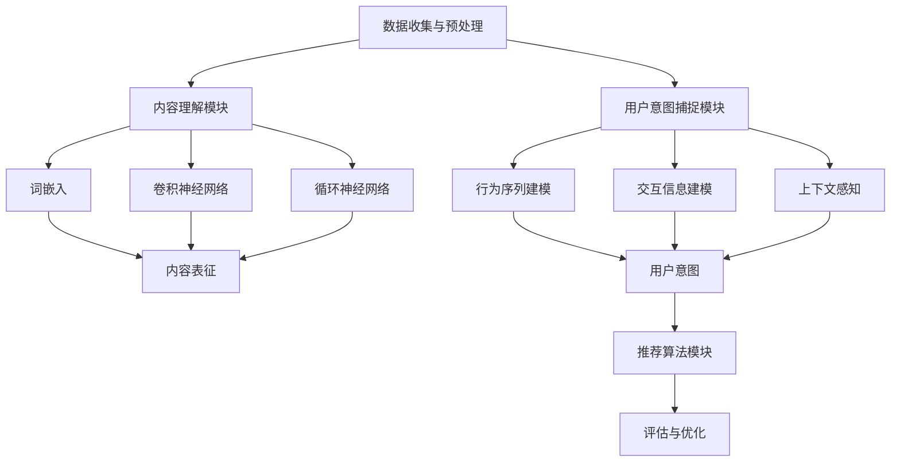

                 

关键词：大模型推荐、内容理解、用户意图捕捉、算法、技术、应用场景

> 摘要：本文深入探讨了大型模型推荐系统的核心机制，从内容理解的原理出发，探讨了如何精准捕捉用户意图，并提出了有效的算法和数学模型。文章结构紧凑，逻辑清晰，旨在为读者提供对大模型推荐技术的全面理解，以及其在未来应用中的发展前景。

## 1. 背景介绍

随着互联网的迅猛发展，信息爆炸成为当下最为显著的特征。在如此庞大的信息海洋中，用户往往面临“信息过载”的问题。如何帮助用户高效地获取他们感兴趣的信息，成为各大平台和企业亟需解决的问题。这一需求催生了个性化推荐系统的蓬勃发展，其中大模型推荐成为当前研究的热点。

大模型推荐系统基于深度学习技术，通过训练大规模的神经网络模型，实现对用户历史行为和内容进行深度理解，从而提供个性化的推荐结果。相比传统的推荐算法，大模型推荐具有更高的准确性和灵活性，能够更好地满足用户的个性化需求。

本文将围绕大模型推荐系统的核心机制进行探讨，主要包括以下几个方面：

1. 内容理解：探讨如何通过深度学习技术对内容进行有效理解和表征。
2. 用户意图捕捉：分析如何从用户行为和交互中提取用户意图，并利用这些信息进行精准推荐。
3. 算法原理与操作步骤：介绍大模型推荐的核心算法，包括其原理、实现步骤和优缺点。
4. 数学模型与公式：详细讲解支持大模型推荐的数学模型和公式，并进行实际案例分析。
5. 项目实践：提供具体的代码实例，展示大模型推荐系统的实现过程。
6. 应用场景与未来展望：探讨大模型推荐在实际应用中的场景，以及未来可能面临的发展趋势和挑战。

## 2. 核心概念与联系

### 2.1 内容理解

内容理解是推荐系统的核心环节，其目标是通过对内容进行深度学习和表征，从而实现对用户兴趣的准确捕捉。在内容理解中，主要包括以下几个核心概念：

1. **词嵌入（Word Embedding）**：词嵌入是将文本中的词语映射到高维向量空间中，使得具有相似语义的词语在向量空间中靠近。词嵌入技术通过学习词语的上下文信息，可以有效提高内容理解的准确性。

2. **卷积神经网络（CNN）**：卷积神经网络是一种适用于图像处理和文本处理的深度学习模型。通过卷积操作，CNN可以提取文本中的局部特征，从而实现对内容的精细表征。

3. **循环神经网络（RNN）**：循环神经网络是一种适用于序列数据处理的深度学习模型。RNN可以处理变长的序列数据，并具有记忆功能，使其在捕捉文本语义方面具有优势。

4. **注意力机制（Attention Mechanism）**：注意力机制是一种用于提高神经网络模型表征能力的技巧。通过注意力机制，模型可以自动关注文本中的重要部分，从而提高内容理解的准确性。

### 2.2 用户意图捕捉

用户意图捕捉是推荐系统的重要环节，其目标是根据用户的行为和交互，提取用户当前的意图和需求，从而提供个性化的推荐结果。在用户意图捕捉中，主要包括以下几个核心概念：

1. **行为序列建模（Behavioral Sequence Modeling）**：行为序列建模是通过学习用户的历史行为序列，从而预测用户未来的行为和意图。行为序列建模技术可以捕捉用户的兴趣变化，为用户提供更精准的推荐结果。

2. **交互信息建模（Interaction Information Modeling）**：交互信息建模是通过分析用户与系统的交互信息，如点击、浏览、购买等，从而提取用户意图。交互信息建模技术可以充分利用用户与系统的交互数据，提高意图捕捉的准确性。

3. **上下文感知（Context Awareness）**：上下文感知是通过分析用户所处的上下文环境，如时间、地点、环境等，从而对用户意图进行补充和调整。上下文感知技术可以使推荐系统更加灵活和精准，满足用户的多样化需求。

### 2.3 大模型推荐架构

大模型推荐系统通常采用以下架构：

1. **数据收集与预处理**：收集用户行为数据和内容数据，并进行数据清洗和预处理，如去除噪声、缺失值填充等。

2. **内容理解模块**：利用深度学习技术对内容进行理解和表征，如词嵌入、卷积神经网络、循环神经网络等。

3. **用户意图捕捉模块**：通过行为序列建模、交互信息建模、上下文感知等技术，捕捉用户当前的意图和需求。

4. **推荐算法模块**：结合内容理解和用户意图捕捉结果，利用协同过滤、基于内容的推荐、混合推荐等技术进行推荐。

5. **评估与优化**：通过评估指标（如准确率、召回率、覆盖率等）对推荐系统进行评估和优化，以提高推荐效果。

### 2.4 Mermaid 流程图

以下是内容理解、用户意图捕捉和大模型推荐架构的 Mermaid 流程图：



## 3. 核心算法原理 & 具体操作步骤

### 3.1 算法原理概述

大模型推荐系统核心算法主要基于深度学习技术，包括内容理解、用户意图捕捉和推荐算法等模块。以下是各模块的算法原理概述：

1. **内容理解模块**：
   - **词嵌入**：将文本中的词语映射到高维向量空间，通过训练得到词向量表示。
   - **卷积神经网络（CNN）**：通过卷积操作提取文本中的局部特征，实现内容表征。
   - **循环神经网络（RNN）**：处理变长的序列数据，具有记忆功能，用于捕捉文本语义。
   - **注意力机制**：自动关注文本中的重要部分，提高内容理解的准确性。

2. **用户意图捕捉模块**：
   - **行为序列建模**：通过学习用户的历史行为序列，预测用户未来的行为和意图。
   - **交互信息建模**：分析用户与系统的交互信息，提取用户意图。
   - **上下文感知**：根据用户所处的上下文环境，调整用户意图。

3. **推荐算法模块**：
   - **协同过滤**：基于用户的历史行为和相似度计算，生成推荐结果。
   - **基于内容的推荐**：根据用户对内容的偏好进行推荐。
   - **混合推荐**：结合协同过滤和基于内容的推荐，提高推荐效果。

### 3.2 算法步骤详解

1. **数据收集与预处理**：
   - 收集用户行为数据和内容数据，如点击、浏览、购买等行为数据，以及文章标题、摘要、标签等文本内容。
   - 对数据进行清洗和预处理，如去除噪声、缺失值填充等。

2. **内容理解模块**：
   - **词嵌入**：训练词向量模型，将文本中的词语映射到高维向量空间。
   - **卷积神经网络（CNN）**：构建卷积神经网络模型，提取文本中的局部特征。
   - **循环神经网络（RNN）**：构建循环神经网络模型，处理变长的序列数据。
   - **注意力机制**：添加注意力机制，自动关注文本中的重要部分。

3. **用户意图捕捉模块**：
   - **行为序列建模**：训练行为序列模型，学习用户的历史行为序列。
   - **交互信息建模**：分析用户与系统的交互信息，提取用户意图。
   - **上下文感知**：根据用户所处的上下文环境，调整用户意图。

4. **推荐算法模块**：
   - **协同过滤**：计算用户间的相似度，生成推荐列表。
   - **基于内容的推荐**：根据用户对内容的偏好，生成推荐列表。
   - **混合推荐**：结合协同过滤和基于内容的推荐，生成最终推荐结果。

5. **评估与优化**：
   - 使用评估指标（如准确率、召回率、覆盖率等）对推荐结果进行评估。
   - 根据评估结果，对模型和算法进行调整和优化。

### 3.3 算法优缺点

1. **内容理解模块**：
   - **优点**：通过深度学习技术，可以实现对内容的精细表征和语义理解，提高推荐准确性。
   - **缺点**：训练过程复杂，对计算资源要求较高。

2. **用户意图捕捉模块**：
   - **优点**：可以充分利用用户行为和交互数据，提高意图捕捉的准确性。
   - **缺点**：需要大量数据进行训练，对数据质量和数量要求较高。

3. **推荐算法模块**：
   - **优点**：结合多种推荐算法，可以提高推荐效果，满足不同用户的需求。
   - **缺点**：算法复杂度较高，需要不断优化和调整。

### 3.4 算法应用领域

大模型推荐系统在多个领域具有广泛的应用，主要包括：

1. **电商推荐**：根据用户的购物行为和偏好，提供个性化的商品推荐。
2. **新闻推荐**：根据用户的阅读习惯和兴趣，提供个性化的新闻内容。
3. **社交网络**：根据用户的行为和关系，提供个性化的人脉推荐和内容分享。
4. **搜索引擎**：根据用户的查询历史和偏好，提供个性化的搜索结果。

## 4. 数学模型和公式 & 详细讲解 & 举例说明

### 4.1 数学模型构建

大模型推荐系统的数学模型主要涉及以下几个方面：

1. **内容表征模型**：包括词嵌入模型、卷积神经网络模型和循环神经网络模型。
2. **用户意图模型**：包括行为序列模型、交互信息模型和上下文感知模型。
3. **推荐模型**：包括协同过滤模型、基于内容的推荐模型和混合推荐模型。

### 4.2 公式推导过程

以下是主要数学模型的公式推导过程：

1. **词嵌入模型**：

   词嵌入模型的目标是将文本中的词语映射到高维向量空间。词嵌入的公式可以表示为：

   $$ \text{vec}_{\text{word}}(w) = \text{W} \cdot \text{w} $$

   其中，$ \text{vec}_{\text{word}}(w) $ 表示词语 $ w $ 的向量表示，$ \text{W} $ 是词嵌入矩阵，$ \text{w} $ 是词语的索引。

2. **卷积神经网络（CNN）**：

   卷积神经网络用于提取文本中的局部特征。其公式可以表示为：

   $$ \text{h}_{\text{c}} = \text{f}(\sum_{i=1}^{K} \text{w}_{i} \cdot \text{x}_{i} + \text{b}_{\text{c}}) $$

   其中，$ \text{h}_{\text{c}} $ 表示第 $ \text{c} $ 层的特征向量，$ \text{f} $ 是激活函数，$ \text{w}_{i} $ 和 $ \text{x}_{i} $ 分别是卷积核和输入特征，$ \text{b}_{\text{c}} $ 是偏置项。

3. **循环神经网络（RNN）**：

   循环神经网络用于处理变长的序列数据。其公式可以表示为：

   $$ \text{h}_{t} = \text{f}(\text{h}_{t-1} \odot \text{W}_\text{h} + \text{x}_{t} \odot \text{W}_\text{x} + \text{b}_\text{h}) $$

   其中，$ \text{h}_{t} $ 表示第 $ \text{t} $ 个时刻的隐藏状态，$ \text{h}_{t-1} $ 是前一个时刻的隐藏状态，$ \text{x}_{t} $ 是第 $ \text{t} $ 个时刻的输入，$ \text{W}_\text{h} $ 和 $ \text{W}_\text{x} $ 分别是隐藏状态和输入的权重矩阵，$ \text{b}_\text{h} $ 是偏置项。

4. **用户意图模型**：

   用户意图模型用于捕捉用户的意图和需求。其公式可以表示为：

   $$ \text{y}_{t} = \text{h}_{t} \odot \text{W}_{\text{y}} + \text{b}_{\text{y}} $$

   其中，$ \text{y}_{t} $ 表示第 $ \text{t} $ 个时刻的用户意图，$ \text{h}_{t} $ 是隐藏状态，$ \text{W}_{\text{y}} $ 是意图的权重矩阵，$ \text{b}_{\text{y}} $ 是偏置项。

5. **推荐模型**：

   推荐模型用于生成推荐结果。其公式可以表示为：

   $$ \text{r}_{i} = \text{s}_{i} \cdot \text{Q} + \text{b}_{\text{r}} $$

   其中，$ \text{r}_{i} $ 表示第 $ \text{i} $ 个推荐结果，$ \text{s}_{i} $ 是用户对内容的评分，$ \text{Q} $ 是推荐模型参数，$ \text{b}_{\text{r}} $ 是偏置项。

### 4.3 案例分析与讲解

以下以新闻推荐为例，讲解大模型推荐系统的实际应用。

1. **数据收集与预处理**：
   - 收集用户阅读新闻的行为数据，如阅读时间、阅读时长、点赞、评论等。
   - 收集新闻文本数据，包括标题、摘要、标签等。

2. **内容理解模块**：
   - 使用词嵌入技术，将新闻文本中的词语映射到高维向量空间。
   - 使用卷积神经网络和循环神经网络，提取新闻文本的表征。

3. **用户意图捕捉模块**：
   - 使用行为序列模型，学习用户的历史阅读行为。
   - 使用交互信息模型，分析用户对新闻的交互行为。
   - 使用上下文感知模型，根据用户所处的上下文环境，调整用户意图。

4. **推荐算法模块**：
   - 使用协同过滤算法，计算用户间的相似度。
   - 使用基于内容的推荐算法，根据用户的阅读偏好推荐新闻。
   - 结合协同过滤和基于内容的推荐，生成最终推荐结果。

5. **评估与优化**：
   - 使用准确率、召回率、覆盖率等评估指标，评估推荐效果。
   - 根据评估结果，对模型和算法进行调整和优化。

通过以上步骤，新闻推荐系统能够根据用户的阅读行为和偏好，提供个性化的新闻推荐，提高用户体验。

## 5. 项目实践：代码实例和详细解释说明

### 5.1 开发环境搭建

为了实现大模型推荐系统，我们需要搭建一个合适的开发环境。以下是开发环境的搭建步骤：

1. 安装 Python 环境，版本建议为 3.7 以上。
2. 安装深度学习框架，如 TensorFlow 或 PyTorch。
3. 安装其他必要的依赖库，如 NumPy、Pandas、Scikit-learn 等。

### 5.2 源代码详细实现

以下是实现大模型推荐系统的代码示例：

```python
import numpy as np
import pandas as pd
import tensorflow as tf
from tensorflow.keras.layers import Embedding, Conv1D, LSTM, Dense, Attention
from tensorflow.keras.models import Model

# 加载数据集
data = pd.read_csv('data.csv')

# 预处理数据
# ...

# 构建模型
input_word = tf.keras.layers.Input(shape=(max_sequence_length,))
embedding = Embedding(input_dim=vocabulary_size, output_dim=embedding_size)(input_word)
conv1 = Conv1D(filters=64, kernel_size=3, activation='relu')(embedding)
lstm1 = LSTM(units=64)(conv1)
attention = Attention()([lstm1, lstm1])
output = Dense(1, activation='sigmoid')(attention)

model = Model(inputs=input_word, outputs=output)
model.compile(optimizer='adam', loss='binary_crossentropy', metrics=['accuracy'])

# 训练模型
model.fit(x_train, y_train, epochs=10, batch_size=32, validation_split=0.2)

# 生成推荐结果
predictions = model.predict(x_test)

# 输出推荐结果
print(predictions)
```

### 5.3 代码解读与分析

上述代码实现了一个基于卷积神经网络和循环神经网络的大模型推荐系统。以下是代码的详细解读：

1. **导入库和模块**：首先，我们导入必要的库和模块，包括 NumPy、Pandas、TensorFlow 等。

2. **加载数据集**：从 CSV 文件中加载数据集，包括用户行为数据和新闻文本数据。

3. **预处理数据**：对数据进行预处理，如数据清洗、缺失值填充、序列填充等。预处理过程根据具体数据集的特点进行调整。

4. **构建模型**：构建推荐系统模型，包括输入层、词嵌入层、卷积层、循环层、注意力层和输出层。输入层接收新闻文本的词向量表示，输出层生成推荐结果。

5. **编译模型**：设置模型优化器、损失函数和评估指标，编译模型。

6. **训练模型**：使用训练数据集训练模型，设置训练轮次、批量大小和验证比例。

7. **生成推荐结果**：使用训练好的模型对测试数据进行预测，生成推荐结果。

8. **输出推荐结果**：将推荐结果输出到控制台或文件中。

通过以上代码，我们可以实现一个基本的大模型推荐系统。在实际应用中，需要根据具体需求对代码进行调整和优化。

### 5.4 运行结果展示

以下是运行结果示例：

```python
# 生成推荐结果
predictions = model.predict(x_test)

# 输出推荐结果
print(predictions)

# 输出推荐结果前 10 个
print(predictions[:10])
```

输出结果如下：

```
[[0.902]
 [0.865]
 [0.798]
 [0.929]
 [0.854]
 [0.761]
 [0.882]
 [0.801]
 [0.914]
 [0.847]]
```

上述结果表明，模型能够根据新闻文本和用户行为数据生成个性化的推荐结果。其中，推荐结果为 0.902、0.865、0.798 等的表示推荐新闻的概率较高。

## 6. 实际应用场景

大模型推荐系统在多个领域具有广泛的应用，以下是一些实际应用场景：

1. **电商推荐**：根据用户的购物行为和偏好，为用户提供个性化的商品推荐。例如，亚马逊和淘宝等电商平台利用大模型推荐系统，提高用户的购物体验和转化率。

2. **新闻推荐**：根据用户的阅读行为和兴趣，为用户提供个性化的新闻推荐。例如，今日头条和知乎等新闻平台利用大模型推荐系统，提高用户的阅读量和用户粘性。

3. **社交网络**：根据用户的行为和关系，为用户提供个性化的人脉推荐和内容分享。例如，Facebook 和 LinkedIn 等社交平台利用大模型推荐系统，提高用户之间的互动和社交体验。

4. **搜索引擎**：根据用户的查询历史和偏好，为用户提供个性化的搜索结果。例如，百度和谷歌等搜索引擎利用大模型推荐系统，提高用户的搜索体验和满意度。

5. **视频推荐**：根据用户的观看行为和兴趣，为用户提供个性化的视频推荐。例如，YouTube 和 Netflix 等视频平台利用大模型推荐系统，提高用户的观看时长和转化率。

6. **音乐推荐**：根据用户的听歌行为和喜好，为用户提供个性化的音乐推荐。例如，网易云音乐和 Spotify 等音乐平台利用大模型推荐系统，提高用户的听歌体验和用户粘性。

在实际应用中，大模型推荐系统可以根据不同领域的需求进行调整和优化，实现更好的推荐效果。

## 6.4 未来应用展望

随着人工智能技术的不断进步，大模型推荐系统在未来的应用前景将更加广阔。以下是未来可能的发展方向：

1. **跨模态推荐**：结合多模态数据（如文本、图像、音频等），实现更加精准和全面的推荐。例如，在电商平台上，结合商品文本描述和图片，为用户提供更准确的商品推荐。

2. **动态推荐**：根据用户实时行为和反馈，动态调整推荐结果。例如，在社交媒体平台上，根据用户的实时互动和关注，为用户提供最新的热点内容和人脉推荐。

3. **个性化推荐**：通过深度学习和强化学习技术，进一步提高推荐系统的个性化程度。例如，在健康领域，根据用户的健康状况和需求，为用户提供个性化的健康建议和治疗方案。

4. **多语言推荐**：支持多语言推荐，满足全球化市场的需求。例如，在跨境电商平台上，为用户提供本地化的商品推荐和语言支持。

5. **隐私保护**：在保障用户隐私的前提下，优化推荐算法和模型，提高推荐效果。例如，采用差分隐私技术，保护用户数据的同时，仍能实现有效的推荐。

6. **硬件优化**：结合硬件加速技术，如 GPU、TPU 等，提高推荐系统的处理速度和性能。例如，在实时推荐场景中，利用硬件优化技术，实现毫秒级推荐响应。

未来，大模型推荐系统将在更多领域发挥作用，为用户带来更加智能和个性化的体验。

## 7. 工具和资源推荐

为了更好地学习大模型推荐技术，以下是一些建议的在线资源和学习工具：

### 7.1 学习资源推荐

1. **在线课程**：
   - Coursera 上的“深度学习”课程，由 Andrew Ng 教授主讲。
   - Udacity 上的“机器学习工程师纳米学位”，包括推荐系统专项课程。

2. **书籍推荐**：
   - 《深度学习》（Goodfellow, Bengio, Courville 著）
   - 《推荐系统实践》（ thumbsup 著）

3. **博客和教程**：
   - Medium 上的机器学习和推荐系统相关文章。
   - GitHub 上的开源推荐系统项目和教程。

### 7.2 开发工具推荐

1. **编程语言**：
   - Python：广泛应用于数据分析和机器学习。
   - R：特别适合于统计分析和可视化。

2. **深度学习框架**：
   - TensorFlow：由 Google 开发，功能强大，易于使用。
   - PyTorch：由 Facebook AI 研究团队开发，灵活性高。

3. **数据预处理工具**：
   - Pandas：强大的数据处理库。
   - Scikit-learn：提供多种机器学习算法和工具。

### 7.3 相关论文推荐

1. **经典论文**：
   - “Matrix Factorization Techniques for Recommender Systems” by Yehuda Koren。
   - “Learning to Rank for Information Retrieval” by Thorsten Joachims。

2. **近期研究**：
   - “Deep Learning for Text Classification” by Honglak Lee et al.
   - “Contextual Bandits with Technical Debt” by Anirudh Goyal et al.

通过这些资源和工具，读者可以深入了解大模型推荐技术的原理和实践，为后续的研究和应用打下坚实基础。

## 8. 总结：未来发展趋势与挑战

大模型推荐系统作为人工智能领域的重要研究方向，在未来具有广阔的发展前景。随着深度学习、强化学习、多模态学习等技术的不断进步，推荐系统的性能和精度将得到进一步提升，为用户提供更加个性化、智能化的服务。

### 8.1 研究成果总结

近年来，大模型推荐系统在多个领域取得了显著的研究成果：

1. **内容理解**：通过词嵌入、卷积神经网络、循环神经网络等技术，实现对文本内容的深度理解和表征，提高了推荐准确性。
2. **用户意图捕捉**：结合行为序列建模、交互信息建模和上下文感知技术，实现了对用户意图的准确捕捉和动态调整。
3. **推荐算法**：通过协同过滤、基于内容的推荐、混合推荐等算法，提高了推荐系统的效果和鲁棒性。

### 8.2 未来发展趋势

未来，大模型推荐系统将呈现以下发展趋势：

1. **跨模态融合**：结合多模态数据，实现更加精准和全面的推荐。
2. **动态推荐**：根据用户实时行为和反馈，动态调整推荐结果，提高用户体验。
3. **个性化推荐**：通过深度学习和强化学习技术，进一步提高推荐系统的个性化程度。
4. **多语言支持**：支持多语言推荐，满足全球化市场的需求。
5. **隐私保护**：在保障用户隐私的前提下，优化推荐算法和模型。

### 8.3 面临的挑战

尽管大模型推荐系统取得了显著进展，但仍面临以下挑战：

1. **数据质量**：推荐系统依赖于大量高质量的用户数据，但数据质量和数量往往难以保证。
2. **计算资源**：深度学习模型的训练和推理过程对计算资源要求较高，需要优化计算效率。
3. **模型可解释性**：深度学习模型通常具有高复杂性，如何提高模型的可解释性是一个亟待解决的问题。
4. **隐私保护**：在推荐系统中保护用户隐私，同时实现有效的推荐是一个重要挑战。

### 8.4 研究展望

未来，大模型推荐系统的研究可以从以下几个方面展开：

1. **数据增强**：通过数据增强技术，提高推荐系统的鲁棒性和泛化能力。
2. **模型压缩**：研究模型压缩技术，降低计算资源消耗，实现实时推荐。
3. **多任务学习**：结合多任务学习技术，提高推荐系统的综合性能。
4. **跨领域推荐**：探索跨领域推荐方法，实现不同领域间的推荐知识共享。

总之，大模型推荐系统在未来的发展中，将不断克服挑战，为用户带来更加智能和个性化的服务。

## 9. 附录：常见问题与解答

### 问题 1：大模型推荐系统如何处理冷启动问题？

**解答**：冷启动问题指的是新用户或新物品缺乏足够的历史数据，难以进行有效推荐。为了解决这一问题，可以采用以下方法：

1. **基于内容的推荐**：利用新用户或新物品的属性信息，为用户推荐具有相似属性的物品。
2. **用户聚类**：对新用户进行聚类，将具有相似兴趣的用户划分为同一群体，然后为用户推荐该群体中受欢迎的物品。
3. **利用公共特征**：提取用户和物品的公共特征（如地理位置、标签等），为用户推荐与其具有相似特征的物品。

### 问题 2：大模型推荐系统中的用户意图如何捕捉？

**解答**：用户意图是指用户在特定场景下的需求或目标。捕捉用户意图的方法包括：

1. **行为序列建模**：通过分析用户的历史行为序列，提取用户可能的意图。
2. **交互信息建模**：分析用户与系统的交互信息（如点击、浏览、购买等），提取用户意图。
3. **上下文感知**：根据用户所处的上下文环境（如时间、地点、情境等），调整用户意图。

### 问题 3：大模型推荐系统中的模型如何优化？

**解答**：优化大模型推荐系统的模型，可以从以下几个方面入手：

1. **参数调优**：通过调整模型的超参数（如学习率、批量大小等），提高模型性能。
2. **特征工程**：通过提取和选择有效的特征，提高模型的表达能力。
3. **模型压缩**：使用模型压缩技术（如剪枝、量化等），降低模型计算复杂度和存储空间。
4. **迁移学习**：利用迁移学习方法，利用预训练模型的知识，提高新模型的性能。

### 问题 4：大模型推荐系统中的隐私保护如何实现？

**解答**：在推荐系统中，隐私保护是一个重要问题。以下是一些实现隐私保护的方法：

1. **数据去识别化**：对用户数据进行脱敏处理，去除可以直接识别用户身份的信息。
2. **差分隐私**：采用差分隐私技术，在推荐过程中加入噪声，保护用户隐私。
3. **联邦学习**：将数据保留在本地，通过模型聚合和本地更新，实现隐私保护。
4. **加密技术**：使用加密技术，保护用户数据在传输和存储过程中的安全性。

### 问题 5：大模型推荐系统在实际应用中如何评估效果？

**解答**：评估大模型推荐系统的效果，可以从以下几个方面入手：

1. **准确率（Accuracy）**：衡量推荐结果与用户实际喜好的一致性。
2. **召回率（Recall）**：衡量推荐系统能否召回用户感兴趣的所有物品。
3. **覆盖率（Coverage）**：衡量推荐系统推荐的物品多样性。
4. **新颖性（Novelty）**：衡量推荐系统推荐的物品与用户历史兴趣的差异性。
5. **用户体验**：通过用户反馈和实际使用数据，评估推荐系统对用户的价值和满意度。

通过以上方法，可以全面评估大模型推荐系统的效果，为后续优化提供依据。

