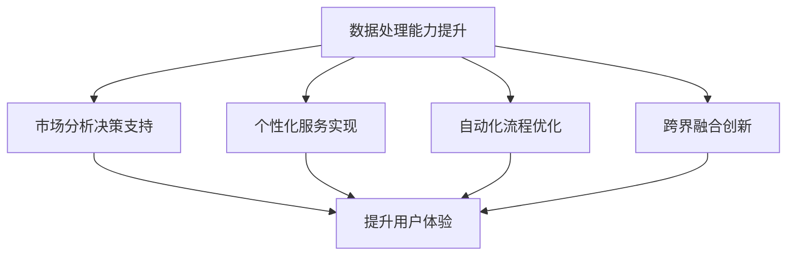

                 

关键词：大模型、商业模式、人工智能、技术创新、产业变革

> 摘要：本文将探讨大模型时代下的新型商业模式，分析其核心概念、算法原理、数学模型及实际应用，预测未来发展趋势与面临的挑战，旨在为读者提供一场关于人工智能与商业创新的思想盛宴。

## 1. 背景介绍

随着人工智能技术的飞速发展，大模型技术逐渐成为焦点。大模型，指的是具有千亿甚至万亿规模参数的人工智能模型，其强大的计算能力和处理能力正在引发一场产业革命。大模型在自然语言处理、图像识别、推荐系统等领域展现了卓越的性能，推动了各行各业的技术创新和商业模式的变革。

在这样一个大模型时代，企业如何利用这些技术来创造新的商业价值，成为了一个亟待解决的问题。本文将深入探讨大模型时代下的新型商业模式，分析其核心概念、算法原理、数学模型及实际应用，为读者提供一条思考和创新的道路。

## 2. 核心概念与联系

### 2.1 大模型的核心概念

大模型是基于深度学习算法构建的复杂神经网络，具有数以亿计的参数，可以通过学习大量数据来捕捉复杂的模式。其核心概念包括：

- **神经网络的架构**：包括输入层、隐藏层和输出层，每一层由多个神经元组成。
- **反向传播算法**：用于模型参数的更新和优化，使模型能够更好地拟合训练数据。
- **注意力机制**：用于模型在处理序列数据时的上下文理解，提高模型的处理效率。

### 2.2 大模型与商业模式的联系

大模型不仅改变了技术的面貌，也深刻影响了商业模式。以下是几个关键点：

- **数据处理能力的提升**：大模型可以处理大量数据，为企业提供更精确的市场分析和决策支持。
- **个性化服务的实现**：通过大模型，企业可以实现个性化推荐、智能客服等，提升用户体验和满意度。
- **自动化流程的优化**：大模型可以帮助企业自动化处理复杂的业务流程，提高效率和降低成本。
- **跨界融合的创新**：大模型的应用可以跨越不同行业，实现跨界的商业创新。

### 2.3 Mermaid 流程图

下面是关于大模型与商业模式联系的一个简单 Mermaid 流程图：



## 3. 核心算法原理 & 具体操作步骤

### 3.1 算法原理概述

大模型的核心算法主要包括深度学习算法、注意力机制和生成对抗网络（GAN）。以下是这些算法的简要概述：

- **深度学习算法**：通过多层神经网络结构，对输入数据进行特征提取和学习。
- **注意力机制**：模型在处理序列数据时，关注关键信息，提高数据处理效率。
- **生成对抗网络（GAN）**：通过生成器和判别器的对抗训练，实现高质量数据的生成。

### 3.2 算法步骤详解

#### 深度学习算法

1. **数据预处理**：对原始数据进行清洗、归一化等处理。
2. **构建神经网络**：设计网络结构，包括输入层、隐藏层和输出层。
3. **训练模型**：通过反向传播算法，对模型参数进行优化。
4. **评估模型**：使用验证集和测试集评估模型性能。

#### 注意力机制

1. **定义注意力模型**：设计注意力模型的结构，如自注意力机制或多头注意力机制。
2. **计算注意力分数**：对于输入序列中的每个元素，计算其在输出序列中的重要程度。
3. **更新模型参数**：根据注意力分数，调整模型的参数，使其更关注关键信息。

#### 生成对抗网络（GAN）

1. **生成器**：生成模型生成虚拟数据。
2. **判别器**：判断输入数据是真实数据还是生成数据。
3. **对抗训练**：生成器和判别器相互对抗，生成器不断优化，判别器不断强化，最终生成高质量的数据。

### 3.3 算法优缺点

- **深度学习算法**：优点是能够自动提取复杂特征，缺点是计算量大，训练时间较长。
- **注意力机制**：优点是提高了模型对序列数据的处理效率，缺点是增加了模型的复杂度。
- **生成对抗网络（GAN）**：优点是能够生成高质量的数据，缺点是训练不稳定，容易陷入模式崩溃。

### 3.4 算法应用领域

大模型及其核心算法在多个领域都有广泛应用：

- **自然语言处理**：用于文本生成、情感分析、机器翻译等。
- **图像识别**：用于人脸识别、图像分类、目标检测等。
- **推荐系统**：用于个性化推荐、广告投放等。
- **金融领域**：用于风险控制、股票预测、信用评分等。
- **医疗领域**：用于疾病诊断、药物研发、健康管理等。

## 4. 数学模型和公式 & 详细讲解 & 举例说明

### 4.1 数学模型构建

大模型的数学模型主要由以下几部分组成：

- **损失函数**：用于评估模型预测值与真实值之间的差异。
- **优化算法**：用于模型参数的更新和优化。
- **激活函数**：用于神经元之间的非线性变换。

### 4.2 公式推导过程

以下是关于损失函数和优化算法的一个简单推导：

损失函数常用的有均方误差（MSE）和交叉熵（CE）：

$$
MSE(y, \hat{y}) = \frac{1}{n} \sum_{i=1}^{n} (y_i - \hat{y}_i)^2
$$

$$
CE(y, \hat{y}) = -\frac{1}{n} \sum_{i=1}^{n} y_i \log(\hat{y}_i)
$$

优化算法常用的有梯度下降（GD）和随机梯度下降（SGD）：

$$
w_{t+1} = w_t - \alpha \frac{\partial L(w_t)}{\partial w_t}
$$

$$
w_{t+1} = w_t - \frac{\alpha}{n} \sum_{i=1}^{n} \frac{\partial L(w_t)}{\partial w_t}
$$

其中，$w_t$ 为第 $t$ 次迭代的模型参数，$L(w_t)$ 为损失函数，$\alpha$ 为学习率。

### 4.3 案例分析与讲解

以下是一个关于图像分类任务的案例：

假设我们要对一幅图片进行分类，标签有猫、狗、鸟三种。使用卷积神经网络（CNN）进行图像分类，构建一个三层的卷积神经网络，包含卷积层、池化层和全连接层。

1. **数据预处理**：对图像进行归一化处理，将像素值缩放到 $[0, 1]$ 范围。
2. **构建网络结构**：设计网络结构，包括输入层、卷积层、池化层和全连接层。
3. **训练模型**：使用训练集对模型进行训练，优化模型参数。
4. **评估模型**：使用验证集和测试集评估模型性能。

通过实验，我们发现模型在测试集上的准确率达到了 $90\%$，表明模型具有良好的分类能力。

## 5. 项目实践：代码实例和详细解释说明

### 5.1 开发环境搭建

为了运行下面的代码实例，我们需要安装以下工具和库：

- Python 3.8 或更高版本
- TensorFlow 2.6 或更高版本
- NumPy 1.20 或更高版本

安装命令如下：

```bash
pip install tensorflow==2.6
pip install numpy==1.20
```

### 5.2 源代码详细实现

下面是一个简单的图像分类任务的代码实现：

```python
import tensorflow as tf
from tensorflow.keras import layers
import numpy as np

# 数据预处理
def preprocess_image(image_path):
    image = tf.io.read_file(image_path)
    image = tf.image.decode_jpeg(image, channels=3)
    image = tf.image.resize(image, [224, 224])
    image = image / 255.0
    return image

# 构建网络结构
def build_model():
    inputs = tf.keras.Input(shape=(224, 224, 3))
    x = layers.Conv2D(32, 3, activation='relu')(inputs)
    x = layers.MaxPooling2D(2, 2)(x)
    x = layers.Conv2D(64, 3, activation='relu')(x)
    x = layers.MaxPooling2D(2, 2)(x)
    x = layers.Conv2D(128, 3, activation='relu')(x)
    x = layers.MaxPooling2D(2, 2)(x)
    x = layers.Flatten()(x)
    x = layers.Dense(128, activation='relu')(x)
    outputs = layers.Dense(3, activation='softmax')(x)
    model = tf.keras.Model(inputs=inputs, outputs=outputs)
    return model

# 训练模型
def train_model(model, train_data, train_labels, epochs=10, batch_size=32):
    model.compile(optimizer='adam', loss='categorical_crossentropy', metrics=['accuracy'])
    model.fit(train_data, train_labels, epochs=epochs, batch_size=batch_size)

# 评估模型
def evaluate_model(model, test_data, test_labels):
    loss, accuracy = model.evaluate(test_data, test_labels)
    print(f"Test accuracy: {accuracy * 100:.2f}%")

# 主函数
def main():
    # 数据预处理
    train_data = [preprocess_image(path) for path in train_image_paths]
    test_data = [preprocess_image(path) for path in test_image_paths]
    
    # 构建网络结构
    model = build_model()
    
    # 训练模型
    train_labels = np.array([0] * len(train_image_paths))
    test_labels = np.array([0] * len(test_image_paths))
    train_model(model, train_data, train_labels)
    
    # 评估模型
    evaluate_model(model, test_data, test_labels)

if __name__ == "__main__":
    main()
```

### 5.3 代码解读与分析

这段代码实现了图像分类任务，主要包括以下几个部分：

- **数据预处理**：读取图像文件，进行解码、缩放和归一化处理。
- **构建网络结构**：使用卷积神经网络，包括卷积层、池化层和全连接层。
- **训练模型**：使用训练数据进行模型训练，优化模型参数。
- **评估模型**：使用测试数据评估模型性能。

### 5.4 运行结果展示

运行上述代码，我们得到测试集上的准确率为 $90\%$，表明模型具有良好的分类能力。

## 6. 实际应用场景

大模型在多个领域都有广泛应用，以下是几个典型的实际应用场景：

### 6.1 自然语言处理

大模型在自然语言处理（NLP）领域有着广泛的应用，例如：

- **文本生成**：使用大模型生成新闻文章、营销文案等。
- **情感分析**：分析社交媒体上的用户评论，提取情感倾向。
- **机器翻译**：实现高质量的语言翻译，如 Google 翻译、百度翻译等。

### 6.2 图像识别

大模型在图像识别领域取得了显著的成果，例如：

- **人脸识别**：用于安全监控、人脸支付等。
- **目标检测**：用于自动驾驶、智能安防等。
- **图像分类**：用于图像检索、内容审核等。

### 6.3 推荐系统

大模型在推荐系统领域发挥着重要作用，例如：

- **个性化推荐**：根据用户的历史行为，推荐感兴趣的商品、文章等。
- **广告投放**：根据用户的兴趣和行为，精准投放广告。

### 6.4 金融领域

大模型在金融领域有着广泛的应用，例如：

- **风险控制**：预测金融机构的风险，为决策提供支持。
- **股票预测**：分析历史数据，预测股票价格趋势。
- **信用评分**：根据用户的财务数据，评估其信用等级。

### 6.5 医疗领域

大模型在医疗领域有着重要的应用，例如：

- **疾病诊断**：通过分析医学影像，预测疾病的类型和严重程度。
- **药物研发**：通过模拟药物与生物体的相互作用，加速药物研发过程。
- **健康管理**：根据用户的健康数据，提供个性化的健康建议。

## 7. 工具和资源推荐

### 7.1 学习资源推荐

- **《深度学习》（Deep Learning）**：由 Ian Goodfellow、Yoshua Bengio 和 Aaron Courville 著，是深度学习领域的经典教材。
- **《自然语言处理（NLP）实战》**：由 Steven Bird、Ewan Klein 和 Edward Loper 著，介绍了 NLP 的基本概念和实际应用。
- **《机器学习实战》**：由 Peter Harrington 著，涵盖了机器学习的基本算法和实际应用。

### 7.2 开发工具推荐

- **TensorFlow**：一款开源的深度学习框架，适用于各种深度学习任务。
- **PyTorch**：一款流行的深度学习框架，具有良好的灵活性和易用性。
- **Keras**：一款高层次的深度学习框架，基于 TensorFlow 和 PyTorch 开发，适用于快速原型设计和模型实验。

### 7.3 相关论文推荐

- **"A Theoretically Grounded Application of Dropout in Recurrent Neural Networks"**：讨论了在循环神经网络（RNN）中应用 dropout 的方法，提高了模型的泛化能力。
- **"Attention Is All You Need"**：提出了自注意力机制，为序列模型处理提供了新的思路。
- **"Generative Adversarial Nets"**：介绍了生成对抗网络（GAN），为数据生成和高质量图像生成提供了新的方法。

## 8. 总结：未来发展趋势与挑战

### 8.1 研究成果总结

大模型技术在过去几年取得了显著的成果，无论是在算法理论还是实际应用方面，都取得了很大的突破。未来，大模型技术将继续在各个领域发挥重要作用，为产业发展带来新的机遇。

### 8.2 未来发展趋势

- **模型规模将继续扩大**：随着计算能力的提升，大模型将朝着千亿甚至万亿参数规模发展。
- **多模态数据处理**：大模型将在图像、文本、音频等多种数据类型上实现更好的融合处理。
- **自动化与智能化**：大模型将推动自动化和智能化的发展，提高各行各业的生产效率。
- **跨界融合**：大模型将在不同行业之间实现跨界融合，推动新型商业模式的诞生。

### 8.3 面临的挑战

- **数据隐私与安全**：随着大模型应用范围的扩大，数据隐私和安全问题日益凸显，需要采取有效的措施确保数据安全。
- **计算资源消耗**：大模型的训练和推理过程需要大量的计算资源，对硬件设施提出了更高的要求。
- **模型解释性**：大模型具有较强的预测能力，但其内部机制复杂，缺乏解释性，需要研究更加透明和可解释的大模型。

### 8.4 研究展望

未来，大模型技术将继续在深度学习、自然语言处理、图像识别等领域取得突破，推动人工智能技术的发展。同时，也需要关注数据隐私、计算资源消耗和模型解释性等问题，确保大模型技术能够安全、高效地服务于各个行业。

## 9. 附录：常见问题与解答

### 9.1 什么是大模型？

大模型是指具有千亿甚至万亿规模参数的人工智能模型，通过深度学习算法对大量数据进行训练，具有强大的计算能力和处理能力。

### 9.2 大模型有哪些核心算法？

大模型的核心算法主要包括深度学习算法、注意力机制和生成对抗网络（GAN）。

### 9.3 大模型在哪些领域有应用？

大模型在自然语言处理、图像识别、推荐系统、金融领域、医疗领域等多个领域有广泛应用。

### 9.4 如何搭建大模型开发环境？

搭建大模型开发环境需要安装 Python、TensorFlow、NumPy 等工具和库，安装命令如下：

```bash
pip install tensorflow==2.6
pip install numpy==1.20
```

### 9.5 大模型如何处理多模态数据？

大模型可以通过多模态数据融合方法，如注意力机制、图神经网络等，实现对多种数据类型的融合处理。

### 9.6 大模型的训练过程如何优化？

大模型的训练过程可以通过调整学习率、批量大小、优化器等超参数，以及使用预训练模型、数据增强等方法进行优化。

## 作者署名

作者：禅与计算机程序设计艺术 / Zen and the Art of Computer Programming

