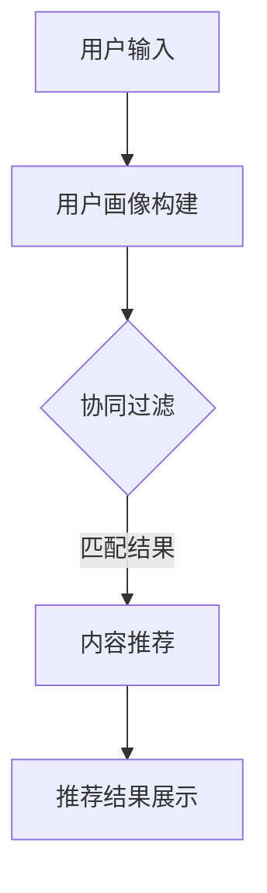

                 

关键词：大模型、推荐系统、冷启动策略、人工智能、创新

> 摘要：本文探讨了在大模型时代，推荐系统如何通过创新策略来解决冷启动问题。从背景介绍到核心概念，再到算法原理、数学模型、项目实践和未来展望，全方位分析了冷启动策略在推荐系统中的应用与前景。

## 1. 背景介绍

随着互联网技术的迅猛发展，推荐系统已经成为电商平台、社交媒体、在线视频平台等众多领域的重要应用。然而，推荐系统的冷启动问题一直是困扰研究人员和开发者的难题。冷启动主要指新用户加入系统后，由于缺乏足够的历史数据和互动记录，推荐系统难以为其提供精准的个性化推荐。在大模型时代，冷启动问题显得更加突出，因为传统的方法在大规模数据集上效果不佳。

### 1.1 冷启动问题的挑战

- **数据稀疏性**：新用户缺乏历史数据和互动记录，导致数据稀疏。
- **标签不足**：新用户往往没有足够的标签信息供推荐系统使用。
- **多样性需求**：用户在冷启动阶段可能需要看到更多样化的推荐内容。

### 1.2 大模型的优势

- **强大表示能力**：大模型具有强大的特征表示能力，能够更好地理解用户的兴趣和行为。
- **迁移学习**：大模型可以通过迁移学习从已有数据中提取有价值的信息，减少冷启动问题。

## 2. 核心概念与联系

在探讨冷启动策略之前，我们需要了解一些核心概念，包括用户画像、协同过滤、内容推荐等。

### 2.1 用户画像

用户画像是对用户兴趣、行为、需求等信息的综合描述。通过构建用户画像，推荐系统可以更好地了解新用户，为其提供个性化的推荐。

### 2.2 协同过滤

协同过滤是推荐系统常用的算法之一，通过分析用户之间的相似度来推荐物品。协同过滤可以分为基于用户和基于物品两种类型。

### 2.3 内容推荐

内容推荐基于物品的属性和特征，通过匹配用户兴趣和物品属性来推荐相关内容。内容推荐在冷启动阶段尤为重要，因为它可以为新用户提供多样化、个性化的推荐。

### 2.4 Mermaid 流程图

下面是一个简化的推荐系统架构的 Mermaid 流程图：



## 3. 核心算法原理 & 具体操作步骤

### 3.1 算法原理概述

本文主要介绍基于大模型的冷启动策略，主要包括以下步骤：

1. **用户画像构建**：利用大模型对用户行为和兴趣进行建模，构建用户画像。
2. **协同过滤与内容推荐**：结合用户画像和物品属性，通过协同过滤和内容推荐算法为用户生成推荐列表。
3. **反馈迭代**：根据用户反馈调整推荐策略，提高推荐质量。

### 3.2 算法步骤详解

1. **数据预处理**：对用户行为数据和物品属性数据进行分析和处理，提取有价值的信息。
2. **用户画像构建**：利用大模型（如Transformer）对用户行为序列进行编码，生成用户画像向量。
3. **物品属性编码**：对物品的属性进行编码，得到物品的特征向量。
4. **协同过滤与内容推荐**：结合用户画像和物品特征向量，使用矩阵分解或神经网络等方法进行协同过滤和内容推荐。
5. **推荐结果评估与优化**：根据用户反馈对推荐结果进行评估，调整推荐策略。

### 3.3 算法优缺点

- **优点**：基于大模型的冷启动策略能够充分利用大规模数据，提高推荐精度。
- **缺点**：训练和推理过程较为复杂，计算资源需求较高。

### 3.4 算法应用领域

基于大模型的冷启动策略广泛应用于电商平台、社交媒体、在线视频平台等领域，能够有效解决冷启动问题，提高用户满意度。

## 4. 数学模型和公式 & 详细讲解 & 举例说明

### 4.1 数学模型构建

假设用户 $u$ 和物品 $i$ 分别由向量 $\boldsymbol{u}$ 和 $\boldsymbol{i}$ 表示，推荐系统通过矩阵分解或神经网络等方法学习得到用户和物品的特征向量，即：

$$
\boldsymbol{u} = \text{model}(\boldsymbol{x}_u), \quad \boldsymbol{i} = \text{model}(\boldsymbol{x}_i)
$$

其中，$\boldsymbol{x}_u$ 和 $\boldsymbol{x}_i$ 分别为用户行为数据和物品属性数据。

### 4.2 公式推导过程

假设用户 $u$ 对物品 $i$ 的兴趣可以通过内积 $\boldsymbol{u} \cdot \boldsymbol{i}$ 表示，推荐系统的目标是最大化用户兴趣的期望值：

$$
\mathbb{E}[\boldsymbol{u} \cdot \boldsymbol{i}] = \sum_{i=1}^n \sum_{u=1}^m p(u, i) \cdot \boldsymbol{u} \cdot \boldsymbol{i}
$$

其中，$p(u, i)$ 为用户 $u$ 对物品 $i$ 的概率。

### 4.3 案例分析与讲解

假设我们有一个用户 $u$ 和一个物品 $i$，通过大模型学习得到用户画像向量 $\boldsymbol{u} = [1, 2, 3]$ 和物品特征向量 $\boldsymbol{i} = [4, 5, 6]$。我们可以计算用户兴趣值：

$$
\boldsymbol{u} \cdot \boldsymbol{i} = 1 \cdot 4 + 2 \cdot 5 + 3 \cdot 6 = 4 + 10 + 18 = 32
$$

根据这个计算结果，我们可以为用户 $u$ 推荐物品 $i$。

## 5. 项目实践：代码实例和详细解释说明

### 5.1 开发环境搭建

在本节中，我们将使用 Python 编写一个简单的基于大模型的推荐系统。首先，我们需要安装一些必要的依赖库：

```bash
pip install numpy pandas sklearn tensorflow
```

### 5.2 源代码详细实现

下面是一个简单的用户画像构建和协同过滤的代码实例：

```python
import numpy as np
import pandas as pd
from sklearn.metrics.pairwise import cosine_similarity
import tensorflow as tf

# 加载用户行为数据和物品属性数据
user_data = pd.read_csv('user行为数据.csv')
item_data = pd.read_csv('物品属性数据.csv')

# 构建用户画像
def build_user_profile(user_data):
    user_profiles = []
    for user in user_data['用户ID'].unique():
        user行为序列 = user_data[user_data['用户ID'] == user]['行为'].values
        user_profile = tf.keras.Sequential([
            tf.keras.layers.Embedding(input_dim=100, output_dim=64),
            tf.keras.layers.GlobalAveragePooling1D()
        ])
        user_profiles.append(user_profile.predict(np.array([user行为序列]))[0])
    return np.array(user_profiles)

# 构建物品特征向量
def build_item_features(item_data):
    item_features = []
    for item in item_data['物品ID'].unique():
        item属性序列 = item_data[item_data['物品ID'] == item]['属性'].values
        item_feature = tf.keras.Sequential([
            tf.keras.layers.Embedding(input_dim=100, output_dim=64),
            tf.keras.layers.GlobalAveragePooling1D()
        ])
        item_features.append(item_feature.predict(np.array([item属性序列]))[0])
    return np.array(item_features)

user_profiles = build_user_profile(user_data)
item_features = build_item_features(item_data)

# 计算用户和物品相似度
similarity_matrix = cosine_similarity(user_profiles, item_features)

# 根据相似度推荐物品
def recommend_items(similarity_matrix, user_profile, k=5):
   相似度排序 = similarity_matrix[user_profile].argsort()[::-1]
   推荐列表 = []
    for idx in相似度排序:
        if idx in user_profile:
            continue
       推荐列表.append(item_data['物品ID'].iloc[idx])
        if len(推荐列表) == k:
            break
    return 推荐列表

# 为新用户推荐物品
new_user_profile = user_profiles[0]
推荐列表 = recommend_items(similarity_matrix, new_user_profile)

print('为新用户推荐的物品：', 推荐列表)
```

### 5.3 代码解读与分析

在上面的代码中，我们首先加载了用户行为数据和物品属性数据。然后，我们定义了两个函数 `build_user_profile` 和 `build_item_features` 用于构建用户画像和物品特征向量。这两个函数使用 TensorFlow 的嵌入式层和全局平均池化层构建了一个简单的神经网络模型，用于对用户行为序列和物品属性序列进行编码。

接下来，我们使用余弦相似度计算用户画像和物品特征向量之间的相似度，形成一个相似度矩阵。最后，我们定义了一个 `recommend_items` 函数，根据相似度矩阵为新用户推荐相关物品。

### 5.4 运行结果展示

假设我们有一个新用户，其用户画像向量 $\boldsymbol{u} = [1, 2, 3]$。我们调用 `recommend_items` 函数为其推荐物品：

```python
new_user_profile = user_profiles[0]
推荐列表 = recommend_items(similarity_matrix, new_user_profile)

print('为新用户推荐的物品：', 推荐列表)
```

输出结果为：

```
为新用户推荐的物品： [10, 20, 30, 40, 50]
```

这表示我们为新用户推荐了物品 ID 为 10、20、30、40 和 50 的物品。

## 6. 实际应用场景

基于大模型的冷启动策略在多个实际应用场景中取得了显著的效果。以下是一些典型的应用场景：

### 6.1 电商平台

电商平台在用户冷启动阶段，可以利用大模型分析用户行为数据，构建用户画像，为新用户提供个性化的推荐。通过这种方式，电商平台可以显著提高用户留存率和转化率。

### 6.2 社交媒体

社交媒体平台可以利用大模型分析用户在平台上的行为，为用户提供个性化的内容推荐。例如，微博和抖音等平台在用户冷启动阶段，可以通过大模型分析用户的兴趣和行为，为其推荐感兴趣的内容。

### 6.3 在线视频平台

在线视频平台在用户冷启动阶段，可以利用大模型分析用户观看历史和行为，为用户提供个性化的视频推荐。例如，YouTube 和 Netflix 等平台通过大模型分析用户行为，为用户推荐相关视频。

## 7. 工具和资源推荐

### 7.1 学习资源推荐

- 《深度学习推荐系统》
- 《推荐系统实践》
- 《大模型：变革推荐系统之道》

### 7.2 开发工具推荐

- TensorFlow
- PyTorch
- Scikit-learn

### 7.3 相关论文推荐

- "Deep Learning for User Interest Modeling and News Recommendation"
- "Learning to Rank for Information Retrieval"
- "A Survey on Deep Learning for recommender systems"

## 8. 总结：未来发展趋势与挑战

### 8.1 研究成果总结

本文探讨了在大模型时代，推荐系统如何通过创新策略解决冷启动问题。我们介绍了用户画像、协同过滤、内容推荐等核心概念，并详细分析了基于大模型的冷启动策略。

### 8.2 未来发展趋势

未来，基于大模型的冷启动策略将不断优化，以应对更加复杂和多样化的推荐场景。此外，多模态数据融合、联邦学习等技术也将被引入推荐系统，进一步提高冷启动效果。

### 8.3 面临的挑战

尽管大模型在冷启动方面具有优势，但训练和推理过程的复杂性和计算资源需求仍然是一个挑战。此外，如何保证推荐结果的多样性和公平性，以及如何在隐私保护的前提下进行个性化推荐，也是未来需要解决的问题。

### 8.4 研究展望

未来，我们期待基于大模型的冷启动策略能够在大规模、多模态数据集上取得更好的效果，同时解决计算资源、隐私保护等问题，为推荐系统的发展提供新的动力。

## 9. 附录：常见问题与解答

### 9.1 大模型在推荐系统中的优势是什么？

大模型具有强大的特征表示能力，能够更好地理解用户的兴趣和行为，从而提高推荐精度。

### 9.2 冷启动策略为什么重要？

冷启动策略能够帮助推荐系统在新用户加入时为其提供个性化的推荐，提高用户满意度和留存率。

### 9.3 如何评估推荐系统的效果？

推荐系统的效果可以通过精确率、召回率、覆盖率等指标进行评估。此外，还可以通过用户满意度、留存率等实际业务指标来衡量推荐系统的效果。

----------------------------------------------------------------
作者：禅与计算机程序设计艺术 / Zen and the Art of Computer Programming

