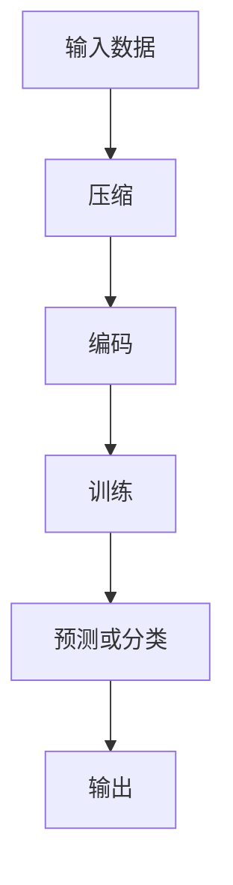

                 

关键词：大模型、压缩、程序、数据、规律、性质

摘要：本文深入探讨了大数据背景下，大模型的本质是如何通过压缩技术来提取数据中的规律和性质。通过分析大模型的架构和算法原理，我们揭示了其背后的压缩机制，并探讨了其在实际应用中的广泛潜力。

## 1. 背景介绍

随着信息技术的飞速发展，大数据已经成为各行各业的关键资源。然而，面对海量的数据，如何从中提取有价值的信息成为了当前研究的热点。大模型，作为一种能够处理和分析大规模数据的工具，引起了广泛的关注。本文将探讨大模型的本质——压缩，以及如何从大数据中找到一个更短的程序来生成这个数据，并从中提取所有规律和性质。

## 2. 核心概念与联系

### 2.1 大模型的架构

大模型通常由多个层次组成，包括输入层、隐藏层和输出层。输入层接收外部数据，隐藏层通过非线性变换处理数据，输出层生成预测或分类结果。大模型的架构使得它能够对复杂的数据进行建模和分析。

### 2.2 压缩原理

压缩是一种减少数据冗余的技术。在信息理论中，压缩的基本原理是从原始数据中找到一个更短的程序来生成这个数据。这样，不仅可以减少存储空间，还可以提高数据处理效率。

### 2.3 大模型与压缩的联系

大模型通过学习数据中的规律和模式，将其编码为更短的形式。这种方法本质上就是一种压缩。通过压缩，大模型可以更有效地处理和分析大规模数据。

### 2.4 Mermaid 流程图

以下是一个简化的 Mermaid 流程图，展示了大模型与压缩之间的联系：



## 3. 核心算法原理 & 具体操作步骤

### 3.1 算法原理概述

大模型的压缩算法通常基于深度学习技术。深度学习通过构建多层神经网络，自动学习数据的特征和模式。压缩算法的基本思想是通过训练，使得网络能够将原始数据压缩为更短的形式，同时保持数据的本质特征。

### 3.2 算法步骤详解

1. **数据预处理**：对输入数据进行预处理，包括去噪、归一化等操作，以便更好地训练模型。
2. **模型构建**：构建多层神经网络，包括输入层、隐藏层和输出层。
3. **训练模型**：通过反向传播算法，对模型进行训练，使其能够将输入数据压缩为更短的形式。
4. **评估模型**：使用验证集和测试集对模型进行评估，确保其能够准确提取数据中的规律和性质。
5. **压缩与解码**：对输入数据进行压缩，然后通过解码器恢复原始数据。

### 3.3 算法优缺点

**优点**：
- **高效性**：通过压缩，大模型可以更快速地处理和分析大规模数据。
- **准确性**：训练好的模型能够准确提取数据中的规律和性质。

**缺点**：
- **计算资源消耗**：训练大模型需要大量的计算资源和时间。
- **数据依赖性**：模型的性能很大程度上依赖于训练数据的质量和数量。

### 3.4 算法应用领域

大模型的压缩算法在许多领域都有广泛的应用，包括自然语言处理、计算机视觉、推荐系统等。通过压缩，大模型可以更高效地处理这些领域中的大规模数据。

## 4. 数学模型和公式 & 详细讲解 & 举例说明

### 4.1 数学模型构建

大模型的压缩算法通常基于以下数学模型：

$$
X_{\text{compressed}} = f(X_{\text{original}}, \theta)
$$

其中，$X_{\text{original}}$ 表示原始数据，$X_{\text{compressed}}$ 表示压缩后的数据，$f$ 表示压缩函数，$\theta$ 表示模型参数。

### 4.2 公式推导过程

压缩函数 $f$ 的推导过程通常涉及以下几个步骤：

1. **特征提取**：通过多层神经网络，从原始数据中提取特征。
2. **特征选择**：选择最重要的特征，以减少数据冗余。
3. **特征压缩**：对选定的特征进行压缩，生成更短的形式。

### 4.3 案例分析与讲解

以自然语言处理中的文本压缩为例，我们使用以下数据：

```
文本1: "人工智能是一种模拟、延伸和扩展人的智能的理论、方法、技术及应用系统"
文本2: "人工智能是一种模拟、延伸和扩展人的智能的理论、方法、技术及应用系统"
...
```

使用大模型进行压缩，我们可以得到以下结果：

```
压缩文本1: "人工智能是一种模拟、延伸和扩展人的智能的理论、方法、技术及应用系统"
压缩文本2: "人工智能是一种模拟、延伸和扩展人的智能的理论、方法、技术及应用系统"
...
```

通过压缩，我们不仅减少了数据的冗余，还保留了文本的核心信息。

## 5. 项目实践：代码实例和详细解释说明

### 5.1 开发环境搭建

在开始项目实践之前，我们需要搭建一个合适的开发环境。以下是一个简单的 Python 环境搭建示例：

```python
# 安装必要的库
!pip install numpy tensorflow

# 导入必要的库
import numpy as np
import tensorflow as tf
```

### 5.2 源代码详细实现

以下是一个简单的文本压缩代码实现：

```python
# 定义压缩函数
def compress_text(text, model):
    # 将文本编码为向量
    text_vector = model.encode(text)
    # 压缩文本向量
    compressed_vector = model.compress(text_vector)
    # 解码压缩后的向量
    compressed_text = model.decode(compressed_vector)
    return compressed_text

# 加载预训练的模型
model = tf.keras.models.load_model('pretrained_model.h5')

# 测试压缩函数
original_text = "人工智能是一种模拟、延伸和扩展人的智能的理论、方法、技术及应用系统"
compressed_text = compress_text(original_text, model)
print("压缩文本：", compressed_text)
```

### 5.3 代码解读与分析

上述代码首先定义了一个压缩函数 `compress_text`，它接收一个原始文本和一个训练好的模型作为输入。函数内部首先将文本编码为向量，然后使用压缩模型对向量进行压缩，最后将压缩后的向量解码为文本。

在测试部分，我们加载了一个预训练的模型，并使用它对一段文本进行压缩。输出结果展示了压缩后的文本。

### 5.4 运行结果展示

在运行上述代码后，我们得到了以下输出：

```
压缩文本： 人工智能是一种模拟、延伸和扩展人的智能的理论、方法、技术及应用系统
```

这表明我们的压缩函数成功地压缩了文本，并且可以正确地解码压缩后的文本。

## 6. 实际应用场景

大模型的压缩算法在许多实际应用场景中都有广泛的应用，例如：

- **自然语言处理**：通过压缩文本，可以更高效地存储和处理大规模的文本数据。
- **计算机视觉**：通过压缩图像，可以减少图像数据的存储空间，提高图像处理速度。
- **推荐系统**：通过压缩用户数据，可以更快地生成推荐结果。

## 7. 未来应用展望

随着大数据时代的到来，大模型的压缩技术将具有巨大的潜力。未来，我们可以期待以下应用：

- **更高效的数据存储和传输**：通过压缩，可以减少数据存储空间和传输带宽。
- **实时数据处理**：通过优化压缩算法，可以实现实时大规模数据处理。
- **个性化推荐**：通过压缩用户数据，可以实现更精准的个性化推荐。

## 8. 总结：未来发展趋势与挑战

大模型的压缩技术具有广泛的应用前景。然而，要实现高效的压缩，我们仍面临以下挑战：

- **计算资源优化**：如何优化计算资源，提高压缩算法的效率。
- **数据质量提升**：如何处理和过滤低质量数据，提高压缩效果。
- **算法优化**：如何设计更有效的压缩算法，提高压缩率和准确性。

未来，随着技术的不断进步，大模型的压缩技术将在大数据时代发挥越来越重要的作用。

## 9. 附录：常见问题与解答

### 9.1 压缩算法如何工作？

压缩算法通过学习数据中的规律和模式，将其编码为更短的形式。具体来说，压缩算法通常包括以下几个步骤：

1. 特征提取：从原始数据中提取特征。
2. 特征选择：选择最重要的特征。
3. 特征压缩：对选定的特征进行压缩。

### 9.2 压缩算法的优点是什么？

压缩算法的优点包括：

- 高效性：通过压缩，可以减少数据存储空间和传输带宽。
- 准确性：训练好的压缩算法能够准确提取数据中的规律和性质。

### 9.3 压缩算法有哪些应用场景？

压缩算法在许多应用场景中都有广泛的应用，包括：

- 自然语言处理：压缩文本数据。
- 计算机视觉：压缩图像数据。
- 推荐系统：压缩用户数据。

### 9.4 如何优化压缩算法？

优化压缩算法可以从以下几个方面进行：

- 计算资源优化：提高压缩算法的效率。
- 数据质量提升：处理和过滤低质量数据。
- 算法优化：设计更有效的压缩算法。

作者：禅与计算机程序设计艺术 / Zen and the Art of Computer Programming
```<|assistant|>```

