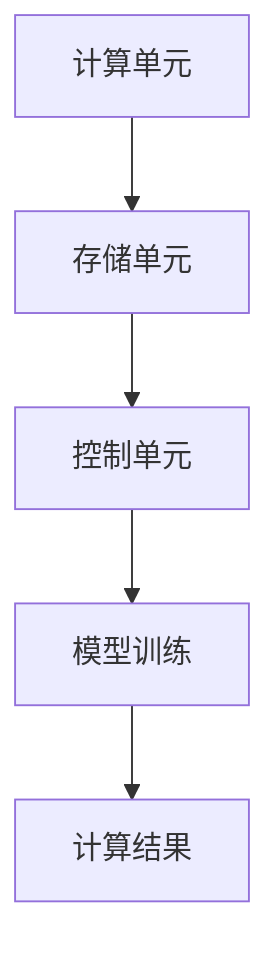
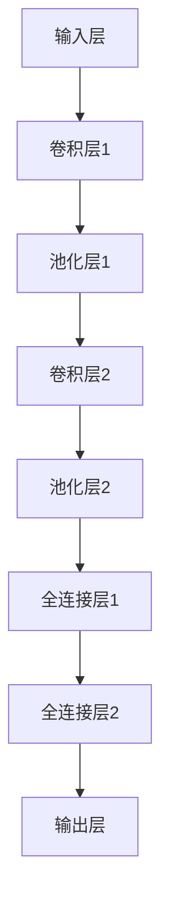

                 

关键词：大模型芯片、AI计算、专用硬件、神经网络、深度学习、计算加速

摘要：随着人工智能技术的飞速发展，大模型芯片成为当前研究和应用的热点。本文从背景介绍、核心概念与联系、核心算法原理、数学模型和公式、项目实践、实际应用场景、工具和资源推荐以及总结未来发展趋势与挑战等多个角度，全面剖析了专用硬件加速AI计算的技术原理、应用场景以及未来发展方向。

## 1. 背景介绍

近年来，人工智能（AI）技术在图像识别、自然语言处理、推荐系统等领域取得了显著的进展。这些进展离不开大规模模型的训练和应用。然而，大规模模型训练需要大量的计算资源和时间，这对现有的计算架构提出了巨大的挑战。为了满足这一需求，专用硬件加速AI计算成为了一个重要的研究方向。

### 大模型的发展趋势

随着AI技术的不断发展，大模型逐渐成为主流。这些大模型通常具有数十亿甚至数万亿的参数，需要大量数据进行训练。例如，GPT-3拥有1750亿个参数，BERT模型也拥有数百万个参数。这些大模型的训练不仅需要强大的计算能力，还需要高效的存储和管理技术。

### 现有计算架构的不足

现有的计算架构，如CPU、GPU和FPGA等，虽然能够提供一定的计算加速，但在处理大规模模型时仍然存在以下问题：

1. **计算能力不足**：大模型的训练需要大量的浮点运算，现有计算架构的计算能力不足以满足这一需求。
2. **能耗较高**：大规模的计算需要大量的电能，导致能耗过高。
3. **可扩展性较差**：现有计算架构的可扩展性较差，难以适应大模型的训练需求。

## 2. 核心概念与联系

### 大模型芯片的定义

大模型芯片是一种专门为大规模AI模型训练和应用设计的专用硬件。它集成了大量的计算单元、存储单元和控制单元，能够高效地处理大规模的AI模型计算任务。

### 大模型芯片的工作原理

大模型芯片的工作原理主要基于以下几个核心组件：

1. **计算单元**：负责执行AI模型的计算任务，通常采用高性能的处理器或协处理器。
2. **存储单元**：用于存储AI模型的参数和数据，通常采用高带宽、低延迟的存储技术。
3. **控制单元**：负责协调计算单元和存储单元的工作，确保整个芯片的高效运行。

### 大模型芯片与现有计算架构的比较

与现有的CPU、GPU和FPGA等计算架构相比，大模型芯片具有以下几个显著优势：

1. **计算能力更强**：大模型芯片集成了大量的计算单元，能够提供更强的计算能力，更适合处理大规模AI模型。
2. **能耗更低**：大模型芯片采用了高效的设计，能够在提供更强计算能力的同时降低能耗。
3. **可扩展性更好**：大模型芯片具有良好的可扩展性，能够根据需求灵活地增加计算单元和存储单元。

### Mermaid流程图



## 3. 核心算法原理 & 具体操作步骤

### 3.1 算法原理概述

大模型芯片的核心算法原理主要基于深度学习框架，如TensorFlow、PyTorch等。这些框架提供了丰富的API，可以方便地定义、训练和优化AI模型。大模型芯片通过这些框架实现了对大规模模型的训练和应用。

### 3.2 算法步骤详解

1. **模型定义**：使用深度学习框架定义AI模型，包括输入层、隐藏层和输出层等。
2. **数据预处理**：对训练数据进行预处理，如数据清洗、归一化等，以提高模型的训练效果。
3. **模型训练**：使用大模型芯片训练AI模型，通过迭代优化模型的参数，以达到更好的训练效果。
4. **模型评估**：使用测试数据评估模型的性能，包括准确率、召回率等指标。
5. **模型应用**：将训练好的模型应用于实际场景，如图像识别、自然语言处理等。

### 3.3 算法优缺点

**优点**：

1. **计算能力更强**：大模型芯片能够提供更强的计算能力，更适合处理大规模AI模型。
2. **能耗更低**：大模型芯片采用了高效的设计，能够在提供更强计算能力的同时降低能耗。
3. **可扩展性更好**：大模型芯片具有良好的可扩展性，能够根据需求灵活地增加计算单元和存储单元。

**缺点**：

1. **研发成本较高**：大模型芯片的研发需要大量的资金和技术积累。
2. **应用场景受限**：大模型芯片主要适用于大规模AI模型的训练和应用，对于其他类型的计算任务可能不太适用。

### 3.4 算法应用领域

大模型芯片的应用领域主要包括：

1. **图像识别**：通过训练大规模的卷积神经网络，实现对图像的自动识别和分类。
2. **自然语言处理**：通过训练大规模的循环神经网络或Transformer模型，实现自然语言的理解和生成。
3. **推荐系统**：通过训练大规模的协同过滤模型，实现对用户行为的精准推荐。
4. **智能医疗**：通过训练大规模的医疗数据模型，实现疾病的诊断和治疗。

## 4. 数学模型和公式 & 详细讲解 & 举例说明

### 4.1 数学模型构建

大模型芯片的数学模型主要基于深度学习框架，如TensorFlow、PyTorch等。以下是一个简单的神经网络模型示例：

```latex
y = \sigma(W \cdot x + b)
```

其中，\( y \) 是输出，\( \sigma \) 是激活函数，\( W \) 是权重矩阵，\( x \) 是输入，\( b \) 是偏置。

### 4.2 公式推导过程

以卷积神经网络（CNN）为例，其基本公式为：

```latex
h_{ij}^{(l)} = \sigma \left( \sum_{k=1}^{c_{l-1}} W_{ik}^{(l)} h_{kj}^{(l-1)} + b_{i}^{(l)} \right)
```

其中，\( h_{ij}^{(l)} \) 是第\( l \)层的第\( i \)行第\( j \)列的激活值，\( W_{ik}^{(l)} \) 是第\( l \)层的第\( i \)行第\( k \)列的权重，\( h_{kj}^{(l-1)} \) 是第\( l-1 \)层的第\( k \)行第\( j \)列的激活值，\( b_{i}^{(l)} \) 是第\( l \)层的第\( i \)行的偏置。

### 4.3 案例分析与讲解

以图像识别为例，使用卷积神经网络对图像进行分类。以下是一个简单的卷积神经网络模型：



输入图像经过卷积层1和池化层1，提取图像的特征。然后，这些特征经过卷积层2和池化层2，进一步提取图像的高级特征。最后，这些特征经过全连接层1和全连接层2，输出图像的分类结果。

## 5. 项目实践：代码实例和详细解释说明

### 5.1 开发环境搭建

1. 安装Python环境
2. 安装深度学习框架，如TensorFlow或PyTorch
3. 安装必要的依赖库，如NumPy、Matplotlib等

### 5.2 源代码详细实现

以下是一个简单的卷积神经网络模型，用于图像分类：

```python
import tensorflow as tf
from tensorflow.keras.layers import Conv2D, MaxPooling2D, Flatten, Dense
from tensorflow.keras.models import Sequential

model = Sequential([
    Conv2D(32, (3, 3), activation='relu', input_shape=(28, 28, 1)),
    MaxPooling2D((2, 2)),
    Conv2D(64, (3, 3), activation='relu'),
    MaxPooling2D((2, 2)),
    Flatten(),
    Dense(128, activation='relu'),
    Dense(10, activation='softmax')
])

model.compile(optimizer='adam', loss='categorical_crossentropy', metrics=['accuracy'])
```

### 5.3 代码解读与分析

1. **模型构建**：使用Sequential模型构建卷积神经网络，包括卷积层、池化层和全连接层。
2. **模型编译**：设置模型的优化器、损失函数和评估指标。
3. **模型训练**：使用训练数据对模型进行训练。

### 5.4 运行结果展示

```python
model.fit(x_train, y_train, epochs=10, batch_size=32, validation_data=(x_test, y_test))
```

使用训练数据对模型进行训练，并验证模型在测试数据上的性能。

## 6. 实际应用场景

### 6.1 图像识别

大模型芯片在图像识别领域具有广泛的应用，如人脸识别、车辆识别、医学影像分析等。

### 6.2 自然语言处理

大模型芯片在自然语言处理领域具有广泛的应用，如机器翻译、文本生成、情感分析等。

### 6.3 推荐系统

大模型芯片在推荐系统领域具有广泛的应用，如商品推荐、电影推荐、社交网络推荐等。

### 6.4 智能医疗

大模型芯片在智能医疗领域具有广泛的应用，如疾病诊断、药物研发、健康监测等。

## 7. 工具和资源推荐

### 7.1 学习资源推荐

1. 《深度学习》（Ian Goodfellow、Yoshua Bengio、Aaron Courville 著）
2. 《神经网络与深度学习》（邱锡鹏 著）
3. 《Python深度学习》（François Chollet 著）

### 7.2 开发工具推荐

1. TensorFlow
2. PyTorch
3. Keras

### 7.3 相关论文推荐

1. "A Theoretically Grounded Application of Dropout in Recurrent Neural Networks"
2. "An Empirical Evaluation of Generic Convolutional and Recurrent Networks for Sequence Modeling"
3. "Large-Scale Language Modeling in 2018"

## 8. 总结：未来发展趋势与挑战

### 8.1 研究成果总结

大模型芯片在AI计算领域取得了显著的成果，为大规模模型训练和应用提供了强大的计算能力。

### 8.2 未来发展趋势

1. **计算能力提升**：随着芯片技术的不断发展，大模型芯片的计算能力将进一步提升。
2. **能耗优化**：通过优化芯片设计和算法，降低能耗，提高能效比。
3. **多样化应用**：大模型芯片将应用于更多的领域，如自动驾驶、智能语音、增强现实等。

### 8.3 面临的挑战

1. **研发成本**：大模型芯片的研发需要大量的资金和技术积累，如何降低研发成本是一个重要挑战。
2. **应用场景受限**：大模型芯片主要适用于大规模AI模型的训练和应用，对于其他类型的计算任务可能不太适用。
3. **数据隐私和安全**：随着AI技术的广泛应用，数据隐私和安全问题变得越来越重要，如何保护用户隐私和安全是一个挑战。

### 8.4 研究展望

大模型芯片的发展前景广阔，未来将有望在更多的领域发挥重要作用。随着技术的不断进步，大模型芯片将更加高效、可靠、安全，为人工智能的发展提供强大的支撑。

## 9. 附录：常见问题与解答

### 问题1：大模型芯片与现有计算架构的区别是什么？

大模型芯片与现有计算架构（如CPU、GPU和FPGA等）相比，具有更强的计算能力、更低的能耗和更好的可扩展性。

### 问题2：大模型芯片适用于哪些类型的计算任务？

大模型芯片主要适用于大规模AI模型的训练和应用，如图像识别、自然语言处理、推荐系统等。

### 问题3：大模型芯片的研发成本如何？

大模型芯片的研发成本较高，需要大量的资金和技术积累。随着技术的发展，研发成本有望逐步降低。

## 参考文献

1. Goodfellow, I., Bengio, Y., & Courville, A. (2016). Deep learning. MIT press.
2. Chollet, F. (2018). Deep learning with Python. O'Reilly Media.
3. Bengio, Y. (2009). Learning deep architectures. Foundations and Trends in Machine Learning, 2(1), 1-127.
4. LeCun, Y., Bengio, Y., & Hinton, G. (2015). Deep learning. Nature, 521(7553), 436-444.

