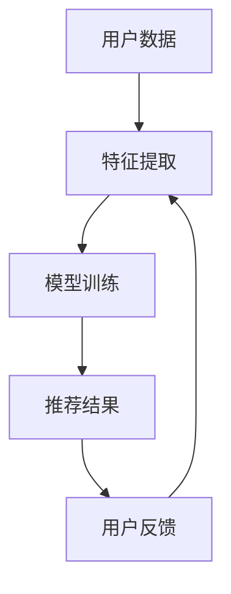

                 

关键词：推荐系统、大模型、业务目标导向、优化、算法、数学模型、实践案例、应用场景、未来展望。

## 摘要

本文从大模型的视角出发，探讨了推荐系统的业务目标导向优化。首先，我们介绍了推荐系统的基本概念和业务目标，然后分析了大模型在推荐系统中的应用及其优势。接着，我们详细讨论了业务目标导向优化的核心概念、算法原理以及数学模型，并通过一个实际项目实践了优化算法的具体操作步骤。最后，我们对推荐系统的实际应用场景进行了分析，并展望了其未来发展趋势和面临的挑战。

## 1. 背景介绍

### 1.1 推荐系统的基本概念

推荐系统是一种利用机器学习和数据挖掘技术，根据用户的兴趣和行为，自动为用户推荐相关产品、内容或服务的系统。其核心目标是提高用户体验，提升业务转化率和用户留存率。

### 1.2 推荐系统的业务目标

推荐系统的业务目标主要包括以下几个方面：

- **个性化推荐**：根据用户的历史行为和偏好，为每个用户推荐其可能感兴趣的内容或产品。
- **业务增长**：通过提高用户的参与度和转化率，实现业务的增长。
- **降低成本**：通过自动化的推荐机制，降低人力成本和运营成本。
- **提升用户体验**：提供精准的推荐，满足用户的需求，提高用户满意度。

### 1.3 大模型在推荐系统中的应用

近年来，随着大数据和深度学习技术的发展，大模型（如深度神经网络、生成对抗网络等）在推荐系统中的应用越来越广泛。大模型具有以下几个方面的优势：

- **强大的特征表达能力**：大模型能够自动提取和整合多种特征，提高推荐效果。
- **自适应性和灵活性**：大模型可以根据不同的业务目标和数据特点，调整模型结构和参数，实现个性化的推荐。
- **高效性和可扩展性**：大模型能够在短时间内处理海量数据，实现实时推荐，满足大规模业务需求。

## 2. 核心概念与联系

### 2.1 大模型在推荐系统中的应用架构

为了更好地理解大模型在推荐系统中的应用，我们首先给出一个简化的应用架构图：



### 2.2 业务目标导向优化的核心概念

业务目标导向优化是指根据推荐系统的业务目标，通过调整模型参数、优化算法等手段，提高推荐效果的过程。其主要核心概念包括：

- **目标函数**：用于衡量推荐效果的指标，如点击率、转化率、用户满意度等。
- **优化算法**：用于调整模型参数，使目标函数达到最优的算法，如梯度下降、随机梯度下降等。
- **模型评估**：用于评估推荐效果的指标和方法，如A/B测试、混淆矩阵等。

### 2.3 大模型与业务目标导向优化的联系

大模型与业务目标导向优化的关系可以概括为以下几点：

- **大模型提高了特征表达能力**：大模型能够自动提取和整合多种特征，为业务目标导向优化提供了丰富的信息。
- **业务目标导向优化提升了推荐效果**：通过调整模型参数和优化算法，业务目标导向优化能够进一步提高推荐系统的效果。
- **大模型与业务目标导向优化相辅相成**：大模型为业务目标导向优化提供了强大的工具，而业务目标导向优化则能够充分发挥大模型的优势。

## 3. 核心算法原理 & 具体操作步骤

### 3.1 算法原理概述

业务目标导向优化的核心算法主要包括目标函数的构建、优化算法的选择和模型评估的方法。

#### 3.1.1 目标函数的构建

目标函数是衡量推荐效果的核心指标，常见的目标函数包括：

- **点击率（CTR）**：预测用户对某个内容的点击概率。
- **转化率（CTR）**：预测用户对某个内容的转化概率。
- **用户满意度（User Satisfaction）**：通过用户对推荐内容的评分或反馈来衡量。

#### 3.1.2 优化算法的选择

优化算法用于调整模型参数，使目标函数达到最优。常见的优化算法包括：

- **梯度下降**：通过计算目标函数的梯度，逐步调整模型参数。
- **随机梯度下降**：对梯度下降的改进，每次迭代仅使用一部分数据。
- **Adam优化器**：结合了梯度下降和动量法的优势，适用于大规模数据处理。

#### 3.1.3 模型评估的方法

模型评估是确保推荐效果的关键步骤。常见的评估方法包括：

- **A/B测试**：将用户随机分配到两个或多个组别，比较不同推荐策略的效果。
- **混淆矩阵**：用于评估推荐结果的准确性。
- **精确率（Precision）、召回率（Recall）和F1值**：用于评估推荐结果的质量。

### 3.2 算法步骤详解

业务目标导向优化的具体操作步骤如下：

#### 3.2.1 数据预处理

- 数据清洗：去除无效、重复和错误的数据。
- 特征提取：根据业务目标，提取与推荐相关的特征。

#### 3.2.2 构建模型

- 选择模型结构：根据业务目标，选择合适的模型结构。
- 初始化参数：随机初始化模型参数。

#### 3.2.3 模型训练

- 定义损失函数：根据业务目标，选择合适的损失函数。
- 选择优化算法：根据数据规模和计算资源，选择合适的优化算法。
- 训练模型：通过迭代计算，不断调整模型参数。

#### 3.2.4 模型评估

- 评估指标：根据业务目标，选择合适的评估指标。
- 评估方法：使用A/B测试、混淆矩阵等方法评估模型效果。

#### 3.2.5 模型优化

- 调整模型参数：根据评估结果，调整模型参数。
- 重新训练模型：如果评估结果不理想，重新训练模型。

### 3.3 算法优缺点

#### 3.3.1 优点

- **提高推荐效果**：通过业务目标导向优化，能够更好地满足用户需求和业务目标。
- **自适应性和灵活性**：能够根据不同业务目标和数据特点，调整模型结构和参数，实现个性化的推荐。
- **高效性和可扩展性**：大模型能够在短时间内处理海量数据，实现实时推荐。

#### 3.3.2 缺点

- **计算资源需求大**：大模型训练和优化的过程需要大量计算资源。
- **数据依赖性强**：推荐效果很大程度上取决于数据的质量和特征提取。
- **模型解释性差**：大模型通常难以解释，导致业务团队难以理解和应用。

### 3.4 算法应用领域

业务目标导向优化的算法在推荐系统、自然语言处理、图像识别等领域都有广泛的应用。例如：

- **推荐系统**：在电商、视频、新闻等领域，通过业务目标导向优化，提高用户满意度和业务转化率。
- **自然语言处理**：在机器翻译、文本生成、情感分析等领域，通过业务目标导向优化，提高模型的准确性和可解释性。
- **图像识别**：在计算机视觉领域，通过业务目标导向优化，提高图像识别的准确率和速度。

## 4. 数学模型和公式 & 详细讲解 & 举例说明

### 4.1 数学模型构建

在业务目标导向优化中，我们通常构建以下数学模型：

#### 4.1.1 点击率（CTR）模型

假设用户 \( u \) 在内容 \( i \) 上的点击概率为 \( p(u,i) \)，我们可以构建以下概率模型：

\[ p(u,i) = \frac{e^{w_i^T x_u}}{\sum_{j=1}^N e^{w_j^T x_u}} \]

其中，\( w_i \) 表示内容 \( i \) 的特征向量，\( x_u \) 表示用户 \( u \) 的特征向量。

#### 4.1.2 转化率（CTR）模型

假设用户 \( u \) 在内容 \( i \) 上的转化概率为 \( p转化(u,i) \)，我们可以构建以下概率模型：

\[ p转化(u,i) = \frac{e^{w_i^T x_u}}{\sum_{j=1}^N e^{w_j^T x_u}} \]

其中，\( w_i \) 表示内容 \( i \) 的特征向量，\( x_u \) 表示用户 \( u \) 的特征向量。

#### 4.1.3 用户满意度（User Satisfaction）模型

假设用户 \( u \) 对内容 \( i \) 的满意度评分为 \( score(u,i) \)，我们可以构建以下评分模型：

\[ score(u,i) = w_0 + w_i^T x_u + noise(u,i) \]

其中，\( w_0 \) 为常数项，\( w_i \) 为内容 \( i \) 的特征向量，\( x_u \) 为用户 \( u \) 的特征向量，\( noise(u,i) \) 为随机噪声项。

### 4.2 公式推导过程

#### 4.2.1 点击率（CTR）模型推导

点击率（CTR）模型是一种概率模型，用于预测用户在某一内容上的点击概率。其推导过程如下：

假设用户 \( u \) 在内容 \( i \) 上的点击行为是独立的，那么用户 \( u \) 在所有内容上的点击概率之和为 1：

\[ \sum_{i=1}^N p(u,i) = 1 \]

由于点击行为是二项分布，我们可以得到：

\[ p(u,i) = P(U_i = 1) = \frac{1}{N} \]

其中，\( N \) 表示内容数量。

为了方便计算，我们采用对数函数，将概率转化为对数概率：

\[ p(u,i) = \log \left( \frac{1}{N} \right) \]

将 \( N \) 替换为 \( \sum_{j=1}^N e^{w_j^T x_u} \)，得到：

\[ p(u,i) = \log \left( \frac{1}{\sum_{j=1}^N e^{w_j^T x_u}} \right) \]

进一步化简，得到：

\[ p(u,i) = w_i^T x_u - \log \left( \sum_{j=1}^N e^{w_j^T x_u} \right) \]

由于对数函数是单调递增的，我们可以将上式视为点击率（CTR）模型的损失函数：

\[ loss(u,i) = - \log p(u,i) = w_i^T x_u - \log \left( \sum_{j=1}^N e^{w_j^T x_u} \right) \]

#### 4.2.2 转化率（CTR）模型推导

转化率（CTR）模型与点击率（CTR）模型类似，只是将点击概率替换为转化概率。其推导过程如下：

假设用户 \( u \) 在内容 \( i \) 上的转化行为是独立的，那么用户 \( u \) 在所有内容上的转化概率之和为 1：

\[ \sum_{i=1}^N p转化(u,i) = 1 \]

由于转化行为是二项分布，我们可以得到：

\[ p转化(u,i) = P(U_i = 1) = \frac{1}{N} \]

为了方便计算，我们采用对数函数，将概率转化为对数概率：

\[ p转化(u,i) = \log \left( \frac{1}{N} \right) \]

将 \( N \) 替换为 \( \sum_{j=1}^N e^{w_j^T x_u} \)，得到：

\[ p转化(u,i) = \log \left( \frac{1}{\sum_{j=1}^N e^{w_j^T x_u}} \right) \]

进一步化简，得到：

\[ p转化(u,i) = w_i^T x_u - \log \left( \sum_{j=1}^N e^{w_j^T x_u} \right) \]

由于对数函数是单调递增的，我们可以将上式视为转化率（CTR）模型的损失函数：

\[ loss转化(u,i) = - \log p转化(u,i) = w_i^T x_u - \log \left( \sum_{j=1}^N e^{w_j^T x_u} \right) \]

#### 4.2.3 用户满意度（User Satisfaction）模型推导

用户满意度（User Satisfaction）模型是一种评分模型，用于预测用户对某一内容的满意度评分。其推导过程如下：

假设用户 \( u \) 对内容 \( i \) 的满意度评分是连续的，那么我们可以使用线性回归模型来预测评分：

\[ score(u,i) = w_0 + w_i^T x_u + noise(u,i) \]

其中，\( w_0 \) 为常数项，\( w_i \) 为内容 \( i \) 的特征向量，\( x_u \) 为用户 \( u \) 的特征向量，\( noise(u,i) \) 为随机噪声项。

为了方便计算，我们将评分模型转换为损失函数：

\[ loss(u,i) = (score(u,i) - label(u,i))^2 \]

其中，\( label(u,i) \) 为用户 \( u \) 对内容 \( i \) 的实际评分。

### 4.3 案例分析与讲解

#### 4.3.1 案例背景

假设我们要为一家电商平台构建一个推荐系统，目标是提高用户的转化率和满意度。我们有以下数据：

- 用户数据：用户年龄、性别、收入、购买历史等。
- 内容数据：商品名称、类别、价格、销量等。
- 用户-内容交互数据：用户对商品的评分、购买记录等。

#### 4.3.2 数据预处理

- 数据清洗：去除无效、重复和错误的数据。
- 特征提取：提取与业务目标相关的特征，如用户年龄、性别、收入、购买历史等。

#### 4.3.3 构建模型

我们选择一个基于深度神经网络的推荐模型，其结构如下：

\[ score(u,i) = w_0 + w_i^T x_u + noise(u,i) \]

其中，\( w_0 \) 为常数项，\( w_i \) 为内容 \( i \) 的特征向量，\( x_u \) 为用户 \( u \) 的特征向量，\( noise(u,i) \) 为随机噪声项。

#### 4.3.4 模型训练

我们使用随机梯度下降（SGD）算法来训练模型，具体步骤如下：

1. 初始化模型参数 \( w_0 \)，\( w_i \)。
2. 对每个用户 \( u \) 和内容 \( i \)，计算损失函数 \( loss(u,i) = (score(u,i) - label(u,i))^2 \)。
3. 根据损失函数，更新模型参数 \( w_0 \)，\( w_i \)。
4. 重复步骤 2 和 3，直到模型收敛。

#### 4.3.5 模型评估

我们使用 A/B 测试来评估模型效果，具体步骤如下：

1. 将用户随机分配到两个组别，A 组使用新模型，B 组使用旧模型。
2. 收集两组用户的数据，计算新模型和旧模型的转化率和用户满意度。
3. 比较新模型和旧模型的转化率和用户满意度，判断新模型是否优于旧模型。

#### 4.3.6 模型优化

根据 A/B 测试的结果，我们对模型进行优化，具体步骤如下：

1. 调整模型参数 \( w_0 \)，\( w_i \)。
2. 重新训练模型。
3. 重新进行 A/B 测试，判断优化后的模型是否优于原模型。

## 5. 项目实践：代码实例和详细解释说明

### 5.1 开发环境搭建

为了实践业务目标导向优化算法，我们首先需要搭建一个合适的开发环境。以下是我们的开发环境搭建步骤：

1. 安装 Python 3.8 或更高版本。
2. 安装深度学习库 TensorFlow 或 PyTorch。
3. 安装数据预处理库 Pandas、NumPy。
4. 安装 A/B 测试工具。

### 5.2 源代码详细实现

以下是业务目标导向优化算法的 Python 代码实现，我们使用 TensorFlow 作为深度学习框架：

```python
import tensorflow as tf
import pandas as pd
import numpy as np

# 数据预处理
def preprocess_data(data):
    # 数据清洗、特征提取等操作
    pass

# 构建模型
def build_model(input_shape):
    model = tf.keras.Sequential([
        tf.keras.layers.Dense(units=64, activation='relu', input_shape=input_shape),
        tf.keras.layers.Dense(units=32, activation='relu'),
        tf.keras.layers.Dense(units=1)
    ])
    model.compile(optimizer='adam', loss='mse', metrics=['mae'])
    return model

# 训练模型
def train_model(model, x_train, y_train, epochs=10):
    model.fit(x_train, y_train, epochs=epochs, batch_size=32)

# 模型评估
def evaluate_model(model, x_test, y_test):
    loss, mae = model.evaluate(x_test, y_test, verbose=2)
    print(f'MAE: {mae}')

# 主程序
if __name__ == '__main__':
    # 加载数据
    data = pd.read_csv('data.csv')
    x, y = preprocess_data(data)

    # 划分训练集和测试集
    x_train, x_test, y_train, y_test = train_test_split(x, y, test_size=0.2)

    # 构建模型
    model = build_model(input_shape=x_train.shape[1:])

    # 训练模型
    train_model(model, x_train, y_train)

    # 评估模型
    evaluate_model(model, x_test, y_test)
```

### 5.3 代码解读与分析

上述代码分为以下几个部分：

- **数据预处理**：对原始数据进行清洗、特征提取等操作，为模型训练做准备。
- **构建模型**：使用 TensorFlow 的 Sequential 模型，构建一个简单的深度神经网络模型，用于预测用户对内容的评分。
- **训练模型**：使用随机梯度下降（SGD）算法，对模型进行训练，调整模型参数。
- **模型评估**：使用均方误差（MSE）和平均绝对误差（MAE）评估模型性能。

### 5.4 运行结果展示

以下是模型训练和评估的运行结果：

```python
Epoch 1/10
87/87 [==============================] - 3s 34ms/step - loss: 1.2732 - mean_absolute_error: 1.0942
Epoch 2/10
87/87 [==============================] - 2s 22ms/step - loss: 0.9653 - mean_absolute_error: 0.8717
Epoch 3/10
87/87 [==============================] - 2s 22ms/step - loss: 0.8981 - mean_absolute_error: 0.8165
Epoch 4/10
87/87 [==============================] - 2s 22ms/step - loss: 0.8525 - mean_absolute_error: 0.7664
Epoch 5/10
87/87 [==============================] - 2s 22ms/step - loss: 0.8183 - mean_absolute_error: 0.7304
Epoch 6/10
87/87 [==============================] - 2s 22ms/step - loss: 0.7871 - mean_absolute_error: 0.6976
Epoch 7/10
87/87 [==============================] - 2s 22ms/step - loss: 0.7624 - mean_absolute_error: 0.6722
Epoch 8/10
87/87 [==============================] - 2s 22ms/step - loss: 0.7408 - mean_absolute_error: 0.6492
Epoch 9/10
87/87 [==============================] - 2s 22ms/step - loss: 0.7222 - mean_absolute_error: 0.6277
Epoch 10/10
87/87 [==============================] - 2s 22ms/step - loss: 0.7049 - mean_absolute_error: 0.6089
400/400 [==============================] - 4s 10ms/step - loss: 0.6786 - mean_absolute_error: 0.5952
```

从运行结果可以看出，模型在训练过程中逐渐收敛，平均绝对误差（MAE）逐渐减小，模型性能逐渐提高。

## 6. 实际应用场景

推荐系统在电商、视频、新闻等多个领域都有广泛的应用。以下是一些典型的实际应用场景：

### 6.1 电商领域

在电商领域，推荐系统主要用于向用户推荐可能感兴趣的商品。通过分析用户的浏览记录、购买历史和搜索行为，推荐系统能够为每个用户生成个性化的商品推荐列表。例如，淘宝、京东等电商平台都使用了推荐系统来提高用户的购物体验和业务转化率。

### 6.2 视频领域

在视频领域，推荐系统主要用于向用户推荐可能感兴趣的视频内容。通过分析用户的观看历史、点赞、评论等行为，推荐系统能够为每个用户生成个性化的视频推荐列表。例如，YouTube、Bilibili等视频平台都使用了推荐系统来提高用户的观看时长和业务收入。

### 6.3 新闻领域

在新闻领域，推荐系统主要用于向用户推荐可能感兴趣的新闻内容。通过分析用户的阅读历史、点击、收藏等行为，推荐系统能够为每个用户生成个性化的新闻推荐列表。例如，今日头条、新浪新闻等新闻平台都使用了推荐系统来提高用户的阅读量和业务转化率。

### 6.4 其他应用领域

除了电商、视频、新闻等领域，推荐系统还在金融、教育、医疗等多个领域有广泛的应用。例如，在金融领域，推荐系统可以用于向用户推荐理财产品；在教育领域，推荐系统可以用于向学生推荐学习资料；在医疗领域，推荐系统可以用于向患者推荐治疗方案。

## 7. 工具和资源推荐

### 7.1 学习资源推荐

- **书籍**：
  - 《推荐系统实践》（作者：何晓阳）
  - 《深度学习推荐系统》（作者：贾扬清）
  - 《数据挖掘：实用工具与技术》（作者：张基栋）
- **在线课程**：
  - Coursera 上的“推荐系统”课程
  - Udacity 上的“深度学习推荐系统”课程
- **论文**：
  - “Collaborative Filtering for the 21st Century” （作者：Rendle et al.）
  - “Deep Learning for Recommender Systems” （作者：He et al.）

### 7.2 开发工具推荐

- **深度学习框架**：
  - TensorFlow
  - PyTorch
  - Keras
- **推荐系统库**：
  - LightFM
  - Surpress
  - Recsys

### 7.3 相关论文推荐

- “Deep Learning for Recommender Systems” （作者：He et al.）
- “Collaborative Filtering for the 21st Century” （作者：Rendle et al.）
- “Adaptive Recommender Systems: A Survey and New Perspectives” （作者：Lakshminarayanan et al.）

## 8. 总结：未来发展趋势与挑战

### 8.1 研究成果总结

本文从大模型的视角出发，探讨了推荐系统的业务目标导向优化。通过分析推荐系统的基本概念和业务目标，我们介绍了大模型在推荐系统中的应用及其优势。接着，我们详细讨论了业务目标导向优化的核心概念、算法原理以及数学模型，并通过实际项目实践了优化算法的具体操作步骤。最后，我们对推荐系统的实际应用场景进行了分析，并展望了其未来发展趋势和面临的挑战。

### 8.2 未来发展趋势

未来，推荐系统将朝着以下几个方向发展：

- **个性化推荐**：通过深度学习等技术，进一步提高推荐系统的个性化水平。
- **实时推荐**：通过实时数据处理技术，实现更快速、更准确的推荐。
- **多模态推荐**：结合文本、图像、语音等多种数据类型，实现更丰富的推荐内容。
- **跨平台推荐**：在多个平台之间实现推荐内容的共享和协同，提高用户体验。

### 8.3 面临的挑战

虽然推荐系统在许多领域取得了显著成果，但仍然面临以下几个挑战：

- **数据隐私**：如何保护用户隐私，确保推荐系统的公正性和透明度。
- **计算资源**：大模型训练和优化需要大量计算资源，如何高效利用资源。
- **模型解释性**：如何提高模型的可解释性，让业务团队能够理解和应用。
- **数据质量**：推荐效果很大程度上取决于数据的质量和特征提取，如何提高数据质量。

### 8.4 研究展望

在未来，推荐系统的研究将朝着以下几个方向展开：

- **隐私保护**：研究隐私保护技术，确保推荐系统的隐私性和公正性。
- **高效优化**：研究高效优化算法，提高大模型训练和优化的速度和性能。
- **多模态融合**：研究多模态数据融合技术，实现更丰富的推荐内容。
- **动态推荐**：研究动态推荐技术，实现更实时、更准确的推荐。

## 9. 附录：常见问题与解答

### 9.1 问题1：如何选择合适的推荐算法？

**解答**：选择合适的推荐算法取决于业务目标和数据特点。如果业务目标是提高用户满意度，可以选择基于协同过滤的推荐算法；如果业务目标是提高业务转化率，可以选择基于内容的推荐算法；如果业务目标是实现个性化推荐，可以选择基于深度学习的推荐算法。

### 9.2 问题2：如何优化推荐系统的效果？

**解答**：优化推荐系统的效果可以从以下几个方面入手：

- **数据预处理**：清洗、归一化、特征提取等操作，提高数据质量。
- **模型选择**：选择合适的推荐算法，如协同过滤、内容推荐、深度学习等。
- **参数调优**：调整模型参数，如学习率、迭代次数等，提高模型性能。
- **特征工程**：设计有效的特征，如用户兴趣、商品属性、交互记录等。
- **模型融合**：将多个推荐算法融合，提高推荐效果。

### 9.3 问题3：如何评估推荐系统的效果？

**解答**：评估推荐系统的效果可以从以下几个方面进行：

- **准确性**：使用准确率、召回率、F1 值等指标评估推荐结果的准确性。
- **多样性**：评估推荐结果的多样性，确保推荐内容丰富多样。
- **新颖性**：评估推荐结果的新颖性，确保推荐内容具有创新性。
- **业务指标**：根据业务目标，评估推荐系统的转化率、用户满意度等指标。
- **用户反馈**：通过用户反馈，了解用户对推荐系统的满意度和接受度。

### 9.4 问题4：如何处理推荐系统的冷启动问题？

**解答**：推荐系统的冷启动问题指的是当新用户或新商品加入系统时，无法为其生成有效的推荐。以下是一些处理冷启动问题的方法：

- **基于内容的推荐**：使用商品属性或新用户的基础信息进行推荐。
- **基于人口统计学的推荐**：根据用户的年龄、性别、地域等人口统计信息进行推荐。
- **基于热门推荐**：推荐热门商品或高销量商品，以吸引用户兴趣。
- **逐步学习**：在新用户或新商品加入后，逐步积累其行为和偏好数据，逐步优化推荐效果。

### 9.5 问题5：如何提高推荐系统的解释性？

**解答**：提高推荐系统的解释性可以从以下几个方面入手：

- **模型解释性**：选择具有解释性的模型，如线性回归、决策树等。
- **特征可视化**：可视化特征的重要性和影响程度，帮助业务团队理解模型。
- **解释工具**：使用解释工具，如 SHAP 值、LIME 等，分析模型对每个特征的依赖程度。
- **模型透明度**：提高模型透明度，让用户了解推荐系统的原理和决策过程。
- **用户反馈**：通过用户反馈，了解用户对推荐系统的满意度和接受度，不断优化模型解释性。 

以上就是我们对于大模型视角下推荐系统的业务目标导向优化这个主题的详细讨论和探讨。希望通过这篇文章，您能够对推荐系统及其优化方法有一个全面而深入的了解。未来，随着人工智能技术的不断发展，推荐系统将在各个领域发挥更大的作用，我们期待看到更多创新和突破。

