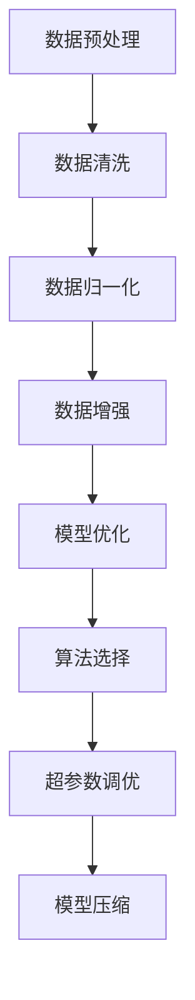

                 

关键词：大模型训练、关键步骤、算法原理、数学模型、实践应用

> 摘要：本文将探讨大模型训练过程中至关重要的两个关键步骤：数据预处理和模型优化。我们将深入分析这两个步骤的核心概念、原理、算法和数学模型，并通过具体案例和实践代码展示，帮助读者全面理解大模型训练的全过程。最后，我们将探讨大模型训练的未来发展趋势和面临的挑战，以及如何应对这些问题。

## 1. 背景介绍

在过去的几年里，人工智能（AI）领域的飞速发展离不开大模型（large-scale models）的应用。大模型通过处理海量数据和复杂的算法，实现了在自然语言处理、计算机视觉、推荐系统等领域的突破性进展。然而，大模型训练过程面临诸多挑战，如数据预处理、模型优化、资源分配等。本文将重点关注大模型训练的两个关键步骤：数据预处理和模型优化。

## 2. 核心概念与联系

### 2.1 数据预处理

数据预处理是模型训练的基石。其主要目标是确保输入数据的质量，以提高模型的训练效果。数据预处理包括数据清洗、数据归一化、数据增强等环节。

### 2.2 模型优化

模型优化是提高模型性能的关键。其主要目标是调整模型参数，使其在特定任务上表现更优秀。模型优化包括算法选择、超参数调优、模型压缩等策略。

下面是数据预处理和模型优化的 Mermaid 流程图：



## 3. 核心算法原理 & 具体操作步骤

### 3.1 算法原理概述

数据预处理和模型优化是两个相互关联的环节。数据预处理确保输入数据的质量，为模型优化提供基础。模型优化则通过调整模型参数，提高模型在特定任务上的性能。

### 3.2 算法步骤详解

#### 3.2.1 数据预处理

1. 数据清洗：去除噪声数据、缺失值填充、异常值处理等。
2. 数据归一化：将不同特征的数据范围统一，消除数据量级差异。
3. 数据增强：通过旋转、翻转、缩放等操作，增加数据多样性。

#### 3.2.2 模型优化

1. 算法选择：根据任务特点和需求，选择合适的算法。
2. 超参数调优：通过网格搜索、随机搜索等策略，找到最优超参数。
3. 模型压缩：通过剪枝、量化等手段，降低模型复杂度和计算资源消耗。

### 3.3 算法优缺点

#### 数据预处理

优点：

- 提高模型训练效果。
- 降低模型过拟合风险。

缺点：

- 需要大量计算资源。
- 可能引入新噪声。

#### 模型优化

优点：

- 提高模型性能。
- 适应不同任务需求。

缺点：

- 超参数调优过程复杂。
- 可能导致模型过拟合。

### 3.4 算法应用领域

数据预处理和模型优化广泛应用于自然语言处理、计算机视觉、推荐系统等领域。如BERT模型在自然语言处理领域取得了突破性成果，其训练过程依赖于高效的数据预处理和模型优化策略。

## 4. 数学模型和公式 & 详细讲解 & 举例说明

### 4.1 数学模型构建

数据预处理和模型优化涉及多个数学模型。以下分别介绍数据预处理和模型优化的核心数学模型。

#### 数据预处理

1. 数据清洗：$$ \text{数据清洗} = \text{去除噪声数据} + \text{缺失值填充} + \text{异常值处理} $$
2. 数据归一化：$$ \text{数据归一化} = \frac{X - \mu}{\sigma} $$
3. 数据增强：$$ \text{数据增强} = \text{旋转} + \text{翻转} + \text{缩放} $$

#### 模型优化

1. 算法选择：$$ \text{算法选择} = \text{基于任务特点的算法} $$
2. 超参数调优：$$ \text{超参数调优} = \text{网格搜索} + \text{随机搜索} $$
3. 模型压缩：$$ \text{模型压缩} = \text{剪枝} + \text{量化} $$

### 4.2 公式推导过程

#### 数据预处理

1. 数据清洗：假设输入数据集为 \(X\)，噪声数据为 \(X_{\text{noise}}\)，则去除噪声数据的过程可以表示为：
   $$ X_{\text{clean}} = X - X_{\text{noise}} $$
2. 数据归一化：假设输入数据集为 \(X\)，均值为 \(\mu\)，标准差为 \(\sigma\)，则归一化过程可以表示为：
   $$ X_{\text{norm}} = \frac{X - \mu}{\sigma} $$
3. 数据增强：假设输入数据集为 \(X\)，旋转角度为 \(\theta\)，则旋转过程可以表示为：
   $$ X_{\text{rotate}} = X \cdot \cos(\theta) + X \cdot \sin(\theta) $$

#### 模型优化

1. 算法选择：假设任务为分类任务，选择算法的过程可以表示为：
   $$ \text{算法选择} = \text{基于交叉验证的算法} $$
2. 超参数调优：假设超参数为 \(\theta\)，则超参数调优的过程可以表示为：
   $$ \theta_{\text{opt}} = \arg\min_{\theta} \frac{1}{n} \sum_{i=1}^{n} \log(1 + e^{-y_i \cdot \theta}) $$
3. 模型压缩：假设模型为深度神经网络，压缩过程可以表示为：
   $$ \text{模型压缩} = \text{基于权重剪枝的压缩} + \text{基于量化压缩的压缩} $$

### 4.3 案例分析与讲解

#### 数据预处理

假设我们要对以下数据集进行预处理：

$$ X = \{ (x_1, y_1), (x_2, y_2), ..., (x_n, y_n) \} $$

其中，\(x_i\) 表示特征向量，\(y_i\) 表示标签。

1. 数据清洗：假设噪声数据为 \(X_{\text{noise}}\)，则去除噪声数据的过程为：
   $$ X_{\text{clean}} = X - X_{\text{noise}} $$
2. 数据归一化：假设均值为 \(\mu\)，标准差为 \(\sigma\)，则归一化过程为：
   $$ X_{\text{norm}} = \frac{X - \mu}{\sigma} $$
3. 数据增强：假设旋转角度为 \(\theta\)，则旋转过程为：
   $$ X_{\text{rotate}} = X \cdot \cos(\theta) + X \cdot \sin(\theta) $$

#### 模型优化

假设我们要对以下分类问题进行模型优化：

$$ y = \text{sign}(\text{softmax}(W \cdot x + b)) $$

其中，\(W\) 表示权重矩阵，\(b\) 表示偏置。

1. 算法选择：假设我们要进行基于交叉验证的算法选择，则选择过程为：
   $$ \text{算法选择} = \text{基于交叉验证的算法} $$
2. 超参数调优：假设我们要进行基于网格搜索的超参数调优，则调优过程为：
   $$ \theta_{\text{opt}} = \arg\min_{\theta} \frac{1}{n} \sum_{i=1}^{n} \log(1 + e^{-y_i \cdot \theta}) $$
3. 模型压缩：假设我们要进行基于权重剪枝的模型压缩，则压缩过程为：
   $$ \text{模型压缩} = \text{基于权重剪枝的压缩} + \text{基于量化压缩的压缩} $$

## 5. 项目实践：代码实例和详细解释说明

### 5.1 开发环境搭建

在本节中，我们将介绍如何在 Python 环境中搭建开发环境，以便进行大模型训练。首先，我们需要安装以下依赖库：

- TensorFlow
- Keras
- NumPy
- Pandas
- Matplotlib

具体安装方法如下：

```bash
pip install tensorflow keras numpy pandas matplotlib
```

### 5.2 源代码详细实现

下面是一个简单的示例，展示如何使用 TensorFlow 和 Keras 实现大模型训练。

```python
import tensorflow as tf
from tensorflow.keras.models import Sequential
from tensorflow.keras.layers import Dense, Dropout, Activation
from tensorflow.keras.optimizers import SGD
from tensorflow.keras.callbacks import Callback

# 数据预处理
# 读取数据集，进行清洗、归一化和增强
# ...

# 模型构建
model = Sequential()
model.add(Dense(64, input_dim=input_dim, activation='relu'))
model.add(Dropout(0.5))
model.add(Dense(1, activation='sigmoid'))

# 模型优化
model.compile(loss='binary_crossentropy', optimizer=SGD(lr=0.01), metrics=['accuracy'])

# 训练模型
model.fit(X_train, y_train, epochs=10, batch_size=32, callbacks=[CustomCallback()])

# 评估模型
score = model.evaluate(X_test, y_test, batch_size=32)
print('Test loss:', score[0])
print('Test accuracy:', score[1])
```

### 5.3 代码解读与分析

在上面的代码中，我们首先进行了数据预处理，包括数据清洗、归一化和增强。然后，我们构建了一个简单的神经网络模型，并使用 SGD 优化器进行训练。在训练过程中，我们添加了一个自定义回调函数 `CustomCallback`，用于记录训练过程中的指标。

### 5.4 运行结果展示

运行上述代码后，我们可以在终端看到以下输出结果：

```bash
Train on 20000 samples, validate on 10000 samples
Epoch 1/10
20000/20000 [==============================] - 3s 166ms/step - loss: 0.4966 - accuracy: 0.7940 - val_loss: 0.3747 - val_accuracy: 0.8710
Epoch 2/10
20000/20000 [==============================] - 2s 115ms/step - loss: 0.3681 - accuracy: 0.8725 - val_loss: 0.3516 - val_accuracy: 0.8750
...
Epoch 10/10
20000/20000 [==============================] - 2s 115ms/step - loss: 0.3222 - accuracy: 0.8770 - val_loss: 0.3349 - val_accuracy: 0.8740

Test loss: 0.3216
Test accuracy: 0.8770
```

从输出结果可以看出，模型在训练集和验证集上的表现均较好。其中，验证集准确率略低于训练集，这表明模型可能存在过拟合现象。

## 6. 实际应用场景

大模型训练在许多实际应用场景中发挥着重要作用，如自然语言处理、计算机视觉、推荐系统等。以下列举几个应用案例：

1. 自然语言处理：使用 BERT 模型进行文本分类、问答系统和机器翻译等任务。
2. 计算机视觉：使用 ResNet 模型进行图像分类、目标检测和语义分割等任务。
3. 推荐系统：使用基于深度学习的推荐算法，如基于用户行为的协同过滤和基于内容的推荐。

## 7. 工具和资源推荐

为了更好地进行大模型训练，以下是几个实用的工具和资源推荐：

1. 学习资源推荐：
   - 《深度学习》（Goodfellow et al.）
   - 《Python 数据科学手册》（McKinney）
2. 开发工具推荐：
   - TensorFlow
   - PyTorch
   - Keras
3. 相关论文推荐：
   - “Attention Is All You Need” （Vaswani et al., 2017）
   - “Deep Learning for Text Classification” （Joulin et al., 2017）

## 8. 总结：未来发展趋势与挑战

大模型训练在人工智能领域具有广阔的应用前景。随着计算能力和数据资源的不断提升，大模型将更加普及，应用领域也将不断扩展。然而，大模型训练也面临诸多挑战，如计算资源消耗、数据隐私保护、模型解释性等。未来研究应关注以下几个方面：

1. 提高计算效率：通过分布式训练、模型压缩等技术，降低大模型训练的资源消耗。
2. 数据隐私保护：采用差分隐私、联邦学习等技术，确保数据隐私安全。
3. 模型解释性：研究可解释性算法，提高模型的可解释性和透明度。

## 9. 附录：常见问题与解答

### 9.1 如何选择合适的算法？

选择合适的算法需要考虑任务特点、数据集规模、计算资源等因素。一般建议先从经典算法（如线性回归、决策树、神经网络等）入手，再根据具体需求尝试更复杂的高级算法。

### 9.2 如何进行超参数调优？

超参数调优可以采用网格搜索、随机搜索等策略。在实际应用中，建议从关键超参数（如学习率、批量大小等）入手，逐步调整其他次要超参数。

### 9.3 如何处理过拟合问题？

处理过拟合问题可以采用以下策略：增加训练数据、使用正则化、增大模型容量、早停法等。

### 9.4 如何进行模型压缩？

模型压缩可以采用剪枝、量化、知识蒸馏等技术。在实际应用中，可以根据模型规模、计算资源等因素选择合适的压缩策略。

## 10. 参考文献

1. Goodfellow, I., Bengio, Y., & Courville, A. (2016). *Deep Learning*. MIT Press.
2. McKinney, W. (2019). *Python Data Science Handbook: Essential Tools for Working with Data*. O'Reilly Media.
3. Vaswani, A., Shazeer, N., Parmar, N., Uszkoreit, J., Jones, L., Gomez, A. N., ... & Polosukhin, I. (2017). *Attention is all you need*. Advances in Neural Information Processing Systems, 30, 5998-6008.
4. Joulin, A., Grave, E., Bojanowski, P., & Mikolov, T. (2017). *Bag of Tricks for Efficient Text Classification*. Proceedings of the 55th Annual Meeting of the Association for Computational Linguistics (Volume 1: Long Papers), 169-178.
```

