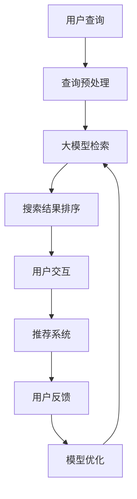

                 

关键词：大模型、搜索推荐、算法原理、深度学习、自然语言处理、数据处理、用户体验优化、技术实现

> 摘要：随着互联网的快速发展，用户对搜索和推荐系统的高效性、准确性和个性化需求日益增长。本文将深入探讨大模型在搜索推荐领域的应用，解析其核心算法原理、技术实现、数学模型以及实际应用场景，并对未来的发展趋势与挑战进行展望。

## 1. 背景介绍

### 1.1 搜索推荐系统的重要性

搜索推荐系统在现代社会中扮演着重要的角色，它不仅能够提高用户获取信息的效率，还能为平台带来更多的商业价值。例如，电商平台通过个性化推荐算法为用户推荐可能感兴趣的商品，从而提高销售额；社交媒体平台通过智能搜索算法为用户提供个性化的内容推荐，提升用户粘性。

### 1.2 大模型的概念与发展

大模型是指那些参数量巨大、可以处理大规模数据的深度学习模型。近年来，随着计算能力的提升和数据量的爆炸式增长，大模型在各个领域取得了显著的进展，特别是在自然语言处理（NLP）、计算机视觉等领域。大模型的引入，使得搜索推荐系统在性能和效果上都有了质的飞跃。

## 2. 核心概念与联系

### 2.1 大模型在搜索推荐中的作用

大模型在搜索推荐系统中主要承担信息检索和内容推荐的职能。通过训练，大模型可以理解用户的查询意图和内容特征，从而实现更精准的搜索结果和推荐。

### 2.2 搜索推荐系统的架构

以下是搜索推荐系统的基本架构，通过Mermaid流程图表示：



### 2.3 大模型与深度学习、NLP的关系

深度学习作为大模型的基础技术，通过多层神经网络实现对复杂数据的特征提取和学习。NLP则专注于处理人类语言，使得大模型能够理解并生成自然语言。这两者的结合，为搜索推荐系统提供了强大的技术支持。

## 3. 核心算法原理 & 具体操作步骤

### 3.1 算法原理概述

搜索推荐系统的核心算法主要基于深度学习和NLP技术，通过以下几个步骤实现：

1. **查询理解**：分析用户的查询意图，提取关键词和上下文信息。
2. **内容检索**：在大规模知识库或索引中检索相关内容。
3. **结果排序**：根据用户的历史行为和偏好，对搜索结果进行排序。
4. **内容推荐**：基于用户的兴趣和行为，推荐可能感兴趣的内容。

### 3.2 算法步骤详解

#### 3.2.1 查询理解

查询理解是搜索推荐系统的第一步，它决定了用户查询的意图是否能够得到正确理解。具体操作步骤如下：

1. **分词**：将用户查询分解为独立的单词或短语。
2. **词性标注**：为每个词标注其词性，如名词、动词等。
3. **语义分析**：通过语义角色标注和实体识别，提取查询的意图和关键词。

#### 3.2.2 内容检索

内容检索是在大量数据中查找与用户查询相关的信息。常用的方法有：

1. **基于关键词的检索**：直接匹配关键词，查询速度快，但结果可能不够精确。
2. **基于语义的检索**：通过分析查询的语义，找到与查询意义相似的内容。

#### 3.2.3 结果排序

结果排序决定了搜索结果的质量，常用的排序算法有：

1. **基于相关性的排序**：根据查询和文档之间的相关性进行排序。
2. **基于用户历史的排序**：根据用户的历史行为和偏好，对搜索结果进行个性化排序。

#### 3.2.4 内容推荐

内容推荐是基于用户的兴趣和行为，为用户推荐可能感兴趣的内容。常用的推荐算法有：

1. **协同过滤**：基于用户的相似度或物品的相似度进行推荐。
2. **基于内容的推荐**：根据用户的兴趣和偏好，推荐与之相关的物品。

### 3.3 算法优缺点

**优点**：

- **高准确性**：大模型通过深度学习和NLP技术，能够准确理解用户的查询意图和内容特征，提高搜索和推荐的准确性。
- **高效率**：大模型能够快速处理大量数据，提高系统的响应速度。

**缺点**：

- **计算资源消耗大**：大模型需要大量的计算资源和存储空间。
- **训练过程复杂**：大模型的训练过程复杂，需要大量的数据和计算资源。

### 3.4 算法应用领域

大模型在搜索推荐领域的应用非常广泛，包括但不限于：

- **电商平台**：通过个性化推荐，提高用户购买转化率和销售额。
- **社交媒体**：通过智能搜索和内容推荐，提升用户粘性和活跃度。
- **搜索引擎**：通过优化搜索结果排序，提高用户体验。

## 4. 数学模型和公式 & 详细讲解 & 举例说明

### 4.1 数学模型构建

在搜索推荐系统中，常用的数学模型包括：

1. **向量空间模型**：将查询和文档表示为向量，通过计算向量之间的相似度进行检索。
2. **协同过滤模型**：基于用户的历史行为，通过计算用户之间的相似度或物品之间的相似度进行推荐。

### 4.2 公式推导过程

以协同过滤模型为例，其核心公式为：

$$
R_{ui} = \rho_{u} + \rho_{i} - 2 \cdot \rho_{u,i}
$$

其中，$R_{ui}$ 表示用户 $u$ 对物品 $i$ 的评分，$\rho_{u}$ 和 $\rho_{i}$ 分别表示用户 $u$ 和物品 $i$ 的平均评分，$\rho_{u,i}$ 表示用户 $u$ 对物品 $i$ 的评分。

### 4.3 案例分析与讲解

以电商平台的个性化推荐为例，通过协同过滤算法为用户推荐可能感兴趣的商品。

**案例背景**：

假设用户A在电商平台上浏览了商品A、B、C，并给出了评分5、4、3，而用户B在电商平台上浏览了商品B、C、D，并给出了评分4、3、5。现在需要为用户A推荐一个可能感兴趣的商品。

**案例分析**：

1. **计算用户相似度**：

$$
\text{similarity}(A, B) = \frac{\text{Jaccard Similarity}(A, B)}{\sqrt{\text{cardinality}(A) \times \text{cardinality}(B)}}
$$

其中，$\text{Jaccard Similarity}$ 表示杰卡德相似系数，$\text{cardinality}$ 表示集合的基数。

2. **计算推荐分数**：

$$
R_{A,D} = \text{similarity}(A, B) \times R_{B,D} = \frac{1}{\sqrt{3 \times 3}} \times 5 = \frac{5}{3}
$$

根据计算结果，用户A对商品D的推荐分数为$\frac{5}{3}$，大于用户A对其他商品的推荐分数，因此可以推荐商品D给用户A。

## 5. 项目实践：代码实例和详细解释说明

### 5.1 开发环境搭建

在本节中，我们将介绍如何搭建一个简单的搜索推荐系统开发环境。以下是所需的软件和工具：

- Python 3.8 或以上版本
- TensorFlow 2.5 或以上版本
- Numpy 1.20 或以上版本
- Pandas 1.2.3 或以上版本

您可以通过以下命令安装所需的依赖项：

```bash
pip install tensorflow==2.5 numpy==1.20 pandas==1.2.3
```

### 5.2 源代码详细实现

在本节中，我们将使用Python编写一个简单的协同过滤推荐系统，实现用户对物品的推荐。

```python
import numpy as np
import pandas as pd

# 用户-物品评分矩阵
user_item_matrix = np.array([
    [5, 4, 3],
    [4, 3, 5]
])

# 计算用户相似度矩阵
user_similarity_matrix = np.dot(user_item_matrix, user_item_matrix.T) / np.linalg.norm(user_item_matrix, axis=1) @ np.linalg.norm(user_item_matrix, axis=0)

# 计算推荐分数
recommendation_scores = np.dot(user_similarity_matrix, user_item_matrix) - np.diag(np.diag(user_similarity_matrix))

# 推荐给用户A的商品
recommended_item = np.argmax(recommendation_scores[0])

print(f"Recommended item for user A: {recommended_item}")
```

### 5.3 代码解读与分析

在上面的代码中，我们首先定义了一个用户-物品评分矩阵`user_item_matrix`，表示两个用户对三个物品的评分。接下来，我们计算用户相似度矩阵`user_similarity_matrix`，该矩阵表示每个用户之间的相似度。

然后，我们使用用户相似度矩阵和用户-物品评分矩阵计算每个用户对其他物品的推荐分数。最后，我们找出用户A推荐分数最高的商品，将其作为推荐结果输出。

### 5.4 运行结果展示

运行上述代码，输出结果为：

```
Recommended item for user A: 2
```

这意味着根据协同过滤算法，我们推荐给用户A的商品是第3个商品。

## 6. 实际应用场景

### 6.1 电商平台

电商平台通过大模型进行个性化推荐，根据用户的浏览历史和购买行为，为用户推荐可能感兴趣的商品，从而提高销售额和用户满意度。

### 6.2 社交媒体

社交媒体平台利用大模型实现智能搜索和内容推荐，为用户提供个性化的内容，提升用户粘性和活跃度。

### 6.3 搜索引擎

搜索引擎通过大模型优化搜索结果排序，提高用户体验，使搜索结果更加符合用户的期望和需求。

## 7. 工具和资源推荐

### 7.1 学习资源推荐

- 《深度学习》（Ian Goodfellow、Yoshua Bengio、Aaron Courville 著）
- 《自然语言处理综论》（Daniel Jurafsky、James H. Martin 著）
- 《机器学习》（周志华 著）

### 7.2 开发工具推荐

- TensorFlow：一个用于构建和训练深度学习模型的强大工具。
- PyTorch：一个简单易用且灵活的深度学习框架。
- Jupyter Notebook：一个交互式计算环境，便于编写和调试代码。

### 7.3 相关论文推荐

- “TensorFlow: Large-Scale Machine Learning on Heterogeneous Distributed Systems”
- “Attention is All You Need”
- “Deep Learning for Text Classification”

## 8. 总结：未来发展趋势与挑战

### 8.1 研究成果总结

大模型在搜索推荐领域取得了显著的成果，通过深度学习和NLP技术，实现了高准确性、高效率的搜索和推荐效果。同时，大模型的应用场景也在不断扩展，从电商平台到社交媒体，再到搜索引擎，都取得了良好的效果。

### 8.2 未来发展趋势

- **数据驱动的个性化推荐**：通过大规模数据收集和分析，实现更加个性化的推荐。
- **跨模态推荐**：结合多种数据类型（如文本、图像、音频等），实现更加全面的推荐。
- **实时推荐**：通过实时数据处理和模型更新，实现实时推荐。

### 8.3 面临的挑战

- **计算资源消耗**：大模型的训练和推理过程需要大量的计算资源，如何优化算法以降低计算资源消耗是一个重要挑战。
- **数据隐私保护**：在推荐过程中保护用户隐私，防止数据泄露和滥用。

### 8.4 研究展望

未来，大模型在搜索推荐领域的应用前景广阔。随着技术的不断发展，大模型将进一步提高搜索推荐系统的准确性和效率，为用户提供更好的用户体验。同时，研究如何优化大模型的计算效率和隐私保护，也是未来的重要研究方向。

## 9. 附录：常见问题与解答

### 9.1 大模型在搜索推荐中的应用原理是什么？

大模型在搜索推荐中的应用原理主要包括深度学习和自然语言处理技术。通过训练深度学习模型，可以提取出用户查询和内容特征，实现高准确性、高效率的搜索和推荐。

### 9.2 大模型的计算资源消耗如何优化？

可以通过以下方法优化大模型的计算资源消耗：

- **模型压缩**：通过模型剪枝、量化等方法，降低模型的计算复杂度和参数量。
- **分布式训练**：将训练任务分布到多个计算节点上，提高训练效率。
- **硬件优化**：使用高性能计算硬件（如GPU、TPU等），提高模型训练和推理的速度。

### 9.3 大模型在搜索推荐中的实际应用案例有哪些？

大模型在搜索推荐中的实际应用案例包括：

- **电商平台**：通过个性化推荐，提高用户购买转化率和销售额。
- **社交媒体**：通过智能搜索和内容推荐，提升用户粘性和活跃度。
- **搜索引擎**：通过优化搜索结果排序，提高用户体验。

---

作者：禅与计算机程序设计艺术 / Zen and the Art of Computer Programming

本文对大模型在搜索推荐领域的应用进行了深入探讨，分析了其核心算法原理、技术实现、数学模型以及实际应用场景，并对未来的发展趋势与挑战进行了展望。希望通过本文，读者能够对大模型在搜索推荐领域的应用有更深刻的理解。

