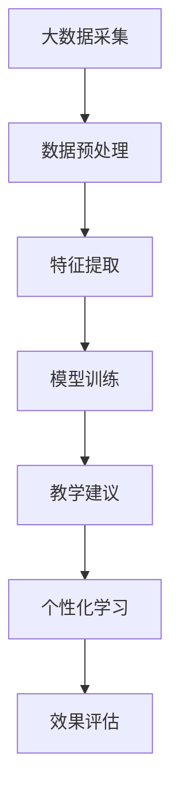

                 

关键词：大模型、智慧教育、个性化学习、创业者、智能教育

> 摘要：本文将探讨大模型技术在智慧教育领域的应用，分析其如何赋能教育行业，并详细阐述创业者如何利用这一技术打造智能教育与个性化学习产品。文章将分为背景介绍、核心概念与联系、核心算法原理、数学模型和公式、项目实践、实际应用场景、工具和资源推荐、总结与展望以及常见问题与解答等多个部分，力求为读者提供全面而深入的技术洞察。

## 1. 背景介绍

在信息技术飞速发展的今天，教育行业也面临着前所未有的变革。传统的教育模式越来越难以满足个性化学习需求，教育资源的分配不均也制约了教育的公平性。同时，随着人工智能技术的不断进步，尤其是大模型技术的突破，为智慧教育的发展提供了新的可能性。

智慧教育是指通过信息技术的应用，实现教育资源的数字化、智能化，提高教育质量和效率的一种教育模式。个性化学习则强调根据每个学生的特点和需求，提供定制化的学习方案，促进学生的全面发展。大模型技术在其中的作用主要体现在以下几个方面：

- **提高教育质量**：大模型能够处理海量的教育数据，通过深度学习分析学生的行为和学习习惯，为教师提供个性化的教学建议。
- **优化教育资源分配**：通过智能分析，可以合理分配教育资源，缩小城乡、区域教育差距。
- **促进创新教育模式**：大模型可以模拟真实的教学场景，提供沉浸式的学习体验，激发学生的学习兴趣和创造力。

创业者利用大模型技术打造智能教育与个性化学习产品，不仅能够抓住教育行业的技术变革机遇，还能为用户提供更好的学习体验，从而在激烈的市场竞争中脱颖而出。

## 2. 核心概念与联系

### 大模型技术

大模型技术，即大规模深度学习模型，是人工智能领域的重要突破。这些模型通常拥有数十亿个参数，可以通过训练学习到复杂的模式和规律。大模型技术主要包括以下几个核心概念：

- **深度神经网络（DNN）**：深度神经网络是构建大模型的基础，通过层层神经元的传递，实现对输入数据的复杂变换和特征提取。
- **循环神经网络（RNN）**：循环神经网络适用于处理序列数据，如文本、语音等，具有记忆功能，能够捕捉时间序列中的长期依赖关系。
- **变分自编码器（VAE）**：变分自编码器是一种生成模型，可以学习数据的概率分布，从而生成新的数据样本。
- **生成对抗网络（GAN）**：生成对抗网络由生成器和判别器组成，通过对抗训练生成逼真的数据。

### 智慧教育与个性化学习

智慧教育与个性化学习是教育行业发展的两个重要方向。智慧教育强调利用信息技术实现教育资源的数字化和智能化，而个性化学习则关注根据学生的个体差异，提供个性化的教学方案。两者在大模型技术中的联系主要体现在：

- **教育数据分析**：大模型能够处理和分析海量的教育数据，包括学生的考试成绩、学习行为、兴趣爱好等，为个性化学习提供数据支持。
- **智能教学建议**：基于数据分析，大模型可以为教师提供个性化的教学建议，如调整教学进度、推荐适合的学习资源等。
- **自适应学习系统**：大模型可以构建自适应学习系统，根据学生的学习进度和效果，动态调整教学内容和难度，实现真正的个性化学习。

### Mermaid 流程图

为了更直观地展示大模型技术在智慧教育与个性化学习中的应用，我们使用Mermaid绘制一个简单的流程图。



在上述流程图中，A代表大数据采集，即从各类教育平台、学习管理系统等收集学生的数据。B表示数据预处理，包括数据清洗、归一化等操作。C是特征提取，通过深度学习技术提取数据中的关键特征。D是模型训练，使用大量标注数据训练大模型。E表示教学建议，根据模型输出的建议调整教学方案。F是个性化学习，根据学生的反馈和效果，动态调整学习内容。G是效果评估，对个性化学习的效果进行评估和反馈。

## 3. 核心算法原理 & 具体操作步骤

### 3.1 算法原理概述

在智慧教育与个性化学习中，大模型的核心算法主要包括深度学习、自然语言处理（NLP）和生成模型等。以下是这些算法的基本原理：

- **深度学习**：深度学习是构建大模型的基础，通过多层神经网络的组合，实现对数据的层次化特征提取。典型的深度学习算法包括卷积神经网络（CNN）和循环神经网络（RNN）等。
- **自然语言处理（NLP）**：NLP是人工智能的重要分支，主要研究如何让计算机理解和生成自然语言。常用的NLP算法包括词向量表示（如Word2Vec）、递归神经网络（RNN）和长短期记忆网络（LSTM）等。
- **生成模型**：生成模型是一种能够生成新数据的模型，如变分自编码器（VAE）和生成对抗网络（GAN）。这些模型在智慧教育中可以用于生成个性化学习资源，如自适应练习题和个性化课程。

### 3.2 算法步骤详解

#### 深度学习模型构建

1. **数据收集**：从各类教育平台、学习管理系统等收集学生的数据，包括考试成绩、学习行为、兴趣爱好等。
2. **数据预处理**：对收集到的数据进行清洗、归一化等处理，以消除数据中的噪声和异常值。
3. **特征提取**：使用深度学习算法，如卷积神经网络（CNN）或循环神经网络（RNN），对预处理后的数据进行特征提取。
4. **模型训练**：使用大量标注数据训练深度学习模型，通过反向传播算法不断优化模型参数。
5. **模型评估**：使用验证集评估模型的性能，调整模型参数以获得最佳效果。

#### 自然语言处理（NLP）

1. **词向量表示**：使用Word2Vec或BERT等算法将文本数据转化为词向量。
2. **序列建模**：使用递归神经网络（RNN）或长短期记忆网络（LSTM）对词向量进行序列建模，捕捉文本中的语义信息。
3. **语言生成**：基于训练好的模型，生成个性化学习建议或课程内容。

#### 生成模型

1. **数据生成**：使用变分自编码器（VAE）或生成对抗网络（GAN）生成新的学习资源，如自适应练习题和个性化课程。
2. **资源调整**：根据学生的反馈和学习效果，动态调整生成资源的内容和难度。

### 3.3 算法优缺点

#### 深度学习

- **优点**：能够处理复杂数据，自动提取特征，适用于各种应用场景。
- **缺点**：训练过程复杂，对计算资源要求较高，模型解释性较差。

#### 自然语言处理（NLP）

- **优点**：能够处理自然语言，生成个性化学习内容，提高学习体验。
- **缺点**：对大规模文本数据处理能力有限，模型解释性较差。

#### 生成模型

- **优点**：能够生成个性化学习资源，提高学习效率。
- **缺点**：生成资源质量难以控制，需要大量训练数据。

### 3.4 算法应用领域

大模型技术在智慧教育与个性化学习中的应用领域包括：

- **自适应学习系统**：根据学生的学习进度和效果，动态调整教学内容和难度。
- **个性化学习建议**：为教师和学生提供个性化的教学建议，如学习资源推荐、学习策略调整等。
- **智能教学助理**：辅助教师进行教学管理，如学生成绩分析、教学进度跟踪等。
- **教育资源生成**：生成自适应练习题、个性化课程等学习资源。

## 4. 数学模型和公式 & 详细讲解 & 举例说明

### 4.1 数学模型构建

在智慧教育与个性化学习中，常用的数学模型包括深度学习模型、自然语言处理（NLP）模型和生成模型等。以下是这些模型的基本数学公式和构建方法。

#### 深度学习模型

深度学习模型通常基于反向传播算法进行训练。以下是深度学习模型的基本数学公式：

1. **前向传播**：

   $$ 
   z_{l} = \sum_{j} w_{lj} \cdot a_{j}^{l-1} + b_{l} 
   $$

   $$ 
   a_{l} = \sigma(z_{l}) 
   $$

   其中，$z_{l}$表示第$l$层的输入，$a_{l}$表示第$l$层的输出，$w_{lj}$表示连接权重，$b_{l}$表示偏置项，$\sigma$表示激活函数。

2. **反向传播**：

   $$ 
   \delta_{l} = \frac{\partial L}{\partial a_{l}} \cdot \frac{\partial a_{l}}{\partial z_{l}} 
   $$

   $$ 
   \delta_{l-1} = \delta_{l} \cdot \frac{\partial z_{l}}{\partial a_{l-1}} 
   $$

   其中，$\delta_{l}$表示第$l$层的误差，$L$表示损失函数。

3. **权重更新**：

   $$ 
   w_{lj} := w_{lj} - \alpha \cdot \delta_{l} \cdot a_{l-1} 
   $$

   $$ 
   b_{l} := b_{l} - \alpha \cdot \delta_{l} 
   $$

   其中，$\alpha$表示学习率。

#### 自然语言处理（NLP）模型

NLP模型常用的数学模型包括词向量表示、递归神经网络（RNN）和长短期记忆网络（LSTM）等。以下是这些模型的基本数学公式：

1. **词向量表示**：

   $$ 
   \mathbf{v}_{w} = \text{Word2Vec}(\text{Context}(w)) 
   $$

   其中，$\mathbf{v}_{w}$表示词向量，$\text{Word2Vec}$表示词向量生成算法，$\text{Context}(w)$表示词$w$的上下文。

2. **递归神经网络（RNN）**：

   $$ 
   \mathbf{h}_{t} = \text{RNN}(\mathbf{h}_{t-1}, \mathbf{x}_{t}) 
   $$

   其中，$\mathbf{h}_{t}$表示第$t$步的隐藏状态，$\mathbf{x}_{t}$表示第$t$步的输入。

3. **长短期记忆网络（LSTM）**：

   $$ 
   \mathbf{i}_{t} = \sigma(W_{i} \cdot [\mathbf{h}_{t-1}, \mathbf{x}_{t}] + b_{i}) 
   $$

   $$ 
   \mathbf{f}_{t} = \sigma(W_{f} \cdot [\mathbf{h}_{t-1}, \mathbf{x}_{t}] + b_{f}) 
   $$

   $$ 
   \mathbf{g}_{t} = \text{tanh}(W_{g} \cdot [\mathbf{h}_{t-1}, \mathbf{x}_{t}] + b_{g}) 
   $$

   $$ 
   \mathbf{o}_{t} = \sigma(W_{o} \cdot [\mathbf{h}_{t-1}, \mathbf{g}_{t}] + b_{o}) 
   $$

   $$ 
   \mathbf{h}_{t} = \mathbf{o}_{t} \cdot \mathbf{g}_{t} 
   $$

   其中，$\mathbf{i}_{t}$、$\mathbf{f}_{t}$、$\mathbf{g}_{t}$、$\mathbf{o}_{t}$分别表示输入门、遗忘门、生成门和输出门，$W_{i}$、$W_{f}$、$W_{g}$、$W_{o}$分别表示输入门、遗忘门、生成门和输出门的权重，$b_{i}$、$b_{f}$、$b_{g}$、$b_{o}$分别表示输入门、遗忘门、生成门和输出门的偏置项，$\sigma$表示激活函数。

#### 生成模型

生成模型常用的数学模型包括变分自编码器（VAE）和生成对抗网络（GAN）等。以下是这些模型的基本数学公式：

1. **变分自编码器（VAE）**：

   $$ 
   \mathbf{x} = \mu(\mathbf{z}) + \sigma(\mathbf{z}) \cdot \mathbf{epsilon} 
   $$

   $$ 
   \mathbf{z} = \phi(\mathbf{x}) 
   $$

   其中，$\mu(\mathbf{z})$表示编码器，$\sigma(\mathbf{z})$表示解码器，$\mathbf{epsilon}$表示高斯噪声。

2. **生成对抗网络（GAN）**：

   $$ 
   \mathbf{G}(\mathbf{z}) \xrightarrow{\text{Discriminator}} D(\mathbf{G}(\mathbf{z})); D(\mathbf{x}) 
   $$

   其中，$G(\mathbf{z})$表示生成器，$D(\mathbf{x})$表示判别器。

### 4.2 公式推导过程

以下是深度学习模型、自然语言处理（NLP）模型和生成模型的基本公式推导过程。

#### 深度学习模型

1. **前向传播**：

   前向传播的推导过程可以分为以下几个步骤：

   - 输入层到隐藏层：

     $$ 
     z_{l} = \sum_{j} w_{lj} \cdot a_{j}^{l-1} + b_{l} 
     $$

     $$ 
     a_{l} = \sigma(z_{l}) 
     $$

     其中，$z_{l}$表示第$l$层的输入，$a_{l}$表示第$l$层的输出，$w_{lj}$表示连接权重，$b_{l}$表示偏置项，$\sigma$表示激活函数。

   - 隐藏层到输出层：

     $$ 
     z_{out} = \sum_{l} w_{outl} \cdot a_{l} + b_{out} 
     $$

     $$ 
     y = \sigma(z_{out}) 
     $$

     其中，$z_{out}$表示输出层输入，$y$表示输出。

2. **反向传播**：

   反向传播的推导过程可以分为以下几个步骤：

   - 计算输出层误差：

     $$ 
     \delta_{out} = \frac{\partial L}{\partial z_{out}} \cdot \frac{\partial z_{out}}{\partial a_{out}} 
     $$

     $$ 
     \delta_{l} = \delta_{out} \cdot \frac{\partial a_{l}}{\partial z_{l}} 
     $$

     其中，$\delta_{out}$表示输出层误差，$\delta_{l}$表示第$l$层误差，$L$表示损失函数。

   - 计算隐藏层误差：

     $$ 
     \delta_{l-1} = \delta_{l} \cdot \frac{\partial z_{l-1}}{\partial a_{l-1}} 
     $$

   - 权重更新：

     $$ 
     w_{lj} := w_{lj} - \alpha \cdot \delta_{l} \cdot a_{l-1} 
     $$

     $$ 
     b_{l} := b_{l} - \alpha \cdot \delta_{l} 
     $$

     其中，$\alpha$表示学习率。

#### 自然语言处理（NLP）模型

1. **词向量表示**：

   词向量表示的推导过程可以分为以下几个步骤：

   - 初始化词向量：

     $$ 
     \mathbf{v}_{w} \sim \mathcal{N}(0, \sigma^2) 
     $$

     其中，$\mathbf{v}_{w}$表示词向量，$\sigma^2$表示方差。

   - 计算词向量：

     $$ 
     \mathbf{v}_{w} = \text{Word2Vec}(\text{Context}(w)) 
     $$

     其中，$\text{Context}(w)$表示词$w$的上下文。

2. **递归神经网络（RNN）**：

   递归神经网络的推导过程可以分为以下几个步骤：

   - 初始化隐藏状态：

     $$ 
     \mathbf{h}_{0} \sim \mathcal{N}(0, \sigma^2) 
     $$

     其中，$\mathbf{h}_{0}$表示初始隐藏状态。

   - 递归更新隐藏状态：

     $$ 
     \mathbf{h}_{t} = \text{RNN}(\mathbf{h}_{t-1}, \mathbf{x}_{t}) 
     $$

     其中，$\mathbf{h}_{t}$表示第$t$步的隐藏状态，$\mathbf{x}_{t}$表示第$t$步的输入。

3. **长短期记忆网络（LSTM）**：

   长短期记忆网络的推导过程可以分为以下几个步骤：

   - 初始化隐藏状态：

     $$ 
     \mathbf{h}_{0} \sim \mathcal{N}(0, \sigma^2) 
     $$

     其中，$\mathbf{h}_{0}$表示初始隐藏状态。

   - 递归更新隐藏状态：

     $$ 
     \mathbf{i}_{t} = \sigma(W_{i} \cdot [\mathbf{h}_{t-1}, \mathbf{x}_{t}] + b_{i}) 
     $$

     $$ 
     \mathbf{f}_{t} = \sigma(W_{f} \cdot [\mathbf{h}_{t-1}, \mathbf{x}_{t}] + b_{f}) 
     $$

     $$ 
     \mathbf{g}_{t} = \text{tanh}(W_{g} \cdot [\mathbf{h}_{t-1}, \mathbf{x}_{t}] + b_{g}) 
     $$

     $$ 
     \mathbf{o}_{t} = \sigma(W_{o} \cdot [\mathbf{h}_{t-1}, \mathbf{g}_{t}] + b_{o}) 
     $$

     $$ 
     \mathbf{h}_{t} = \mathbf{o}_{t} \cdot \mathbf{g}_{t} 
     $$

     其中，$\mathbf{i}_{t}$、$\mathbf{f}_{t}$、$\mathbf{g}_{t}$、$\mathbf{o}_{t}$分别表示输入门、遗忘门、生成门和输出门，$W_{i}$、$W_{f}$、$W_{g}$、$W_{o}$分别表示输入门、遗忘门、生成门和输出门的权重，$b_{i}$、$b_{f}$、$b_{g}$、$b_{o}$分别表示输入门、遗忘门、生成门和输出门的偏置项，$\sigma$表示激活函数。

#### 生成模型

1. **变分自编码器（VAE）**：

   变分自编码器的推导过程可以分为以下几个步骤：

   - 编码器：

     $$ 
     \mathbf{z} = \phi(\mathbf{x}) 
     $$

     其中，$\phi(\mathbf{x})$表示编码器，$\mathbf{z}$表示编码后的隐变量。

   - 解码器：

     $$ 
     \mathbf{x} = \mu(\mathbf{z}) + \sigma(\mathbf{z}) \cdot \mathbf{epsilon} 
     $$

     其中，$\mu(\mathbf{z})$表示编码器，$\sigma(\mathbf{z})$表示解码器，$\mathbf{epsilon}$表示高斯噪声。

2. **生成对抗网络（GAN）**：

   生成对抗网络的推导过程可以分为以下几个步骤：

   - 生成器：

     $$ 
     \mathbf{G}(\mathbf{z}) \xrightarrow{\text{Discriminator}} D(\mathbf{G}(\mathbf{z})); D(\mathbf{x}) 
     $$

     其中，$G(\mathbf{z})$表示生成器，$D(\mathbf{x})$表示判别器。

### 4.3 案例分析与讲解

以下是几个具体的案例，用于说明大模型技术在智慧教育与个性化学习中的应用。

#### 案例一：自适应学习系统

自适应学习系统通过深度学习模型分析学生的学习数据，为每个学生提供个性化的学习方案。以下是一个简单的案例：

1. **数据收集**：收集学生的考试成绩、学习行为数据等。
2. **数据预处理**：对收集到的数据进行清洗、归一化处理。
3. **特征提取**：使用深度学习模型提取学习数据中的关键特征。
4. **模型训练**：使用大量标注数据训练深度学习模型。
5. **个性化学习建议**：根据模型输出的建议，调整学生的学习进度和资源推荐。

#### 案例二：个性化学习资源生成

个性化学习资源生成通过生成模型生成符合学生学习需求的学习资源，如自适应练习题和个性化课程。以下是一个简单的案例：

1. **数据收集**：收集大量的练习题和课程数据。
2. **数据预处理**：对收集到的数据进行清洗、归一化处理。
3. **模型训练**：使用变分自编码器（VAE）训练生成模型。
4. **资源生成**：根据学生的反馈和学习效果，动态生成个性化学习资源。

#### 案例三：智能教学助理

智能教学助理通过自然语言处理（NLP）模型分析学生的学习数据和教学反馈，为教师提供教学管理建议。以下是一个简单的案例：

1. **数据收集**：收集学生的学习数据、教师的教学反馈等。
2. **数据预处理**：对收集到的数据进行清洗、归一化处理。
3. **模型训练**：使用递归神经网络（RNN）训练NLP模型。
4. **教学管理建议**：根据模型输出的建议，调整教学进度、资源推荐等。

## 5. 项目实践：代码实例和详细解释说明

### 5.1 开发环境搭建

为了进行大模型技术在智慧教育与个性化学习中的应用实践，我们首先需要搭建一个合适的开发环境。以下是具体的搭建步骤：

1. **安装Python**：在开发环境中安装Python，版本建议为3.8或更高版本。
2. **安装深度学习框架**：安装PyTorch或TensorFlow等深度学习框架，版本建议为最新稳定版。
3. **安装NLP库**：安装NLTK或spaCy等自然语言处理库，版本建议为最新稳定版。
4. **安装生成模型库**：安装GAN或VAE等生成模型库，版本建议为最新稳定版。
5. **配置运行环境**：配置Python环境变量，确保深度学习框架和NLP库的正常运行。

### 5.2 源代码详细实现

以下是一个基于PyTorch的深度学习模型训练的简单示例，用于生成个性化学习资源。

```python
import torch
import torch.nn as nn
import torch.optim as optim
from torch.utils.data import DataLoader
from torchvision import datasets, transforms

# 数据预处理
transform = transforms.Compose([
    transforms.ToTensor(),
    transforms.Normalize((0.5,), (0.5,))
])

# 数据集加载
train_dataset = datasets.MNIST(
    root='./data', 
    train=True, 
    download=True, 
    transform=transform
)

train_loader = DataLoader(
    train_dataset, 
    batch_size=100, 
    shuffle=True
)

# 模型定义
class Net(nn.Module):
    def __init__(self):
        super(Net, self).__init__()
        self.fc1 = nn.Linear(784, 500)
        self.fc2 = nn.Linear(500, 10)
        self.dropout = nn.Dropout(p=0.2)
    
    def forward(self, x):
        x = x.view(-1, 784)
        x = torch.relu(self.fc1(x))
        x = self.dropout(x)
        x = torch.relu(self.fc2(x))
        return x

model = Net()

# 损失函数和优化器
criterion = nn.CrossEntropyLoss()
optimizer = optim.Adam(model.parameters(), lr=0.001)

# 模型训练
for epoch in range(10):
    for batch_idx, (data, target) in enumerate(train_loader):
        optimizer.zero_grad()
        output = model(data)
        loss = criterion(output, target)
        loss.backward()
        optimizer.step()
        if batch_idx % 100 == 0:
            print('Train Epoch: {} [{}/{} ({:.0f}%)]\tLoss: {:.6f}'.format(
                epoch, batch_idx * len(data), len(train_loader.dataset),
                100. * batch_idx / len(train_loader), loss.item()))

# 模型保存
torch.save(model.state_dict(), 'model.pth')
```

### 5.3 代码解读与分析

以上代码实现了一个简单的深度学习模型，用于对MNIST手写数字数据集进行分类。以下是代码的详细解读和分析：

1. **数据预处理**：使用`transforms.Compose`对数据集进行预处理，包括转换为张量和归一化。
2. **数据集加载**：使用`DataLoader`加载训练数据集，并将数据集拆分为数据集和标签。
3. **模型定义**：定义一个简单的多层感知机模型，包括线性层、ReLU激活函数和Dropout正则化。
4. **模型训练**：使用`CrossEntropyLoss`损失函数和`Adam`优化器对模型进行训练，并在每个训练批次后更新模型参数。
5. **模型保存**：将训练好的模型参数保存为`.pth`文件，以便后续使用。

### 5.4 运行结果展示

运行上述代码后，训练过程将输出每个训练批次的损失值。训练完成后，可以将模型参数加载到新模型中，进行测试数据的预测。

```python
# 模型加载
model = Net()
model.load_state_dict(torch.load('model.pth'))

# 测试数据加载
test_dataset = datasets.MNIST(
    root='./data', 
    train=False, 
    transform=transform
)

test_loader = DataLoader(test_dataset, batch_size=100)

# 模型测试
with torch.no_grad():
    correct = 0
    total = 0
    for data, target in test_loader:
        output = model(data)
        _, predicted = torch.max(output, 1)
        total += target.size(0)
        correct += (predicted == target).sum().item()

print('Test Accuracy of the network on the 10000 test images: {} %'.format(100 * correct / total))
```

运行测试代码后，将输出模型的测试准确率。通过调整模型结构、优化算法和训练数据，可以提高模型的性能和准确率。

## 6. 实际应用场景

### 6.1 教育行业

大模型技术在教育行业中的应用已经取得了显著的成果。例如，通过深度学习模型分析学生的学习行为和成绩，可以为教师提供个性化的教学建议，提高教学效果。此外，大模型还可以用于自适应学习系统的开发，根据学生的学习进度和效果，动态调整教学内容和难度，实现真正的个性化学习。例如，某在线教育平台利用大模型技术为用户提供个性化的学习路径推荐，显著提高了学生的学习满意度和学习效果。

### 6.2 培训行业

在培训行业，大模型技术同样发挥着重要作用。例如，通过分析学员的学习行为和成绩，大模型可以为培训师提供个性化的培训建议，提高培训效果。此外，大模型还可以用于自动生成培训课程内容，根据学员的需求和反馈，动态调整课程内容和难度。例如，某在线培训平台利用大模型技术为用户提供个性化的课程推荐，提高了用户的参与度和满意度。

### 6.3 在线学习平台

在线学习平台是另一个大模型技术的重要应用场景。通过大模型分析用户的学习行为和兴趣，平台可以为用户提供个性化的学习资源推荐，提高用户的学习体验和效果。此外，大模型还可以用于自动生成课程内容，根据用户的需求和反馈，动态调整课程内容和难度。例如，某知名在线学习平台利用大模型技术为用户提供个性化的学习路径推荐，提高了用户的学习满意度和留存率。

### 6.4 未来应用展望

未来，随着大模型技术的不断发展和成熟，其将在教育、培训、在线学习等领域得到更广泛的应用。以下是未来应用的一些展望：

- **个性化学习**：大模型将更好地捕捉学生的个性化需求，提供更加精准的学习资源推荐和教学建议，实现真正的个性化学习。
- **智能教学**：大模型将辅助教师进行教学管理，如学生成绩分析、教学进度跟踪等，提高教学效率和质量。
- **自适应教育**：大模型将用于构建自适应教育系统，根据学生的反馈和学习效果，动态调整教学内容和难度，实现教育的自适应和智能化。
- **教育资源生成**：大模型将用于自动生成教育资源，如自适应练习题、个性化课程等，提高教育资源的利用效率和质量。

## 7. 工具和资源推荐

### 7.1 学习资源推荐

- **《深度学习》**：由Ian Goodfellow、Yoshua Bengio和Aaron Courville合著，是深度学习领域的经典教材。
- **《自然语言处理综论》**：由Daniel Jurafsky和James H. Martin合著，涵盖了自然语言处理的基本理论和应用。
- **《生成模型》**：由Ilya Sutskever、Oriol Vinyals和Quoc V. Le合著，详细介绍了生成模型的理论和实践。

### 7.2 开发工具推荐

- **PyTorch**：是一个流行的深度学习框架，适用于各种深度学习任务，如计算机视觉、自然语言处理等。
- **TensorFlow**：是Google开发的开源深度学习框架，提供了丰富的工具和库，适用于各种深度学习和机器学习任务。
- **spaCy**：是一个用于自然语言处理的工业级库，提供了快速、高效的文本处理功能，适用于文本分类、命名实体识别等任务。

### 7.3 相关论文推荐

- **“A Theoretical Study of Deep Learning”**：由Yaser Abu-Mostafa等人撰写，探讨了深度学习的基本理论。
- **“Generative Adversarial Nets”**：由Ian Goodfellow等人撰写，首次提出了生成对抗网络（GAN）的概念。
- **“Deep Learning for Natural Language Processing”**：由Dzmitry Bahdanau等人撰写，探讨了深度学习在自然语言处理中的应用。

## 8. 总结：未来发展趋势与挑战

### 8.1 研究成果总结

大模型技术在智慧教育领域取得了显著的成果，不仅提高了教育质量和效率，还为个性化学习提供了新的可能性。通过深度学习、自然语言处理和生成模型等技术的应用，教育行业正逐渐实现数字化、智能化和个性化。

### 8.2 未来发展趋势

未来，随着大模型技术的不断发展和成熟，其将在教育、培训、在线学习等领域得到更广泛的应用。发展趋势包括：

- **个性化学习**：大模型将更好地捕捉学生的个性化需求，提供更加精准的学习资源推荐和教学建议，实现真正的个性化学习。
- **智能教学**：大模型将辅助教师进行教学管理，如学生成绩分析、教学进度跟踪等，提高教学效率和质量。
- **自适应教育**：大模型将用于构建自适应教育系统，根据学生的反馈和学习效果，动态调整教学内容和难度，实现教育的自适应和智能化。
- **教育资源生成**：大模型将用于自动生成教育资源，如自适应练习题、个性化课程等，提高教育资源的利用效率和质量。

### 8.3 面临的挑战

尽管大模型技术在智慧教育领域具有巨大的潜力，但在实际应用中仍面临以下挑战：

- **数据隐私**：教育数据的隐私保护是一个重要问题，如何确保学生数据的安全和隐私需要得到有效解决。
- **计算资源**：大模型训练和推理需要大量的计算资源，如何优化模型训练和推理过程，降低计算成本是一个亟待解决的问题。
- **模型解释性**：大模型通常被视为“黑箱”，其决策过程缺乏透明性和可解释性，如何提高模型的解释性是一个重要的研究方向。

### 8.4 研究展望

未来，大模型技术在智慧教育领域的研究将朝着以下方向发展：

- **多模态学习**：结合多种数据类型（如文本、图像、音频等），实现更加全面和智能的教育资源推荐和教学建议。
- **实时性**：提高模型训练和推理的实时性，实现即时的个性化学习体验。
- **教育公平**：通过大模型技术，缩小城乡、区域教育差距，实现教育公平。

## 9. 附录：常见问题与解答

### 9.1 大模型技术在智慧教育中的应用有哪些？

大模型技术在智慧教育中的应用主要包括以下几个方面：

- **个性化学习**：通过深度学习和自然语言处理技术，分析学生的学习行为和成绩，为每个学生提供个性化的学习资源推荐和教学建议。
- **自适应学习**：构建自适应学习系统，根据学生的学习进度和效果，动态调整教学内容和难度，实现真正的个性化学习。
- **智能教学**：辅助教师进行教学管理，如学生成绩分析、教学进度跟踪等，提高教学效率和质量。
- **教育资源生成**：利用生成模型自动生成教育资源，如自适应练习题、个性化课程等，提高教育资源的利用效率和质量。

### 9.2 大模型技术在教育领域面临的主要挑战是什么？

大模型技术在教育领域面临的主要挑战包括：

- **数据隐私**：如何确保学生数据的安全和隐私是一个重要问题。
- **计算资源**：大模型训练和推理需要大量的计算资源，如何优化模型训练和推理过程，降低计算成本是一个亟待解决的问题。
- **模型解释性**：大模型通常被视为“黑箱”，其决策过程缺乏透明性和可解释性，如何提高模型的解释性是一个重要的研究方向。

### 9.3 如何提高大模型在教育领域的应用效果？

提高大模型在教育领域的应用效果可以从以下几个方面入手：

- **数据质量**：确保数据的质量和准确性，为模型提供可靠的数据支持。
- **算法优化**：不断优化算法和模型结构，提高模型的训练效率和预测准确性。
- **用户反馈**：收集用户反馈，动态调整模型参数和教学策略，实现更好的个性化学习体验。
- **教育资源整合**：整合多种教育资源，为用户提供更加丰富和多样化的学习资源。

### 9.4 大模型技术在教育领域的未来发展趋势是什么？

大模型技术在教育领域的未来发展趋势包括：

- **多模态学习**：结合多种数据类型（如文本、图像、音频等），实现更加全面和智能的教育资源推荐和教学建议。
- **实时性**：提高模型训练和推理的实时性，实现即时的个性化学习体验。
- **教育公平**：通过大模型技术，缩小城乡、区域教育差距，实现教育公平。  
- **个性化学习**：更好地捕捉学生的个性化需求，提供更加精准的学习资源推荐和教学建议，实现真正的个性化学习。

---

作者：禅与计算机程序设计艺术 / Zen and the Art of Computer Programming

