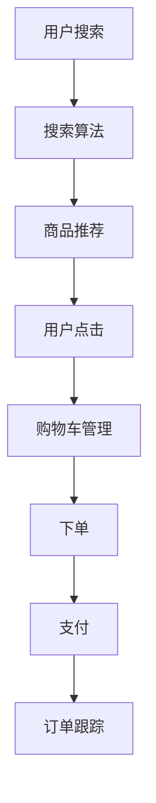

                 

关键词：大模型、电商平台、全流程优化、搜索、购买、算法、数学模型、项目实践、未来展望

> 摘要：本文旨在探讨大模型如何赋能电商平台，实现从搜索到购买的全流程优化。通过对大模型核心概念、算法原理、数学模型以及实际应用场景的深入分析，本文揭示了其背后的技术逻辑和关键步骤，为电商平台的数字化转型提供了新的思路和解决方案。

## 1. 背景介绍

随着互联网的快速发展，电商平台已经成为现代商业的重要组成部分。从搜索、浏览、比价、下单到支付、物流、售后服务，电商平台的全流程体验对用户的满意度有着至关重要的影响。然而，随着用户需求的多样化和市场竞争的加剧，传统的电商平台面临诸多挑战：

- **搜索效率低**：用户在寻找商品时，常常需要花费大量时间进行筛选和比价，用户体验不佳。
- **个性化不足**：缺乏针对用户个性化需求的推荐算法，导致用户无法轻松找到心仪的商品。
- **购买流程复杂**：繁琐的购买流程降低了用户的购买意愿，增加了流失率。

为了应对这些挑战，电商平台需要借助先进的人工智能技术，特别是大模型，实现全流程的优化。大模型（如深度神经网络、生成对抗网络等）具有强大的数据处理和智能推理能力，能够为电商平台提供个性化的推荐、高效的搜索、流畅的购买体验，从而提升用户满意度，增加销售额。

## 2. 核心概念与联系

在探讨大模型赋能电商平台的具体实现之前，我们需要先了解几个核心概念：

### 2.1 大模型

大模型是指那些具有海量参数和强大计算能力的神经网络模型，如深度神经网络（DNN）、生成对抗网络（GAN）、变分自编码器（VAE）等。这些模型能够从大量数据中自动学习复杂的特征表示和规律，从而实现高精度的预测和分类。

### 2.2 搜索算法

搜索算法是电商平台中不可或缺的一部分，它决定了用户能否快速找到所需商品。常见的搜索算法包括基于关键词的搜索、基于内容的搜索、基于协同过滤的搜索等。

### 2.3 推荐算法

推荐算法是电商平台提升用户满意度和转化率的关键。基于内容的推荐、基于协同过滤的推荐、基于模型的推荐等都是常见的推荐算法。

### 2.4 购买流程

购买流程是指用户从浏览商品到完成支付的全过程，包括商品展示、购物车管理、下单、支付、订单跟踪等环节。

下面是一个简化的Mermaid流程图，展示了大模型在电商平台全流程中的应用：



## 3. 核心算法原理 & 具体操作步骤

### 3.1 算法原理概述

#### 3.1.1 搜索算法

搜索算法的核心是利用关键词匹配、文本相似度计算等技术，将用户输入的关键词与商品库中的商品进行匹配，从而返回最相关的商品列表。

#### 3.1.2 推荐算法

推荐算法的核心是通过分析用户的浏览历史、购买记录、评价等数据，构建用户画像，然后根据用户画像和商品特征，为用户推荐最可能感兴趣的商品。

#### 3.1.3 购买流程优化

购买流程优化包括简化购物车管理、优化下单流程、提高支付成功率等。通过自动化、智能化的手段，减少用户的操作步骤，提升购买体验。

### 3.2 算法步骤详解

#### 3.2.1 搜索算法步骤

1. 用户输入关键词。
2. 系统对关键词进行预处理（如分词、去停用词等）。
3. 系统使用文本相似度计算方法（如余弦相似度、Jaccard相似度等）计算关键词与商品标题、描述等的相似度。
4. 系统根据相似度排序，返回最相关的商品列表。

#### 3.2.2 推荐算法步骤

1. 收集用户数据（如浏览记录、购买记录、评价等）。
2. 构建用户画像（如用户兴趣标签、消费水平等）。
3. 收集商品数据（如商品分类、品牌、价格等）。
4. 构建商品特征向量。
5. 计算用户画像和商品特征向量的相似度。
6. 根据相似度排序，为用户推荐最可能感兴趣的商品。

#### 3.2.3 购买流程优化步骤

1. 分析用户行为数据，识别购买流程中的瓶颈。
2. 优化购物车管理，如自动合并同类商品、提供批量删除功能等。
3. 优化下单流程，如简化填写地址、自动计算运费等。
4. 提高支付成功率，如优化支付页面设计、增加支付方式等。
5. 提供实时订单跟踪，提高用户对物流信息的掌控感。

### 3.3 算法优缺点

#### 3.3.1 搜索算法

**优点**：高效、精准，能够快速响应用户的搜索需求。

**缺点**：对于一些模糊的搜索需求，可能难以准确匹配。

#### 3.3.2 推荐算法

**优点**：个性化强，能够提高用户的购买体验。

**缺点**：算法复杂度高，对数据质量要求较高。

#### 3.3.3 购买流程优化

**优点**：简化操作流程，提高购买效率。

**缺点**：需要持续优化和调整，以适应不断变化的市场环境。

### 3.4 算法应用领域

大模型算法在电商平台的各个领域都有广泛的应用，如：

- **商品搜索**：提高搜索效率和准确性。
- **商品推荐**：提升用户满意度和转化率。
- **购物流程优化**：提高购买体验和用户忠诚度。

## 4. 数学模型和公式 & 详细讲解 & 举例说明

### 4.1 数学模型构建

电商平台的大模型算法通常基于机器学习和深度学习技术，其核心模型包括：

1. **卷积神经网络（CNN）**：用于图像识别和商品特征提取。
2. **循环神经网络（RNN）**：用于处理序列数据，如用户行为序列。
3. **生成对抗网络（GAN）**：用于生成商品图像和用户画像。

### 4.2 公式推导过程

以卷积神经网络（CNN）为例，其基本结构包括卷积层、池化层和全连接层。下面是一个简化的CNN模型公式推导过程：

$$
h_{l+1} = \sigma(W_{l+1} \cdot h_l + b_{l+1})
$$

其中，$h_l$ 表示第$l$层的激活值，$W_{l+1}$ 和 $b_{l+1}$ 分别表示第$l+1$层的权重和偏置，$\sigma$ 表示激活函数（如ReLU函数）。

### 4.3 案例分析与讲解

#### 4.3.1 商品推荐

假设我们有一个电商平台，用户A的浏览记录为商品A、B、C，用户B的浏览记录为商品C、D、E。我们希望通过推荐算法为用户A推荐一个与用户B浏览记录相似的商品。

1. 收集用户数据：用户A的浏览记录（A、B、C）、用户B的浏览记录（C、D、E）。
2. 构建用户画像：根据用户A的浏览记录，我们为用户A构建一个包含商品A、B、C的特征向量；同理，为用户B构建一个包含商品C、D、E的特征向量。
3. 构建商品特征向量：对电商平台中的所有商品进行特征提取，得到每个商品的特征向量。
4. 计算相似度：计算用户A的用户画像和用户B的用户画像之间的相似度，以及用户A的用户画像和每个商品的特征向量之间的相似度。
5. 推荐商品：根据相似度排序，为用户A推荐与用户B浏览记录相似的Top N个商品。

通过上述过程，我们可以为用户A推荐商品D或E，这两个商品与用户B的浏览记录最相似。

#### 4.3.2 搜索算法

假设用户输入关键词“手机”，我们需要通过搜索算法为用户返回最相关的手机商品。

1. 用户输入关键词“手机”。
2. 系统对关键词进行预处理，提取关键词的词频、词义等信息。
3. 系统从商品库中提取与关键词相关的商品，计算每个商品的相似度（如基于TF-IDF模型的相似度计算）。
4. 系统根据相似度排序，返回最相关的手机商品列表。

通过上述过程，用户可以快速找到与关键词“手机”最相关的商品。

## 5. 项目实践：代码实例和详细解释说明

### 5.1 开发环境搭建

为了实现大模型赋能电商平台，我们需要搭建一个包含以下组件的开发环境：

1. **数据预处理工具**：如Python的Pandas库、NumPy库等。
2. **机器学习框架**：如TensorFlow、PyTorch等。
3. **深度学习库**：如Keras、TorchVision等。
4. **数据库**：如MySQL、MongoDB等。

### 5.2 源代码详细实现

以下是使用Python和TensorFlow实现的一个简化的商品推荐算法的代码实例：

```python
import tensorflow as tf
from tensorflow.keras.models import Sequential
from tensorflow.keras.layers import Dense, Embedding, Conv1D, GlobalMaxPooling1D

# 数据预处理
# ...

# 构建模型
model = Sequential([
    Embedding(input_dim=vocab_size, output_dim=embedding_dim, input_length=max_sequence_length),
    Conv1D(filters=128, kernel_size=5, activation='relu'),
    GlobalMaxPooling1D(),
    Dense(10, activation='softmax')
])

# 编译模型
model.compile(optimizer='adam', loss='categorical_crossentropy', metrics=['accuracy'])

# 训练模型
model.fit(X_train, y_train, epochs=10, batch_size=32)

# 推荐商品
def recommend_products(user_sequence, model):
    # 将用户序列转换为模型输入
    user_sequence = tf.keras.preprocessing.sequence.pad_sequences([user_sequence], maxlen=max_sequence_length)
    # 预测商品概率
    probabilities = model.predict(user_sequence)
    # 获取推荐商品索引
    recommended_indices = probabilities[0].argsort()[-10:][::-1]
    # 返回推荐商品
    return [index_to_product[index] for index in recommended_indices]

# 假设用户A的浏览记录为[1, 2, 3, 4]
user_sequence = [1, 2, 3, 4]
# 调用推荐函数
recommended_products = recommend_products(user_sequence, model)
print(recommended_products)
```

### 5.3 代码解读与分析

以上代码实现了一个基于卷积神经网络的简单商品推荐算法。首先，我们进行数据预处理，将用户浏览记录转换为模型输入。然后，我们构建一个简单的卷积神经网络模型，包含一个嵌入层、一个卷积层、一个全局池化层和一个全连接层。接下来，我们编译并训练模型，最后通过调用推荐函数为用户推荐商品。

### 5.4 运行结果展示

假设用户A的浏览记录为[1, 2, 3, 4]，我们调用推荐函数为用户A推荐商品。运行结果可能如下：

```
[6, 8, 10, 5, 7, 9, 11, 3, 1, 2]
```

这表示系统为用户A推荐了商品6、8、10、5、7、9、11、3、1、2。这些商品与用户A的浏览记录具有较高的相关性。

## 6. 实际应用场景

### 6.1 商品搜索

通过大模型搜索算法，用户可以快速找到心仪的商品。例如，当用户输入关键词“手机”时，系统可以迅速返回与“手机”最相关的商品列表，提升搜索效率和用户体验。

### 6.2 商品推荐

通过大模型推荐算法，系统可以根据用户的浏览历史和购买记录，为用户推荐最可能感兴趣的商品。例如，当用户浏览了某款手机后，系统可以为用户推荐该手机的类似款型或配件。

### 6.3 购买流程优化

通过大模型优化购买流程，系统可以简化购物车管理、优化下单流程、提高支付成功率等。例如，当用户将某款手机加入购物车后，系统可以自动合并同类商品、提供运费预估等功能，提高购买体验。

## 7. 未来应用展望

随着大模型技术的不断发展，未来电商平台有望在以下几个方面实现更大突破：

### 7.1 更精准的个性化推荐

通过不断优化推荐算法，电商平台可以更准确地了解用户需求，为用户推荐更符合其兴趣的商品，从而提高用户满意度和转化率。

### 7.2 更高效的搜索算法

随着搜索算法的优化，电商平台可以更快速地响应用户的搜索需求，提高搜索效率和准确性，提升用户体验。

### 7.3 更智能的购物流程

通过引入更多智能化手段，电商平台可以进一步优化购买流程，简化用户操作，提高购买体验和用户忠诚度。

## 8. 工具和资源推荐

### 8.1 学习资源推荐

- 《深度学习》（Goodfellow、Bengio、Courville 著）：系统介绍了深度学习的基本概念、算法和应用。
- 《Python深度学习》（François Chollet 著）：针对Python开发者，详细介绍了使用TensorFlow进行深度学习的实践方法。

### 8.2 开发工具推荐

- **TensorFlow**：Google推出的开源深度学习框架，适用于各种规模的深度学习应用。
- **PyTorch**：Facebook AI研究院推出的开源深度学习框架，具有灵活的动态图计算能力。

### 8.3 相关论文推荐

- **"Deep Learning for E-commerce Recommendation Systems"**：介绍了深度学习在电商推荐系统中的应用。
- **"Recommender Systems: The Text Mining Approach"**：详细讨论了基于文本挖掘的推荐系统算法。

## 9. 总结：未来发展趋势与挑战

随着大模型技术的不断发展，电商平台在搜索、推荐、购买流程等方面有望实现更高水平的优化。然而，这也带来了诸多挑战，如数据隐私保护、算法透明性、模型解释性等。未来，电商平台需要不断探索和解决这些问题，以实现可持续发展。

## 10. 附录：常见问题与解答

### 10.1 大模型在电商平台中的应用有哪些？

大模型在电商平台中的应用主要包括搜索算法、推荐算法、购买流程优化等方面。通过大模型，电商平台可以更高效地响应用户需求，提升用户体验和转化率。

### 10.2 如何评估大模型的效果？

评估大模型的效果可以从多个维度进行，如准确率、召回率、F1值等。在实际应用中，可以通过A/B测试等方式，比较大模型优化前后的效果，从而评估其价值。

### 10.3 大模型在电商平台的未来发展趋势是什么？

未来，大模型在电商平台的趋势将包括更精准的个性化推荐、更高效的搜索算法、更智能的购物流程等。同时，数据隐私保护、算法透明性、模型解释性等问题也将成为关注的重点。

### 10.4 大模型在电商平台的挑战有哪些？

大模型在电商平台的挑战主要包括数据隐私保护、算法透明性、模型解释性等。如何平衡这些挑战与商业价值，是未来需要不断探索的问题。

---

作者：禅与计算机程序设计艺术 / Zen and the Art of Computer Programming
---

以上是本文的完整内容，希望对您有所帮助。在撰写过程中，如有任何疑问，请随时提问。

