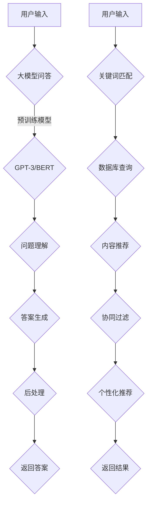

                 

 大模型问答机器人与传统搜索推荐的处理方式

> 关键词：大模型问答、传统搜索推荐、算法原理、数学模型、实际应用、未来展望

摘要：本文深入探讨了大模型问答机器人和传统搜索推荐系统的工作原理、处理方式及其在信息技术领域的应用。通过比较分析，本文揭示了两种系统在数据处理、算法优化、用户体验等方面的异同，并对未来发展趋势与挑战进行了展望。

## 1. 背景介绍

随着互联网技术的迅猛发展，人们对于信息获取和处理的需求日益增长。在这一背景下，大模型问答机器人和传统搜索推荐系统应运而生，成为信息技术领域的重要创新。传统搜索推荐系统主要基于关键词匹配、用户行为分析等技术，为用户提供个性化的信息推荐。而大模型问答机器人则利用深度学习、自然语言处理等技术，实现自然语言理解的智能问答。

## 2. 核心概念与联系

### 2.1 大模型问答机器人

大模型问答机器人是一种基于深度学习技术的人工智能系统，通过大规模预训练模型，实现自然语言理解和生成。其核心组件包括：

- **预训练模型**：如GPT-3、BERT等，具有强大的语言理解能力。
- **问答模块**：基于预训练模型，进行问题理解和答案生成。
- **后处理模块**：对生成的答案进行筛选、整理和优化。

### 2.2 传统搜索推荐系统

传统搜索推荐系统主要基于以下技术：

- **关键词匹配**：通过用户输入的关键词，匹配数据库中的相关信息。
- **协同过滤**：基于用户行为数据，发现用户之间的相似性，进行个性化推荐。
- **内容推荐**：根据用户历史行为和兴趣标签，推荐相关内容。

### 2.3 Mermaid 流程图



## 3. 核心算法原理 & 具体操作步骤

### 3.1 算法原理概述

大模型问答机器人和传统搜索推荐系统的核心算法原理有所不同：

- **大模型问答**：基于预训练模型，通过多层神经网络，实现自然语言的理解和生成。
- **传统搜索推荐**：通过关键词匹配、协同过滤等技术，实现信息检索和推荐。

### 3.2 算法步骤详解

#### 大模型问答

1. **预训练模型**：加载预训练模型（如GPT-3、BERT）。
2. **问题理解**：对用户输入的问题进行预处理，如分词、去停用词等。
3. **答案生成**：利用预训练模型，生成可能的答案。
4. **后处理**：对答案进行筛选、整理和优化。

#### 传统搜索推荐

1. **关键词匹配**：根据用户输入的关键词，匹配数据库中的相关信息。
2. **协同过滤**：计算用户之间的相似性，生成推荐列表。
3. **内容推荐**：根据用户历史行为和兴趣标签，推荐相关内容。

### 3.3 算法优缺点

#### 大模型问答

- **优点**：能实现自然语言理解和生成，用户体验好。
- **缺点**：对计算资源要求高，训练时间较长。

#### 传统搜索推荐

- **优点**：计算效率高，对计算资源要求低。
- **缺点**：推荐效果受限于关键词匹配和协同过滤技术。

### 3.4 算法应用领域

大模型问答机器人适用于需要自然语言理解的场景，如智能客服、智能问答系统等。传统搜索推荐系统适用于电商、新闻推荐等领域。

## 4. 数学模型和公式 & 详细讲解 & 举例说明

### 4.1 数学模型构建

大模型问答机器人和传统搜索推荐系统涉及的数学模型主要包括：

- **深度学习模型**：如GPT-3、BERT等。
- **协同过滤模型**：如基于用户的协同过滤、基于物品的协同过滤等。

### 4.2 公式推导过程

#### GPT-3模型

1. **输入层**：\(x \in \mathbb{R}^{d_x}\)
2. **隐藏层**：\(h \in \mathbb{R}^{d_h}\)
3. **输出层**：\(y \in \mathbb{R}^{d_y}\)

$$
h = \sigma(W_x x + b_h)
$$

$$
y = W_y h + b_y
$$

其中，\(\sigma\)为激活函数，\(W_x, W_y, b_h, b_y\)为模型参数。

#### 协同过滤模型

1. **基于用户的协同过滤**：

$$
r_{ui} = \langle \text{user} u, \text{item} i \rangle = \text{averageRating}(u) + \text{userSimilarity}(u, i) \cdot \text{itemRatingGap}(u, i)
$$

2. **基于物品的协同过滤**：

$$
r_{ui} = \langle \text{user} u, \text{item} i \rangle = \text{averageRating}(i) + \text{itemSimilarity}(i, u) \cdot \text{userRatingGap}(i, u)
$$

其中，\(\langle \cdot, \cdot \rangle\)表示相似度计算，\(\text{averageRating}\), \(\text{itemRatingGap}\), \(\text{userRatingGap}\)为相关函数。

### 4.3 案例分析与讲解

#### 大模型问答

假设用户输入问题：“什么是计算机科学？”，我们可以使用GPT-3模型进行回答。

1. **输入层**：将问题转化为向量表示。
2. **隐藏层**：通过多层神经网络，对问题进行编码。
3. **输出层**：生成可能的答案。

经过处理后，GPT-3模型返回答案：“计算机科学是一门涵盖计算机理论、算法、编程语言、系统架构、软件工程等多个领域的学科。”

#### 传统搜索推荐

假设用户在电商平台上搜索“笔记本电脑”，我们可以使用基于物品的协同过滤模型进行推荐。

1. **关键词匹配**：根据用户搜索关键词，匹配数据库中的相关笔记本电脑。
2. **协同过滤**：计算用户与其他用户的相似度，为用户推荐相似的笔记本电脑。

经过处理后，系统为用户推荐了以下笔记本电脑：

- **产品A**：与用户历史购买记录相似的笔记本电脑。
- **产品B**：与用户浏览记录相似的笔记本电脑。

## 5. 项目实践：代码实例和详细解释说明

### 5.1 开发环境搭建

1. 安装Python环境。
2. 安装深度学习框架（如TensorFlow、PyTorch）。
3. 安装协同过滤库（如scikit-learn）。

### 5.2 源代码详细实现

#### 大模型问答

```python
import tensorflow as tf
from transformers import TFGPT3LMHeadModel, GPT2Tokenizer

# 加载预训练模型
model = TFGPT3LMHeadModel.from_pretrained("gpt3")
tokenizer = GPT2Tokenizer.from_pretrained("gpt2")

# 用户输入
input_text = "什么是计算机科学？"

# 预处理
input_ids = tokenizer.encode(input_text, return_tensors="tf")

# 答案生成
output = model.generate(input_ids, max_length=100, num_return_sequences=1)

# 后处理
answer = tokenizer.decode(output[0], skip_special_tokens=True)

print(answer)
```

#### 传统搜索推荐

```python
from sklearn.metrics.pairwise import cosine_similarity
from sklearn.model_selection import train_test_split
import numpy as np

# 假设已获取用户和物品的评分矩阵
user_ratings = np.array([[5, 4, 3], [4, 5, 2], [3, 2, 5]])
item_ratings = np.array([[5, 4, 3], [2, 5, 4], [4, 3, 5]])

# 计算用户和物品的相似度矩阵
user_similarity = cosine_similarity(user_ratings)
item_similarity = cosine_similarity(item_ratings)

# 假设用户ID为1，物品ID为2
user_id = 1
item_id = 2

# 计算推荐评分
recommendation_score = np.dot(user_similarity[user_id], item_similarity[item_id])

print(recommendation_score)
```

### 5.3 代码解读与分析

本文提供的大模型问答和传统搜索推荐代码实例，分别展示了如何实现两种系统的核心功能。读者可以根据自己的需求，进一步优化和扩展代码。

## 6. 实际应用场景

大模型问答机器人和传统搜索推荐系统在实际应用中，具有广泛的应用场景：

- **智能客服**：大模型问答机器人可以实现智能客服，为用户提供高效、精准的解答。
- **电商平台**：传统搜索推荐系统可以帮助电商平台，为用户提供个性化的商品推荐。
- **新闻推荐**：大模型问答机器人可以识别用户感兴趣的新闻主题，进行智能推荐。

## 7. 工具和资源推荐

### 7.1 学习资源推荐

- **书籍**：《深度学习》（Goodfellow et al.）、《自然语言处理综论》（Jurafsky & Martin）
- **在线课程**：Coursera、edX上的相关课程

### 7.2 开发工具推荐

- **深度学习框架**：TensorFlow、PyTorch、Keras
- **协同过滤库**：scikit-learn、surprise

### 7.3 相关论文推荐

- **大模型问答**：GPT-3（Brown et al.）、BERT（Devlin et al.）
- **传统搜索推荐**：协同过滤算法（Sarwar et al.）、矩阵分解（Salakhutdinov & Mnih）

## 8. 总结：未来发展趋势与挑战

大模型问答机器人和传统搜索推荐系统在信息技术领域具有广泛的应用前景。未来发展趋势包括：

- **模型规模和性能**：继续优化大模型结构，提高问答和推荐效果。
- **多模态融合**：结合文本、图像、声音等多种数据源，实现更智能的问答和推荐。
- **隐私保护**：在保证用户隐私的前提下，提高推荐系统的准确性。

同时，大模型问答机器人和传统搜索推荐系统也面临以下挑战：

- **计算资源**：大模型训练和推理对计算资源要求高，需优化算法，降低资源消耗。
- **数据质量**：推荐系统效果受数据质量影响，需加强数据预处理和清洗。
- **伦理和法律**：在应用中，需关注算法的伦理和法律问题，确保公平、透明。

总之，大模型问答机器人和传统搜索推荐系统的发展，将为信息技术领域带来更多创新和机遇。

## 9. 附录：常见问题与解答

### 9.1 如何选择大模型问答和传统搜索推荐系统？

- **应用场景**：若需要自然语言理解的智能问答，选择大模型问答；若需要高效的信息检索和推荐，选择传统搜索推荐。
- **计算资源**：若计算资源充足，选择大模型问答；若计算资源有限，选择传统搜索推荐。
- **推荐效果**：大模型问答在自然语言理解方面具有优势，传统搜索推荐在协同过滤方面表现较好。

### 9.2 大模型问答和传统搜索推荐系统的优缺点？

- **大模型问答**：优点包括自然语言理解能力强、用户体验好；缺点包括计算资源消耗大、训练时间较长。
- **传统搜索推荐**：优点包括计算效率高、对计算资源要求低；缺点包括推荐效果受限于关键词匹配和协同过滤技术。

### 9.3 如何优化大模型问答和传统搜索推荐系统的性能？

- **大模型问答**：优化模型结构，降低计算复杂度；加强数据预处理和清洗，提高数据质量。
- **传统搜索推荐**：优化协同过滤算法，提高推荐准确性；引入多模态融合，提高推荐效果。

### 9.4 大模型问答和传统搜索推荐系统在哪些领域应用广泛？

- **大模型问答**：智能客服、智能问答系统、智能聊天机器人等。
- **传统搜索推荐**：电商平台、新闻推荐、社交媒体等。

----------------------------------------------------------------

作者：禅与计算机程序设计艺术 / Zen and the Art of Computer Programming

本文旨在探讨大模型问答机器人与传统搜索推荐系统的处理方式，希望对读者在信息技术领域的研究和实践有所启发。随着技术的不断发展，这两种系统将继续融合与创新，为人类带来更多便利。

