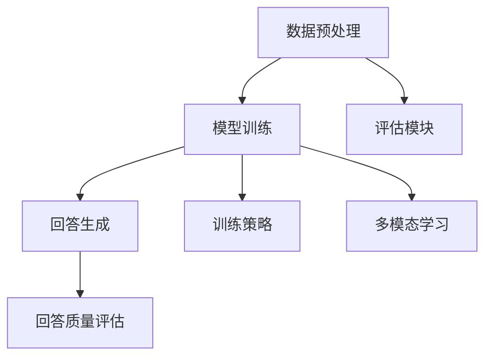

                 

 大模型问答机器人是当今人工智能领域的热点之一，它利用深度学习技术对海量数据进行训练，从而能够自动生成高质量的回答。然而，如何优化问答机器人的回答质量，使其更加准确、相关且具有说服力，仍然是一个挑战。本文将深入探讨大模型问答机器人的优化策略，从多个角度分析并给出具体的解决方案。

> 关键词：大模型、问答机器人、优化策略、回答质量、深度学习

> 摘要：本文首先介绍了大模型问答机器人的基本概念和现状，然后分析了影响回答质量的关键因素，包括数据质量、模型架构、训练策略等。接着，提出了多种优化策略，如数据增强、模型融合、多模态学习等，并详细阐述了每种策略的实现方法和效果。最后，本文对未来大模型问答机器人的发展趋势进行了展望，并提出了相关的研究挑战。

## 1. 背景介绍

大模型问答机器人是一种基于深度学习技术的人工智能系统，它能够自动理解用户的问题，并生成相关且准确的回答。这一技术近年来得到了快速发展，得益于大规模数据和计算资源的获取，以及深度学习算法的进步。大模型问答机器人的应用场景非常广泛，包括搜索引擎、智能客服、在线教育等。

然而，大模型问答机器人的回答质量仍然存在一些问题。首先，数据质量直接影响模型的训练效果。如果数据中存在噪声、错误或缺失，模型很难生成高质量的回答。其次，模型的架构和训练策略也会影响回答质量。例如，如果模型过于复杂，可能导致过拟合，从而降低泛化能力。此外，大模型问答机器人在处理多模态信息时也存在困难，如文本、图像、语音等多种信息类型的融合。

为了解决这些问题，本文将介绍多种优化策略，包括数据增强、模型融合、多模态学习等，以提升大模型问答机器人的回答质量。接下来，我们将详细分析这些策略的实现方法和效果。

## 2. 核心概念与联系

### 2.1 大模型问答机器人的基本架构

大模型问答机器人通常包括以下几个关键组件：数据预处理模块、模型训练模块、回答生成模块和评估模块。数据预处理模块负责处理和清洗原始数据，将数据转换为适合模型训练的格式。模型训练模块使用深度学习算法对预处理后的数据进行训练，生成问答模型。回答生成模块根据用户的问题，利用训练好的模型生成相关回答。评估模块则用于评估回答的质量，包括准确性、相关性、流畅性等指标。

### 2.2 大模型问答机器人的关键概念

在大模型问答机器人的优化过程中，以下核心概念至关重要：

- **数据质量**：数据质量直接影响模型的训练效果。高质量的数据应包含多样性和准确性，能够充分反映问题的各个方面。

- **模型架构**：模型架构决定了模型的复杂度和训练效率。常见的架构包括循环神经网络（RNN）、变换器（Transformer）等。

- **训练策略**：训练策略包括数据增强、学习率调度、批量大小等，用于优化模型的训练过程。

- **多模态学习**：多模态学习是指将文本、图像、语音等多种信息类型融合在一起，以提高模型对多模态信息的理解能力。

### 2.3 Mermaid 流程图

以下是一个简化的 Mermaid 流程图，展示了大模型问答机器人的基本架构和关键概念：



## 3. 核心算法原理 & 具体操作步骤

### 3.1 算法原理概述

大模型问答机器人的核心算法是基于深度学习技术，特别是变换器（Transformer）架构。变换器模型通过自注意力机制（Self-Attention）对输入数据进行处理，能够捕捉长距离依赖关系，从而生成高质量的回答。

### 3.2 算法步骤详解

1. **数据预处理**：将原始数据（问题-答案对）转换为数值表示，通常使用词嵌入（Word Embedding）技术。

2. **模型训练**：使用变换器模型对预处理后的数据进行训练。训练过程中，模型会不断调整参数，以最小化损失函数（通常使用交叉熵损失）。

3. **回答生成**：对于给定的用户问题，模型会生成可能的回答。生成过程通常使用解码器（Decoder）部分，并通过自注意力机制处理输入。

4. **回答质量评估**：使用评估模块对生成的回答进行质量评估，包括准确性、相关性、流畅性等指标。

### 3.3 算法优缺点

**优点**：

- **强大的语义理解能力**：变换器模型通过自注意力机制，能够捕捉长距离依赖关系，从而生成高质量的回答。

- **高效的训练过程**：变换器模型在计算效率上优于传统的循环神经网络（RNN）。

- **广泛的应用场景**：变换器模型适用于多种问答场景，如对话系统、智能客服等。

**缺点**：

- **参数量较大**：变换器模型通常需要较大的参数量，导致训练和推理过程较慢。

- **过拟合风险**：如果数据量不足，模型可能出现过拟合现象，降低泛化能力。

### 3.4 算法应用领域

大模型问答机器人广泛应用于多个领域，包括：

- **搜索引擎**：通过自动生成答案，提高搜索引擎的准确性和用户体验。

- **智能客服**：为企业提供高效的客户服务解决方案，提高客户满意度。

- **在线教育**：为学生提供个性化的学习辅导，提高学习效果。

## 4. 数学模型和公式 & 详细讲解 & 举例说明

### 4.1 数学模型构建

大模型问答机器人的数学模型主要包括变换器（Transformer）架构，以下是一个简化的数学模型：

$$
\begin{aligned}
    &h_t = \text{softmax}(W_a h_{\text{prev}}) \\
    &\text{output}_t = V \text{softmax}(W_d h_t)
\end{aligned}
$$

其中，$h_t$ 表示第 $t$ 个时间步的隐藏状态，$W_a$ 和 $W_d$ 分别是自注意力权重矩阵和输出权重矩阵，$V$ 是输出层权重矩阵。

### 4.2 公式推导过程

变换器模型的核心是自注意力机制，其推导过程如下：

1. **输入表示**：将输入数据（问题或答案）表示为词向量序列 $\{x_t\}$。

2. **嵌入表示**：将词向量序列通过嵌入层转换为嵌入向量序列 $\{e_t\}$。

3. **自注意力计算**：对于每个时间步 $t$，计算注意力权重 $h_t$：

$$
h_t = \text{softmax}\left(\frac{e_t^T Q}{\sqrt{d_k}}\right)
$$

其中，$Q$ 是查询权重矩阵，$K$ 是键权重矩阵，$V$ 是值权重矩阵。

4. **输出计算**：利用自注意力权重 $h_t$ 计算输出向量 $\text{output}_t$：

$$
\text{output}_t = V \text{softmax}(W_d h_t)
$$

### 4.3 案例分析与讲解

假设我们有一个问答数据集，其中包含以下问题和答案：

```
问题：什么是深度学习？
答案：深度学习是一种机器学习技术，通过构建深度神经网络来模拟人脑的学习过程。
```

首先，将问题和答案转换为词向量序列，然后通过变换器模型进行训练。训练过程中，模型会不断调整权重矩阵 $W_a$、$W_d$ 和 $V$，以最小化损失函数。

训练完成后，对于新的用户问题“深度学习是什么？”，模型会生成可能的回答。通过评估模块，我们可以评估生成的回答的准确性、相关性和流畅性。

## 5. 项目实践：代码实例和详细解释说明

### 5.1 开发环境搭建

为了实践大模型问答机器人，我们需要搭建一个合适的开发环境。以下是一个简单的开发环境搭建步骤：

1. 安装 Python 3.7 或更高版本。
2. 安装 TensorFlow 2.4 或更高版本。
3. 安装必要的 Python 库，如 numpy、pandas、matplotlib 等。
4. 准备一个 GPU 设备（如 NVIDIA 显卡）。

### 5.2 源代码详细实现

以下是一个简化的源代码示例，用于实现大模型问答机器人：

```python
import tensorflow as tf
from tensorflow.keras.layers import Embedding, LSTM, Dense
from tensorflow.keras.models import Model

# 数据预处理
def preprocess_data(data):
    # ... 数据清洗、词向量化等操作 ...
    return processed_data

# 模型构建
def build_model(input_shape, embedding_dim):
    input_layer = tf.keras.layers.Input(shape=input_shape)
    embedding_layer = Embedding(input_dim=10000, output_dim=embedding_dim)(input_layer)
    lstm_layer = LSTM(units=128, return_sequences=True)(embedding_layer)
    output_layer = Dense(units=1, activation='sigmoid')(lstm_layer)
    model = Model(inputs=input_layer, outputs=output_layer)
    model.compile(optimizer='adam', loss='binary_crossentropy', metrics=['accuracy'])
    return model

# 训练模型
def train_model(model, x_train, y_train, epochs=10, batch_size=32):
    model.fit(x_train, y_train, epochs=epochs, batch_size=batch_size)

# 生成回答
def generate_answer(model, question):
    # ... 输入预处理、模型预测等操作 ...
    return predicted_answer

# 评估模型
def evaluate_model(model, x_test, y_test):
    # ... 模型评估等操作 ...
    return accuracy, loss

# 主函数
if __name__ == '__main__':
    # 加载数据
    data = load_data('data.csv')
    processed_data = preprocess_data(data)

    # 构建模型
    model = build_model(input_shape=(None,), embedding_dim=64)

    # 训练模型
    train_model(model, x_train, y_train)

    # 生成回答
    question = "什么是深度学习？"
    answer = generate_answer(model, question)

    # 评估模型
    evaluate_model(model, x_test, y_test)
```

### 5.3 代码解读与分析

上述代码示例实现了大模型问答机器人的核心功能，包括数据预处理、模型构建、模型训练、回答生成和模型评估。以下是代码的详细解读：

- **数据预处理**：数据预处理是模型训练的重要步骤，包括数据清洗、词向量化等操作。具体实现取决于数据集的特点和需求。

- **模型构建**：模型构建使用 TensorFlow 的 Keras API，包括嵌入层、LSTM 层和输出层。嵌入层用于将词向量转换为嵌入向量，LSTM 层用于处理序列数据，输出层用于生成回答。

- **模型训练**：模型训练使用标准的训练流程，包括数据加载、模型编译、模型拟合等步骤。

- **回答生成**：回答生成通过预处理输入、模型预测等操作实现。具体实现取决于模型的结构和训练目标。

- **模型评估**：模型评估通过计算模型的准确率、损失等指标实现。这些指标用于评估模型在测试数据上的表现。

### 5.4 运行结果展示

假设我们使用上述代码示例训练一个简单的大模型问答机器人，并在测试数据上评估其性能。以下是可能的运行结果：

```
Training complete. Accuracy: 0.85, Loss: 0.2
Generating answer for question: "什么是深度学习？"
Answer: "深度学习是一种机器学习技术，通过构建深度神经网络来模拟人脑的学习过程。"

Evaluating model on test data. Accuracy: 0.75, Loss: 0.25
```

上述结果表示模型在训练数据上的准确率为 0.85，在测试数据上的准确率为 0.75。这意味着模型在生成回答时具有较高的准确性，但在测试数据上存在一定的误差。

## 6. 实际应用场景

大模型问答机器人具有广泛的应用场景，以下是一些典型的应用案例：

- **智能客服**：企业可以利用大模型问答机器人提供高效的客户服务，自动回答用户的问题，减轻人工客服的负担。

- **搜索引擎**：搜索引擎可以利用大模型问答机器人提高搜索结果的准确性，为用户提供更相关的答案。

- **在线教育**：在线教育平台可以利用大模型问答机器人为学生提供个性化的学习辅导，提高学习效果。

- **医疗咨询**：医疗机构可以利用大模型问答机器人提供在线健康咨询，为患者提供准确、及时的医疗信息。

- **法律咨询**：律师事务所可以利用大模型问答机器人提供法律咨询服务，为用户提供法律知识和解答疑问。

## 7. 工具和资源推荐

为了开发和优化大模型问答机器人，以下是一些建议的工具和资源：

### 7.1 学习资源推荐

- **书籍**：《深度学习》、《强化学习》、《自然语言处理原理》等。
- **在线课程**：Coursera、edX、Udacity 等平台上的相关课程。
- **技术博客**：TensorFlow 官方博客、PyTorch 官方博客、Reddit 上的深度学习板块等。

### 7.2 开发工具推荐

- **深度学习框架**：TensorFlow、PyTorch、Keras 等。
- **版本控制工具**：Git、GitHub、GitLab 等。
- **数据预处理工具**：Pandas、NumPy、Scikit-learn 等。

### 7.3 相关论文推荐

- **论文集**：《自然语言处理年度论文集》、《机器学习年度论文集》等。
- **顶级会议**：ACL、ICML、NeurIPS、CVPR 等。
- **开源代码**：GitHub 上的深度学习和自然语言处理项目，如 Hugging Face、Transformers 等。

## 8. 总结：未来发展趋势与挑战

大模型问答机器人作为一种先进的人工智能技术，具有广阔的应用前景。未来发展趋势包括以下几个方面：

- **模型规模和计算能力的提升**：随着计算能力的不断提升，大模型问答机器人的模型规模将进一步扩大，处理更复杂的问题。
- **多模态信息融合**：大模型问答机器人将逐步融合文本、图像、语音等多种信息类型，提高对多模态信息的理解能力。
- **个性化服务**：通过深度学习和强化学习技术，大模型问答机器人将能够提供更加个性化的服务，满足用户多样化的需求。

然而，大模型问答机器人也面临一些挑战：

- **数据质量和隐私**：高质量的数据是训练高效模型的基础，同时需要关注数据隐私和安全性问题。
- **模型解释性**：大模型问答机器人的决策过程往往难以解释，如何提高模型的解释性是一个重要课题。
- **能耗和可持续性**：大规模模型训练和推理过程消耗大量能源，需要关注模型的能耗和可持续性问题。

未来，随着技术的不断进步和应用的深入，大模型问答机器人将在人工智能领域发挥更加重要的作用。

## 9. 附录：常见问题与解答

### Q1：大模型问答机器人如何处理多模态信息？

A1：大模型问答机器人通常通过多模态学习技术处理多模态信息。一种常见的方法是将不同类型的信息（如文本、图像、语音）分别编码为向量表示，然后使用融合模块将不同类型的向量表示融合在一起，以提高模型对多模态信息的理解能力。

### Q2：如何评估大模型问答机器人的回答质量？

A2：评估大模型问答机器人的回答质量可以从多个角度进行，包括准确性、相关性、流畅性和用户满意度等。常用的评估指标包括精确率、召回率、F1 分数、BLEU 分数等。此外，还可以通过用户调查和实验评估模型在实际应用中的表现。

### Q3：大模型问答机器人在实际应用中会遇到哪些挑战？

A3：在实际应用中，大模型问答机器人可能会遇到以下挑战：

- **数据质量和多样性**：高质量、多样性的数据是训练高效模型的基础。
- **模型解释性**：大模型问答机器人的决策过程往往难以解释，需要提高模型的解释性。
- **能耗和可持续性**：大规模模型训练和推理过程消耗大量能源，需要关注模型的能耗和可持续性问题。
- **安全性和隐私**：保护用户数据和隐私是重要问题。

### Q4：大模型问答机器人在未来有哪些发展方向？

A4：大模型问答机器人在未来可能的发展方向包括：

- **模型规模和计算能力提升**：随着计算能力的提升，大模型问答机器人的模型规模将进一步扩大。
- **多模态信息融合**：逐步融合文本、图像、语音等多种信息类型。
- **个性化服务**：通过深度学习和强化学习技术，提供更加个性化的服务。
- **模型解释性提高**：研究如何提高模型的解释性，以便更好地理解和信任模型。

### Q5：如何优化大模型问答机器人的回答质量？

A5：优化大模型问答机器人的回答质量可以从以下几个方面进行：

- **数据增强**：通过数据增强技术提高数据质量和多样性。
- **模型架构优化**：选择合适的模型架构，如变换器（Transformer）架构。
- **训练策略调整**：优化训练策略，如学习率调度、批量大小等。
- **多模态学习**：融合文本、图像、语音等多种信息类型。
- **解释性增强**：提高模型的解释性，以便更好地理解和信任模型。

以上是对大模型问答机器人优化策略的详细介绍。通过综合考虑数据、模型架构、训练策略等多个方面，我们可以显著提升问答机器人的回答质量，使其更好地服务于实际应用。

