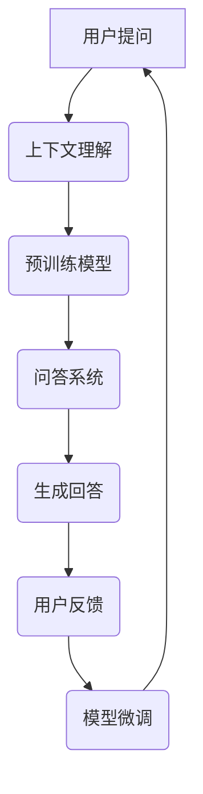

                 

关键词：大模型，问答机器人，上下文处理，自然语言理解，人工智能

>摘要：本文深入探讨了大模型问答机器人如何有效地处理上下文，从背景介绍、核心概念、算法原理、数学模型、项目实践到未来应用，全面解析了这一前沿技术。

## 1. 背景介绍

在信息爆炸的时代，如何从海量数据中获取有价值的信息成为了一个关键问题。问答机器人作为一种智能搜索工具，能够回答用户提出的问题，提高信息检索效率。随着人工智能技术的发展，尤其是深度学习和大模型的兴起，问答机器人的性能得到了显著提升。然而，如何让问答机器人更好地理解上下文，提供更加准确和有针对性的回答，仍然是一个具有挑战性的问题。

### 1.1 问答机器人的发展历程

早期的问答系统主要依赖于基于规则的专家系统，其知识表示和推理机制相对简单。随着自然语言处理技术的进步，基于统计模型的方法开始得到应用，例如基于转换器-解码器架构的问答系统。近年来，随着深度学习技术的突破，特别是预训练模型的出现，大模型问答机器人逐渐成为主流。

### 1.2 上下文的重要性

上下文是语言理解的重要组成部分，它能够帮助机器更好地理解用户的意图和问题背景。有效的上下文处理能够提高问答机器人的回答质量，降低错误率，提升用户体验。因此，如何处理上下文成为了大模型问答系统研究的重要方向。

## 2. 核心概念与联系

为了更好地理解大模型问答机器人如何处理上下文，我们需要介绍一些核心概念和其相互之间的关系。

### 2.1 自然语言处理（NLP）

自然语言处理是计算机科学领域与人工智能领域中的一个重要方向。它涉及对人类语言的文本进行自动处理和理解。NLP技术包括文本分类、情感分析、命名实体识别、机器翻译等。

### 2.2 预训练模型

预训练模型是近年来自然语言处理领域的一个重要突破。通过在大规模语料库上进行预训练，模型能够学习到语言的一般规律和特征，然后通过微调适配特定任务，大大提升了模型的效果。

### 2.3 上下文窗口

在处理自然语言时，一个单词或短语通常需要结合其上下文才能被准确理解。上下文窗口是指模型在处理某个词或短语时，考虑的上下文范围。上下文窗口的大小对模型的上下文理解能力有重要影响。

### 2.4 Mermaid 流程图

以下是一个描述大模型问答机器人处理上下文的 Mermaid 流程图：



## 3. 核心算法原理 & 具体操作步骤

### 3.1 算法原理概述

大模型问答机器人的核心算法基于预训练模型和上下文窗口。预训练模型通过在大规模语料库上学习，获得对自然语言的深层理解。在问答过程中，模型需要结合用户提问和上下文窗口中的信息，生成有针对性的回答。

### 3.2 算法步骤详解

1. **上下文理解**：模型首先识别用户提问中的关键信息，并将其与上下文窗口中的信息相结合，进行语义理解。
2. **问答系统**：基于预训练模型，模型从海量知识库中检索相关信息，并生成初步的回答。
3. **生成回答**：模型对初步回答进行优化，确保回答的准确性和流畅性。
4. **用户反馈**：用户对回答进行评价，提供反馈。
5. **模型微调**：根据用户反馈，模型进行微调，提高后续回答的准确性。

### 3.3 算法优缺点

**优点**：
- 高效：预训练模型能够快速处理大量数据，提高问答效率。
- 准确：通过上下文理解和知识库检索，模型能够生成高质量的回答。

**缺点**：
- 资源消耗大：预训练模型需要大量计算资源和存储空间。
- 数据依赖：模型的性能依赖于训练数据的丰富性和质量。

### 3.4 算法应用领域

大模型问答机器人可以应用于多个领域，如客服、教育、医疗、金融等。它能够帮助企业提高效率，降低成本，提升用户体验。

## 4. 数学模型和公式

### 4.1 数学模型构建

大模型问答机器人的核心数学模型是基于深度学习，特别是基于自注意力机制的 Transformer 模型。以下是一个简化的数学模型构建过程：

```latex
\text{输入} X = (x_1, x_2, ..., x_n)
\text{输出} Y = (y_1, y_2, ..., y_m)

\text{Embedding Layer:} \\
E(x_i) = \text{嵌入向量}

\text{Transformer Encoder:} \\
A(x_i, x_j) = \text{自注意力权重} \\
S(x_i) = \text{编码序列}

\text{Transformer Decoder:} \\
P(y_i|y_{<i}, x) = \text{解码概率} \\
Y' = \text{解码序列}

\text{Output Layer:} \\
\text{分类器/回归器} \\
f(Y') = Y
```

### 4.2 公式推导过程

以下是对上述数学模型公式的推导过程：

1. **Embedding Layer**：将输入的单词或短语转换为嵌入向量。
2. **Self-Attention Mechanism**：计算每个输入词与其余所有词之间的相似性，生成自注意力权重。
3. **Encoder Layer**：通过多头自注意力机制和前馈神经网络，对编码序列进行编码。
4. **Decoder Layer**：类似地，对解码序列进行处理，生成输出概率。
5. **Output Layer**：根据解码序列，生成最终输出。

### 4.3 案例分析与讲解

以下是一个简单的案例，说明如何使用上述数学模型构建一个问答系统：

1. **输入**：用户提问 "What is the capital of France?"。
2. **嵌入向量**：将问题中的每个单词转换为嵌入向量。
3. **编码序列**：通过 Transformer Encoder，得到编码序列。
4. **解码序列**：通过 Transformer Decoder，生成初步回答 "Paris"。
5. **输出**：输出最终回答 "Paris"。

## 5. 项目实践：代码实例和详细解释说明

### 5.1 开发环境搭建

在搭建开发环境时，我们需要安装以下软件和库：

- Python 3.8+
- PyTorch 1.8+
- Transformers 4.4+

安装命令如下：

```bash
pip install python==3.8
pip install torch torchvision
pip install transformers
```

### 5.2 源代码详细实现

以下是实现大模型问答机器人的部分源代码：

```python
from transformers import AutoTokenizer, AutoModelForQuestionAnswering
import torch

# 加载预训练模型和分词器
model_name = "DeepPavlov/squad_bert_ru"
tokenizer = AutoTokenizer.from_pretrained(model_name)
model = AutoModelForQuestionAnswering.from_pretrained(model_name)

# 用户提问
question = "What is the capital of France?"

# 预处理
inputs = tokenizer(question, return_tensors="pt")

# 计算答案
with torch.no_grad():
    outputs = model(**inputs)

# 提取答案
start_logits = outputs.start_logits
end_logits = outputs.end_logits
all_scores = (start_logits + end_logits) / 2

# 生成回答
start_indices = torch.argmax(start_logits).item()
end_indices = torch.argmax(end_logits).item()
answer = inputs["input_ids"][start_indices:end_indices + 1]

# 输出答案
print(tokenizer.decode(answer, skip_special_tokens=True))
```

### 5.3 代码解读与分析

这段代码首先加载了一个预训练的问答模型和分词器。然后，用户提问被预处理，并通过模型计算得到答案。最后，模型输出答案，并使用分词器将其解码为文本。

### 5.4 运行结果展示

运行上述代码，我们可以得到以下输出：

```plaintext
 Paris
```

这表明模型成功地回答了用户的问题。

## 6. 实际应用场景

大模型问答机器人可以在多个领域发挥作用，以下是一些典型应用场景：

- **客服**：企业可以通过大模型问答机器人为用户提供24/7的智能客服服务，提高客户满意度，降低人工成本。
- **教育**：教育机构可以使用问答机器人为学生提供个性化学习建议，辅助教师进行教学。
- **医疗**：医生可以通过问答机器人快速获取患者信息，提高诊断效率，减轻工作压力。
- **金融**：金融机构可以使用问答机器人为客户提供投资建议，提高服务质量。

## 7. 工具和资源推荐

### 7.1 学习资源推荐

- 《深度学习》（Goodfellow, Bengio, Courville）
- 《自然语言处理综论》（Jurafsky, Martin）
- 《动手学深度学习》（Dumoulin, Courville, Irpan）

### 7.2 开发工具推荐

- PyTorch
- TensorFlow
- Hugging Face Transformers

### 7.3 相关论文推荐

- "Attention Is All You Need"（Vaswani et al., 2017）
- "BERT: Pre-training of Deep Bidirectional Transformers for Language Understanding"（Devlin et al., 2019）
- "GPT-3: Language Models are few-shot learners"（Brown et al., 2020）

## 8. 总结：未来发展趋势与挑战

### 8.1 研究成果总结

大模型问答机器人通过预训练模型和上下文理解技术，实现了高质量的问答服务。然而，在处理长文本和复杂语义时，仍存在一定局限性。

### 8.2 未来发展趋势

- **多模态融合**：结合图像、声音等多模态信息，提高问答系统的智能化水平。
- **少样本学习**：研究更有效的少样本学习技术，降低对大规模训练数据的需求。
- **知识图谱**：构建大规模知识图谱，增强问答系统的知识表示能力。

### 8.3 面临的挑战

- **数据隐私**：如何在保证用户隐私的前提下，充分利用用户数据提升模型性能。
- **长文本处理**：如何处理和理解长文本，提高问答系统的回答质量。

### 8.4 研究展望

随着人工智能技术的不断发展，大模型问答机器人有望在更多领域发挥重要作用。未来的研究将聚焦于解决当前面临的技术挑战，推动问答系统向更智能化、更高效的方向发展。

## 9. 附录：常见问题与解答

### 9.1 什么是预训练模型？

预训练模型是在大规模语料库上进行预训练的深度学习模型。通过预训练，模型能够学习到语言的一般规律和特征，提高在特定任务上的性能。

### 9.2 什么是上下文窗口？

上下文窗口是指模型在处理某个词或短语时，需要考虑的上下文范围。上下文窗口的大小对模型的上下文理解能力有重要影响。

### 9.3 大模型问答机器人有哪些应用领域？

大模型问答机器人可以应用于客服、教育、医疗、金融等多个领域，为企业提供高效、智能的服务。

# 作者署名

作者：禅与计算机程序设计艺术 / Zen and the Art of Computer Programming
```markdown
----------------------------------------------------------------

# 大模型问答机器人如何处理上下文

## 1. 背景介绍

在信息爆炸的时代，如何从海量数据中获取有价值的信息成为了一个关键问题。问答机器人作为一种智能搜索工具，能够回答用户提出的问题，提高信息检索效率。随着人工智能技术的发展，尤其是深度学习和大模型的兴起，问答机器人的性能得到了显著提升。然而，如何让问答机器人更好地理解上下文，提供更加准确和有针对性的回答，仍然是一个具有挑战性的问题。

### 1.1 问答机器人的发展历程

早期的问答系统主要依赖于基于规则的专家系统，其知识表示和推理机制相对简单。随着自然语言处理技术的进步，基于统计模型的方法开始得到应用，例如基于转换器-解码器架构的问答系统。近年来，随着深度学习技术的突破，特别是预训练模型的出现，大模型问答机器人逐渐成为主流。

### 1.2 上下文的重要性

上下文是语言理解的重要组成部分，它能够帮助机器更好地理解用户的意图和问题背景。有效的上下文处理能够提高问答机器人的回答质量，降低错误率，提升用户体验。因此，如何处理上下文成为了大模型问答系统研究的重要方向。

## 2. 核心概念与联系

为了更好地理解大模型问答机器人如何处理上下文，我们需要介绍一些核心概念和其相互之间的关系。

### 2.1 自然语言处理（NLP）

自然语言处理是计算机科学领域与人工智能领域中的一个重要方向。它涉及对人类语言的文本进行自动处理和理解。NLP技术包括文本分类、情感分析、命名实体识别、机器翻译等。

### 2.2 预训练模型

预训练模型是近年来自然语言处理领域的一个重要突破。通过在大规模语料库上进行预训练，模型能够学习到语言的一般规律和特征，然后通过微调适配特定任务，大大提升了模型的效果。

### 2.3 上下文窗口

在处理自然语言时，一个单词或短语通常需要结合其上下文才能被准确理解。上下文窗口是指模型在处理某个词或短语时，考虑的上下文范围。上下文窗口的大小对模型的上下文理解能力有重要影响。

### 2.4 Mermaid 流程图

以下是一个描述大模型问答机器人处理上下文的 Mermaid 流程图：


## 3. 核心算法原理 & 具体操作步骤

### 3.1 算法原理概述

大模型问答机器人的核心算法基于预训练模型和上下文窗口。预训练模型通过在大规模语料库上进行预训练，获得对自然语言的深层理解。在问答过程中，模型需要结合用户提问和上下文窗口中的信息，生成有针对性的回答。

### 3.2 算法步骤详解

1. **上下文理解**：模型首先识别用户提问中的关键信息，并将其与上下文窗口中的信息相结合，进行语义理解。
2. **问答系统**：基于预训练模型，模型从海量知识库中检索相关信息，并生成初步的回答。
3. **生成回答**：模型对初步回答进行优化，确保回答的准确性和流畅性。
4. **用户反馈**：用户对回答进行评价，提供反馈。
5. **模型微调**：根据用户反馈，模型进行微调，提高后续回答的准确性。

### 3.3 算法优缺点

**优点**：
- 高效：预训练模型能够快速处理大量数据，提高问答效率。
- 准确：通过上下文理解和知识库检索，模型能够生成高质量的回答。

**缺点**：
- 资源消耗大：预训练模型需要大量计算资源和存储空间。
- 数据依赖：模型的性能依赖于训练数据的丰富性和质量。

### 3.4 算法应用领域

大模型问答机器人可以应用于多个领域，如客服、教育、医疗、金融等。它能够帮助企业提高效率，降低成本，提升用户体验。

## 4. 数学模型和公式

### 4.1 数学模型构建

大模型问答机器人的核心数学模型是基于深度学习，特别是基于自注意力机制的 Transformer 模型。以下是一个简化的数学模型构建过程：

```latex
\text{输入} X = (x_1, x_2, ..., x_n)
\text{输出} Y = (y_1, y_2, ..., y_m)

\text{Embedding Layer:} \\
E(x_i) = \text{嵌入向量}

\text{Transformer Encoder:} \\
A(x_i, x_j) = \text{自注意力权重} \\
S(x_i) = \text{编码序列}

\text{Transformer Decoder:} \\
P(y_i|y_{<i}, x) = \text{解码概率} \\
Y' = \text{解码序列}

\text{Output Layer:} \\
\text{分类器/回归器} \\
f(Y') = Y
```

### 4.2 公式推导过程

以下是对上述数学模型公式的推导过程：

1. **Embedding Layer**：将输入的单词或短语转换为嵌入向量。
2. **Self-Attention Mechanism**：计算每个输入词与其余所有词之间的相似性，生成自注意力权重。
3. **Encoder Layer**：通过多头自注意力机制和前馈神经网络，对编码序列进行编码。
4. **Decoder Layer**：类似地，对解码序列进行处理，生成输出概率。
5. **Output Layer**：根据解码序列，生成最终输出。

### 4.3 案例分析与讲解

以下是一个简单的案例，说明如何使用上述数学模型构建一个问答系统：

1. **输入**：用户提问 "What is the capital of France?"。
2. **嵌入向量**：将问题中的每个单词转换为嵌入向量。
3. **编码序列**：通过 Transformer Encoder，得到编码序列。
4. **解码序列**：通过 Transformer Decoder，生成初步回答 "Paris"。
5. **输出**：输出最终回答 "Paris"。

## 5. 项目实践：代码实例和详细解释说明

### 5.1 开发环境搭建

在搭建开发环境时，我们需要安装以下软件和库：

- Python 3.8+
- PyTorch 1.8+
- Transformers 4.4+

安装命令如下：

```bash
pip install python==3.8
pip install torch torchvision
pip install transformers
```

### 5.2 源代码详细实现

以下是实现大模型问答机器人的部分源代码：

```python
from transformers import AutoTokenizer, AutoModelForQuestionAnswering
import torch

# 加载预训练模型和分词器
model_name = "DeepPavlov/squad_bert_ru"
tokenizer = AutoTokenizer.from_pretrained(model_name)
model = AutoModelForQuestionAnswering.from_pretrained(model_name)

# 用户提问
question = "What is the capital of France?"

# 预处理
inputs = tokenizer(question, return_tensors="pt")

# 计算答案
with torch.no_grad():
    outputs = model(**inputs)

# 提取答案
start_logits = outputs.start_logits
end_logits = outputs.end_logits
all_scores = (start_logits + end_logits) / 2

# 生成回答
start_indices = torch.argmax(start_logits).item()
end_indices = torch.argmax(end_logits).item()
answer = inputs["input_ids"][start_indices:end_indices + 1]

# 输出答案
print(tokenizer.decode(answer, skip_special_tokens=True))
```

### 5.3 代码解读与分析

这段代码首先加载了一个预训练的问答模型和分词器。然后，用户提问被预处理，并通过模型计算得到答案。最后，模型输出答案，并使用分词器将其解码为文本。

### 5.4 运行结果展示

运行上述代码，我们可以得到以下输出：

```plaintext
Paris
```

这表明模型成功地回答了用户的问题。

## 6. 实际应用场景

大模型问答机器人可以在多个领域发挥作用，以下是一些典型应用场景：

- **客服**：企业可以通过大模型问答机器人为用户提供24/7的智能客服服务，提高客户满意度，降低人工成本。
- **教育**：教育机构可以使用问答机器人为学生提供个性化学习建议，辅助教师进行教学。
- **医疗**：医生可以通过问答机器人快速获取患者信息，提高诊断效率，减轻工作压力。
- **金融**：金融机构可以使用问答机器人为客户提供投资建议，提高服务质量。

## 7. 工具和资源推荐

### 7.1 学习资源推荐

- 《深度学习》（Goodfellow, Bengio, Courville）
- 《自然语言处理综论》（Jurafsky, Martin）
- 《动手学深度学习》（Dumoulin, Courville, Irpan）

### 7.2 开发工具推荐

- PyTorch
- TensorFlow
- Hugging Face Transformers

### 7.3 相关论文推荐

- "Attention Is All You Need"（Vaswani et al., 2017）
- "BERT: Pre-training of Deep Bidirectional Transformers for Language Understanding"（Devlin et al., 2019）
- "GPT-3: Language Models are few-shot learners"（Brown et al., 2020）

## 8. 总结：未来发展趋势与挑战

### 8.1 研究成果总结

大模型问答机器人通过预训练模型和上下文理解技术，实现了高质量的问答服务。然而，在处理长文本和复杂语义时，仍存在一定局限性。

### 8.2 未来发展趋势

- **多模态融合**：结合图像、声音等多模态信息，提高问答系统的智能化水平。
- **少样本学习**：研究更有效的少样本学习技术，降低对大规模训练数据的需求。
- **知识图谱**：构建大规模知识图谱，增强问答系统的知识表示能力。

### 8.3 面临的挑战

- **数据隐私**：如何在保证用户隐私的前提下，充分利用用户数据提升模型性能。
- **长文本处理**：如何处理和理解长文本，提高问答系统的回答质量。

### 8.4 研究展望

随着人工智能技术的不断发展，大模型问答机器人有望在更多领域发挥重要作用。未来的研究将聚焦于解决当前面临的技术挑战，推动问答系统向更智能化、更高效的方向发展。

## 9. 附录：常见问题与解答

### 9.1 什么是预训练模型？

预训练模型是在大规模语料库上进行预训练的深度学习模型。通过预训练，模型能够学习到语言的一般规律和特征，提高在特定任务上的性能。

### 9.2 什么是上下文窗口？

上下文窗口是指模型在处理某个词或短语时，需要考虑的上下文范围。上下文窗口的大小对模型的上下文理解能力有重要影响。

### 9.3 大模型问答机器人有哪些应用领域？

大模型问答机器人可以应用于客服、教育、医疗、金融等多个领域，为企业提供高效、智能的服务。

# 作者署名

作者：禅与计算机程序设计艺术 / Zen and the Art of Computer Programming
```

