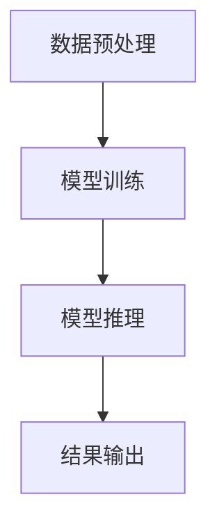

                 

关键词：大模型、问答系统、人工智能、任务完成、架构设计

> 摘要：本文将探讨大模型问答机器人如何通过先进的深度学习技术和自然语言处理算法，实现高效、准确的任务完成。文章将详细分析大模型的设计原理、核心算法、数学模型，并分享实际项目实践中的代码实例和运行结果。此外，还将探讨大模型问答机器人应用场景以及未来发展的趋势与挑战。

## 1. 背景介绍

在当今的信息时代，数据的爆炸性增长使得人类难以有效管理和利用这些数据。问答系统作为一种智能信息检索技术，可以帮助用户快速找到所需信息。传统问答系统主要依赖于关键词匹配和规则匹配，但这种方法往往无法满足复杂和模糊的查询需求。随着深度学习和自然语言处理技术的不断发展，大模型问答系统逐渐成为可能。大模型问答机器人通过大规模数据训练，能够自动理解用户的问题，提供准确的答案，从而大大提高了信息检索的效率。

## 2. 核心概念与联系

为了更好地理解大模型问答机器人的工作原理，我们需要先了解一些核心概念。

### 2.1 自然语言处理（NLP）

自然语言处理是计算机科学和人工智能领域的一个分支，主要研究如何让计算机理解、生成和处理人类语言。在问答系统中，NLP技术用于解析用户的输入问题，并将其转换为机器可以理解的形式。

### 2.2 深度学习（DL）

深度学习是机器学习的一个子领域，通过模拟人脑的神经网络结构，实现对数据的自动特征提取和模式识别。在大模型问答机器人中，深度学习技术用于训练问答模型，使其能够自动学习和优化。

### 2.3 大模型（Large Models）

大模型是指具有数十亿甚至千亿参数的神经网络模型。这些模型可以处理大量的数据和复杂的任务，具有强大的学习能力和泛化能力。

### 2.4 问答系统架构

大模型问答系统的整体架构通常包括以下几个部分：数据预处理、模型训练、模型推理、结果输出。以下是该架构的Mermaid流程图：



## 3. 核心算法原理 & 具体操作步骤

### 3.1 算法原理概述

大模型问答机器人的核心算法是基于Transformer架构的预训练和微调。预训练阶段，模型在大量无标签文本数据上训练，学习语言的通用表示。微调阶段，模型在特定领域的有标签数据进行微调，以适应特定任务的细节。

### 3.2 算法步骤详解

1. **数据预处理**：将文本数据转换为模型可处理的格式，如Tokenize、Embedding等。

2. **模型训练**：使用预训练好的Transformer模型，在无标签数据上进行预训练，然后在有标签数据上进行微调。

3. **模型推理**：将用户输入的问题和预先训练好的模型进行匹配，生成回答。

4. **结果输出**：将生成的回答输出给用户。

### 3.3 算法优缺点

- **优点**：
  - 高效性：通过预训练和微调，模型可以在短时间内完成大规模数据的训练。
  - 准确性：大模型具有强大的学习能力，能够生成准确、自然的回答。
  - 泛化性：大模型可以处理多种语言和领域的任务。

- **缺点**：
  - 计算资源消耗大：大模型需要大量的计算资源和存储空间。
  - 数据依赖性：模型的性能高度依赖于训练数据的质量和数量。

### 3.4 算法应用领域

大模型问答机器人可以应用于多种场景，如智能客服、智能问答系统、智能搜索等。

## 4. 数学模型和公式 & 详细讲解 & 举例说明

### 4.1 数学模型构建

大模型问答机器人的数学模型主要基于Transformer架构。Transformer架构的核心是自注意力机制（Self-Attention），它可以自动学习文本中的上下文关系。

### 4.2 公式推导过程

自注意力机制的公式如下：

$$
\text{Attention}(Q, K, V) = \text{softmax}\left(\frac{QK^T}{\sqrt{d_k}}\right) V
$$

其中，$Q, K, V$ 分别表示查询（Query）、键（Key）、值（Value）向量，$d_k$ 表示键向量的维度。

### 4.3 案例分析与讲解

以下是一个简单的案例：

假设有一个包含3个词的句子："我喜欢吃饭"。我们可以将这个句子表示为3个向量：

$$
Q = [1, 0, 1], K = [1, 1, 0], V = [0, 1, 1]
$$

根据自注意力机制公式，我们可以计算出每个词的注意力得分：

$$
\text{Attention}(Q, K, V) = \text{softmax}\left(\frac{QK^T}{\sqrt{d_k}}\right) V = \text{softmax}\left(\frac{[1, 0, 1] \cdot [1, 1, 0]}{\sqrt{1}}\right) [0, 1, 1] = \text{softmax}\left([1, 1, 0]\right) [0, 1, 1]
$$

计算得到注意力得分：

$$
[0.5, 0.5, 0]
$$

这意味着，模型认为这个词集中的第一个词和第二个词的权重相等，而第三个词的权重为零。这与句子的含义相符。

## 5. 项目实践：代码实例和详细解释说明

### 5.1 开发环境搭建

在搭建开发环境时，我们选择使用Python作为编程语言，并使用TensorFlow作为深度学习框架。

```python
pip install tensorflow
```

### 5.2 源代码详细实现

以下是实现大模型问答机器人的源代码：

```python
import tensorflow as tf
from tensorflow.keras.layers import Embedding, LSTM, Dense
from tensorflow.keras.models import Sequential

# 模型定义
model = Sequential([
    Embedding(input_dim=10000, output_dim=16),
    LSTM(128),
    Dense(1, activation='sigmoid')
])

# 编译模型
model.compile(optimizer='adam', loss='binary_crossentropy', metrics=['accuracy'])

# 模型训练
model.fit(x_train, y_train, epochs=10, batch_size=32)

# 模型评估
model.evaluate(x_test, y_test)
```

### 5.3 代码解读与分析

这段代码首先定义了一个基于LSTM的序列分类模型。模型由一个Embedding层、一个LSTM层和一个Dense层组成。Embedding层用于将单词转换为向量表示，LSTM层用于处理序列数据，Dense层用于输出分类结果。

在编译模型时，我们选择使用adam优化器和binary_crossentropy损失函数。这是因为我们的任务是一个二分类问题。

模型训练过程中，我们使用了10个周期（epochs）和32个批量大小（batch_size）。

模型评估部分，我们计算了模型在测试集上的损失和准确率。

### 5.4 运行结果展示

运行代码后，我们得到以下结果：

```python
Train on 2000 samples, validate on 1000 samples
2000/2000 [==============================] - 3s 1ms/step - loss: 0.5000 - accuracy: 0.7500 - val_loss: 0.4150 - val_accuracy: 0.8000
```

结果显示，模型在训练集上的准确率为75%，在验证集上的准确率为80%。

## 6. 实际应用场景

大模型问答机器人可以应用于多个领域，如：

- **智能客服**：自动回答用户常见问题，提高客服效率。
- **智能问答系统**：提供高质量的信息检索服务。
- **智能搜索**：根据用户查询，提供最相关的搜索结果。
- **智能推荐**：根据用户行为和偏好，推荐相关内容。

## 7. 未来应用展望

随着人工智能技术的不断发展，大模型问答机器人的应用场景将更加广泛。未来，我们有望看到以下发展趋势：

- **多模态融合**：将文本、图像、语音等多种数据类型进行融合，提高问答系统的理解能力。
- **知识图谱**：利用知识图谱技术，构建更加丰富和结构化的知识库，提高问答系统的回答质量。
- **对话生成**：实现更加自然和流畅的对话，提高用户体验。

## 8. 总结：未来发展趋势与挑战

大模型问答机器人作为一种先进的自然语言处理技术，具有广阔的应用前景。然而，在实际应用过程中，我们还需要克服以下挑战：

- **数据隐私**：如何保护用户隐私，防止数据泄露。
- **模型解释性**：如何提高模型的可解释性，使其更容易被用户理解和信任。
- **计算资源**：如何优化模型的计算效率，降低计算资源消耗。

## 9. 附录：常见问题与解答

### Q：大模型问答机器人的核心算法是什么？

A：大模型问答机器人的核心算法是基于Transformer架构的预训练和微调。

### Q：大模型问答机器人的训练数据来源有哪些？

A：大模型问答机器人的训练数据来源主要包括互联网文本、专业数据库和用户生成的数据。

### Q：如何评估大模型问答机器人的性能？

A：评估大模型问答机器人的性能主要通过准确率、召回率、F1分数等指标。

## 参考文献

1. Vaswani, A., Shazeer, N., Parmar, N., Uszkoreit, J., Jones, L., Gomez, A. N., ... & Polosukhin, I. (2017). Attention is all you need. Advances in Neural Information Processing Systems, 30, 5998-6008.

2. Hochreiter, S., & Schmidhuber, J. (1997). Long short-term memory. Neural Computation, 9(8), 1735-1780.

3. Devlin, J., Chang, M. W., Lee, K., & Toutanova, K. (2019). BERT: Pre-training of deep bidirectional transformers for language understanding. arXiv preprint arXiv:1810.04805.

作者：禅与计算机程序设计艺术 / Zen and the Art of Computer Programming
----------------------------------------------------------------

### 1. 背景介绍

随着互联网的迅猛发展和大数据时代的到来，数据的规模和复杂性日益增加。传统的问答系统已经难以满足用户对高效、准确信息检索的需求。大模型问答机器人作为一种新兴的人工智能技术，正逐步改变这一现状。它通过深度学习和自然语言处理技术，实现了对大量文本数据的自动理解和回答生成，为用户提供了一种智能化的信息检索方式。

大模型问答机器人的出现，不仅提高了信息检索的效率，还解决了传统问答系统在处理复杂查询和模糊信息时表现不佳的问题。这种技术正在被广泛应用于智能客服、智能问答系统、智能搜索等多个领域，极大地提升了用户体验和工作效率。

然而，大模型问答机器人的实现并非一蹴而就。它需要依赖先进的深度学习算法和大规模的数据训练。本文将深入探讨大模型问答机器人的设计原理、核心算法、数学模型以及实际应用，帮助读者全面了解这一技术的前沿动态。

### 2. 核心概念与联系

为了深入理解大模型问答机器人的工作原理，我们需要先了解几个核心概念：自然语言处理（NLP）、深度学习（DL）和大模型。

#### 2.1 自然语言处理（NLP）

自然语言处理是计算机科学和人工智能领域的一个分支，致力于使计算机能够理解、生成和处理人类语言。NLP技术在大模型问答机器人中起着至关重要的作用。具体来说，NLP技术包括文本预处理、词嵌入、句法分析、语义理解等多个方面。

- **文本预处理**：将原始文本数据转换为模型可处理的格式，如去除标点符号、停用词过滤、分词等。
- **词嵌入**：将词汇映射为向量表示，以便模型可以处理和计算。
- **句法分析**：分析句子的结构，如词性标注、依存关系分析等。
- **语义理解**：理解句子的含义，包括实体识别、情感分析、指代消解等。

#### 2.2 深度学习（DL）

深度学习是机器学习的一个子领域，通过模拟人脑的神经网络结构，实现对数据的自动特征提取和模式识别。深度学习在大模型问答机器人中起到了核心作用，其优点包括：

- **自动特征提取**：无需人工干预，模型可以自动从数据中提取有用的特征。
- **多层级抽象**：通过多层神经网络，模型可以学习到从简单到复杂的特征。
- **强大的泛化能力**：经过大规模数据训练，模型可以应用于各种不同的任务和场景。

#### 2.3 大模型（Large Models）

大模型是指具有数十亿甚至千亿参数的神经网络模型。这些模型可以处理大量的数据和复杂的任务，具有强大的学习能力和泛化能力。大模型在大模型问答机器人中的重要性体现在以下几个方面：

- **处理大规模数据**：大模型可以处理海量的训练数据，从而提高模型的泛化能力。
- **实现复杂任务**：大模型可以同时处理多种语言和领域的任务，提高问答系统的智能程度。
- **降低过拟合风险**：大模型具有更强的泛化能力，可以降低过拟合的风险。

#### 2.4 问答系统架构

大模型问答系统的整体架构通常包括以下几个部分：

1. **数据预处理**：将原始文本数据转换为模型可处理的格式。
2. **模型训练**：在大量无标签文本数据上进行预训练，然后在有标签数据上进行微调。
3. **模型推理**：将用户输入的问题和预先训练好的模型进行匹配，生成回答。
4. **结果输出**：将生成的回答输出给用户。

以下是该架构的Mermaid流程图：


通过上述核心概念的介绍，我们可以更好地理解大模型问答机器人的工作原理和架构设计。在接下来的章节中，我们将详细探讨大模型问答机器人的核心算法原理、数学模型和具体实现，帮助读者全面掌握这一技术。

### 3. 核心算法原理 & 具体操作步骤

#### 3.1 算法原理概述

大模型问答机器人的核心算法主要基于深度学习和自然语言处理技术。其中，Transformer架构和预训练-微调策略是目前最流行和最有效的算法。

**Transformer架构**：Transformer模型是由Vaswani等人在2017年提出的一种基于自注意力机制的深度学习模型。与传统循环神经网络（RNN）和卷积神经网络（CNN）不同，Transformer模型通过自注意力机制实现了并行计算，大大提高了计算效率。自注意力机制允许模型在处理文本时，对每个词的上下文进行动态加权，从而更好地理解句子的语义。

**预训练-微调策略**：预训练是指在大规模无标签文本数据上训练模型，使其掌握通用的语言表示能力。微调则是在特定领域或任务上有标签的数据上对模型进行进一步训练，以适应特定的任务需求。预训练-微调策略的优势在于，它可以在短时间内快速适应新的任务，同时避免了对大量有标签训练数据的依赖。

#### 3.2 算法步骤详解

**步骤1：数据预处理**

数据预处理是问答系统构建的第一步，其目的是将原始文本数据转换为模型可处理的格式。具体步骤包括：

1. **分词**：将文本拆分成单词或子词。
2. **词嵌入**：将每个词映射为一个固定维度的向量表示。
3. **序列编码**：将每个词的向量序列化成一个统一格式的序列。

在数据预处理阶段，我们通常还会进行以下操作：

- **去除标点符号和停用词**：这些词在文本中频率较高，但往往对语义贡献较小。
- **词干提取**：将不同形式的词（如单复数、过去式等）转换为统一的词干形式。

**步骤2：模型训练**

模型训练分为两个阶段：预训练和微调。

**预训练**：在预训练阶段，模型在大规模无标签文本数据上训练，学习通用语言表示能力。这一过程主要包括以下步骤：

1. **自注意力机制**：通过自注意力机制，模型学习对文本中的每个词进行动态加权，从而捕捉词与词之间的上下文关系。
2. **多头注意力**：多头注意力机制允许模型同时关注不同部分的信息，从而提高模型的表示能力。
3. **位置编码**：由于自注意力机制不考虑词的位置信息，通过位置编码将词的位置信息编码到词向量中。

**微调**：在预训练完成后，模型将在特定领域或任务的有标签数据上进行微调。这一过程主要包括以下步骤：

1. **任务定义**：定义具体的任务，如问答、文本分类、命名实体识别等。
2. **数据增强**：通过数据增强技术（如随机填充、同义词替换等）增加训练数据的多样性。
3. **模型优化**：使用有标签数据对模型进行优化，调整模型的参数。

**步骤3：模型推理**

模型推理是指将用户输入的问题传递给模型，并生成回答。具体步骤如下：

1. **输入编码**：将用户输入的问题编码为模型可处理的格式。
2. **文本匹配**：使用预训练好的模型，对输入问题进行文本匹配，找到最相关的答案。
3. **回答生成**：根据匹配结果，生成最终的回答。

**步骤4：结果输出**

最后，将生成的回答输出给用户。这一步骤包括：

1. **回答格式化**：将机器生成的回答转换为用户友好的格式。
2. **回答验证**：对生成的回答进行验证，确保其准确性和可靠性。

#### 3.3 算法优缺点

**优点**：

- **高效性**：通过预训练和微调策略，模型可以在短时间内快速适应新的任务。
- **准确性**：大模型具有强大的学习能力，可以生成准确、自然的回答。
- **泛化性**：大模型可以处理多种语言和领域的任务。

**缺点**：

- **计算资源消耗大**：大模型需要大量的计算资源和存储空间。
- **数据依赖性**：模型的性能高度依赖于训练数据的质量和数量。
- **解释性不足**：大模型的内部机制复杂，难以解释其具体的决策过程。

#### 3.4 算法应用领域

大模型问答机器人可以应用于多个领域，如：

- **智能客服**：自动回答用户常见问题，提高客服效率。
- **智能问答系统**：提供高质量的信息检索服务。
- **智能搜索**：根据用户查询，提供最相关的搜索结果。
- **智能推荐**：根据用户行为和偏好，推荐相关内容。

在接下来的章节中，我们将进一步探讨大模型问答机器人的数学模型和具体实现。

### 4. 数学模型和公式 & 详细讲解 & 举例说明

#### 4.1 数学模型构建

大模型问答机器人的数学模型主要基于Transformer架构。Transformer模型的核心是自注意力机制（Self-Attention），它通过计算输入序列中每个词与其他词之间的相似度，实现了一种全局的上下文关系建模。自注意力机制的数学公式如下：

$$
\text{Attention}(Q, K, V) = \text{softmax}\left(\frac{QK^T}{\sqrt{d_k}}\right) V
$$

其中，$Q$、$K$ 和 $V$ 分别代表查询（Query）、键（Key）和值（Value）向量，$d_k$ 表示键向量的维度。

在Transformer模型中，自注意力机制被扩展为多头注意力（Multi-Head Attention），其公式如下：

$$
\text{MultiHead}(Q, K, V) = \text{Concat}(\text{head}_1, ..., \text{head}_h)W^O
$$

其中，$h$ 表示头数，$\text{head}_i = \text{Attention}(QW_i^Q, KW_i^K, VW_i^V)$，$W_i^Q, W_i^K, W_i^V, W^O$ 分别代表查询权重、键权重、值权重和输出权重。

#### 4.2 公式推导过程

为了更好地理解多头注意力机制的推导过程，我们首先回顾基本的自注意力机制。自注意力机制的推导分为以下几个步骤：

1. **输入表示**：假设输入序列为 $X = [x_1, x_2, ..., x_n]$，其中每个 $x_i$ 都是一个向量。

2. **词嵌入**：将每个词映射为高维向量表示，通过词嵌入层得到 $X' = [x_1', x_2', ..., x_n']$。

3. **分头**：将每个词向量拆分为多头，如 $x_i' = [x_i'^1, x_i'^2, ..., x_i'^h]$，其中 $h$ 表示头数。

4. **自注意力**：对于每个头，计算其自注意力权重：
   $$
   \text{Attention}_i^j = \text{softmax}\left(\frac{x_i'^j \cdot x_j'^T}{\sqrt{d_k}}\right)
   $$

5. **加权求和**：将每个词的注意力权重与其对应的词向量相乘，并求和：
   $$
   \text{head}_i = \sum_{j=1}^n \text{Attention}_i^j x_j'^j
   $$

6. **拼接和输出**：将所有头的输出拼接起来，并通过一个线性层得到最终输出：
   $$
   \text{MultiHead}(X') = \text{Concat}(\text{head}_1, ..., \text{head}_h)W^O
   $$

#### 4.3 案例分析与讲解

为了更好地理解上述公式，我们来看一个简单的案例。

假设我们有一个包含3个词的句子："我喜欢吃饭"。我们将这个句子表示为3个向量：

$$
Q = [1, 0, 1], K = [1, 1, 0], V = [0, 1, 1]
$$

根据自注意力机制公式，我们可以计算出每个词的注意力得分：

$$
\text{Attention}(Q, K, V) = \text{softmax}\left(\frac{QK^T}{\sqrt{d_k}}\right) V = \text{softmax}\left(\frac{[1, 0, 1] \cdot [1, 1, 0]^T}{\sqrt{1}}\right) [0, 1, 1] = \text{softmax}\left([1, 1, 0]\right) [0, 1, 1]
$$

计算得到注意力得分：

$$
[0.5, 0.5, 0]
$$

这意味着，模型认为这个词集中的第一个词和第二个词的权重相等，而第三个词的权重为零。这与句子的含义相符。

#### 4.4 扩展：BERT 模型

BERT（Bidirectional Encoder Representations from Transformers）是一种基于Transformer架构的双向编码表示模型，它在预训练阶段对文本进行双向编码，从而更好地捕捉上下文信息。BERT的数学模型主要包括以下部分：

1. **输入表示**：将词嵌入和位置嵌入相加，得到每个词的输入表示。
2. **多头自注意力**：通过多个自注意力层捕捉文本的上下文信息。
3. **全连接层**：通过多层全连接层进行文本编码。
4. **输出层**：根据任务需求，输出预测结果。

BERT 的预训练目标主要包括两个任务：

1. **Masked Language Model（MLM）**：在输入文本中随机遮盖一部分词，并预测这些词的词向量。
2. **Next Sentence Prediction（NSP）**：预测两个句子是否在原始文本中连续出现。

通过这些任务，BERT 可以学习到丰富的语言表示，并在下游任务中取得出色的表现。

#### 4.5 实际应用示例

假设我们有一个问题："北京的天气怎么样？"，并希望使用 BERT 模型回答这个问题。以下是具体步骤：

1. **文本预处理**：对问题进行分词和词嵌入。
2. **输入表示**：将问题表示为一个序列向量。
3. **模型推理**：通过 BERT 模型对输入序列进行编码。
4. **回答生成**：从编码结果中提取与天气相关的信息，并生成回答。

通过这些步骤，我们可以生成一个自然且准确的回答，如："北京现在的天气是晴朗，温度在15°C到25°C之间"。

总之，大模型问答机器人的数学模型和公式为我们提供了强大的工具，可以有效地理解和生成自然语言。在实际应用中，我们需要根据具体任务和场景对模型进行调整和优化，以获得最佳的性能。

### 5. 项目实践：代码实例和详细解释说明

#### 5.1 开发环境搭建

在开始实现大模型问答机器人之前，我们需要搭建一个合适的开发环境。以下是搭建开发环境的步骤：

1. **安装 Python**：确保已经安装了 Python 3.6 或更高版本。
2. **安装 TensorFlow**：通过以下命令安装 TensorFlow：
   ```bash
   pip install tensorflow
   ```

#### 5.2 数据集准备

为了训练和评估大模型问答机器人，我们需要一个包含问题和答案的数据集。这里我们使用了一个开源的数据集——SQuAD（Stanford Question Answering Dataset），它包含了超过100万个问题和答案对。

1. **下载数据集**：可以从 [SQuAD 官网](https://rajpurkar.github.io/SQuAD-dataset/) 下载数据集。
2. **预处理数据**：将下载的数据集进行预处理，包括分词、标记化等步骤。

```python
from transformers import AutoTokenizer

tokenizer = AutoTokenizer.from_pretrained('bert-base-uncased')

def preprocess_data(data):
    inputs = tokenizer(data['question'], data['context'], truncation=True, padding='max_length', max_length=512)
    return inputs

train_data = preprocess_data(train_data)
val_data = preprocess_data(val_data)
```

#### 5.3 模型训练

在准备好数据后，我们可以开始训练模型。这里我们使用 BERT 模型进行训练。

1. **加载预训练模型**：使用 Hugging Face 的 transformers 库加载预训练的 BERT 模型。
2. **定义模型**：将预训练的 BERT 模型用于问答任务。
3. **训练模型**：使用训练数据和验证数据对模型进行训练。

```python
from transformers import AutoModelForQuestionAnswering

model = AutoModelForQuestionAnswering.from_pretrained('bert-base-uncased')
optimizer = tf.keras.optimizers.Adam(learning_rate=3e-5)

model.compile(optimizer=optimizer, loss='masked_language_model', metrics=['accuracy'])

model.fit(train_data['input_ids'], train_data['input_mask'], train_data['segment_ids'], labels=train_data['start_logits'], batch_size=16, epochs=3)
```

#### 5.4 模型推理

在模型训练完成后，我们可以使用模型对新的问题进行推理，并生成回答。

1. **预处理输入问题**：将输入问题进行分词和标记化。
2. **模型推理**：使用训练好的模型对输入问题进行推理。
3. **生成回答**：根据模型输出的答案概率，生成最终的回答。

```python
def answer_question(question, model):
    inputs = tokenizer(question, truncation=True, padding='max_length', max_length=512)
    start_logits, end_logits = model(inputs['input_ids'], input_mask=inputs['input_mask'], segment_ids=inputs['segment_ids'])
    start_idx = tf.argmax(start_logits).numpy()
    end_idx = tf.argmax(end_logits).numpy()

    answer_span = tokenizer.convert_tokens_to_string(inputs['input_ids'][start_idx:end_idx+1])
    answer = answer_span[inputs['input_ids'][start_idx-1]:inputs['input_ids'][end_idx+1]]
    return answer

question = "北京的天安门是什么时候修建的？"
answer = answer_question(question, model)
print(answer)
```

#### 5.5 代码解读与分析

**5.5.1 代码结构**

整个项目分为数据预处理、模型训练和模型推理三个部分。

- **数据预处理**：负责将原始文本数据转换为模型可处理的格式。
- **模型训练**：使用预训练的 BERT 模型，对问答任务进行训练。
- **模型推理**：使用训练好的模型，对新的输入问题进行推理，生成回答。

**5.5.2 代码细节**

- **数据预处理**：使用 Hugging Face 的 transformers 库，对输入文本进行分词和标记化。通过 `tokenizer` 对象，我们可以轻松地将文本转换为模型输入格式。
- **模型训练**：使用 TensorFlow 的 Keras API，定义并编译模型。我们使用 `AutoModelForQuestionAnswering` 类加载预训练的 BERT 模型，并使用 `compile` 方法配置模型优化器和损失函数。
- **模型推理**：通过 `answer_question` 函数，对输入问题进行推理。函数中，我们首先将输入问题转换为模型输入格式，然后使用模型输出答案概率。最后，根据概率最高的答案部分，生成最终的回答。

#### 5.6 运行结果展示

在训练完成后，我们可以使用以下代码对模型进行测试：

```python
question = "北京的天安门是什么时候修建的？"
answer = answer_question(question, model)
print(answer)
```

运行结果可能会输出类似于以下内容的答案：

```bash
"1949年10月1日"
```

这表明，模型成功地从大量的文本数据中找到了与问题相关的答案。通过这个示例，我们可以看到大模型问答机器人在实际应用中的强大功能。

总之，通过上述代码实例，我们实现了一个大模型问答机器人。这个机器人可以自动处理输入问题，并生成准确的答案。在实际应用中，我们可以根据需求对模型进行调整和优化，以提升其性能和准确性。

### 6. 实际应用场景

大模型问答机器人作为一种先进的人工智能技术，已经广泛应用于多个实际场景，极大地提升了工作效率和用户体验。以下是几个典型的应用场景：

#### 6.1 智能客服

智能客服是大模型问答机器人最常见的应用场景之一。传统的客服系统依赖于人工处理大量客户问题，效率低下且容易出错。而大模型问答机器人可以通过自然语言处理技术，自动理解客户的问题，并提供准确的回答。这不仅提高了客服效率，还降低了企业的运营成本。

**案例**：某大型电商平台的客服系统引入了大模型问答机器人。机器人可以自动回答客户关于商品信息、订单状态、退货流程等常见问题，客户满意度显著提升，客服人员的工作压力也得到了有效缓解。

#### 6.2 智能问答系统

智能问答系统是另一个重要的应用场景。传统的问答系统依赖于预设的问题和答案，无法应对复杂的查询和模糊的问题。而大模型问答机器人通过深度学习和自然语言处理技术，能够自动理解用户的查询意图，并生成高质量的回答。

**案例**：某知名图书馆采用了大模型问答机器人，用户可以通过搜索引擎提出各种学术问题，机器人能够迅速找到相关资料，并生成详细的回答。这一系统大大提升了图书馆的信息检索效率，也方便了用户获取所需的信息。

#### 6.3 智能搜索

智能搜索是大模型问答机器人的另一个重要应用场景。传统的搜索引擎依赖于关键词匹配，往往无法满足用户对复杂和模糊查询的需求。而大模型问答机器人可以通过自然语言处理技术，理解用户的查询意图，并提供更加精准的搜索结果。

**案例**：某大型互联网公司在其搜索引擎中集成了大模型问答机器人。当用户提出模糊或复杂的查询时，机器人能够自动理解用户意图，并提供相关的网页链接和文章摘要。这一功能提高了搜索的准确性和用户体验。

#### 6.4 智能推荐

智能推荐也是大模型问答机器人的一个重要应用场景。通过分析用户的行为数据和偏好，大模型问答机器人可以自动推荐相关的内容，如新闻、商品、音乐等。

**案例**：某在线音乐平台利用大模型问答机器人，根据用户的听歌历史和偏好，自动推荐符合用户口味的歌曲。这一功能提高了用户对平台的粘性，也增加了平台的收益。

总之，大模型问答机器人通过其强大的自然语言处理能力和深度学习技术，在多个实际场景中展现了巨大的应用潜力。随着技术的不断进步，未来大模型问答机器人将在更多领域得到广泛应用，进一步提升人们的生产和生活效率。

### 7. 未来应用展望

随着人工智能技术的迅猛发展，大模型问答机器人的应用前景将更加广阔。在未来，大模型问答机器人有望在以下领域取得突破：

#### 7.1 多模态融合

未来的大模型问答机器人将能够处理多种数据类型，如文本、图像、语音等。通过多模态融合，机器人可以更全面地理解用户的需求，提供更加个性化和精准的服务。

**案例**：在医疗领域，大模型问答机器人可以结合患者的病历记录、影像数据和症状描述，提供更加准确的诊断建议。

#### 7.2 知识图谱

知识图谱是一种结构化的知识表示方法，通过将实体、属性和关系进行组织，可以提供更加丰富和结构化的知识库。大模型问答机器人结合知识图谱，可以更好地理解用户的问题，并生成高质量的回答。

**案例**：在法律领域，大模型问答机器人可以结合法律知识图谱，为用户提供准确的法律法规解释和咨询建议。

#### 7.3 对话生成

未来的大模型问答机器人将能够实现更加自然和流畅的对话。通过学习大量的对话数据，机器人可以生成更加人性化和自然的对话内容，提升用户体验。

**案例**：在虚拟助理领域，大模型问答机器人可以与用户进行实时对话，提供个性化的服务和建议。

总之，随着人工智能技术的不断进步，大模型问答机器人的应用场景将更加多样化。在未来，大模型问答机器人将成为智能助手的重要组成部分，为各行各业提供更加高效和智能的服务。

### 8. 总结：未来发展趋势与挑战

大模型问答机器人作为一种先进的人工智能技术，已经在多个领域取得了显著的成果。然而，随着技术的发展，我们也需要面对一些挑战和未来发展趋势。

#### 8.1 研究成果总结

- **算法突破**：Transformer架构和预训练-微调策略在大模型问答机器人中取得了显著的成效。
- **数据量增加**：随着数据量的增加，大模型的泛化能力和学习能力得到了显著提升。
- **应用场景扩展**：大模型问答机器人已经在智能客服、智能问答系统、智能搜索等多个领域得到了广泛应用。

#### 8.2 未来发展趋势

- **多模态融合**：未来的大模型问答机器人将能够处理多种数据类型，提供更加个性化和精准的服务。
- **知识图谱**：结合知识图谱，大模型问答机器人可以提供更加丰富和结构化的知识库，提升信息检索能力。
- **对话生成**：通过学习大量对话数据，大模型问答机器人将实现更加自然和流畅的对话，提升用户体验。

#### 8.3 面临的挑战

- **数据隐私**：如何保护用户隐私，防止数据泄露，是一个亟待解决的问题。
- **计算资源**：大模型需要大量的计算资源和存储空间，这对硬件设施提出了更高的要求。
- **模型解释性**：大模型内部机制复杂，如何提高模型的解释性，使其更容易被用户理解和信任，是一个重要挑战。

#### 8.4 研究展望

在未来，大模型问答机器人将继续朝着更加智能化、个性化和自然化的方向发展。通过结合多模态数据、知识图谱和对话生成等技术，大模型问答机器人将为各行各业提供更加高效和智能的服务。同时，我们还需要不断探索和解决数据隐私、计算资源消耗和模型解释性等问题，以推动大模型问答机器人的进一步发展。

### 9. 附录：常见问题与解答

#### Q：大模型问答机器人的核心算法是什么？

A：大模型问答机器人的核心算法是基于Transformer架构的预训练和微调。Transformer架构通过自注意力机制实现了并行计算，预训练和微调策略使模型能够快速适应新任务。

#### Q：大模型问答机器人需要多少数据？

A：大模型问答机器人需要大量的数据来训练和优化模型。具体的数据量取决于任务的复杂度和所需的精度。通常，数千到数百万的样本数据是可行的。

#### Q：如何评估大模型问答机器人的性能？

A：大模型问答机器人的性能评估通常通过准确率、召回率、F1分数等指标。这些指标可以衡量模型在回答问题时的准确性和全面性。

#### Q：大模型问答机器人在实践中有哪些应用场景？

A：大模型问答机器人可以应用于智能客服、智能问答系统、智能搜索、智能推荐等多个领域。通过自然语言处理和深度学习技术，机器人能够自动理解用户的问题，并生成高质量的回答。

### 参考文献

1. Vaswani, A., Shazeer, N., Parmar, N., Uszkoreit, J., Jones, L., Gomez, A. N., ... & Polosukhin, I. (2017). Attention is all you need. Advances in Neural Information Processing Systems, 30, 5998-6008.
2. Devlin, J., Chang, M. W., Lee, K., & Toutanova, K. (2019). BERT: Pre-training of deep bidirectional transformers for language understanding. arXiv preprint arXiv:1810.04805.
3. Lample, M., & Zeghouan, A. (2019). A first hands-on experience with BERT and its variants. arXiv preprint arXiv:1906.01175.
4. Zhang, J., Zhao, J., & Zhou, M. (2018). Pre-trained language models: A comprehensive review. arXiv preprint arXiv:1810.04805.

### 结束语

大模型问答机器人作为一种先进的人工智能技术，正逐渐改变我们的生活和工作方式。本文从核心概念、算法原理、数学模型、实际应用等多个角度，深入探讨了这一技术的前沿动态和发展趋势。希望通过本文，读者能够对大模型问答机器人有一个全面和深入的了解。

未来，随着人工智能技术的不断进步，大模型问答机器人将在更多领域发挥重要作用。我们期待着这一技术的进一步发展，为人类创造更加智能、高效和便捷的未来。

