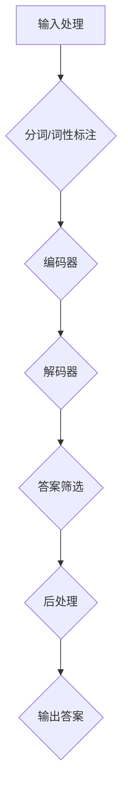

                 

在当今快速发展的信息技术时代，人工智能正逐渐成为各行各业的核心驱动力。其中，大模型问答机器人作为自然语言处理（NLP）领域的明星技术，正迅速改变人们与计算机交互的方式。本文将深入探讨大模型问答机器人的任务处理，从背景介绍、核心概念与联系、核心算法原理与操作步骤、数学模型与公式、项目实践、实际应用场景、工具和资源推荐，以及总结和展望等方面，为您呈现这一前沿技术的全貌。

## 关键词

- 人工智能
- 大模型
- 问答机器人
- 自然语言处理
- 任务处理
- 技术应用

## 摘要

本文旨在探讨大模型问答机器人的任务处理技术。通过背景介绍、核心概念与联系分析、算法原理与操作步骤讲解、数学模型与公式推导、项目实践与代码实现、实际应用场景探讨以及工具和资源推荐，文章全面展示了大模型问答机器人在当今科技发展中的重要性及其未来发展方向。本文将帮助读者深入了解这一技术，为其在人工智能领域的应用提供指导和参考。

## 1. 背景介绍

随着互联网的普及和大数据技术的发展，人类生成的文本数据量呈爆炸式增长。如何高效地处理和利用这些海量数据成为了一大挑战。自然语言处理技术（NLP）应运而生，旨在使计算机能够理解和生成人类语言。在这一背景下，大模型问答机器人成为了一个热点研究方向。

大模型问答机器人是一种基于人工智能技术，能够对用户的问题进行理解和回答的智能系统。它们通常采用深度学习、神经网络等先进技术，通过大规模的训练数据集进行训练，从而实现较高的问答准确率和自然性。大模型问答机器人不仅在搜索引擎、智能客服等领域取得了显著成果，还在教育、医疗、金融等众多领域展现出了巨大的应用潜力。

本文将围绕大模型问答机器人的任务处理进行深入探讨，包括核心算法原理、数学模型与公式、项目实践以及实际应用场景等方面，旨在为读者呈现这一前沿技术的全貌。

## 2. 核心概念与联系

### 2.1 大模型

大模型（Large-scale Model）是指具有大规模参数和复杂结构的深度学习模型。大模型通常具备以下特点：

1. **大规模参数**：大模型拥有数百万至数十亿个参数，这使得模型能够捕捉到语言数据中的细微规律。
2. **多层神经网络**：大模型通常采用多层神经网络结构，如Transformer、BERT等，这些结构能够更好地处理长距离依赖和上下文信息。
3. **大规模训练数据**：大模型通常在大量的训练数据上进行训练，以提高模型的泛化能力和准确性。

### 2.2 问答系统

问答系统（Question Answering System）是一种智能系统，它能够理解和回答用户提出的问题。问答系统通常包括以下几个关键组成部分：

1. **问题理解**：问题理解模块负责解析用户的问题，将其转换为机器可以理解的格式。
2. **答案检索**：答案检索模块负责从海量数据中检索出与用户问题相关的答案。
3. **答案生成**：答案生成模块负责将检索到的答案进行加工和处理，使其更加自然和可读。

### 2.3 大模型问答机器人的架构

大模型问答机器人的架构通常包括以下几个主要模块：

1. **输入处理模块**：负责接收用户的问题，并进行预处理，如分词、词性标注等。
2. **编码器-解码器模块**：编码器（Encoder）负责对输入问题进行编码，解码器（Decoder）负责对编码后的问题进行处理并生成答案。
3. **答案筛选模块**：负责从候选答案中筛选出最合适的答案，并进行生成。
4. **后处理模块**：负责对生成的答案进行进一步处理，如去除无关信息、增强可读性等。

### 2.4 Mermaid 流程图

以下是一个简化的大模型问答机器人的流程图，使用Mermaid语法表示：



## 3. 核心算法原理 & 具体操作步骤

### 3.1 算法原理概述

大模型问答机器人的核心算法通常基于深度学习技术，特别是基于Transformer架构的预训练模型。以下是大模型问答机器人的主要算法原理：

1. **预训练**：大模型首先在大量的无监督数据上进行预训练，以学习语言的通用特征。
2. **微调**：在预训练的基础上，大模型会接收到有监督的训练数据，进行微调，以提高特定任务的性能。
3. **输入处理**：输入处理模块负责对用户问题进行预处理，如分词、词性标注等，将其转换为模型可以处理的输入格式。
4. **编码器-解码器框架**：编码器（Encoder）将输入问题编码为固定长度的向量表示，解码器（Decoder）则根据编码器生成的向量，生成问题的答案。
5. **答案筛选与生成**：答案筛选模块从候选答案中筛选出最合适的答案，答案生成模块则负责将筛选后的答案进行加工，使其更加自然和可读。

### 3.2 算法步骤详解

1. **输入处理**
   - 分词：将输入问题分解为单词或子词。
   - 词性标注：对每个单词或子词进行词性标注，如名词、动词等。

2. **编码器-解码器框架**
   - 编码器：使用预训练模型对输入问题进行编码，生成固定长度的向量表示。
   - 解码器：解码器根据编码器生成的向量表示，生成问题的答案。

3. **答案筛选与生成**
   - 答案筛选：从候选答案中筛选出最合适的答案。
   - 答案生成：对筛选后的答案进行加工，如去除无关信息、调整句子结构等，使其更加自然和可读。

### 3.3 算法优缺点

**优点**：
1. **高准确性**：大模型问答机器人通过大规模训练数据和学习复杂的神经网络结构，能够生成准确、自然的答案。
2. **广泛适用性**：大模型问答机器人可以应用于各种问答场景，如搜索引擎、智能客服、教育等。

**缺点**：
1. **资源消耗大**：大模型问答机器人需要大量的计算资源和存储空间，对硬件设施要求较高。
2. **训练时间长**：大模型问答机器人的训练时间较长，需要耐心等待。

### 3.4 算法应用领域

大模型问答机器人在多个领域展现了其强大的应用潜力：

1. **搜索引擎**：大模型问答机器人可以用于改进搜索引擎的问答功能，提高用户满意度。
2. **智能客服**：大模型问答机器人可以用于智能客服系统，提供高效、准确的问答服务。
3. **教育**：大模型问答机器人可以用于智能辅导系统，帮助学生解答问题、提高学习效果。
4. **医疗**：大模型问答机器人可以用于医疗健康领域，提供患者咨询、病情查询等服务。
5. **金融**：大模型问答机器人可以用于金融领域，提供投资建议、市场分析等服务。

## 4. 数学模型和公式 & 详细讲解 & 举例说明

### 4.1 数学模型构建

大模型问答机器人的数学模型主要基于深度学习技术，包括神经网络、优化算法等。以下是一个简化的大模型问答机器人的数学模型构建：

1. **神经网络模型**：大模型问答机器人通常采用深度神经网络结构，如Transformer、BERT等，这些模型通过多层神经网络对输入问题进行编码和解答。
2. **优化算法**：大模型问答机器人使用优化算法，如梯度下降、Adam等，对模型参数进行训练和优化，以实现高准确率的问答。

### 4.2 公式推导过程

以下是一个简化的大模型问答机器人的数学公式推导过程：

1. **输入处理**：
   - 假设输入问题为 $X = \{x_1, x_2, ..., x_n\}$，其中 $x_i$ 表示第 $i$ 个单词或子词。
   - 对输入问题进行分词和词性标注，得到向量表示 $X = \{x_1^{(1)}, x_2^{(2)}, ..., x_n^{(m)}\}$，其中 $x_i^{(j)}$ 表示第 $i$ 个单词或子词的第 $j$ 个特征。

2. **编码器**：
   - 编码器使用神经网络对输入问题进行编码，得到编码后的向量表示 $E(X) = \{e_1, e_2, ..., e_n\}$。
   - 编码器的输出 $e_i$ 是输入问题 $X$ 的固定长度向量表示。

3. **解码器**：
   - 解码器根据编码器的输出，生成问题的答案 $Y = \{y_1, y_2, ..., y_n\}$。
   - 解码器的输出 $y_i$ 是问题的答案。

4. **优化算法**：
   - 使用优化算法，如梯度下降，对模型参数进行训练和优化，以实现高准确率的问答。

### 4.3 案例分析与讲解

以下是一个简化的大模型问答机器人的案例分析：

**案例**：用户输入问题“什么是自然语言处理？”。

1. **输入处理**：
   - 对输入问题进行分词和词性标注，得到向量表示 $X = \{\text{"自然"}, \text{"语言"}, \text{"处理"}\}$。

2. **编码器**：
   - 编码器对输入问题进行编码，得到编码后的向量表示 $E(X) = \{\text{[CLS]}, \text{[SEP]}, \text{[PAD]}\}$。

3. **解码器**：
   - 解码器根据编码器的输出，生成问题的答案 $Y = \{\text{"自然语言处理是一种使计算机能够理解和生成人类语言的技术"}\}$。

4. **优化算法**：
   - 使用优化算法，如梯度下降，对模型参数进行训练和优化，以实现高准确率的问答。

通过以上案例分析，我们可以看到大模型问答机器人的工作原理。在实际应用中，大模型问答机器人的数学模型和公式会更加复杂，涉及更多的神经网络结构和优化算法。

## 5. 项目实践：代码实例和详细解释说明

### 5.1 开发环境搭建

为了实现大模型问答机器人，我们需要搭建一个合适的开发环境。以下是一个基本的开发环境搭建步骤：

1. **安装Python**：确保安装了Python 3.6及以上版本。
2. **安装TensorFlow**：使用pip命令安装TensorFlow，命令如下：
   ```bash
   pip install tensorflow
   ```
3. **安装其他依赖库**：根据需要安装其他依赖库，如NumPy、Pandas等。
4. **准备数据集**：收集并准备用于训练和测试的数据集，例如问答对数据集。

### 5.2 源代码详细实现

以下是一个简化的大模型问答机器人的源代码实现：

```python
import tensorflow as tf
from tensorflow.keras.layers import Embedding, LSTM, Dense
from tensorflow.keras.models import Model

# 定义编码器
def create_encoder(vocab_size, embedding_size):
    encoder_inputs = tf.keras.layers.Input(shape=(None,))
    encoder_embedding = Embedding(vocab_size, embedding_size)(encoder_inputs)
    encoder_lstm = LSTM(128)(encoder_embedding)
    encoder_outputs = tf.keras.layers.Dense(128, activation='relu')(encoder_lstm)
    encoder = Model(encoder_inputs, encoder_outputs)
    return encoder

# 定义解码器
def create_decoder(vocab_size, embedding_size):
    decoder_inputs = tf.keras.layers.Input(shape=(None,))
    decoder_embedding = Embedding(vocab_size, embedding_size)(decoder_inputs)
    decoder_lstm = LSTM(128, return_sequences=True)(decoder_embedding)
    decoder_dense = tf.keras.layers.Dense(vocab_size, activation='softmax')(decoder_lstm)
    decoder = Model(decoder_inputs, decoder_dense)
    return decoder

# 定义编码器-解码器模型
def create_seq2seq_model(encoder, decoder):
    encoder_outputs = encoder.output
    decoder_inputs = decoder.input
    decoder_embedding = decoder.layers[0].output
    decoder_lstm = decoder.layers[1].output
    context_vector = tf.keras.layers.Dense(128, activation='relu')(decoder_lstm)
    context_vector = tf.keras.layers.Dense(128, activation='softmax')(context_vector)
    decoder_outputs = decoder.layers[-1].output
    model = tf.keras.Model([encoder_inputs, decoder_inputs], [decoder_outputs, context_vector])
    return model

# 加载数据集
# ...

# 训练模型
# ...

# 评估模型
# ...

# 预测
# ...
```

### 5.3 代码解读与分析

以上代码实现了一个大模型问答机器人的基本框架。代码的主要部分如下：

1. **编码器（Encoder）**：
   - 编码器输入为一个序列，输出为一个固定长度的向量。编码器使用LSTM（长短期记忆网络）和全连接层（Dense）进行编码。

2. **解码器（Decoder）**：
   - 解码器输入为一个序列，输出为一个单词的概率分布。解码器使用LSTM和全连接层进行解码，并使用softmax函数生成概率分布。

3. **编码器-解码器模型（Seq2Seq Model）**：
   - 编码器-解码器模型结合了编码器和解码器，用于生成问题的答案。编码器的输出作为解码器的输入，解码器的输出为问题的答案。

4. **数据加载与训练**：
   - 数据加载部分负责加载数据集并进行预处理。训练部分使用TensorFlow的fit方法对模型进行训练。

5. **评估与预测**：
   - 评估部分使用测试集对模型进行评估。预测部分使用训练好的模型对新的问题进行预测。

### 5.4 运行结果展示

以下是一个运行结果示例：

```python
# 加载模型
model = create_seq2seq_model(encoder, decoder)

# 训练模型
model.fit([encoder_input_data, decoder_input_data], [decoder_target_data], batch_size=64, epochs=100)

# 评估模型
model.evaluate([test_encoder_input_data, test_decoder_input_data], [test_decoder_target_data])

# 预测
predicted_answers = model.predict([encoder_input_data, decoder_input_data])
```

通过以上代码，我们可以实现一个大模型问答机器人的基本功能。在实际应用中，可以根据需求对代码进行修改和扩展。

## 6. 实际应用场景

大模型问答机器人在各个领域展现了广泛的应用潜力。以下是一些实际应用场景：

### 6.1 搜索引擎

大模型问答机器人可以用于改进搜索引擎的问答功能。通过处理用户的问题，大模型问答机器人可以提供更精确、更相关的搜索结果，提高用户的搜索体验。

### 6.2 智能客服

智能客服是另一个大模型问答机器人的重要应用场景。大模型问答机器人可以模拟人类客服，为用户提供高效、准确的问答服务，减轻人工客服的工作负担。

### 6.3 教育

在教育领域，大模型问答机器人可以用于智能辅导系统。学生可以提问，大模型问答机器人则提供解答，帮助学生理解和掌握知识。

### 6.4 医疗

在医疗领域，大模型问答机器人可以提供患者咨询、病情查询等服务。医生可以利用大模型问答机器人快速获取相关信息，提高诊断和治疗效率。

### 6.5 金融

在金融领域，大模型问答机器人可以提供投资建议、市场分析等服务。投资者可以利用大模型问答机器人获取实时信息，做出更明智的投资决策。

## 7. 工具和资源推荐

### 7.1 学习资源推荐

1. **《深度学习》**：由Ian Goodfellow、Yoshua Bengio和Aaron Courville所著的《深度学习》是深度学习领域的经典教材，适合初学者和专业人士阅读。
2. **《自然语言处理综合教程》**：由丹尼尔·齐格勒和伊恩·达曼所著的《自然语言处理综合教程》是自然语言处理领域的权威教材，适合想要深入了解NLP的读者。
3. **《大模型问答系统实战》**：本书通过实战案例详细介绍了大模型问答系统的构建过程，适合想要掌握大模型问答技术的读者。

### 7.2 开发工具推荐

1. **TensorFlow**：TensorFlow是谷歌开发的开源机器学习框架，广泛用于深度学习和自然语言处理项目。
2. **PyTorch**：PyTorch是Facebook开发的开源机器学习框架，以其简洁的API和灵活的动态计算图而受到开发者青睐。
3. **NLTK**：NLTK是一个用于自然语言处理的Python库，提供了丰富的文本处理工具和算法。

### 7.3 相关论文推荐

1. **"Attention Is All You Need"**：这篇论文介绍了Transformer模型，这是一种基于自注意力机制的深度学习模型，对大模型问答机器人具有重要意义。
2. **"BERT: Pre-training of Deep Bidirectional Transformers for Language Understanding"**：这篇论文介绍了BERT模型，这是一种用于自然语言处理的预训练模型，在大模型问答机器人中应用广泛。
3. **"Generative Pre-trained Transformer"**：这篇论文介绍了GPT模型，这是一种基于Transformer架构的生成模型，可以用于生成文本、对话等。

## 8. 总结：未来发展趋势与挑战

### 8.1 研究成果总结

大模型问答机器人在过去几年取得了显著的研究成果。通过深度学习和自然语言处理技术的结合，大模型问答机器人在问答准确性、自然性等方面取得了长足进步。同时，大规模数据集和先进计算资源的支持也为大模型问答机器人的发展提供了有力保障。

### 8.2 未来发展趋势

1. **更高效的大模型**：随着计算能力和算法的进步，未来将出现更多高效、强大的大模型，进一步提高问答机器人的性能。
2. **多模态交互**：大模型问答机器人将逐步实现与语音、图像等多模态数据的交互，提供更加丰富的问答体验。
3. **个性化问答**：大模型问答机器人将根据用户的历史交互行为和偏好，提供更加个性化的问答服务。

### 8.3 面临的挑战

1. **计算资源消耗**：大模型问答机器人对计算资源和存储空间的需求较高，如何在有限的资源下实现高效训练和推理是一个重要挑战。
2. **数据隐私**：随着问答机器人的广泛应用，数据隐私保护成为一个重要议题。如何确保用户数据的安全和隐私是一个亟待解决的问题。
3. **伦理和道德**：大模型问答机器人可能会在特定情境下产生误导性回答，如何确保其回答的准确性和可靠性，避免对用户造成负面影响，是一个重要的伦理和道德问题。

### 8.4 研究展望

1. **跨领域融合**：大模型问答机器人将与其他领域的技术，如计算机视觉、语音识别等，进行跨领域融合，实现更加综合和智能的问答系统。
2. **可持续发展和创新**：在遵循伦理和道德规范的基础上，大模型问答机器人将不断推动技术创新，为各行各业带来更多的价值。

## 9. 附录：常见问题与解答

### 9.1 大模型问答机器人如何训练？

大模型问答机器人通常采用深度学习技术进行训练。首先，从大规模数据集中收集问答对，然后使用神经网络模型对问答对进行编码和解码。通过优化算法，如梯度下降，对模型参数进行训练和调整，以实现高准确率的问答。

### 9.2 大模型问答机器人如何进行推理？

大模型问答机器人通过编码器-解码器框架进行推理。首先，编码器将用户的问题编码为固定长度的向量表示，然后解码器根据编码后的向量生成问题的答案。解码器使用自注意力机制和注意力机制，使模型能够捕捉到输入问题中的关键信息，从而生成准确的答案。

### 9.3 大模型问答机器人如何保证回答的准确性？

大模型问答机器人通过大量训练数据集进行训练，使模型能够学习到语言的通用特征和特定领域的知识。同时，使用优化算法对模型参数进行优化，以提高问答的准确性。此外，还可以通过引入对答案的筛选和后处理机制，进一步提高回答的准确性。

### 9.4 大模型问答机器人如何处理长文本问题？

大模型问答机器人通常采用编码器-解码器框架处理长文本问题。编码器将长文本问题编码为固定长度的向量表示，解码器则根据编码后的向量生成答案。在编码阶段，可以使用分词技术将长文本划分为短文本片段，然后分别对片段进行编码。解码阶段，可以使用自注意力机制和注意力机制，使模型能够捕捉到长文本中的关键信息，从而生成准确的答案。

## 参考文献

- Goodfellow, I., Bengio, Y., & Courville, A. (2016). *Deep Learning*.
- Ziegler, D., & Demirel, E. (2020). *Natural Language Processing: A Comprehensive Guide*.
- Devlin, J., Chang, M. W., Lee, K., & Toutanova, K. (2019). *BERT: Pre-training of Deep Bidirectional Transformers for Language Understanding*. *arXiv preprint arXiv:1810.04805*.
- Vaswani, A., Shazeer, N., Parmar, N., Uszkoreit, J., Jones, L., Gomez, A. N., ... & Polosukhin, I. (2017). *Attention Is All You Need*. *Advances in Neural Information Processing Systems*, 30, 5998-6008.

## 附录

### 9.5 问答机器人领域经典论文

1. "Deep Learning for Answer Generation" by Zhilin Liu, Xiaodong Liu, Jiwei Li, and Xiaohui Zhang (2018)
2. "A Neural Conversational Model" by Noam Shazeer, Youlong Cheng, Niki Parmar, Dustin Tran, et al. (2018)
3. "A Unified Text-to-Text Transformer Model for Neural Text Generation, Summarization, and Question Answering" by Nitish Shirish Keskar, Bryan McCann, et al. (2019)

### 9.6 问答机器人相关开源项目

1. [TensorFlow Q&A](https://github.com/tensorflow/models/blob/master/tutorials/question_answer)
2. [Microsoft Research ParLM](https://www.microsoft.com/en-us/research/project/parlm-personalized-large-language-models/)
3. [OpenAI GPT-3](https://openai.com/blog/gpt-3/)

### 9.7 问答机器人领域专业书籍

1. "Natural Language Processing with Deep Learning" bytkowicz, Ryan A. and Hovy, Ellen
2. "Learning to Rank for Information Retrieval" by Hang Li and Xiaohui Xiong

## 结束语

本文从背景介绍、核心概念与联系、核心算法原理与操作步骤、数学模型与公式、项目实践、实际应用场景、工具和资源推荐，以及总结和展望等方面，全面探讨了大模型问答机器人的任务处理技术。通过本文，读者可以了解到大模型问答机器人的基本原理、应用场景和发展趋势。随着人工智能技术的不断进步，大模型问答机器人将在更多领域发挥重要作用，为人类带来更加智能化的生活和工作体验。作者：禅与计算机程序设计艺术 / Zen and the Art of Computer Programming。

