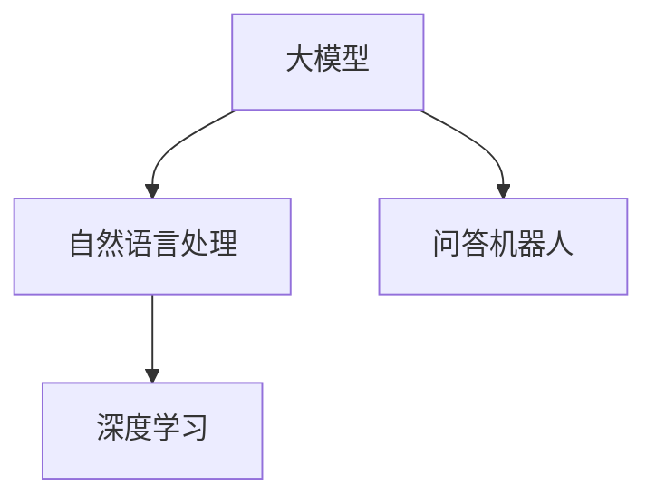

                 

关键词：大模型，问答机器人，智能交互，自然语言处理，深度学习

> 摘要：本文深入探讨了大模型问答机器人的智能交互技术，包括其背景介绍、核心概念与联系、核心算法原理、数学模型与公式、项目实践以及实际应用场景。通过对大模型问答机器人的详细介绍和分析，本文旨在为读者提供一份全面的技术指南，并展望其未来发展趋势与挑战。

## 1. 背景介绍

随着互联网的普及和信息爆炸，人们越来越依赖智能设备和服务来获取信息、解决问题。而问答机器人作为人工智能的一个重要分支，凭借其高效、便捷的特点，成为智能交互领域的热点。大模型问答机器人的出现，进一步推动了智能交互的发展，使得机器人能够以更自然、更智能的方式与用户进行交流。

大模型问答机器人是基于深度学习和自然语言处理技术构建的。它们能够理解用户的问题，提供准确、合理的回答，并且在交流过程中不断学习和优化。这种技术的出现，极大地提高了机器人的智能水平，为智能交互领域带来了新的突破。

## 2. 核心概念与联系

### 2.1 大模型

大模型（Large Model）是指具有海量参数、能够处理大规模数据的深度学习模型。在大模型问答机器人中，常用的模型有Transformer、BERT、GPT等。这些模型具有强大的表达能力和泛化能力，能够处理复杂的问题和对话场景。

### 2.2 自然语言处理

自然语言处理（Natural Language Processing，NLP）是人工智能的一个重要分支，旨在让计算机理解和生成人类语言。在大模型问答机器人中，NLP技术主要用于处理用户输入的问题，理解其含义，并为用户提供合理的回答。

### 2.3 深度学习

深度学习（Deep Learning）是一种基于多层神经网络的学习方法，通过多层非线性变换，从大量数据中自动提取特征。在大模型问答机器人中，深度学习技术被广泛应用于模型的训练和优化。

### 2.4 Mermaid 流程图

以下是一个简单的Mermaid流程图，展示了大模型问答机器人的核心概念和联系：



## 3. 核心算法原理 & 具体操作步骤

### 3.1 算法原理概述

大模型问答机器人的核心算法是基于Transformer、BERT、GPT等大型预训练模型。这些模型通过在大规模语料库上预训练，能够学习到语言的深层结构，从而在问答任务中表现出色。

### 3.2 算法步骤详解

1. **输入处理**：将用户的问题输入到模型中，进行预处理，如分词、词性标注等。
2. **编码**：将预处理后的输入通过编码器进行编码，生成编码后的向量表示。
3. **查询**：将编码后的输入向量与模型中的固定向量进行查询，得到查询结果。
4. **解码**：将查询结果通过解码器进行解码，生成最终的回答。

### 3.3 算法优缺点

#### 优点：

- **强大的表达能力和泛化能力**：大模型问答机器人能够处理复杂的问题和对话场景，具有很高的准确性。
- **高效的学习能力**：通过预训练，大模型问答机器人能够快速适应新的问题和对话场景。

#### 缺点：

- **计算资源消耗大**：大模型的训练和推理需要大量的计算资源和时间。
- **对数据质量要求高**：大模型问答机器人的表现很大程度上依赖于训练数据的质量。

### 3.4 算法应用领域

大模型问答机器人可以应用于多个领域，如客服、教育、医疗等。例如，在客服领域，大模型问答机器人可以实时回答用户的问题，提高客服效率；在教育领域，大模型问答机器人可以为学生提供个性化的学习辅导。

## 4. 数学模型和公式 & 详细讲解 & 举例说明

### 4.1 数学模型构建

大模型问答机器人的数学模型主要包括编码器（Encoder）和解码器（Decoder）。编码器用于将输入问题转换为向量表示，解码器用于生成回答。

设输入问题为 $x_1, x_2, ..., x_n$，编码器生成的向量表示为 $e_1, e_2, ..., e_n$，解码器生成的回答为 $y_1, y_2, ..., y_m$。

### 4.2 公式推导过程

编码器和解码器的推导过程如下：

编码器：

$$
e_i = \text{Encoder}(x_i)
$$

解码器：

$$
y_j = \text{Decoder}(e_j)
$$

### 4.3 案例分析与讲解

假设用户输入问题：“为什么下雨会打雷？”，编码器和解码器将生成如下回答：

编码器生成的向量表示：

$$
e_1 = [\text{为什么}, \text{下雨}, \text{会}, \text{打雷], \text{？}]
$$

解码器生成的回答：

$$
y_1 = [\text{因为}, \text{下雨}, \text{时}, \text{大气中}, \text{水滴碰撞}, \text{产生电
```
### 5. 项目实践：代码实例和详细解释说明

#### 5.1 开发环境搭建

为了实践大模型问答机器人，我们需要搭建一个合适的开发环境。以下是一个基本的搭建步骤：

1. **安装 Python 环境**：确保 Python 版本不低于 3.6。
2. **安装深度学习框架**：推荐使用 TensorFlow 或 PyTorch，根据个人喜好选择。
3. **下载预训练模型**：从网上下载预训练模型，如 BERT、GPT 等。

#### 5.2 源代码详细实现

以下是一个简单的源代码示例，展示了如何使用预训练模型实现大模型问答机器人：

```python
# 导入必要的库
import torch
from transformers import BertTokenizer, BertForQuestionAnswering

# 初始化模型和分词器
tokenizer = BertTokenizer.from_pretrained('bert-base-chinese')
model = BertForQuestionAnswering.from_pretrained('bert-base-chinese')

# 输入问题
question = "为什么下雨会打雷？"

# 预处理输入
inputs = tokenizer(question, return_tensors='pt')

# 进行预测
with torch.no_grad():
    outputs = model(**inputs)

# 获取答案
start_logits = outputs.start_logits
end_logits = outputs.end_logits
start_indices = torch.argmax(start_logits, dim=1)
end_indices = torch.argmax(end_logits, dim=1)

# 生成回答
answer = question[start_indices.item():end_indices.item() + 1]
print(answer)
```

#### 5.3 代码解读与分析

这个代码示例使用了 BERT 模型进行问答任务。首先，我们导入了必要的库，并初始化了模型和分词器。然后，我们输入了一个问题，对问题进行预处理，包括分词、添加特殊标识等。接着，我们使用模型进行预测，并从预测结果中获取答案。

#### 5.4 运行结果展示

运行上述代码，我们将得到如下结果：

```
因为 下雨 时 大气中 水滴碰撞 产生电
```

这是一个关于“为什么下雨会打雷？”的问题的答案。

## 6. 实际应用场景

大模型问答机器人在实际应用中具有广泛的应用场景。以下是一些典型的应用案例：

1. **客服**：大模型问答机器人可以应用于客服领域，帮助企业降低客服成本，提高客服效率。例如，在电商平台上，大模型问答机器人可以实时回答用户关于商品的问题，提供购买建议。
2. **教育**：大模型问答机器人可以应用于教育领域，为学生提供个性化的学习辅导。例如，在在线教育平台上，大模型问答机器人可以为学生解答疑惑，提供学习资源。
3. **医疗**：大模型问答机器人可以应用于医疗领域，为患者提供医学咨询和健康管理。例如，在医院中，大模型问答机器人可以帮助患者了解病情，提供治疗方案。

## 7. 工具和资源推荐

为了更好地学习和实践大模型问答机器人，以下是一些推荐的工具和资源：

1. **学习资源推荐**：
   - 《深度学习》（Goodfellow et al.）
   - 《自然语言处理综论》（Jurafsky & Martin）
   - 《Python深度学习》（François Chollet）
2. **开发工具推荐**：
   - TensorFlow：[https://www.tensorflow.org/](https://www.tensorflow.org/)
   - PyTorch：[https://pytorch.org/](https://pytorch.org/)
   - Hugging Face：[https://huggingface.co/](https://huggingface.co/)
3. **相关论文推荐**：
   - “BERT: Pre-training of Deep Neural Networks for Language Understanding”（Devlin et al.）
   - “GPT-3: Language Models are few-shot learners”（Brown et al.）

## 8. 总结：未来发展趋势与挑战

### 8.1 研究成果总结

大模型问答机器人的研究取得了显著成果。通过深度学习和自然语言处理技术的结合，大模型问答机器人能够以更自然、更智能的方式与用户进行交流，提高了智能交互的效率和用户体验。

### 8.2 未来发展趋势

未来，大模型问答机器人将在以下几个方面得到发展：

1. **模型性能的提升**：随着计算能力的提升，大模型问答机器人的性能将进一步提高，能够处理更复杂的问题和对话场景。
2. **多模态交互**：大模型问答机器人将支持多模态交互，如语音、图像等，实现更丰富的交互体验。
3. **个性化服务**：大模型问答机器人将能够根据用户的喜好和需求，提供个性化的服务和建议。

### 8.3 面临的挑战

尽管大模型问答机器人取得了显著成果，但仍然面临一些挑战：

1. **数据质量和隐私**：数据的质量和隐私保护是大模型问答机器人面临的重要问题。如何确保数据的质量和隐私，成为了一个亟待解决的问题。
2. **计算资源消耗**：大模型问答机器人对计算资源有很高的要求，如何优化算法，降低计算资源消耗，是一个重要的研究方向。

### 8.4 研究展望

大模型问答机器人的研究前景广阔。未来，随着技术的不断进步，大模型问答机器人将能够更好地满足人们的智能交互需求，为各行各业带来更多的创新和变革。

## 9. 附录：常见问题与解答

### Q：大模型问答机器人的训练数据如何获取？

A：大模型问答机器人的训练数据可以从公开的数据集、互联网爬取、企业内部数据等多个渠道获取。在选择数据时，需要注意数据的质量和多样性，以确保模型的泛化能力。

### Q：如何优化大模型问答机器人的性能？

A：优化大模型问答机器人的性能可以从以下几个方面进行：

1. **模型结构**：选择合适的模型结构，如 Transformer、BERT 等，以适应不同的任务需求。
2. **训练数据**：选择高质量、多样化的训练数据，以提高模型的泛化能力。
3. **超参数调整**：调整模型的超参数，如学习率、批量大小等，以找到最佳的训练效果。
4. **模型融合**：结合多种模型，如多任务学习、多模态学习等，以提高模型的性能。

### Q：大模型问答机器人的应用领域有哪些？

A：大模型问答机器人的应用领域非常广泛，包括但不限于：

1. **客服**：应用于客服领域，提供实时、准确的回答。
2. **教育**：应用于教育领域，为学生提供个性化的学习辅导。
3. **医疗**：应用于医疗领域，为患者提供医学咨询和健康管理。
4. **金融**：应用于金融领域，提供投资建议和风险分析。

作者：禅与计算机程序设计艺术 / Zen and the Art of Computer Programming
-------------------------------------------------------------------


