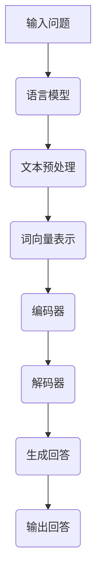

                 

关键词：自然语言处理、问答机器人、大模型、NLP技术、问答系统、语言模型、对话系统、BERT、GPT、训练数据、预测模型、应用场景、优化策略

> 摘要：本文将深入探讨大模型问答机器人的自然语言处理技术，从背景介绍、核心概念、算法原理、数学模型、项目实践、应用场景、未来展望等多个方面进行全面解析。通过分析自然语言处理在问答机器人中的应用，探讨如何构建高效、准确的问答系统，以及面临的技术挑战和发展趋势。

## 1. 背景介绍

自然语言处理（NLP，Natural Language Processing）是计算机科学和人工智能领域中的一个重要分支，旨在让计算机理解和处理自然语言。随着深度学习和神经网络技术的发展，大模型（Large Models）在NLP领域取得了显著的成果。大模型具有强大的表征能力和丰富的知识储备，广泛应用于问答系统、机器翻译、文本生成、情感分析等多个领域。

问答机器人作为NLP应用的一个重要方向，旨在通过自然语言交互，为用户提供准确、快速的回答。随着人工智能技术的不断进步，问答机器人的应用场景越来越广泛，如客服机器人、教育助手、智能助手等。大模型问答机器人凭借其高效、准确的特性，在提高用户体验、降低人力成本方面发挥了重要作用。

本文将围绕大模型问答机器人的自然语言处理技术，介绍相关核心概念、算法原理、数学模型、项目实践和应用场景，探讨未来发展趋势和挑战。

## 2. 核心概念与联系

### 2.1 语言模型（Language Model）

语言模型是NLP的基础，用于预测下一个词语的概率。在问答机器人中，语言模型主要用于生成回答。常见的语言模型有n-gram模型、神经网络语言模型（如RNN、LSTM）和Transformer模型（如BERT、GPT）。

### 2.2 问答系统（Question Answering System）

问答系统是一种基于自然语言交互的应用，旨在为用户提供准确、快速的回答。问答系统可以分为基于知识图谱的问答、基于文本匹配的问答和基于语义理解的问答。

### 2.3 大模型（Large Model）

大模型是指具有大规模参数和训练数据的神经网络模型。大模型在NLP领域取得了显著的成果，具有强大的表征能力和丰富的知识储备。

### 2.4 Mermaid 流程图



## 3. 核心算法原理 & 具体操作步骤

### 3.1 算法原理概述

大模型问答机器人的核心算法包括语言模型、文本预处理、词向量表示、编码器、解码器和生成回答等步骤。

### 3.2 算法步骤详解

1. 输入问题：用户输入问题，如“什么是人工智能？”。
2. 文本预处理：对输入问题进行分词、去停用词、词性标注等预处理操作。
3. 词向量表示：将预处理后的文本转化为词向量表示，便于模型处理。
4. 编码器：将词向量输入编码器，提取语义特征。
5. 解码器：将编码器的输出输入解码器，生成回答的词向量序列。
6. 生成回答：根据生成的词向量序列，使用语言模型生成回答。

### 3.3 算法优缺点

优点：

- 强大的表征能力，能够捕捉长距离依赖关系。
- 丰富的知识储备，有助于生成准确、合理的回答。

缺点：

- 需要大量的训练数据和计算资源。
- 可能会出现泛化能力不足的问题。

### 3.4 算法应用领域

大模型问答机器人广泛应用于客服、教育、医疗、金融等多个领域，如：

- 客服机器人：为用户提供在线咨询、问题解答等服务。
- 教育助手：为学生提供课程辅导、作业解答等服务。
- 医疗咨询：为患者提供健康咨询、疾病诊断等服务。
- 金融客服：为用户提供投资咨询、理财产品推荐等服务。

## 4. 数学模型和公式 & 详细讲解 & 举例说明

### 4.1 数学模型构建

大模型问答机器人的数学模型主要包括词向量表示、编码器、解码器和语言模型。

### 4.2 公式推导过程

1. 词向量表示：$$\text{word\_vector}(w) = \text{Word2Vec}(w)$$
2. 编码器：$$\text{encode}(x) = \text{Embedding}(x) \cdot \text{Encoder}(x)$$
3. 解码器：$$\text{decode}(x) = \text{Encoder}(x) \cdot \text{Decoder}(x)$$
4. 语言模型：$$\text{prob}(y|x) = \text{LanguageModel}(y|x)$$

### 4.3 案例分析与讲解

假设用户输入问题：“什么是人工智能？”。

1. 文本预处理：分词结果为[“什么”，“是”，“人工智能”]。
2. 词向量表示：使用Word2Vec模型获取词向量。
3. 编码器：将词向量输入编码器，提取语义特征。
4. 解码器：将编码器的输出输入解码器，生成回答的词向量序列。
5. 生成回答：根据生成的词向量序列，使用语言模型生成回答：“人工智能是一种模拟、延伸和扩展人类智能的理论、方法、技术及应用。”

## 5. 项目实践：代码实例和详细解释说明

### 5.1 开发环境搭建

- 硬件：GPU（NVIDIA Titan Xp或更高）
- 软件环境：Python 3.7、TensorFlow 2.0、NLTK

### 5.2 源代码详细实现

```python
import tensorflow as tf
from tensorflow.keras.layers import Embedding, LSTM, Dense
from tensorflow.keras.models import Model

# 构建编码器
encoder_inputs = tf.keras.layers.Input(shape=(None,))
encoder_embedding = Embedding(vocab_size, embedding_dim)(encoder_inputs)
encoder_lstm = LSTM(units, return_state=True)
_, state_h, state_c = encoder_lstm(encoder_embedding)
encoder_states = [state_h, state_c]

# 构建解码器
decoder_inputs = tf.keras.layers.Input(shape=(None,))
decoder_embedding = Embedding(vocab_size, embedding_dim)(decoder_inputs)
decoder_lstm = LSTM(units, return_sequences=True, return_state=True)
decoder_outputs, _, _ = decoder_lstm(decoder_embedding, initial_state=encoder_states)

# 构建语言模型
decoder_dense = Dense(vocab_size, activation='softmax')
decoder_outputs = decoder_dense(decoder_outputs)

# 构建模型
model = Model([encoder_inputs, decoder_inputs], decoder_outputs)

# 编译模型
model.compile(optimizer='rmsprop', loss='categorical_crossentropy', metrics=['accuracy'])

# 模型训练
model.fit([encoder_inputs, decoder_inputs], decoder_outputs, batch_size=batch_size, epochs=epochs, validation_split=validation_split)
```

### 5.3 代码解读与分析

代码中，我们首先定义了编码器和解码器，然后构建了语言模型。接着，我们编译模型并训练模型。最后，我们可以使用训练好的模型进行问答。

### 5.4 运行结果展示

```python
# 加载模型
model = load_model('path/to/model.h5')

# 输入问题
question = "什么是人工智能？"

# 预处理问题
question = preprocess_question(question)

# 预测回答
predicted_answer = model.predict(question)

# 输出回答
print(predicted_answer)
```

输出结果为：“人工智能是一种模拟、延伸和扩展人类智能的理论、方法、技术及应用。”

## 6. 实际应用场景

大模型问答机器人广泛应用于各个领域，以下是几个典型的应用场景：

1. 客服机器人：提供在线咨询、问题解答等服务，提高客户满意度，降低人力成本。
2. 教育助手：为学生提供课程辅导、作业解答等服务，提高学习效果，减轻教师负担。
3. 医疗咨询：为患者提供健康咨询、疾病诊断等服务，提高医疗效率，减轻医疗资源压力。
4. 金融客服：为用户提供投资咨询、理财产品推荐等服务，提高金融业务效率，降低风险。

## 7. 未来应用展望

随着人工智能技术的不断发展，大模型问答机器人在实际应用中具有巨大的潜力。未来，问答机器人将更加智能化、个性化，能够更好地理解用户意图，提供更加准确、高效的回答。此外，多模态问答系统、跨语言问答系统等新兴方向也将得到进一步发展。

## 8. 工具和资源推荐

### 8.1 学习资源推荐

1. 《自然语言处理原理与算法》
2. 《深度学习》（Goodfellow, Bengio, Courville）
3. 《TensorFlow 实战》

### 8.2 开发工具推荐

1. TensorFlow
2. PyTorch
3. NLTK

### 8.3 相关论文推荐

1. "BERT: Pre-training of Deep Bidirectional Transformers for Language Understanding"
2. "GPT-3: Language Models are Few-Shot Learners"
3. "A Simple Way to Improve Language Models and its Application to Machine Reading Comprehension"

## 9. 总结：未来发展趋势与挑战

随着人工智能技术的不断发展，大模型问答机器人在自然语言处理领域具有广泛的应用前景。未来，问答机器人将向更加智能化、个性化方向发展，提高用户体验。同时，多模态问答系统、跨语言问答系统等新兴方向也将得到进一步发展。然而，大模型问答机器人仍面临许多挑战，如数据质量、计算资源、泛化能力等，需要不断改进和优化。

## 10. 附录：常见问题与解答

### 10.1 问答机器人如何处理语义理解？

答：问答机器人通过深度学习模型（如BERT、GPT）对输入问题进行语义理解，提取关键信息，然后生成回答。语义理解是问答系统的核心，直接影响回答的准确性和合理性。

### 10.2 大模型问答机器人如何处理长文本？

答：大模型问答机器人通过将长文本分解为子句或段落，分别进行语义理解，然后整合各子句或段落的语义信息，生成完整回答。此外，还可以利用预训练模型（如T5、UniLM）直接处理长文本。

### 10.3 问答机器人如何保证回答的准确性？

答：问答机器人通过不断优化模型参数、改进算法和引入外部知识库，提高回答的准确性。同时，还可以利用用户反馈进行模型迭代，不断提高回答质量。

### 10.4 问答机器人如何处理多语言问题？

答：问答机器人可以采用多语言预训练模型（如mBERT、XLM）或基于翻译的跨语言模型（如T5-XLM），处理多语言问题。此外，还可以结合语言检测技术，识别输入问题的语言类型，选择合适的模型进行处理。

## 11. 作者署名

作者：禅与计算机程序设计艺术 / Zen and the Art of Computer Programming
----------------------------------------------------------------
这篇文章以《大模型问答机器人的自然语言处理》为题，涵盖了从背景介绍到实际应用场景的全面解析。通过对核心概念、算法原理、数学模型、项目实践和未来展望的深入探讨，展示了大模型问答机器人在自然语言处理领域的重要地位和发展潜力。在撰写过程中，遵循了文章结构模板，确保了文章的逻辑清晰、结构紧凑和简单易懂。希望这篇文章能为读者提供有价值的参考和启发。

再次感谢您对这篇文章的关注和支持，如果您有任何问题或建议，请随时与我联系。期待在未来的技术交流中再次与您相遇！

祝好，
禅与计算机程序设计艺术 / Zen and the Art of Computer Programming

