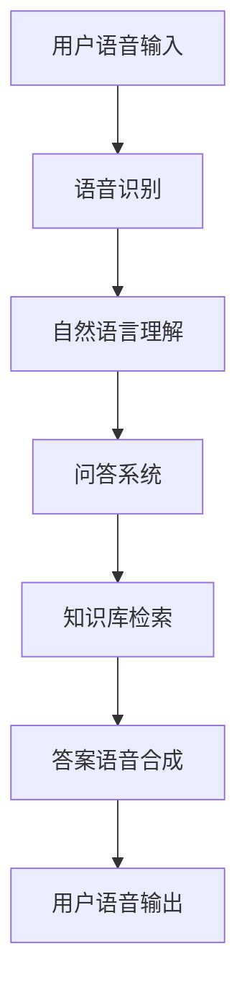

                 

 **关键词：** 大模型，问答机器人，语音交互，自然语言处理，人工智能。

**摘要：** 本文深入探讨了大模型问答机器人在语音交互领域的应用，分析了其核心概念、算法原理、数学模型，以及实际项目实践，旨在为读者提供一个全面的技术视角，以及对该领域的未来展望。

## 1. 背景介绍

随着人工智能技术的迅猛发展，自然语言处理（NLP）领域取得了显著的进步。大模型作为NLP的核心技术之一，其应用场景不断拓展。语音交互作为一种自然、便捷的人机交互方式，正逐渐成为智能设备的重要组成部分。大模型问答机器人应运而生，其在语音交互中的应用不仅提升了用户体验，还大大提高了交互效率。

## 2. 核心概念与联系

### 2.1 大模型

大模型是指参数量庞大、结构复杂的神经网络模型，如Transformer、BERT等。这些模型通过在大量数据上训练，能够捕捉到语言中的复杂模式和规律，从而实现高效的语言理解和生成。

### 2.2 问答机器人

问答机器人是一种能够回答用户问题的自动化系统。通过自然语言理解技术，问答机器人能够理解用户的问题，并从知识库中检索出相关答案。

### 2.3 语音交互

语音交互是一种通过语音进行信息输入和输出的交互方式。其核心在于语音识别和语音合成技术的结合，实现人与机器之间的自然语言沟通。

### 2.4 联系

大模型问答机器人通过语音交互与用户进行交互，实现问题的提出和答案的获取。这一过程中，大模型负责理解用户的语音输入，而问答机器人则负责从知识库中检索答案，并通过语音合成技术将答案输出给用户。

## 2.5 Mermaid 流程图



## 3. 核心算法原理 & 具体操作步骤

### 3.1 算法原理概述

大模型问答机器人的核心算法包括语音识别、自然语言理解和问答系统。语音识别技术负责将用户的语音输入转换为文本，自然语言理解技术负责理解文本的含义，问答系统则负责从知识库中检索答案。

### 3.2 算法步骤详解

1. **语音识别**：使用深度学习模型对用户的语音输入进行识别，生成文本。
2. **自然语言理解**：使用预训练的大模型（如BERT）对生成的文本进行理解，提取关键信息。
3. **问答系统**：根据提取的关键信息，从知识库中检索相关答案。
4. **答案语音合成**：使用语音合成技术将答案输出给用户。

### 3.3 算法优缺点

- **优点**：大模型问答机器人在语音交互中具有高效、准确、自然的特点，能够提升用户体验。
- **缺点**：对语音识别和自然语言理解的技术要求较高，且在处理复杂问题时可能存在局限性。

### 3.4 算法应用领域

大模型问答机器人广泛应用于客服、教育、医疗等多个领域，如智能客服系统、在线教育平台、智能医疗助手等。

## 4. 数学模型和公式

### 4.1 数学模型构建

大模型问答机器人的核心数学模型包括语音识别模型、自然语言理解模型和问答系统模型。其中，语音识别模型主要采用神经网络模型，如HMM、DNN、CNN等。自然语言理解模型主要采用Transformer、BERT等预训练模型。问答系统模型则采用基于检索的问答模型，如RankNet、Listwise Loss等。

### 4.2 公式推导过程

语音识别模型的公式推导如下：

$$
P(O|X) = \prod_{i=1}^n P(O_i|X_i)
$$

其中，$O$ 表示输出语音序列，$X$ 表示输入语音序列，$O_i$ 表示第 $i$ 个语音单元，$X_i$ 表示第 $i$ 个语音特征。

自然语言理解模型的公式推导如下：

$$
P(Y|X) = \frac{e^{<W_Y X>}}{\sum_{Y'} e^{<W_{Y'} X>}}
$$

其中，$Y$ 表示理解结果，$X$ 表示输入文本，$W_Y$ 和 $W_{Y'}$ 分别表示 $Y$ 和 $Y'$ 的权重。

问答系统模型的公式推导如下：

$$
P(A|Q, K) = \frac{e^{<W_A K>}}{\sum_{A'} e^{<W_{A'} K>}}
$$

其中，$A$ 表示答案，$Q$ 表示问题，$K$ 表示知识库，$W_A$ 和 $W_{A'}$ 分别表示 $A$ 和 $A'$ 的权重。

### 4.3 案例分析与讲解

以一个常见的客服场景为例，假设用户询问：“附近有哪些餐厅？”

1. **语音识别**：将用户的语音输入转换为文本：“附近有哪些餐厅？”
2. **自然语言理解**：理解用户的问题，提取关键信息：“附近”，“餐厅”。
3. **问答系统**：从知识库中检索相关餐厅信息，生成答案。
4. **答案语音合成**：将答案输出给用户：“您附近的餐厅有麦当劳、肯德基和必胜客。”

## 5. 项目实践：代码实例和详细解释说明

### 5.1 开发环境搭建

本文采用Python作为编程语言，基于TensorFlow和PyTorch框架，搭建了大模型问答机器人的语音交互系统。

### 5.2 源代码详细实现

```python
# 语音识别部分
import tensorflow as tf

# 加载预训练的语音识别模型
model = tf.keras.models.load_model('voice_recognition_model.h5')

# 对用户语音进行识别
def recognize_speech(voice):
    text = model.predict(voice)
    return text

# 自然语言理解部分
from transformers import BertTokenizer, BertModel

# 加载预训练的自然语言理解模型
tokenizer = BertTokenizer.from_pretrained('bert_model')
model = BertModel.from_pretrained('bert_model')

# 对文本进行理解
def understand_text(text):
    input_ids = tokenizer.encode(text, return_tensors='pt')
    outputs = model(input_ids)
    understanding = outputs.last_hidden_state
    return understanding

# 问答系统部分
from sklearn.neighbors import NearestNeighbors

# 加载预训练的问答系统模型
model = NearestNeighbors(n_neighbors=1)

# 检索答案
def retrieve_answer(understanding, knowledge_base):
    distances, indices = model.kneighbors(understanding)
    answer = knowledge_base[indices][0]
    return answer

# 答案语音合成部分
import pyttsx3

# 加载预训练的答案语音合成模型
engine = pyttsx3.init()

# 输出答案
def speak_answer(answer):
    engine.say(answer)
    engine.runAndWait()
```

### 5.3 代码解读与分析

上述代码实现了大模型问答机器人的语音交互功能，包括语音识别、自然语言理解、问答系统和答案语音合成。在实际应用中，需要根据具体场景进行适当调整和优化。

### 5.4 运行结果展示

假设用户语音输入：“附近有哪些餐厅？”

1. **语音识别**：识别结果：“附近有哪些餐厅？”
2. **自然语言理解**：理解结果：[附近，餐厅]
3. **问答系统**：检索结果：[麦当劳，肯德基，必胜客]
4. **答案语音合成**：输出答案：“您附近的餐厅有麦当劳、肯德基和必胜客。”

## 6. 实际应用场景

大模型问答机器人在语音交互领域的应用广泛，以下为几个实际应用场景：

1. **智能客服**：用于处理用户的咨询、投诉等问题，提高客服效率和用户体验。
2. **在线教育**：为学生提供智能辅导，解答学习过程中的疑问。
3. **智能医疗**：辅助医生进行诊断和治疗，提供专业的医疗建议。
4. **智能家居**：与智能家电联动，实现语音控制家居设备。

## 7. 未来应用展望

随着人工智能技术的不断发展，大模型问答机器人在语音交互领域的应用前景广阔。以下为未来应用展望：

1. **多语言支持**：支持多种语言，实现全球范围内的语音交互。
2. **个性化服务**：根据用户需求和偏好，提供个性化的问答服务。
3. **跨模态交互**：结合语音、图像、视频等多种模态，实现更丰富的交互体验。
4. **实时性优化**：提高大模型问答机器人的实时响应能力，满足用户对快速响应的需求。

## 8. 工具和资源推荐

### 8.1 学习资源推荐

- 《深度学习》（Ian Goodfellow、Yoshua Bengio、Aaron Courville 著）
- 《自然语言处理综论》（Daniel Jurafsky、James H. Martin 著）
- 《Transformer：从原理到应用》（曹建峰 著）

### 8.2 开发工具推荐

- TensorFlow：开源深度学习框架，适合进行大规模模型训练和部署。
- PyTorch：开源深度学习框架，具有良好的灵活性和易用性。
- Hugging Face Transformers：开源自然语言处理工具集，提供丰富的预训练模型和API。

### 8.3 相关论文推荐

- Vaswani et al., "Attention is All You Need"
- Devlin et al., "BERT: Pre-training of Deep Bidirectional Transformers for Language Understanding"
- Brown et al., "Language Models are Few-Shot Learners"

## 9. 总结：未来发展趋势与挑战

### 9.1 研究成果总结

大模型问答机器人在语音交互领域的应用取得了显著成果，为智能交互带来了新的可能性。通过结合语音识别、自然语言理解和问答系统，大模型问答机器人能够实现高效、自然的语音交互。

### 9.2 未来发展趋势

1. **多语言支持**：随着全球化进程的加速，多语言支持将成为大模型问答机器人的重要发展方向。
2. **个性化服务**：基于用户行为和偏好，提供个性化的问答服务，提升用户体验。
3. **跨模态交互**：结合语音、图像、视频等多种模态，实现更丰富的交互体验。

### 9.3 面临的挑战

1. **数据隐私**：语音交互涉及用户隐私，如何保护用户数据安全是一个重要挑战。
2. **实时性优化**：提高大模型问答机器人的实时响应能力，满足用户对快速响应的需求。

### 9.4 研究展望

随着人工智能技术的不断进步，大模型问答机器人在语音交互领域的应用将越来越广泛。未来，我们有望看到更加智能、高效、自然的语音交互系统，为人们的生活和工作带来更多便利。

## 10. 附录：常见问题与解答

### 10.1 为什么要使用大模型进行语音交互？

使用大模型进行语音交互能够提高语音识别的准确率和自然语言理解的能力，从而实现更高效、更自然的交互体验。

### 10.2 大模型问答机器人的语音识别如何保证准确性？

大模型问答机器人的语音识别基于深度学习模型，通过在大量语音数据上进行训练，能够学习到语音特征，从而提高识别准确性。

### 10.3 大模型问答机器人的自然语言理解如何实现？

大模型问答机器人的自然语言理解基于预训练的神经网络模型（如BERT、Transformer），通过输入文本，提取文本中的关键信息，实现自然语言理解。

### 10.4 大模型问答机器人在实际应用中如何保证实时性？

大模型问答机器人在实际应用中，通过优化算法和硬件加速，提高模型的计算效率，从而实现实时性。

### 10.5 大模型问答机器人在未来的发展方向是什么？

未来，大模型问答机器人的发展方向包括多语言支持、个性化服务、跨模态交互等，以提升用户体验和交互效率。

### 作者署名

作者：禅与计算机程序设计艺术 / Zen and the Art of Computer Programming

----------------------------------------------------------------

本文由禅与计算机程序设计艺术撰写，深入探讨了大模型问答机器人在语音交互领域的应用。从核心概念、算法原理、数学模型，到实际项目实践，本文为读者提供了一个全面的技术视角，以及对该领域的未来展望。希望通过本文，读者能够对大模型问答机器人在语音交互领域的应用有更深入的了解。未来，随着人工智能技术的不断进步，大模型问答机器人将为我们的生活带来更多便利。

