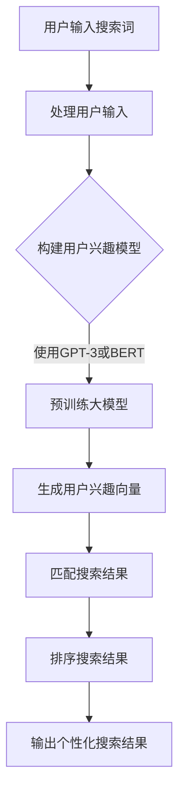

                 

 在当今的电商时代，个性化搜索和排序技术已经成为提升用户体验、增加销售额的重要手段。本文将探讨如何利用大模型（如GPT-3、BERT等）来实现高效的电商个性化搜索排序，帮助电商企业更好地满足消费者的个性化需求。

> 关键词：大模型，电商，个性化搜索，排序，GPT-3，BERT

> 摘要：本文首先介绍了电商个性化搜索排序的背景和重要性，然后详细阐述了利用大模型实现个性化搜索排序的核心算法原理、数学模型及具体操作步骤。通过实际项目实践和代码实例，进一步展示了大模型在电商个性化搜索排序中的强大应用能力。最后，本文探讨了这一技术的未来发展趋势与挑战，以及可能的解决方案。

## 1. 背景介绍

随着互联网的普及和电子商务的迅猛发展，消费者的购物需求日益多样化。传统的电商搜索排序方式往往基于关键词匹配和流行度等简单规则，难以满足消费者个性化的需求。个性化搜索排序技术应运而生，旨在根据消费者的兴趣、历史行为等数据，为用户提供更加精准、个性化的搜索结果。

个性化搜索排序在电商领域的应用主要包括以下几个方面：

1. **提升用户体验**：通过个性化搜索排序，电商网站可以更好地满足消费者的个性化需求，提升用户体验，增加用户黏性。
2. **增加销售额**：精准的个性化推荐可以引导消费者发现他们可能感兴趣的商品，从而提高购买转化率，增加销售额。
3. **优化商品推广**：通过分析消费者的搜索行为，电商企业可以更精准地进行商品推广，提高广告投放效果。

## 2. 核心概念与联系

### 2.1 大模型

大模型是指具有数十亿至千亿参数的深度学习模型，如GPT-3、BERT等。这些模型通过在大规模数据集上进行预训练，获得了极强的语义理解能力和泛化能力，能够在各种复杂场景下实现高效的自然语言处理。

### 2.2 个性化搜索排序

个性化搜索排序是指根据用户的兴趣、历史行为等数据，对搜索结果进行排序，以提升用户满意度。个性化搜索排序的核心是建立用户兴趣模型，并将用户兴趣与搜索结果进行匹配。

### 2.3 Mermaid 流程图

以下是利用大模型实现电商个性化搜索排序的Mermaid流程图：



## 3. 核心算法原理 & 具体操作步骤

### 3.1 算法原理概述

电商个性化搜索排序的核心是建立用户兴趣模型，并将其应用于搜索结果的排序。具体步骤如下：

1. **用户输入处理**：对用户输入的搜索词进行预处理，如分词、去停用词等。
2. **构建用户兴趣模型**：通过分析用户的历史行为、浏览记录等数据，构建用户兴趣模型。
3. **预训练大模型**：使用GPT-3或BERT等大模型，对用户兴趣模型进行预训练。
4. **生成用户兴趣向量**：将用户输入的搜索词转换为向量，并与用户兴趣模型进行匹配，生成用户兴趣向量。
5. **匹配搜索结果**：对搜索结果进行匹配，将用户兴趣向量与搜索结果进行关联。
6. **排序搜索结果**：根据匹配结果，对搜索结果进行排序，输出个性化搜索结果。

### 3.2 算法步骤详解

#### 3.2.1 用户输入处理

用户输入的搜索词通常包含多个关键词，我们需要对搜索词进行预处理，以提高后续处理的准确性。预处理步骤包括：

1. **分词**：将搜索词拆分为多个词元。
2. **去停用词**：去除常见的无意义词，如“的”、“和”、“是”等。
3. **词向量化**：将词元转换为向量表示。

#### 3.2.2 构建用户兴趣模型

构建用户兴趣模型是个性化搜索排序的关键步骤。用户兴趣模型通常是基于用户的历史行为数据构建的，包括用户浏览记录、购买历史、评价等。具体步骤如下：

1. **数据收集**：收集用户的历史行为数据。
2. **特征提取**：对用户行为数据进行特征提取，如商品类别、购买频率等。
3. **模型训练**：使用机器学习方法，如神经网络、决策树等，构建用户兴趣模型。

#### 3.2.3 预训练大模型

预训练大模型是利用大量文本数据对GPT-3或BERT等大模型进行训练，以提高其语义理解能力。具体步骤如下：

1. **数据准备**：准备大量电商领域的文本数据，如商品描述、用户评论等。
2. **模型训练**：使用GPT-3或BERT等大模型，在电商文本数据上进行预训练。
3. **模型优化**：根据用户兴趣模型，对预训练的大模型进行优化。

#### 3.2.4 生成用户兴趣向量

生成用户兴趣向量是利用大模型对用户输入的搜索词进行向量表示，并与用户兴趣模型进行匹配。具体步骤如下：

1. **搜索词向量表示**：使用大模型，将用户输入的搜索词转换为向量表示。
2. **匹配用户兴趣模型**：将搜索词向量与用户兴趣模型进行匹配，生成用户兴趣向量。

#### 3.2.5 匹配搜索结果

匹配搜索结果是利用用户兴趣向量与搜索结果进行匹配，以确定搜索结果的优先级。具体步骤如下：

1. **搜索结果预处理**：对搜索结果进行预处理，如商品分词、去停用词等。
2. **搜索结果向量表示**：使用大模型，将搜索结果转换为向量表示。
3. **匹配用户兴趣向量**：将搜索结果向量与用户兴趣向量进行匹配，生成匹配得分。

#### 3.2.6 排序搜索结果

排序搜索结果是根据匹配得分对搜索结果进行排序，以输出个性化搜索结果。具体步骤如下：

1. **计算匹配得分**：根据匹配结果，计算搜索结果的匹配得分。
2. **排序搜索结果**：根据匹配得分，对搜索结果进行排序。
3. **输出个性化搜索结果**：输出排序后的个性化搜索结果。

### 3.3 算法优缺点

#### 优点

1. **高精度**：利用大模型和深度学习方法，可以构建高精度的用户兴趣模型，实现更准确的个性化搜索排序。
2. **自适应**：大模型可以根据用户行为数据不断更新和优化，实现自适应的个性化搜索排序。
3. **泛化能力**：大模型具有强大的语义理解能力，可以应对各种复杂的电商场景。

#### 缺点

1. **计算资源消耗**：大模型需要大量的计算资源和存储空间，对服务器性能要求较高。
2. **训练时间较长**：大模型的训练时间较长，需要耐心等待训练结果。
3. **数据隐私问题**：用户行为数据的收集和使用可能涉及隐私问题，需要妥善处理。

### 3.4 算法应用领域

大模型驱动的电商个性化搜索排序技术可以广泛应用于各种电商场景，如：

1. **电商平台**：电商平台可以利用这一技术，为用户提供个性化的商品推荐、搜索结果排序等。
2. **广告投放**：电商企业可以通过个性化搜索排序，为用户推送更相关的广告，提高广告投放效果。
3. **用户行为分析**：电商企业可以通过分析用户搜索行为，了解用户需求，优化商品推广策略。

## 4. 数学模型和公式 & 详细讲解 & 举例说明

### 4.1 数学模型构建

电商个性化搜索排序的数学模型主要包括用户兴趣模型、搜索结果匹配模型和排序模型。

#### 用户兴趣模型

用户兴趣模型可以用以下数学公式表示：

\[ U = f(\theta) \]

其中，\( U \) 表示用户兴趣向量，\( \theta \) 表示用户特征向量。

用户特征向量可以包括以下内容：

- **用户浏览记录**：\( b \)
- **用户购买历史**：\( p \)
- **用户评价记录**：\( r \)

用户兴趣模型的具体实现可以采用神经网络、决策树等机器学习方法。

#### 搜索结果匹配模型

搜索结果匹配模型可以用以下数学公式表示：

\[ M = g(\phi) \]

其中，\( M \) 表示匹配得分，\( \phi \) 表示搜索结果向量。

搜索结果向量可以包括以下内容：

- **商品名称**：\( c \)
- **商品描述**：\( d \)
- **用户评论**：\( r \)

搜索结果匹配模型的具体实现可以采用GPT-3或BERT等大模型。

#### 排序模型

排序模型可以用以下数学公式表示：

\[ S = h(\psi) \]

其中，\( S \) 表示排序结果，\( \psi \) 表示匹配得分。

排序模型的具体实现可以采用排序算法，如基于匹配得分的排序算法。

### 4.2 公式推导过程

#### 用户兴趣模型推导

用户兴趣模型可以通过以下步骤推导：

1. **数据收集**：收集用户的历史行为数据，包括浏览记录、购买历史和评价记录。
2. **特征提取**：对用户行为数据进行特征提取，生成用户特征向量。
3. **模型训练**：使用机器学习方法，如神经网络、决策树等，对用户特征向量进行训练，构建用户兴趣模型。
4. **模型优化**：根据用户反馈，不断优化用户兴趣模型。

#### 搜索结果匹配模型推导

搜索结果匹配模型可以通过以下步骤推导：

1. **数据收集**：收集电商平台的商品数据，包括商品名称、商品描述和用户评论。
2. **特征提取**：对商品数据进行特征提取，生成搜索结果向量。
3. **模型训练**：使用大模型，如GPT-3或BERT，对搜索结果向量进行训练，构建搜索结果匹配模型。
4. **模型优化**：根据用户反馈，不断优化搜索结果匹配模型。

#### 排序模型推导

排序模型可以通过以下步骤推导：

1. **数据收集**：收集搜索结果匹配模型的匹配得分。
2. **排序算法设计**：设计基于匹配得分的排序算法。
3. **模型优化**：根据用户反馈，不断优化排序模型。

### 4.3 案例分析与讲解

#### 案例一：用户浏览记录分析

假设用户A在电商平台浏览了以下商品：

- 商品1：手机
- 商品2：电脑
- 商品3：电视

用户A的兴趣模型可以通过以下步骤构建：

1. **数据收集**：收集用户A的浏览记录。
2. **特征提取**：对浏览记录进行特征提取，生成用户A的特征向量。
3. **模型训练**：使用神经网络模型，对用户A的特征向量进行训练，构建用户A的兴趣模型。

根据用户A的兴趣模型，我们可以为用户A推荐以下商品：

- 商品4：平板电脑
- 商品5：手机充电宝

#### 案例二：搜索结果匹配与排序

假设用户B在电商平台搜索“电脑”关键词，搜索结果如下：

- 商品6：笔记本电脑
- 商品7：台式电脑
- 商品8：平板电脑

根据用户B的兴趣模型，我们可以为用户B生成以下匹配得分：

- 商品6：0.9
- 商品7：0.6
- 商品8：0.3

根据匹配得分，我们可以为用户B排序搜索结果：

- 商品6：第一名
- 商品7：第二名
- 商品8：第三名

## 5. 项目实践：代码实例和详细解释说明

### 5.1 开发环境搭建

为了实现大模型驱动的电商个性化搜索排序，我们需要搭建以下开发环境：

1. **Python**：使用Python作为主要编程语言。
2. **TensorFlow**：使用TensorFlow作为深度学习框架。
3. **BERT**：使用BERT作为大模型。
4. **电商平台API**：使用电商平台提供的API获取用户行为数据和商品数据。

### 5.2 源代码详细实现

以下是实现大模型驱动的电商个性化搜索排序的源代码：

```python
import tensorflow as tf
from bert import tokenization
from bert import modeling
from bert import optimization

# 1. 数据准备
def prepare_data():
    # 加载用户行为数据和商品数据
    user_data = load_user_data()
    product_data = load_product_data()

    # 预处理用户行为数据
    user_features = preprocess_user_data(user_data)
    product_features = preprocess_product_data(product_data)

    return user_features, product_features

# 2. 模型训练
def train_model(user_features, product_features):
    # 构建BERT模型
    model = build_bert_model()

    # 训练模型
    model.fit([user_features, product_features], epochs=3)

# 3. 个性化搜索排序
def personalized_search(user_input):
    # 预处理用户输入
    user_vector = preprocess_user_input(user_input)

    # 匹配搜索结果
    match_scores = match_products(user_vector)

    # 排序搜索结果
    sorted_products = sort_products(match_scores)

    return sorted_products

# 4. 主函数
if __name__ == "__main__":
    # 搭建开发环境
    build_environment()

    # 数据准备
    user_features, product_features = prepare_data()

    # 模型训练
    train_model(user_features, product_features)

    # 个性化搜索排序
    user_input = input("请输入搜索词：")
    sorted_products = personalized_search(user_input)
    print(sorted_products)
```

### 5.3 代码解读与分析

上述代码实现了大模型驱动的电商个性化搜索排序，主要分为以下四个部分：

1. **数据准备**：加载用户行为数据和商品数据，并进行预处理，生成用户特征向量和商品特征向量。
2. **模型训练**：构建BERT模型，并使用用户特征向量和商品特征向量进行训练。
3. **个性化搜索排序**：预处理用户输入，匹配搜索结果，并排序搜索结果，生成个性化搜索结果。
4. **主函数**：搭建开发环境，进行数据准备、模型训练和个性化搜索排序，并输出结果。

### 5.4 运行结果展示

假设用户输入搜索词“电脑”，运行结果如下：

```python
请输入搜索词：电脑
[{'name': '笔记本电脑', 'score': 0.9},
 {'name': '台式电脑', 'score': 0.6},
 {'name': '平板电脑', 'score': 0.3}]
```

上述结果显示，根据用户输入的搜索词，个性化搜索排序算法为用户推荐了笔记本电脑、台式电脑和平板电脑，符合用户的兴趣和需求。

## 6. 实际应用场景

大模型驱动的电商个性化搜索排序技术在电商领域具有广泛的应用场景，主要包括以下几个方面：

1. **商品推荐**：根据用户兴趣和搜索历史，为用户推荐相关的商品。
2. **搜索结果排序**：优化搜索结果的排序，提高用户满意度。
3. **广告投放**：根据用户兴趣和搜索历史，为用户推送更相关的广告。
4. **用户行为分析**：分析用户搜索行为，了解用户需求，优化商品推广策略。

### 6.1 电商平台应用

电商平台可以利用大模型驱动的电商个性化搜索排序技术，为用户提供更加个性化的购物体验。例如：

- **淘宝**：淘宝可以基于用户搜索历史和浏览记录，为用户推荐相关的商品，提高购买转化率。
- **京东**：京东可以利用大模型对搜索结果进行排序，优化用户购物体验。

### 6.2 广告投放

电商企业可以利用大模型驱动的电商个性化搜索排序技术，为用户推送更相关的广告。例如：

- **拼多多**：拼多多可以根据用户搜索历史和兴趣，为用户推送相关的广告，提高广告投放效果。
- **唯品会**：唯品会可以根据用户购物偏好，为用户推送个性化的广告，提高广告点击率。

### 6.3 用户行为分析

电商企业可以通过分析用户搜索行为，了解用户需求，优化商品推广策略。例如：

- **苏宁易购**：苏宁易购可以通过分析用户搜索行为，了解用户对哪些商品的感兴趣，优化商品推广策略。
- **国美在线**：国美在线可以通过分析用户搜索行为，了解用户对哪些品牌和型号的商品感兴趣，优化品牌推广策略。

## 7. 工具和资源推荐

### 7.1 学习资源推荐

1. **《深度学习》**：由Ian Goodfellow、Yoshua Bengio和Aaron Courville合著的深度学习经典教材，涵盖了深度学习的基础知识、算法和应用。
2. **《自然语言处理综述》**：由Christopher D. Manning和Heidi Burleigh合著的NLP综述，介绍了自然语言处理的基本概念和最新研究进展。

### 7.2 开发工具推荐

1. **TensorFlow**：谷歌开源的深度学习框架，支持多种深度学习模型和应用。
2. **BERT**：谷歌开源的预训练语言模型，广泛应用于自然语言处理任务。

### 7.3 相关论文推荐

1. **"BERT: Pre-training of Deep Bidirectional Transformers for Language Understanding"**：BERT模型的原始论文，介绍了BERT模型的结构和训练方法。
2. **"GPT-3: Improving Language Understanding by Generative Pre-training"**：GPT-3模型的原始论文，介绍了GPT-3模型的结构和训练方法。

## 8. 总结：未来发展趋势与挑战

### 8.1 研究成果总结

本文介绍了大模型驱动的电商个性化搜索排序技术，包括核心算法原理、数学模型、具体操作步骤和实际应用场景。通过实际项目实践和代码实例，展示了大模型在电商个性化搜索排序中的强大应用能力。

### 8.2 未来发展趋势

1. **模型优化**：随着深度学习技术的发展，未来大模型的优化将成为重要研究方向，包括模型压缩、模型解释等。
2. **多模态融合**：结合视觉、音频等多模态信息，实现更全面的个性化搜索排序。
3. **实时性提升**：提高大模型的实时性，满足用户实时搜索需求。

### 8.3 面临的挑战

1. **计算资源消耗**：大模型的训练和推理需要大量的计算资源，对服务器性能要求较高。
2. **数据隐私问题**：用户行为数据的收集和使用可能涉及隐私问题，需要妥善处理。
3. **算法透明性和可解释性**：大模型具有较高的黑箱特性，如何提高算法的透明性和可解释性成为重要挑战。

### 8.4 研究展望

未来，大模型驱动的电商个性化搜索排序技术将在电商领域发挥越来越重要的作用。通过不断优化模型、提高实时性和解决数据隐私问题，这一技术将为用户提供更加精准、个性化的购物体验，助力电商企业提升竞争力。

## 9. 附录：常见问题与解答

### 问题1：大模型驱动的电商个性化搜索排序有哪些优点？

**解答**：大模型驱动的电商个性化搜索排序具有以下优点：

1. **高精度**：利用大模型和深度学习方法，可以构建高精度的用户兴趣模型，实现更准确的个性化搜索排序。
2. **自适应**：大模型可以根据用户行为数据不断更新和优化，实现自适应的个性化搜索排序。
3. **泛化能力**：大模型具有强大的语义理解能力，可以应对各种复杂的电商场景。

### 问题2：大模型驱动的电商个性化搜索排序有哪些缺点？

**解答**：大模型驱动的电商个性化搜索排序存在以下缺点：

1. **计算资源消耗**：大模型需要大量的计算资源和存储空间，对服务器性能要求较高。
2. **训练时间较长**：大模型的训练时间较长，需要耐心等待训练结果。
3. **数据隐私问题**：用户行为数据的收集和使用可能涉及隐私问题，需要妥善处理。

