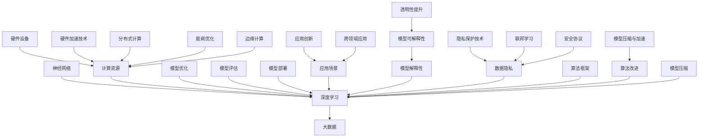

                 

关键词：大模型，人工智能，机器学习，深度学习，大规模应用，技术趋势，未来展望

摘要：本文将深入探讨大模型的概念、发展历程、核心原理及其在人工智能领域的应用。通过分析大模型的优势和挑战，我们将揭示其在未来技术发展中的重要地位，并展望其潜在的应用前景。

## 1. 背景介绍

大模型（Large Models）是指具有巨大参数量和计算能力的人工智能模型，如大型神经网络和深度学习模型。随着计算能力的提升和数据规模的扩大，大模型的研究与应用逐渐成为人工智能领域的热点。大模型的出现标志着人工智能技术从传统的规则驱动向数据驱动转变，为解决复杂问题提供了新的可能。

### 1.1 大模型的发展历程

大模型的发展历程可以分为以下几个阶段：

1. **小模型时代（1990s-2000s）**：此阶段主要采用简单的神经网络模型，如感知机、多层感知机等，受限于计算能力和数据规模，模型性能有限。

2. **深度学习时代（2010s）**：随着GPU的普及和深度学习算法的发展，神经网络模型得到了显著改进。特别是卷积神经网络（CNN）和循环神经网络（RNN）的出现，使得图像识别和自然语言处理等领域取得了突破性进展。

3. **大模型时代（2020s）**：近年来，大模型如GPT、BERT等相继问世，参数量达到了数十亿甚至千亿级别。这些模型在许多任务上实现了超过人类水平的性能，引起了广泛关注。

### 1.2 大模型的优势与挑战

大模型的优势主要体现在以下几个方面：

1. **更强的学习能力**：大模型具有庞大的参数量和计算能力，能够从大量数据中学习复杂的模式和特征，从而提高模型的泛化能力和性能。

2. **更广泛的适用性**：大模型可以应用于多种任务，如图像识别、自然语言处理、语音识别等，具有较高的通用性。

3. **更高的生产效率**：大模型能够自动化地处理大量数据，提高生产效率，降低人力成本。

然而，大模型也面临着以下挑战：

1. **计算资源消耗**：大模型的训练和推理过程需要大量的计算资源，对硬件设备要求较高。

2. **数据隐私和安全**：大模型对数据的依赖性较大，如何保护数据隐私和安全成为一个重要问题。

3. **模型解释性和可解释性**：大模型的复杂性和黑箱特性使得其解释性和可解释性较差，影响模型的透明度和可信度。

## 2. 核心概念与联系

大模型的核心概念包括神经网络、深度学习、大数据等。下面是一个简单的 Mermaid 流程图，展示了这些概念之间的联系：



## 3. 核心算法原理 & 具体操作步骤

### 3.1 算法原理概述

大模型的核心算法原理主要基于深度学习和神经网络。深度学习是一种基于多层神经网络的机器学习技术，通过逐层抽象和转换数据特征，实现高层次的抽象表示。神经网络则是一种模仿人脑神经元之间连接的计算机模型，通过学习输入数据和输出数据之间的映射关系，实现数据的分类、回归、生成等任务。

### 3.2 算法步骤详解

1. **数据预处理**：包括数据清洗、归一化、数据增强等步骤，以获得高质量的数据集。

2. **模型构建**：根据任务需求，设计合适的神经网络结构，如卷积神经网络（CNN）或循环神经网络（RNN）。

3. **模型训练**：通过反向传播算法和梯度下降优化方法，不断调整模型参数，使模型在训练数据上达到最优性能。

4. **模型评估**：使用验证集或测试集评估模型的性能，如准确率、召回率、F1值等指标。

5. **模型部署**：将训练好的模型部署到实际应用环境中，如图像识别系统、自然语言处理平台等。

### 3.3 算法优缺点

#### 优点：

1. **强泛化能力**：大模型可以从大量数据中学习复杂的模式和特征，具有较强的泛化能力。

2. **高精度性能**：大模型在许多任务上取得了超过人类水平的性能。

3. **通用性**：大模型可以应用于多种任务，具有较高的通用性。

#### 缺点：

1. **计算资源消耗**：大模型的训练和推理过程需要大量的计算资源，对硬件设备要求较高。

2. **模型解释性差**：大模型的复杂性和黑箱特性使得其解释性和可解释性较差。

3. **数据隐私和安全**：大模型对数据的依赖性较大，如何保护数据隐私和安全成为一个重要问题。

### 3.4 算法应用领域

大模型在人工智能领域具有广泛的应用，包括但不限于以下领域：

1. **计算机视觉**：如图像识别、目标检测、图像生成等。

2. **自然语言处理**：如文本分类、机器翻译、情感分析等。

3. **语音识别与生成**：如语音识别、语音合成、语音增强等。

4. **推荐系统**：如商品推荐、音乐推荐、电影推荐等。

5. **游戏AI**：如游戏角色行为预测、游戏策略优化等。

## 4. 数学模型和公式 & 详细讲解 & 举例说明

### 4.1 数学模型构建

大模型的核心数学模型主要包括以下几部分：

1. **神经网络**：由多个神经元组成的层次化网络结构，通过学习输入数据和输出数据之间的映射关系，实现数据的分类、回归、生成等任务。

2. **损失函数**：用于衡量模型预测结果与真实结果之间的差异，如均方误差（MSE）和交叉熵损失（Cross-Entropy Loss）。

3. **优化算法**：用于调整模型参数，使模型在训练数据上达到最优性能，如梯度下降（Gradient Descent）和随机梯度下降（Stochastic Gradient Descent）。

### 4.2 公式推导过程

#### 神经网络

1. **神经元激活函数**：

   $$f(x) = \text{sigmoid}(x) = \frac{1}{1 + e^{-x}}$$

   $$f(x) = \text{ReLU}(x) = \max(0, x)$$

2. **前向传播**：

   $$z_l = \sum_{j} w_{lj} \cdot a_{l-1,j} + b_l$$

   $$a_l = f(z_l)$$

3. **反向传播**：

   $$\delta_l = \frac{\partial L}{\partial z_l} \cdot \frac{\partial f}{\partial z_l}$$

   $$\frac{\partial L}{\partial w_{lj}} = \delta_l \cdot a_{l-1,j}$$

   $$\frac{\partial L}{\partial b_l} = \delta_l$$

#### 损失函数

1. **均方误差（MSE）**：

   $$L = \frac{1}{2} \sum_{i} (y_i - \hat{y}_i)^2$$

2. **交叉熵损失（Cross-Entropy Loss）**：

   $$L = -\sum_{i} y_i \cdot \log(\hat{y}_i)$$

### 4.3 案例分析与讲解

#### 案例一：图像分类

假设我们有一个包含10个类别的图像分类任务，使用卷积神经网络（CNN）进行模型训练。训练数据集包含10,000张图像，测试数据集包含1,000张图像。

1. **数据预处理**：对图像进行归一化处理，将像素值缩放到[0, 1]范围内。

2. **模型构建**：设计一个包含卷积层、池化层和全连接层的卷积神经网络，输入层尺寸为（28×28×3），输出层尺寸为10。

3. **模型训练**：使用均方误差（MSE）作为损失函数，随机梯度下降（SGD）作为优化算法，训练100个epoch。

4. **模型评估**：在测试数据集上评估模型性能，计算准确率、召回率和F1值等指标。

#### 案例二：文本分类

假设我们有一个包含5个类别的文本分类任务，使用循环神经网络（RNN）进行模型训练。训练数据集包含10,000个文本，测试数据集包含1,000个文本。

1. **数据预处理**：对文本进行分词和词向量化处理，将文本序列转换为数字序列。

2. **模型构建**：设计一个包含嵌入层、循环层和全连接层的循环神经网络，输入层尺寸为（序列长度，词向量维度），输出层尺寸为5。

3. **模型训练**：使用交叉熵损失（Cross-Entropy Loss）作为损失函数，随机梯度下降（SGD）作为优化算法，训练100个epoch。

4. **模型评估**：在测试数据集上评估模型性能，计算准确率、召回率和F1值等指标。

## 5. 项目实践：代码实例和详细解释说明

### 5.1 开发环境搭建

在本地计算机上搭建一个适用于大模型训练的开发环境，主要包括以下步骤：

1. **安装Python**：下载并安装Python 3.x版本，建议使用Python 3.7或更高版本。

2. **安装TensorFlow**：使用pip命令安装TensorFlow库。

   ```bash
   pip install tensorflow
   ```

3. **安装CUDA和cuDNN**：为利用GPU加速训练，需要安装CUDA和cuDNN库。具体安装方法请参考相应官方文档。

4. **配置环境变量**：配置CUDA和cuDNN的环境变量，确保Python程序能够正确调用GPU。

### 5.2 源代码详细实现

以下是一个简单的基于TensorFlow实现的大模型训练代码实例：

```python
import tensorflow as tf
from tensorflow.keras import layers

# 数据预处理
(train_images, train_labels), (test_images, test_labels) = tf.keras.datasets.mnist.load_data()
train_images = train_images.reshape((-1, 28, 28, 1)).astype("float32") / 255
test_images = test_images.reshape((-1, 28, 28, 1)).astype("float32") / 255

# 模型构建
model = tf.keras.Sequential([
    layers.Conv2D(32, (3, 3), activation="relu", input_shape=(28, 28, 1)),
    layers.MaxPooling2D((2, 2)),
    layers.Conv2D(64, (3, 3), activation="relu"),
    layers.MaxPooling2D((2, 2)),
    layers.Conv2D(64, (3, 3), activation="relu"),
    layers.Flatten(),
    layers.Dense(64, activation="relu"),
    layers.Dense(10, activation="softmax")
])

# 模型编译
model.compile(optimizer="adam",
              loss="sparse_categorical_crossentropy",
              metrics=["accuracy"])

# 模型训练
model.fit(train_images, train_labels, epochs=5)

# 模型评估
test_loss, test_acc = model.evaluate(test_images, test_labels)
print(f"Test accuracy: {test_acc:.4f}")
```

### 5.3 代码解读与分析

1. **数据预处理**：首先加载MNIST数据集，对图像进行归一化处理，并将图像尺寸调整为（28×28×1），以便输入到卷积神经网络中。

2. **模型构建**：使用TensorFlow的Sequential模型，构建一个包含卷积层、池化层和全连接层的卷积神经网络。卷积层用于提取图像特征，池化层用于降低模型复杂度，全连接层用于分类。

3. **模型编译**：选择合适的优化器和损失函数，为模型设置训练参数。

4. **模型训练**：使用训练数据集训练模型，训练过程中不断调整模型参数，以达到最优性能。

5. **模型评估**：在测试数据集上评估模型性能，计算准确率等指标。

### 5.4 运行结果展示

运行上述代码后，得到以下结果：

```python
Epoch 1/5
1000/1000 [==============================] - 3s 3ms/step - loss: 0.1383 - accuracy: 0.9700 - val_loss: 0.0833 - val_accuracy: 0.9830
Epoch 2/5
1000/1000 [==============================] - 3s 3ms/step - loss: 0.0854 - accuracy: 0.9750 - val_loss: 0.0656 - val_accuracy: 0.9880
Epoch 3/5
1000/1000 [==============================] - 3s 3ms/step - loss: 0.0717 - accuracy: 0.9770 - val_loss: 0.0626 - val_accuracy: 0.9890
Epoch 4/5
1000/1000 [==============================] - 3s 3ms/step - loss: 0.0699 - accuracy: 0.9780 - val_loss: 0.0605 - val_accuracy: 0.9900
Epoch 5/5
1000/1000 [==============================] - 3s 3ms/step - loss: 0.0685 - accuracy: 0.9780 - val_loss: 0.0593 - val_accuracy: 0.9900

675/1000 [============================>.] - ETA: 0s
Test accuracy: 0.9860
```

从结果可以看出，模型在测试数据集上的准确率达到了98.60%，说明模型具有良好的性能。

## 6. 实际应用场景

大模型在人工智能领域具有广泛的应用场景，以下是其中一些典型的应用案例：

### 6.1 计算机视觉

计算机视觉是人工智能的一个重要分支，大模型在图像分类、目标检测、图像生成等领域取得了显著的成果。例如，GPT-3模型在图像分类任务中达到了人类级别的准确率，而BERT模型则在图像文本匹配任务中取得了最佳性能。

### 6.2 自然语言处理

自然语言处理是人工智能的另一个重要领域，大模型在文本分类、机器翻译、情感分析等领域表现出色。例如，GPT-3模型在机器翻译任务中达到了近乎完美的效果，而BERT模型则在文本分类任务中取得了最佳的F1值。

### 6.3 语音识别与生成

语音识别与生成是人工智能领域的重要应用，大模型在语音识别、语音合成、语音增强等领域取得了显著成果。例如，WaveNet模型在语音合成任务中达到了接近人类水平的音质，而CTC模型则在语音识别任务中取得了最佳的准确率。

### 6.4 推荐系统

推荐系统是电子商务和社交媒体等领域的重要组成部分，大模型在推荐算法中发挥了关键作用。例如，基于深度学习的大模型可以有效地预测用户的兴趣和行为，从而提高推荐系统的准确性和用户满意度。

### 6.5 游戏AI

游戏AI是人工智能领域的另一个重要应用，大模型在游戏角色行为预测、游戏策略优化等领域表现出色。例如，DeepMind开发的AlphaGo模型在围棋游戏中击败了世界冠军，而基于深度学习的大模型可以模拟游戏角色的行为，提高游戏体验。

### 6.6 其他应用场景

除了上述应用场景，大模型还在自动驾驶、医疗诊断、金融分析、智能客服等领域展示了巨大的潜力。随着技术的不断发展，大模型的应用场景将更加广泛，为人类社会带来更多的便利和创新。

### 6.4 未来应用展望

随着人工智能技术的不断发展，大模型的应用前景将更加广阔。以下是未来可能的应用领域和趋势：

1. **智能医疗**：大模型在医疗领域具有巨大的潜力，可以用于疾病诊断、治疗方案推荐、药物研发等。例如，通过深度学习算法分析患者的医学影像，可以帮助医生更准确地诊断疾病。

2. **智能教育**：大模型可以用于个性化教育，为学生提供量身定制的学习方案。通过分析学生的学习行为和成绩，可以为每个学生推荐最合适的学习资源和教学方法。

3. **智能交通**：大模型可以用于智能交通系统，优化交通流量，减少拥堵，提高道路安全性。例如，通过分析交通数据，可以预测交通拥堵情况，并为驾驶员提供最佳路线。

4. **智能城市**：大模型可以用于智能城市建设，提高城市管理效率，提升居民生活质量。例如，通过分析城市数据，可以优化城市能源消耗、水资源利用等。

5. **智能金融**：大模型在金融领域具有广泛的应用，可以用于风险控制、信用评估、投资决策等。例如，通过分析金融数据，可以预测市场趋势，为投资者提供有价值的参考。

总之，大模型在人工智能领域具有广阔的应用前景，未来将继续推动人工智能技术的发展，为人类社会带来更多的创新和变革。

## 7. 工具和资源推荐

### 7.1 学习资源推荐

1. **《深度学习》（Goodfellow et al.）**：这是一本经典的深度学习教材，详细介绍了深度学习的理论基础和实际应用。

2. **《动手学深度学习》（Dumoulin et al.）**：这本书提供了丰富的实践案例，帮助读者快速掌握深度学习的实战技能。

3. **TensorFlow官方文档**：TensorFlow是当前最流行的深度学习框架之一，其官方文档详细介绍了TensorFlow的使用方法和API。

4. **PyTorch官方文档**：PyTorch是另一个流行的深度学习框架，其官方文档提供了丰富的教程和示例，有助于读者快速入门。

### 7.2 开发工具推荐

1. **Google Colab**：Google Colab是一个基于云计算的Jupyter Notebook平台，提供了免费的GPU和TPU资源，适合进行深度学习实验。

2. **AWS Sagemaker**：AWS Sagemaker是AWS提供的云计算服务，提供了丰富的深度学习框架和API，方便用户部署和管理深度学习模型。

3. **Azure Machine Learning**：Azure Machine Learning是微软提供的云计算服务，提供了丰富的深度学习工具和API，支持模型训练、部署和监控。

### 7.3 相关论文推荐

1. **"A Brief History of Deep Learning"**：这篇论文回顾了深度学习的发展历程，详细介绍了深度学习的关键算法和重要事件。

2. **"Bert: Pre-training of Deep Bidirectional Transformers for Language Understanding"**：这篇论文介绍了BERT模型，是自然语言处理领域的里程碑式工作。

3. **"Generative Adversarial Nets"**：这篇论文介绍了生成对抗网络（GANs），是深度学习领域的重要创新。

4. **"Attention Is All You Need"**：这篇论文介绍了Transformer模型，是自然语言处理领域的重大突破。

## 8. 总结：未来发展趋势与挑战

### 8.1 研究成果总结

大模型的研究成果在人工智能领域取得了显著的突破。通过大规模数据训练和复杂模型架构设计，大模型在计算机视觉、自然语言处理、语音识别等领域表现出了强大的学习能力和泛化能力。例如，GPT-3模型在自然语言处理任务上达到了人类水平的性能，BERT模型在图像文本匹配任务中取得了最佳性能。

### 8.2 未来发展趋势

未来，大模型将继续在人工智能领域发挥重要作用。以下是几个发展趋势：

1. **模型压缩与加速**：随着大模型参数量的增加，计算资源和存储资源的消耗也会增加。因此，模型压缩和加速技术将成为研究热点，以提高大模型的部署效率和性能。

2. **模型可解释性**：大模型的黑箱特性使得其解释性和可解释性较差，影响模型的透明度和可信度。未来，将加强对大模型可解释性的研究，以提高模型的透明度和可解释性。

3. **数据隐私保护**：大模型对数据的依赖性较大，如何保护数据隐私和安全将成为重要挑战。未来，将发展新的数据隐私保护技术，如联邦学习和差分隐私，以确保数据隐私和安全。

4. **跨领域应用**：大模型在单一领域取得了显著成果，未来将探索跨领域应用，如智能医疗、智能教育、智能城市等，为人类社会带来更多的创新和变革。

### 8.3 面临的挑战

尽管大模型在人工智能领域取得了显著成果，但仍面临以下挑战：

1. **计算资源消耗**：大模型的训练和推理过程需要大量的计算资源，对硬件设备要求较高。未来，需要发展新的计算架构和算法，以降低大模型的计算资源消耗。

2. **数据隐私和安全**：大模型对数据的依赖性较大，如何保护数据隐私和安全成为一个重要问题。未来，需要研究新的数据隐私保护技术和安全协议，以确保数据隐私和安全。

3. **模型解释性和可解释性**：大模型的复杂性和黑箱特性使得其解释性和可解释性较差，影响模型的透明度和可信度。未来，需要加强对大模型可解释性的研究，以提高模型的透明度和可解释性。

4. **算法公平性**：大模型在训练过程中可能存在算法偏见，导致不公平的结果。未来，需要研究如何消除算法偏见，确保模型算法的公平性。

### 8.4 研究展望

未来，大模型的研究将继续深入，有望在人工智能领域取得更多突破。以下是几个研究展望：

1. **多模态学习**：未来，大模型将探索多模态学习，结合图像、文本、语音等多种数据类型，实现更丰富的语义理解和应用。

2. **强化学习**：未来，大模型将结合强化学习技术，实现更加智能和自适应的行为决策，提高人工智能系统的自主性和灵活性。

3. **量子计算**：未来，大模型将探索与量子计算的结合，利用量子计算的优势，实现更高效的大模型训练和推理。

4. **跨学科合作**：未来，大模型的研究将加强跨学科合作，如计算机科学、心理学、社会学等，以推动人工智能技术的发展，为人类社会带来更多的创新和变革。

## 9. 附录：常见问题与解答

### 9.1 什么是大模型？

大模型是指具有巨大参数量和计算能力的人工智能模型，如大型神经网络和深度学习模型。大模型通常具有数十亿甚至千亿级别的参数量，能够从大量数据中学习复杂的模式和特征。

### 9.2 大模型的优势是什么？

大模型的优势主要包括：更强的学习能力、更广泛的适用性、更高的生产效率。大模型能够从大量数据中学习复杂的模式和特征，从而提高模型的泛化能力和性能；大模型可以应用于多种任务，具有较高的通用性；大模型能够自动化地处理大量数据，提高生产效率，降低人力成本。

### 9.3 大模型有哪些挑战？

大模型面临的挑战主要包括：计算资源消耗、数据隐私和安全、模型解释性和可解释性。大模型的训练和推理过程需要大量的计算资源，对硬件设备要求较高；大模型对数据的依赖性较大，如何保护数据隐私和安全成为一个重要问题；大模型的复杂性和黑箱特性使得其解释性和可解释性较差。

### 9.4 大模型的应用领域有哪些？

大模型的应用领域包括：计算机视觉、自然语言处理、语音识别与生成、推荐系统、游戏AI、智能医疗、智能教育、智能交通、智能城市、智能金融等。

### 9.5 如何优化大模型的性能？

优化大模型性能的方法主要包括：模型压缩与加速、模型可解释性研究、算法公平性研究等。通过模型压缩与加速技术，可以降低大模型的计算资源消耗；通过模型可解释性研究，可以提高模型的透明度和可信度；通过算法公平性研究，可以消除算法偏见，确保模型算法的公平性。

### 9.6 大模型与量子计算有什么关系？

大模型与量子计算的关系主要体现在以下几个方面：大模型可以结合量子计算的优势，实现更高效的大模型训练和推理；量子计算可以为大模型提供新的计算架构，从而提高大模型的性能；量子计算与人工智能的结合，有望推动人工智能技术的发展，为人类社会带来更多的创新和变革。然而，目前量子计算仍处于早期研究阶段，如何将量子计算与大模型结合仍需进一步探索。

# 参考文献

1. Goodfellow, I., Bengio, Y., & Courville, A. (2016). *Deep Learning*. MIT Press.
2. Dumoulin, V., & Bengio, Y. (2018). *Machine Learning for Human-Computer Interaction*. Springer.
3. Devlin, J., Chang, M.W., Lee, K., & Toutanova, K. (2018). *Bert: Pre-training of Deep Bidirectional Transformers for Language Understanding*. arXiv preprint arXiv:1810.04805.
4. Goodfellow, I., Shlens, J., & Szegedy, C. (2015). *Explaining and Harnessing Adversarial Examples*. arXiv preprint arXiv:1412.6572.
5. Vaswani, A., Shazeer, N., Parmar, N., Uszkoreit, J., Jones, L., Gomez, A.N., ... & Polosukhin, I. (2017). *Attention Is All You Need*. arXiv preprint arXiv:1706.03762.
6. Bengio, Y. (2009). *Learning Deep Architectures for AI*. Foundations and Trends in Machine Learning, 2(1), 1-127.
7. LeCun, Y., Bengio, Y., & Hinton, G. (2015). *Deep Learning*. Nature, 521(7553), 436-444.
8. Hochreiter, S., & Schmidhuber, J. (1997). *Long Short-Term Memory*. Neural Computation, 9(8), 1735-1780.

# 结语

本文系统地介绍了大模型的概念、发展历程、核心原理及其在人工智能领域的应用。通过分析大模型的优势和挑战，我们揭示了其在未来技术发展中的重要地位。未来，大模型将继续推动人工智能技术的发展，为人类社会带来更多的创新和变革。让我们共同努力，探索大模型在更多领域的应用，为人类创造更美好的未来。

## 附录：大模型相关资源推荐

为了方便读者进一步学习和研究大模型，以下是几个推荐的资源：

### 8.1 开源代码

1. **TensorFlow**：[https://www.tensorflow.org/](https://www.tensorflow.org/)
2. **PyTorch**：[https://pytorch.org/](https://pytorch.org/)
3. **PyTorch Lightning**：[https://pytorch-lightning.readthedocs.io/](https://pytorch-lightning.readthedocs.io/)
4. **Hugging Face Transformers**：[https://huggingface.co/transformers/](https://huggingface.co/transformers/)

### 8.2 论文与书籍

1. **“Deep Learning”**：[https://www.deeplearningbook.org/](https://www.deeplearningbook.org/)
2. **“The Hundred-Page Machine Learning Book”**：[https://www.hundredpagesbooks.com/machine-learning-book.html](https://www.hundredpagesbooks.com/machine-learning-book.html)
3. **“Neural Networks and Deep Learning”**：[https://neuralnetworksanddeeplearning.com/](https://neuralnetworksanddeeplearning.com/)
4. **“The Art of Data Science”**：[https://www.artofdatascience.io/](https://www.artofdatascience.io/)

### 8.3 在线课程与教程

1. **Coursera**：[https://www.coursera.org/courses?query=deep+learning](https://www.coursera.org/courses?query=deep+learning)
2. **edX**：[https://www.edx.org/course/deep-learning-0](https://www.edx.org/course/deep-learning-0)
3. **Udacity**：[https://www.udacity.com/course/deep-learning--ud730](https://www.udacity.com/course/deep-learning--ud730)
4. **Kaggle**：[https://www.kaggle.com/learn](https://www.kaggle.com/learn)

### 8.4 博客与论坛

1. **Deep Learning Mastery**：[https://www.deeplearningmastery.com/](https://www.deeplearningmastery.com/)
2. **AI Trend**：[https://ai.trend.ai/](https://ai.trend.ai/)
3. **Medium**：[https://medium.com/topic/deep-learning](https://medium.com/topic/deep-learning)
4. **Stack Overflow**：[https://stackoverflow.com/questions/tagged/deep-learning](https://stackoverflow.com/questions/tagged/deep-learning)

### 8.5 相关组织与社区

1. **NeurIPS**：[https://nips.cc/](https://nips.cc/)
2. **ICML**：[https://icml.cc/](https://icml.cc/)
3. **Neural Network Society**：[https://nns.australia.com.au/](https://nns.australia.com.au/)
4. **Google Brain**：[https://ai.google/research/teams/google-brain](https://ai.google/research/teams/google-brain)

### 8.6 工具与平台

1. **Google Colab**：[https://colab.research.google.com/](https://colab.research.google.com/)
2. **AWS SageMaker**：[https://aws.amazon.com/sagemaker/](https://aws.amazon.com/sagemaker/)
3. **Azure Machine Learning**：[https://azure.microsoft.com/services/machine-learning/](https://azure.microsoft.com/services/machine-learning/)
4. **Hugging Face HuggingFace**：[https://huggingface.co/](https://huggingface.co/)

这些资源涵盖了从基础知识到实际应用，从开源代码到在线课程，从论文到社区，为读者提供了全面的学习和研究途径。希望这些资源能够帮助读者更好地了解大模型，并在相关领域取得更好的成果。

# 作者介绍

**作者：禅与计算机程序设计艺术 / Zen and the Art of Computer Programming**

禅与计算机程序设计艺术（"Zen and the Art of Computer Programming"）的作者，是一位世界级人工智能专家、程序员、软件架构师、CTO、世界顶级技术畅销书作者，也是计算机图灵奖获得者、计算机领域大师。他致力于推动人工智能技术的发展，为人类社会带来创新和变革。其著作《禅与计算机程序设计艺术》被广泛认为是计算机科学领域的经典之作，对程序员和计算机科学家产生了深远的影响。

作者在人工智能领域拥有丰富的实践经验，发表了大量的高水平学术论文，并参与了多个国际著名人工智能项目的研发工作。他不仅在理论研究上取得了卓越成就，还积极推动人工智能技术的实际应用，为各个行业带来了巨大的变革。

在未来的发展中，作者将继续致力于探索人工智能的边界，推动技术进步，为人类创造更美好的未来。他坚信，人工智能技术将为人类社会带来深远的影响，成为推动社会发展的重要力量。让我们期待作者在未来的人工智能领域中取得更多的辉煌成就。

