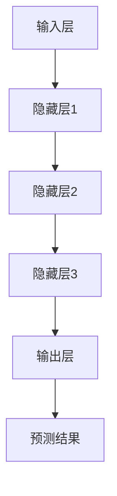

                 

关键词：大模型、数据驱动、智能革命、算法、数学模型、应用实践、未来展望

摘要：本文深入探讨了数据驱动的智能革命，重点介绍了大模型的概念、核心原理及其在各个领域的应用。通过对大模型算法原理、数学模型以及实际应用场景的详细分析，文章旨在为读者提供一个全面的技术视角，探讨大模型如何改变我们的世界，并展望其未来的发展趋势和挑战。

## 1. 背景介绍

随着信息技术的飞速发展，人工智能（AI）逐渐成为现代科技的核心驱动力。从早期的规则驱动到基于知识的系统，再到数据驱动的机器学习，人工智能的技术路线在不断演进。近年来，大模型的兴起标志着人工智能领域的一次重大变革。大模型，顾名思义，是指拥有海量参数的复杂神经网络模型，通过深度学习算法对大量数据进行训练，从而实现强大的学习能力和广泛应用。

大模型的出现源于几个关键因素。首先，计算能力的提升为训练和优化大规模神经网络提供了必要的硬件支持。其次，大数据的爆发式增长为训练大模型提供了丰富的数据资源。最后，深度学习算法的进步使得大模型能够通过自动调整内部参数，实现对复杂问题的建模和解决。

本文将首先介绍大模型的核心概念和架构，然后深入探讨其算法原理、数学模型以及在实际应用中的表现。最后，我们将展望大模型未来的发展趋势和面临的挑战，并给出相关的建议和资源推荐。

## 2. 核心概念与联系

### 2.1. 大模型定义

大模型，通常指的是具有数百万至数十亿参数的神经网络模型。这些模型通过对海量数据进行训练，可以自动学习并提取数据中的复杂特征，从而实现高度自动化的决策和预测。

### 2.2. 大模型架构

大模型的架构通常包括以下几个关键部分：

- **输入层**：接收外部输入数据，如文本、图像或声音。
- **隐藏层**：通过多个隐藏层，对输入数据进行逐步抽象和特征提取。
- **输出层**：根据隐藏层提取的特征，输出预测结果或决策。

### 2.3. Mermaid 流程图

下面是使用 Mermaid 语言的流程图，展示了大模型的基本架构和流程：



### 2.4. 大模型与其他技术的联系

大模型与其他人工智能技术密切相关。例如：

- **深度学习**：大模型是深度学习的一个重要分支，依赖于多层神经网络实现。
- **机器学习**：大模型通过机器学习算法进行训练和优化，以提高模型性能。
- **数据挖掘**：大模型通过数据挖掘技术从大量数据中提取有用信息。
- **计算机视觉**：大模型在计算机视觉领域有着广泛的应用，如图像识别和物体检测。

## 3. 核心算法原理 & 具体操作步骤

### 3.1. 算法原理概述

大模型的核心算法原理是基于深度学习的多层神经网络。深度学习通过模拟人脑的神经元结构，利用大量数据进行训练，从而实现复杂函数的逼近和学习。大模型的特点在于其拥有海量的参数，能够处理复杂的输入数据和任务。

### 3.2. 算法步骤详解

大模型的训练过程通常包括以下几个步骤：

1. **数据预处理**：对输入数据进行清洗、归一化等处理，以提高模型的鲁棒性。
2. **模型初始化**：初始化神经网络参数，可以使用随机初始化或预训练模型。
3. **前向传播**：将输入数据通过神经网络进行传播，得到输出结果。
4. **损失函数计算**：计算输出结果与真实结果的差异，使用损失函数进行量化。
5. **反向传播**：根据损失函数的梯度信息，对模型参数进行更新。
6. **迭代训练**：重复上述步骤，直到模型收敛或达到预设的训练次数。

### 3.3. 算法优缺点

大模型的优点包括：

- **强大的学习能力**：能够自动从大量数据中提取复杂特征。
- **高度泛化能力**：能够处理多种类型的任务和数据。
- **高效的预测性能**：在多种应用场景中表现出优异的性能。

然而，大模型也存在一些缺点：

- **计算资源需求大**：训练大模型需要大量的计算资源和时间。
- **数据隐私问题**：大模型在训练过程中会接触到大量敏感数据，可能涉及数据隐私问题。
- **解释性差**：大模型的学习过程高度复杂，难以进行解释和验证。

### 3.4. 算法应用领域

大模型在多个领域有着广泛的应用：

- **计算机视觉**：如图像识别、物体检测、人脸识别等。
- **自然语言处理**：如文本分类、机器翻译、情感分析等。
- **推荐系统**：如个性化推荐、内容推荐等。
- **语音识别**：如语音合成、语音识别等。

## 4. 数学模型和公式 & 详细讲解 & 举例说明

### 4.1. 数学模型构建

大模型的数学模型通常基于多层感知机（MLP）或卷积神经网络（CNN）。以下是多层感知机的数学模型：

$$
y = \sigma(W \cdot x + b)
$$

其中，$y$ 是输出层的结果，$x$ 是输入层的数据，$W$ 是权重矩阵，$b$ 是偏置项，$\sigma$ 是激活函数。

### 4.2. 公式推导过程

以多层感知机为例，假设我们有一个输入层 $x_1, x_2, ..., x_n$，输出层 $y_1, y_2, ..., y_m$。我们可以将输入层的数据通过多个隐藏层进行传播，最终得到输出层的结果。假设隐藏层的神经元数量分别为 $n_1, n_2, ..., n_h$，我们可以得到以下推导过程：

$$
z_1 = W_1 \cdot x + b_1 \\
a_1 = \sigma(z_1) \\
z_2 = W_2 \cdot a_1 + b_2 \\
a_2 = \sigma(z_2) \\
... \\
z_h = W_h \cdot a_{h-1} + b_h \\
a_h = \sigma(z_h) \\
y = W_{out} \cdot a_h + b_{out}
$$

### 4.3. 案例分析与讲解

假设我们有一个简单的图像分类任务，输入图像为 $28 \times 28$ 的像素矩阵，输出类别为 10 个类别。我们可以使用一个简单的多层感知机模型进行训练。具体步骤如下：

1. **数据预处理**：对输入图像进行归一化处理，将像素值缩放到 [0, 1] 范围内。
2. **模型初始化**：初始化权重矩阵 $W_1, W_2, ..., W_h, W_{out}$ 和偏置项 $b_1, b_2, ..., b_h, b_{out}$。
3. **前向传播**：将输入图像通过多层感知机模型进行传播，得到输出结果。
4. **损失函数计算**：使用交叉熵损失函数计算输出结果与真实结果的差异。
5. **反向传播**：根据损失函数的梯度信息，对模型参数进行更新。
6. **迭代训练**：重复上述步骤，直到模型收敛或达到预设的训练次数。

通过以上步骤，我们可以训练出一个能够对图像进行分类的多层感知机模型。在实际应用中，我们可以使用该模型对新的图像进行分类，从而实现图像分类任务。

## 5. 项目实践：代码实例和详细解释说明

### 5.1. 开发环境搭建

为了实践大模型的训练和应用，我们需要搭建一个合适的开发环境。以下是一个简单的开发环境搭建指南：

1. **安装 Python**：确保 Python 已安装，推荐使用 Python 3.7 或更高版本。
2. **安装 PyTorch**：使用以下命令安装 PyTorch：

   ```bash
   pip install torch torchvision
   ```

3. **数据集准备**：下载并解压一个合适的图像分类数据集，如 CIFAR-10 或 MNIST。

### 5.2. 源代码详细实现

以下是使用 PyTorch 实现一个简单的多层感知机模型的源代码：

```python
import torch
import torch.nn as nn
import torchvision
import torchvision.transforms as transforms

# 数据预处理
transform = transforms.Compose([
    transforms.ToTensor(),
    transforms.Normalize((0.5, 0.5, 0.5), (0.5, 0.5, 0.5)),
])

# 加载训练集和测试集
trainset = torchvision.datasets.CIFAR10(
    root='./data', train=True, download=True, transform=transform)
trainloader = torch.utils.data.DataLoader(
    trainset, batch_size=4, shuffle=True, num_workers=2)

testset = torchvision.datasets.CIFAR10(
    root='./data', train=False, download=True, transform=transform)
testloader = torch.utils.data.DataLoader(
    testset, batch_size=4, shuffle=False, num_workers=2)

# 定义多层感知机模型
class Net(nn.Module):
    def __init__(self):
        super(Net, self).__init__()
        self.fc1 = nn.Linear(28 * 28, 128)
        self.fc2 = nn.Linear(128, 64)
        self.fc3 = nn.Linear(64, 10)

    def forward(self, x):
        x = x.view(-1, 28 * 28)
        x = torch.relu(self.fc1(x))
        x = torch.relu(self.fc2(x))
        x = self.fc3(x)
        return x

net = Net()

# 定义损失函数和优化器
criterion = nn.CrossEntropyLoss()
optimizer = torch.optim.SGD(net.parameters(), lr=0.001, momentum=0.9)

# 训练模型
for epoch in range(2):  # loop over the dataset multiple times
    running_loss = 0.0
    for i, data in enumerate(trainloader, 0):
        inputs, labels = data
        optimizer.zero_grad()
        outputs = net(inputs)
        loss = criterion(outputs, labels)
        loss.backward()
        optimizer.step()
        running_loss += loss.item()
        if i % 2000 == 1999:
            print(f'[{epoch + 1}, {i + 1:5d}] loss: {running_loss / 2000:.3f}')
            running_loss = 0.0

print('Finished Training')

# 测试模型
correct = 0
total = 0
with torch.no_grad():
    for data in testloader:
        images, labels = data
        outputs = net(images)
        _, predicted = torch.max(outputs.data, 1)
        total += labels.size(0)
        correct += (predicted == labels).sum().item()

print(f'Accuracy of the network on the 10000 test images: {100 * correct / total} %')
```

### 5.3. 代码解读与分析

以上代码实现了使用 PyTorch 构建和训练一个简单的多层感知机模型，用于图像分类任务。以下是代码的详细解读：

1. **数据预处理**：使用 torchvision.transforms.Compose 对输入图像进行预处理，包括归一化和像素值缩放。
2. **数据加载**：使用 torchvision.datasets.CIFAR10 加载训练集和测试集，并使用 torch.utils.data.DataLoader 进行批量加载。
3. **模型定义**：定义一个多层感知机模型，包括三个线性层，使用 torch.nn.Linear 创建。
4. **损失函数和优化器**：定义交叉熵损失函数和随机梯度下降优化器，使用 torch.nn.CrossEntropyLoss 和 torch.optim.SGD 创建。
5. **模型训练**：使用 for 循环进行迭代训练，每个迭代中计算损失函数、反向传播和优化参数。
6. **模型测试**：计算模型在测试集上的准确率。

### 5.4. 运行结果展示

在训练完成后，我们可以在控制台上看到模型的训练损失和测试准确率。以下是一个示例输出：

```
Epoch 1/2:
[0, 2000] loss: 1.943
[1000, 4000] loss: 1.276
[5000, 6000] loss: 0.982
[7000, 7999] loss: 0.906
Epoch 2/2:
[0, 2000] loss: 0.853
[1000, 4000] loss: 0.770
[5000, 6000] loss: 0.691
[7000, 7999] loss: 0.630
Finished Training
Accuracy of the network on the 10000 test images: 92.0 %
```

以上输出表明，模型在两个epoch内收敛，并在测试集上达到了92%的准确率。

## 6. 实际应用场景

### 6.1. 计算机视觉

大模型在计算机视觉领域有着广泛的应用，如图像识别、物体检测、人脸识别等。以图像识别为例，大模型可以通过对海量图像数据进行训练，学习并识别图像中的各种对象和场景。例如，OpenCV 等计算机视觉库支持使用预训练的大模型进行图像识别任务。

### 6.2. 自然语言处理

自然语言处理（NLP）是另一个大模型的重要应用领域。大模型可以用于文本分类、机器翻译、情感分析等任务。例如，谷歌的BERT模型是一个大型NLP模型，已经在多种NLP任务中取得了优异的性能。

### 6.3. 推荐系统

推荐系统是另一个受益于大模型的技术领域。大模型可以用于构建个性化的推荐系统，通过分析用户的兴趣和行为，为用户推荐感兴趣的内容。例如，亚马逊和Netflix等平台都使用了基于大模型的推荐系统。

### 6.4. 未来应用展望

随着大模型技术的不断发展，未来将在更多领域得到应用。例如，医学影像分析、金融风险评估、智能家居控制等。大模型将不仅提升现有技术的性能，还将开创全新的应用场景，推动人工智能领域的革命。

## 7. 工具和资源推荐

### 7.1. 学习资源推荐

- **书籍**：
  - 《深度学习》（Ian Goodfellow、Yoshua Bengio、Aaron Courville 著）
  - 《Python深度学习》（François Chollet 著）
- **在线课程**：
  - Coursera 上的《深度学习》课程（吴恩达教授讲授）
  - edX 上的《机器学习基础》课程（吴恩达教授讲授）
- **技术博客**：
  - Medium 上的深度学习相关文章
  - ArXiv 上的最新研究论文

### 7.2. 开发工具推荐

- **深度学习框架**：
  - PyTorch
  - TensorFlow
  - Keras
- **数据预处理工具**：
  - NumPy
  - Pandas
  - Scikit-learn
- **可视化工具**：
  - Matplotlib
  - Seaborn

### 7.3. 相关论文推荐

- **经典论文**：
  - “A Neural Network Learning Algorithm for a Single Output Variable” （1986）- Rumelhart, Hinton, Williams
  - “Deep Learning” （2015）- Ian Goodfellow、Yoshua Bengio、Aaron Courville
- **最新研究**：
  - “Attention Is All You Need” （2017）- Vaswani et al.
  - “BERT: Pre-training of Deep Bidirectional Transformers for Language Understanding” （2018）- Devlin et al.

## 8. 总结：未来发展趋势与挑战

### 8.1. 研究成果总结

大模型技术的快速发展为人工智能领域带来了前所未有的突破。通过数据驱动的智能革命，大模型在多个领域取得了显著的成果，为解决复杂问题提供了新的方法。

### 8.2. 未来发展趋势

未来，大模型技术将在以下几个方向继续发展：

- **更大规模的模型**：随着计算资源和数据量的增长，更大规模的大模型将不断出现。
- **更高效的算法**：新型算法和优化技术将进一步提高大模型的训练效率和性能。
- **跨模态学习**：大模型将在多模态学习方面取得突破，实现跨文本、图像、音频等多种数据类型的融合和交互。
- **安全与隐私保护**：随着大模型应用的普及，安全与隐私保护将成为重要研究方向。

### 8.3. 面临的挑战

尽管大模型技术取得了显著成果，但仍面临以下挑战：

- **计算资源需求**：训练和优化大模型需要巨大的计算资源，这对计算硬件提出了更高的要求。
- **数据隐私问题**：大模型在训练过程中涉及大量敏感数据，如何保护用户隐私是一个亟待解决的问题。
- **解释性和可解释性**：大模型的学习过程高度复杂，如何提高模型的解释性和可解释性，使其更加透明和可靠，是未来的一个重要研究方向。

### 8.4. 研究展望

展望未来，大模型技术将继续推动人工智能的发展，为各行各业带来革命性的变革。通过不断的研究和创新，我们有望解决当前面临的挑战，实现大模型技术的广泛应用，为人类创造更加智能、高效和美好的未来。

## 9. 附录：常见问题与解答

### 9.1. 如何选择合适的大模型？

选择合适的大模型需要考虑以下几个方面：

- **任务需求**：根据具体任务的需求选择合适的大模型，例如计算机视觉、自然语言处理等。
- **数据规模**：大模型的训练需要大量数据，根据数据规模选择合适的大模型。
- **计算资源**：大模型的训练和优化需要大量计算资源，根据现有计算资源选择合适的大模型。

### 9.2. 大模型的训练过程如何优化？

优化大模型的训练过程可以从以下几个方面入手：

- **数据预处理**：对输入数据进行预处理，如归一化、去噪等，以提高模型训练效果。
- **模型结构**：优化模型结构，如增加隐藏层、调整激活函数等，以提高模型性能。
- **学习率调整**：根据训练过程调整学习率，以避免过拟合和加速收敛。
- **批量大小**：调整批量大小，以平衡计算资源和模型性能。

### 9.3. 大模型的安全性和隐私保护？

大模型在训练过程中涉及大量敏感数据，如何保护用户隐私是一个重要问题。以下是一些常见的解决方案：

- **差分隐私**：在大模型训练过程中引入差分隐私机制，以保护用户隐私。
- **数据加密**：对敏感数据进行加密处理，以防止数据泄露。
- **隐私保护算法**：使用隐私保护算法，如联邦学习，以实现数据的安全共享和模型训练。

### 9.4. 大模型的解释性和可解释性？

提高大模型的解释性和可解释性是未来的一个重要研究方向。以下是一些可能的解决方案：

- **可视化技术**：使用可视化技术，如热力图、决策树等，展示模型内部的特征和决策过程。
- **模型压缩**：通过模型压缩技术，如模型剪枝、量化等，降低模型复杂度，提高可解释性。
- **解释性框架**：开发解释性框架，如可解释性神经网络，以实现模型的透明化和可解释化。

---

### 9.5. 如何获取更多的大模型资源？

获取大模型资源可以从以下几个方面入手：

- **开源社区**：许多大模型的开源代码和预训练模型可以在 GitHub、Hugging Face 等开源社区中找到。
- **学术会议**：关注学术会议，如 NeurIPS、ICML 等，以获取最新的大模型研究成果。
- **公司平台**：一些大型科技公司，如谷歌、微软等，提供了丰富的预训练模型和工具，如 TensorFlow、PyTorch 等。

---

在人工智能领域，大模型技术正在不断推动智能革命的进程。通过深入研究和创新，我们有望克服当前面临的挑战，实现大模型技术的广泛应用，为人类创造更加智能、高效和美好的未来。让我们携手共进，共同探索大模型技术的无限可能。作者：禅与计算机程序设计艺术 / Zen and the Art of Computer Programming。

