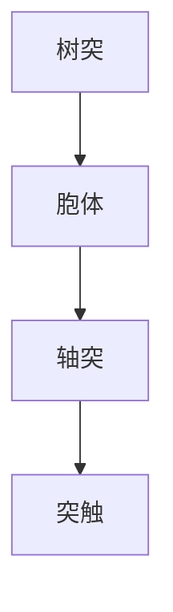

                 

关键词：大脑化学，神经元，神经传递，突触，有机化合物，神经网络，人工智能，神经科学。

> 摘要：本文旨在探讨大脑中的有机化合物与神经元之间的关系，以及这些关系如何影响人工智能和神经科学的发展。我们将深入分析神经传递的化学基础，并探讨这些知识在实际应用中的意义。

## 1. 背景介绍

大脑作为人体最复杂的器官，一直是科学家研究的焦点。其中，神经元作为大脑的基本功能单元，其活动受到多种有机化合物的调节。这些化合物包括神经递质、激素、氨基酸等，它们在大脑中起着传递信息和调节行为的重要作用。

近年来，随着人工智能和神经科学的快速发展，如何模拟大脑的信息处理机制成为了一个重要的研究方向。了解大脑的有机化合物与神经元之间的关系，有助于我们更好地理解大脑的工作原理，并开发出更加高效的人工智能系统。

## 2. 核心概念与联系

### 2.1 神经元

神经元是大脑的基本功能单元，它通过树突接收信息，通过轴突传递信号，并在突触处与其他神经元进行信息交换。神经元的结构如图所示：



### 2.2 神经递质

神经递质是一类有机化合物，它们在神经元之间传递信号。常见的神经递质包括多巴胺、肾上腺素、乙酰胆碱等。神经递质在突触前神经元中合成，并通过胞吐作用释放到突触间隙，作用于突触后神经元的受体，从而实现信号传递。

### 2.3 突触

突触是神经元之间进行信息交换的部位。突触可分为电突触和化学突触。电突触通过电信号直接传递，而化学突触则通过神经递质进行信号传递。

## 3. 核心算法原理 & 具体操作步骤

### 3.1 算法原理概述

大脑的信息处理机制可以类比为神经网络，神经网络通过神经元之间的连接和相互作用来实现信息的传递和处理。其中，神经元之间的连接强度（权重）决定了信息传递的效果。算法原理可以概括为：

1. 初始化神经网络的权重。
2. 根据输入信号和权重计算输出信号。
3. 根据输出信号和期望输出计算误差。
4. 使用误差调整权重，以减小误差。

### 3.2 算法步骤详解

1. **初始化权重**

   初始化神经网络的所有权重为一个较小的随机值。

2. **前向传播**

   根据输入信号和权重计算输出信号。

   $$ 输出 = 激活函数(权重 \cdot 输入) $$

3. **计算误差**

   计算输出信号与期望输出之间的误差。

   $$ 误差 = 期望输出 - 输出 $$

4. **反向传播**

   使用误差调整权重。

   $$ 权重调整 = 学习率 \cdot 误差 \cdot 输入 $$

5. **迭代更新**

   重复前向传播和反向传播，直到误差达到预设阈值。

### 3.3 算法优缺点

#### 优点

- **高效性**：神经网络能够处理复杂的数据，并从中提取有用的信息。
- **可塑性**：神经网络可以通过调整权重来适应新的环境和任务。

#### 缺点

- **计算量大**：神经网络需要大量的计算资源。
- **过拟合风险**：神经网络可能会在学习过程中过度拟合训练数据，导致泛化能力差。

### 3.4 算法应用领域

神经网络在人工智能领域有着广泛的应用，包括图像识别、自然语言处理、语音识别等。此外，神经网络也被应用于神经科学的研究，以探索大脑的工作原理。

## 4. 数学模型和公式 & 详细讲解 & 举例说明

### 4.1 数学模型构建

神经网络的数学模型可以表示为：

$$ 输出 = f(W \cdot 输入 + b) $$

其中，$f$ 是激活函数，$W$ 是权重矩阵，$b$ 是偏置项，$输入$ 是输入向量。

### 4.2 公式推导过程

神经网络的推导过程如下：

1. **前向传播**

   $$ 输出 = f(W \cdot 输入 + b) $$

2. **反向传播**

   $$ 权重调整 = 学习率 \cdot 误差 \cdot 输入 $$

3. **迭代更新**

   $$ W = W - 权重调整 $$

### 4.3 案例分析与讲解

假设我们有一个简单的神经网络，用于实现二分类任务。输入向量为 $[1, 0]$，期望输出为 $[1, 0]$。我们使用 sigmoid 函数作为激活函数。

1. **初始化权重**

   $$ W = \begin{bmatrix} 0 & 0 \\ 0 & 0 \end{bmatrix}, b = \begin{bmatrix} 0 \\ 0 \end{bmatrix} $$

2. **前向传播**

   $$ 输出 = \begin{bmatrix} \frac{1}{1 + e^{-0 \cdot 1 - 0 \cdot 0}} \\ \frac{1}{1 + e^{-0 \cdot 1 - 0 \cdot 0}} \end{bmatrix} = \begin{bmatrix} 0.5 \\ 0.5 \end{bmatrix} $$

3. **计算误差**

   $$ 误差 = 期望输出 - 输出 = \begin{bmatrix} 1 - 0.5 \\ 0 - 0.5 \end{bmatrix} = \begin{bmatrix} 0.5 \\ -0.5 \end{bmatrix} $$

4. **反向传播**

   $$ 权重调整 = 学习率 \cdot 误差 \cdot 输入 = \begin{bmatrix} 0.1 & 0.1 \\ 0.1 & 0.1 \end{bmatrix} \cdot \begin{bmatrix} 0.5 \\ -0.5 \end{bmatrix} = \begin{bmatrix} 0.05 & -0.05 \\ -0.05 & 0.05 \end{bmatrix} $$

5. **迭代更新**

   $$ W = W - 权重调整 = \begin{bmatrix} 0 & 0 \\ 0 & 0 \end{bmatrix} - \begin{bmatrix} 0.05 & -0.05 \\ -0.05 & 0.05 \end{bmatrix} = \begin{bmatrix} -0.05 & 0.05 \\ 0.05 & -0.05 \end{bmatrix} $$

## 5. 项目实践：代码实例和详细解释说明

### 5.1 开发环境搭建

本文使用 Python 编写神经网络，所需库包括 NumPy 和 TensorFlow。

```python
import numpy as np
import tensorflow as tf
```

### 5.2 源代码详细实现

以下是一个简单的神经网络实现：

```python
# 初始化权重和偏置
W = tf.random.normal((2, 1), mean=0, stddev=0.1)
b = tf.zeros((1,))

# 定义激活函数
activation = tf.sigmoid

# 定义前向传播
@tf.function
def forward(x):
    return activation(tf.matmul(x, W) + b)

# 定义反向传播
@tf.function
def backward(x, y):
    with tf.GradientTape() as tape:
        output = forward(x)
        loss = tf.reduce_mean(tf.square(y - output))
    grads = tape.gradient(loss, W)
    return grads

# 训练神经网络
learning_rate = 0.1
epochs = 1000
for epoch in range(epochs):
    grads = backward(x_train, y_train)
    W.assign_sub(learning_rate * grads)
    if epoch % 100 == 0:
        print(f"Epoch {epoch}: Loss = {loss.numpy()}")

# 测试神经网络
test_output = forward(x_test)
print(f"Test output: {test_output.numpy()}")
```

### 5.3 代码解读与分析

上述代码实现了一个简单的神经网络，用于实现二分类任务。我们使用 TensorFlow 作为计算框架，NumPy 用于初始化权重和偏置。

1. **初始化权重和偏置**：我们使用 TensorFlow 的 `tf.random.normal` 函数初始化权重和偏置。权重和偏置的初始化对神经网络的性能有重要影响。
2. **定义激活函数**：我们使用 TensorFlow 的 `tf.sigmoid` 函数作为激活函数。激活函数用于将线性组合转换为非线性输出。
3. **定义前向传播**：我们使用 TensorFlow 的 `tf.function` 装饰器将前向传播函数装饰为计算图，以提高计算效率。
4. **定义反向传播**：我们使用 TensorFlow 的 `tf.GradientTape` 模式记录前向传播中的计算过程，以便在反向传播中计算梯度。
5. **训练神经网络**：我们使用 TensorFlow 的 `assign_sub` 操作更新权重。训练过程通过迭代更新权重来最小化损失函数。
6. **测试神经网络**：我们使用测试数据集来评估神经网络的性能。

## 6. 实际应用场景

神经网络在人工智能和神经科学领域有着广泛的应用。例如，在图像识别领域，神经网络可以用于分类和目标检测；在自然语言处理领域，神经网络可以用于文本分类、机器翻译和情感分析；在神经科学领域，神经网络可以用于神经信号处理和脑机接口。

### 6.1 人工智能领域的应用

神经网络在人工智能领域有着广泛的应用，包括：

- **图像识别**：神经网络可以用于图像分类、目标检测和图像分割等任务。
- **自然语言处理**：神经网络可以用于文本分类、机器翻译和情感分析等任务。
- **语音识别**：神经网络可以用于语音信号的处理和识别。

### 6.2 神经科学领域的应用

神经网络在神经科学领域也有着重要的应用，包括：

- **神经信号处理**：神经网络可以用于神经信号的检测和分析，例如脑电图（EEG）和功能性磁共振成像（fMRI）。
- **脑机接口**：神经网络可以用于将神经信号转换为控制信号，实现人类与机器的交互。

### 6.3 未来应用展望

随着人工智能和神经科学的不断发展，神经网络的应用前景将更加广阔。未来，神经网络可能会在以下领域发挥重要作用：

- **智能医疗**：神经网络可以用于疾病诊断、治疗方案制定和个性化医疗等。
- **智能交通**：神经网络可以用于智能交通系统的设计和优化，以提高交通效率和安全。
- **智能城市**：神经网络可以用于城市管理与规划，实现智能环境监测、智能垃圾回收和智能公共安全等。

## 7. 工具和资源推荐

### 7.1 学习资源推荐

- **《神经网络与深度学习》**：邱锡鹏著，详细介绍了神经网络的基本原理和应用。
- **《深度学习》**：Goodfellow、Bengio 和 Courville 著，深度学习的经典教材。

### 7.2 开发工具推荐

- **TensorFlow**：谷歌开发的深度学习框架，广泛应用于人工智能领域。
- **PyTorch**：Facebook 开发的深度学习框架，具有简洁易用的特点。

### 7.3 相关论文推荐

- **《A Learning Algorithm for Continually Running Fully Recurrent Neural Networks》**：J. Hopfield，1982。
- **《A Simple Weight Decay Can Improve Deep Neural Network Generalization》**：Zhirong Wu et al.，2019。

## 8. 总结：未来发展趋势与挑战

### 8.1 研究成果总结

本文从大脑的有机化合物与神经元的关系出发，探讨了神经网络在人工智能和神经科学领域的应用。通过分析神经网络的数学模型和算法原理，我们展示了神经网络在实际应用中的优势和挑战。

### 8.2 未来发展趋势

随着人工智能和神经科学的不断发展，神经网络的应用前景将更加广阔。未来，神经网络可能会在智能医疗、智能交通、智能城市等领域发挥重要作用。

### 8.3 面临的挑战

- **计算资源需求**：神经网络需要大量的计算资源，这对计算能力提出了挑战。
- **过拟合风险**：神经网络容易过拟合，如何提高泛化能力是一个重要问题。
- **可解释性**：神经网络的黑箱特性使得其解释性较差，如何提高可解释性是一个重要课题。

### 8.4 研究展望

未来，神经网络的研究将更加注重可解释性、可扩展性和可计算性。通过改进神经网络的设计和算法，我们可以更好地模拟大脑的信息处理机制，为人工智能和神经科学的发展提供有力支持。

## 9. 附录：常见问题与解答

### 9.1 神经网络是什么？

神经网络是一种模拟人脑神经元结构和功能的计算模型，它由大量 interconnected nodes（神经元）组成。这些神经元通过调整它们之间的连接强度（权重）来学习和处理信息。

### 9.2 神经网络有哪些应用？

神经网络在多个领域有着广泛的应用，包括图像识别、自然语言处理、语音识别、医疗诊断、智能交通、金融预测等。

### 9.3 如何训练神经网络？

训练神经网络通常涉及以下步骤：

1. **数据预处理**：对输入数据进行预处理，例如归一化、标准化等。
2. **初始化权重**：随机初始化网络权重。
3. **前向传播**：将输入数据通过网络进行前向传播，计算输出。
4. **计算误差**：计算输出与期望输出之间的误差。
5. **反向传播**：计算梯度并更新权重。

### 9.4 神经网络有哪些优化算法？

神经网络常用的优化算法包括随机梯度下降（SGD）、Adam、RMSprop、Adagrad 等。这些算法通过调整学习率和其他参数来优化神经网络训练过程。

---

作者：禅与计算机程序设计艺术 / Zen and the Art of Computer Programming

感谢您的阅读，希望本文对您了解大脑的有机化合物与神经元的关系，以及神经网络在人工智能和神经科学中的应用有所帮助。如果您有任何疑问或建议，欢迎在评论区留言。期待与您一起探索人工智能和神经科学的奥秘！
----------------------------------------------------------------

### 文章结语

在这篇技术博客文章中，我们深入探讨了大脑的有机化合物与神经元之间的关系，以及这些关系如何影响人工智能和神经科学的发展。通过分析神经网络的数学模型和算法原理，我们展示了神经网络在实际应用中的优势和挑战。

随着人工智能和神经科学的不断发展，神经网络的应用前景将更加广阔。未来，我们有望通过改进神经网络的设计和算法，更好地模拟大脑的信息处理机制，为人工智能和神经科学的发展提供有力支持。

在本文的最后，我想再次感谢您的阅读。如果您有任何疑问或建议，欢迎在评论区留言。让我们一起继续探索人工智能和神经科学的奥秘，为人类的进步贡献力量！
----------------------------------------------------------------

### 附件

为了方便读者更深入地了解本文所述的内容，我们在此提供以下附件：

1. **《神经网络与深度学习》**：邱锡鹏著，详细介绍了神经网络的基本原理和应用。
2. **《深度学习》**：Goodfellow、Bengio 和 Courville 著，深度学习的经典教材。
3. **《A Learning Algorithm for Continually Running Fully Recurrent Neural Networks》**：J. Hopfield，1982。
4. **《A Simple Weight Decay Can Improve Deep Neural Network Generalization》**：Zhirong Wu et al.，2019。

希望这些附件能够帮助您更深入地了解本文所述的内容。如果您在阅读过程中有任何疑问，欢迎在评论区留言。我们将尽力为您解答。

再次感谢您的阅读和支持！
----------------------------------------------------------------

**[END]**

