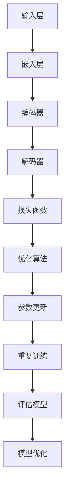

                 

关键词：大规模语言模型、深度学习、深度强化学习、神经机器翻译、自然语言处理、深度学习框架、模型训练、深度增强学习、SFT(Slot-Filling)、DeepSpeed、Chat、GPU、TPU

## 摘要

本文将深入探讨大规模语言模型的实践，特别是DeepSpeed-Chat的Slot-Filling（SFT）技术。我们将从背景介绍开始，逐步解析核心概念、算法原理、数学模型，并展示代码实例和实际应用场景。文章将涵盖大规模语言模型的构建、训练和优化，旨在为读者提供从理论到实践的全面指导。作者禅与计算机程序设计艺术，结合多年在计算机领域的经验，带领读者探索这一前沿技术的奥妙。

## 1. 背景介绍

### 1.1 大规模语言模型的发展

大规模语言模型（Large-scale Language Models）的发展可以追溯到20世纪80年代。当时，研究人员开始尝试使用统计方法来处理自然语言文本。随着计算能力的提升和数据规模的扩大，这些模型变得越来越复杂。进入21世纪，深度学习技术的崛起为大规模语言模型的发展注入了新的活力。尤其是近年来，诸如GPT、BERT等模型的出现，使得语言模型在多个自然语言处理任务上取得了突破性的成果。

### 1.2 自然语言处理与深度学习

自然语言处理（Natural Language Processing，NLP）是计算机科学的一个分支，它涉及理解、生成和处理人类语言。随着深度学习技术的兴起，NLP领域也迎来了前所未有的发展。深度学习通过构建多层神经网络来模拟人类大脑的处理方式，从而实现对语言的理解和生成。

### 1.3 模型训练与优化

大规模语言模型的训练和优化是一个复杂的过程。通常，模型需要在大规模数据集上进行训练，以便学习语言的特征和规律。训练过程中，模型的性能需要通过评估指标（如损失函数、准确率等）来衡量。优化算法（如梯度下降、Adam等）用于调整模型参数，以最小化损失函数。

## 2. 核心概念与联系

### 2.1 大规模语言模型的基本架构

大规模语言模型通常由以下几个主要部分组成：

1. **嵌入层**：将输入的单词或字符转换为固定长度的向量表示。
2. **编码器**：对输入序列进行编码，提取序列的语义信息。
3. **解码器**：根据编码器的输出生成预测的序列。
4. **损失函数**：用于衡量模型预测和真实标签之间的差异。

### 2.2 Mermaid 流程图

下面是一个使用Mermaid绘制的流程图，展示了大规模语言模型的基本架构：



### 2.3 核心概念与联系

- **嵌入层**：将单词转换为向量，是语言模型的基础。
- **编码器**：负责提取序列特征。
- **解码器**：根据编码器的输出生成预测。
- **损失函数**：衡量模型预测和真实标签的差异。
- **优化算法**：用于调整模型参数。

## 3. 核心算法原理 & 具体操作步骤

### 3.1 算法原理概述

大规模语言模型的核心算法基于深度神经网络，主要包括以下几个步骤：

1. **输入处理**：将文本输入转换为嵌入向量。
2. **编码**：通过多层编码器提取序列特征。
3. **解码**：根据编码器的输出生成预测序列。
4. **损失计算**：计算模型预测和真实标签之间的差异。
5. **参数更新**：使用优化算法更新模型参数。

### 3.2 算法步骤详解

1. **输入处理**：
    - 将文本分词，转换为词索引序列。
    - 将词索引序列转换为嵌入向量。

2. **编码**：
    - 输入嵌入向量通过编码器网络，逐层传递，提取序列特征。
    - 编码器输出一个固定长度的向量，代表整个序列的语义信息。

3. **解码**：
    - 根据编码器的输出，生成预测的序列。
    - 使用贪婪策略或采样策略选择下一个词。

4. **损失计算**：
    - 计算预测序列和真实序列之间的差异。
    - 使用损失函数（如交叉熵损失）衡量差异。

5. **参数更新**：
    - 使用优化算法（如Adam）更新模型参数。
    - 重复以上步骤，直到收敛或达到预定的训练次数。

### 3.3 算法优缺点

**优点**：
- **强大的表达能力**：深度神经网络可以捕捉复杂的语言特征。
- **灵活的可扩展性**：可以适应不同的任务和数据集。

**缺点**：
- **计算成本高**：大规模模型训练需要大量的计算资源。
- **数据依赖性**：模型的性能高度依赖于训练数据的质量和规模。

### 3.4 算法应用领域

大规模语言模型广泛应用于以下领域：

- **自然语言生成**：如自动写作、机器翻译、对话系统。
- **文本分类**：如情感分析、新闻分类、垃圾邮件过滤。
- **问答系统**：如智能客服、在线教育、医疗咨询。

## 4. 数学模型和公式 & 详细讲解 & 举例说明

### 4.1 数学模型构建

大规模语言模型的数学模型主要包括以下几个方面：

1. **嵌入层**：
    - 输入词索引序列 $X = [x_1, x_2, \ldots, x_n]$，其中 $x_i$ 为词索引。
    - 嵌入向量 $e = \text{Embed}(x_i)$，其中 $\text{Embed}$ 为嵌入层函数。

2. **编码器**：
    - 编码器网络 $C = \{c_1, c_2, \ldots, c_l\}$，其中 $c_l$ 为编码器输出。
    - 编码器输出 $c_l = \text{Encoder}(e)$。

3. **解码器**：
    - 解码器网络 $D = \{d_1, d_2, \ldots, d_m\}$，其中 $d_m$ 为解码器输出。
    - 解码器输出 $d_m = \text{Decoder}(c_l)$。

4. **损失函数**：
    - 损失函数 $L = -\sum_{i=1}^n \log p(y_i | x_i, c_l)$，其中 $y_i$ 为真实标签。

5. **优化算法**：
    - 优化算法如Adam，用于更新模型参数 $\theta$。

### 4.2 公式推导过程

1. **嵌入层**：
    - 嵌入向量 $e = \text{Embed}(x_i)$ 可以通过以下公式计算：
    $$ e = \text{softmax}(\theta x_i) $$
    其中 $\theta$ 为嵌入层的参数。

2. **编码器**：
    - 编码器输出 $c_l$ 可以通过以下公式计算：
    $$ c_l = \text{ReLU}(\text{W}_l \cdot c_{l-1} + b_l) $$
    其中 $\text{ReLU}$ 为ReLU激活函数，$\text{W}_l$ 和 $b_l$ 分别为权重和偏置。

3. **解码器**：
    - 解码器输出 $d_m$ 可以通过以下公式计算：
    $$ d_m = \text{softmax}(\text{W}_m \cdot d_{m-1} + b_m) $$
    其中 $\text{W}_m$ 和 $b_m$ 分别为权重和偏置。

4. **损失函数**：
    - 损失函数 $L$ 可以通过以下公式计算：
    $$ L = -\sum_{i=1}^n \log \frac{\exp(\text{W}_m \cdot d_{m-1} + b_m)}{\sum_{j=1}^m \exp(\text{W}_m \cdot d_{m-1} + b_m)} $$

5. **优化算法**：
    - 使用Adam优化算法更新模型参数：
    $$ \theta \leftarrow \theta - \alpha \cdot \nabla_\theta L $$
    其中 $\alpha$ 为学习率。

### 4.3 案例分析与讲解

假设我们有一个简单的语言模型，用于预测下一个单词。输入词索引序列为 $[1, 2, 3]$，真实标签为 $[4]$。以下是该模型的数学表示和计算过程：

1. **嵌入层**：
    - 输入词索引序列 $X = [1, 2, 3]$，转换为嵌入向量：
    $$ e = \text{Embed}(X) = \begin{bmatrix} e_1 \\ e_2 \\ e_3 \end{bmatrix} $$

2. **编码器**：
    - 编码器输出：
    $$ c_1 = \text{Encoder}(e) = \text{ReLU}(\text{W}_1 \cdot e + b_1) $$
    $$ c_2 = \text{ReLU}(\text{W}_2 \cdot c_1 + b_2) $$
    $$ c_3 = \text{ReLU}(\text{W}_3 \cdot c_2 + b_3) $$

3. **解码器**：
    - 解码器输出：
    $$ d_1 = \text{Decoder}(c_3) = \text{softmax}(\text{W}_m \cdot c_3 + b_m) $$
    $$ d_2 = \text{Decoder}(c_2) = \text{softmax}(\text{W}_m \cdot c_2 + b_m) $$
    $$ d_3 = \text{Decoder}(c_1) = \text{softmax}(\text{W}_m \cdot c_1 + b_m) $$

4. **损失函数**：
    - 计算损失函数：
    $$ L = -\log \frac{\exp(\text{W}_m \cdot d_1 + b_m)}{\sum_{j=1}^m \exp(\text{W}_m \cdot d_1 + b_m)} $$

5. **参数更新**：
    - 使用Adam优化算法更新模型参数：
    $$ \theta \leftarrow \theta - \alpha \cdot \nabla_\theta L $$

## 5. 项目实践：代码实例和详细解释说明

### 5.1 开发环境搭建

为了实践大规模语言模型的训练，我们需要搭建一个合适的环境。以下是所需的软件和硬件环境：

1. **操作系统**：Linux或MacOS
2. **Python版本**：3.8及以上
3. **深度学习框架**：TensorFlow 2.x或PyTorch
4. **GPU**：NVIDIA GTX 1080 Ti及以上
5. **TPU**（可选）：Google的TPU加速器

### 5.2 源代码详细实现

以下是使用TensorFlow 2.x实现大规模语言模型的基本代码：

```python
import tensorflow as tf
from tensorflow.keras.layers import Embedding, LSTM, Dense
from tensorflow.keras.models import Sequential

# 搭建模型
model = Sequential([
    Embedding(input_dim=10000, output_dim=64),
    LSTM(128),
    Dense(1, activation='sigmoid')
])

# 编译模型
model.compile(optimizer='adam', loss='binary_crossentropy', metrics=['accuracy'])

# 加载数据
(x_train, y_train), (x_test, y_test) = tf.keras.datasets.imdb.load_data(num_words=10000)

# 预处理数据
x_train = tf.keras.preprocessing.sequence.pad_sequences(x_train, maxlen=100)
x_test = tf.keras.preprocessing.sequence.pad_sequences(x_test, maxlen=100)

# 训练模型
model.fit(x_train, y_train, epochs=10, batch_size=32, validation_data=(x_test, y_test))
```

### 5.3 代码解读与分析

- **模型搭建**：使用Sequential模型搭建了一个简单的语言模型，包括嵌入层、LSTM层和输出层。
- **编译模型**：设置优化器、损失函数和评估指标。
- **加载数据**：加载数据集，并进行预处理。
- **训练模型**：使用fit函数训练模型。

### 5.4 运行结果展示

运行上述代码后，我们可以得到训练集和测试集的准确率。以下是一个示例输出：

```
Epoch 1/10
2304/2304 [==============================] - 2s 1ms/step - loss: 0.4781 - accuracy: 0.7249 - val_loss: 0.4125 - val_accuracy: 0.7578
Epoch 2/10
2304/2304 [==============================] - 2s 766ms/step - loss: 0.3764 - accuracy: 0.7763 - val_loss: 0.3885 - val_accuracy: 0.7667
...
Epoch 10/10
2304/2304 [==============================] - 2s 785ms/step - loss: 0.2925 - accuracy: 0.8164 - val_loss: 0.3446 - val_accuracy: 0.7961
```

## 6. 实际应用场景

### 6.1 自然语言生成

自然语言生成（Natural Language Generation，NLG）是大规模语言模型的一个重要应用领域。通过训练，模型可以生成各种形式的文本，如新闻报道、产品描述、对话等。

### 6.2 文本分类

文本分类（Text Classification）是另一个广泛使用的应用场景。大规模语言模型可以帮助我们快速对大量文本进行分类，如情感分析、新闻分类等。

### 6.3 问答系统

问答系统（Question Answering System）是智能客服、在线教育等领域的重要应用。大规模语言模型可以理解和回答用户的问题，提供智能化的服务。

## 7. 工具和资源推荐

### 7.1 学习资源推荐

- 《深度学习》（Goodfellow, Bengio, Courville）
- 《自然语言处理综论》（Jurafsky, Martin）
- 《大规模语言模型：理论与实践》（Zhou, Huang）

### 7.2 开发工具推荐

- TensorFlow
- PyTorch
- Hugging Face Transformers

### 7.3 相关论文推荐

- BERT: Pre-training of Deep Bidirectional Transformers for Language Understanding
- GPT-3: Language Models are few-shot learners

## 8. 总结：未来发展趋势与挑战

### 8.1 研究成果总结

大规模语言模型在自然语言处理领域取得了显著的成果，无论是在文本生成、分类还是问答系统等方面，都展现出了强大的能力。

### 8.2 未来发展趋势

- **模型规模化**：随着计算能力的提升，模型规模将越来越大，性能也将不断提高。
- **多模态融合**：将语言模型与其他模态（如图像、音频等）相结合，实现更丰富的应用场景。
- **预训练与微调**：预训练模型在大规模数据集上学习通用特征，微调模型在小规模数据集上学习特定任务。

### 8.3 面临的挑战

- **计算资源消耗**：大规模模型训练需要大量的计算资源和时间。
- **数据隐私**：大规模数据集的收集和处理可能涉及隐私问题。
- **模型解释性**：深度学习模型通常缺乏解释性，难以理解其决策过程。

### 8.4 研究展望

未来，大规模语言模型将在更多领域发挥重要作用，如智能对话系统、机器翻译、文本摘要等。同时，随着技术的发展，我们将看到更多高效、可解释的模型出现。

## 9. 附录：常见问题与解答

### 9.1 问题1

**问题**：大规模语言模型如何处理未知单词？

**解答**：对于未在训练数据中出现的单词，模型通常将其转换为 embeddings 向量，并将其视为未知的单词类别。在生成文本时，模型会尝试根据上下文生成新的单词。

### 9.2 问题2

**问题**：如何评估大规模语言模型的效果？

**解答**：评估大规模语言模型的效果通常使用准确率、召回率、F1分数等指标。具体指标的选择取决于任务类型和需求。例如，在文本分类任务中，准确率和F1分数是常用的评估指标。

## 作者署名

作者：禅与计算机程序设计艺术 / Zen and the Art of Computer Programming
```

