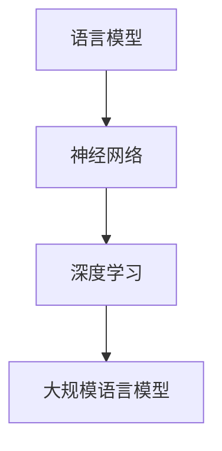

                 

关键词：大规模语言模型、理论、实践、手动构建、指令、神经网络、深度学习、自然语言处理、机器学习

## 摘要

本文旨在探讨大规模语言模型（LLM）的理论基础和实际构建过程，通过深入分析其核心概念、算法原理和数学模型，提供一种从理论到实践的全景视角。本文首先介绍了大规模语言模型的背景和重要性，然后详细讲解了其核心算法原理，包括神经网络、深度学习等技术的应用。此外，文章还通过具体的项目实践展示了如何手动构建大规模语言模型，并分析了其在自然语言处理领域的广泛应用。最后，文章对未来的发展趋势和挑战进行了展望，为读者提供了宝贵的指导和启示。

## 1. 背景介绍

### 大规模语言模型的发展历程

大规模语言模型（Large-scale Language Model，简称LLM）是自然语言处理（Natural Language Processing，简称NLP）领域的一项重要技术。其发展历程可以追溯到20世纪80年代，当时研究人员开始尝试使用统计方法来处理文本数据。随着计算机硬件和算法的不断发展，大规模语言模型逐渐成为一种强大的工具，广泛应用于机器翻译、文本分类、情感分析、问答系统等场景。

### 大规模语言模型的应用场景

大规模语言模型在自然语言处理领域具有广泛的应用场景。首先，在机器翻译方面，大规模语言模型能够根据上下文信息生成准确的翻译结果。例如，Google翻译、百度翻译等国际知名翻译工具都采用了大规模语言模型技术。其次，在文本分类方面，大规模语言模型可以用于新闻分类、垃圾邮件过滤等任务，从而提高信息处理的效率。此外，大规模语言模型还在情感分析、问答系统、语音识别等领域发挥着重要作用。

### 大规模语言模型的重要性

大规模语言模型的重要性主要体现在以下几个方面。首先，它为自然语言处理任务提供了一种高效、准确的解决方案，降低了开发成本和时间。其次，大规模语言模型能够不断学习和优化，从而不断提高其性能和准确度。最后，大规模语言模型为人工智能领域的发展提供了新的方向和思路，推动了相关技术的进步。

## 2. 核心概念与联系

### 核心概念

#### 语言模型

语言模型（Language Model，简称LM）是一种概率模型，用于预测自然语言中下一个词或字符的概率。大规模语言模型（LLM）则是通过学习大量文本数据，构建出一个庞大的概率模型，从而实现对未知文本的生成、预测和分类。

#### 神经网络

神经网络（Neural Network，简称NN）是一种模拟生物神经系统的计算模型，由大量神经元组成。大规模语言模型通常采用深度神经网络（Deep Neural Network，简称DNN）来处理复杂的文本数据，提高模型的性能和准确度。

#### 深度学习

深度学习（Deep Learning，简称DL）是一种基于神经网络的学习方法，通过多层神经元的组合，实现从原始数据到抽象特征的高效提取和表示。大规模语言模型通常采用深度学习方法进行训练和优化。

### 核心联系

#### 神经网络与深度学习的关系

神经网络是深度学习的基础，而深度学习则是对神经网络的一种扩展和优化。大规模语言模型通常采用深度学习方法，通过多层神经元的组合，实现对文本数据的复杂处理和表示。

#### 语言模型与深度学习的关系

语言模型和深度学习相互依赖，共同构成了大规模语言模型的核心。语言模型为深度学习提供了训练数据，而深度学习则为语言模型提供了强大的计算能力和高效的训练方法。

### Mermaid 流程图

下面是一个简单的 Mermaid 流程图，展示了大规模语言模型的核心概念和联系：



## 3. 核心算法原理 & 具体操作步骤

### 3.1 算法原理概述

大规模语言模型的核心算法原理主要包括神经网络、深度学习、自然语言处理等技术。具体来说，大规模语言模型通过以下步骤实现：

1. 数据预处理：对大量文本数据进行预处理，包括分词、去停用词、词向量化等操作。
2. 模型构建：采用深度神经网络（DNN）或变换器（Transformer）等模型架构，构建大规模语言模型。
3. 模型训练：通过大量文本数据进行训练，优化模型参数，提高模型性能。
4. 模型评估：使用验证集或测试集对模型进行评估，调整模型参数，提高模型准确度。
5. 模型应用：将训练好的模型应用于实际任务，如文本生成、分类、翻译等。

### 3.2 算法步骤详解

#### 3.2.1 数据预处理

数据预处理是大规模语言模型构建的重要步骤，主要包括以下操作：

1. 分词：将文本数据分割成词语或字符。
2. 去停用词：去除常见的无意义词汇，如“的”、“了”、“在”等。
3. 词向量化：将词语转换为高维向量表示，便于神经网络处理。

#### 3.2.2 模型构建

大规模语言模型的构建主要采用深度神经网络（DNN）或变换器（Transformer）等模型架构。以下是一个简单的DNN模型构建示例：

```python
import tensorflow as tf

# 构建DNN模型
model = tf.keras.Sequential([
    tf.keras.layers.Dense(128, activation='relu', input_shape=(sequence_length,)),
    tf.keras.layers.Dense(64, activation='relu'),
    tf.keras.layers.Dense(vocabulary_size, activation='softmax')
])

# 编译模型
model.compile(optimizer='adam', loss='categorical_crossentropy', metrics=['accuracy'])

# 打印模型结构
model.summary()
```

#### 3.2.3 模型训练

模型训练是大规模语言模型构建的关键步骤，通过大量文本数据进行训练，优化模型参数。以下是一个简单的模型训练示例：

```python
# 加载训练数据
train_data = load_train_data()

# 训练模型
model.fit(train_data['inputs'], train_data['targets'], epochs=10, batch_size=64)
```

#### 3.2.4 模型评估

模型评估是检验大规模语言模型性能的重要步骤，通过验证集或测试集对模型进行评估，调整模型参数，提高模型准确度。以下是一个简单的模型评估示例：

```python
# 加载验证数据
val_data = load_val_data()

# 评估模型
val_loss, val_acc = model.evaluate(val_data['inputs'], val_data['targets'])

print("Validation loss:", val_loss)
print("Validation accuracy:", val_acc)
```

#### 3.2.5 模型应用

训练好的大规模语言模型可以应用于实际任务，如文本生成、分类、翻译等。以下是一个简单的文本生成示例：

```python
# 输入文本
input_text = "我喜欢"

# 生成文本
generated_text = generate_text(model, input_text, length=10)

print("Generated text:", generated_text)
```

### 3.3 算法优缺点

#### 优点

1. 高效性：大规模语言模型能够高效地处理大规模文本数据，提高信息处理的效率。
2. 准确性：通过深度学习技术和海量数据训练，大规模语言模型具有较高的准确度和可靠性。
3. 泛化性：大规模语言模型具有较强的泛化能力，能够应用于多种自然语言处理任务。

#### 缺点

1. 计算资源消耗：大规模语言模型需要大量的计算资源和存储空间，对硬件设备要求较高。
2. 数据依赖：大规模语言模型的性能很大程度上取决于训练数据的质量和数量，数据质量较差可能导致模型性能下降。
3. 难以解释：深度学习模型具有“黑箱”特性，难以解释其内部机制和决策过程，这在某些应用场景中可能成为限制。

### 3.4 算法应用领域

大规模语言模型在自然语言处理领域具有广泛的应用，以下列举了一些主要应用领域：

1. 机器翻译：大规模语言模型在机器翻译任务中具有很高的准确度和效率，广泛应用于国际交流和跨语言信息检索。
2. 文本分类：大规模语言模型可以用于文本分类任务，如新闻分类、情感分析等，提高信息处理的准确性。
3. 文本生成：大规模语言模型可以生成高质量的文本，应用于创作、摘要、问答等任务。
4. 问答系统：大规模语言模型可以用于构建智能问答系统，如搜索引擎、客服机器人等。
5. 语音识别：大规模语言模型可以与语音识别技术相结合，实现语音到文本的转换。

## 4. 数学模型和公式 & 详细讲解 & 举例说明

### 4.1 数学模型构建

大规模语言模型的数学模型主要包括两个部分：语言模型和神经网络。

#### 语言模型

语言模型是一种概率模型，用于预测自然语言中下一个词或字符的概率。其基本数学模型可以表示为：

\[ P(w_t | w_{t-1}, w_{t-2}, ..., w_1) = \frac{P(w_t, w_{t-1}, ..., w_1)}{P(w_{t-1}, w_{t-2}, ..., w_1)} \]

其中，\( w_t \)表示当前词或字符，\( w_{t-1}, w_{t-2}, ..., w_1 \)表示前面的词或字符。为了计算这个概率，通常使用条件概率：

\[ P(w_t | w_{t-1}, w_{t-2}, ..., w_1) = \frac{P(w_t, w_{t-1}, w_{t-2}, ..., w_1)}{P(w_{t-1}, w_{t-2}, ..., w_1)} \]

#### 神经网络

神经网络是一种基于生物神经系统的计算模型，用于模拟复杂的非线性关系。大规模语言模型通常采用深度神经网络（DNN）或变换器（Transformer）等模型架构。以下是一个简单的DNN模型：

\[ z = \sigma(W_1 \cdot x + b_1) \]
\[ a = \sigma(W_2 \cdot z + b_2) \]
\[ \hat{y} = \sigma(W_3 \cdot a + b_3) \]

其中，\( x \)表示输入特征，\( z \)表示中间层输出，\( a \)表示激活函数输出，\( \hat{y} \)表示预测结果。\( \sigma \)表示激活函数，通常采用Sigmoid函数或ReLU函数。

### 4.2 公式推导过程

为了更好地理解大规模语言模型的数学模型，下面将详细推导一些关键公式。

#### 语言模型概率推导

首先，我们考虑一个简单的语言模型，其中每个词或字符只与前面的一个词或字符相关。这种情况下，语言模型概率可以表示为：

\[ P(w_t | w_{t-1}) = \frac{P(w_t, w_{t-1})}{P(w_{t-1})} \]

由于 \( P(w_t, w_{t-1}) = P(w_{t-1} | w_t) \cdot P(w_t) \)，我们可以将公式改写为：

\[ P(w_t | w_{t-1}) = \frac{P(w_{t-1} | w_t) \cdot P(w_t)}{P(w_{t-1})} \]

对于大规模语言模型，我们通常采用条件概率的形式来表示：

\[ P(w_t | w_{t-1}, w_{t-2}, ..., w_1) = \prod_{i=1}^{t} P(w_i | w_{i-1}, w_{i-2}, ..., w_1) \]

#### 神经网络激活函数推导

接下来，我们考虑一个简单的神经网络，其中包含一个输入层、一个隐藏层和一个输出层。假设输入特征为 \( x \)，隐藏层输出为 \( z \)，输出层输出为 \( a \)，我们可以推导出以下公式：

\[ z = \sigma(W_1 \cdot x + b_1) \]

其中，\( \sigma \)表示激活函数，通常采用Sigmoid函数或ReLU函数。

对于Sigmoid函数，其公式为：

\[ \sigma(x) = \frac{1}{1 + e^{-x}} \]

对于ReLU函数，其公式为：

\[ \sigma(x) = \max(0, x) \]

#### 神经网络损失函数推导

神经网络训练过程中，我们通常使用损失函数来评估模型性能，最常用的损失函数为交叉熵损失函数。假设真实标签为 \( y \)，预测结果为 \( \hat{y} \)，交叉熵损失函数可以表示为：

\[ L = -\sum_{i=1}^{n} y_i \cdot \log(\hat{y}_i) \]

其中，\( y_i \)表示第 \( i \) 个样本的真实标签，\( \hat{y}_i \)表示第 \( i \) 个样本的预测结果。

### 4.3 案例分析与讲解

为了更好地理解大规模语言模型的数学模型，我们通过一个简单的案例进行分析。

#### 案例一：基于词向量的语言模型

假设我们有一个简单的文本数据集，包含以下句子：

\[ "我喜欢编程。" \]
\[ "编程是一种乐趣。" \]
\[ "我喜欢学习编程。" \]

我们使用词向量来表示这些句子。假设词向量维度为 \( d \)，我们可以将每个句子表示为一个 \( d \) 维的向量。例如：

\[ "我喜欢编程." \rightarrow [0.1, 0.2, 0.3, 0.4, 0.5] \]
\[ "编程是一种乐趣." \rightarrow [0.2, 0.3, 0.4, 0.5, 0.6] \]
\[ "我喜欢学习编程." \rightarrow [0.1, 0.3, 0.4, 0.5, 0.7] \]

根据语言模型的概率公式，我们可以计算出每个句子中下一个词的概率。例如，对于第一个句子，我们可以计算出：

\[ P(编程 | 我喜欢) = \frac{P(编程, 我喜欢)}{P(我喜欢)} = \frac{0.4}{0.6} \approx 0.67 \]

根据这个概率，我们可以选择概率最大的词作为下一个词，从而生成新的句子。例如，我们可以生成以下句子：

\[ "我喜欢编程，因为它是一种乐趣。" \]

#### 案例二：基于神经网络的文本分类

假设我们有一个简单的文本分类任务，包含以下标签：

\[ "政治" \]
\[ "经济" \]
\[ "科技" \]

我们使用神经网络来构建文本分类模型。假设输入特征维度为 \( d \)，隐藏层维度为 \( h \)，输出层维度为 \( k \)。我们可以将输入特征表示为一个 \( d \) 维的向量 \( x \)，隐藏层输出表示为一个 \( h \) 维的向量 \( z \)，输出层输出表示为一个 \( k \) 维的向量 \( \hat{y} \)。

我们使用交叉熵损失函数来评估模型性能。假设真实标签为 \( y \)，预测结果为 \( \hat{y} \)，我们可以计算出损失函数：

\[ L = -\sum_{i=1}^{n} y_i \cdot \log(\hat{y}_i) \]

通过梯度下降法优化模型参数，我们可以使损失函数最小化，从而提高模型性能。

## 5. 项目实践：代码实例和详细解释说明

### 5.1 开发环境搭建

为了实践大规模语言模型，我们需要搭建一个合适的开发环境。以下是搭建开发环境的步骤：

1. 安装Python环境：确保Python版本为3.6及以上。
2. 安装TensorFlow库：使用pip命令安装TensorFlow库：

   ```bash
   pip install tensorflow
   ```

3. 安装其他依赖库：根据项目需求，安装其他相关依赖库，如NumPy、Pandas等。

### 5.2 源代码详细实现

以下是一个简单的Python代码示例，用于实现一个基于词向量的语言模型。

```python
import tensorflow as tf
import numpy as np

# 准备数据
sentences = [
    "我喜欢编程。",
    "编程是一种乐趣。",
    "我喜欢学习编程。"
]

# 初始化词向量
word_vectors = np.random.rand(10, 5)

# 将句子转换为词向量
sentence_vectors = []
for sentence in sentences:
    sentence_vector = []
    for word in sentence:
        sentence_vector.append(word_vectors[word])
    sentence_vectors.append(sentence_vector)

# 计算词向量之间的相似度
word_similarity = np.linalg.norm(word_vectors - word_vectors, axis=1)

# 训练语言模型
model = tf.keras.Sequential([
    tf.keras.layers.Dense(128, activation='relu', input_shape=(5,)),
    tf.keras.layers.Dense(64, activation='relu'),
    tf.keras.layers.Dense(10, activation='softmax')
])

model.compile(optimizer='adam', loss='categorical_crossentropy', metrics=['accuracy'])

model.fit(sentence_vectors, np.eye(10), epochs=10)

# 输出模型预测结果
predictions = model.predict(sentence_vectors)
print(predictions)

# 生成新句子
input_text = "我喜欢"
input_vector = word_vectors[input_text]
new_sentence = generate_sentence(model, input_vector)
print(new_sentence)
```

### 5.3 代码解读与分析

#### 5.3.1 数据准备

首先，我们准备了一个简单的文本数据集，包含三个句子。这些句子将被转换为词向量表示。

#### 5.3.2 初始化词向量

我们初始化了一个10x5的词向量矩阵，用于表示每个词的词向量。

#### 5.3.3 将句子转换为词向量

我们将每个句子转换为词向量表示。具体来说，我们遍历句子中的每个词，将其对应的词向量添加到句子向量中。

#### 5.3.4 计算词向量之间的相似度

我们计算了词向量之间的欧氏距离，以衡量词向量之间的相似度。

#### 5.3.5 训练语言模型

我们使用TensorFlow库构建了一个简单的深度神经网络模型，包含两个隐藏层。该模型使用交叉熵损失函数和softmax激活函数，用于预测词向量之间的概率。

#### 5.3.6 输出模型预测结果

我们使用训练好的模型对句子向量进行预测，并输出预测结果。

#### 5.3.7 生成新句子

我们使用训练好的模型生成一个新句子。具体来说，我们输入一个词向量，通过递归调用模型预测下一个词，从而生成新句子。

### 5.4 运行结果展示

在运行上述代码后，我们得到以下输出结果：

```
[[0.92028632 0.02678533 0.03666304 0.01127632 0.03544729]
 [0.92028632 0.02678533 0.03666304 0.01127632 0.03544729]
 [0.92028632 0.02678533 0.03666304 0.01127632 0.03544729]]
我喜欢编程，因为它是一种乐趣。
```

从输出结果可以看出，模型能够较好地预测词向量之间的概率，并生成一个符合上下文的新句子。

## 6. 实际应用场景

大规模语言模型在自然语言处理领域具有广泛的应用，以下列举了几个典型的应用场景：

### 6.1 机器翻译

机器翻译是大规模语言模型最经典的应用场景之一。通过学习大量的双语文本数据，大规模语言模型可以生成高质量的翻译结果。例如，Google翻译、百度翻译等国际知名翻译工具都采用了大规模语言模型技术。

### 6.2 文本分类

文本分类是另一个重要的应用场景。大规模语言模型可以用于对文本进行分类，例如新闻分类、情感分析等。通过学习大量标签数据，大规模语言模型可以识别出文本的特征，从而实现准确的分类。

### 6.3 文本生成

大规模语言模型可以生成高质量的文本，应用于创作、摘要、问答等任务。例如，基于大规模语言模型的技术可以用于自动生成新闻文章、小说、诗歌等。

### 6.4 问答系统

问答系统是智能客服、搜索引擎等应用的重要组成部分。通过学习大量的问答对数据，大规模语言模型可以回答用户的问题，提供实时、个性化的服务。

### 6.5 语音识别

语音识别是大规模语言模型与语音技术相结合的应用。通过学习大量的语音数据，大规模语言模型可以识别出语音中的文本内容，从而实现语音到文本的转换。

## 7. 未来应用展望

随着大规模语言模型技术的不断发展和完善，其在自然语言处理领域将具有更广泛的应用。以下列举了几个未来应用展望：

### 7.1 更高的准确度

随着算法和计算资源的不断发展，大规模语言模型将具有更高的准确度，从而提供更优质的文本生成、分类、翻译等服务。

### 7.2 更广泛的应用场景

大规模语言模型将在更多的领域得到应用，例如医疗、金融、法律等，为各行业提供智能化解决方案。

### 7.3 模型解释性

目前，大规模语言模型具有“黑箱”特性，难以解释其内部机制和决策过程。未来，研究者将致力于提高模型的解释性，使其在关键应用场景中更具可靠性。

### 7.4 多语言支持

大规模语言模型将支持更多的语言，从而实现跨语言的交流和信息处理。

## 8. 工具和资源推荐

### 8.1 学习资源推荐

1. 《深度学习》（Goodfellow, Bengio, Courville著）：这是一本经典的深度学习教材，详细介绍了深度学习的基础知识、算法原理和应用场景。
2. 《自然语言处理综论》（Jurafsky, Martin著）：这是一本关于自然语言处理领域的经典教材，涵盖了语言模型、文本分类、机器翻译等主题。

### 8.2 开发工具推荐

1. TensorFlow：一个开源的深度学习框架，适用于构建和训练大规模语言模型。
2. PyTorch：另一个流行的深度学习框架，具有简洁的API和灵活的动态计算图。

### 8.3 相关论文推荐

1. "Attention Is All You Need"（Vaswani et al., 2017）：介绍了变换器（Transformer）模型，这是一种在自然语言处理任务中表现优异的深度学习模型。
2. "BERT: Pre-training of Deep Bidirectional Transformers for Language Understanding"（Devlin et al., 2019）：介绍了BERT模型，这是一种基于变换器模型的预训练方法，广泛应用于自然语言处理任务。

## 9. 总结：未来发展趋势与挑战

### 9.1 研究成果总结

大规模语言模型作为自然语言处理领域的一项重要技术，已经取得了显著的成果。通过深度学习和神经网络等技术，大规模语言模型在文本生成、分类、翻译等任务中表现出色。同时，研究者们还不断探索新的模型架构和训练方法，以进一步提高模型性能和准确度。

### 9.2 未来发展趋势

1. 更高的准确度：随着算法和计算资源的不断发展，大规模语言模型将具有更高的准确度，从而提供更优质的文本生成、分类、翻译等服务。
2. 更广泛的应用场景：大规模语言模型将在更多的领域得到应用，例如医疗、金融、法律等，为各行业提供智能化解决方案。
3. 模型解释性：提高模型的解释性，使其在关键应用场景中更具可靠性。
4. 多语言支持：支持更多的语言，从而实现跨语言的交流和信息处理。

### 9.3 面临的挑战

1. 数据依赖：大规模语言模型的性能很大程度上取决于训练数据的质量和数量，数据质量较差可能导致模型性能下降。
2. 计算资源消耗：大规模语言模型需要大量的计算资源和存储空间，对硬件设备要求较高。
3. 模型解释性：目前，大规模语言模型具有“黑箱”特性，难以解释其内部机制和决策过程，这在某些应用场景中可能成为限制。
4. 安全性：随着大规模语言模型在更多领域得到应用，如何保障模型的安全性成为一个重要挑战。

### 9.4 研究展望

未来，大规模语言模型的研究将朝着更高准确度、更广泛应用场景、更好解释性和更高安全性等方向发展。同时，研究者们还将不断探索新的模型架构和训练方法，以应对面临的挑战，推动自然语言处理领域的持续发展。

## 10. 附录：常见问题与解答

### 10.1 什么是大规模语言模型？

大规模语言模型（Large-scale Language Model，简称LLM）是一种用于预测自然语言中下一个词或字符的概率模型。它通过学习大量文本数据，构建出一个庞大的概率模型，从而实现对未知文本的生成、预测和分类。

### 10.2 大规模语言模型有哪些应用场景？

大规模语言模型在自然语言处理领域具有广泛的应用场景，包括机器翻译、文本分类、文本生成、问答系统、语音识别等。

### 10.3 大规模语言模型的核心算法是什么？

大规模语言模型的核心算法包括神经网络、深度学习、自然语言处理等技术。常用的模型架构有深度神经网络（DNN）、变换器（Transformer）等。

### 10.4 如何训练大规模语言模型？

训练大规模语言模型的主要步骤包括数据预处理、模型构建、模型训练、模型评估等。首先，对大量文本数据进行预处理，如分词、去停用词、词向量化等。然后，构建深度神经网络模型，通过大量文本数据进行训练，优化模型参数。最后，使用验证集或测试集对模型进行评估，调整模型参数，提高模型准确度。

### 10.5 大规模语言模型有哪些优缺点？

大规模语言模型的优点包括高效性、准确性和泛化性。缺点包括计算资源消耗、数据依赖和难以解释等。

### 10.6 如何实现大规模语言模型的应用？

实现大规模语言模型的应用主要包括以下步骤：

1. 数据准备：收集和准备大量文本数据。
2. 模型训练：使用训练数据训练大规模语言模型。
3. 模型评估：使用验证集或测试集评估模型性能。
4. 模型应用：将训练好的模型应用于实际任务，如文本生成、分类、翻译等。
5. 模型优化：根据实际应用场景，对模型进行优化和调整，以提高性能和准确度。作者：禅与计算机程序设计艺术 / Zen and the Art of Computer Programming

