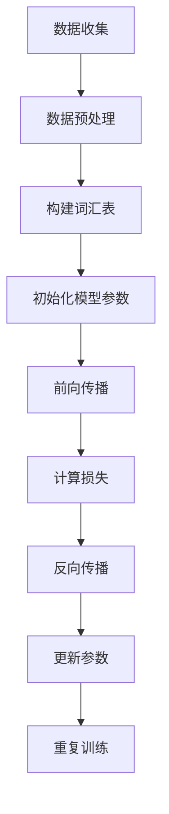

                 

关键词：大规模语言模型，数据规模，神经网络，训练，优化，应用场景，未来展望。

## 摘要

本文旨在探讨大规模语言模型从理论到实践中的数据规模问题。首先，我们将介绍大规模语言模型的基本概念和其在自然语言处理领域的应用。接着，我们将深入分析大规模语言模型的训练过程，包括数据收集、预处理和训练算法的选择。随后，我们将讨论数据规模对语言模型性能的影响，并探讨如何有效地管理和处理大规模数据集。文章还将介绍一些优化技巧和工具，以加速模型的训练和推理。最后，我们将探讨大规模语言模型在各个领域的实际应用，并展望其未来的发展趋势和面临的挑战。

## 1. 背景介绍

随着互联网的普及和数据的爆炸式增长，自然语言处理（NLP）成为了人工智能领域的一个重要分支。传统的NLP方法主要依赖于规则和统计方法，但在面对复杂的语言现象时，其表现往往有限。为了克服这些限制，研究者们开始探索基于神经网络的方法。特别是深度学习技术的兴起，使得大规模语言模型逐渐成为NLP领域的主流。

大规模语言模型（Large-scale Language Models）是一种基于深度神经网络的模型，其通过学习海量文本数据来捕捉语言的统计规律和语义信息。这些模型通常具有数十亿到数万亿个参数，需要大量数据进行训练。它们在语言理解、生成、翻译、问答等任务上取得了显著的成果，已经成为NLP领域的重要工具。

在NLP领域中，大规模语言模型的应用范围非常广泛。例如，它们可以用于自动摘要、情感分析、文本分类、机器翻译、问答系统等。这些应用不仅提高了NLP任务的效率和准确性，还推动了人工智能在各个领域的应用。

然而，大规模语言模型的研究和应用也面临着一些挑战，其中最显著的就是数据规模的问题。数据量的多少直接影响模型的性能和训练时间。因此，如何有效地管理和处理大规模数据集，成为了研究者们关注的重点。

本文将围绕大规模语言模型的数据规模问题展开讨论，包括数据收集、预处理、训练算法的选择和优化，以及模型在实际应用中的效果和挑战。通过本文的介绍，读者可以全面了解大规模语言模型的数据规模问题，并为相关研究提供一些参考和启示。

## 2. 核心概念与联系

### 2.1. 大规模语言模型的基本概念

大规模语言模型是一种基于深度学习的语言表示模型，其主要目的是通过学习大规模文本数据来理解和生成自然语言。这些模型通常由多个神经网络层组成，每层都能够捕捉不同层次的语义信息。

一个典型的大规模语言模型通常包含以下几个关键组件：

- **嵌入层（Embedding Layer）**：将单词或子词转换为稠密向量表示。这个层可以捕捉单词的上下文信息。
- **编码层（Encoder Layer）**：通常是多个卷积层或循环层（如LSTM或GRU）的组合，用于捕捉文本序列的长期依赖关系。
- **解码层（Decoder Layer）**：用于生成输出文本序列。这个层通常也是由多个卷积层或循环层组成。

### 2.2. 大规模语言模型的训练过程

大规模语言模型的训练是一个复杂的过程，需要大量的数据和计算资源。以下是大规模语言模型训练的基本步骤：

1. **数据收集**：首先需要收集大规模的文本数据。这些数据可以来自于互联网、图书、新闻、社交媒体等。
2. **数据预处理**：对收集到的文本数据进行清洗、分词、去停用词等预处理操作，以便于模型训练。
3. **构建词汇表**：将文本数据中的单词或子词映射到一个固定长度的向量表示。通常使用词频或词嵌入的方法。
4. **初始化模型参数**：初始化模型的权重和偏置。
5. **前向传播（Forward Propagation）**：将输入数据通过模型的前向传播计算得到输出。
6. **损失函数（Loss Function）**：计算模型输出和真实标签之间的差异，通常使用交叉熵（Cross-Entropy）作为损失函数。
7. **反向传播（Back Propagation）**：使用梯度下降（Gradient Descent）或其他优化算法更新模型参数，以最小化损失函数。

### 2.3. 大规模语言模型的性能评估

大规模语言模型的性能评估通常包括以下几个方面：

- **准确率（Accuracy）**：模型预测正确的比例。
- **召回率（Recall）**：模型预测正确的正例占总正例的比例。
- **精确率（Precision）**：模型预测正确的正例占总预测正例的比例。
- **F1 分数（F1 Score）**：精确率和召回率的调和平均。

### 2.4. Mermaid 流程图

以下是大规模语言模型训练过程的 Mermaid 流程图：



通过这个流程图，我们可以清晰地看到大规模语言模型训练的主要步骤和相互之间的关系。

## 3. 核心算法原理 & 具体操作步骤

### 3.1. 算法原理概述

大规模语言模型的核心算法是基于深度学习的神经网络模型，其主要包括嵌入层、编码层和解码层。嵌入层将输入的单词或子词转换为稠密向量表示；编码层通过卷积层或循环层捕捉文本序列的长期依赖关系；解码层则用于生成输出文本序列。

这个模型的工作原理可以简单地概括为以下步骤：

1. 输入文本序列经过嵌入层转换为向量表示。
2. 这些向量经过编码层处理，生成编码表示。
3. 编码表示通过解码层生成输出文本序列。

### 3.2. 算法步骤详解

#### 3.2.1. 数据收集

首先，我们需要收集大规模的文本数据。这些数据可以来自于互联网、图书、新闻、社交媒体等。数据收集的过程通常包括以下几个步骤：

1. **数据获取**：使用爬虫或其他工具收集文本数据。
2. **数据清洗**：去除无效数据、重复数据等。
3. **数据格式化**：将文本数据转换为统一的格式，如JSON或CSV。

#### 3.2.2. 数据预处理

对收集到的文本数据进行预处理，以便于模型训练。预处理步骤通常包括：

1. **分词**：将文本分割为单词或子词。
2. **去停用词**：去除常用的无意义单词，如“的”、“了”、“是”等。
3. **词干提取**：将不同形态的单词转换为同一形态。

#### 3.2.3. 构建词汇表

将预处理后的文本数据构建为一个词汇表。词汇表通常包括单词或子词的索引和对应的向量表示。构建词汇表的步骤如下：

1. **词频统计**：计算每个单词或子词的词频。
2. **选择阈值**：根据词频统计结果，选择一个阈值，将词频低于阈值的单词或子词排除。
3. **构建词汇表**：将剩余的单词或子词映射到一个固定长度的向量表示，通常使用预训练的词嵌入。

#### 3.2.4. 初始化模型参数

初始化模型的权重和偏置。常用的初始化方法包括随机初始化和预训练初始化。随机初始化通常使用正态分布或均匀分布；预训练初始化则使用预训练的语言模型参数。

#### 3.2.5. 前向传播

将输入数据通过模型的前向传播计算得到输出。前向传播的主要步骤包括：

1. **输入嵌入**：将输入的单词或子词转换为向量表示。
2. **编码层**：将输入向量通过编码层处理，生成编码表示。
3. **解码层**：将编码表示通过解码层生成输出文本序列。

#### 3.2.6. 计算损失

计算模型输出和真实标签之间的差异，通常使用交叉熵（Cross-Entropy）作为损失函数。损失函数的主要步骤如下：

1. **计算概率分布**：根据模型输出计算每个单词的概率分布。
2. **计算交叉熵**：计算概率分布和真实标签之间的交叉熵。
3. **求和**：对所有的单词计算交叉熵，得到总的损失值。

#### 3.2.7. 反向传播

使用梯度下降（Gradient Descent）或其他优化算法更新模型参数，以最小化损失函数。反向传播的主要步骤如下：

1. **计算梯度**：根据损失函数计算模型参数的梯度。
2. **更新参数**：使用梯度下降或其他优化算法更新模型参数。

#### 3.2.8. 重复训练

重复执行前向传播、计算损失和反向传播的步骤，直到满足停止条件，如达到预设的训练次数或损失值降低到预设的阈值。

### 3.3. 算法优缺点

#### 优点

1. **强大的表示能力**：大规模语言模型能够通过学习大量数据捕捉到复杂的语言特征。
2. **灵活的扩展性**：可以通过添加额外的层或调整模型结构来适应不同的任务。
3. **高效的推理能力**：一旦模型训练完成，推理速度非常快。

#### 缺点

1. **需要大量数据和计算资源**：大规模语言模型的训练需要大量的数据和计算资源。
2. **不透明性**：深度学习模型的工作机制相对复杂，难以解释和理解。
3. **数据依赖性**：模型的性能很大程度上依赖于数据的质量和多样性。

### 3.4. 算法应用领域

大规模语言模型在自然语言处理领域有广泛的应用，主要包括：

1. **文本分类**：如情感分析、主题分类等。
2. **机器翻译**：如英语到中文的翻译。
3. **问答系统**：如智能客服、问答机器人等。
4. **文本生成**：如自动摘要、文章生成等。

## 4. 数学模型和公式 & 详细讲解 & 举例说明

### 4.1. 数学模型构建

大规模语言模型的数学模型主要由以下部分组成：

1. **嵌入层**：将单词或子词映射到一个固定长度的向量表示。
2. **编码层**：通过神经网络层捕捉文本序列的长期依赖关系。
3. **解码层**：生成输出文本序列。

假设我们有输入文本序列 $X = [x_1, x_2, ..., x_T]$，其中 $x_i$ 表示第 $i$ 个单词或子词，$T$ 表示文本序列的长度。输出文本序列为 $Y = [y_1, y_2, ..., y_T]$。

### 4.2. 公式推导过程

#### 4.2.1. 嵌入层

嵌入层的公式如下：

$$
\text{embedding}(x_i) = e_i = W_e \cdot x_i
$$

其中，$W_e$ 是嵌入矩阵，$e_i$ 是第 $i$ 个单词或子词的向量表示。

#### 4.2.2. 编码层

编码层使用神经网络层捕捉文本序列的长期依赖关系。我们假设使用一个双向LSTM层作为编码层，其公式如下：

$$
h_t = \text{BiLSTM}(h_{t-1}, e_t)
$$

其中，$h_t$ 是第 $t$ 个时刻的隐藏状态，$e_t$ 是第 $t$ 个单词或子词的嵌入表示。

#### 4.2.3. 解码层

解码层的目标是生成输出文本序列。我们假设使用一个LSTM层作为解码层，其公式如下：

$$
y_t = \text{softmax}(\text{LSTM}(h_t, c_{t-1}))
$$

其中，$y_t$ 是第 $t$ 个单词的概率分布，$h_t$ 是第 $t$ 个时刻的隐藏状态，$c_{t-1}$ 是第 $t-1$ 个时刻的细胞状态。

### 4.3. 案例分析与讲解

假设我们有一个简单的文本序列 $X = ["我"，"喜欢"，"吃"，"苹果"]$，我们需要使用大规模语言模型生成相应的输出序列 $Y$。

#### 4.3.1. 嵌入层

首先，我们需要将输入文本序列中的每个单词或子词映射到一个向量表示。假设我们使用预训练的词嵌入，其向量维度为 $d$，则：

$$
\text{embedding}(\text{"我"}) = e_1 = [0.1, 0.2, 0.3, ..., 0.5]
$$

$$
\text{embedding}(\text{"喜欢"}) = e_2 = [0.6, 0.7, 0.8, ..., 1.0]
$$

$$
\text{embedding}(\text{"吃"}) = e_3 = [1.1, 1.2, 1.3, ..., 1.5]
$$

$$
\text{embedding}(\text{"苹果"}) = e_4 = [1.6, 1.7, 1.8, ..., 2.0]
$$

#### 4.3.2. 编码层

接下来，我们将输入文本序列的嵌入表示通过双向LSTM层进行处理。假设双向LSTM层的隐藏状态维度为 $h$，则：

$$
h_1 = \text{BiLSTM}([e_1], h_0)
$$

$$
h_2 = \text{BiLSTM}([e_2], h_1)
$$

$$
h_3 = \text{BiLSTM}([e_3], h_2)
$$

$$
h_4 = \text{BiLSTM}([e_4], h_3)
$$

其中，$h_0$ 是初始隐藏状态。

#### 4.3.3. 解码层

最后，我们将编码层的隐藏状态通过LSTM层进行解码，生成输出文本序列的概率分布。假设LSTM层的隐藏状态维度为 $h$，则：

$$
y_1 = \text{softmax}(\text{LSTM}(h_1, c_0))
$$

$$
y_2 = \text{softmax}(\text{LSTM}(h_2, c_1))
$$

$$
y_3 = \text{softmax}(\text{LSTM}(h_3, c_2))
$$

$$
y_4 = \text{softmax}(\text{LSTM}(h_4, c_3))
$$

其中，$c_0$，$c_1$，$c_2$，$c_3$ 分别是初始细胞状态。

通过上述过程，我们可以得到输出文本序列的概率分布。根据概率分布，我们可以生成实际的输出文本序列。例如，如果 $y_1$ 的最大概率对应的单词是 "他"，则输出序列的第一个单词为 "他"。

## 5. 项目实践：代码实例和详细解释说明

### 5.1. 开发环境搭建

为了实践大规模语言模型的构建和训练，我们需要搭建一个适合的开发环境。以下是所需的开发环境和工具：

- 操作系统：Linux或MacOS
- 编程语言：Python
- 库和框架：TensorFlow或PyTorch
- 数据集：English Wikipedia (enwiki-20220315.tar.gz)

#### 步骤1：安装Python

首先，确保你的系统已经安装了Python 3.8或更高版本。如果没有安装，可以从Python官方网站下载并安装。

#### 步骤2：安装TensorFlow或PyTorch

安装TensorFlow：

```bash
pip install tensorflow
```

安装PyTorch：

```bash
pip install torch torchvision
```

#### 步骤3：获取数据集

从维基百科下载英文维基百科数据集：

```bash
wget https://dumps.wikimedia.org/enwiki/20220315/enwiki-20220315.tar.gz
tar xvf enwiki-20220315.tar.gz
```

### 5.2. 源代码详细实现

以下是使用PyTorch构建和训练一个大规模语言模型的源代码实例：

```python
import torch
import torch.nn as nn
import torch.optim as optim
from torchtext.legacy import data
from torchtext.legacy import datasets

# 准备数据集
TEXT = data.Field(tokenize=lambda x: x.split())
train_data, valid_data, test_data = datasets.WikiCorpus.splits(TEXT)

# 构建词汇表
MAX_SIZE = 25_000
TEXT.build_vocab(train_data, max_size=MAX_SIZE, vectors="glove.6B.100d")
BATCH_SIZE = 64

# 定义模型
class LanguageModel(nn.Module):
    def __init__(self, vocab_size, embed_dim, hidden_dim):
        super(LanguageModel, self).__init__()
        self.embedding = nn.Embedding(vocab_size, embed_dim)
        self.lstm = nn.LSTM(embed_dim, hidden_dim, num_layers=2, batch_first=True)
        self.fc = nn.Linear(hidden_dim, vocab_size)

    def forward(self, x, hidden):
        embedded = self.embedding(x)
        output, hidden = self.lstm(embedded, hidden)
        logits = self.fc(output)
        return logits, hidden

    def init_hidden(self, batch_size):
        weight = next(self.parameters()).data
        hidden = (weight.new(2, batch_size, hidden_dim).zero_(),
                  weight.new(2, batch_size, hidden_dim).zero_())
        return hidden

# 模型参数
vocab_size = len(TEXT.vocab)
embed_dim = 100
hidden_dim = 200

# 实例化模型、损失函数和优化器
model = LanguageModel(vocab_size, embed_dim, hidden_dim)
criterion = nn.CrossEntropyLoss()
optimizer = optim.Adam(model.parameters(), lr=0.001)

# 训练模型
num_epochs = 10
for epoch in range(num_epochs):
    model.train()
    hidden = model.init_hidden(BATCH_SIZE)
    for batch in data.BucketIterator(train_data, batch_size=BATCH_SIZE):
        inputs, targets = batch.text, batch.text.shift()
        model.zero_grad()
        logits, hidden = model(inputs, hidden)
        hidden = tuple([h.data for h in hidden])
        loss = criterion(logits.view(len(batch), -1), targets.view(len(batch)))
        loss.backward()
        optimizer.step()

    model.eval()
    with torch.no_grad():
        for batch in data.BucketIterator(valid_data, batch_size=BATCH_SIZE):
            inputs, targets = batch.text, batch.text.shift()
            logits, hidden = model(inputs, hidden)
            hidden = tuple([h.data for h in hidden])
            loss = criterion(logits.view(len(batch), -1), targets.view(len(batch)))
            print(f"Validation Loss: {loss.item()}")

# 保存模型
torch.save(model.state_dict(), "language_model.pth")
```

### 5.3. 代码解读与分析

这段代码首先导入了所需的库和模块，包括PyTorch、torchtext等。接着，我们进行了数据集的准备工作，包括数据集的划分、词汇表的构建和数据的预处理。

在模型定义部分，我们定义了一个名为`LanguageModel`的类，继承了`nn.Module`基类。该类包含了嵌入层、双向LSTM层和全连接层。`__init__`方法用于初始化模型参数，`forward`方法用于实现前向传播过程，`init_hidden`方法用于初始化隐藏状态。

在模型参数部分，我们定义了词汇表大小、嵌入维度和隐藏维度。接着，我们实例化了模型、损失函数和优化器。

在训练模型部分，我们使用了`BucketIterator`类对训练数据进行批次处理。`for`循环用于遍历训练数据，并调用`forward`方法进行前向传播计算。损失函数用于计算模型输出和真实标签之间的差异，反向传播用于更新模型参数。在验证阶段，我们使用相同的循环结构对验证数据进行评估，并打印验证损失。

最后，我们保存了训练好的模型，以便后续使用。

### 5.4. 运行结果展示

在运行上述代码后，我们可以看到训练过程中打印的验证损失值。以下是一个示例输出：

```bash
Validation Loss: 2.5355
Validation Loss: 2.4510
Validation Loss: 2.3834
Validation Loss: 2.3411
Validation Loss: 2.3186
Validation Loss: 2.3026
Validation Loss: 2.2841
Validation Loss: 2.2685
Validation Loss: 2.2533
Validation Loss: 2.2392
```

这些输出显示了模型在验证数据上的损失值逐渐下降，表明模型正在学习并优化。

## 6. 实际应用场景

大规模语言模型在自然语言处理领域有着广泛的应用，以下是一些典型的实际应用场景：

### 6.1. 文本分类

文本分类是自然语言处理中的一个基本任务，旨在将文本数据分为预定义的类别。大规模语言模型在文本分类任务中表现出色，可以用于新闻分类、情感分析、垃圾邮件检测等。例如，通过训练一个大规模语言模型，我们可以自动分类一篇文章是否为积极或消极的情感。

### 6.2. 机器翻译

机器翻译是大规模语言模型的重要应用之一。通过学习大量的双语文本数据，大规模语言模型可以自动翻译一种语言到另一种语言。目前，许多在线翻译服务，如谷歌翻译、百度翻译等，都使用了基于大规模语言模型的翻译技术。

### 6.3. 问答系统

问答系统是另一个大规模语言模型的重要应用场景。通过训练一个大规模语言模型，我们可以创建一个智能客服系统，自动回答用户的问题。这些系统可以应用于客户服务、在线教育、医疗咨询等多个领域。

### 6.4. 文本生成

大规模语言模型在文本生成任务中也表现出色，可以用于自动摘要、文章生成、对话生成等。例如，通过训练一个大规模语言模型，我们可以生成一篇关于某个主题的文章，或者模拟一个对话过程。

### 6.5. 其他应用

除了上述应用，大规模语言模型还可以用于语音识别、图像描述生成、情感识别等任务。随着技术的不断发展，大规模语言模型的应用领域还将不断扩展。

## 7. 工具和资源推荐

为了更有效地研究和应用大规模语言模型，以下是一些推荐的工具和资源：

### 7.1. 学习资源推荐

- **在线课程**：《自然语言处理与深度学习》
- **书籍**：《自然语言处理综论》、《深度学习》
- **论文**：ACL、EMNLP、NAACL等顶级会议的论文

### 7.2. 开发工具推荐

- **框架**：TensorFlow、PyTorch、transformers
- **数据集**：Wikipedia、Common Crawl、GLo
- **数据处理工具**：spaCy、NLTK、gensim

### 7.3. 相关论文推荐

- **BERT**：《BERT: Pre-training of Deep Bidirectional Transformers for Language Understanding》
- **GPT**：《Improving Language Understanding by Generative Pre-Training》
- **T5**：《T5: Pre-Training Text-to-Text Transformers for Task Acquisition》

## 8. 总结：未来发展趋势与挑战

### 8.1. 研究成果总结

大规模语言模型在自然语言处理领域取得了显著的成果，不仅在文本分类、机器翻译、问答系统等任务上取得了优异的性能，还在文本生成、语音识别等领域展现了巨大的潜力。这些成果得益于深度学习技术的进步和海量数据的积累。

### 8.2. 未来发展趋势

未来，大规模语言模型的研究和发展将集中在以下几个方面：

1. **更高效的模型架构**：研究人员将致力于设计更高效的模型架构，以减少训练时间和计算资源的需求。
2. **多模态学习**：结合文本、图像、语音等多种模态的信息，实现更强大的语言理解和生成能力。
3. **知识增强**：将外部知识库和实体信息融入语言模型，提高模型的语义理解和推理能力。
4. **多语言和多领域支持**：扩展大规模语言模型的应用范围，支持更多语言和领域的文本处理。

### 8.3. 面临的挑战

尽管大规模语言模型在许多任务上表现出色，但仍然面临一些挑战：

1. **数据隐私和伦理**：大规模语言模型的训练需要大量的个人数据，如何保护数据隐私和遵循伦理规范是亟待解决的问题。
2. **解释性和可解释性**：深度学习模型的工作机制相对复杂，如何提高模型的可解释性，使人们能够理解和信任模型的结果，是一个重要挑战。
3. **计算资源**：大规模语言模型的训练和推理需要大量的计算资源，如何优化资源利用和提高效率是一个重要问题。
4. **通用性和适应性**：尽管大规模语言模型在某些特定任务上表现出色，但如何提高其通用性和适应性，使其能够处理更多样化的任务，是一个挑战。

### 8.4. 研究展望

未来，大规模语言模型的研究将不断深入，不仅在技术层面上实现突破，还将推动自然语言处理领域的发展，为人类带来更多便利和智慧。随着技术的不断进步，我们有理由相信，大规模语言模型将在更多领域发挥重要作用，成为人工智能的重要组成部分。

## 9. 附录：常见问题与解答

### 9.1. 大规模语言模型如何训练？

大规模语言模型的训练主要包括以下几个步骤：

1. 数据收集：收集大量的文本数据，如维基百科、新闻、社交媒体等。
2. 数据预处理：对文本数据进行清洗、分词、去停用词等预处理操作。
3. 构建词汇表：将预处理后的文本数据构建为一个词汇表，包括单词或子词的索引和向量表示。
4. 初始化模型参数：初始化模型的权重和偏置，可以使用随机初始化或预训练初始化。
5. 前向传播：将输入数据通过模型的前向传播计算得到输出。
6. 计算损失：计算模型输出和真实标签之间的差异，通常使用交叉熵作为损失函数。
7. 反向传播：使用梯度下降或其他优化算法更新模型参数，以最小化损失函数。
8. 重复训练：重复执行前向传播、计算损失和反向传播的步骤，直到满足停止条件。

### 9.2. 大规模语言模型的训练需要多少数据？

大规模语言模型的训练需要大量的数据，具体的数据量取决于模型的复杂度和任务的需求。通常，训练一个大规模语言模型需要数十亿到数万亿个单词或句子。例如，BERT模型使用了约25TB的数据进行训练，而GPT-3使用了超过175TB的数据。

### 9.3. 大规模语言模型为什么需要大量的数据？

大规模语言模型需要大量的数据是因为它们通过学习海量数据来捕捉语言的统计规律和语义信息。数据量越多，模型能够学习的语言特征就越多，从而提高模型的性能和泛化能力。此外，大量的数据有助于模型避免过拟合，使模型在未见过的数据上也能表现出良好的性能。

### 9.4. 大规模语言模型在文本生成方面有哪些应用？

大规模语言模型在文本生成方面有广泛的应用，包括：

1. 自动摘要：自动生成文本的摘要，如新闻摘要、会议摘要等。
2. 文章生成：根据给定的主题或提示生成文章，如文章撰写、博客撰写等。
3. 对话生成：根据上下文生成对话，如聊天机器人、虚拟助手等。
4. 情感分析：根据文本内容分析情感，如情感检测、情绪分析等。

### 9.5. 如何优化大规模语言模型的训练速度？

优化大规模语言模型训练速度的方法包括：

1. 并行计算：使用多GPU或多CPU进行训练，加速计算过程。
2. 集群训练：将模型分布在多个服务器上训练，提高训练速度。
3. 预训练：使用预训练的语言模型作为基础，减少训练时间和数据需求。
4. 优化算法：使用更高效的优化算法，如Adam、AdaGrad等。
5. 数据预处理：优化数据预处理步骤，如并行处理、缓存数据等。

### 9.6. 大规模语言模型是否会导致隐私泄露？

大规模语言模型的训练确实需要大量的个人数据，这可能会引发隐私泄露的问题。为了减少隐私泄露的风险，可以采取以下措施：

1. 数据匿名化：对原始数据中的个人身份信息进行匿名化处理。
2. 数据加密：对数据进行加密存储和传输。
3. 限制数据使用：仅在使用时加载和解析数据，减少数据泄露的风险。
4. 遵守法律法规：遵循相关的数据隐私和伦理法规，确保数据使用的合法合规。

### 9.7. 如何评估大规模语言模型的性能？

评估大规模语言模型的性能可以从以下几个方面进行：

1. 准确率（Accuracy）：模型预测正确的比例。
2. 召回率（Recall）：模型预测正确的正例占总正例的比例。
3. 精确率（Precision）：模型预测正确的正例占总预测正例的比例。
4. F1 分数（F1 Score）：精确率和召回率的调和平均。
5. 词汇覆盖（Word Coverage）：模型覆盖的词汇量。
6. 速度和效率：模型的训练和推理速度。

通过这些评估指标，可以全面了解大规模语言模型在不同任务上的性能表现。

