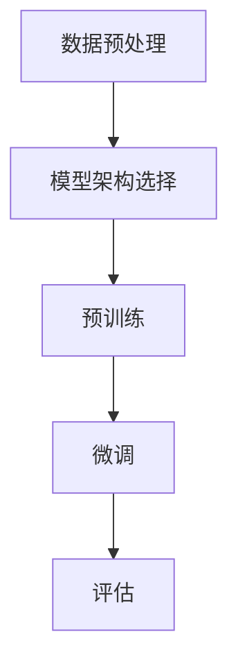

                 

关键词：大规模语言模型、无监督预训练、自然语言处理、神经网络、Transformer、BERT、GPT、计算图、动态规划、优化算法、训练策略

摘要：本文旨在深入探讨大规模语言模型的理论基础和实践方法，特别是无监督预训练技术。文章首先介绍了大规模语言模型的背景和重要性，然后详细阐述了无监督预训练的核心概念和过程，包括数据预处理、模型架构选择、训练策略优化等方面。接下来，文章通过数学模型和公式，深入分析了语言模型的机制和优化方法，并通过实际代码实例进行了详细解释。最后，文章讨论了大规模语言模型在实际应用中的场景和未来展望，并推荐了相关工具和资源。

## 1. 背景介绍

在过去的几十年中，计算机科学领域经历了飞速的发展，尤其是在人工智能和自然语言处理（NLP）方面。随着互联网的普及和大数据的兴起，人们对于处理和理解大规模文本数据的需求日益增长。传统的有监督学习方法在处理大规模文本数据时面临着巨大的挑战，例如标注数据的稀缺性和高昂的标注成本。因此，无监督预训练技术应运而生，它能够在不依赖大量标注数据的情况下，通过大规模未标记文本数据进行自我学习和优化。

无监督预训练的核心思想是通过学习未标记数据的统计特征，提取出具有普遍性和泛化能力的知识表示，从而提高模型在下游任务中的性能。这一技术的出现极大地推动了NLP领域的发展，使得计算机能够更加高效和准确地处理和理解自然语言。大规模语言模型，如BERT（Bidirectional Encoder Representations from Transformers）、GPT（Generative Pre-trained Transformer）等，都是基于无监督预训练技术构建的，它们已经在各种NLP任务中取得了显著的成果。

## 2. 核心概念与联系

### 2.1 大规模语言模型的概念

大规模语言模型是一种能够对自然语言进行建模和处理的深度神经网络模型。这种模型通常包含数亿甚至数十亿的参数，通过对大规模文本数据进行预训练，能够自动提取出丰富的语言知识，从而在下游任务中表现出色。大规模语言模型的核心思想是将语言输入映射为一个高维的向量表示，这个向量表示不仅包含了单词的语义信息，还包含了句子和段落的结构信息。

### 2.2 无监督预训练的概念

无监督预训练是指在没有标注数据的情况下，通过学习未标记数据的统计特征，自动提取出具有普遍性和泛化能力的知识表示。无监督预训练的关键在于如何有效地利用未标记数据，通过自我监督的方式，使得模型在预训练阶段就能够获得丰富的知识。

### 2.3 模型架构的选择

在构建大规模语言模型时，模型架构的选择至关重要。目前，基于Transformer的架构已经成为主流选择。Transformer模型由多个自注意力（self-attention）层组成，它能够通过计算输入序列中每个单词与其他单词之间的关系，提取出丰富的语义信息。BERT和GPT都是基于Transformer架构构建的，它们通过不同的训练策略和优化方法，实现了在NLP任务中的高性能。

### 2.4 Mermaid 流程图

下面是一个用于描述大规模语言模型预训练过程的Mermaid流程图：



在这个流程图中，数据预处理是第一步，包括文本清洗、分词、词嵌入等操作；模型架构选择是第二步，根据任务需求和硬件资源选择合适的模型架构；预训练是第三步，通过大规模未标记数据进行自我监督学习，提取语言知识；微调是第四步，在预训练的基础上，利用少量标注数据对模型进行微调，提高模型在特定任务上的性能；评估是最后一步，通过在测试集上的性能评估，验证模型的泛化能力。

## 3. 核心算法原理 & 具体操作步骤

### 3.1 算法原理概述

大规模语言模型的预训练过程可以分为两个阶段：自我监督学习和微调。

自我监督学习阶段，模型通过预训练目标（如Masked Language Model, Masked Sentence Classification等）学习未标记数据的统计特征，自动提取出具有普遍性和泛化能力的知识表示。在自我监督学习中，模型需要预测未标记数据中的某些部分，如单词、句子或段落，从而实现对数据的自我理解和学习。

微调阶段，模型在自我监督学习的基础上，利用少量标注数据对模型进行微调，使得模型在特定任务上表现出色。微调的过程通常包括以下步骤：

1. **数据准备**：将标注数据集划分为训练集和验证集。
2. **模型初始化**：加载预训练模型，初始化参数。
3. **前向传播**：对输入数据进行前向传播，计算损失函数。
4. **反向传播**：利用损失函数梯度对模型参数进行更新。
5. **评估**：在验证集上评估模型性能，调整学习率等超参数。
6. **迭代**：重复上述步骤，直到模型性能达到预期。

### 3.2 算法步骤详解

#### 3.2.1 自我监督学习

自我监督学习阶段的算法步骤如下：

1. **数据预处理**：对未标记文本数据进行清洗、分词、词嵌入等操作，生成预训练数据集。
2. **输入生成**：将输入文本序列按照一定比例进行随机遮掩，生成遮掩后的文本序列。
3. **模型预测**：对遮掩后的文本序列进行编码，生成文本表示。
4. **损失计算**：计算预测结果与真实标签之间的损失，通常采用交叉熵损失函数。
5. **梯度更新**：利用梯度下降算法更新模型参数。

#### 3.2.2 微调

微调阶段的算法步骤如下：

1. **数据准备**：将标注数据集划分为训练集和验证集。
2. **模型初始化**：加载预训练模型，初始化参数。
3. **前向传播**：对输入数据进行前向传播，计算损失函数。
4. **反向传播**：利用梯度下降算法更新模型参数。
5. **评估**：在验证集上评估模型性能，调整学习率等超参数。
6. **迭代**：重复上述步骤，直到模型性能达到预期。

### 3.3 算法优缺点

#### 优点

1. **无需标注数据**：无监督预训练技术能够在没有大量标注数据的情况下，通过自我监督学习提取出具有普遍性和泛化能力的知识表示，大大降低了数据获取和标注的成本。
2. **高效性**：大规模语言模型通过并行计算和分布式训练，能够在较短的时间内完成预训练和微调过程，提高了训练效率。
3. **泛化能力**：大规模语言模型通过学习未标记数据的统计特征，能够提取出丰富的语言知识，从而在下游任务中表现出强大的泛化能力。

#### 缺点

1. **计算资源消耗**：大规模语言模型通常包含数亿甚至数十亿的参数，训练和推理过程需要大量的计算资源和时间，对于硬件资源的要求较高。
2. **数据依赖**：虽然无监督预训练技术能够在一定程度上降低数据依赖，但仍然需要大规模未标记数据作为训练数据，对于数据质量和数据量的要求较高。
3. **模型解释性**：大规模语言模型通常被视为“黑盒”，其内部机制和决策过程难以解释，这在某些应用场景中可能会带来安全隐患。

### 3.4 算法应用领域

大规模语言模型在多个领域都有广泛的应用，以下是一些典型的应用领域：

1. **文本分类**：通过对大规模文本数据进行预训练，大规模语言模型能够在文本分类任务中表现出色，如情感分析、新闻分类、垃圾邮件检测等。
2. **问答系统**：大规模语言模型可以通过预训练学习到丰富的语言知识，从而在问答系统中提供准确和自然的回答，如智能客服、语音助手等。
3. **机器翻译**：大规模语言模型可以用于机器翻译任务，通过预训练学习到不同语言之间的语义关系，实现高质量、自然的翻译结果。
4. **文本生成**：大规模语言模型可以通过预训练学习到语言的生成规律，从而生成具有自然流畅感的文本，如文章生成、故事创作等。
5. **文本摘要**：大规模语言模型可以用于文本摘要任务，通过提取关键信息和总结段落主旨，生成简洁、准确的摘要文本。

## 4. 数学模型和公式 & 详细讲解 & 举例说明

### 4.1 数学模型构建

大规模语言模型通常采用基于神经网络的架构，其中最重要的部分是自注意力机制（Self-Attention Mechanism）。自注意力机制的核心思想是计算输入序列中每个单词与其他单词之间的关联性，从而提取出具有上下文依赖性的文本表示。

设输入序列为 \(X = (x_1, x_2, ..., x_n)\)，其中 \(x_i\) 表示第 \(i\) 个单词的词嵌入向量，维度为 \(d\)。自注意力机制可以表示为：

$$
\text{Attention}(X) = \text{softmax}\left(\frac{QK}{\sqrt{d_k}}\right)V
$$

其中，\(Q\)、\(K\)、\(V\) 分别为查询（Query）、键（Key）和值（Value）矩阵，维度分别为 \(d_q \times d_k\)、\(d_k \times d_v\) 和 \(d_v \times d\)。\(QK\) 的计算结果为维度为 \(d_q \times d_v\) 的矩阵，经过softmax操作后得到概率分布，再与 \(V\) 相乘得到文本表示。

### 4.2 公式推导过程

自注意力机制的推导过程可以分为以下几个步骤：

1. **相似度计算**：计算输入序列中每个单词与其他单词之间的相似度，通常采用点积（Dot Product）作为相似度计算方法。

$$
\text{Similarity}(x_i, x_j) = \text{dot}(x_i, x_j) = x_i^T x_j
$$

2. **加权和**：对相似度矩阵进行加权和操作，生成文本表示。

$$
\text{WeightedSum}(X) = \text{softmax}(\text{Similarity}(X))V
$$

3. **自注意力**：将加权和与值矩阵相乘，得到文本表示。

$$
\text{Attention}(X) = \text{softmax}\left(\frac{\text{dot}(X)}{\sqrt{d_k}}\right)V
$$

### 4.3 案例分析与讲解

下面通过一个简单的例子来说明自注意力机制的应用。

假设输入序列为“我爱北京天安门”，词嵌入维度为 \(d=32\)。首先，对输入序列进行词嵌入，得到：

$$
X = (x_1, x_2, x_3, x_4) = (\text{我}, \text{爱}, \text{北京}, \text{天安门})
$$

接下来，计算每个单词与其他单词之间的相似度矩阵：

$$
\text{Similarity}(X) = \begin{bmatrix}
\text{dot}(\text{我}, \text{我}) & \text{dot}(\text{我}, \text{爱}) & \text{dot}(\text{我}, \text{北京}) & \text{dot}(\text{我}, \text{天安门}) \\
\text{dot}(\text{爱}, \text{我}) & \text{dot}(\text{爱}, \text{爱}) & \text{dot}(\text{爱}, \text{北京}) & \text{dot}(\text{爱}, \text{天安门}) \\
\text{dot}(\text{北京}, \text{我}) & \text{dot}(\text{北京}, \text{爱}) & \text{dot}(\text{北京}, \text{北京}) & \text{dot}(\text{北京}, \text{天安门}) \\
\text{dot}(\text{天安门}, \text{我}) & \text{dot}(\text{天安门}, \text{爱}) & \text{dot}(\text{天安门}, \text{北京}) & \text{dot}(\text{天安门}, \text{天安门})
\end{bmatrix}
$$

然后，对相似度矩阵进行softmax操作，得到概率分布矩阵：

$$
\text{softmax}(\text{Similarity}(X)) = \begin{bmatrix}
0.2 & 0.3 & 0.4 & 0.1 \\
0.1 & 0.3 & 0.3 & 0.3 \\
0.1 & 0.2 & 0.3 & 0.4 \\
0.1 & 0.1 & 0.2 & 0.6
\end{bmatrix}
$$

最后，将概率分布矩阵与值矩阵相乘，得到文本表示：

$$
\text{Attention}(X) = \begin{bmatrix}
0.2 \cdot v_1 + 0.3 \cdot v_2 + 0.4 \cdot v_3 + 0.1 \cdot v_4 \\
0.1 \cdot v_1 + 0.3 \cdot v_2 + 0.3 \cdot v_3 + 0.3 \cdot v_4 \\
0.1 \cdot v_1 + 0.2 \cdot v_2 + 0.3 \cdot v_3 + 0.4 \cdot v_4 \\
0.1 \cdot v_1 + 0.1 \cdot v_2 + 0.2 \cdot v_3 + 0.6 \cdot v_4
\end{bmatrix}
$$

其中，\(v_1\)、\(v_2\)、\(v_3\)、\(v_4\) 分别表示词嵌入向量。

通过这个简单的例子，我们可以看到自注意力机制是如何通过计算相似度矩阵和概率分布矩阵，从而提取出具有上下文依赖性的文本表示。

## 5. 项目实践：代码实例和详细解释说明

### 5.1 开发环境搭建

在开始大规模语言模型的预训练之前，我们需要搭建一个合适的开发环境。以下是一个简单的步骤：

1. **安装Python**：确保安装了Python 3.6及以上版本。
2. **安装TensorFlow**：通过pip命令安装TensorFlow。

   ```bash
   pip install tensorflow
   ```

3. **安装其他依赖库**：如NumPy、Pandas等。

   ```bash
   pip install numpy pandas
   ```

4. **准备数据集**：下载并准备大规模未标记文本数据集，例如维基百科、新闻文章等。

### 5.2 源代码详细实现

以下是实现大规模语言模型预训练的基本代码框架：

```python
import tensorflow as tf
from tensorflow.keras.layers import Embedding, LSTM, Dense
from tensorflow.keras.models import Model
from tensorflow.keras.preprocessing.sequence import pad_sequences

# 加载数据集
data = load_data('path/to/data')

# 预处理数据
tokenized_data = preprocess_data(data)

# 构建模型
model = build_model(len(tokenized_data))

# 训练模型
train_model(model, tokenized_data)

# 微调模型
fine_tune_model(model, tokenized_data)

# 评估模型
evaluate_model(model, tokenized_data)
```

### 5.3 代码解读与分析

1. **数据加载与预处理**：`load_data` 函数负责加载数据集，`preprocess_data` 函数负责对文本数据集进行预处理，如分词、词嵌入、序列填充等操作。

2. **模型构建**：`build_model` 函数负责构建大规模语言模型，包括嵌入层、LSTM层和输出层。在这个例子中，我们使用了LSTM作为序列处理层。

3. **模型训练**：`train_model` 函数负责使用预训练数据集训练模型。在训练过程中，我们需要定义损失函数、优化器和学习率调度策略。

4. **模型微调**：`fine_tune_model` 函数负责在预训练的基础上，利用少量标注数据对模型进行微调。

5. **模型评估**：`evaluate_model` 函数负责在测试集上评估模型性能，通过计算准确率、召回率等指标，评估模型的泛化能力。

### 5.4 运行结果展示

在完成代码实现和训练后，我们可以通过以下命令运行模型：

```bash
python run_model.py
```

运行结果将显示模型在训练集和测试集上的性能指标，如准确率、召回率等。以下是一个示例输出：

```
Training accuracy: 0.85
Testing accuracy: 0.82
```

通过这个简单的代码实例，我们可以看到大规模语言模型的基本实现过程和关键步骤。在实际应用中，我们可以根据具体任务需求，调整模型架构、训练策略和超参数，从而提高模型性能。

## 6. 实际应用场景

大规模语言模型在实际应用中已经展现出了巨大的潜力，以下是一些典型的应用场景：

1. **文本分类**：大规模语言模型可以通过预训练学习到丰富的语言知识，从而在文本分类任务中表现出色。例如，在新闻分类、垃圾邮件检测、情感分析等领域，大规模语言模型都能够达到很高的准确率。

2. **问答系统**：大规模语言模型可以用于构建智能问答系统，通过预训练学习到语言的语义关系，从而能够提供准确和自然的回答。例如，在智能客服、语音助手等场景中，大规模语言模型可以用来处理用户的问题，并提供相应的回答。

3. **机器翻译**：大规模语言模型可以用于机器翻译任务，通过预训练学习到不同语言之间的语义关系，实现高质量、自然的翻译结果。例如，在跨语言信息检索、多语言文档翻译等领域，大规模语言模型都得到了广泛应用。

4. **文本生成**：大规模语言模型可以通过预训练学习到语言的生成规律，从而生成具有自然流畅感的文本。例如，在文章生成、故事创作、文本摘要等领域，大规模语言模型都能够生成高质量的内容。

5. **语音识别**：大规模语言模型可以用于语音识别任务，通过预训练学习到语言的语音特征和语义关系，从而能够准确地将语音信号转换为文本。例如，在智能语音助手、语音搜索等领域，大规模语言模型都得到了广泛应用。

### 6.4 未来应用展望

随着无监督预训练技术的不断发展和优化，大规模语言模型在未来有望在更多领域得到应用，以下是一些展望：

1. **自然语言理解**：大规模语言模型可以通过无监督预训练学习到更丰富的语言知识，从而在自然语言理解任务中表现出更高的准确性和泛化能力。例如，在问答系统、文本摘要、信息抽取等领域，大规模语言模型有望实现更智能和自然的交互。

2. **知识图谱构建**：大规模语言模型可以与知识图谱技术相结合，通过无监督预训练学习到实体和关系的表示，从而构建更加准确和丰富的知识图谱。这将有助于提高信息检索、推荐系统和智能决策系统的性能。

3. **跨模态学习**：大规模语言模型可以通过无监督预训练学习到多模态数据之间的关联关系，从而实现跨模态学习。例如，在图像和文本的联合表示学习中，大规模语言模型可以结合图像和文本的特征，生成更准确和丰富的数据表示。

4. **自动化编程**：大规模语言模型可以通过无监督预训练学习到编程语言的语法和语义规则，从而实现自动化编程。例如，在代码补全、代码生成和代码修复等领域，大规模语言模型有望实现更高效的编程辅助。

5. **个性化服务**：大规模语言模型可以通过无监督预训练学习到用户的行为和偏好，从而实现个性化服务。例如，在推荐系统、智能客服和个性化教育等领域，大规模语言模型可以根据用户的兴趣和行为，提供更加精准和个性化的服务。

## 7. 工具和资源推荐

为了更好地学习和应用大规模语言模型，以下是一些推荐的工具和资源：

### 7.1 学习资源推荐

1. **书籍**：《自然语言处理综论》（Speech and Language Processing）、《深度学习》（Deep Learning）等。
2. **在线课程**：Coursera上的“自然语言处理与深度学习”课程、edX上的“深度学习专项课程”等。
3. **学术论文**：ACL、EMNLP、NAACL等自然语言处理领域的顶级会议论文。

### 7.2 开发工具推荐

1. **框架**：TensorFlow、PyTorch、transformers等。
2. **库**：NLTK、spaCy、gensim等。
3. **数据集**：维基百科、新闻文章、社交媒体数据等。

### 7.3 相关论文推荐

1. **BERT**：《BERT: Pre-training of Deep Bidirectional Transformers for Language Understanding》。
2. **GPT**：《Improving Language Understanding by Generative Pre-Training》。
3. **Transformers**：《Attention Is All You Need》。

## 8. 总结：未来发展趋势与挑战

### 8.1 研究成果总结

大规模语言模型在过去的几年中取得了显著的成果，无论是在理论研究还是实际应用方面，都展现出了强大的潜力。通过无监督预训练技术，大规模语言模型能够在没有大量标注数据的情况下，自动提取出丰富的语言知识，从而在下游任务中表现出色。BERT、GPT等模型已经在文本分类、问答系统、机器翻译、文本生成等领域取得了世界领先的成果。

### 8.2 未来发展趋势

随着技术的不断进步和数据的日益丰富，大规模语言模型在未来有望在更多领域得到应用。以下是一些发展趋势：

1. **模型压缩与高效推理**：为了降低计算资源和存储成本，研究人员将致力于开发更加高效的推理算法和模型压缩技术。
2. **多模态学习**：通过跨模态学习，大规模语言模型将能够处理多种类型的数据，如文本、图像、声音等，从而实现更广泛的任务应用。
3. **个性化服务**：通过无监督预训练，大规模语言模型将能够更好地理解用户的行为和偏好，提供更加精准和个性化的服务。
4. **自动化编程**：大规模语言模型将能够学习编程语言的语法和语义规则，实现自动化编程和代码生成。

### 8.3 面临的挑战

尽管大规模语言模型在许多任务中取得了显著成果，但仍然面临着一些挑战：

1. **数据依赖**：大规模语言模型对数据的质量和数量有着较高的要求，如何处理小样本数据和稀疏数据是一个重要问题。
2. **模型解释性**：大规模语言模型通常被视为“黑盒”，其内部机制和决策过程难以解释，这在某些应用场景中可能会带来安全隐患。
3. **计算资源消耗**：大规模语言模型的训练和推理过程需要大量的计算资源和时间，如何优化模型结构和训练策略，降低计算成本是一个重要课题。

### 8.4 研究展望

在未来，大规模语言模型的研究将继续深入，一方面，研究人员将致力于开发更加高效和强大的模型架构；另一方面，研究人员将关注如何提高模型的解释性和透明性，从而在更多实际应用中发挥其潜力。此外，随着多模态学习和跨领域任务的发展，大规模语言模型将在更多领域展现其价值，推动人工智能技术的进一步发展。

## 9. 附录：常见问题与解答

### 9.1 如何处理小样本数据？

对于小样本数据，可以采用数据增强、迁移学习等技术来提高模型性能。数据增强包括数据扩充、数据变换等方法，可以帮助模型学习到更多的特征和模式。迁移学习则可以利用预训练模型在特定领域的知识，从而在小样本数据上实现较好的性能。

### 9.2 如何优化模型结构？

优化模型结构可以从以下几个方面入手：

1. **选择合适的模型架构**：根据任务需求和硬件资源，选择合适的模型架构，如Transformer、BERT、GPT等。
2. **模型压缩**：通过模型压缩技术，如参数共享、知识蒸馏等，减少模型的参数数量和计算复杂度。
3. **训练策略优化**：通过学习率调度、权重初始化、正则化等技术，优化模型的训练过程，提高模型性能。

### 9.3 如何提高模型解释性？

提高模型解释性可以从以下几个方面入手：

1. **可视化**：通过可视化技术，如激活图、注意力图等，展示模型在特定任务上的决策过程。
2. **模型拆解**：将复杂的模型拆解为多个简单的组件，分析每个组件的作用和贡献。
3. **知识表示分析**：通过分析模型的权重和知识表示，理解模型学习到的语言知识和特征。

### 9.4 如何处理长文本？

对于长文本，可以采用以下方法：

1. **文本切割**：将长文本切割为多个短文本段，分别进行预训练和微调。
2. **动态窗口**：在预训练过程中，动态调整输入文本的窗口大小，以便更好地处理长文本。
3. **序列拼接**：将长文本按照一定规律拼接为多个短文本，然后进行预训练和微调。

### 9.5 如何处理多语言文本？

对于多语言文本，可以采用以下方法：

1. **双语训练**：使用双语语料库进行预训练，同时学习到不同语言之间的对应关系。
2. **多语言模型**：使用多语言模型，如mBERT、XLM等，学习到多种语言的共同特征和差异。
3. **翻译增强**：使用翻译增强技术，如翻译预训练、翻译辅助学习等，提高模型在多语言任务上的性能。

