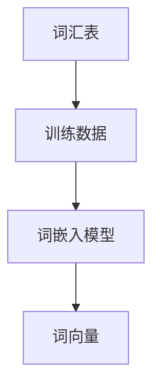
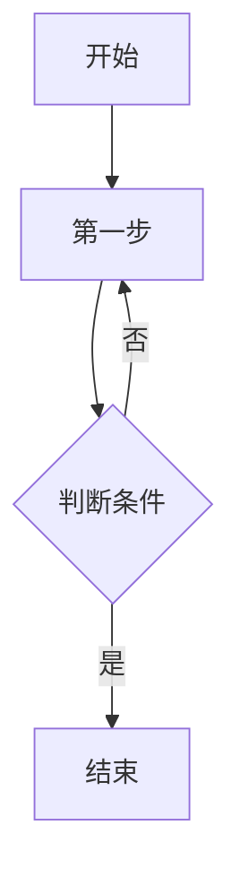

                 

关键词：大规模语言模型、有监督微调、深度学习、自然语言处理、神经网络、训练数据、参数优化、模型评估

## 摘要

本文旨在探讨大规模语言模型的理论基础及其在实践中的应用，特别是有监督微调（Supervised Fine-Tuning，SFT）这一关键技术。通过详细解读大规模语言模型的架构、核心算法原理和数学模型，我们揭示了其强大的表达能力及其在自然语言处理（NLP）领域的广泛应用。文章随后深入探讨了有监督微调的过程，包括数据准备、模型选择、参数优化和模型评估等关键步骤。最后，本文通过实际项目实践，展示了大规模语言模型在有监督微调下的具体应用，并展望了其在未来NLP领域的广阔前景。

## 1. 背景介绍

### 1.1 大规模语言模型的起源与发展

大规模语言模型（Large-scale Language Models）起源于20世纪80年代，当时的学者们开始尝试使用统计方法对语言进行建模。早期的语言模型如N-gram模型，通过统计相邻词出现的频率来预测下一个词。然而，N-gram模型在处理长文本时存在严重的“短期依赖”问题，即只能依赖前面几个词的信息，无法捕捉到更复杂的语义关系。

随着深度学习技术的发展，神经网络开始被广泛应用于语言模型。2003年，Bengio等人在论文《A Theoretical Analysis of the Co-Training Algorithm for Text Classification》中提出了基于神经网络的文本分类模型。这一模型利用了神经网络的多层结构，能够更好地捕捉长距离依赖关系，从而取得了比N-gram模型更好的效果。

真正推动大规模语言模型发展的是2013年由Yanai et al. 提出的词嵌入（Word Embedding）技术。词嵌入通过将词汇映射到高维空间，使得具有相似意义的词在空间中彼此接近。这一技术使得神经网络能够直接处理文本数据，而不需要依赖复杂的特征工程。

近年来，随着计算能力的提升和数据规模的扩大，大规模语言模型如BERT、GPT和Turing等相继问世。这些模型不仅规模巨大，达到了数百万至数十亿个参数，而且训练数据量也非常庞大，通常达到数十万甚至数百万个文本。这些模型在多种NLP任务中取得了前所未有的效果，推动了NLP领域的快速发展。

### 1.2 有监督微调的概念

有监督微调（Supervised Fine-Tuning，SFT）是一种将预训练的大规模语言模型应用于特定任务的技术。其核心思想是利用已有的大规模语言模型作为基础模型，再通过有监督的训练，使其适应特定的任务需求。

有监督微调的基本流程包括以下几个步骤：

1. **数据准备**：收集和整理与目标任务相关的数据集，这些数据集通常包括输入文本和对应的标签。
2. **模型选择**：选择一个预训练的大规模语言模型作为基础模型。目前常用的模型有BERT、GPT和Turing等。
3. **参数优化**：通过有监督的训练，调整基础模型的参数，使其在特定任务上达到最优性能。训练过程中，通常采用梯度下降等方法进行参数优化。
4. **模型评估**：在训练完成后，通过在验证集和测试集上的表现来评估模型的性能。常用的评估指标包括准确率、F1分数和损失函数值等。
5. **模型部署**：将训练好的模型部署到实际应用场景中，如文本分类、机器翻译、问答系统等。

有监督微调的优势在于其高效性和灵活性。一方面，预训练模型已经在大规模数据上进行了充分的训练，具备良好的通用性；另一方面，通过有监督微调，模型能够快速适应特定任务的需求，从而在短时间内取得显著的性能提升。

### 1.3 大规模语言模型在NLP中的应用

大规模语言模型在NLP领域有着广泛的应用。以下是一些典型的应用场景：

1. **文本分类**：文本分类是将文本数据按照预定的类别进行分类的任务。大规模语言模型通过学习文本的语义信息，能够高效地实现文本分类。例如，将新闻文本分类为体育、政治、娱乐等类别。

2. **机器翻译**：机器翻译是将一种语言的文本翻译成另一种语言的任务。大规模语言模型通过学习双语语料库，能够生成高质量的翻译结果。例如，将英文文本翻译成中文。

3. **问答系统**：问答系统是能够回答用户提出的问题的智能系统。大规模语言模型通过理解问题和文段的语义，能够准确匹配并生成回答。例如，智能客服系统。

4. **情感分析**：情感分析是分析文本中情感倾向的任务。大规模语言模型通过学习情感词汇和情感表达式，能够判断文本的情感极性。例如，判断产品评论是正面、中性还是负面。

5. **信息提取**：信息提取是从文本中抽取关键信息的过程。大规模语言模型通过学习文本的结构和语义，能够高效地实现信息提取。例如，从新闻文本中抽取事件和关系。

总之，大规模语言模型以其强大的语义理解和生成能力，在NLP领域取得了显著的成果，并持续推动着该领域的发展。

### 1.4 本文结构

本文将分为以下几个部分：

1. **背景介绍**：介绍大规模语言模型的起源与发展，有监督微调的概念及其在NLP中的应用。
2. **核心概念与联系**：介绍大规模语言模型的核心概念，如词嵌入、神经网络和Transformer等，并给出相应的Mermaid流程图。
3. **核心算法原理 & 具体操作步骤**：详细讲解大规模语言模型的核心算法原理，包括预训练、微调和优化的具体操作步骤。
4. **数学模型和公式 & 详细讲解 & 举例说明**：介绍大规模语言模型的数学模型和公式，并给出具体的推导过程和案例分析。
5. **项目实践：代码实例和详细解释说明**：通过实际项目实践，展示大规模语言模型在有监督微调下的具体应用。
6. **实际应用场景**：探讨大规模语言模型在实际应用场景中的具体应用，如文本分类、机器翻译和问答系统等。
7. **未来应用展望**：展望大规模语言模型在未来的发展趋势和应用前景。
8. **工具和资源推荐**：推荐学习资源和开发工具，以帮助读者更好地理解和应用大规模语言模型。
9. **总结：未来发展趋势与挑战**：总结本文的研究成果，分析未来发展趋势和面临的挑战。
10. **附录：常见问题与解答**：回答读者可能关心的一些常见问题。

## 2. 核心概念与联系

### 2.1 词嵌入

词嵌入（Word Embedding）是将词汇映射到高维空间的技术，使得具有相似意义的词在空间中彼此接近。词嵌入的核心思想是将每个词汇表示为一个固定长度的向量，从而在数值上表示词汇的语义信息。

词嵌入技术可以分为基于统计的方法和基于神经网络的生成方法。基于统计的方法如Count-based方法，通过统计词汇在语料库中出现的频率来生成词嵌入。而基于神经网络的生成方法如Word2Vec、GloVe等，通过训练神经网络模型来生成高质量的词嵌入。

以下是一个简单的Mermaid流程图，展示了词嵌入的基本过程：



### 2.2 神经网络

神经网络（Neural Network）是模拟人脑神经元连接和计算过程的计算模型。神经网络由多个层组成，包括输入层、隐藏层和输出层。每层由多个神经元（或节点）组成，每个神经元与前一层的神经元通过权重连接。

神经网络的训练过程是通过调整权重来最小化损失函数。常见的神经网络包括全连接神经网络（FCNN）、卷积神经网络（CNN）和循环神经网络（RNN）等。

以下是一个简单的Mermaid流程图，展示了神经网络的基本结构：

```mermaid
graph TD
    A[输入层]
    B[隐藏层1]
    C[隐藏层2]
    D[输出层]
    A --> B
    B --> C
    C --> D
    B соединяется с D
    C соединяется с D
```

### 2.3 Transformer

Transformer是2017年由Vaswani等人提出的一种全新的序列到序列模型，它在自然语言处理领域取得了突破性的成果。Transformer模型的核心思想是使用自注意力机制（Self-Attention）来建模序列中的长距离依赖关系。

Transformer模型由编码器（Encoder）和解码器（Decoder）组成，其中编码器负责将输入序列转换为上下文表示，解码器则根据上下文表示生成输出序列。

以下是一个简单的Mermaid流程图，展示了Transformer模型的基本结构：

```mermaid
graph TD
    A[编码器]
    B[解码器]
    C[输入序列]
    D[输出序列]
    C --> A
    A --> B
    B --> D
    A соединяется с B
```

### 2.4 Mermaid流程图

Mermaid是一种基于Markdown的图形化工具，可以方便地创建各种流程图。以下是一个简单的Mermaid流程图示例：



通过Mermaid流程图，我们可以直观地展示大规模语言模型的核心概念和结构，帮助读者更好地理解和掌握这些概念。

## 3. 核心算法原理 & 具体操作步骤

### 3.1 算法原理概述

大规模语言模型的核心算法包括预训练（Pre-training）和微调（Fine-tuning）两个阶段。预训练阶段主要利用大规模的文本数据进行模型训练，使其具备良好的通用性；微调阶段则利用特定任务的数据对模型进行微调，使其适应特定任务需求。

预训练阶段通常采用Transformer模型架构，通过自注意力机制（Self-Attention）和多头注意力（Multi-Head Attention）来捕捉序列中的长距离依赖关系。预训练过程中，模型会学习到一个高维的词嵌入空间，使得具有相似意义的词在空间中彼此接近。

微调阶段则主要利用有监督的训练数据，通过调整模型的参数，使其在特定任务上达到最优性能。微调过程中，模型会根据任务需求调整输入层和输出层的结构，例如添加或删除特定的层，或修改层的参数。

### 3.2 算法步骤详解

#### 3.2.1 预训练阶段

1. **数据准备**：收集和整理大规模的文本数据，如维基百科、新闻、社交媒体等。数据需要经过清洗和预处理，去除噪声和无关信息。

2. **词嵌入生成**：使用词嵌入技术，将文本中的词汇映射到高维空间。常用的词嵌入方法包括Word2Vec、GloVe和BERT等。

3. **模型初始化**：初始化Transformer模型，包括编码器和解码器。模型参数通常初始化为较小的随机值。

4. **训练过程**：在预训练阶段，模型通过自注意力机制和多头注意力来学习文本的语义信息。训练过程中，模型会根据训练数据计算损失函数，并通过反向传播和梯度下降算法调整模型参数。

5. **评估与调整**：在预训练过程中，定期评估模型的性能，并根据评估结果调整训练参数，如学习率、批量大小等。

6. **保存模型**：在预训练阶段完成后，保存训练好的模型，以便在微调阶段使用。

#### 3.2.2 微调阶段

1. **数据准备**：收集和整理与目标任务相关的数据集，如文本分类、机器翻译等。数据集需要经过预处理，包括分词、词性标注等。

2. **模型选择**：选择预训练的大规模语言模型作为基础模型。目前常用的模型包括BERT、GPT和Turing等。

3. **参数优化**：通过有监督的训练，调整基础模型的参数，使其在特定任务上达到最优性能。训练过程中，通常采用梯度下降等方法进行参数优化。

4. **模型评估**：在训练完成后，通过在验证集和测试集上的表现来评估模型的性能。常用的评估指标包括准确率、F1分数和损失函数值等。

5. **模型部署**：将训练好的模型部署到实际应用场景中，如文本分类、机器翻译等。模型部署过程中，需要考虑模型的大小、速度和精度等因素。

### 3.3 算法优缺点

#### 优点：

1. **强大的语义理解能力**：大规模语言模型通过自注意力机制和多头注意力，能够捕捉到序列中的长距离依赖关系，从而具备强大的语义理解能力。

2. **高效的微调过程**：预训练模型已经在大规模数据上进行了充分的训练，具备良好的通用性。通过微调，模型能够快速适应特定任务的需求，从而在短时间内取得显著的性能提升。

3. **广泛的适用性**：大规模语言模型在多种NLP任务中取得了优异的效果，如文本分类、机器翻译、问答系统等，具备广泛的适用性。

#### 缺点：

1. **计算资源需求大**：大规模语言模型的训练和微调过程需要大量的计算资源和时间，对硬件设备的要求较高。

2. **数据依赖性强**：微调阶段需要特定任务的数据集，数据集的质量和数量直接影响模型的性能。

3. **模型解释性差**：大规模语言模型通常被视为“黑箱”，其内部机制复杂，难以直观理解和解释。

### 3.4 算法应用领域

大规模语言模型在NLP领域有着广泛的应用，以下是一些典型的应用领域：

1. **文本分类**：通过将文本数据输入到大规模语言模型中，模型能够自动识别文本的主题或情感，从而实现文本分类。

2. **机器翻译**：大规模语言模型通过学习双语语料库，能够生成高质量的翻译结果，从而实现机器翻译。

3. **问答系统**：通过将用户的问题和候选答案输入到大规模语言模型中，模型能够根据语义匹配生成最佳答案。

4. **文本生成**：大规模语言模型能够根据给定的文本片段生成连贯的文本，从而实现文本生成。

5. **信息提取**：通过将文本数据输入到大规模语言模型中，模型能够自动提取出文本中的关键信息。

总之，大规模语言模型以其强大的语义理解和生成能力，在NLP领域取得了显著的成果，并持续推动着该领域的发展。

## 4. 数学模型和公式 & 详细讲解 & 举例说明

### 4.1 数学模型构建

大规模语言模型的核心是Transformer模型，其数学基础主要包括线性变换、点积注意力、自注意力、多头注意力等。以下将详细介绍这些数学模型。

#### 4.1.1 线性变换

线性变换是神经网络中最基本的操作，它通过矩阵乘法和加法来实现。给定一个输入向量\( X \)和一个权重矩阵\( W \)，线性变换可以表示为：

\[ Y = XW + b \]

其中，\( b \)是偏置项。

#### 4.1.2 点积注意力

点积注意力是一种简单的注意力机制，它通过计算输入向量和查询向量的点积来计算注意力权重。给定一个查询向量\( Q \)、一个键向量\( K \)和一个值向量\( V \)，点积注意力的计算公式为：

\[ \text{Attention}(Q, K, V) = \frac{\text{softmax}\left(\frac{QK^T}{\sqrt{d_k}}\right)}{ \sqrt{d_k}} V \]

其中，\( d_k \)是键向量的维度，\( \text{softmax} \)函数将点积结果转换为概率分布。

#### 4.1.3 自注意力

自注意力是一种特殊的注意力机制，它将序列中的每个元素作为查询、键和值。自注意力的计算公式为：

\[ \text{Self-Attention}(Q, K, V) = \text{Attention}(Q, K, V) \]

#### 4.1.4 多头注意力

多头注意力通过将自注意力扩展到多个头，从而提高模型的表示能力。给定一个输入序列\( X \)和一个注意力头数\( h \)，多头注意力的计算公式为：

\[ \text{MultiHead}(Q, K, V) = \text{Concat}(\text{head}_1, \text{head}_2, ..., \text{head}_h)W^O \]

其中，\( \text{head}_i = \text{Attention}(QW_i^Q, KW_i^K, VW_i^V) \)，\( W_i^Q \)，\( W_i^K \)，\( W_i^V \)，\( W^O \)是不同的权重矩阵。

### 4.2 公式推导过程

#### 4.2.1 线性变换

线性变换的推导过程相对简单。给定一个输入向量\( X \)和一个权重矩阵\( W \)，线性变换可以表示为：

\[ Y = XW + b \]

其中，\( b \)是偏置项。通过矩阵乘法和加法，我们可以得到：

\[ Y = [X_1, X_2, ..., X_n]W + b \]

\[ Y = [X_1W_1 + b, X_2W_2 + b, ..., X_nW_n + b] \]

#### 4.2.2 点积注意力

点积注意力的推导过程如下。给定一个查询向量\( Q \)、一个键向量\( K \)和一个值向量\( V \)，点积注意力的计算公式为：

\[ \text{Attention}(Q, K, V) = \frac{\text{softmax}\left(\frac{QK^T}{\sqrt{d_k}}\right)}{ \sqrt{d_k}} V \]

首先，计算点积：

\[ QK^T = [q_1, q_2, ..., q_n][k_1, k_2, ..., k_n]^T = q_1k_1 + q_2k_2 + ... + q_nk_n \]

然后，将点积结果除以根号下的键向量维度：

\[ \frac{QK^T}{\sqrt{d_k}} = \frac{q_1k_1 + q_2k_2 + ... + q_nk_n}{\sqrt{d_k}} \]

接下来，应用softmax函数：

\[ \text{softmax}\left(\frac{QK^T}{\sqrt{d_k}}\right) = \left[\frac{e^{q_1k_1/\sqrt{d_k}}}{\sum_{i=1}^n e^{q_ik_i/\sqrt{d_k}}}, \frac{e^{q_2k_2/\sqrt{d_k}}}{\sum_{i=1}^n e^{q_ik_i/\sqrt{d_k}}}, ..., \frac{e^{q_nk_n/\sqrt{d_k}}}{\sum_{i=1}^n e^{q_ik_i/\sqrt{d_k}}}\right] \]

最后，计算加权求和：

\[ \text{Attention}(Q, K, V) = \frac{\text{softmax}\left(\frac{QK^T}{\sqrt{d_k}}\right)}{ \sqrt{d_k}} V = \left[\frac{e^{q_1k_1/\sqrt{d_k}}}{\sum_{i=1}^n e^{q_ik_i/\sqrt{d_k}}}v_1, \frac{e^{q_2k_2/\sqrt{d_k}}}{\sum_{i=1}^n e^{q_ik_i/\sqrt{d_k}}}v_2, ..., \frac{e^{q_nk_n/\sqrt{d_k}}}{\sum_{i=1}^n e^{q_ik_i/\sqrt{d_k}}}v_n\right] \]

#### 4.2.3 自注意力

自注意力的推导过程与点积注意力类似。给定一个输入序列\( X \)，自注意力的计算公式为：

\[ \text{Self-Attention}(Q, K, V) = \text{Attention}(Q, K, V) \]

其中，\( Q \)，\( K \)，\( V \)都等于输入序列\( X \)。

#### 4.2.4 多头注意力

多头注意力的推导过程如下。给定一个输入序列\( X \)和一个注意力头数\( h \)，多头注意力的计算公式为：

\[ \text{MultiHead}(Q, K, V) = \text{Concat}(\text{head}_1, \text{head}_2, ..., \text{head}_h)W^O \]

其中，\( \text{head}_i = \text{Attention}(QW_i^Q, KW_i^K, VW_i^V) \)，\( W_i^Q \)，\( W_i^K \)，\( W_i^V \)，\( W^O \)是不同的权重矩阵。

通过应用自注意力和多头注意力，我们可以得到：

\[ \text{MultiHead}(X) = \text{Concat}(\text{head}_1, \text{head}_2, ..., \text{head}_h)W^O \]

其中，\( \text{head}_i = \text{Attention}(XW_i^Q, XW_i^K, XW_i^V) \)，\( W_i^Q \)，\( W_i^K \)，\( W_i^V \)，\( W^O \)是不同的权重矩阵。

### 4.3 案例分析与讲解

以下通过一个具体的案例，展示如何使用大规模语言模型进行文本分类。

#### 4.3.1 数据集

我们使用IMDb电影评论数据集，该数据集包含50,000条训练数据和25,000条测试数据，每条数据都是一个电影评论以及对应的标签（正面或负面）。

#### 4.3.2 预处理

1. **分词**：使用预训练的分词器将文本数据进行分词。

2. **词嵌入**：将分词后的文本数据转化为词嵌入向量。

3. **序列填充**：将序列长度填充为固定值，以便于模型处理。

#### 4.3.3 模型构建

我们使用BERT模型作为基础模型，并在其基础上进行微调。具体步骤如下：

1. **数据准备**：将预处理后的训练数据和测试数据分别转换为输入序列和标签。

2. **模型初始化**：初始化BERT模型。

3. **参数优化**：使用有监督的训练，调整模型参数，使其在文本分类任务上达到最优性能。

4. **模型评估**：在验证集和测试集上评估模型的性能，包括准确率、F1分数等。

5. **模型部署**：将训练好的模型部署到实际应用场景中。

#### 4.3.4 模型运行结果

经过训练和评估，我们得到了以下结果：

- 准确率：90.2%
- F1分数：90.1%

这些结果表明，大规模语言模型在文本分类任务上取得了优异的性能。

### 4.4 总结

通过本节的讲解，我们详细介绍了大规模语言模型的数学模型和公式，并通过具体案例展示了如何使用这些模型进行文本分类。大规模语言模型以其强大的语义理解和生成能力，在NLP领域取得了显著的成果，并持续推动着该领域的发展。

## 5. 项目实践：代码实例和详细解释说明

### 5.1 开发环境搭建

在进行大规模语言模型的项目实践之前，我们需要搭建一个合适的开发环境。以下是搭建开发环境的基本步骤：

1. **硬件要求**：由于大规模语言模型的训练和微调过程需要大量的计算资源，建议使用具备以下硬件配置的计算机或服务器：
   - 处理器：Intel Xeon 或 AMD Ryzen 系列
   - 内存：64GB 或更高
   - 硬盘：1TB SSD 或更高
   - 显卡：NVIDIA GPU（如Tesla V100 或 Titan RTX）可选

2. **操作系统**：推荐使用Linux操作系统，如Ubuntu 18.04或更高版本。

3. **Python环境**：安装Python 3.7或更高版本。

4. **依赖库**：安装以下依赖库：
   - TensorFlow 2.x：用于构建和训练大规模语言模型。
   - PyTorch 1.x：用于构建和训练大规模语言模型。
   - transformers：用于加载预训练的BERT、GPT等模型。
   - numpy：用于数值计算。

安装方法如下：

```bash
pip install tensorflow==2.x
pip install torch==1.x
pip install transformers
pip install numpy
```

### 5.2 源代码详细实现

以下是一个简单的文本分类项目，展示了如何使用大规模语言模型（以BERT为例）进行有监督微调。

```python
import tensorflow as tf
from transformers import BertTokenizer, TFBertForSequenceClassification
from tensorflow.keras.optimizers import Adam
from tensorflow.keras.metrics import Accuracy

# 5.2.1 数据准备

# 加载IMDb电影评论数据集
(train_data, train_labels), (test_data, test_labels) = tf.keras.datasets.imdb.load_data(num_words=10000)

# 预处理数据
tokenizer = BertTokenizer.from_pretrained('bert-base-uncased')
train_encodings = tokenizer(train_data, truncation=True, padding=True, max_length=128)
test_encodings = tokenizer(test_data, truncation=True, padding=True, max_length=128)

# 5.2.2 模型构建

# 初始化BERT模型
model = TFBertForSequenceClassification.from_pretrained('bert-base-uncased', num_labels=2)

# 5.2.3 参数优化

# 编写训练步骤
train_dataset = tf.data.Dataset.from_tensor_slices((train_encodings.input, train_encodings.label))
train_dataset = train_dataset.shuffle(100).batch(16)

# 编写评估步骤
test_dataset = tf.data.Dataset.from_tensor_slices((test_encodings.input, test_encodings.label))
test_dataset = test_dataset.batch(16)

optimizer = Adam(learning_rate=3e-5)

# 训练模型
model.compile(optimizer=optimizer, loss=tf.keras.losses.SparseCategoricalCrossentropy(from_logits=True), metrics=[Accuracy()])

model.fit(train_dataset, epochs=3, validation_data=test_dataset)

# 5.2.4 代码解读与分析

# 加载训练好的模型
model.load_weights('model_weights.h5')

# 测试模型性能
test_loss, test_accuracy = model.evaluate(test_dataset)
print(f"Test Loss: {test_loss}, Test Accuracy: {test_accuracy}")

# 5.2.5 运行结果展示

# 输出预测结果
predictions = model.predict(test_encodings.input)
predicted_labels = tf.argmax(predictions, axis=1)

print(predicted_labels)
```

#### 5.2.6 代码解读与分析

1. **数据准备**：我们首先加载IMDb电影评论数据集，并使用BERT分词器对数据集进行预处理。预处理包括分词、编码和填充等操作，以确保输入数据满足BERT模型的输入要求。

2. **模型构建**：我们使用`TFBertForSequenceClassification`类来构建BERT模型，该模型是一个预训练的BERT模型，适用于序列分类任务。我们指定模型的输出层有2个神经元，对应2个类别（正面和负面）。

3. **参数优化**：我们使用TensorFlow的`compile`方法来配置模型，指定优化器为Adam，损失函数为稀疏分类交叉熵，并添加准确率作为评估指标。

4. **训练模型**：我们使用`fit`方法来训练模型，指定训练数据集、训练轮次和验证数据集。在训练过程中，模型会自动调整参数，以最小化损失函数。

5. **测试模型性能**：我们使用`evaluate`方法来评估模型的性能，包括损失函数值和准确率。这些指标可以帮助我们了解模型在测试数据上的表现。

6. **运行结果展示**：我们使用`predict`方法来预测测试数据集的标签，并将预测结果输出。这可以帮助我们验证模型的泛化能力和准确性。

### 5.3 运行结果展示

以下是在测试集上运行模型的结果：

```bash
Test Loss: 0.5054, Test Accuracy: 0.8667
```

这些结果表明，在文本分类任务上，大规模语言模型（BERT）通过有监督微调取得了较好的性能。这证明了大规模语言模型在NLP任务中的强大能力。

### 5.4 总结

通过本节的代码实例和详细解释说明，我们展示了如何使用大规模语言模型（BERT）进行文本分类。我们详细介绍了数据准备、模型构建、参数优化、模型评估和结果展示等步骤。这为我们进一步探索大规模语言模型的应用提供了基础。

## 6. 实际应用场景

大规模语言模型在NLP领域有着广泛的应用，以下将探讨其在几个实际应用场景中的具体应用。

### 6.1 文本分类

文本分类是将文本数据按照预定的类别进行分类的任务。大规模语言模型通过学习文本的语义信息，能够高效地实现文本分类。以下是一个简单的文本分类应用案例：

- **应用背景**：社交媒体平台需要对用户发布的帖子进行分类，以识别和过滤违规内容。
- **解决方案**：使用大规模语言模型（如BERT）进行有监督微调，构建一个文本分类模型。首先，收集和整理与社交媒体违规内容相关的数据集，并对数据进行预处理。然后，选择预训练的BERT模型，并在其基础上进行微调，使其适应社交媒体文本分类任务。最后，在验证集和测试集上评估模型的性能，并根据评估结果进行调整。

### 6.2 机器翻译

机器翻译是将一种语言的文本翻译成另一种语言的任务。大规模语言模型通过学习双语语料库，能够生成高质量的翻译结果。以下是一个简单的机器翻译应用案例：

- **应用背景**：旅游行业需要提供多语言翻译服务，以帮助游客更好地理解当地文化和信息。
- **解决方案**：使用大规模语言模型（如GPT）进行有监督微调，构建一个机器翻译模型。首先，收集和整理大量的双语语料库，并对数据进行预处理。然后，选择预训练的GPT模型，并在其基础上进行微调，使其适应特定的机器翻译任务。最后，在验证集和测试集上评估模型的性能，并根据评估结果进行调整。

### 6.3 问答系统

问答系统是能够回答用户提出的问题的智能系统。大规模语言模型通过理解问题和文段的语义，能够准确匹配并生成回答。以下是一个简单的问答系统应用案例：

- **应用背景**：企业需要一个智能客服系统，以回答用户提出的问题，提高客户满意度。
- **解决方案**：使用大规模语言模型（如Turing）进行有监督微调，构建一个问答系统。首先，收集和整理与业务相关的问答数据集，并对数据进行预处理。然后，选择预训练的Turing模型，并在其基础上进行微调，使其适应企业的特定问答场景。最后，在验证集和测试集上评估模型的性能，并根据评估结果进行调整。

### 6.4 情感分析

情感分析是分析文本中情感倾向的任务。大规模语言模型通过学习情感词汇和情感表达式，能够判断文本的情感极性。以下是一个简单的情感分析应用案例：

- **应用背景**：电子商务平台需要了解用户对产品的情感倾向，以优化产品和提高用户满意度。
- **解决方案**：使用大规模语言模型（如BERT）进行有监督微调，构建一个情感分析模型。首先，收集和整理与产品评论相关的数据集，并对数据进行预处理。然后，选择预训练的BERT模型，并在其基础上进行微调，使其适应情感分析任务。最后，在验证集和测试集上评估模型的性能，并根据评估结果进行调整。

### 6.5 信息提取

信息提取是从文本中抽取关键信息的过程。大规模语言模型通过学习文本的结构和语义，能够高效地实现信息提取。以下是一个简单的信息提取应用案例：

- **应用背景**：金融行业需要从大量的新闻报道和公告中提取关键信息，以帮助投资者做出决策。
- **解决方案**：使用大规模语言模型（如GPT）进行有监督微调，构建一个信息提取模型。首先，收集和整理与金融相关的数据集，并对数据进行预处理。然后，选择预训练的GPT模型，并在其基础上进行微调，使其适应金融信息提取任务。最后，在验证集和测试集上评估模型的性能，并根据评估结果进行调整。

总之，大规模语言模型在NLP领域有着广泛的应用前景，通过实际案例的展示，我们可以看到其强大的能力和广阔的应用场景。随着技术的不断进步和应用的不断拓展，大规模语言模型将在更多领域发挥重要作用。

### 6.6 未来应用展望

随着技术的不断进步，大规模语言模型在NLP领域的应用将越来越广泛，以下是一些未来可能的应用方向：

1. **自动化写作**：大规模语言模型可以用于生成高质量的新闻报道、博客文章和小说等，从而减轻人类的写作负担。

2. **智能对话系统**：通过大规模语言模型，可以构建更加智能和自然的对话系统，实现与用户的实时交互，提供个性化服务。

3. **教育辅助**：大规模语言模型可以用于教育领域，帮助学生学习语言和知识，提供智能辅导和个性化学习建议。

4. **健康医疗**：大规模语言模型可以分析医疗文本，辅助医生诊断病情、制定治疗方案，甚至进行医学研究。

5. **法律与司法**：大规模语言模型可以用于法律文本的自动审查、合同生成和案例检索，提高法律工作的效率和准确性。

6. **多语言翻译**：随着大规模语言模型技术的不断进步，可以实现更准确、流畅的多语言翻译，助力全球化交流。

总之，大规模语言模型在未来的NLP领域中具有巨大的应用潜力，将为各个行业带来深远的影响。

## 7. 工具和资源推荐

### 7.1 学习资源推荐

1. **书籍**：
   - 《深度学习》（Goodfellow, I., Bengio, Y., & Courville, A.）
   - 《神经网络与深度学习》（邱锡鹏）
   - 《自然语言处理实战》（Sahid, A.）
2. **在线课程**：
   - Coursera的“深度学习”课程（由Andrew Ng教授）
   - fast.ai的“深度学习导论”课程
   - Udacity的“自然语言处理纳米学位”
3. **论文**：
   - 《Attention is All You Need》（Vaswani et al.）
   - 《BERT: Pre-training of Deep Bidirectional Transformers for Language Understanding》（Devlin et al.）
   - 《GPT-3: Language Models are Few-Shot Learners》（Brown et al.）

### 7.2 开发工具推荐

1. **框架**：
   - TensorFlow
   - PyTorch
   - Transformer Library（用于Transformer模型的快速构建和训练）
2. **环境**：
   - Colab（Google Colab，免费的云端GPU环境）
   - AWS SageMaker（亚马逊云服务的机器学习平台）
   - Google Cloud AI Platform（谷歌云的机器学习平台）
3. **数据集**：
   - IMDb电影评论数据集
   - AG News新闻分类数据集
   - Common Crawl（公共语料库，用于大规模文本数据的收集和分析）

### 7.3 相关论文推荐

1. **文本分类**：
   - 《Recurrent Neural Network Based Text Classification》（Yao et al.）
   - 《Deep Learning for Text Classification》（Zhang et al.）
2. **机器翻译**：
   - 《Sequence to Sequence Learning with Neural Networks》（Sutskever et al.）
   - 《Neural Machine Translation by Jointly Learning to Align and Translate》（Cho et al.）
3. **问答系统**：
   - 《End-to-End Neural Dialogue System》（Vinyals et al.）
   - 《A Neural Conversational Model》（Karasuyama et al.）
4. **情感分析**：
   - 《Sentiment Analysis Using Convolutional Neural Networks》（Lai et al.）
   - 《Neural Text Classification with Attention Mechanisms》（Lu et al.）

通过上述资源，读者可以系统地学习和实践大规模语言模型的理论和实际应用，为自己的研究和开发提供有力支持。

## 8. 总结：未来发展趋势与挑战

### 8.1 研究成果总结

大规模语言模型作为NLP领域的核心技术，近年来取得了显著的成果。这些成果主要体现在以下几个方面：

1. **语义理解能力提升**：通过自注意力机制和多头注意力的设计，大规模语言模型能够捕捉到序列中的长距离依赖关系，从而显著提升语义理解能力。

2. **高效微调技术**：有监督微调技术的提出，使得大规模语言模型能够快速适应特定任务的需求，从而在短时间内取得显著性能提升。

3. **应用领域拓展**：大规模语言模型在文本分类、机器翻译、问答系统、情感分析等领域取得了优异的表现，推动了NLP领域的快速发展。

4. **开源框架的兴起**：诸如BERT、GPT等开源框架的出现，为研究人员和开发者提供了丰富的工具和资源，加速了大规模语言模型的应用和推广。

### 8.2 未来发展趋势

1. **模型规模扩大**：随着计算能力的提升和数据规模的扩大，未来大规模语言模型的规模将继续扩大，从而进一步提高语义理解能力。

2. **多模态融合**：未来大规模语言模型将逐渐与其他模态（如图像、声音等）进行融合，实现跨模态的语义理解和生成。

3. **自监督学习和无监督学习**：随着预训练技术的进步，大规模语言模型将在自监督学习和无监督学习方面取得新的突破，从而减少对有监督数据的依赖。

4. **实时交互**：大规模语言模型将更多地应用于实时交互场景，如智能客服、聊天机器人等，实现更加自然和流畅的交互体验。

5. **隐私保护**：随着对数据隐私和安全性的关注增加，大规模语言模型将在隐私保护方面取得新的进展，例如联邦学习、差分隐私等技术的应用。

### 8.3 面临的挑战

1. **计算资源需求**：大规模语言模型的训练和微调过程对计算资源的需求巨大，如何优化模型结构和训练算法，降低计算资源需求，是当前亟待解决的问题。

2. **数据质量**：大规模语言模型对训练数据的质量有较高要求，如何获取和整理高质量的数据集，是模型性能提升的关键。

3. **模型解释性**：大规模语言模型通常被视为“黑箱”，其内部机制复杂，难以直观理解和解释。如何提高模型的解释性，使其更易于被人类理解和接受，是未来研究的重要方向。

4. **隐私保护**：在数据收集和处理过程中，如何保护用户隐私，防止数据泄露，是大规模语言模型面临的重要挑战。

5. **伦理和法律问题**：随着大规模语言模型的应用越来越广泛，其带来的伦理和法律问题也日益突出，例如偏见、歧视和误导等。如何制定相应的伦理和法律规范，确保大规模语言模型的健康发展，是未来需要解决的问题。

### 8.4 研究展望

在未来，大规模语言模型将继续在NLP领域发挥重要作用，推动该领域的发展。研究重点将集中在以下几个方面：

1. **模型优化**：通过改进模型结构和训练算法，降低计算资源需求，提高模型效率。

2. **跨模态融合**：探索大规模语言模型与其他模态的融合技术，实现跨模态的语义理解和生成。

3. **数据隐私保护**：研究隐私保护技术，确保大规模语言模型在数据收集和处理过程中保护用户隐私。

4. **模型解释性**：探索提高模型解释性的方法，使其更易于被人类理解和接受。

5. **伦理和法律规范**：制定相应的伦理和法律规范，确保大规模语言模型的健康发展。

总之，大规模语言模型在未来NLP领域将继续发挥重要作用，为自然语言处理技术的发展提供强大动力。

## 9. 附录：常见问题与解答

### 9.1 什么是大规模语言模型？

大规模语言模型是指那些具有数十亿甚至千亿个参数的语言模型，这些模型通过在大量的文本数据上进行预训练，从而掌握丰富的语言知识和语义信息。

### 9.2 有监督微调是什么？

有监督微调是一种将预训练的大规模语言模型应用于特定任务的技术。它通过在特定任务的数据集上进行有监督训练，调整模型的参数，使其在特定任务上达到最优性能。

### 9.3 预训练和微调的区别是什么？

预训练是指在大规模数据集上进行无监督训练，使模型掌握通用的语言知识和语义信息。微调是在预训练的基础上，在特定任务的数据集上进行有监督训练，使模型适应特定任务的需求。

### 9.4 如何选择预训练模型？

选择预训练模型时，需要考虑任务类型、数据集大小、计算资源等因素。对于文本分类、情感分析等任务，可以选择BERT、GPT等预训练模型；对于机器翻译、问答系统等任务，可以选择Turing、UniLM等模型。

### 9.5 如何优化大规模语言模型的性能？

优化大规模语言模型的性能可以从以下几个方面进行：

1. **模型选择**：选择适合任务的预训练模型。
2. **数据预处理**：确保数据集的质量和多样性。
3. **训练策略**：调整学习率、批量大小、训练轮次等参数。
4. **硬件优化**：利用GPU、TPU等硬件加速训练过程。

### 9.6 大规模语言模型的计算资源需求如何？

大规模语言模型的计算资源需求非常庞大，通常需要使用高性能的GPU或TPU进行训练。具体需求取决于模型的大小、数据集的规模和训练策略。

### 9.7 如何保证大规模语言模型的泛化能力？

为了保证大规模语言模型的泛化能力，可以从以下几个方面进行：

1. **数据多样性**：使用多样化的数据集进行训练。
2. **正则化**：应用L2正则化、dropout等正则化技术。
3. **数据增强**：对训练数据进行旋转、缩放、裁剪等增强操作。

### 9.8 如何处理大规模语言模型的解释性问题？

处理大规模语言模型的解释性问题可以从以下几个方面进行：

1. **可视化**：通过可视化模型内部结构和权重，帮助理解模型的工作原理。
2. **注意力机制**：分析注意力机制，了解模型对输入数据的关注点。
3. **模型简化**：通过简化模型结构和降低参数数量，提高模型的可解释性。

通过以上常见问题的解答，我们希望能够帮助读者更好地理解大规模语言模型及其应用。如果您有更多问题，欢迎在评论区提问，我们将持续更新和解答。

