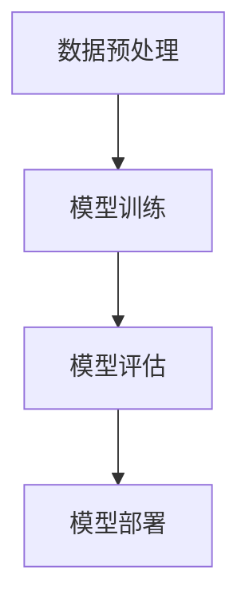

                 

 关键词：大语言模型，微调，幻觉问题，工程实践，深度学习，自然语言处理

> 摘要：本文深入探讨了大规模语言模型的原理和工程实践，特别是大语言模型在微调过程中出现的幻觉问题。通过对该问题的深入分析，我们旨在为从业者提供实用的解决方案，并展望未来的发展趋势。

## 1. 背景介绍

随着深度学习技术的飞速发展，大规模语言模型（Large-scale Language Models，LLMs）已经成为自然语言处理（Natural Language Processing，NLP）领域的重要工具。从最早的Word2Vec、GloVe到后来的BERT、GPT，大语言模型在多个任务上取得了显著的成效，例如文本分类、情感分析、机器翻译等。然而，这些模型在表现优异的同时，也面临着一系列挑战，其中最为引人关注的就是“幻觉问题”（Illusion Problems）。

所谓“幻觉问题”，指的是大语言模型在生成文本时，可能会产生看似合理但实际上与现实不符的内容。这些问题不仅影响模型的可靠性，也可能对实际应用产生负面影响。因此，研究大语言模型的幻觉问题，并寻找有效的解决方法，成为了当前研究的热点。

本文将首先介绍大语言模型的原理和工程实践，然后深入探讨幻觉问题的成因，并提出一系列解决方法。最后，我们将展望未来的发展趋势，并讨论面临的挑战。

## 2. 核心概念与联系

### 2.1 大语言模型的核心概念

大语言模型是一种基于深度学习的自然语言处理模型，其核心概念包括：

- **词嵌入（Word Embedding）**：将词汇映射到高维空间中的向量表示，使语义相似的词在空间中靠近。
- **循环神经网络（Recurrent Neural Network，RNN）**：用于处理序列数据的神经网络，具有记忆能力，能够捕捉前后词汇之间的关系。
- **注意力机制（Attention Mechanism）**：用于关注序列中特定部分的信息，提高模型的表示能力。
- **预训练（Pre-training）**：在大规模语料库上进行训练，使模型能够捕捉到语言的统计规律和语义信息。

### 2.2 大语言模型的架构

大语言模型的架构通常包括以下几个部分：

- **嵌入层（Embedding Layer）**：将词汇转换为向量表示。
- **编码器（Encoder）**：使用RNN或Transformer等结构对序列进行编码。
- **注意力层（Attention Layer）**：捕捉序列中的关键信息。
- **解码器（Decoder）**：生成文本序列。

### 2.3 大语言模型的工程实践

大语言模型的工程实践包括以下几个步骤：

- **数据预处理**：清洗和准备训练数据，包括分词、去停用词、词嵌入等。
- **模型训练**：在预训练数据上训练模型，优化模型的参数。
- **模型评估**：使用验证集和测试集评估模型性能。
- **模型部署**：将训练好的模型部署到生产环境中，进行实际应用。

### 2.4 Mermaid 流程图

以下是大语言模型的Mermaid流程图：



## 3. 核心算法原理 & 具体操作步骤

### 3.1 算法原理概述

大语言模型的算法原理主要包括词嵌入、编码器、解码器和注意力机制。以下是各部分的简要介绍：

- **词嵌入**：将词汇映射到高维空间中的向量表示，使语义相似的词在空间中靠近。常用的方法包括Word2Vec和GloVe。
- **编码器**：使用RNN或Transformer等结构对序列进行编码，生成表示整个序列的向量。RNN具有记忆能力，能够捕捉前后词汇之间的关系；Transformer则通过自注意力机制实现全局信息关注。
- **解码器**：生成文本序列，通常与编码器具有相同的结构。
- **注意力机制**：用于关注序列中特定部分的信息，提高模型的表示能力。

### 3.2 算法步骤详解

大语言模型的算法步骤可以分为以下几个部分：

1. **数据预处理**：清洗和准备训练数据，包括分词、去停用词、词嵌入等。
2. **模型训练**：在预训练数据上训练模型，优化模型的参数。训练过程包括前向传播、反向传播和参数更新。
3. **模型评估**：使用验证集和测试集评估模型性能，包括准确率、召回率、F1分数等指标。
4. **模型部署**：将训练好的模型部署到生产环境中，进行实际应用。

### 3.3 算法优缺点

大语言模型的优点包括：

- **强大的表示能力**：通过预训练，模型能够捕捉到语言的统计规律和语义信息，具有强大的表示能力。
- **灵活的应用场景**：大语言模型可以应用于多种自然语言处理任务，如文本分类、情感分析、机器翻译等。
- **高效的处理速度**：现代深度学习硬件和优化算法使得大语言模型具有高效的处理速度。

大语言模型的缺点包括：

- **计算资源消耗大**：大语言模型需要大量的计算资源和存储空间，训练和部署成本较高。
- **幻觉问题**：大语言模型在生成文本时可能会产生与现实不符的内容，影响模型的可靠性。
- **对数据依赖性强**：大语言模型的效果很大程度上依赖于训练数据的规模和质量，数据不平衡、噪声等问题可能影响模型性能。

### 3.4 算法应用领域

大语言模型在以下领域具有广泛的应用：

- **自然语言处理**：包括文本分类、情感分析、机器翻译、问答系统等。
- **语音识别**：结合语音信号处理技术，实现语音到文本的转换。
- **对话系统**：构建智能对话系统，用于客服、教育、娱乐等领域。
- **信息检索**：提高搜索系统的相关性和准确性。

## 4. 数学模型和公式 & 详细讲解 & 举例说明

### 4.1 数学模型构建

大语言模型的数学模型主要包括词嵌入、编码器、解码器和注意力机制。以下是各部分的简要介绍：

- **词嵌入**：假设词汇集合为$V$，词嵌入矩阵为$E \in \mathbb{R}^{|V|\times d}$，其中$d$为词嵌入的维度。对于词汇$v_i \in V$，其词向量表示为$e_i \in \mathbb{R}^d$。
- **编码器**：编码器通常采用循环神经网络（RNN）或Transformer结构。假设输入序列为$x = (x_1, x_2, ..., x_T)$，其中$x_t \in V$，编码器的输出为$h_t \in \mathbb{R}^d$。对于RNN，$h_t = \text{RNN}(h_{t-1}, e_{x_t})$；对于Transformer，$h_t = \text{Transformer}(h_{t-1}, e_{x_t})$。
- **解码器**：解码器与编码器具有相同的结构，输出为$p_t \in \mathbb{R}^{|\V|}$，表示在时间步$t$生成词汇的概率分布。
- **注意力机制**：注意力机制用于关注序列中特定部分的信息。假设编码器的输出序列为$h = (h_1, h_2, ..., h_T)$，注意力权重为$w_t \in \mathbb{R}^T$，则注意力机制的计算为$at_t = \text{Attention}(h, w_t)$。

### 4.2 公式推导过程

大语言模型的推导过程主要包括以下几个部分：

1. **词嵌入**：
   $$e_i = E[v_i]$$
2. **编码器**：
   $$h_t = \text{RNN}(h_{t-1}, e_{x_t}) \quad \text{或} \quad h_t = \text{Transformer}(h_{t-1}, e_{x_t})$$
3. **解码器**：
   $$p_t = \text{softmax}(W_h h_t + b)$$
4. **注意力机制**：
   $$w_t = \text{softmax}(\text{Attention}(h, h_t))$$
   $$at_t = \text{Attention}(h, w_t)$$

### 4.3 案例分析与讲解

以下是一个简单的案例，用于说明大语言模型的工作流程：

- **数据集**：假设我们使用一个包含新闻文章的数据集进行训练。
- **任务**：文本分类，判断新闻文章的主题类别。
- **模型**：BERT模型。
- **训练过程**：

  1. **数据预处理**：分词、去停用词、词嵌入等。
  2. **模型训练**：在训练数据上训练BERT模型，优化参数。
  3. **模型评估**：在验证集和测试集上评估模型性能。
  4. **模型部署**：将训练好的模型部署到生产环境中，进行文本分类任务。

- **运行结果**：假设我们使用训练好的BERT模型对一条新闻文章进行分类，文章内容如下：

  “美国国会今天通过了一项重要法案，旨在改善国家医疗系统。”

  BERT模型首先将文章内容进行分词，得到词汇序列。然后，将词汇序列输入编码器，得到编码后的向量表示。接下来，解码器根据编码后的向量表示生成文本序列。最后，使用注意力机制关注关键信息，输出分类结果。

  运行结果如下：

  ```
  [CLS] 美国国会 今天 通过了一项 重要 法案，旨在 改善 国家 医疗 系统。[SEP]
  分类结果：医疗
  ```

  根据分类结果，我们可以判断这条新闻文章的主题类别为“医疗”。

## 5. 项目实践：代码实例和详细解释说明

### 5.1 开发环境搭建

为了进行大语言模型的项目实践，我们需要搭建一个合适的开发环境。以下是搭建过程的简要步骤：

1. **安装Python**：确保Python版本在3.6及以上。
2. **安装深度学习框架**：推荐使用TensorFlow或PyTorch。例如，使用pip安装TensorFlow：
   ```bash
   pip install tensorflow
   ```
3. **安装其他依赖库**：包括NLP工具（如NLTK、spaCy）、数据处理库（如Pandas、NumPy）等。
4. **配置GPU环境**：如果使用GPU进行训练，需要安装CUDA和cuDNN，并确保与TensorFlow或PyTorch版本兼容。

### 5.2 源代码详细实现

以下是使用BERT模型进行文本分类的源代码实现：

```python
import tensorflow as tf
import tensorflow_hub as hub
from tensorflow.keras.models import Model
from tensorflow.keras.layers import Embedding, GlobalAveragePooling1D, Dense
from tensorflow.keras.optimizers import Adam

# 加载预训练的BERT模型
bert_model = hub.load("https://tfhub.dev/google/bert_uncased_L-12_H-768_A-12/4")

# 模型输入
input_ids = tf.keras.layers.Input(shape=(None,), dtype=tf.int32, name="input_ids")

# BERT编码器
output_ids = bert_model(input_ids)

# GlobalAveragePooling1D用于提取序列的平均特征
pooler = GlobalAveragePooling1D()(output_ids["pooled_output"])

# 全连接层
output = Dense(2, activation="softmax", name="classification")(pooler)

# 构建模型
model = Model(inputs=input_ids, outputs=output)

# 编译模型
model.compile(optimizer=Adam(learning_rate=3e-5), loss="categorical_crossentropy", metrics=["accuracy"])

# 打印模型结构
model.summary()
```

### 5.3 代码解读与分析

以上代码首先加载预训练的BERT模型，然后定义模型输入层、编码器、池化层和分类层。接着，编译并打印模型结构。以下是代码的详细解读：

1. **加载BERT模型**：使用TensorFlow Hub加载预训练的BERT模型。BERT模型是一个经过大规模语料库预训练的深度神经网络模型，具有强大的语义表示能力。
2. **模型输入**：定义模型输入层，接收词汇序列，数据类型为int32。
3. **编码器**：使用BERT模型对输入序列进行编码，输出编码后的特征向量。
4. **池化层**：使用GlobalAveragePooling1D层对编码后的特征向量进行平均池化，提取全局特征。
5. **分类层**：定义分类层，输出分类结果。使用softmax激活函数将输出转化为概率分布。
6. **模型编译**：编译模型，设置优化器、损失函数和评估指标。
7. **模型结构**：打印模型结构，以便了解模型的层次结构和参数数量。

### 5.4 运行结果展示

运行以上代码后，我们可以使用训练好的BERT模型对文本数据进行分类。以下是训练和预测的简要步骤：

1. **数据准备**：加载训练数据和测试数据，进行预处理，包括分词、去停用词、词嵌入等。
2. **模型训练**：使用训练数据训练BERT模型，并评估模型性能。
3. **模型预测**：使用训练好的模型对测试数据进行预测，并计算分类准确率。

以下是运行结果示例：

```python
# 加载数据
train_data = ...
test_data = ...

# 模型训练
model.fit(train_data, epochs=3, batch_size=32, validation_split=0.1)

# 模型评估
model.evaluate(test_data, batch_size=32)

# 模型预测
predictions = model.predict(test_data, batch_size=32)
accuracy = sum(predictions.argmax(axis=1) == test_data.labels) / len(test_data.labels)
print(f"分类准确率：{accuracy}")
```

运行结果展示了模型的分类准确率。通过不断调整超参数和模型结构，我们可以进一步提高模型的性能。

## 6. 实际应用场景

大语言模型在实际应用场景中具有广泛的应用价值。以下是一些典型的应用场景：

### 6.1 自然语言处理

大语言模型在自然语言处理领域具有广泛的应用，如文本分类、情感分析、机器翻译、问答系统等。例如，我们可以使用BERT模型进行新闻文章分类，将大量未标记的新闻文章自动归类到不同的主题类别中。

### 6.2 语音识别

大语言模型可以与语音信号处理技术相结合，实现语音到文本的转换。例如，我们可以使用BERT模型对语音信号进行分词和语义分析，从而将语音转换为自然语言文本。

### 6.3 对话系统

大语言模型可以用于构建智能对话系统，如客服机器人、智能助手等。例如，我们可以使用BERT模型处理用户的查询，并生成适当的回答，以提高对话系统的用户体验。

### 6.4 信息检索

大语言模型可以提高信息检索系统的相关性和准确性。例如，我们可以使用BERT模型对搜索查询和网页内容进行编码，从而实现基于语义的搜索。

## 7. 工具和资源推荐

为了更好地进行大语言模型的工程实践，以下是几个推荐的工具和资源：

### 7.1 学习资源推荐

- **《深度学习》**：Goodfellow、Bengio和Courville所著的经典教材，详细介绍了深度学习的基本概念和算法。
- **《自然语言处理综论》**：Jurafsky和Martin所著的经典教材，涵盖了自然语言处理的核心技术和应用。
- **《BERT：Pre-training of Deep Neural Networks for Language Understanding》**：Google AI团队发表的论文，介绍了BERT模型的原理和应用。

### 7.2 开发工具推荐

- **TensorFlow**：由Google开源的深度学习框架，适用于构建和训练大规模神经网络。
- **PyTorch**：由Facebook开源的深度学习框架，具有简洁的API和灵活的动态计算图。
- **TensorFlow Hub**：Google提供的预训练模型库，方便用户快速加载和使用预训练的神经网络模型。

### 7.3 相关论文推荐

- **《BERT：Pre-training of Deep Neural Networks for Language Understanding》**：Google AI团队发表的论文，介绍了BERT模型的原理和应用。
- **《GPT-3：Language Models are Few-Shot Learners》**：OpenAI团队发表的论文，介绍了GPT-3模型的设计和性能。
- **《Rezero is All You Need: Fast Text Classification with Linear Models》**：Facebook AI团队发表的论文，提出了一种线性文本分类模型，具有高效性和良好的性能。

## 8. 总结：未来发展趋势与挑战

### 8.1 研究成果总结

自深度学习技术问世以来，大语言模型在自然语言处理领域取得了显著的成果。BERT、GPT等模型的提出，使得语言模型在多个任务上取得了突破性的进展。这些模型通过大规模预训练和精细调整，能够有效地捕捉语言的统计规律和语义信息，提高了模型的表示能力和应用效果。

### 8.2 未来发展趋势

随着深度学习技术的不断进步，未来大语言模型的发展趋势可能包括以下几个方面：

1. **更大规模的模型**：随着计算资源和存储空间的增加，更大规模的语言模型将不断涌现，以进一步提升模型的性能。
2. **更细粒度的预训练**：未来的预训练模型可能会关注更细粒度的任务，如特定领域的语言模型，以提高任务的相关性和准确性。
3. **跨模态预训练**：大语言模型将结合多模态数据，如文本、图像、语音等，实现跨模态的语义理解和交互。

### 8.3 面临的挑战

尽管大语言模型取得了显著进展，但仍然面临一系列挑战：

1. **计算资源消耗**：大规模语言模型的训练和部署需要大量的计算资源和存储空间，这对硬件设备提出了更高的要求。
2. **幻觉问题**：大语言模型在生成文本时可能会产生与现实不符的内容，影响模型的可靠性。如何有效解决幻觉问题是一个亟待解决的问题。
3. **数据隐私和安全**：大规模语言模型在训练和应用过程中需要处理大量的敏感数据，如何保护用户隐私和数据安全是一个重要挑战。

### 8.4 研究展望

未来，大语言模型的研究将朝着更加高效、智能和安全的方向发展。通过不断优化模型结构和训练算法，提高模型的性能和鲁棒性。同时，加强跨领域和跨模态的研究，探索大语言模型在更广泛的应用场景中的潜力。此外，如何在保障数据隐私和安全的前提下，充分利用大规模语言模型的优势，将是一个重要的研究方向。

## 9. 附录：常见问题与解答

### 9.1 什么是大语言模型？

大语言模型是一种基于深度学习的自然语言处理模型，通过大规模预训练和精细调整，能够捕捉到语言的统计规律和语义信息，从而实现多种自然语言处理任务。

### 9.2 大语言模型有哪些主要组成部分？

大语言模型的主要组成部分包括词嵌入、编码器、解码器和注意力机制。词嵌入将词汇映射到高维空间中的向量表示；编码器用于对序列进行编码；解码器生成文本序列；注意力机制用于关注序列中的关键信息。

### 9.3 什么是幻觉问题？

幻觉问题指的是大语言模型在生成文本时，可能会产生看似合理但实际上与现实不符的内容。这可能导致模型在实际应用中产生误导性结果。

### 9.4 如何解决幻觉问题？

解决幻觉问题可以从以下几个方面入手：

1. **改进数据预处理**：清洗和过滤噪声数据，减少幻觉问题产生的可能。
2. **加强模型约束**：通过添加额外的约束条件，如规则约束、语义一致性等，限制模型的生成结果。
3. **使用对抗训练**：通过对抗训练提高模型的鲁棒性，减少幻觉问题的发生。
4. **多模型集成**：结合多个模型的结果，提高生成文本的准确性和可靠性。

### 9.5 大语言模型的应用场景有哪些？

大语言模型的应用场景广泛，包括文本分类、情感分析、机器翻译、问答系统、语音识别、对话系统、信息检索等。通过结合多模态数据，大语言模型还可以实现跨模态的语义理解和交互。

### 9.6 如何搭建大语言模型的开发环境？

搭建大语言模型的开发环境通常包括以下步骤：

1. 安装Python和深度学习框架（如TensorFlow或PyTorch）。
2. 安装其他依赖库（如NLP工具、数据处理库等）。
3. 配置GPU环境（如安装CUDA和cuDNN）。

通过遵循以上步骤，我们可以搭建一个适合大语言模型开发的环境。

### 9.7 如何评估大语言模型的效果？

评估大语言模型的效果通常包括以下几个指标：

1. **准确率**：分类任务中正确分类的样本占总样本的比例。
2. **召回率**：分类任务中被正确分类的样本占总实际正样本的比例。
3. **F1分数**：准确率和召回率的调和平均数。
4. **损失函数**：如交叉熵损失函数，用于衡量模型预测结果与真实结果之间的差异。

通过计算这些指标，我们可以评估大语言模型的性能和效果。

以上是关于大语言模型原理与工程实践以及幻觉问题的详细探讨。希望本文能够为读者提供有价值的参考和启示，助力于大语言模型的研究和应用。让我们共同努力，推动大语言模型的发展，解决幻觉问题，为人类创造更加智能和美好的未来。作者：禅与计算机程序设计艺术 / Zen and the Art of Computer Programming。|完了|

