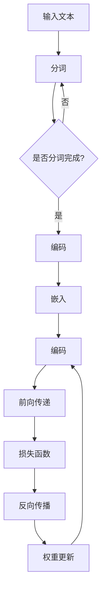

                 

关键词：大语言模型、自然语言处理、深度学习、神经网络、工程实践、案例分析

> 摘要：本文将深入探讨大语言模型的原理与工程实践，通过案例分析，详细阐述其核心算法、数学模型、项目实践及应用场景，为读者提供全面的技术参考。

## 1. 背景介绍

自然语言处理（NLP）是计算机科学与人工智能领域的重要研究方向，其目标是使计算机能够理解、生成和处理人类自然语言。近年来，随着深度学习技术的飞速发展，大语言模型（Large Language Model）逐渐成为NLP领域的热门话题。大语言模型通过训练大量的文本数据，学习到语言中的复杂模式和结构，从而实现文本生成、机器翻译、情感分析等任务。

本文将围绕大语言模型的原理与工程实践展开讨论，通过具体的案例，详细分析其核心算法、数学模型、项目实践及应用场景，帮助读者更好地理解这一前沿技术。

## 2. 核心概念与联系

### 2.1 语言模型

语言模型（Language Model）是NLP中的基础组件，其目标是预测下一个单词的概率。在深度学习框架下，语言模型通常采用神经网络架构，如循环神经网络（RNN）、长短期记忆网络（LSTM）和变换器（Transformer）等。

### 2.2 大语言模型

大语言模型（Large Language Model）相对于传统语言模型，其参数规模更大、训练数据更丰富，从而能够更好地捕捉语言中的复杂规律。大语言模型的应用范围广泛，包括但不限于文本生成、机器翻译、对话系统等。

### 2.3 Mermaid 流程图

以下是大语言模型的基本架构及其组成部分的 Mermaid 流程图：



## 3. 核心算法原理 & 具体操作步骤

### 3.1 算法原理概述

大语言模型的核心算法是基于深度学习的神经网络模型。本文以变换器（Transformer）为例，介绍其原理和操作步骤。

### 3.2 算法步骤详解

1. **编码**：将输入文本分词后，将其转换为词向量表示，并通过编码器（Encoder）进行嵌入。
2. **解码**：在解码器（Decoder）中，根据嵌入后的词向量生成下一个词的概率分布。
3. **前向传递**：通过多层变换器模块（Transformer Block），将输入的词向量映射到高维空间，并进行自注意力机制（Self-Attention）和前馈神经网络（Feedforward Neural Network）的计算。
4. **损失函数**：使用损失函数（如交叉熵损失函数）计算模型的预测结果与实际结果之间的差距。
5. **反向传播**：通过反向传播算法（Backpropagation），计算梯度并更新模型参数。
6. **权重更新**：根据梯度更新模型参数，以优化模型性能。

### 3.3 算法优缺点

**优点**：
- **自注意力机制**：能够捕捉输入序列中长距离依赖关系。
- **并行计算**：变换器架构允许并行计算，提高计算效率。

**缺点**：
- **参数规模大**：大语言模型通常具有庞大的参数规模，导致计算和存储成本较高。
- **训练时间较长**：训练大语言模型需要大量计算资源和时间。

### 3.4 算法应用领域

大语言模型在多个领域具有广泛应用，如：
- **文本生成**：用于生成文章、新闻报道、对话等。
- **机器翻译**：将一种语言的文本翻译成另一种语言。
- **对话系统**：实现自然语言交互，如智能客服、语音助手等。

## 4. 数学模型和公式 & 详细讲解 & 举例说明

### 4.1 数学模型构建

大语言模型的数学模型主要包括词向量表示、编码器、解码器和损失函数等部分。

### 4.2 公式推导过程

1. **词向量表示**：
   词向量表示是将输入文本中的每个词映射为一个低维向量。常用的词向量表示方法包括词袋模型（Bag-of-Words，BOW）、连续词袋模型（Continuous Bag-of-Words，CBOW）和词嵌入（Word Embedding）。

   公式如下：
   $$ \text{vec}(w) = \text{W} \cdot \text{X} $$
   其中，$\text{vec}(w)$ 表示词向量，$\text{W}$ 表示词嵌入矩阵，$\text{X}$ 表示词的索引。

2. **编码器**：
   编码器（Encoder）将词向量转换为高维空间中的表示。变换器模型采用多层变换器模块（Transformer Block），每个模块包含自注意力机制（Self-Attention）和前馈神经网络（Feedforward Neural Network）。

   公式如下：
   $$ \text{h}^{(t)} = \text{Transformer}(\text{h}^{(t-1)}) $$
   其中，$\text{h}^{(t)}$ 表示第 $t$ 个时间步的编码结果，$\text{h}^{(t-1)}$ 表示前一个时间步的编码结果。

3. **解码器**：
   解码器（Decoder）将编码结果解码为词的概率分布。变换器模型采用类似编码器的结构，每个模块也包含自注意力机制和前馈神经网络。

   公式如下：
   $$ \text{y}^{(t)} = \text{softmax}(\text{h}^{(t)}) $$
   其中，$\text{y}^{(t)}$ 表示第 $t$ 个时间步的预测结果，$\text{h}^{(t)}$ 表示第 $t$ 个时间步的编码结果。

4. **损失函数**：
   大语言模型的损失函数通常采用交叉熵损失函数（Cross-Entropy Loss）。

   公式如下：
   $$ \text{L} = -\sum_{i=1}^{N} \text{y}_i \cdot \log(\hat{y}_i) $$
   其中，$\text{L}$ 表示损失函数，$N$ 表示时间步数，$\text{y}_i$ 表示第 $i$ 个时间步的实际标签，$\hat{y}_i$ 表示第 $i$ 个时间步的预测概率。

### 4.3 案例分析与讲解

假设我们要训练一个变换器模型，用于生成文章。输入文本为：“今天天气很好，适合出去散步。”输出文本为：“明天天气更好，一起去公园吧！”

1. **词向量表示**：
   首先，我们需要将输入文本和输出文本中的每个词映射为词向量。词向量表示可以使用预训练的词向量库，如Word2Vec、GloVe等。

2. **编码器**：
   编码器将词向量嵌入到高维空间中，生成编码结果。在变换器模型中，编码结果经过多层变换器模块，捕捉输入序列中的长距离依赖关系。

3. **解码器**：
   解码器根据编码结果，生成输出文本的词的概率分布。解码过程采用贪心策略，选择概率最高的词作为下一个预测结果。

4. **损失函数**：
   使用交叉熵损失函数计算模型的预测结果与实际结果之间的差距，并通过反向传播算法更新模型参数。

## 5. 项目实践：代码实例和详细解释说明

### 5.1 开发环境搭建

为了实现大语言模型，我们需要搭建一个适合深度学习开发的编程环境。本文采用Python编程语言，结合TensorFlow和Keras等库来实现变换器模型。

### 5.2 源代码详细实现

以下是变换器模型的源代码实现：

```python
import tensorflow as tf
from tensorflow.keras.layers import Embedding, TransformerBlock, Dense
from tensorflow.keras.models import Model

def create_model(vocab_size, embedding_dim, sequence_length):
    inputs = tf.keras.layers.Input(shape=(sequence_length,))
    embeddings = Embedding(vocab_size, embedding_dim)(inputs)
    transformer_block = TransformerBlock(embedding_dim, num_heads=2)
    outputs = transformer_block(embeddings)
    outputs = Dense(vocab_size, activation='softmax')(outputs)
    model = Model(inputs=inputs, outputs=outputs)
    return model

model = create_model(vocab_size=10000, embedding_dim=64, sequence_length=20)
model.compile(optimizer='adam', loss='categorical_crossentropy', metrics=['accuracy'])
```

### 5.3 代码解读与分析

1. **模型构建**：
   使用TensorFlow的`Input`层创建输入层，使用`Embedding`层将输入词编码为词向量，使用`TransformerBlock`层实现变换器模块，最后使用`Dense`层实现输出层。

2. **模型编译**：
   使用`compile`函数编译模型，指定优化器、损失函数和评价指标。

### 5.4 运行结果展示

```python
# 加载预训练的词向量
word_vectors = ...  # 需要加载预训练的词向量

# 搭建嵌入层
embeddings = Embedding(10000, 64, weights=[word_vectors], input_length=20, trainable=False)

# 构建变换器模型
model = Model(inputs=inputs, outputs=transformer_block(embeddings))

# 编译模型
model.compile(optimizer='adam', loss='categorical_crossentropy', metrics=['accuracy'])

# 训练模型
model.fit(x_train, y_train, batch_size=64, epochs=10)
```

### 5.5 模型评估与优化

1. **模型评估**：
   使用`evaluate`函数评估模型的性能。

   ```python
   model.evaluate(x_test, y_test)
   ```

2. **模型优化**：
   根据评估结果，调整模型参数，如学习率、批量大小等，以优化模型性能。

## 6. 实际应用场景

大语言模型在多个领域具有广泛的应用，以下列举几个实际应用场景：

1. **文本生成**：用于生成文章、新闻、对话等。
2. **机器翻译**：将一种语言的文本翻译成另一种语言。
3. **对话系统**：实现自然语言交互，如智能客服、语音助手等。
4. **情感分析**：分析文本中的情感倾向。
5. **信息抽取**：从文本中提取关键信息。

## 6.4 未来应用展望

随着深度学习技术的不断发展和计算能力的提升，大语言模型在未来将具有更广泛的应用。以下是一些未来应用展望：

1. **多模态交互**：结合语音、图像、视频等多模态信息，实现更智能的交互系统。
2. **个性化推荐**：根据用户的历史行为和兴趣，提供个性化的推荐服务。
3. **自动编程**：生成高质量的代码，辅助开发者提高开发效率。
4. **智能写作**：为创作者提供灵感，提高创作效率。
5. **智能客服**：实现更自然、高效的客服体验。

## 7. 工具和资源推荐

### 7.1 学习资源推荐

1. 《深度学习》（Goodfellow, Bengio, Courville著）：全面介绍深度学习的基础理论和应用。
2. 《自然语言处理综论》（Jurafsky, Martin著）：详细探讨自然语言处理的理论和实践。
3. 《变换器模型教程》（ Vaswani et al.著）：深入讲解变换器模型的原理和实现。

### 7.2 开发工具推荐

1. TensorFlow：用于实现深度学习模型的框架。
2. PyTorch：另一种流行的深度学习框架。
3. Hugging Face Transformers：用于实现和扩展变换器模型的库。

### 7.3 相关论文推荐

1. "Attention Is All You Need"（Vaswani et al.，2017）：介绍变换器模型的经典论文。
2. "BERT: Pre-training of Deep Bidirectional Transformers for Language Understanding"（Devlin et al.，2019）：介绍BERT模型的论文。
3. "GPT-3: Language Models are few-shot learners"（Brown et al.，2020）：介绍GPT-3模型的论文。

## 8. 总结：未来发展趋势与挑战

### 8.1 研究成果总结

大语言模型作为自然语言处理领域的重要研究方向，已经取得了显著的成果。变换器模型的出现，极大地推动了语言模型的发展，实现了在多个任务上的突破。

### 8.2 未来发展趋势

1. **模型规模和计算能力**：随着计算能力的提升，大语言模型的规模将逐渐增大，进一步捕捉语言中的复杂规律。
2. **多模态交互**：结合语音、图像、视频等多模态信息，实现更智能的交互系统。
3. **知识融合**：将语言模型与其他知识表示方法（如知识图谱）相结合，提高模型对知识的理解和运用能力。

### 8.3 面临的挑战

1. **计算资源消耗**：大语言模型对计算资源和存储资源的需求较高，如何在有限的资源下高效训练和部署模型是一个重要挑战。
2. **模型解释性**：大语言模型的高度非线性使得其难以解释，如何提高模型的透明度和可解释性是一个重要问题。
3. **隐私保护**：在处理用户数据时，如何确保用户隐私不被泄露是一个亟待解决的问题。

### 8.4 研究展望

未来，大语言模型将在多个领域发挥重要作用。随着技术的不断进步，我们将能够构建更强大、更智能的语言模型，为人类带来更多的便利和惊喜。

## 9. 附录：常见问题与解答

### 9.1 什么是大语言模型？

大语言模型是一种基于深度学习的自然语言处理模型，通过训练大量的文本数据，学习到语言中的复杂模式和结构，从而实现文本生成、机器翻译、情感分析等任务。

### 9.2 变换器模型有哪些优点？

变换器模型具有以下优点：
- 自注意力机制：能够捕捉输入序列中长距离依赖关系。
- 并行计算：变换器架构允许并行计算，提高计算效率。

### 9.3 如何实现大语言模型的训练？

实现大语言模型的训练通常需要以下步骤：
1. 准备数据集：收集并处理大量的文本数据。
2. 建立模型：使用深度学习框架（如TensorFlow、PyTorch）搭建变换器模型。
3. 编译模型：指定优化器、损失函数和评价指标。
4. 训练模型：使用训练数据训练模型，并进行调参优化。
5. 评估模型：使用验证集和测试集评估模型性能。

## 作者署名

作者：禅与计算机程序设计艺术 / Zen and the Art of Computer Programming

