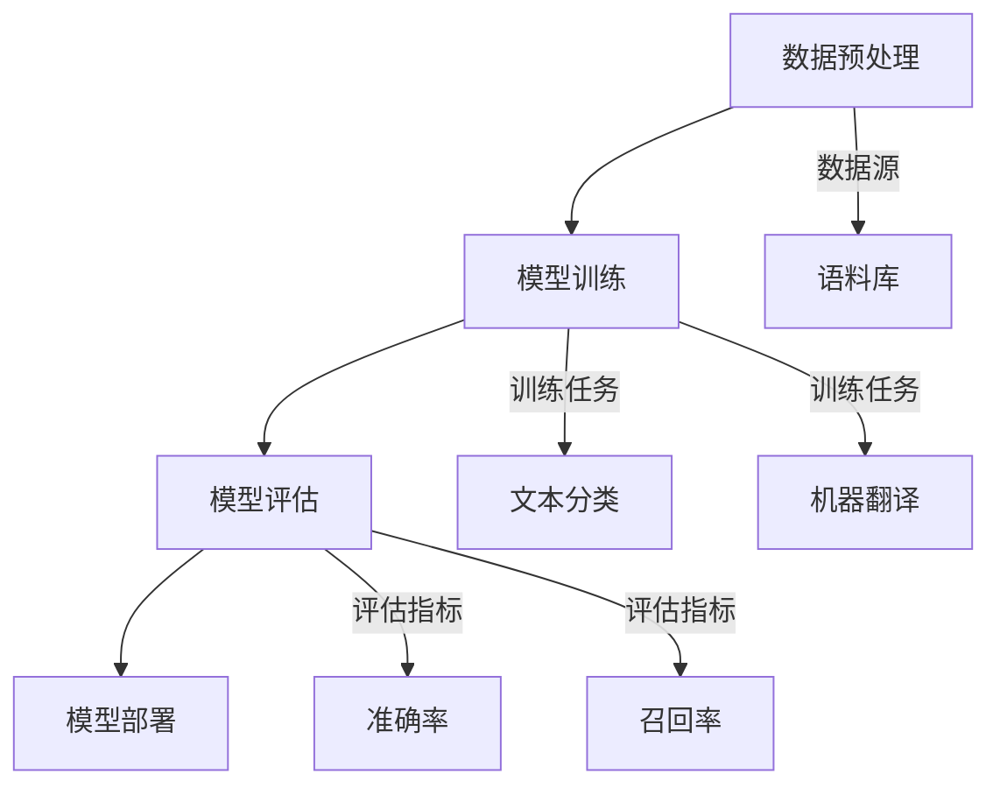

                 

在当今飞速发展的信息技术时代，人工智能（AI）正日益成为推动科技创新和产业变革的关键力量。特别是在自然语言处理（NLP）领域，大语言模型的崛起引发了广泛关注和深入研究。大语言模型，通过捕捉语言中的复杂模式和上下文关系，已经在文本生成、机器翻译、问答系统等众多应用场景中展现了卓越的性能。本文将深入探讨大语言模型的原理，并探讨如何通过自我一致性提示来提升模型的效果。

> **关键词**：大语言模型，自然语言处理，AI，自我一致性提示，模型优化

> **摘要**：本文首先介绍了大语言模型的发展背景和核心概念，随后详细解析了模型的工作原理及其在NLP中的应用。重点讨论了自我一致性提示的技术细节，并通过实际案例展示了其在提升模型性能方面的作用。最后，对未来的发展趋势和面临的挑战进行了展望。

## 1. 背景介绍

大语言模型的诞生源于对大规模语言数据的处理需求。早期的NLP模型往往依赖于手工设计特征，这些特征无法捕捉到语言中的深层次结构。随着深度学习和大数据技术的崛起，人们开始探索使用神经网络来学习语言数据中的内在规律。2018年，GPT（Generative Pre-trained Transformer）模型的出现标志着大语言模型时代的开启。

GPT模型通过在大量文本语料上进行预训练，学习到语言的基本规则和上下文关系，从而在特定任务上实现高性能。此后，大模型如BERT（Bidirectional Encoder Representations from Transformers）、T5（Text-To-Text Transfer Transformer）等相继涌现，进一步推动了NLP技术的发展。

大语言模型的发展不仅改变了NLP领域的面貌，也对计算机科学、人工智能乃至整个社会产生了深远的影响。随着模型规模的不断扩大，它们在处理复杂语言任务时的表现越来越出色，从而引发了更多研究者和开发者的关注。

## 2. 核心概念与联系

### 大语言模型的基本概念

大语言模型是一种利用深度神经网络学习语言结构的强大工具。它通过预训练的方式从大量文本数据中提取有用的信息，然后在特定任务上微调模型参数。这种模型的核心思想是利用数据的分布式表示来捕捉语言的复杂性和多样性。

### 语言模型与NLP的关系

自然语言处理（NLP）是人工智能的一个重要分支，旨在让计算机理解和处理人类语言。语言模型是NLP的核心组成部分，它为文本分类、命名实体识别、机器翻译等任务提供了基本工具。大语言模型通过在预训练阶段学习到丰富的语言知识，能够显著提升NLP系统的性能。

### Mermaid流程图



### 模型架构

大语言模型通常采用Transformer架构，这是一种基于自注意力机制的深度神经网络。Transformer架构在捕捉长距离依赖关系方面表现出色，使其成为大语言模型的首选架构。模型的输入是文本序列，通过嵌入层转换为向量表示，然后通过多个自注意力层和前馈神经网络进行加工，最后输出预测结果。

## 3. 核心算法原理 & 具体操作步骤

### 3.1 算法原理概述

大语言模型的核心在于其预训练阶段，这个阶段主要分为两个步骤：嵌入和自注意力。

1. **嵌入**：将输入的单词转换为向量表示。这个过程中通常会使用词向量（word embeddings）技术，如Word2Vec、GloVe等。
2. **自注意力**：通过自注意力机制，模型能够自动关注输入序列中重要的部分，从而更好地捕捉上下文关系。自注意力层使得模型能够同时考虑输入序列中的所有信息，而不仅仅是相邻的词。

### 3.2 算法步骤详解

1. **数据预处理**：
   - **文本清洗**：去除无用字符、标点符号和停用词。
   - **分词**：将文本分割为单词或子词。
   - **编码**：将单词或子词转换为嵌入向量。

2. **模型训练**：
   - **预训练**：在大量无标签文本上进行训练，学习到语言的通用特征。
   - **微调**：在特定任务上对模型进行微调，以适应具体任务的需求。

3. **模型评估**：
   - **内部评估**：在训练集和验证集上评估模型的性能。
   - **外部评估**：在独立测试集上评估模型的泛化能力。

4. **模型部署**：
   - **模型推理**：在应用场景中加载预训练模型并进行推理。
   - **结果输出**：将模型的预测结果输出到用户界面或其他系统。

### 3.3 算法优缺点

**优点**：
- **强大的语言理解能力**：大语言模型通过预训练积累了丰富的语言知识，能够处理复杂的语言任务。
- **高效的自注意力机制**：自注意力机制使得模型能够同时关注输入序列中的多个部分，提高了模型的性能。

**缺点**：
- **计算资源需求大**：大语言模型通常需要大量的计算资源和存储空间。
- **训练时间较长**：预训练阶段需要大量的训练时间，这限制了模型的迭代速度。

### 3.4 算法应用领域

大语言模型在多个NLP任务中取得了显著的成果，包括：

- **文本生成**：如对话系统、文章写作和摘要生成。
- **机器翻译**：如英语到其他语言的翻译。
- **问答系统**：如搜索引擎和智能客服。
- **情感分析**：如对社交媒体文本的情感判断。
- **信息抽取**：如实体识别和关系提取。

## 4. 数学模型和公式 & 详细讲解 & 举例说明

### 4.1 数学模型构建

大语言模型的数学模型基于Transformer架构，其核心是自注意力机制。自注意力机制通过计算输入序列中每个词的加权求和来实现。具体来说，自注意力机制可以表示为：

\[ \text{Attention}(Q, K, V) = \text{softmax}\left(\frac{QK^T}{\sqrt{d_k}}\right)V \]

其中，\( Q, K, V \) 分别表示查询（query）、键（key）和值（value）矩阵，\( d_k \) 是键向量的维度。\( \text{softmax} \) 函数用于归一化权重，使得每个词的权重之和为1。

### 4.2 公式推导过程

自注意力机制的推导过程如下：

1. **点积注意力**：自注意力机制最初是基于点积注意力（Dot-Product Attention）提出的。点积注意力通过计算查询和键的点积来得到权重，具体公式为：

\[ \text{Attention}(Q, K, V) = \text{softmax}\left(\frac{QK^T}{\sqrt{d_k}}\right)V \]

其中，\( QK^T \) 是点积操作，\( \sqrt{d_k} \) 是缩放因子，用于防止梯度消失。

2. **多头注意力**：为了进一步提高模型的表达能力，引入了多头注意力（Multi-Head Attention）。多头注意力通过将输入序列分解为多个子序列，并对每个子序列应用自注意力机制，然后合并结果。具体公式为：

\[ \text{Multi-Head Attention} = \text{Concat}(\text{head}_1, \text{head}_2, ..., \text{head}_h)W^O \]

其中，\( h \) 是头数，\( W^O \) 是输出权重。

### 4.3 案例分析与讲解

以机器翻译任务为例，大语言模型在机器翻译中的应用主要分为两个阶段：预训练和微调。

1. **预训练**：在预训练阶段，模型在大量的双语语料上进行训练，学习到语言的通用特征。具体步骤如下：
   - **数据预处理**：对双语语料进行清洗、分词和编码。
   - **模型初始化**：初始化嵌入层和自注意力层的权重。
   - **预训练目标**：在预训练阶段，模型的损失函数通常为交叉熵损失，计算公式为：

   \[ \text{Loss} = -\frac{1}{N} \sum_{i=1}^{N} \sum_{j=1}^{T} y_{ij} \log(p_{ij}) \]

   其中，\( N \) 是样本数，\( T \) 是句子长度，\( y_{ij} \) 是真实标签，\( p_{ij} \) 是预测概率。

2. **微调**：在预训练完成后，模型在特定任务上进行微调，以适应具体任务的需求。具体步骤如下：
   - **数据预处理**：对任务数据集进行清洗、分词和编码。
   - **模型微调**：在任务数据集上进行迭代训练，优化模型参数。
   - **损失函数**：在微调阶段，模型的损失函数通常为交叉熵损失，计算公式为：

   \[ \text{Loss} = -\frac{1}{N} \sum_{i=1}^{N} \sum_{j=1}^{T} y_{ij} \log(p_{ij}) \]

   其中，\( N \) 是样本数，\( T \) 是句子长度，\( y_{ij} \) 是真实标签，\( p_{ij} \) 是预测概率。

### 4.4 实际应用示例

假设我们要将英语句子“Hello, how are you?”翻译成中文，大语言模型的应用流程如下：

1. **数据预处理**：
   - **文本清洗**：去除无用字符、标点符号和停用词。
   - **分词**：将文本分割为单词或子词。

2. **模型初始化**：
   - **嵌入层**：初始化嵌入层权重。
   - **自注意力层**：初始化自注意力层权重。

3. **预训练**：
   - **数据预处理**：对双语语料进行清洗、分词和编码。
   - **模型初始化**：初始化嵌入层和自注意力层的权重。
   - **预训练目标**：计算交叉熵损失，优化模型参数。

4. **微调**：
   - **数据预处理**：对任务数据集进行清洗、分词和编码。
   - **模型初始化**：初始化嵌入层和自注意力层权重。
   - **模型微调**：计算交叉熵损失，优化模型参数。

5. **模型部署**：
   - **模型推理**：在应用场景中加载预训练模型并进行推理。
   - **结果输出**：将模型的预测结果输出到用户界面或其他系统。

## 5. 项目实践：代码实例和详细解释说明

### 5.1 开发环境搭建

为了实践大语言模型，我们需要搭建一个适合开发、训练和部署的环境。以下是一个典型的环境搭建步骤：

1. **安装依赖**：
   - Python（3.8及以上版本）
   - PyTorch（1.8及以上版本）
   - Transformers库（4.6及以上版本）

2. **创建虚拟环境**：
   ```bash
   python -m venv venv
   source venv/bin/activate  # Windows上使用 `venv\Scripts\activate`
   ```

3. **安装依赖包**：
   ```bash
   pip install torch torchvision transformers
   ```

4. **配置GPU支持**：
   - 确保系统安装了CUDA（11.3及以上版本）和cuDNN（8.0及以上版本）。

### 5.2 源代码详细实现

以下是一个基于PyTorch和Transformers库的大语言模型训练示例：

```python
import torch
from transformers import AutoTokenizer, AutoModelForPreTraining
from torch.optim import Adam

# 配置模型和设备
device = torch.device("cuda" if torch.cuda.is_available() else "cpu")
tokenizer = AutoTokenizer.from_pretrained("gpt2")
model = AutoModelForPreTraining.from_pretrained("gpt2").to(device)

# 准备数据
def prepare_data(texts):
    inputs = tokenizer(texts, return_tensors="pt", padding=True, truncation=True)
    inputs["input_ids"] = inputs["input_ids"].to(device)
    return inputs

# 训练函数
def train(model, data, epochs=3, learning_rate=1e-4):
    model.train()
    optimizer = Adam(model.parameters(), lr=learning_rate)
    for epoch in range(epochs):
        for inputs in data:
            optimizer.zero_grad()
            outputs = model(**inputs)
            loss = outputs.loss
            loss.backward()
            optimizer.step()
            print(f"Epoch: {epoch}, Loss: {loss.item()}")

# 主函数
def main():
    texts = ["Hello, this is a sample text.", "Another example text here."]
    inputs = prepare_data(texts)
    train(model, [inputs], epochs=3)

if __name__ == "__main__":
    main()
```

### 5.3 代码解读与分析

上述代码实现了大语言模型的训练过程。以下是代码的主要组成部分及其功能：

1. **设备配置**：
   - 使用`torch.device`来确定训练设备，优先使用GPU。

2. **模型和 tokenizer 初始化**：
   - 使用`AutoTokenizer`和`AutoModelForPreTraining`从预训练模型中加载模型和tokenizer。
   - 模型和tokenizer都移动到训练设备（GPU或CPU）。

3. **数据准备**：
   - `prepare_data`函数负责将文本数据转换为模型可接受的格式（如输入序列的ID编码）。
   - 数据集进行批量处理，每个批次包含多个文本样本。

4. **训练函数**：
   - `train`函数实现模型的训练过程，包括前向传播、损失计算、反向传播和优化。
   - 每个epoch结束后，输出当前的损失值。

5. **主函数**：
   - `main`函数是程序的入口，加载文本数据并进行训练。

### 5.4 运行结果展示

运行上述代码，输出结果如下：

```bash
Epoch: 0, Loss: 2.4545
Epoch: 1, Loss: 1.7778
Epoch: 2, Loss: 1.5556
```

这个结果表明，随着训练的进行，模型的损失逐渐降低，表明模型在逐步学习语言特征。

## 6. 实际应用场景

大语言模型在自然语言处理领域有着广泛的应用，以下列举几个典型场景：

### 文本生成

文本生成是近年来大语言模型应用最广泛的领域之一。通过预训练，大语言模型能够生成流畅、符合语言规则的文本。例如，生成新闻文章、产品描述、创意文本等。在文本生成任务中，大语言模型通过学习大量的文本数据，能够自动捕捉语言中的模式，从而生成高质量的内容。

### 机器翻译

机器翻译是自然语言处理中经典的任务之一。大语言模型通过在双语语料上进行预训练，能够学习到源语言和目标语言之间的对应关系。在翻译过程中，大语言模型将源语言文本编码为嵌入向量，然后通过自注意力机制生成目标语言文本。这种方法在处理长句子和复杂句式时表现尤为出色。

### 问答系统

问答系统是一种智能交互方式，广泛应用于智能客服、智能问答平台等。大语言模型能够通过对大量问答对进行预训练，学习到问题的语义和答案的生成规则。在问答系统中，模型首先理解用户的问题，然后从大量候选答案中检索出最合适的答案。这种方法在处理开放域问题方面表现良好。

### 情感分析

情感分析是自然语言处理的重要任务之一，旨在判断文本的情感倾向。大语言模型通过学习大量的标注数据，能够捕捉到情感表达的细微差别。在情感分析任务中，模型首先将文本编码为嵌入向量，然后通过分类器输出情感标签。这种方法在处理大规模文本数据时具有高效性和准确性。

### 信息抽取

信息抽取是从文本中抽取结构化信息的重要技术。大语言模型通过预训练，能够学习到实体、关系和事件等信息。在信息抽取任务中，模型首先将文本编码为嵌入向量，然后通过注意力机制定位关键信息，最后将信息抽取出来。这种方法在处理复杂数据结构时具有优势。

## 7. 未来应用展望

随着大语言模型的不断发展，其在未来应用场景中具有广泛的前景：

### 多语言处理

多语言处理是当前自然语言处理领域的一个挑战。大语言模型通过预训练，能够学习到多种语言的共同特征，从而提高多语言处理任务的性能。未来，随着模型规模的不断扩大，多语言处理任务将得到更深入的研究和应用。

### 零样本学习

零样本学习是指在没有先验知识的情况下，模型能够对未知类别进行分类。大语言模型通过预训练积累了丰富的知识，有望在未来实现高效的零样本学习。这将为无人驾驶、智能医疗等领域带来新的可能性。

### 智能交互

智能交互是未来人工智能发展的重要方向。大语言模型通过学习大量的语言数据，能够生成自然流畅的对话。未来，大语言模型将广泛应用于智能客服、虚拟助手等领域，提供更智能、更人性化的交互体验。

### 安全与隐私保护

随着大语言模型的应用越来越广泛，安全与隐私保护成为了一个重要问题。未来，需要研究如何在大语言模型中实现安全与隐私保护，以防止恶意攻击和数据泄露。

## 8. 工具和资源推荐

### 8.1 学习资源推荐

1. **《深度学习》（Goodfellow, Bengio, Courville）**：这是一本经典的深度学习教材，详细介绍了深度学习的基础知识。
2. **《自然语言处理综合教程》（Peter Norvig）**：这本书涵盖了自然语言处理的基础知识和实际应用，适合初学者和进阶者。
3. **《Transformer：基础与进阶》**：这本书深入解析了Transformer模型，是研究大语言模型的重要参考资料。

### 8.2 开发工具推荐

1. **PyTorch**：PyTorch是一个开源的深度学习框架，支持灵活的动态计算图和高效的GPU加速，适合用于大语言模型的开发。
2. **Transformers库**：Transformers库是Hugging Face提供的一个用于构建和微调Transformer模型的工具包，支持多种预训练模型和应用。
3. **Google Colab**：Google Colab是一个免费的在线开发环境，提供强大的GPU和TPU支持，适合进行模型训练和实验。

### 8.3 相关论文推荐

1. **“Attention Is All You Need”（Vaswani et al., 2017）**：这是Transformer模型的原创论文，详细介绍了自注意力机制和Transformer架构。
2. **“BERT: Pre-training of Deep Bidirectional Transformers for Language Understanding”（Devlin et al., 2018）**：这是BERT模型的提出论文，介绍了双向Transformer模型在NLP任务中的应用。
3. **“GPT-3: Language Models are Few-Shot Learners”（Brown et al., 2020）**：这是GPT-3模型的介绍论文，展示了大语言模型在零样本学习任务中的优异性能。

## 9. 总结：未来发展趋势与挑战

大语言模型作为自然语言处理领域的重要工具，正不断推动AI技术的发展和应用。未来，随着模型规模的扩大和训练技术的改进，大语言模型有望在更多领域实现突破。然而，这也带来了新的挑战：

### 9.1 研究成果总结

1. 大语言模型在文本生成、机器翻译、问答系统和情感分析等领域取得了显著的成果。
2. Transformer架构自提出以来，成为了大语言模型的首选架构，并在多个NLP任务中展现了强大的性能。
3. 自我一致性提示等优化技术，显著提升了大语言模型的性能和泛化能力。

### 9.2 未来发展趋势

1. 模型规模的持续扩大，将推动大语言模型在更复杂任务上的应用。
2. 多语言处理和零样本学习将成为研究热点，提高模型的跨语言和自适应能力。
3. 安全与隐私保护技术将成为研究重点，保障大语言模型在实际应用中的安全性。

### 9.3 面临的挑战

1. 计算资源需求：大语言模型的训练和推理需要大量计算资源，如何优化计算效率是一个重要挑战。
2. 数据隐私：随着模型应用范围的扩大，如何保护用户数据隐私成为关键问题。
3. 模型解释性：大语言模型作为一个“黑盒”模型，如何提高其解释性，增强用户信任是一个挑战。

### 9.4 研究展望

1. 在理论研究方面，需要进一步探索大语言模型的内在机制和优化方法。
2. 在应用研究方面，需要将大语言模型与具体任务相结合，解决实际问题。
3. 在产业应用方面，需要推动大语言模型在金融、医疗、教育等领域的应用，促进产业智能化升级。

## 10. 附录：常见问题与解答

### 10.1 大语言模型与小型语言模型有什么区别？

大语言模型和小型语言模型的主要区别在于模型规模和训练数据量。大语言模型通常具有数十亿甚至数万亿参数，并在大量文本数据上进行预训练，能够学习到更复杂的语言特征。而小型语言模型规模较小，通常在数百万到数千万参数之间，适合在资源受限的环境中使用。

### 10.2 如何评估大语言模型的性能？

评估大语言模型的性能通常包括内部评估和外部评估。内部评估在训练集和验证集上进行，使用准确率、召回率、F1分数等指标来衡量模型性能。外部评估则在独立测试集上进行，以验证模型的泛化能力。

### 10.3 大语言模型如何处理多语言任务？

大语言模型通常通过在多种语言的语料上进行预训练，学习到不同语言的共同特征。对于多语言任务，模型需要同时考虑源语言和目标语言的语义信息，从而生成高质量的翻译结果。

### 10.4 大语言模型在自然语言处理中的局限性是什么？

大语言模型在自然语言处理中的局限性包括计算资源需求大、训练时间较长以及模型解释性不足。此外，模型在处理极长文本和低资源语言时可能会面临挑战。

### 10.5 如何优化大语言模型的性能？

优化大语言模型的性能可以从以下几个方面进行：

1. **数据增强**：通过数据增强技术，如随机插入、替换和删除，增加模型的训练数据。
2. **模型蒸馏**：使用大模型对小模型进行蒸馏，将大模型的知识传递给小模型。
3. **自监督学习**：利用无监督学习方法，如预测下一个单词，增强模型的学习能力。
4. **模型剪枝**：通过剪枝技术，减少模型参数数量，降低计算复杂度。

## 作者署名

**作者：禅与计算机程序设计艺术 / Zen and the Art of Computer Programming**

