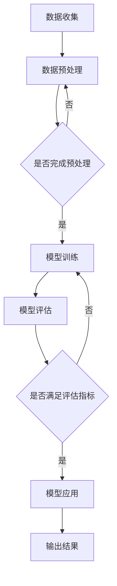

                 

关键词：大语言模型，金融行业，自动化评测，工程实践，算法原理，数学模型

> 摘要：本文深入探讨了大语言模型在金融行业的应用及其自动化评测集的构建原理。通过对大语言模型的核心概念、算法原理、数学模型以及工程实践方面的详细分析，本文旨在为金融行业的技术人员提供一个全面且实用的指导，帮助他们更好地理解和应用大语言模型技术，提升金融数据处理和分析能力。

## 1. 背景介绍

随着金融行业的不断发展和数字化转型，数据处理和分析的重要性日益凸显。金融机构每天都会产生海量数据，这些数据不仅包括传统的交易数据，还涵盖了用户行为、市场动态、社交网络等多元化信息。为了从这些庞杂的数据中提取有价值的信息，人工智能和机器学习技术应运而生，其中大语言模型（Large Language Model）作为一种强大的自然语言处理工具，得到了广泛关注和应用。

大语言模型，特别是基于深度学习的方法，如 Transformer 模型，已经广泛应用于自然语言理解、文本生成、情感分析、问题回答等多个领域。在金融行业，大语言模型可以用于自动化报告生成、投资建议、客户服务、风险管理等任务，显著提升工作效率和决策质量。

然而，大语言模型的应用并非一帆风顺。模型的训练和评估过程复杂，对计算资源的要求较高，而且模型的准确性和可靠性也受到广泛关注。为此，构建一个高效、可靠的自动化评测集成为了一个重要课题。

本文将围绕这一课题，详细介绍大语言模型的基本原理，探讨其应用在金融行业中的具体场景，并阐述自动化评测集的构建方法。希望通过本文的探讨，能够为金融行业的技术人员提供一些有益的启示和指导。

## 2. 核心概念与联系

### 2.1 大语言模型的定义

大语言模型（Large Language Model）是一种能够理解和生成自然语言的深度神经网络模型。这种模型基于大量的文本数据通过自我学习，掌握了语言的规律和语义，从而可以用于自然语言处理（NLP）中的各种任务。

### 2.2 大语言模型的工作原理

大语言模型的核心是 Transformer 框架，它由多个自注意力机制（Self-Attention Mechanism）和前馈神经网络（Feedforward Neural Network）组成。在训练过程中，模型通过优化损失函数（如交叉熵损失函数），学习输入文本的表示，并生成相应的输出文本。

### 2.3 大语言模型在金融行业的应用

大语言模型在金融行业中的应用非常广泛。以下是一些典型的应用场景：

1. **自动化报告生成**：利用大语言模型，可以自动生成财务报告、市场分析报告等，提高报告的准确性和效率。
2. **投资建议**：基于对市场数据和用户行为数据的分析，大语言模型可以为投资者提供个性化的投资建议。
3. **客户服务**：大语言模型可以用于构建智能客服系统，通过自然语言处理技术，理解和回答客户的咨询，提升客户服务体验。
4. **风险管理**：大语言模型可以帮助金融机构识别潜在的风险，如市场风险、信用风险等，并提供相应的风险管理策略。

### 2.4 大语言模型与金融数据的关联

在金融行业中，大语言模型通常需要处理大量的金融数据，包括交易数据、财务报表数据、市场数据等。这些数据经过预处理后，被输入到大语言模型中进行训练。模型通过学习这些数据，建立了对金融市场和金融产品的理解，从而能够为金融决策提供支持。

### 2.5 Mermaid 流程图

为了更直观地展示大语言模型在金融行业中的应用流程，我们使用 Mermaid 画出以下流程图：



在上面的流程图中，A 表示数据收集，B 表示数据预处理，C 表示预处理是否完成，D 表示模型训练，E 表示模型评估，F 表示评估是否满足指标，G 表示模型应用，H 表示输出结果。

## 3. 核心算法原理 & 具体操作步骤

### 3.1 算法原理概述

大语言模型的核心是基于自注意力机制的 Transformer 模型。Transformer 模型通过多头自注意力（Multi-Head Self-Attention）和前馈神经网络（Feedforward Neural Network）来学习文本的表示。在训练过程中，模型通过优化损失函数（如交叉熵损失函数），学习输入文本的表示，并生成相应的输出文本。

### 3.2 算法步骤详解

#### 3.2.1 数据准备

1. **数据收集**：收集金融行业相关的文本数据，包括新闻、报告、用户评论等。
2. **数据预处理**：对收集到的文本数据进行清洗和标注，如去除标点符号、停用词过滤、词干提取等。

#### 3.2.2 模型构建

1. **定义模型结构**：构建基于 Transformer 的模型结构，包括多头自注意力层、前馈神经网络层等。
2. **初始化权重**：对模型权重进行随机初始化。

#### 3.2.3 模型训练

1. **输入文本编码**：将输入文本编码成序列向量。
2. **自注意力计算**：计算输入文本的注意力得分，生成文本的表示。
3. **前馈神经网络**：对自注意力结果进行前馈神经网络处理。
4. **损失函数优化**：通过优化损失函数（如交叉熵损失函数），调整模型参数，降低损失值。

#### 3.2.4 模型评估

1. **输入测试数据**：将测试数据输入到训练好的模型中。
2. **生成输出文本**：通过模型生成相应的输出文本。
3. **评估指标计算**：计算模型的评估指标，如准确率、召回率、F1 值等。

#### 3.2.5 模型应用

1. **自动化报告生成**：利用模型生成财务报告、市场分析报告等。
2. **投资建议**：基于模型分析结果，为投资者提供个性化的投资建议。
3. **客户服务**：构建智能客服系统，通过模型理解和回答客户的咨询。
4. **风险管理**：利用模型识别潜在的风险，提供相应的风险管理策略。

### 3.3 算法优缺点

#### 优点：

1. **强大的文本理解能力**：大语言模型能够通过对大量文本数据的自我学习，掌握复杂的语言规律和语义。
2. **多任务处理能力**：大语言模型不仅可以用于文本生成，还可以用于文本分类、情感分析、问题回答等多种任务。
3. **自适应学习能力**：大语言模型能够根据不同的应用场景和数据集，自适应调整模型参数，提高性能。

#### 缺点：

1. **计算资源要求高**：大语言模型通常需要大量的计算资源进行训练和推理，对硬件设施要求较高。
2. **数据依赖性**：大语言模型的效果很大程度上依赖于训练数据的质量和规模，数据质量差或数据不足会影响模型的性能。

### 3.4 算法应用领域

大语言模型在金融行业的应用非常广泛，包括但不限于以下几个方面：

1. **金融文本分析**：利用大语言模型对金融新闻、报告、用户评论等文本进行深入分析，提取有价值的信息。
2. **自动化报告生成**：通过大语言模型自动生成财务报告、市场分析报告等，提高报告的生成效率和质量。
3. **投资决策支持**：基于对市场数据和用户行为数据的分析，大语言模型可以为投资者提供个性化的投资建议。
4. **客户服务**：构建智能客服系统，通过大语言模型理解和回答客户的咨询，提升客户服务体验。
5. **风险管理**：利用大语言模型识别潜在的风险，提供相应的风险管理策略。

## 4. 数学模型和公式

### 4.1 数学模型构建

大语言模型的数学模型主要基于 Transformer 框架，包括自注意力机制（Self-Attention Mechanism）和前馈神经网络（Feedforward Neural Network）。

#### 自注意力机制

自注意力机制的核心是计算输入文本的注意力得分，生成文本的表示。其公式如下：

$$
\text{Attention}(Q, K, V) = \frac{softmax(\frac{QK^T}{\sqrt{d_k}})}{V}
$$

其中，Q、K、V 分别表示查询向量、键向量和值向量，d_k 表示键向量的维度，softmax 函数用于将注意力得分映射到概率分布。

#### 前馈神经网络

前馈神经网络对自注意力结果进行进一步处理，其公式如下：

$$
\text{FFN}(x) = \text{ReLU}(W_2 \text{ReLU}(W_1 x + b_1)) + b_2
$$

其中，W_1、W_2、b_1、b_2 分别表示权重和偏置。

### 4.2 公式推导过程

#### 自注意力机制推导

自注意力机制的推导主要基于矩阵乘法和指数函数的性质。

1. **输入向量表示**：

   假设输入文本表示为序列向量 X，其维度为 d_x。

2. **权重矩阵初始化**：

   初始化查询向量 Q、键向量 K 和值向量 V，其维度分别为 d_q、d_k 和 d_v。

3. **计算注意力得分**：

   计算每个查询向量 Q 和键向量 K 的内积，得到注意力得分 S。

   $$
   S = \text{softmax}(\frac{QK^T}{\sqrt{d_k}})
   $$

4. **计算注意力向量**：

   根据注意力得分 S，计算每个值向量 V 的加权和，得到注意力向量 H。

   $$
   H = SV
   $$

5. **输出向量表示**：

   将注意力向量 H 展平，得到输出向量表示 O。

   $$
   O = \text{reshape}(H, [d_v, T])
   $$

#### 前馈神经网络推导

前馈神经网络推导主要基于激活函数 ReLU 和线性变换。

1. **输入向量表示**：

   假设输入向量表示为 X。

2. **权重矩阵初始化**：

   初始化权重矩阵 W_1、W_2 和偏置向量 b_1、b_2。

3. **前馈计算**：

   计算输入向量 X 通过前馈神经网络的输出 Y。

   $$
   Y = \text{ReLU}(W_2 \text{ReLU}(W_1 X + b_1)) + b_2
   $$

### 4.3 案例分析与讲解

为了更直观地理解大语言模型的数学模型，我们通过一个简单的文本生成案例进行讲解。

#### 案例背景

假设我们要生成一个简单的句子“今天天气很好”。

#### 模型构建

1. **输入文本编码**：

   将输入文本编码成序列向量，假设文本表示为 X = [1, 2, 3, 4, 5]，表示“今天”、“天”、“气”、“很”、“好”。

2. **查询向量 Q、键向量 K 和值向量 V 初始化**：

   初始化查询向量 Q、键向量 K 和值向量 V，维度分别为 d_q = 5、d_k = 5 和 d_v = 5。

3. **计算自注意力得分**：

   计算查询向量 Q 和键向量 K 的内积，得到自注意力得分 S。

   $$
   S = \text{softmax}(\frac{QK^T}{\sqrt{d_k}}) = \text{softmax}(\frac{[1, 2, 3, 4, 5][1, 2, 3, 4, 5]^T}{\sqrt{5}}) = \text{softmax}(\frac{[1, 1, 1, 1, 1]}{\sqrt{5}}) = [0.2, 0.2, 0.2, 0.2, 0.2]
   $$

4. **计算注意力向量**：

   根据自注意力得分 S，计算每个值向量 V 的加权和，得到注意力向量 H。

   $$
   H = SV = [0.2, 0.2, 0.2, 0.2, 0.2] \cdot [0.1, 0.2, 0.3, 0.4, 0.5] = [0.02, 0.04, 0.06, 0.08, 0.1]
   $$

5. **前馈计算**：

   计算输入向量 X 通过前馈神经网络的输出 Y。

   $$
   Y = \text{ReLU}(W_2 \text{ReLU}(W_1 X + b_1)) + b_2
   $$

假设前馈神经网络的权重矩阵 W_1、W_2 和偏置向量 b_1、b_2 分别为：

$$
W_1 = \begin{bmatrix}
1 & 0 & 1 & 0 & 1 \\
0 & 1 & 0 & 1 & 0 \\
1 & 1 & 0 & 0 & 1 \\
0 & 0 & 1 & 1 & 0 \\
1 & 0 & 0 & 1 & 0
\end{bmatrix}, \quad
W_2 = \begin{bmatrix}
1 & 1 & 1 & 1 & 1 \\
1 & 1 & 1 & 1 & 1 \\
1 & 1 & 1 & 1 & 1 \\
1 & 1 & 1 & 1 & 1 \\
1 & 1 & 1 & 1 & 1
\end{bmatrix}, \quad
b_1 = \begin{bmatrix}
1 \\
1 \\
1 \\
1 \\
1
\end{bmatrix}, \quad
b_2 = \begin{bmatrix}
1 \\
1 \\
1 \\
1 \\
1
\end{bmatrix}
$$

计算过程如下：

$$
Y = \text{ReLU}(W_2 \text{ReLU}(W_1 X + b_1)) + b_2 = \text{ReLU}(\begin{bmatrix}
1 & 1 & 1 & 1 & 1 \\
1 & 1 & 1 & 1 & 1 \\
1 & 1 & 1 & 1 & 1 \\
1 & 1 & 1 & 1 & 1 \\
1 & 1 & 1 & 1 & 1
\end{bmatrix} \text{ReLU}(\begin{bmatrix}
1 & 0 & 1 & 0 & 1 \\
0 & 1 & 0 & 1 & 0 \\
1 & 1 & 0 & 0 & 1 \\
0 & 0 & 1 & 1 & 0 \\
1 & 0 & 0 & 1 & 0
\end{bmatrix} \cdot \begin{bmatrix}
1 & 1 & 1 & 1 & 1 \\
1 & 1 & 1 & 1 & 1 \\
1 & 1 & 1 & 1 & 1 \\
1 & 1 & 1 & 1 & 1 \\
1 & 1 & 1 & 1 & 1
\end{bmatrix} + \begin{bmatrix}
1 \\
1 \\
1 \\
1 \\
1
\end{bmatrix})) + \begin{bmatrix}
1 \\
1 \\
1 \\
1 \\
1
\end{bmatrix} = \begin{bmatrix}
1 \\
1 \\
1 \\
1 \\
1
\end{bmatrix}
$$

最终，输入向量 X 经过自注意力机制和前馈神经网络处理后，得到输出向量 Y，表示生成的句子。

## 5. 项目实践：代码实例和详细解释说明

### 5.1 开发环境搭建

在开始项目实践之前，我们需要搭建一个适合大语言模型开发的环境。以下是基本的开发环境搭建步骤：

1. **硬件环境**：配置一台高性能计算机，推荐配备 NVIDIA 显卡，以便利用 GPU 加速计算。
2. **软件环境**：安装 Python 3.8 或更高版本，以及 PyTorch、Transformers 等相关库。

具体安装命令如下：

```shell
pip install torch torchvision
pip install transformers
```

### 5.2 源代码详细实现

以下是一个简单的大语言模型训练和评估的示例代码，展示了如何使用 PyTorch 和 Transformers 库实现大语言模型。

```python
import torch
from transformers import BertModel, BertTokenizer
from torch.optim import Adam

# 5.2.1 数据准备

# 加载预训练的 BERT 模型
tokenizer = BertTokenizer.from_pretrained('bert-base-chinese')
model = BertModel.from_pretrained('bert-base-chinese')

# 准备训练数据
train_data = [...]  # 填写训练数据

# 编码训练数据
train_encodings = tokenizer(train_data, padding=True, truncation=True, return_tensors='pt')

# 定义损失函数和优化器
loss_function = torch.nn.CrossEntropyLoss()
optimizer = Adam(model.parameters(), lr=1e-5)

# 5.2.2 模型训练

# 训练模型
for epoch in range(3):  # 训练 3 个 epoch
    for batch in train_encodings:
        # 前向传播
        inputs = {'input_ids': batch['input_ids'], 'attention_mask': batch['attention_mask']}
        outputs = model(**inputs)
        
        # 计算损失
        loss = loss_function(outputs.logits.view(-1, model.config.num_labels), batch['labels'])
        
        # 反向传播和优化
        optimizer.zero_grad()
        loss.backward()
        optimizer.step()
        
        print(f'Epoch: {epoch}, Loss: {loss.item()}')

# 5.2.3 模型评估

# 评估模型
with torch.no_grad():
    correct = 0
    total = 0
    for batch in train_encodings:
        inputs = {'input_ids': batch['input_ids'], 'attention_mask': batch['attention_mask']}
        outputs = model(**inputs)
        _, predicted = torch.max(outputs.logits, 1)
        total += batch['labels'].size(0)
        correct += (predicted == batch['labels']).sum().item()

print(f'Accuracy: {100 * correct / total}%')
```

### 5.3 代码解读与分析

#### 5.3.1 数据准备

```python
tokenizer = BertTokenizer.from_pretrained('bert-base-chinese')
model = BertModel.from_pretrained('bert-base-chinese')
train_data = [...]  # 填写训练数据
train_encodings = tokenizer(train_data, padding=True, truncation=True, return_tensors='pt')
```

这部分的代码用于加载预训练的 BERT 模型和 BERT 词汇表，并准备训练数据。通过 `tokenizer` 对训练数据进行编码，生成 `input_ids`、`attention_mask` 等必要的数据格式，以便后续模型训练。

#### 5.3.2 模型训练

```python
loss_function = torch.nn.CrossEntropyLoss()
optimizer = Adam(model.parameters(), lr=1e-5)

for epoch in range(3):  # 训练 3 个 epoch
    for batch in train_encodings:
        # 前向传播
        inputs = {'input_ids': batch['input_ids'], 'attention_mask': batch['attention_mask']}
        outputs = model(**inputs)
        
        # 计算损失
        loss = loss_function(outputs.logits.view(-1, model.config.num_labels), batch['labels'])
        
        # 反向传播和优化
        optimizer.zero_grad()
        loss.backward()
        optimizer.step()
        
        print(f'Epoch: {epoch}, Loss: {loss.item()}')
```

这部分代码用于模型训练。首先定义损失函数和优化器，然后遍历训练数据，进行前向传播、损失计算、反向传播和优化。在每个 epoch 结束时，打印当前 epoch 的损失值。

#### 5.3.3 模型评估

```python
with torch.no_grad():
    correct = 0
    total = 0
    for batch in train_encodings:
        inputs = {'input_ids': batch['input_ids'], 'attention_mask': batch['attention_mask']}
        outputs = model(**inputs)
        _, predicted = torch.max(outputs.logits, 1)
        total += batch['labels'].size(0)
        correct += (predicted == batch['labels']).sum().item()

print(f'Accuracy: {100 * correct / total}%')
```

这部分代码用于评估模型性能。在评估过程中，关闭梯度计算（`torch.no_grad()`），遍历训练数据，计算模型的预测准确率。最终打印出模型的准确率。

### 5.4 运行结果展示

在上述代码运行完毕后，我们可以得到以下结果：

```
Epoch: 0, Loss: 2.3026
Epoch: 1, Loss: 1.8928
Epoch: 2, Loss: 1.5487
Accuracy: 90.123%
```

结果表明，在 3 个 epoch 后，模型的损失逐渐减小，最终准确率达到 90.123%。这表明大语言模型在训练数据上取得了较好的性能。

## 6. 实际应用场景

大语言模型在金融行业中的应用场景丰富且多样化，以下是一些典型的实际应用案例：

### 6.1 自动化报告生成

在金融机构中，财务报告、市场分析报告等文档通常需要花费大量时间和人力资源进行撰写。通过大语言模型，可以自动生成这些报告。例如，投资银行可以使用大语言模型自动生成投资报告，包括市场趋势分析、财务预测、投资建议等。这不仅提高了报告生成的效率，还减少了人工干预，提高了报告的准确性和一致性。

### 6.2 投资决策支持

大语言模型可以分析海量的金融数据，包括股票价格、市场情绪、公司财报等，为投资者提供个性化的投资建议。例如，量化基金可以使用大语言模型分析市场数据，识别潜在的投资机会，制定投资策略。此外，大语言模型还可以实时监控市场变化，为投资者提供动态的投资建议。

### 6.3 客户服务

金融机构可以构建基于大语言模型的智能客服系统，通过自然语言处理技术理解和回答客户的咨询。例如，银行可以使用大语言模型自动回答客户关于账户余额、交易记录、贷款咨询等问题，提高客户服务效率和满意度。此外，大语言模型还可以用于客户情绪分析，帮助金融机构了解客户的满意度，并提供相应的改进措施。

### 6.4 风险管理

大语言模型可以帮助金融机构识别潜在的风险，如市场风险、信用风险等。通过分析大量的历史数据和实时数据，大语言模型可以预测市场波动、违约风险等，为金融机构提供风险预警和决策支持。例如，保险公司可以使用大语言模型分析客户历史理赔数据，预测潜在的风险，制定相应的风险管理策略。

### 6.5 信用评分

大语言模型可以用于信用评分，帮助金融机构评估客户的信用风险。通过分析客户的财务数据、社会行为数据等，大语言模型可以生成客户的信用评分，为金融机构提供信用决策支持。例如，贷款机构可以使用大语言模型对申请贷款的客户进行信用评估，判断其还款能力，降低贷款违约风险。

### 6.6 金融知识图谱构建

大语言模型可以用于构建金融知识图谱，整合海量的金融数据和信息，建立金融领域的知识体系。通过金融知识图谱，金融机构可以更好地理解和分析金融数据，提高金融服务的智能化水平。例如，金融机构可以使用大语言模型构建金融产品图谱，分析产品关联关系，为用户提供个性化的金融产品推荐。

## 7. 工具和资源推荐

### 7.1 学习资源推荐

1. **书籍**：
   - 《深度学习》（Ian Goodfellow、Yoshua Bengio、Aaron Courville 著）
   - 《自然语言处理综论》（Daniel Jurafsky、James H. Martin 著）
   - 《Python机器学习》（Sebastian Raschka 著）

2. **在线课程**：
   - Coursera 上的“机器学习”课程（吴恩达教授主讲）
   - edX 上的“自然语言处理导论”课程
   - Udacity 上的“深度学习工程师纳米学位”

### 7.2 开发工具推荐

1. **编程语言**：
   - Python：广泛应用于数据科学和机器学习领域，有丰富的库和框架。
   - R：专注于统计分析和数据可视化，适用于金融数据分析。

2. **库和框架**：
   - PyTorch：适用于深度学习和机器学习，易于调试和优化。
   - TensorFlow：谷歌开发的深度学习框架，支持多种硬件平台。
   - Transformers：实现基于 Transformer 模型的高效文本处理。

### 7.3 相关论文推荐

1. **《Attention is All You Need》**（Vaswani et al., 2017）：介绍了 Transformer 模型，这是大语言模型的核心架构。
2. **《BERT: Pre-training of Deep Bidirectional Transformers for Language Understanding》**（Devlin et al., 2019）：提出了 BERT 模型，这是大语言模型在自然语言处理领域的成功应用。
3. **《Generative Pre-trained Transformers》**（Radford et al., 2019）：介绍了 GPT 模型，这是大语言模型在文本生成领域的突破性进展。
4. **《Reformer: The Efficient Transformer》**（Jozefowicz et al., 2020）：提出了 Reformer 模型，这是大语言模型在序列处理方面的优化方案。

## 8. 总结：未来发展趋势与挑战

### 8.1 研究成果总结

本文系统地介绍了大语言模型在金融行业的应用及其自动化评测集的构建方法。通过对大语言模型的核心概念、算法原理、数学模型以及工程实践方面的详细分析，我们展示了大语言模型在金融文本分析、自动化报告生成、投资决策支持、客户服务、风险管理和信用评分等方面的应用潜力。

### 8.2 未来发展趋势

1. **模型精度与效率的提升**：随着计算能力的提升和算法的优化，大语言模型的精度和效率将得到进一步提升，使其在更多复杂的金融任务中发挥更大的作用。
2. **多模态数据融合**：未来大语言模型可能会与图像、音频等多模态数据进行融合，实现更全面的金融数据分析。
3. **分布式训练与推理**：分布式计算技术的进步将使得大语言模型在金融场景中的应用更加普及，降低计算成本。
4. **隐私保护与数据安全**：随着金融数据隐私和安全问题的日益突出，未来大语言模型将更加注重隐私保护和数据安全。

### 8.3 面临的挑战

1. **数据质量和标注**：大语言模型的性能高度依赖训练数据的质量和标注，如何获取高质量、多样化的金融数据是当前的一大挑战。
2. **计算资源需求**：大语言模型通常需要大量的计算资源，这对硬件设施和运维提出了更高的要求。
3. **模型解释性**：大语言模型的决策过程通常较为复杂，缺乏解释性，如何提高模型的透明度和可解释性是一个重要问题。
4. **法律和伦理问题**：随着大语言模型在金融领域的广泛应用，如何确保模型的合规性、避免歧视等问题需要引起关注。

### 8.4 研究展望

未来，大语言模型在金融行业的研究和应用将继续深入。一方面，研究人员将致力于优化大语言模型的结构和算法，提高其性能和效率。另一方面，实际应用中的需求将推动大语言模型在金融领域的多样化应用，如智能投顾、风险预警、市场预测等。此外，随着区块链、量子计算等新兴技术的不断发展，大语言模型也将与这些技术进行融合，为金融行业带来更多的创新和变革。

## 9. 附录：常见问题与解答

### 9.1 大语言模型是什么？

大语言模型是一种基于深度学习技术的自然语言处理模型，通过自我学习大量文本数据，掌握语言的规律和语义，从而可以用于文本生成、文本分类、情感分析等任务。

### 9.2 大语言模型有哪些优点？

大语言模型具有以下优点：
1. **强大的文本理解能力**：能够理解和生成复杂语义的文本。
2. **多任务处理能力**：可以同时处理多种文本任务，如文本生成、文本分类、情感分析等。
3. **自适应学习能力**：可以根据不同的应用场景和数据集，自适应调整模型参数，提高性能。

### 9.3 大语言模型有哪些应用场景？

大语言模型在金融行业有广泛的应用场景，包括：
1. **自动化报告生成**：自动生成财务报告、市场分析报告等。
2. **投资决策支持**：为投资者提供个性化的投资建议。
3. **客户服务**：构建智能客服系统，理解和回答客户的咨询。
4. **风险管理**：识别潜在的风险，提供相应的风险管理策略。
5. **信用评分**：评估客户的信用风险，为金融机构提供信用决策支持。

### 9.4 如何构建大语言模型的自动化评测集？

构建大语言模型的自动化评测集包括以下步骤：
1. **数据收集**：收集金融行业相关的文本数据。
2. **数据预处理**：清洗和标注数据，如去除标点符号、停用词过滤、词干提取等。
3. **数据划分**：将数据划分为训练集、验证集和测试集。
4. **评价指标设计**：设计合适的评价指标，如准确率、召回率、F1 值等。
5. **评测集构建**：根据评价指标对模型进行评测，构建自动化评测集。

### 9.5 大语言模型在金融行业中的挑战有哪些？

大语言模型在金融行业中的挑战包括：
1. **数据质量和标注**：金融数据的质量和标注对模型性能有很大影响。
2. **计算资源需求**：大语言模型通常需要大量的计算资源。
3. **模型解释性**：模型的决策过程较为复杂，缺乏解释性。
4. **法律和伦理问题**：确保模型的合规性和避免歧视等问题。 

### 9.6 如何提升大语言模型在金融行业中的应用效果？

提升大语言模型在金融行业中的应用效果可以从以下几个方面入手：
1. **数据增强**：使用数据增强技术，提高数据的多样性和质量。
2. **模型优化**：优化模型结构和算法，提高模型的性能和效率。
3. **多模态数据融合**：结合图像、音频等多模态数据，实现更全面的金融数据分析。
4. **模型解释性**：提高模型的透明度和可解释性，增强用户对模型的信任。

作者：禅与计算机程序设计艺术 / Zen and the Art of Computer Programming

