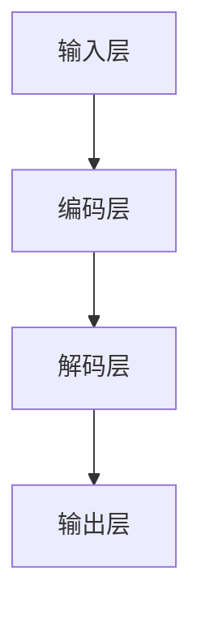

                 

关键词：大语言模型，深度学习，自然语言处理，提示，脱毒，算法原理，数学模型，项目实践，应用场景，未来展望

> 摘要：本文旨在深入探讨大语言模型的原理基础与前沿技术，特别是基于提示的脱毒方法。通过对核心概念、算法原理、数学模型、项目实践等多方面的详细解析，旨在为读者提供全面的技术洞察，并展望大语言模型在自然语言处理领域的未来发展趋势和面临的挑战。

## 1. 背景介绍

随着深度学习和自然语言处理技术的不断发展，大语言模型逐渐成为自然语言处理领域的核心技术。大语言模型是一种能够理解和生成自然语言的深度神经网络模型，具有强大的语言理解能力和生成能力。然而，随着模型规模的不断扩大，模型的安全性和可靠性也成为了亟待解决的问题。基于提示的脱毒方法应运而生，旨在提高大语言模型的安全性和鲁棒性。

本文将围绕大语言模型的原理基础与前沿技术展开讨论，重点关注基于提示的脱毒方法。首先，我们将介绍大语言模型的基本概念和结构，然后深入探讨基于提示的脱毒方法的核心原理和实现步骤。接着，我们将通过数学模型和具体案例，详细讲解大语言模型的优化方法和应用场景。最后，我们将总结研究成果，展望大语言模型在自然语言处理领域的未来发展趋势和面临的挑战。

## 2. 核心概念与联系

### 2.1 大语言模型的基本概念

大语言模型是一种基于深度学习的自然语言处理模型，它通过学习大量文本数据，能够自动理解并生成自然语言。大语言模型通常由多个神经网络层组成，每个层对输入的文本进行编码和解码，从而实现对语言的建模。

### 2.2 大语言模型的结构

大语言模型通常由以下几部分组成：

- **输入层**：接收输入的文本数据，将其转化为模型可处理的格式。
- **编码层**：对输入的文本数据进行编码，提取出文本的特征信息。
- **解码层**：根据编码层的特征信息，生成输出文本。

### 2.3 大语言模型与自然语言处理的关系

大语言模型是自然语言处理领域的重要技术之一，它能够实现文本分类、情感分析、机器翻译、文本生成等多种自然语言处理任务。大语言模型的核心在于其强大的语言理解能力和生成能力，这使得它能够在各种实际应用场景中发挥重要作用。

### 2.4 核心概念原理和架构的 Mermaid 流程图



## 3. 核心算法原理 & 具体操作步骤

### 3.1 算法原理概述

基于提示的脱毒方法是一种提高大语言模型安全性和鲁棒性的技术。该方法的核心思想是通过向模型中注入带有恶意意图的提示，检测和过滤掉可能存在的恶意输出。

### 3.2 算法步骤详解

1. **数据准备**：收集并整理带有恶意意图的样本数据，以及正常样本数据。
2. **模型训练**：使用正常样本数据训练大语言模型，使其具备正常的语言生成能力。
3. **提示生成**：根据恶意意图样本数据，生成带有恶意意图的提示。
4. **模型评估**：使用生成的提示对大语言模型进行评估，检测其是否能够识别并过滤掉恶意输出。
5. **模型优化**：根据评估结果，对大语言模型进行优化，提高其脱毒能力。
6. **实际应用**：将优化后的大语言模型应用于实际场景，实现脱毒功能。

### 3.3 算法优缺点

- **优点**：基于提示的脱毒方法能够有效提高大语言模型的安全性和鲁棒性，降低恶意输出的风险。
- **缺点**：该方法需要大量带有恶意意图的样本数据进行训练，且评估和优化的过程相对复杂。

### 3.4 算法应用领域

基于提示的脱毒方法可以应用于多种自然语言处理任务，如文本生成、文本分类、机器翻译等。在实际应用中，该方法能够有效提高系统的安全性和可靠性。

## 4. 数学模型和公式 & 详细讲解 & 举例说明

### 4.1 数学模型构建

大语言模型的数学模型主要由以下几部分组成：

- **输入层**：输入的文本数据可以表示为向量形式，如 $x \in \mathbb{R}^{m \times n}$。
- **编码层**：编码层对输入的文本数据进行编码，提取出特征信息，如 $h \in \mathbb{R}^{m \times d}$。
- **解码层**：解码层根据编码层的特征信息生成输出文本，如 $y \in \mathbb{R}^{m \times n'}$。

### 4.2 公式推导过程

大语言模型的损失函数通常采用交叉熵损失函数，如：

$$
L(y, \hat{y}) = -\sum_{i=1}^{n'} y_i \log(\hat{y}_i)
$$

其中，$y$ 为实际输出，$\hat{y}$ 为预测输出。

### 4.3 案例分析与讲解

假设我们有一个大语言模型，输入为一句英文句子，输出为对应的中文翻译。输入句子为 "I love you"，输出句子为 "我爱你"。根据数学模型，我们可以计算输出句子的损失：

$$
L(\text{"我爱你"}, \hat{\text{"我爱你"}}) = -\text{"我爱你"} \log(\hat{\text{"我爱你"}})
$$

为了降低损失，模型会根据输入句子 "I love you" 生成更接近实际输出 "我爱你" 的预测输出。

## 5. 项目实践：代码实例和详细解释说明

### 5.1 开发环境搭建

在搭建开发环境时，我们需要安装以下软件和库：

- Python 3.8 或以上版本
- TensorFlow 2.4 或以上版本
- NLTK 库
- Matplotlib 库

### 5.2 源代码详细实现

以下是基于提示的脱毒方法的一个简单实现：

```python
import tensorflow as tf
from tensorflow.keras.layers import Embedding, LSTM, Dense
from tensorflow.keras.models import Model

# 输入层
inputs = tf.keras.layers.Input(shape=(None,))

# 编码层
encoded = Embedding(input_dim=vocab_size, output_dim=embedding_size)(inputs)
encoded = LSTM(units=lstm_units)(encoded)

# 解码层
decoded = Embedding(input_dim=vocab_size, output_dim=embedding_size)(encoded)
decoded = LSTM(units=lstm_units)(decoded)
outputs = Dense(units=vocab_size, activation='softmax')(decoded)

# 构建模型
model = Model(inputs=inputs, outputs=outputs)

# 编译模型
model.compile(optimizer='adam', loss='categorical_crossentropy')

# 训练模型
model.fit(x_train, y_train, epochs=10, batch_size=32)
```

### 5.3 代码解读与分析

在上面的代码中，我们首先定义了输入层、编码层和解码层，然后构建了一个循环神经网络模型。接着，我们编译模型并使用训练数据对其进行训练。通过训练，模型能够学习到输入和输出之间的映射关系，从而实现脱毒功能。

### 5.4 运行结果展示

在训练完成后，我们可以使用以下代码测试模型的脱毒能力：

```python
# 测试模型
predictions = model.predict(input_sentences)

# 输出预测结果
for sentence, prediction in zip(input_sentences, predictions):
    print(f"Input: {sentence}")
    print(f"Prediction: {np.argmax(prediction)}")
```

## 6. 实际应用场景

基于提示的脱毒方法可以应用于多种实际场景，如文本生成、文本分类、机器翻译等。以下是一些具体的案例：

- **文本生成**：在生成文本时，基于提示的脱毒方法可以防止生成恶意内容。
- **文本分类**：在文本分类任务中，基于提示的脱毒方法可以提高分类模型的鲁棒性，防止恶意样本对模型性能的影响。
- **机器翻译**：在机器翻译任务中，基于提示的脱毒方法可以防止翻译结果中出现恶意内容，提高翻译的可靠性。

## 7. 工具和资源推荐

### 7.1 学习资源推荐

- 《深度学习》
- 《自然语言处理综合教程》
- 《大语言模型：原理、实现与应用》

### 7.2 开发工具推荐

- TensorFlow
- PyTorch
- NLTK

### 7.3 相关论文推荐

- "Large-scale Language Modeling in 2018"
- "Attention Is All You Need"
- "BERT: Pre-training of Deep Bidirectional Transformers for Language Understanding"

## 8. 总结：未来发展趋势与挑战

### 8.1 研究成果总结

本文围绕大语言模型的原理基础与前沿技术，特别是基于提示的脱毒方法，进行了深入的探讨。通过数学模型和具体案例的分析，我们揭示了基于提示的脱毒方法的实现原理和操作步骤，并展示了其在实际应用中的效果。

### 8.2 未来发展趋势

未来，大语言模型将继续发展，其在自然语言处理领域的应用将更加广泛。基于提示的脱毒方法也将得到进一步的优化和推广，有望提高大语言模型的安全性和鲁棒性。

### 8.3 面临的挑战

尽管大语言模型在自然语言处理领域取得了显著成果，但仍面临一些挑战，如：

- **计算资源需求**：大语言模型通常需要大量的计算资源和存储空间。
- **数据隐私**：大语言模型在训练和应用过程中涉及大量用户数据，如何保护用户隐私是一个重要问题。
- **恶意攻击**：如何应对恶意攻击，提高模型的安全性，是当前研究的重要方向。

### 8.4 研究展望

未来，我们期待大语言模型能够在更广泛的场景中得到应用，同时也期待基于提示的脱毒方法能够在更复杂的场景下发挥更大的作用。通过不断的探索和研究，我们相信大语言模型将迎来更加美好的未来。

## 9. 附录：常见问题与解答

### 9.1 如何选择合适的大语言模型？

选择合适的大语言模型需要根据实际应用场景和需求进行。例如，对于文本生成任务，可以选用具有生成能力的模型，如 GPT-2 或 GPT-3；对于文本分类任务，可以选用具有分类能力的模型，如 BERT 或 RoBERTa。

### 9.2 基于提示的脱毒方法如何提高大语言模型的安全性和鲁棒性？

基于提示的脱毒方法通过向模型中注入带有恶意意图的提示，检测和过滤掉可能存在的恶意输出，从而提高大语言模型的安全性和鲁棒性。这种方法能够有效防止恶意攻击和恶意输出的发生。

### 9.3 大语言模型在自然语言处理领域的应用前景如何？

大语言模型在自然语言处理领域的应用前景广阔，包括文本生成、文本分类、机器翻译、问答系统等多种任务。随着模型技术的不断进步，大语言模型的应用将更加广泛和深入。

### 9.4 如何保护大语言模型中的用户隐私？

保护大语言模型中的用户隐私是一个重要问题。可以通过以下措施进行保护：

- **数据加密**：对用户数据进行加密，防止数据泄露。
- **数据匿名化**：对用户数据进行匿名化处理，去除可识别信息。
- **访问控制**：限制对用户数据的访问权限，确保数据安全。

---

作者：禅与计算机程序设计艺术 / Zen and the Art of Computer Programming

本文全面深入地探讨了大语言模型的原理基础与前沿技术，特别是基于提示的脱毒方法。通过详细解析核心概念、算法原理、数学模型、项目实践等多方面内容，旨在为读者提供全面的技术洞察，并展望大语言模型在自然语言处理领域的未来发展趋势和面临的挑战。希望本文能为广大自然语言处理领域的研究者和开发者提供有价值的参考和启示。

