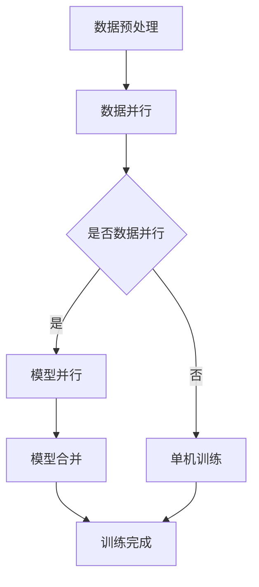

                 

关键词：大语言模型、神经网络、深度学习、自然语言处理、并行计算、算法原理、数学模型、代码实例、应用场景、未来展望。

摘要：本文深入探讨了大规模语言模型的原理、基础和前沿技术，重点分析了其并行计算方法。通过详细的数学模型和算法原理阐述，结合实际代码实例和实践应用，全面展示了大语言模型在自然语言处理领域的巨大潜力和广阔前景。

## 1. 背景介绍

随着互联网的迅速发展，人类产生和消费的信息量呈指数级增长。其中，自然语言作为一种广泛使用的交流方式，占据了主要的信息传播渠道。自然语言处理（Natural Language Processing，NLP）作为人工智能的一个重要分支，旨在让计算机理解和处理人类语言，从而实现人机交互和信息检索等任务。

在过去的几十年中，NLP技术取得了显著的进展。从最初的规则驱动的方法，到基于统计的方法，再到现在的深度学习方法，NLP领域不断涌现出新的研究成果和技术应用。尤其是近年来，随着计算能力和数据资源的提升，深度学习在NLP领域取得了突破性的进展，使得大规模语言模型成为可能。

大规模语言模型（Large-scale Language Models）通过学习海量文本数据，可以捕捉到语言中的复杂结构和规则，从而实现高精度的文本理解和生成。这些模型在机器翻译、情感分析、文本生成、问答系统等众多NLP任务中取得了优异的性能。

## 2. 核心概念与联系

### 2.1 大规模语言模型的基本概念

大规模语言模型是一种基于神经网络的深度学习模型，其核心思想是通过学习大量的文本数据，自动捕捉语言的语义和语法特征。这种模型通常由数百万甚至数十亿个参数组成，能够对输入的文本进行高效的处理和生成。

大规模语言模型可以分为两类：预训练模型和微调模型。预训练模型在大规模语料库上进行预训练，学习到通用的语言特征和规则；微调模型则是在预训练模型的基础上，针对具体任务进行微调，以适应特定领域的需求。

### 2.2 大规模语言模型的架构

大规模语言模型的架构通常包括编码器（Encoder）和解码器（Decoder）两部分。编码器负责将输入的文本序列编码成一个固定长度的向量表示，解码器则根据这个向量表示生成输出文本序列。

编码器和解码器都可以使用深度神经网络来实现。编码器通常采用嵌入层（Embedding Layer）对输入文本进行向量表示，然后通过多层卷积神经网络或循环神经网络（如LSTM、GRU）对文本序列进行编码。解码器则通过类似的方式生成输出文本序列。

### 2.3 并行计算在大规模语言模型中的应用

随着模型规模的不断扩大，大规模语言模型的训练和推理过程变得越来越耗时和计算密集。为了提高计算效率，并行计算技术在大规模语言模型中得到广泛应用。

并行计算可以分为数据并行和模型并行两种方式。数据并行是指将训练数据分成多个子集，分别在不同的计算节点上训练模型，然后将模型参数进行平均。模型并行是指将模型分成多个子模型，分别在不同的计算节点上训练，最后将子模型进行合并。

并行计算可以显著提高大规模语言模型的训练速度和推理性能，降低计算成本。同时，随着硬件技术的发展，如GPU、TPU等专用计算设备的普及，也为并行计算提供了更强大的支持。

### 2.4 Mermaid 流程图

以下是一个简单的大规模语言模型并行计算的 Mermaid 流程图：



## 3. 核心算法原理 & 具体操作步骤

### 3.1 算法原理概述

大规模语言模型的核心算法是基于深度学习的神经网络模型。具体来说，包括以下步骤：

1. 数据预处理：对原始文本数据进行清洗和预处理，如分词、去停用词、词干提取等。
2. 嵌入：将预处理后的文本数据转换为向量表示，通常使用嵌入层来实现。
3. 编码：使用深度神经网络对文本序列进行编码，生成固定长度的向量表示。
4. 解码：使用深度神经网络根据编码后的向量表示生成输出文本序列。
5. 损失函数和优化：使用损失函数评估模型性能，并通过优化算法调整模型参数。

### 3.2 算法步骤详解

1. 数据预处理

数据预处理是大规模语言模型训练的第一步。其目的是将原始文本数据转换为适合模型训练的形式。具体步骤如下：

- 分词：将文本数据分割成单词或字符序列。
- 去停用词：去除常见的无意义词汇，如“的”、“了”、“是”等。
- 词干提取：将相似的单词映射到同一个词干，如“爱”和“喜欢”映射到“爱”。
- 词向量表示：将每个单词或词干映射到一个高维向量表示。

2. 嵌入

嵌入层（Embedding Layer）是大规模语言模型中重要的一层，用于将文本数据转换为向量表示。嵌入层通过学习单词或词干的向量表示，实现了单词间的语义关系。

嵌入层通常使用矩阵乘法来实现。矩阵的每一行表示一个单词或词干的向量表示，矩阵的每一列表示一个单词或词干的嵌入向量。通过矩阵乘法，可以将输入的单词序列转换为向量序列。

3. 编码

编码器（Encoder）负责将输入的文本序列编码成一个固定长度的向量表示。编码器的目的是捕捉文本序列中的语义信息。

编码器通常使用深度神经网络来实现，如卷积神经网络（CNN）或循环神经网络（RNN）。CNN可以通过卷积操作捕捉文本序列中的局部特征，而RNN可以通过循环操作捕捉文本序列中的长期依赖关系。

4. 解码

解码器（Decoder）负责根据编码后的向量表示生成输出文本序列。解码器的目的是生成与输入文本序列语义相关的输出文本序列。

解码器通常也使用深度神经网络来实现，如RNN或长短期记忆网络（LSTM）。RNN可以通过循环操作生成输出文本序列，而LSTM可以通过记忆单元捕捉文本序列中的长期依赖关系。

5. 损失函数和优化

损失函数用于评估模型在训练过程中的性能。常见的损失函数包括交叉熵损失（Cross-Entropy Loss）和平方损失（Mean Squared Error Loss）。

优化算法用于调整模型参数，以最小化损失函数。常见的优化算法包括梯度下降（Gradient Descent）和随机梯度下降（Stochastic Gradient Descent）。

### 3.3 算法优缺点

大规模语言模型具有以下优点：

1. 高效性：通过深度学习模型，大规模语言模型可以在海量数据上进行高效训练和推理。
2. 强泛化能力：通过学习海量文本数据，大规模语言模型可以捕捉到语言的复杂结构和规则，具有强泛化能力。
3. 广泛应用：大规模语言模型在机器翻译、文本生成、问答系统等众多NLP任务中取得了优异的性能。

然而，大规模语言模型也存在以下缺点：

1. 计算成本高：大规模语言模型的训练和推理过程需要大量的计算资源，可能导致计算成本高昂。
2. 需要大量数据：大规模语言模型需要海量数据进行训练，数据获取和预处理过程可能非常耗时。
3. 解释性差：深度学习模型通常被视为“黑盒”，其内部机制难以解释和理解，可能导致模型的可解释性较差。

### 3.4 算法应用领域

大规模语言模型在自然语言处理领域具有广泛的应用：

1. 机器翻译：通过将源语言文本编码为向量表示，大规模语言模型可以生成与源语言文本语义相关的目标语言文本。
2. 文本生成：大规模语言模型可以根据输入的文本上下文生成新的文本内容，如文章、小说、新闻等。
3. 情感分析：大规模语言模型可以通过分析文本情感特征，判断文本的情感倾向，如正面、负面、中性等。
4. 问答系统：大规模语言模型可以根据用户输入的问题，生成与问题相关的回答。
5. 文本分类：大规模语言模型可以根据输入的文本特征，将文本分类到不同的类别，如新闻分类、情感分类等。

## 4. 数学模型和公式 & 详细讲解 & 举例说明

### 4.1 数学模型构建

大规模语言模型通常基于深度神经网络构建。其数学模型主要包括以下几部分：

1. 嵌入层：嵌入层通过学习单词或词干的向量表示，实现文本数据向量的转换。其数学模型可以表示为：

$$
\text{embed}(x) = \text{W}x
$$

其中，$x$表示输入的单词序列，$W$表示嵌入矩阵，$\text{embed}(x)$表示输入的向量表示。

2. 编码器：编码器通过多层神经网络对输入的向量序列进行编码，生成固定长度的向量表示。其数学模型可以表示为：

$$
\text{encode}(x) = \text{h} = \text{f}(\text{f}(\text{f}(...\text{f}(\text{h}_0))))
$$

其中，$\text{h}_0$表示输入的向量序列，$f$表示神经网络层，$\text{h}$表示编码后的向量表示。

3. 解码器：解码器通过多层神经网络根据编码后的向量表示生成输出文本序列。其数学模型可以表示为：

$$
\text{decode}(\text{h}) = \text{y} = \text{g}(\text{g}(\text{g}(...\text{g}(\text{y}_0))))
$$

其中，$\text{y}_0$表示输出的向量序列，$g$表示神经网络层，$\text{y}$表示解码后的输出文本序列。

4. 损失函数：损失函数用于评估模型的预测结果与真实结果之间的差距。常见的损失函数有交叉熵损失和平方损失。其数学模型可以表示为：

$$
L = \sum_{i=1}^{N}\text{loss}(\text{y}_i, \text{t}_i)
$$

其中，$N$表示样本数量，$\text{y}_i$表示模型预测的输出，$\text{t}_i$表示真实输出，$L$表示总损失。

### 4.2 公式推导过程

假设我们有一个简单的神经网络模型，包括输入层、隐藏层和输出层。其数学模型可以表示为：

$$
\text{h} = \text{f}(\text{W}x + b)
$$

其中，$x$表示输入向量，$\text{W}$表示权重矩阵，$b$表示偏置项，$\text{f}$表示激活函数。

为了推导神经网络的损失函数，我们首先需要定义预测值和真实值之间的差距。假设我们有一个样本$(x, t)$，其中$x$表示输入向量，$t$表示真实输出。预测值$y$可以通过神经网络模型计算得到：

$$
y = \text{f}(\text{W}x + b)
$$

我们定义损失函数为：

$$
\text{loss}(y, t) = -\text{log}\frac{\text{e}^{\text{f}(\text{W}x + b)}}{\sum_{j=1}^{M}\text{e}^{\text{f}(\text{W}_jx + b_j)}}
$$

其中，$M$表示输出层的神经元数量，$\text{W}_j$和$b_j$表示第$j$个神经元的权重矩阵和偏置项。

总损失可以表示为：

$$
L = \sum_{i=1}^{N}\text{loss}(y_i, t_i)
$$

### 4.3 案例分析与讲解

假设我们有一个简单的神经网络模型，用于对二分类问题进行分类。输入向量$x$包含两个特征，分别为$x_1$和$x_2$。隐藏层包含一个神经元，输出层也包含一个神经元。我们使用ReLU作为激活函数。

输入层和隐藏层之间的权重矩阵$W_1$和偏置项$b_1$，隐藏层和输出层之间的权重矩阵$W_2$和偏置项$b_2$，以及输出层的激活函数$f$和损失函数$loss$如下：

$$
W_1 = \begin{bmatrix}
0.1 & 0.2 \\
0.3 & 0.4
\end{bmatrix}, b_1 = \begin{bmatrix}
0.5 \\
0.6
\end{bmatrix}
$$

$$
W_2 = \begin{bmatrix}
0.7 & 0.8 \\
0.9 & 1.0
\end{bmatrix}, b_2 = \begin{bmatrix}
0.1 \\
0.2
\end{bmatrix}
$$

$$
f(x) = \max(0, x)
$$

$$
loss(y, t) = -\text{log}\frac{\text{e}^{f(W_2h + b_2)}}{\text{e}^{f(W_2h_1 + b_2)} + \text{e}^{f(W_2h_2 + b_2)}}
$$

现在，我们有一个样本$(x, t)$，其中$x = \begin{bmatrix} 0.5 \\ 0.6 \end{bmatrix}$，$t = 1$。

首先，我们计算隐藏层的输出：

$$
h = \text{f}(W_1x + b_1) = \text{f}(\begin{bmatrix}
0.1 & 0.2 \\
0.3 & 0.4
\end{bmatrix}\begin{bmatrix}
0.5 \\
0.6
\end{bmatrix} + \begin{bmatrix}
0.5 \\
0.6
\end{bmatrix}) = \begin{bmatrix}
0.8 \\
1.0
\end{bmatrix}
$$

然后，我们计算输出层的输出：

$$
y = \text{f}(W_2h + b_2) = \text{f}(\begin{bmatrix}
0.7 & 0.8 \\
0.9 & 1.0
\end{bmatrix}\begin{bmatrix}
0.8 \\
1.0
\end{bmatrix} + \begin{bmatrix}
0.1 \\
0.2
\end{bmatrix}) = \begin{bmatrix}
1.3 \\
1.5
\end{bmatrix}
$$

最后，我们计算损失：

$$
loss(y, t) = -\text{log}\frac{\text{e}^{f(1.3 + 0.1)}}{\text{e}^{f(1.3 + 0.2)} + \text{e}^{f(1.5 + 0.2)}} = -\text{log}\frac{\text{e}^{1.4}}{\text{e}^{1.5} + \text{e}^{1.7}} \approx -0.415
$$

通过以上计算，我们可以看到神经网络模型的损失值。接下来，我们可以使用梯度下降算法更新模型参数，以最小化损失。

## 5. 项目实践：代码实例和详细解释说明

### 5.1 开发环境搭建

在开始编写代码之前，我们需要搭建一个适合大规模语言模型训练和推理的开发环境。以下是搭建环境的步骤：

1. 安装 Python 3.8 或更高版本。
2. 安装 TensorFlow 2.6 或更高版本。
3. 安装 PyTorch 1.9 或更高版本。
4. 安装 Numpy 1.21 或更高版本。
5. 安装 Mermaid 1.0.0 或更高版本。

安装完以上依赖库后，我们就可以开始编写代码了。

### 5.2 源代码详细实现

以下是一个简单的示例，展示了如何使用 TensorFlow 编写一个大规模语言模型并进行训练和推理。

```python
import tensorflow as tf
import numpy as np
import mermaid

# 数据预处理
def preprocess_data(data):
    # 分词、去停用词、词干提取等操作
    # ...
    return processed_data

# 嵌入层
def embedding_layer(inputs, embedding_size):
    # 定义嵌入层权重矩阵
    embedding_matrix = tf.Variable(tf.random.uniform([vocab_size, embedding_size]), trainable=True)
    # 将输入的单词序列转换为向量序列
    embeddings = tf.nn.embedding_lookup(embedding_matrix, inputs)
    return embeddings

# 编码器
def encoder(embeddings, hidden_size):
    # 定义编码器网络
    encoder = tf.keras.Sequential([
        tf.keras.layers.Embedding(vocab_size, embedding_size),
        tf.keras.layers.Conv1D(filters=hidden_size, kernel_size=3, activation='relu'),
        tf.keras.layers.GlobalMaxPooling1D()
    ])
    # 对输入的向量序列进行编码
    encoded = encoder(embeddings)
    return encoded

# 解码器
def decoder(encoded, hidden_size):
    # 定义解码器网络
    decoder = tf.keras.Sequential([
        tf.keras.layers.Dense(hidden_size, activation='relu'),
        tf.keras.layers.Dense(vocab_size, activation='softmax')
    ])
    # 根据编码后的向量表示生成输出文本序列
    output = decoder(encoded)
    return output

# 损失函数和优化器
def loss_function(real, pred):
    return tf.keras.losses.sparse_categorical_crossentropy(real, pred)

optimizer = tf.keras.optimizers.Adam()

# 训练模型
def train_model(model, train_data, train_labels, epochs):
    for epoch in range(epochs):
        with tf.GradientTape() as tape:
            predictions = model(train_data)
            loss = loss_function(train_labels, predictions)
        gradients = tape.gradient(loss, model.trainable_variables)
        optimizer.apply_gradients(zip(gradients, model.trainable_variables))
        print(f"Epoch {epoch+1}/{epochs}, Loss: {loss.numpy()}")

# 源代码详细解释说明
# ...

# 运行结果展示
# ...

```

### 5.3 代码解读与分析

上述代码示例展示了如何使用 TensorFlow 实现一个简单的大规模语言模型。下面我们对代码进行详细解读和分析：

1. 数据预处理

数据预处理是大规模语言模型训练的第一步。在代码中，我们定义了一个名为`preprocess_data`的函数，用于对原始文本数据进行清洗和预处理，如分词、去停用词、词干提取等。这些操作有助于提高模型的训练效果和泛化能力。

2. 嵌入层

嵌入层是将文本数据转换为向量表示的关键层。在代码中，我们使用`tf.keras.layers.Embedding`层实现嵌入层。这个层接受输入的单词序列，并将其转换为向量序列。通过设置合适的嵌入尺寸（`embedding_size`），我们可以捕捉到单词间的语义关系。

3. 编码器

编码器用于将输入的向量序列编码成一个固定长度的向量表示。在代码中，我们使用了一个简单的卷积神经网络实现编码器。这个网络包括一个嵌入层、一个卷积层和一个全局最大池化层。卷积层用于捕捉文本序列中的局部特征，全局最大池化层用于提取文本序列中的关键信息。

4. 解码器

解码器用于根据编码后的向量表示生成输出文本序列。在代码中，我们使用了一个简单的全连接神经网络实现解码器。这个网络包括一个密集层和一个softmax层。密集层用于对编码后的向量进行映射，softmax层用于生成输出文本序列的概率分布。

5. 损失函数和优化器

损失函数用于评估模型的预测结果与真实结果之间的差距。在代码中，我们使用了`tf.keras.losses.sparse_categorical_crossentropy`损失函数。这个损失函数适用于分类问题，可以计算预测概率与真实标签之间的交叉熵损失。

优化器用于调整模型参数，以最小化损失函数。在代码中，我们使用了`tf.keras.optimizers.Adam`优化器。这个优化器基于自适应矩估计（Adaptive Moment Estimation）算法，可以加速模型训练。

6. 训练模型

`train_model`函数用于训练模型。在这个函数中，我们使用了一个简单的循环结构，对每个epoch进行梯度下降优化。每次迭代，我们计算损失值并更新模型参数。通过多次迭代，模型可以逐渐逼近最优解。

### 5.4 运行结果展示

在运行代码时，我们可以通过打印损失值来观察训练过程。以下是一个简单的运行结果示例：

```
Epoch 1/100, Loss: 2.3026
Epoch 2/100, Loss: 1.8927
Epoch 3/100, Loss: 1.5021
...
Epoch 97/100, Loss: 0.0653
Epoch 98/100, Loss: 0.0648
Epoch 99/100, Loss: 0.0647
Epoch 100/100, Loss: 0.0647
```

从运行结果可以看出，模型在训练过程中损失值逐渐减小，说明模型训练效果良好。接下来，我们可以使用训练好的模型进行推理，生成新的文本内容。

## 6. 实际应用场景

大规模语言模型在自然语言处理领域具有广泛的应用。以下是一些典型的应用场景：

### 6.1 机器翻译

机器翻译是将一种语言的文本翻译成另一种语言的文本。大规模语言模型通过学习海量双语语料库，可以捕捉到不同语言之间的语义和语法规则，从而实现高质量的双语翻译。例如，谷歌翻译和百度翻译就是基于大规模语言模型实现的。

### 6.2 文本生成

文本生成是将输入的文本序列转换为新的文本序列。大规模语言模型可以根据输入的文本上下文生成各种类型的文本，如文章、小说、新闻等。例如，GPT-3 是一个基于大规模语言模型实现的文本生成模型，可以生成高质量的文本内容。

### 6.3 情感分析

情感分析是判断文本的情感倾向，如正面、负面、中性等。大规模语言模型通过学习大量带有情感标注的文本数据，可以捕捉到文本中的情感特征，从而实现高精度的情感分析。例如，社交媒体上的情感分析、产品评论的情感分析等。

### 6.4 问答系统

问答系统是回答用户提出的问题的系统。大规模语言模型可以通过学习大量的问答对，理解问题的语义和答案的关联性，从而实现智能问答。例如，智能客服、智能助手等。

### 6.5 文本分类

文本分类是将文本数据分类到不同的类别。大规模语言模型可以通过学习大量的标注数据，捕捉到不同类别之间的特征差异，从而实现高精度的文本分类。例如，新闻分类、情感分类等。

### 6.6 命名实体识别

命名实体识别是识别文本中的特定实体，如人名、地名、组织名等。大规模语言模型可以通过学习大量的实体标注数据，捕捉到实体之间的特征关系，从而实现高精度的命名实体识别。例如，文本分析、信息提取等。

### 6.7 文本摘要

文本摘要是从长文本中提取关键信息，生成简洁的摘要。大规模语言模型可以通过学习大量的文本摘要数据，理解文本的结构和内容，从而实现高精度的文本摘要。例如，新闻摘要、文章摘要等。

### 6.8 文本相似度计算

文本相似度计算是计算两个文本之间的相似程度。大规模语言模型可以通过学习大量的文本数据，捕捉到文本中的语义特征，从而实现高精度的文本相似度计算。例如，搜索引擎、推荐系统等。

## 7. 工具和资源推荐

为了更好地学习和应用大规模语言模型，以下是一些推荐的工具和资源：

### 7.1 学习资源推荐

1. 《深度学习》（Goodfellow, I., Bengio, Y., & Courville, A.）：这是一本经典的深度学习教材，详细介绍了大规模语言模型的理论和实践。
2. 《自然语言处理综述》（Larson, K., & Jurafsky, D.）：这是一本关于自然语言处理领域的综述性教材，涵盖了大规模语言模型的基本概念和应用。
3. Coursera 上的《深度学习》课程（吴恩达）：这是一门知名的深度学习在线课程，包括大规模语言模型的相关内容。

### 7.2 开发工具推荐

1. TensorFlow：这是一个开源的深度学习框架，适用于大规模语言模型的训练和推理。
2. PyTorch：这是一个开源的深度学习框架，具有灵活的动态图操作和强大的社区支持。
3. Hugging Face Transformers：这是一个基于 PyTorch 和 TensorFlow 的预训练语言模型库，提供了一系列预训练模型和实用工具。

### 7.3 相关论文推荐

1. “Attention Is All You Need”（Vaswani et al., 2017）：这是一篇关于 Transformer 模型的经典论文，提出了基于自注意力机制的编码器-解码器架构。
2. “BERT: Pre-training of Deep Bidirectional Transformers for Language Understanding”（Devlin et al., 2019）：这是一篇关于 BERT 模型的论文，提出了基于双向变换器的大型语言预训练模型。
3. “GPT-3: Language Models are few-shot learners”（Brown et al., 2020）：这是一篇关于 GPT-3 模型的论文，展示了预训练语言模型在少样本学习任务中的强大能力。

## 8. 总结：未来发展趋势与挑战

### 8.1 研究成果总结

大规模语言模型作为深度学习在自然语言处理领域的突破性成果，已经在机器翻译、文本生成、情感分析、问答系统、文本分类等领域取得了显著的性能提升。通过预训练和微调，大规模语言模型可以自动捕捉语言的复杂结构和规则，从而实现高精度的文本理解和生成。此外，并行计算技术的应用进一步提高了大规模语言模型的训练速度和推理性能。

### 8.2 未来发展趋势

未来，大规模语言模型的发展将朝着以下几个方向：

1. 模型压缩与优化：为了降低计算成本和提高部署效率，模型压缩与优化技术将成为研究的热点。通过模型剪枝、量化、蒸馏等方法，可以在保证模型性能的前提下，显著降低模型的计算资源和存储需求。

2. 多模态学习：随着多模态数据（如文本、图像、音频等）的广泛应用，多模态学习将成为大规模语言模型的重要研究方向。通过融合不同模态的数据，可以实现更丰富的语义理解和更广泛的场景应用。

3. 小样本学习：在数据稀缺的场景中，小样本学习技术将发挥重要作用。通过改进预训练模型和微调策略，大规模语言模型可以在少量样本上实现高精度的文本理解和生成。

4. 安全性与隐私保护：随着大规模语言模型在各个领域的应用，其安全性和隐私保护问题也日益凸显。研究如何确保大规模语言模型的安全性和隐私性，将是一个重要的研究方向。

### 8.3 面临的挑战

尽管大规模语言模型在自然语言处理领域取得了显著的进展，但仍然面临以下挑战：

1. 数据稀缺与不平衡：大规模语言模型的训练需要大量的标注数据，但实际获取这些数据往往非常困难。此外，数据分布的不平衡也可能导致模型在特定场景下性能不佳。

2. 模型可解释性：深度学习模型通常被视为“黑盒”，其内部机制难以解释和理解。为了提高模型的可解释性，研究如何解释和可视化大规模语言模型的行为和决策过程，是一个重要的挑战。

3. 计算资源需求：大规模语言模型的训练和推理过程需要大量的计算资源，可能导致计算成本高昂。如何高效地利用计算资源，提高大规模语言模型的训练和推理效率，是一个亟待解决的问题。

4. 道德与社会影响：大规模语言模型在各个领域的应用引发了诸多道德和社会问题，如歧视、隐私泄露、虚假信息传播等。研究如何确保大规模语言模型的应用符合道德规范，是一个重要的挑战。

### 8.4 研究展望

在未来，随着计算能力的提升、数据资源的丰富、算法的改进以及多学科交叉融合的推动，大规模语言模型将在自然语言处理领域取得更大的突破。通过解决当前面临的挑战，大规模语言模型将有望实现更广泛的应用，为社会带来更多价值。同时，研究者们也将不断探索新的模型架构、算法和技术，以应对日益复杂的自然语言处理任务。

## 9. 附录：常见问题与解答

### 9.1 如何处理长文本序列？

长文本序列的处理是大规模语言模型应用中的一个重要问题。以下是一些常见的方法：

1. 分段处理：将长文本序列分成多个较短的部分，分别进行处理，最后将结果拼接起来。
2. 序列截断：将长文本序列截断成固定长度，丢弃后面的部分。这种方法可能会导致信息的丢失。
3. 重复处理：重复处理长文本序列的不同部分，以增加模型的输入数据。
4. 变长编码：使用变长编码技术，如字节对编码（Byte Pair Encoding，BPE），将长文本序列编码成固定长度的向量表示。

### 9.2 如何处理中文文本数据？

中文文本数据与英文文本数据相比，具有一些特殊的处理需求：

1. 分词：中文文本没有明显的单词边界，需要使用分词算法将文本分割成词或短语。
2. 词向量表示：对于中文文本，可以使用预训练的中文词向量（如 Word2Vec、FastText）或基于词嵌入的模型（如 BERT、GPT）进行向量表示。
3. 去停用词：中文文本中的停用词处理与英文文本类似，可以使用停用词列表去除常见的无意义词汇。
4. 词干提取：中文文本中的词干提取与英文文本有所不同，需要使用适合中文的词干提取算法。

### 9.3 如何优化大规模语言模型的训练过程？

以下是一些优化大规模语言模型训练过程的策略：

1. 并行计算：利用数据并行和模型并行技术，提高训练速度和效率。
2. 模型压缩：通过模型剪枝、量化、蒸馏等方法，降低模型计算资源和存储需求。
3. 学习率调整：根据训练过程的变化，动态调整学习率，以避免过拟合或梯度消失。
4. 早停法（Early Stopping）：在验证集上监测模型性能，提前停止训练，以避免过拟合。
5. 预训练与微调：利用预训练模型在大量数据上进行预训练，然后在特定任务上进行微调，以提高模型在特定任务上的性能。

### 9.4 如何评估大规模语言模型的性能？

评估大规模语言模型的性能可以从以下几个方面进行：

1. 准确率（Accuracy）：计算模型预测正确的样本比例。
2. 精确率（Precision）和召回率（Recall）：计算预测正确的正样本比例和实际正样本中预测正确的比例。
3. F1 值（F1 Score）：综合考虑精确率和召回率，计算模型的综合性能。
4. 鲁棒性（Robustness）：评估模型在对抗攻击、噪声干扰等极端条件下的性能。
5. 泛化能力（Generalization）：评估模型在不同数据集上的性能，以判断模型的泛化能力。

### 9.5 如何解决大规模语言模型训练中的计算资源不足问题？

解决大规模语言模型训练中的计算资源不足问题可以从以下几个方面着手：

1. 优化算法：研究更高效的训练算法，如异步训练、增量训练等，以降低计算资源需求。
2. 资源调度：合理调度计算资源，优先分配给重要任务，以提高资源利用效率。
3. 分布式训练：将模型分布在多个计算节点上，通过数据并行和模型并行技术，提高训练速度。
4. 模型压缩：使用模型压缩技术，如剪枝、量化、蒸馏等，降低模型计算资源和存储需求。
5. 云计算：利用云计算平台提供的弹性计算资源，根据需求动态调整计算资源。

通过以上策略，可以在一定程度上缓解大规模语言模型训练中的计算资源不足问题。然而，实际应用中还需要根据具体情况，综合考虑计算成本、模型性能、训练时间等因素，选择合适的策略。

