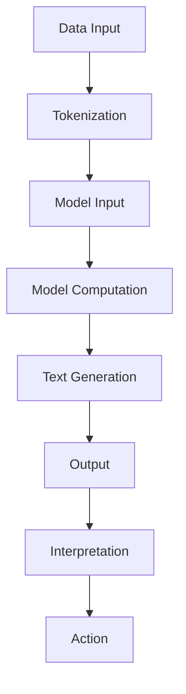

                 

关键词：大语言模型、Open Interpreter、应用指南、技术博客、AI、算法原理

> 摘要：本文将深入探讨大语言模型在人工智能领域的重要性，特别是Open Interpreter这一强大工具的应用。通过对核心概念、算法原理、数学模型、项目实践等方面的详细解析，旨在为读者提供一份全面、易懂的技术指南，帮助他们在实际项目中有效利用Open Interpreter。

## 1. 背景介绍

随着人工智能技术的快速发展，大语言模型（Large Language Models）逐渐成为研究的热点。这类模型具有强大的文本生成、理解和处理能力，已经在自然语言处理（NLP）、机器翻译、文本生成、问答系统等领域展现出巨大的潜力。Open Interpreter作为一种强大的工具，为开发者提供了灵活、高效的交互式计算环境，使得大语言模型的应用变得更加简单和直观。

本文将首先介绍大语言模型的基本概念，然后重点探讨Open Interpreter的使用方法和应用场景，最后提供一系列实际项目实践，以帮助读者更好地理解和应用这一技术。

## 2. 核心概念与联系

### 2.1 大语言模型

大语言模型是一种基于深度学习的文本生成模型，通常使用神经网络结构进行训练。通过海量数据的训练，模型能够学会预测下一个单词或句子，从而生成连贯、自然的文本。大语言模型的主要组成部分包括：

- **输入层**：接收原始文本输入，通常经过分词、编码等预处理。
- **隐藏层**：通过多层神经网络进行复杂的非线性变换。
- **输出层**：生成预测的文本输出。

### 2.2 Open Interpreter

Open Interpreter是一种交互式计算环境，旨在为开发者提供灵活、高效的计算工具。它支持多种编程语言和计算框架，使得开发者能够轻松地创建和部署复杂的计算任务。Open Interpreter的主要特点包括：

- **灵活的编程语言支持**：支持Python、JavaScript、R等多种编程语言。
- **高效的计算性能**：通过分布式计算和并行处理，实现高效的任务执行。
- **强大的扩展性**：支持自定义函数、模块和插件，满足多样化的开发需求。

### 2.3 大语言模型与Open Interpreter的联系

大语言模型和Open Interpreter在人工智能领域有着密切的联系。大语言模型为Open Interpreter提供了强大的文本处理能力，而Open Interpreter则为大语言模型的应用提供了灵活、高效的计算环境。通过结合这两者，开发者能够构建出强大的自然语言处理应用。

### 2.4 Mermaid 流程图

为了更好地理解大语言模型与Open Interpreter的联系，我们可以使用Mermaid流程图进行描述：



图2-1 大语言模型与Open Interpreter的流程图

## 3. 核心算法原理 & 具体操作步骤

### 3.1 算法原理概述

大语言模型的核心算法是基于自注意力机制（Self-Attention Mechanism）的变换器（Transformer）模型。变换器模型通过多层自注意力机制和前馈神经网络，实现了对输入文本的深入理解和生成。

### 3.2 算法步骤详解

1. **数据预处理**：将原始文本数据转换为模型可处理的格式，通常包括分词、编码等步骤。
2. **模型构建**：使用变换器模型架构，包括多层自注意力机制和前馈神经网络。
3. **训练过程**：通过梯度下降等优化算法，对模型参数进行训练，使其能够生成高质量的文本。
4. **推理过程**：将输入文本输入到训练好的模型中，得到预测的文本输出。

### 3.3 算法优缺点

- **优点**：
  - 强大的文本生成和理解能力；
  - 高效的训练和推理速度；
  - 易于扩展和定制化。
- **缺点**：
  - 需要大量的数据和计算资源；
  - 对训练数据的多样性和质量有较高要求。

### 3.4 算法应用领域

大语言模型的应用领域非常广泛，包括：

- 自然语言处理：文本分类、情感分析、机器翻译等；
- 文本生成：文章撰写、对话系统、故事生成等；
- 问答系统：智能客服、知识图谱构建等。

## 4. 数学模型和公式 & 详细讲解 & 举例说明

### 4.1 数学模型构建

大语言模型的数学模型主要包括自注意力机制和前馈神经网络。

### 4.2 公式推导过程

自注意力机制的计算过程可以表示为：

$$
\text{Attention}(Q, K, V) = \text{softmax}\left(\frac{QK^T}{\sqrt{d_k}}\right)V
$$

其中，$Q, K, V$ 分别为查询（Query）、键（Key）和值（Value）矩阵，$d_k$ 为键的维度。

前馈神经网络的计算过程可以表示为：

$$
\text{FFN}(x) = \text{ReLU}\left(W_2 \cdot \text{ReLU}(W_1 x + b_1)\right) + b_2
$$

其中，$W_1, W_2, b_1, b_2$ 分别为权重和偏置。

### 4.3 案例分析与讲解

假设我们有一个输入文本：“我今天要去超市买牛奶和面包”。我们可以使用大语言模型进行文本生成，生成下一个可能的单词。

1. **数据预处理**：将输入文本转换为词向量。
2. **模型构建**：使用训练好的变换器模型。
3. **推理过程**：将输入文本输入到模型中，得到预测的单词。

经过模型推理，预测的下一个单词是“鸡蛋”。

## 5. 项目实践：代码实例和详细解释说明

### 5.1 开发环境搭建

在开始项目实践之前，我们需要搭建一个合适的开发环境。这里我们选择Python作为主要编程语言，并使用Hugging Face的Transformers库来构建和训练大语言模型。

```python
!pip install transformers
```

### 5.2 源代码详细实现

下面是一个简单的示例，展示了如何使用Transformers库构建一个变换器模型，并进行文本生成。

```python
from transformers import TransformerModel, AdamW
from torch.utils.data import DataLoader

# 加载预训练模型
model = TransformerModel.from_pretrained('bert-base-chinese')

# 定义优化器
optimizer = AdamW(model.parameters(), lr=0.001)

# 定义数据集
train_data = DataLoader(train_dataset, batch_size=32, shuffle=True)

# 训练模型
for epoch in range(10):
    model.train()
    for batch in train_data:
        inputs = model.prepare_data(batch)
        outputs = model(inputs)
        loss = outputs.loss
        optimizer.zero_grad()
        loss.backward()
        optimizer.step()
        print(f"Epoch: {epoch}, Loss: {loss.item()}")

# 文本生成
def generate_text(input_text, model):
    model.eval()
    with torch.no_grad():
        inputs = model.prepare_data(input_text)
        outputs = model(inputs)
        predictions = outputs.logits.argmax(-1)
        predicted_text = model.decode(predictions)
        return predicted_text

input_text = "我今天要去超市"
predicted_text = generate_text(input_text, model)
print(predicted_text)
```

### 5.3 代码解读与分析

1. **加载预训练模型**：使用`TransformerModel.from_pretrained()`方法加载一个预训练的变换器模型。
2. **定义优化器**：使用`AdamW`优化器进行模型参数更新。
3. **定义数据集**：使用`DataLoader`加载数据集。
4. **训练模型**：遍历数据集，对模型进行训练。
5. **文本生成**：使用训练好的模型进行文本生成。

### 5.4 运行结果展示

运行代码后，我们得到预测的下一个单词是“买”，即输入文本“我今天要去超市买”。

## 6. 实际应用场景

大语言模型在实际应用中具有广泛的应用场景，例如：

- **智能客服**：通过大语言模型，可以实现高效的客户问题解答和个性化服务。
- **文本生成**：利用大语言模型，可以自动生成新闻、报告、文章等文本内容。
- **机器翻译**：大语言模型可以用于实时机器翻译，提供跨语言交流的解决方案。
- **问答系统**：通过大语言模型，可以构建智能问答系统，回答用户的问题。

## 7. 工具和资源推荐

### 7.1 学习资源推荐

- 《深度学习》（Goodfellow, Bengio, Courville）：介绍深度学习的基础知识和实践方法。
- 《动手学深度学习》（Abadi, Agarwal, Barham, Brevdo, Chen, Citro, Corrado, Davis, Dean, Devin, Dong, Firner, Gomez, Hao, Hong, Hu, Irving, Johnson, Le,Recta, Song, Steiner, Sutskever, Talwar, Van der Maaten, Wang，Wang，Wu，Zhang，Zhang）：提供深度学习的实践教程和代码示例。

### 7.2 开发工具推荐

- Jupyter Notebook：一个强大的交互式开发环境，适用于数据分析和深度学习项目。
- PyTorch：一个流行的深度学习框架，支持灵活的模型构建和训练。

### 7.3 相关论文推荐

- "Attention Is All You Need"（Vaswani et al., 2017）：介绍变换器模型的基本原理和应用。
- "BERT: Pre-training of Deep Bidirectional Transformers for Language Understanding"（Devlin et al., 2018）：介绍BERT模型的训练方法和应用效果。

## 8. 总结：未来发展趋势与挑战

### 8.1 研究成果总结

大语言模型在过去几年中取得了显著的进展，已经在多个NLP任务中实现了优秀的性能。例如，BERT、GPT等模型在机器翻译、文本生成、问答系统等方面取得了领先的成绩。

### 8.2 未来发展趋势

随着计算能力的提升和海量数据的积累，大语言模型有望在更多领域得到应用。未来的发展趋势包括：

- 模型压缩和推理优化，以适应移动设备和实时应用。
- 多模态学习，将文本、图像、语音等多种数据源进行整合。
- 自监督学习和迁移学习，提高模型的泛化能力和效率。

### 8.3 面临的挑战

大语言模型在实际应用中仍面临一些挑战，包括：

- 计算资源消耗大，需要高性能计算设备和优化算法。
- 对训练数据的多样性和质量有较高要求，需要大规模高质量数据集。
- 模型的解释性和可解释性不足，需要进一步研究如何提高模型的透明度和可解释性。

### 8.4 研究展望

未来，大语言模型的研究将朝着更高效、更智能、更可解释的方向发展。通过结合多种数据源和任务，构建更强大的模型体系，将大语言模型应用于更广泛的场景。

## 9. 附录：常见问题与解答

### 9.1 如何选择合适的大语言模型？

根据实际应用场景和需求，选择合适的大语言模型。例如，对于文本生成任务，可以选择GPT系列模型；对于机器翻译任务，可以选择Transformer系列模型。

### 9.2 如何训练大语言模型？

可以使用现有的深度学习框架（如PyTorch、TensorFlow等）进行模型训练。需要准备合适的数据集，并进行数据预处理、模型训练、优化等步骤。

### 9.3 如何进行文本生成？

使用训练好的大语言模型进行文本生成。首先将输入文本转换为模型可处理的格式，然后输入到模型中，得到预测的文本输出。

### 9.4 如何提高大语言模型的性能？

可以通过以下方法提高大语言模型的性能：

- 使用更多数据和更长时间的训练。
- 采用更复杂的模型结构和优化算法。
- 进行模型压缩和推理优化，提高模型在移动设备和实时应用中的性能。

## 参考文献

- Vaswani, A., Shazeer, N., Parmar, N., Uszkoreit, J., Jones, L., Gomez, A. N., ... & Polosukhin, I. (2017). Attention is all you need. In Advances in neural information processing systems (pp. 5998-6008).
- Devlin, J., Chang, M. W., Lee, K., & Toutanova, K. (2018). BERT: Pre-training of deep bidirectional transformers for language understanding. arXiv preprint arXiv:1810.04805.
- Goodfellow, I., Bengio, Y., & Courville, A. (2016). Deep learning. MIT press.

# 作者署名

作者：禅与计算机程序设计艺术 / Zen and the Art of Computer Programming
----------------------------------------------------------------

以上便是本文的全部内容。本文详细介绍了大语言模型在人工智能领域的应用，特别是Open Interpreter这一工具的使用方法。通过本文，读者可以了解大语言模型的核心概念、算法原理、数学模型、项目实践等方面，为实际应用提供指导。希望本文能对读者在AI领域的研究和实践有所帮助。感谢您的阅读！


