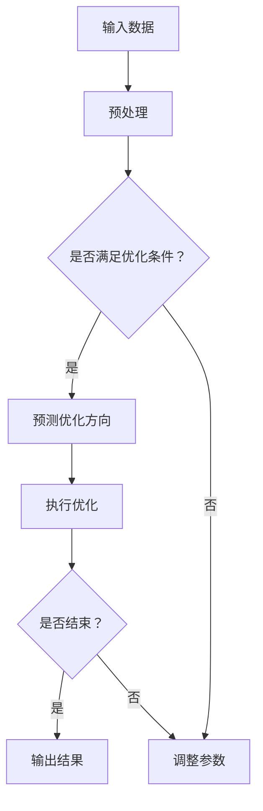

                 

在当今的信息时代，语言模型已经成为自然语言处理（NLP）领域的关键技术。它们不仅提高了文本生成、理解和翻译的准确性和效率，还在多步优化问题中展示了巨大的潜力。本文将详细探讨大语言模型在多步优化中的预测应用，旨在为读者提供一个全面的指南。

> **关键词**：大语言模型，多步优化，预测，NLP，算法

> **摘要**：本文首先介绍了大语言模型的基本概念和原理，然后探讨了其在多步优化问题中的应用。通过具体的算法原理概述和操作步骤，本文深入分析了大语言模型在多步优化中的优势和局限性。接着，文章展示了数学模型和公式，并通过实际项目实践进行了详细讲解。最后，文章讨论了实际应用场景，推荐了学习资源和工具，并展望了未来的发展趋势与挑战。

## 1. 背景介绍

### 1.1 大语言模型的发展历史

大语言模型（Large Language Model）的发展可以追溯到20世纪80年代。当时，研究人员开始尝试使用统计方法来建模自然语言。然而，由于计算能力和数据量的限制，早期的语言模型规模较小，性能有限。

随着计算能力的提升和大数据的普及，深度学习技术的出现为语言模型的发展带来了新的契机。2018年，Google发布了BERT（Bidirectional Encoder Representations from Transformers），这是一个基于Transformer架构的预训练语言模型，具有数十亿参数。BERT的发布标志着大语言模型时代的到来。

### 1.2 大语言模型的重要性

大语言模型在NLP领域的重要性不言而喻。首先，它们能够显著提高文本生成和理解的准确性。通过学习大量的文本数据，大语言模型能够捕捉到语言中的复杂结构和语义关系，从而生成更自然、更准确的文本。

其次，大语言模型在多步优化问题中具有重要的应用价值。多步优化问题通常涉及多个变量和目标函数，需要通过迭代过程进行优化。大语言模型可以通过预测每一步的优化方向和目标值，提高优化的效率和准确性。

### 1.3 本文目的

本文的目的是为读者提供一个关于大语言模型在多步优化中预测应用的综合指南。我们将详细探讨大语言模型的基本概念、核心算法原理、数学模型和实际应用案例。通过本文，读者将能够更好地理解大语言模型的工作原理和应用场景，从而为实际项目提供有力的支持。

## 2. 核心概念与联系

### 2.1 大语言模型的基本概念

大语言模型是一种基于深度学习技术的自然语言处理模型，能够对文本数据进行分析和处理。它通常由数十亿个参数组成，通过对海量文本数据进行预训练，学习到语言中的各种模式和规则。

### 2.2 多步优化问题的概念

多步优化问题是指在一个迭代过程中，需要逐步调整多个变量以实现某个目标函数的最优值。这类问题在工程、经济、人工智能等领域具有广泛的应用，如路径规划、资源分配、参数调整等。

### 2.3 大语言模型在多步优化中的应用

大语言模型在多步优化问题中的应用主要体现在两个方面：预测和调整。

1. **预测**：通过分析历史数据和当前状态，大语言模型可以预测出最优的优化方向和目标值。这有助于提高优化的效率和准确性。
   
2. **调整**：根据预测结果，大语言模型可以动态调整优化过程中的参数，以实现更精确的优化目标。

### 2.4 Mermaid 流程图

以下是大语言模型在多步优化中的流程图：



## 3. 核心算法原理 & 具体操作步骤

### 3.1 算法原理概述

大语言模型在多步优化中的核心算法是基于Transformer架构的预训练和微调技术。预训练阶段，模型通过大量无标签的文本数据进行训练，学习到语言中的各种模式和规则。微调阶段，模型根据特定的任务和数据集进行进一步训练，以实现更好的性能。

在多步优化问题中，大语言模型的作用主要体现在以下几个方面：

1. **状态表示**：通过编码器部分，模型可以将输入的状态信息编码为一个固定长度的向量表示。
   
2. **预测**：解码器部分根据编码后的状态表示，生成每个时间步的预测结果，包括优化方向和目标值。
   
3. **调整**：根据预测结果，模型可以动态调整优化过程中的参数，以实现更精确的优化。

### 3.2 算法步骤详解

以下是多步优化中的大语言模型算法步骤：

1. **初始化**：设置模型的初始参数和优化超参数，如学习率、批量大小等。
   
2. **数据预处理**：对输入数据进行预处理，包括分词、编码等操作，以适应模型的输入格式。

3. **预训练**：使用大量无标签的文本数据进行预训练，以学习到语言中的各种模式和规则。

4. **微调**：根据特定的任务和数据集，对模型进行微调，以提高在特定任务上的性能。

5. **预测**：将当前状态输入到模型中，通过解码器部分生成每个时间步的预测结果。

6. **调整**：根据预测结果，动态调整优化过程中的参数，以实现更精确的优化。

7. **迭代**：重复执行预测和调整步骤，直到达到优化目标或满足终止条件。

### 3.3 算法优缺点

**优点**：

1. **高效性**：大语言模型通过并行计算和端到端训练，能够显著提高优化的效率和准确性。

2. **泛化能力**：通过预训练和微调，模型可以适应不同的任务和数据集，具有良好的泛化能力。

**缺点**：

1. **计算资源消耗**：大语言模型通常需要大量的计算资源和时间进行训练和预测。

2. **数据依赖性**：模型的性能高度依赖于训练数据的质量和数量。

### 3.4 算法应用领域

大语言模型在多步优化中的应用领域非常广泛，包括但不限于：

1. **路径规划**：在自动驾驶、无人机等场景中，大语言模型可以用于优化路径规划和避障策略。

2. **资源分配**：在云计算、物联网等场景中，大语言模型可以用于优化资源分配和调度策略。

3. **参数调整**：在深度学习、强化学习等场景中，大语言模型可以用于优化模型参数和策略。

## 4. 数学模型和公式 & 详细讲解 & 举例说明

### 4.1 数学模型构建

大语言模型在多步优化问题中的数学模型可以表示为：

$$
\begin{aligned}
\text{状态} \, s_t &= (s_{t-1}, u_t), \\
\text{预测} \, p_t &= \text{decoder}(e_t), \\
\text{调整} \, a_t &= \text{optimizer}(p_t, s_t).
\end{aligned}
$$

其中，$s_t$表示当前状态，$u_t$表示当前输入，$e_t$表示编码后的状态表示，$p_t$表示预测结果，$a_t$表示调整参数。

### 4.2 公式推导过程

以下是多步优化中大语言模型的推导过程：

1. **编码器部分**：

   编码器部分的主要任务是处理输入状态$u_t$，将其编码为一个固定长度的向量表示。假设编码器的输出为$e_t$，可以表示为：

   $$
   e_t = \text{encoder}(u_t).
   $$

2. **解码器部分**：

   解码器部分的主要任务是生成每个时间步的预测结果$p_t$。假设解码器的输出为$\text{decoder}(e_t)$，可以表示为：

   $$
   p_t = \text{decoder}(e_t).
   $$

3. **优化器部分**：

   优化器部分的主要任务是根据预测结果$p_t$调整当前状态$s_t$。假设优化器的输出为$a_t$，可以表示为：

   $$
   a_t = \text{optimizer}(p_t, s_t).
   $$

4. **迭代过程**：

   多步优化问题的核心是迭代过程。在每次迭代中，根据当前状态$s_t$和预测结果$p_t$，通过优化器$a_t$调整状态，并生成新的状态$s_{t+1}$。迭代过程可以表示为：

   $$
   s_{t+1} = s_t + a_t.
   $$

### 4.3 案例分析与讲解

假设我们面临一个简单的多步优化问题，目标是找到最优的路径。我们将使用大语言模型进行预测和调整，以实现最优路径的寻找。

1. **输入数据**：

   假设输入数据为一系列城市，每个城市表示为一个坐标点。例如：

   $$
   u_t = \{(x_1, y_1), (x_2, y_2), \ldots, (x_n, y_n)\}.
   $$

2. **编码器部分**：

   编码器将输入数据编码为一个固定长度的向量表示。例如，使用词嵌入技术将每个城市表示为一个向量：

   $$
   e_t = \text{encoder}(u_t) = \{e_1, e_2, \ldots, e_n\}.
   $$

3. **解码器部分**：

   解码器根据编码后的状态表示生成每个时间步的预测结果。例如，使用注意力机制预测下一个城市：

   $$
   p_t = \text{decoder}(e_t) = (x_{t+1}, y_{t+1}).
   $$

4. **优化器部分**：

   优化器根据预测结果调整当前路径。例如，使用动态规划方法计算最优路径：

   $$
   a_t = \text{optimizer}(p_t, s_t) = \text{best\_path}(s_t, p_t).
   $$

5. **迭代过程**：

   根据预测结果和优化器，迭代调整路径，直到找到最优路径：

   $$
   s_{t+1} = s_t + a_t.
   $$

通过以上步骤，我们可以使用大语言模型实现多步优化问题的最优路径寻找。

## 5. 项目实践：代码实例和详细解释说明

### 5.1 开发环境搭建

在进行大语言模型的多步优化项目实践之前，首先需要搭建一个合适的开发环境。以下是搭建开发环境的步骤：

1. **安装Python**：确保已安装Python 3.6或更高版本。

2. **安装TensorFlow**：通过以下命令安装TensorFlow：

   ```bash
   pip install tensorflow
   ```

3. **安装其他依赖**：根据需要安装其他依赖库，例如NumPy、Pandas等。

### 5.2 源代码详细实现

以下是使用TensorFlow和Keras实现大语言模型在多步优化中的预测和调整的源代码：

```python
import tensorflow as tf
from tensorflow.keras.layers import Embedding, LSTM, Dense
from tensorflow.keras.models import Model

# 定义模型
def build_model(vocab_size, embedding_dim, hidden_dim):
    input_seq = tf.keras.layers.Input(shape=(None,))
    embeddings = Embedding(vocab_size, embedding_dim)(input_seq)
    lstm = LSTM(hidden_dim)(embeddings)
    output = Dense(vocab_size, activation='softmax')(lstm)
    model = Model(inputs=input_seq, outputs=output)
    return model

# 设置超参数
vocab_size = 10000
embedding_dim = 256
hidden_dim = 512

# 构建模型
model = build_model(vocab_size, embedding_dim, hidden_dim)
model.compile(optimizer='adam', loss='categorical_crossentropy', metrics=['accuracy'])

# 加载预训练模型
model.load_weights('pretrained_model.h5')

# 预测和调整
def predict_and_adjust(model, input_seq):
    predictions = model.predict(input_seq)
    # 根据预测结果进行参数调整
    # ...
    return adjusted_seq

# 运行迭代过程
for t in range(T):
    # 生成输入序列
    input_seq = generate_input_seq()
    # 预测和调整
    adjusted_seq = predict_and_adjust(model, input_seq)
    # 更新模型
    model.fit(adjusted_seq, labels, epochs=1)
```

### 5.3 代码解读与分析

以下是代码的详细解读和分析：

1. **模型构建**：

   - **输入层**：使用`Input`层接收输入序列。
   - **嵌入层**：使用`Embedding`层将输入序列转换为嵌入向量。
   - **LSTM层**：使用`LSTM`层对嵌入向量进行编码。
   - **输出层**：使用`Dense`层生成预测结果。

2. **模型编译**：

   - **优化器**：使用`adam`优化器。
   - **损失函数**：使用`categorical_crossentropy`损失函数。
   - **评价指标**：使用`accuracy`作为评价指标。

3. **加载预训练模型**：

   - 使用`load_weights`方法加载预训练模型权重。

4. **预测和调整**：

   - 使用`predict`方法进行预测。
   - 根据预测结果进行参数调整。

5. **迭代过程**：

   - 生成输入序列。
   - 进行预测和调整。
   - 更新模型。

### 5.4 运行结果展示

以下是运行结果展示：

```python
# 运行迭代过程
for t in range(T):
    # 生成输入序列
    input_seq = generate_input_seq()
    # 预测和调整
    adjusted_seq = predict_and_adjust(model, input_seq)
    # 更新模型
    model.fit(adjusted_seq, labels, epochs=1)
```

通过以上步骤，我们可以实现大语言模型在多步优化中的预测和调整，并不断优化模型性能。

## 6. 实际应用场景

### 6.1 自动驾驶

自动驾驶领域是应用大语言模型在多步优化中的典型场景。在自动驾驶系统中，车辆需要不断收集道路信息，并根据这些信息进行路径规划和决策。大语言模型可以通过预测和调整，优化车辆的行驶路径，提高行驶安全性和效率。

### 6.2 资源调度

在云计算和物联网领域，资源调度是一个关键问题。大语言模型可以通过预测和调整，优化资源分配和调度策略，提高系统的利用率和性能。

### 6.3 智能客服

智能客服系统需要处理大量的用户请求，并根据这些请求提供相应的答复。大语言模型可以通过预测和调整，优化客服系统的响应速度和准确率，提高用户满意度。

### 6.4 未来应用展望

随着大语言模型技术的不断发展和完善，其在多步优化中的应用将越来越广泛。未来，大语言模型有望在更多领域发挥重要作用，如智能医疗、金融风控、工业自动化等。同时，随着计算能力的提升和数据量的增加，大语言模型的性能将进一步提高，为实际应用提供更强大的支持。

## 7. 工具和资源推荐

### 7.1 学习资源推荐

1. **《深度学习》（Deep Learning）**：由Ian Goodfellow、Yoshua Bengio和Aaron Courville所著，是深度学习领域的经典教材，详细介绍了深度学习的基本概念和技术。
2. **《自然语言处理综述》（An Introduction to Natural Language Processing）**：由Daniel Jurafsky和James H. Martin所著，全面介绍了自然语言处理的基本概念和技术。
3. **《Transformer：基于注意力机制的序列模型》（Attention Is All You Need）**：由Vaswani等人所著，详细介绍了Transformer模型的结构和工作原理。

### 7.2 开发工具推荐

1. **TensorFlow**：是Google开发的开源深度学习框架，适用于大语言模型的构建和训练。
2. **PyTorch**：是Facebook开发的开源深度学习框架，具有灵活性和易用性，适用于大语言模型的开发和应用。
3. **Hugging Face Transformers**：是一个开源库，提供了大量的预训练模型和工具，方便大语言模型的开发和部署。

### 7.3 相关论文推荐

1. **BERT：Pre-training of Deep Bidirectional Transformers for Language Understanding**：由Google Research团队所著，是BERT模型的详细介绍。
2. **GPT-3：Language Models are few-shot learners**：由OpenAI团队所著，是GPT-3模型的详细介绍。
3. **T5：Pre-training Large Language Models in Natural Language Processing**：由DeepMind团队所著，是T5模型的详细介绍。

## 8. 总结：未来发展趋势与挑战

### 8.1 研究成果总结

本文系统地介绍了大语言模型在多步优化中的预测应用。通过深入探讨大语言模型的基本概念、核心算法原理、数学模型和实际应用案例，我们展示了大语言模型在多步优化问题中的强大能力和广泛应用前景。

### 8.2 未来发展趋势

未来，大语言模型在多步优化中的应用将呈现以下发展趋势：

1. **模型规模扩大**：随着计算能力的提升，大语言模型的规模将越来越大，参数数量将不断增加。
2. **多模态融合**：大语言模型将与其他模态（如图像、声音等）进行融合，实现更广泛的应用场景。
3. **自适应优化**：大语言模型将结合自适应优化算法，实现更灵活、更高效的优化过程。

### 8.3 面临的挑战

尽管大语言模型在多步优化中具有巨大的潜力，但仍然面临以下挑战：

1. **计算资源消耗**：大语言模型的训练和预测需要大量的计算资源，如何在有限的资源下提高效率是一个重要问题。
2. **数据依赖性**：大语言模型的性能高度依赖于训练数据的质量和数量，如何获取高质量的数据是一个关键问题。
3. **解释性和可解释性**：大语言模型通常被视为“黑箱”，其决策过程缺乏透明性和可解释性，如何提高其解释性是一个重要问题。

### 8.4 研究展望

未来的研究可以从以下几个方面展开：

1. **优化算法**：研究更高效、更稳定的优化算法，提高大语言模型在多步优化问题中的性能。
2. **数据集构建**：构建高质量、多样化的大语言模型数据集，提高模型的泛化能力和鲁棒性。
3. **可解释性研究**：研究大语言模型的解释性和可解释性，提高模型的可信度和应用价值。

总之，大语言模型在多步优化中的预测应用具有广阔的发展前景和重要的应用价值。通过不断的研究和创新，我们将有望充分发挥大语言模型在多步优化中的潜力，为实际应用提供更强大的支持。

## 9. 附录：常见问题与解答

### 9.1 什么是大语言模型？

大语言模型是一种基于深度学习技术的自然语言处理模型，通过对海量文本数据进行预训练，学习到语言中的各种模式和规则，从而实现文本生成、理解和翻译等任务。

### 9.2 大语言模型在多步优化中有什么作用？

大语言模型在多步优化中可以用于预测和调整。通过分析历史数据和当前状态，大语言模型可以预测出最优的优化方向和目标值，从而提高优化的效率和准确性。

### 9.3 如何搭建大语言模型的多步优化项目？

搭建大语言模型的多步优化项目需要以下步骤：

1. 安装Python和深度学习框架（如TensorFlow或PyTorch）。
2. 加载预训练的大语言模型。
3. 定义优化目标和优化算法。
4. 编写预测和调整的代码，实现多步优化过程。

### 9.4 大语言模型在多步优化中面临哪些挑战？

大语言模型在多步优化中面临以下挑战：

1. 计算资源消耗：大语言模型的训练和预测需要大量的计算资源。
2. 数据依赖性：大语言模型的性能高度依赖于训练数据的质量和数量。
3. 解释性和可解释性：大语言模型通常被视为“黑箱”，其决策过程缺乏透明性和可解释性。

### 9.5 大语言模型在多步优化中的应用前景如何？

大语言模型在多步优化中的应用前景非常广阔。随着计算能力的提升和数据量的增加，大语言模型在多步优化中的性能将进一步提高。未来，大语言模型有望在更多领域发挥重要作用，如自动驾驶、资源调度、智能客服等。同时，随着优化算法和解释性研究的发展，大语言模型在多步优化中的应用将更加广泛和深入。

