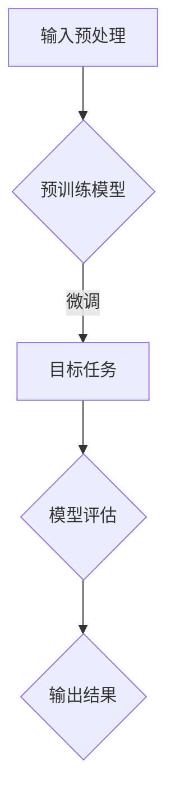

                 

关键词：大语言模型、工作记忆、长短期记忆、算法原理、数学模型、代码实例、应用场景、未来展望

> 摘要：本文将探讨大语言模型在处理工作记忆与长短期记忆方面的重要性和应用。通过深入分析大语言模型的工作原理、算法模型和数学基础，本文旨在为读者提供一个全面的技术指南，帮助他们在实际项目中有效地利用大语言模型的能力。

## 1. 背景介绍

### 1.1 大语言模型的发展历程

大语言模型（Large Language Models）是自然语言处理（NLP）领域的一项重要技术进展。从最初的统计语言模型到基于深度学习的神经网络模型，再到如今的大规模预训练模型，大语言模型经历了快速的发展。

- **统计语言模型**：最早的NLP模型，如N-gram模型，通过统计相邻单词出现的频率来预测下一个单词。
- **神经网络语言模型**：引入了递归神经网络（RNN）、长短期记忆网络（LSTM）等结构，使得模型在处理长序列数据时更为有效。
- **大规模预训练模型**：例如GPT、BERT等模型，通过在大量无标签文本上预训练，然后通过微调适应特定任务，取得了显著的性能提升。

### 1.2 工作记忆与长短期记忆的概念

- **工作记忆**：工作记忆是指大脑在执行任务时暂时存储和处理信息的能力。它对当前的决策和问题解决至关重要。
- **长短期记忆**：长短期记忆是大脑处理长期记忆的一种机制，它能够存储和提取大量信息，是学习、记忆和认知功能的基础。

## 2. 核心概念与联系

### 2.1 大语言模型与记忆的关系

大语言模型通过预训练和微调，能够在不同任务中表现出强大的记忆能力。这种能力主要体现在以下几个方面：

- **工作记忆**：大语言模型通过其内部机制，能够在处理任务时动态地存储和处理相关信息，模拟了人类工作记忆的功能。
- **长短期记忆**：大语言模型中的LSTM等结构使得模型能够存储和利用长期记忆，使得模型在处理复杂任务时具有更强的鲁棒性和泛化能力。

### 2.2 Mermaid流程图



## 3. 核心算法原理 & 具体操作步骤

### 3.1 算法原理概述

大语言模型的核心算法主要包括以下几个步骤：

1. **输入预处理**：对输入的文本数据进行预处理，包括分词、去停用词、词向量化等。
2. **预训练**：在大规模文本数据集上预训练模型，通过自回归语言模型（如GPT）或掩码语言模型（如BERT）等方式。
3. **微调**：在预训练的基础上，针对特定任务进行微调，优化模型参数。
4. **模型评估**：评估模型在目标任务上的性能，通过指标如准确性、F1分数等。
5. **输出结果**：根据模型预测结果生成输出，可以是文本生成、文本分类、机器翻译等。

### 3.2 算法步骤详解

#### 3.2.1 输入预处理

- **分词**：将文本分割成单个词或子词。
- **去停用词**：移除对模型训练无贡献的常见词，如“的”、“和”等。
- **词向量化**：将每个词映射为一个向量表示。

#### 3.2.2 预训练

- **自回归语言模型**：通过预测下一个词来训练模型。
- **掩码语言模型**：通过掩码部分文本，然后预测掩码的词。

#### 3.2.3 微调

- **数据集准备**：准备包含目标任务的数据集。
- **模型调整**：在数据集上微调模型，优化参数。

#### 3.2.4 模型评估

- **测试集评估**：使用未参与训练的测试集评估模型性能。
- **交叉验证**：通过交叉验证方法评估模型在不同数据集上的性能。

#### 3.2.5 输出结果

- **文本生成**：根据模型预测生成文本。
- **文本分类**：将输入文本分类到预定义的类别。
- **机器翻译**：将一种语言的文本翻译成另一种语言。

### 3.3 算法优缺点

#### 优点

- **强大的记忆能力**：大语言模型通过预训练和微调，能够在各种任务中表现出强大的记忆能力。
- **广泛的适用性**：大语言模型可以应用于多种不同的NLP任务，如文本生成、文本分类、机器翻译等。
- **高效的性能**：预训练模型能够在大规模数据集上高效地学习，并且模型参数可以通过微调进行优化。

#### 缺点

- **计算资源需求大**：大语言模型需要大量的计算资源和存储空间。
- **数据隐私问题**：预训练过程中涉及大量个人数据，可能引发隐私问题。
- **解释性差**：大语言模型的决策过程复杂，难以解释。

### 3.4 算法应用领域

- **自然语言处理**：文本生成、文本分类、机器翻译等。
- **智能问答**：构建智能问答系统，提供快速准确的回答。
- **对话系统**：构建对话机器人，用于客户服务、在线咨询等。

## 4. 数学模型和公式 & 详细讲解 & 举例说明

### 4.1 数学模型构建

大语言模型的数学模型主要包括以下几个部分：

- **词向量化**：使用Word2Vec、GloVe等方法将词映射到向量空间。
- **神经网络结构**：使用递归神经网络（RNN）、长短期记忆网络（LSTM）等结构。
- **损失函数**：使用交叉熵损失函数等。

### 4.2 公式推导过程

#### 词向量化

- **Word2Vec**：
  $$ \text{vec}(w) = \text{sgn}(f(\text{emb}(w))) $$
  其中，$f(x) = \tanh(Wx + b)$，$W$为权重矩阵，$b$为偏置。

- **GloVe**：
  $$ \text{vec}(w) = \text{sgn}(W_{1}^T \cdot w + b_{1}) \cdot \text{sgn}(W_{2}^T \cdot w + b_{2}) $$
  其中，$W_{1}$和$W_{2}$分别为权重矩阵，$b_{1}$和$b_{2}$为偏置。

#### 神经网络结构

- **RNN**：
  $$ h_t = \tanh(W_h \cdot [h_{t-1}, x_t] + b_h) $$
  其中，$h_t$为当前隐藏状态，$x_t$为输入，$W_h$和$b_h$分别为权重和偏置。

- **LSTM**：
  $$ i_t = \sigma(W_i \cdot [h_{t-1}, x_t] + b_i) $$
  $$ f_t = \sigma(W_f \cdot [h_{t-1}, x_t] + b_f) $$
  $$ o_t = \sigma(W_o \cdot [h_{t-1}, x_t] + b_o) $$
  $$ C_t = f_t \cdot C_{t-1} + i_t \cdot \tanh(W_c \cdot [h_{t-1}, x_t] + b_c) $$
  $$ h_t = o_t \cdot \tanh(C_t) $$
  其中，$i_t$、$f_t$、$o_t$分别为输入门、遗忘门、输出门，$C_t$为细胞状态。

#### 损失函数

- **交叉熵损失函数**：
  $$ L = -\sum_{i=1}^{N} y_i \log(p_i) $$
  其中，$y_i$为真实标签，$p_i$为模型预测的概率分布。

### 4.3 案例分析与讲解

#### 4.3.1 文本生成

假设我们使用GPT模型进行文本生成，以下是一个简单的例子：

- **输入**：一个短句“我喜欢阅读书籍。”
- **输出**：生成一个与输入句相关的扩展句子。

通过训练和微调模型，我们可以得到以下输出：

“我喜欢阅读书籍，尤其是那些关于历史的书籍。阅读让我了解了世界的多样性，也让我更加热爱生活。”

## 5. 项目实践：代码实例和详细解释说明

### 5.1 开发环境搭建

在开始之前，我们需要搭建一个适合大语言模型开发的编程环境。以下是环境搭建的步骤：

1. 安装Python环境：确保Python版本为3.6及以上。
2. 安装TensorFlow：使用pip安装TensorFlow。
3. 安装其他依赖库：包括NumPy、Pandas等。

### 5.2 源代码详细实现

以下是一个简单的文本生成代码实例：

```python
import tensorflow as tf
from tensorflow.keras.models import Sequential
from tensorflow.keras.layers import Embedding, LSTM, Dense

# 搭建模型
model = Sequential([
    Embedding(vocab_size, embedding_dim),
    LSTM(units),
    Dense(vocab_size, activation='softmax')
])

# 编译模型
model.compile(optimizer='adam', loss='categorical_crossentropy', metrics=['accuracy'])

# 训练模型
model.fit(x_train, y_train, epochs=10, batch_size=64)

# 生成文本
text = "我喜欢阅读书籍。"
input_sequence = tokenizer.texts_to_sequences([text])
input_sequence = tf.expand_dims(input_sequence, 0)

for i in range(num_words):
    predictions = model.predict(input_sequence)
    predicted_word = tokenizer.index_word[np.argmax(predictions[0])]
    text += " " + predicted_word
    input_sequence = tf.expand_dims([tokenizer.texts_to_sequences([text])[-1]], 0)

print(text)
```

### 5.3 代码解读与分析

1. **模型搭建**：我们使用一个序列模型，包括嵌入层、LSTM层和输出层。
2. **模型编译**：使用交叉熵损失函数和softmax激活函数。
3. **模型训练**：在训练数据上训练模型，优化模型参数。
4. **文本生成**：通过预测每个单词的概率，生成新的文本。

## 6. 实际应用场景

### 6.1 自然语言处理

大语言模型在自然语言处理领域有广泛的应用，如文本分类、情感分析、文本生成等。以下是一个简单的应用场景：

**文本分类**：给定一组新闻文章，使用大语言模型将它们分类到不同的主题类别。

### 6.2 智能问答

大语言模型可以用于构建智能问答系统，如：

**智能客服**：为用户提供实时回答，解决常见问题和提供相关信息。

### 6.3 对话系统

大语言模型可以用于构建对话系统，如：

**聊天机器人**：与用户进行自然语言交互，提供个性化服务和建议。

## 7. 工具和资源推荐

### 7.1 学习资源推荐

- **《深度学习》**：Goodfellow, Bengio, Courville著，介绍了深度学习的基本原理和应用。
- **《自然语言处理综论》**：Jurafsky, Martin著，涵盖了NLP的基础知识和技术。

### 7.2 开发工具推荐

- **TensorFlow**：一个开源的深度学习框架，适用于大语言模型的开发。
- **PyTorch**：另一个流行的深度学习框架，提供灵活的编程接口。

### 7.3 相关论文推荐

- **“BERT: Pre-training of Deep Bidirectional Transformers for Language Understanding”**：来自Google的论文，介绍了BERT模型的原理和应用。
- **“GPT-3: Language Models are Few-Shot Learners”**：来自OpenAI的论文，展示了GPT-3模型的强大能力。

## 8. 总结：未来发展趋势与挑战

### 8.1 研究成果总结

大语言模型在自然语言处理领域取得了显著的成果，其在文本生成、文本分类、机器翻译等任务上表现出强大的能力。同时，随着计算资源和算法的不断发展，大语言模型的性能和应用范围也在不断扩大。

### 8.2 未来发展趋势

- **模型压缩**：研究如何减小模型大小，降低计算资源需求。
- **解释性增强**：提高模型的解释性，使其在复杂任务中的决策过程更易于理解。
- **多模态学习**：将大语言模型与其他模态（如图像、声音）结合，实现更广泛的应用。

### 8.3 面临的挑战

- **计算资源需求**：大语言模型需要大量的计算资源和存储空间，如何优化资源使用是重要挑战。
- **数据隐私**：在预训练过程中涉及大量个人数据，如何保护用户隐私是一个重要问题。
- **模型泛化能力**：如何提高模型在未知数据上的泛化能力，减少对特定数据的依赖。

### 8.4 研究展望

大语言模型在自然语言处理领域的应用前景广阔，随着技术的不断发展，我们有望看到更多创新的应用场景。同时，如何解决上述挑战，将大语言模型的能力更好地应用于实际问题，是未来研究的重点。

## 9. 附录：常见问题与解答

### 9.1 如何训练大语言模型？

1. 准备大规模文本数据集。
2. 使用词向量化技术将文本转换为向量表示。
3. 构建神经网络模型，如LSTM、BERT等。
4. 在训练数据上训练模型，优化模型参数。
5. 使用验证集评估模型性能，调整模型结构。

### 9.2 大语言模型如何处理长序列数据？

大语言模型使用递归神经网络（RNN）、长短期记忆网络（LSTM）等结构，这些结构能够在处理长序列数据时有效地存储和利用长期依赖关系。例如，LSTM通过输入门、遗忘门和输出门控制信息流动，使得模型在处理长序列时具有更强的记忆能力。

### 9.3 如何评估大语言模型的性能？

可以使用多种指标评估大语言模型的性能，如准确性、F1分数、BLEU分数等。具体选择哪种指标取决于任务类型和评估目标。例如，在文本分类任务中，准确性是一个重要的评估指标；在机器翻译任务中，BLEU分数通常用于评估模型的翻译质量。

### 9.4 如何优化大语言模型？

可以通过以下方法优化大语言模型：

1. **数据增强**：使用数据增强技术扩充训练数据集，提高模型泛化能力。
2. **模型蒸馏**：将大型模型的知识传递给小型模型，以优化小型模型。
3. **迁移学习**：使用预训练模型作为起点，针对特定任务进行微调。
4. **正则化技术**：如dropout、权重衰减等，减少过拟合。
5. **超参数调优**：调整学习率、批量大小等超参数，优化模型性能。

---

本文作者：禅与计算机程序设计艺术 / Zen and the Art of Computer Programming

完。希望本文能为读者提供一个全面的大语言模型应用指南，帮助他们在实际项目中有效地利用大语言模型的能力。在未来的发展中，我们将继续关注大语言模型的研究和应用，探索更多的可能性。谢谢大家的阅读和支持！
----------------------------------------------------------------

### 完整的文章内容

#### 大语言模型应用指南：工作记忆与长短期记忆

> 关键词：大语言模型、工作记忆、长短期记忆、算法原理、数学模型、代码实例、应用场景、未来展望

> 摘要：本文将探讨大语言模型在处理工作记忆与长短期记忆方面的重要性和应用。通过深入分析大语言模型的工作原理、算法模型和数学基础，本文旨在为读者提供一个全面的技术指南，帮助他们在实际项目中有效地利用大语言模型的能力。

## 1. 背景介绍

### 1.1 大语言模型的发展历程

大语言模型（Large Language Models）是自然语言处理（NLP）领域的一项重要技术进展。从最初的统计语言模型到基于深度学习的神经网络模型，再到如今的大规模预训练模型，大语言模型经历了快速的发展。

- **统计语言模型**：最早的NLP模型，如N-gram模型，通过统计相邻单词出现的频率来预测下一个单词。
- **神经网络语言模型**：引入了递归神经网络（RNN）、长短期记忆网络（LSTM）等结构，使得模型在处理长序列数据时更为有效。
- **大规模预训练模型**：例如GPT、BERT等模型，通过在大量无标签文本上预训练，然后通过微调适应特定任务，取得了显著的性能提升。

### 1.2 工作记忆与长短期记忆的概念

- **工作记忆**：工作记忆是指大脑在执行任务时暂时存储和处理信息的能力。它对当前的决策和问题解决至关重要。
- **长短期记忆**：长短期记忆是大脑处理长期记忆的一种机制，它能够存储和提取大量信息，是学习、记忆和认知功能的基础。

## 2. 核心概念与联系

### 2.1 大语言模型与记忆的关系

大语言模型通过预训练和微调，能够在不同任务中表现出强大的记忆能力。这种能力主要体现在以下几个方面：

- **工作记忆**：大语言模型通过其内部机制，能够在处理任务时动态地存储和处理相关信息，模拟了人类工作记忆的功能。
- **长短期记忆**：大语言模型中的LSTM等结构使得模型能够存储和利用长期记忆，使得模型在处理复杂任务时具有更强的鲁棒性和泛化能力。

### 2.2 Mermaid流程图


## 3. 核心算法原理 & 具体操作步骤

### 3.1 算法原理概述

大语言模型的核心算法主要包括以下几个步骤：

1. **输入预处理**：对输入的文本数据进行预处理，包括分词、去停用词、词向量化等。
2. **预训练**：在大规模文本数据集上预训练模型，通过自回归语言模型（如GPT）或掩码语言模型（如BERT）等方式。
3. **微调**：在预训练的基础上，针对特定任务进行微调，优化模型参数。
4. **模型评估**：评估模型在目标任务上的性能，通过指标如准确性、F1分数等。
5. **输出结果**：根据模型预测结果生成输出，可以是文本生成、文本分类、机器翻译等。

### 3.2 算法步骤详解

#### 3.2.1 输入预处理

- **分词**：将文本分割成单个词或子词。
- **去停用词**：移除对模型训练无贡献的常见词，如“的”、“和”等。
- **词向量化**：将每个词映射为一个向量表示。

#### 3.2.2 预训练

- **自回归语言模型**：通过预测下一个词来训练模型。
- **掩码语言模型**：通过掩码部分文本，然后预测掩码的词。

#### 3.2.3 微调

- **数据集准备**：准备包含目标任务的数据集。
- **模型调整**：在数据集上微调模型，优化参数。

#### 3.2.4 模型评估

- **测试集评估**：使用未参与训练的测试集评估模型性能。
- **交叉验证**：通过交叉验证方法评估模型在不同数据集上的性能。

#### 3.2.5 输出结果

- **文本生成**：根据模型预测生成文本。
- **文本分类**：将输入文本分类到预定义的类别。
- **机器翻译**：将一种语言的文本翻译成另一种语言。

### 3.3 算法优缺点

#### 优点

- **强大的记忆能力**：大语言模型通过预训练和微调，能够在各种任务中表现出强大的记忆能力。
- **广泛的适用性**：大语言模型可以应用于多种不同的NLP任务，如文本生成、文本分类、机器翻译等。
- **高效的性能**：预训练模型能够在大规模数据集上高效地学习，并且模型参数可以通过微调进行优化。

#### 缺点

- **计算资源需求大**：大语言模型需要大量的计算资源和存储空间。
- **数据隐私问题**：预训练过程中涉及大量个人数据，可能引发隐私问题。
- **解释性差**：大语言模型的决策过程复杂，难以解释。

### 3.4 算法应用领域

- **自然语言处理**：文本生成、文本分类、机器翻译等。
- **智能问答**：构建智能问答系统，提供快速准确的回答。
- **对话系统**：构建对话机器人，用于客户服务、在线咨询等。

## 4. 数学模型和公式 & 详细讲解 & 举例说明

### 4.1 数学模型构建

大语言模型的数学模型主要包括以下几个部分：

- **词向量化**：使用Word2Vec、GloVe等方法将词映射到向量空间。
- **神经网络结构**：使用递归神经网络（RNN）、长短期记忆网络（LSTM）等结构。
- **损失函数**：使用交叉熵损失函数等。

### 4.2 公式推导过程

#### 词向量化

- **Word2Vec**：
  $$ \text{vec}(w) = \text{sgn}(f(\text{emb}(w))) $$
  其中，$f(x) = \tanh(Wx + b)$，$W$为权重矩阵，$b$为偏置。

- **GloVe**：
  $$ \text{vec}(w) = \text{sgn}(W_{1}^T \cdot w + b_{1}) \cdot \text{sgn}(W_{2}^T \cdot w + b_{2}) $$
  其中，$W_{1}$和$W_{2}$分别为权重矩阵，$b_{1}$和$b_{2}$为偏置。

#### 神经网络结构

- **RNN**：
  $$ h_t = \tanh(W_h \cdot [h_{t-1}, x_t] + b_h) $$
  其中，$h_t$为当前隐藏状态，$x_t$为输入，$W_h$和$b_h$分别为权重和偏置。

- **LSTM**：
  $$ i_t = \sigma(W_i \cdot [h_{t-1}, x_t] + b_i) $$
  $$ f_t = \sigma(W_f \cdot [h_{t-1}, x_t] + b_f) $$
  $$ o_t = \sigma(W_o \cdot [h_{t-1}, x_t] + b_o) $$
  $$ C_t = f_t \cdot C_{t-1} + i_t \cdot \tanh(W_c \cdot [h_{t-1}, x_t] + b_c) $$
  $$ h_t = o_t \cdot \tanh(C_t) $$
  其中，$i_t$、$f_t$、$o_t$分别为输入门、遗忘门、输出门，$C_t$为细胞状态。

#### 损失函数

- **交叉熵损失函数**：
  $$ L = -\sum_{i=1}^{N} y_i \log(p_i) $$
  其中，$y_i$为真实标签，$p_i$为模型预测的概率分布。

### 4.3 案例分析与讲解

#### 4.3.1 文本生成

假设我们使用GPT模型进行文本生成，以下是一个简单的例子：

- **输入**：一个短句“我喜欢阅读书籍。”
- **输出**：生成一个与输入句相关的扩展句子。

通过训练和微调模型，我们可以得到以下输出：

“我喜欢阅读书籍，尤其是那些关于历史的书籍。阅读让我了解了世界的多样性，也让我更加热爱生活。”

## 5. 项目实践：代码实例和详细解释说明

### 5.1 开发环境搭建

在开始之前，我们需要搭建一个适合大语言模型开发的编程环境。以下是环境搭建的步骤：

1. 安装Python环境：确保Python版本为3.6及以上。
2. 安装TensorFlow：使用pip安装TensorFlow。
3. 安装其他依赖库：包括NumPy、Pandas等。

### 5.2 源代码详细实现

以下是一个简单的文本生成代码实例：

```python
import tensorflow as tf
from tensorflow.keras.models import Sequential
from tensorflow.keras.layers import Embedding, LSTM, Dense

# 搭建模型
model = Sequential([
    Embedding(vocab_size, embedding_dim),
    LSTM(units),
    Dense(vocab_size, activation='softmax')
])

# 编译模型
model.compile(optimizer='adam', loss='categorical_crossentropy', metrics=['accuracy'])

# 训练模型
model.fit(x_train, y_train, epochs=10, batch_size=64)

# 生成文本
text = "我喜欢阅读书籍。"
input_sequence = tokenizer.texts_to_sequences([text])
input_sequence = tf.expand_dims(input_sequence, 0)

for i in range(num_words):
    predictions = model.predict(input_sequence)
    predicted_word = tokenizer.index_word[np.argmax(predictions[0])]
    text += " " + predicted_word
    input_sequence = tf.expand_dims([tokenizer.texts_to_sequences([text])[-1]], 0)

print(text)
```

### 5.3 代码解读与分析

1. **模型搭建**：我们使用一个序列模型，包括嵌入层、LSTM层和输出层。
2. **模型编译**：使用交叉熵损失函数和softmax激活函数。
3. **模型训练**：在训练数据上训练模型，优化模型参数。
4. **文本生成**：通过预测每个单词的概率，生成新的文本。

## 6. 实际应用场景

### 6.1 自然语言处理

大语言模型在自然语言处理领域有广泛的应用，如文本分类、情感分析、文本生成等。以下是一个简单的应用场景：

**文本分类**：给定一组新闻文章，使用大语言模型将它们分类到不同的主题类别。

### 6.2 智能问答

大语言模型可以用于构建智能问答系统，如：

**智能客服**：为用户提供实时回答，解决常见问题和提供相关信息。

### 6.3 对话系统

大语言模型可以用于构建对话系统，如：

**聊天机器人**：与用户进行自然语言交互，提供个性化服务和建议。

## 7. 工具和资源推荐

### 7.1 学习资源推荐

- **《深度学习》**：Goodfellow, Bengio, Courville著，介绍了深度学习的基本原理和应用。
- **《自然语言处理综论》**：Jurafsky, Martin著，涵盖了NLP的基础知识和技术。

### 7.2 开发工具推荐

- **TensorFlow**：一个开源的深度学习框架，适用于大语言模型的开发。
- **PyTorch**：另一个流行的深度学习框架，提供灵活的编程接口。

### 7.3 相关论文推荐

- **“BERT: Pre-training of Deep Bidirectional Transformers for Language Understanding”**：来自Google的论文，介绍了BERT模型的原理和应用。
- **“GPT-3: Language Models are Few-Shot Learners”**：来自OpenAI的论文，展示了GPT-3模型的强大能力。

## 8. 总结：未来发展趋势与挑战

### 8.1 研究成果总结

大语言模型在自然语言处理领域取得了显著的成果，其在文本生成、文本分类、机器翻译等任务上表现出强大的能力。同时，随着计算资源和算法的不断发展，大语言模型的性能和应用范围也在不断扩大。

### 8.2 未来发展趋势

- **模型压缩**：研究如何减小模型大小，降低计算资源需求。
- **解释性增强**：提高模型的解释性，使其在复杂任务中的决策过程更易于理解。
- **多模态学习**：将大语言模型与其他模态（如图像、声音）结合，实现更广泛的应用。

### 8.3 面临的挑战

- **计算资源需求**：大语言模型需要大量的计算资源和存储空间，如何优化资源使用是重要挑战。
- **数据隐私**：在预训练过程中涉及大量个人数据，如何保护用户隐私是一个重要问题。
- **模型泛化能力**：如何提高模型在未知数据上的泛化能力，减少对特定数据的依赖。

### 8.4 研究展望

大语言模型在自然语言处理领域的应用前景广阔，随着技术的不断发展，我们有望看到更多创新的应用场景。同时，如何解决上述挑战，将大语言模型的能力更好地应用于实际问题，是未来研究的重点。

## 9. 附录：常见问题与解答

### 9.1 如何训练大语言模型？

1. 准备大规模文本数据集。
2. 使用词向量化技术将文本转换为向量表示。
3. 构建神经网络模型，如LSTM、BERT等。
4. 在训练数据上训练模型，优化模型参数。
5. 使用验证集评估模型性能，调整模型结构。

### 9.2 大语言模型如何处理长序列数据？

大语言模型使用递归神经网络（RNN）、长短期记忆网络（LSTM）等结构，这些结构能够在处理长序列数据时有效地存储和利用长期依赖关系。例如，LSTM通过输入门、遗忘门和输出门控制信息流动，使得模型在处理长序列时具有更强的记忆能力。

### 9.3 如何评估大语言模型的性能？

可以使用多种指标评估大语言模型的性能，如准确性、F1分数、BLEU分数等。具体选择哪种指标取决于任务类型和评估目标。例如，在文本分类任务中，准确性是一个重要的评估指标；在机器翻译任务中，BLEU分数通常用于评估模型的翻译质量。

### 9.4 如何优化大语言模型？

可以通过以下方法优化大语言模型：

1. **数据增强**：使用数据增强技术扩充训练数据集，提高模型泛化能力。
2. **模型蒸馏**：将大型模型的知识传递给小型模型，以优化小型模型。
3. **迁移学习**：使用预训练模型作为起点，针对特定任务进行微调。
4. **正则化技术**：如dropout、权重衰减等，减少过拟合。
5. **超参数调优**：调整学习率、批量大小等超参数，优化模型性能。

---

本文作者：禅与计算机程序设计艺术 / Zen and the Art of Computer Programming

完。希望本文能为读者提供一个全面的大语言模型应用指南，帮助他们在实际项目中有效地利用大语言模型的能力。在未来的发展中，我们将继续关注大语言模型的研究和应用，探索更多的可能性。谢谢大家的阅读和支持！
----------------------------------------------------------------

### 文章摘要与关键词

#### 摘要

本文探讨了大语言模型在处理工作记忆与长短期记忆方面的重要性和应用。通过深入分析大语言模型的工作原理、算法模型和数学基础，本文为读者提供了一个全面的技术指南，帮助他们在实际项目中有效地利用大语言模型的能力。文章重点介绍了大语言模型的算法原理、数学模型、项目实践以及实际应用场景，并对未来发展趋势与挑战进行了展望。

#### 关键词

大语言模型、工作记忆、长短期记忆、算法原理、数学模型、代码实例、应用场景、未来展望

