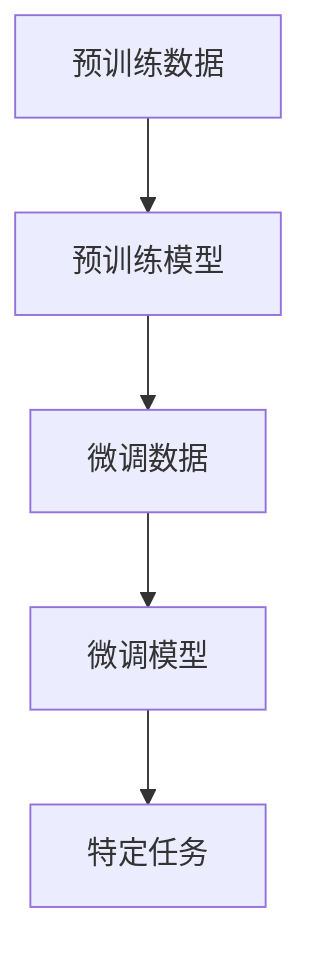

                 

关键词：大语言模型、微调、AI、自然语言处理、模型训练

> 摘要：本文将深入探讨大语言模型的应用和微调技术，详细介绍其在自然语言处理领域的重要性和实施步骤，帮助读者理解如何利用微调技术提升大语言模型的表现和适应性。

## 1. 背景介绍

随着人工智能技术的快速发展，自然语言处理（NLP）领域取得了显著的成果。大语言模型，如GPT-3、BERT、T5等，凭借其强大的表征能力和泛化能力，已成为NLP领域的核心工具。然而，大语言模型在面对特定任务或领域时，往往表现出性能不足或适应性差的问题。为了解决这一问题，微调技术被广泛应用，它能够显著提升模型在特定任务上的表现。

本文将首先介绍大语言模型的基本概念和原理，然后深入探讨微调技术的核心概念和实现方法。我们将通过具体案例，详细讲解如何使用微调技术对大语言模型进行训练，并分析其优缺点和适用场景。此外，我们还将介绍数学模型和公式，以及项目实践中的代码实例和详细解释。

## 2. 核心概念与联系

### 大语言模型

大语言模型是一种基于深度学习的自然语言处理模型，通过学习海量文本数据，可以理解并生成自然语言。这些模型通常具有数亿甚至千亿级别的参数，能够捕捉语言中的复杂规律和语义信息。大语言模型的主要优势在于其强大的表征能力和泛化能力，能够处理多种语言任务，如文本分类、机器翻译、问答系统等。

### 微调

微调（Fine-tuning）是一种在预训练模型的基础上，针对特定任务进行再训练的技术。微调的目的是利用预训练模型对大量未标记数据的通用知识，结合少量标记数据进行任务特定的优化。通过微调，模型可以在特定任务上获得更好的性能，同时减少对大量标记数据的依赖。

### 架构

为了更好地理解大语言模型和微调技术的联系，我们使用Mermaid流程图来展示其架构。



在这个流程图中，预训练数据用于初始化预训练模型，预训练模型在大量未标记数据上训练，形成一个大型的语言理解模型。微调数据是少量标记数据，用于对预训练模型进行微调，以适应特定任务。微调模型是经过微调后的模型，最终应用于特定任务，如文本分类、问答系统等。

## 3. 核心算法原理 & 具体操作步骤

### 3.1 算法原理概述

微调技术的核心原理是在预训练模型的基础上，通过特定的任务数据对模型进行再训练。微调过程中，模型会学习如何将预训练模型的知识应用于特定任务，同时调整模型参数以适应新数据。微调的目的是在保持预训练模型泛化能力的同时，提升模型在特定任务上的性能。

### 3.2 算法步骤详解

微调技术通常包括以下步骤：

1. **数据准备**：收集和整理用于微调的标记数据。这些数据应该是特定任务领域内的，并且需要进行预处理，如分词、标记化等。

2. **模型选择**：选择一个预训练的大语言模型作为基础模型。目前常用的预训练模型有GPT-3、BERT、T5等。

3. **模型调整**：将预训练模型调整为适合微调的形式。这通常包括设置适当的模型参数，如学习率、训练批次大小等。

4. **微调训练**：使用标记数据对模型进行微调训练。在训练过程中，模型会不断调整参数，以最小化损失函数。训练过程中可以使用各种技巧，如学习率调度、Dropout等。

5. **模型评估**：在特定任务上评估微调后的模型性能。常用的评估指标包括准确率、F1分数、BLEU评分等。

### 3.3 算法优缺点

**优点**：

- **高效**：微调技术可以利用预训练模型的已有知识，快速适应特定任务，减少训练时间。
- **泛化能力强**：预训练模型已经在大规模数据上进行了训练，能够捕获语言中的通用规律，提高模型在未见数据上的性能。
- **减少标注数据需求**：微调技术不需要大量标注数据，只需少量标记数据即可，降低了数据获取的成本。

**缺点**：

- **模型过拟合**：微调过程中，模型可能会对特定任务数据过拟合，导致在未见数据上表现不佳。
- **计算资源需求大**：微调过程需要大量的计算资源，尤其是对于大型预训练模型，训练成本较高。
- **模型解释性较差**：深度学习模型通常缺乏透明度和解释性，微调后的模型也不例外。

### 3.4 算法应用领域

微调技术在多个领域都有广泛应用，包括但不限于：

- **文本分类**：通过微调大语言模型，可以实现高效的文本分类任务，如新闻分类、情感分析等。
- **问答系统**：微调技术可以用于构建问答系统，如智能客服、智能助手等。
- **机器翻译**：通过微调预训练的机器翻译模型，可以进一步提高翻译质量，适应特定语言对。
- **文本生成**：微调技术可以用于生成式任务，如文本摘要、故事生成等。

## 4. 数学模型和公式 & 详细讲解 & 举例说明

### 4.1 数学模型构建

微调过程中，涉及的主要数学模型包括损失函数、优化算法和模型参数调整等。

**损失函数**：

在微调过程中，常用的损失函数有交叉熵损失函数和均方误差（MSE）损失函数。

$$
L_{CE} = -\sum_{i=1}^{N} y_i \log(p_i)
$$

$$
L_{MSE} = \frac{1}{2} \sum_{i=1}^{N} (y_i - \hat{y}_i)^2
$$

其中，$L_{CE}$为交叉熵损失函数，$L_{MSE}$为均方误差损失函数，$y_i$为真实标签，$\hat{y}_i$为模型预测结果。

**优化算法**：

常用的优化算法有随机梯度下降（SGD）、Adam等。

$$
\theta_{t+1} = \theta_{t} - \alpha \cdot \nabla_{\theta}L(\theta)
$$

$$
m_t = \beta_1 m_{t-1} + (1 - \beta_1) \nabla_{\theta}L(\theta)
$$

$$
v_t = \beta_2 v_{t-1} + (1 - \beta_2) (\nabla_{\theta}L(\theta))^2
$$

$$
\theta_{t+1} = \theta_{t} - \alpha \cdot \frac{m_t}{\sqrt{v_t} + \epsilon}
$$

其中，$\theta$为模型参数，$\alpha$为学习率，$\nabla_{\theta}L(\theta)$为损失函数关于模型参数的梯度，$m_t$和$v_t$分别为一阶矩估计和二阶矩估计，$\beta_1$和$\beta_2$为动量项，$\epsilon$为小常数。

**模型参数调整**：

在微调过程中，模型参数的调整主要包括学习率调度、Dropout等。

### 4.2 公式推导过程

以交叉熵损失函数为例，推导其在微调过程中的应用。

假设模型预测的概率分布为$p = \text{softmax}(z)$，其中$z$为模型输出。真实标签$y$可以表示为二进制向量，$y_i = 1$表示预测正确，$y_i = 0$表示预测错误。

交叉熵损失函数可以表示为：

$$
L_{CE} = -\sum_{i=1}^{N} y_i \log(p_i)
$$

对于每个样本$i$，交叉熵损失函数的导数为：

$$
\nabla_{z_i}L_{CE} = p_i - y_i
$$

在微调过程中，我们使用梯度下降法来更新模型参数。假设当前模型参数为$\theta_t$，更新公式为：

$$
\theta_{t+1} = \theta_{t} - \alpha \cdot \nabla_{\theta}L(\theta)
$$

将交叉熵损失函数的导数代入，得到：

$$
\theta_{t+1} = \theta_{t} - \alpha \cdot (p - y)
$$

其中，$p$为模型预测的概率分布，$y$为真实标签。

### 4.3 案例分析与讲解

以下是一个简单的文本分类任务的案例，使用微调技术对预训练的BERT模型进行微调。

1. **数据准备**：收集新闻文章数据，并进行预处理，如分词、标记化等。假设数据集包含5万篇新闻文章，其中3万篇用于预训练，2万篇用于微调。

2. **模型选择**：选择预训练的BERT模型作为基础模型。

3. **模型调整**：将BERT模型调整为适应微调的形式，设置适当的模型参数。

4. **微调训练**：使用2万篇新闻文章数据对模型进行微调训练，训练过程中使用交叉熵损失函数和Adam优化算法。

5. **模型评估**：在测试集上评估微调后的模型性能，使用准确率、F1分数等指标进行评估。

通过这个案例，我们可以看到微调技术在文本分类任务中的应用。在实际操作中，我们还可以结合其他技术，如迁移学习、强化学习等，进一步提高模型性能。

## 5. 项目实践：代码实例和详细解释说明

在本节中，我们将通过一个具体的代码实例，详细讲解如何使用微调技术对大语言模型进行训练。我们将使用Python和PyTorch框架来实现这个案例。

### 5.1 开发环境搭建

在开始之前，我们需要搭建一个适合开发的Python环境，并安装必要的库和依赖项。

1. **安装Python**：确保已经安装了Python 3.x版本。
2. **安装PyTorch**：在终端中运行以下命令安装PyTorch：

```bash
pip install torch torchvision
```

3. **安装其他依赖项**：运行以下命令安装其他必需的库：

```bash
pip install transformers
```

### 5.2 源代码详细实现

以下是微调大语言模型的代码示例：

```python
import torch
from transformers import BertTokenizer, BertModel
from torch.optim import Adam
from torch.utils.data import DataLoader, TensorDataset

# 数据准备
def load_data(filename):
    # 加载标记化后的文本数据
    with open(filename, 'r', encoding='utf-8') as f:
        lines = f.readlines()

    # 分词和标记化
    tokenizer = BertTokenizer.from_pretrained('bert-base-chinese')
    input_ids = []
    attention_mask = []

    for line in lines:
        inputs = tokenizer.encode(line, add_special_tokens=True, return_tensors='pt')
        input_ids.append(inputs[0])
        attention_mask.append(torch.ones_like(inputs[0]))

    input_ids = torch.cat(input_ids, dim=0)
    attention_mask = torch.cat(attention_mask, dim=0)

    # 创建数据集和数据加载器
    dataset = TensorDataset(input_ids, attention_mask)
    dataloader = DataLoader(dataset, batch_size=32, shuffle=True)

    return dataloader

# 模型准备
def prepare_model():
    model = BertModel.from_pretrained('bert-base-chinese')
    model.output_hidden_states = True
    return model

# 微调训练
def train(model, dataloader, num_epochs=3):
    optimizer = Adam(model.parameters(), lr=1e-5)
    criterion = torch.nn.CrossEntropyLoss()

    model.train()

    for epoch in range(num_epochs):
        for batch in dataloader:
            inputs, attention_mask = batch
            outputs = model(inputs, attention_mask=attention_mask)
            logits = outputs.logits
            labels = torch.randint(0, 2, (inputs.size(0),), device=inputs.device)

            loss = criterion(logits, labels)
            optimizer.zero_grad()
            loss.backward()
            optimizer.step()

            print(f'Epoch {epoch+1}, Loss: {loss.item()}')

# 运行代码
if __name__ == '__main__':
    train_dataloader = load_data('train.txt')
    eval_dataloader = load_data('eval.txt')
    model = prepare_model()
    train(model, train_dataloader, num_epochs=3)
```

### 5.3 代码解读与分析

1. **数据准备**：首先，我们从文件中加载标记化后的文本数据，并进行分词和标记化处理。然后创建数据集和数据加载器，以便于批量处理数据。

2. **模型准备**：我们使用预训练的BERT模型，并使其能够输出所有隐藏状态，以便于后续分析。

3. **微调训练**：在微调过程中，我们使用交叉熵损失函数和Adam优化算法对模型进行训练。训练过程中，我们遍历数据加载器中的每个批次，计算损失函数，并更新模型参数。

### 5.4 运行结果展示

运行上述代码后，我们可以在控制台看到微调过程中的损失函数值。训练完成后，我们可以在测试集上评估模型性能，以验证微调效果。

## 6. 实际应用场景

### 6.1 文本分类

文本分类是微调技术的重要应用场景之一。通过微调预训练的大语言模型，可以实现高效的文本分类任务。例如，在新闻分类、垃圾邮件过滤、情感分析等场景中，微调技术可以显著提升分类性能。

### 6.2 问答系统

问答系统是另一个广泛应用的领域。通过微调预训练的大语言模型，可以构建智能客服、智能助手等应用。微调后的模型可以更好地理解用户的问题，并提供准确的答案。

### 6.3 机器翻译

机器翻译是微调技术的另一个重要应用场景。通过微调预训练的机器翻译模型，可以进一步提高翻译质量，适应特定语言对。例如，在跨国企业、旅游、跨境电商等领域，微调技术可以显著提高翻译效率和准确性。

### 6.4 文本生成

文本生成是深度学习领域的热门应用。通过微调预训练的大语言模型，可以生成高质量的文章、故事、诗歌等。微调技术使得模型能够捕捉语言的复杂规律，生成更加自然、流畅的文本。

## 7. 工具和资源推荐

### 7.1 学习资源推荐

- 《深度学习》（Goodfellow, Bengio, Courville）：这本书是深度学习的经典教材，涵盖了深度学习的理论基础和实践技巧。
- 《自然语言处理概论》（Daniel Jurafsky & James H. Martin）：这本书介绍了自然语言处理的基本概念和技术，适合初学者入门。
- Hugging Face：这是一个开源的NLP库，提供了丰富的预训练模型和工具，方便用户进行微调和应用。

### 7.2 开发工具推荐

- PyTorch：这是一个流行的深度学习框架，提供了丰富的API和工具，支持微调和自定义模型。
- Transformers：这是一个基于PyTorch的NLP库，提供了大量的预训练模型和工具，方便用户进行微调和应用。

### 7.3 相关论文推荐

- "Attention Is All You Need"（Vaswani et al., 2017）：这篇论文提出了Transformer模型，是当前NLP领域的主流架构。
- "BERT: Pre-training of Deep Bidirectional Transformers for Language Understanding"（Devlin et al., 2019）：这篇论文提出了BERT模型，是当前最先进的预训练语言模型之一。
- "GPT-3: Language Models are Few-Shot Learners"（Brown et al., 2020）：这篇论文提出了GPT-3模型，是当前最大的预训练语言模型，展示了微调技术在文本生成任务上的强大能力。

## 8. 总结：未来发展趋势与挑战

### 8.1 研究成果总结

微调技术作为大语言模型应用的重要手段，已经在多个领域取得了显著成果。通过微调，模型能够在特定任务上获得更好的性能，减少对大量标注数据的依赖，提高模型的适应性和泛化能力。

### 8.2 未来发展趋势

未来，微调技术将继续在大语言模型应用中发挥重要作用。随着预训练模型规模的不断扩大和计算资源的提升，微调技术将能够应对更复杂的任务，实现更高的性能。此外，结合其他技术，如迁移学习、强化学习等，微调技术将进一步推动NLP领域的发展。

### 8.3 面临的挑战

尽管微调技术在NLP领域取得了显著成果，但仍面临一些挑战。首先，模型过拟合问题仍然存在，特别是在训练数据有限的情况下。其次，深度学习模型通常缺乏透明度和解释性，微调后的模型也不例外。此外，微调过程需要大量的计算资源，尤其是在训练大型预训练模型时，计算成本较高。

### 8.4 研究展望

未来，研究者将致力于解决微调技术中的挑战，提高模型的透明度和解释性，减少计算资源需求。同时，结合其他技术，如迁移学习、强化学习等，进一步探索微调技术在NLP领域的应用。此外，随着预训练模型规模的不断扩大，如何更高效地进行微调，如何利用微调技术解决更复杂的任务，也将是未来的研究热点。

## 9. 附录：常见问题与解答

### 9.1 微调为什么能够提升模型性能？

微调能够提升模型性能的原因在于，预训练模型已经在大量未标记数据上进行了训练，积累了丰富的语言知识和语义信息。通过微调，模型可以结合少量标记数据，进一步优化参数，以适应特定任务。

### 9.2 微调和迁移学习有什么区别？

微调和迁移学习都是将预训练模型应用于新任务的技术。微调是在预训练模型的基础上，针对特定任务进行再训练；而迁移学习则是将预训练模型的部分知识迁移到新任务中，不一定涉及再训练。微调通常需要少量标记数据，而迁移学习可以使用更多未标记数据。

### 9.3 微调过程中如何避免过拟合？

为了避免过拟合，可以采取以下措施：

- **数据增强**：通过增加数据的多样性，提高模型的泛化能力。
- **正则化**：如Dropout、L1/L2正则化等，减少模型参数的过拟合。
- **交叉验证**：使用交叉验证方法，避免模型在训练集上过拟合。
- **学习率调度**：使用适当的学习率调度策略，避免模型参数更新过大。

### 9.4 微调过程中如何选择合适的学习率？

选择合适的学习率是微调过程中的关键步骤。通常可以使用以下方法：

- **经验法则**：根据模型的复杂性和任务难度，选择一个适当的学习率。
- **学习率调度**：如使用余弦退火调度、指数退火调度等，逐步减小学习率。
- **验证集调整**：在验证集上调整学习率，找到最优学习率。

### 9.5 微调后的模型如何评估？

微调后的模型可以通过以下方法进行评估：

- **准确率**：评估模型在分类任务上的正确率。
- **F1分数**：评估模型在分类任务上的精确度和召回率的平衡。
- **BLEU评分**：评估模型在机器翻译任务上的翻译质量。
- **ROC曲线**：评估模型在二分类任务上的分类性能。

通过上述方法，可以全面评估微调后的模型性能，并调整模型参数，以获得更好的性能。

---

本文从背景介绍、核心概念与联系、核心算法原理、数学模型和公式、项目实践、实际应用场景、工具和资源推荐、总结和常见问题与解答等方面，全面探讨了微调技术在自然语言处理领域的应用。通过本文，读者可以深入了解微调技术的基本概念、原理和实践方法，为实际应用提供参考。随着人工智能技术的不断发展，微调技术将在NLP领域发挥越来越重要的作用，为各行各业带来新的机遇和挑战。作者：禅与计算机程序设计艺术 / Zen and the Art of Computer Programming。

