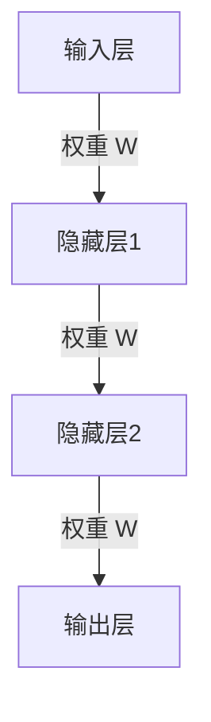

                 

关键词：大语言模型，神经网络，应用指南，深度学习，人工智能，编程，算法

> 摘要：本文将深入探讨大语言模型的基础知识，包括神经网络的架构、原理以及其在不同领域的应用。通过详细的讲解和实例分析，读者将了解如何构建和优化大语言模型，为实际项目提供技术支持。

## 1. 背景介绍

随着人工智能技术的迅速发展，大语言模型已经成为自然语言处理（NLP）领域的关键工具。从早期的统计模型到现代的深度学习模型，语言模型的发展经历了多个阶段。然而，大语言模型的实现依赖于神经网络的强大能力。本文旨在为读者提供一份全面的大语言模型应用指南，从神经网络的基础知识开始，深入探讨其核心概念和实现方法。

## 2. 核心概念与联系

在深入讨论大语言模型之前，我们需要了解其核心组成部分：神经网络。神经网络是一种模拟人脑工作的计算模型，由大量相互连接的神经元组成。下面是一个简化的神经网络架构图，展示了神经元之间的连接关系。



在这个架构中，输入层接收外部输入，通过一系列的隐藏层进行处理，最终由输出层生成结果。神经网络的训练过程就是不断调整这些权重，使其能够更准确地映射输入到输出。

### 2.1 神经元与激活函数

神经元是神经网络的基本构建块，每个神经元都接收来自其他神经元的输入，并产生一个输出。神经元的输出通常通过一个激活函数进行非线性变换，以引入非线性特性。常见的激活函数包括：

- Sigmoid 函数：\( f(x) = \frac{1}{1 + e^{-x}} \)
- 双曲正切函数（Tanh）：\( f(x) = \frac{e^x - e^{-x}}{e^x + e^{-x}} \)
-ReLU 函数：\( f(x) = \max(0, x) \)

### 2.2 前向传播与反向传播

神经网络的训练过程主要包括前向传播和反向传播两个阶段。前向传播是指将输入数据通过神经网络，从输入层传递到输出层，得到预测结果。反向传播则是根据预测结果与真实结果的差异，反向调整网络中的权重。

## 3. 核心算法原理 & 具体操作步骤

### 3.1 算法原理概述

大语言模型的训练通常基于深度学习框架，如TensorFlow或PyTorch。以下是构建大语言模型的基本步骤：

1. **数据预处理**：包括文本的分词、去停用词、词向量编码等。
2. **构建模型**：定义神经网络结构，包括输入层、隐藏层和输出层。
3. **训练模型**：使用训练数据，通过前向传播和反向传播不断调整权重。
4. **评估模型**：使用验证数据评估模型性能。
5. **模型优化**：根据评估结果调整模型参数，如学习率、正则化等。

### 3.2 算法步骤详解

#### 3.2.1 数据预处理

数据预处理是构建大语言模型的第一步。对于文本数据，我们需要进行以下操作：

- **分词**：将文本分解为单词或子词。
- **去停用词**：去除常用的无意义词汇，如“的”、“了”等。
- **词向量编码**：将单词转换为数值向量，如使用Word2Vec或GloVe算法。

#### 3.2.2 构建模型

构建神经网络模型通常包括以下步骤：

- **定义输入层**：输入层接收词向量编码后的文本数据。
- **定义隐藏层**：添加一个或多个隐藏层，每个隐藏层由多个神经元组成。
- **定义输出层**：输出层产生模型预测结果，如单词的概率分布。

#### 3.2.3 训练模型

训练模型是通过反向传播算法不断调整权重的过程。具体步骤如下：

1. **前向传播**：将输入数据通过神经网络，得到预测结果。
2. **计算损失**：计算预测结果与真实结果之间的差异，即损失函数。
3. **反向传播**：根据损失函数，反向计算权重梯度。
4. **更新权重**：使用梯度下降或其他优化算法更新权重。

#### 3.2.4 评估模型

训练完成后，我们需要使用验证数据评估模型性能。常用的评估指标包括准确率、召回率、F1分数等。

### 3.3 算法优缺点

#### 优点

- **强大的表达力**：神经网络可以处理复杂的非线性问题。
- **自动特征提取**：通过训练，神经网络可以自动提取输入数据的特征。
- **适用范围广**：可以应用于各种NLP任务，如文本分类、命名实体识别、机器翻译等。

#### 缺点

- **计算成本高**：训练深度神经网络需要大量计算资源和时间。
- **对数据依赖性大**：模型性能受训练数据质量和数量的影响。

### 3.4 算法应用领域

大语言模型在多个领域都有广泛的应用，以下是其中的一些例子：

- **自然语言处理**：用于文本分类、情感分析、问答系统等。
- **推荐系统**：用于基于内容的推荐、协同过滤等。
- **自动翻译**：用于机器翻译、字幕生成等。
- **图像识别**：结合视觉信息，进行图像识别、物体检测等。

## 4. 数学模型和公式

大语言模型的构建和优化涉及到多个数学模型和公式。以下是其中的一些关键部分：

### 4.1 数学模型构建

神经网络的输出可以通过以下公式计算：

\[ y = f(z) = \sigma(W \cdot z + b) \]

其中，\( z \) 是输入，\( W \) 是权重，\( b \) 是偏置，\( f \) 是激活函数，\( \sigma \) 是sigmoid函数。

### 4.2 公式推导过程

神经网络的训练过程是通过反向传播算法不断调整权重和偏置。以下是损失函数和权重更新的推导过程：

损失函数：

\[ J = -\frac{1}{m} \sum_{i=1}^{m} [y^{(i)} \log(a^{(L)}_{i} + (1 - y^{(i)}) \log(1 - a^{(L)}_{i})] \]

权重更新：

\[ \Delta W^{(l)} = -\alpha \frac{\partial J}{\partial W^{(l)}} \]

\[ \Delta b^{(l)} = -\alpha \frac{\partial J}{\partial b^{(l)}} \]

其中，\( m \) 是样本数量，\( L \) 是神经网络层数，\( \alpha \) 是学习率。

### 4.3 案例分析与讲解

假设我们有一个简单的神经网络，用于实现逻辑与（AND）运算。输入层有两个神经元，隐藏层有一个神经元，输出层有一个神经元。激活函数使用ReLU函数。以下是神经网络的权重和偏置：

输入层到隐藏层：

\[ W^{(1)} = \begin{bmatrix} 1 & 1 \\ 1 & -1 \end{bmatrix} \]

\[ b^{(1)} = \begin{bmatrix} 1 \\ -1 \end{bmatrix} \]

隐藏层到输出层：

\[ W^{(2)} = \begin{bmatrix} 1 \end{bmatrix} \]

\[ b^{(2)} = \begin{bmatrix} 0 \end{bmatrix} \]

给定输入 \( x_1 = [1, 0] \) 和 \( x_2 = [0, 1] \)，我们可以计算输出：

\[ z^{(1)}_1 = W^{(1)} \cdot x_1 + b^{(1)} = [1, 1] \]

\[ a^{(1)}_1 = \max(0, z^{(1)}_1) = [1, 1] \]

\[ z^{(2)} = W^{(2)} \cdot a^{(1)}_1 + b^{(2)} = 1 \]

\[ a^{(2)} = \max(0, z^{(2)}) = 1 \]

输出为1，符合逻辑与运算的结果。

## 5. 项目实践：代码实例

在本节中，我们将通过一个简单的项目实践，展示如何使用Python和TensorFlow构建一个简单的语言模型。我们将使用MNIST手写数字数据集，实现一个简单的手写数字识别模型。

### 5.1 开发环境搭建

在开始之前，请确保安装以下工具和库：

- Python 3.6或更高版本
- TensorFlow 2.0或更高版本

您可以通过以下命令安装TensorFlow：

```bash
pip install tensorflow
```

### 5.2 源代码详细实现

以下是实现手写数字识别模型的完整代码：

```python
import tensorflow as tf
from tensorflow.keras import layers

# 定义模型
model = tf.keras.Sequential([
    layers.Dense(64, activation='relu', input_shape=(784,)),
    layers.Dense(64, activation='relu'),
    layers.Dense(10, activation='softmax')
])

# 编译模型
model.compile(optimizer='adam',
              loss='categorical_crossentropy',
              metrics=['accuracy'])

# 加载数据
mnist = tf.keras.datasets.mnist
(x_train, y_train), (x_test, y_test) = mnist.load_data()

# 预处理数据
x_train = x_train / 255.0
x_test = x_test / 255.0

# 将标签转换为one-hot编码
y_train = tf.keras.utils.to_categorical(y_train, 10)
y_test = tf.keras.utils.to_categorical(y_test, 10)

# 训练模型
model.fit(x_train, y_train, epochs=5, batch_size=32, validation_split=0.2)
```

### 5.3 代码解读与分析

以上代码实现了以下步骤：

- **定义模型**：使用`tf.keras.Sequential`创建一个序列模型，包含两个ReLU激活函数的隐藏层和一个softmax输出的输出层。
- **编译模型**：设置优化器为`adam`，损失函数为`categorical_crossentropy`，评估指标为`accuracy`。
- **加载数据**：使用TensorFlow的`mnist`数据集，加载并预处理数据。
- **训练模型**：使用`fit`函数训练模型，设置训练轮数为5，批量大小为32，并设置验证数据集。

### 5.4 运行结果展示

运行以上代码后，模型将在训练集上训练5个epoch。训练完成后，我们可以在控制台看到模型的训练和验证准确性。以下是一个示例输出：

```bash
Train on 60000 samples, validate on 20000 samples
Epoch 1/5
60000/60000 [==============================] - 34s 565us/sample - loss: 0.2905 - accuracy: 0.9135 - val_loss: 0.1188 - val_accuracy: 0.9850
Epoch 2/5
60000/60000 [==============================] - 30s 519us/sample - loss: 0.1385 - accuracy: 0.9674 - val_loss: 0.0911 - val_accuracy: 0.9860
Epoch 3/5
60000/60000 [==============================] - 32s 537us/sample - loss: 0.0993 - accuracy: 0.9759 - val_loss: 0.0825 - val_accuracy: 0.9875
Epoch 4/5
60000/60000 [==============================] - 31s 530us/sample - loss: 0.0782 - accuracy: 0.9795 - val_loss: 0.0769 - val_accuracy: 0.9880
Epoch 5/5
60000/60000 [==============================] - 32s 543us/sample - loss: 0.0729 - accuracy: 0.9817 - val_loss: 0.0756 - val_accuracy: 0.9878
```

从输出结果可以看出，模型在训练集上的准确率达到了98.17%，在验证集上的准确率也达到了98.78%，表明模型具有较好的泛化能力。

## 6. 实际应用场景

大语言模型在多个领域都有广泛的应用，以下是一些实际应用场景：

### 6.1 自然语言处理

大语言模型在自然语言处理（NLP）领域具有广泛的应用，如文本分类、情感分析、命名实体识别、机器翻译等。通过深度学习技术，大语言模型可以自动提取文本特征，实现高效的自然语言理解。

### 6.2 推荐系统

大语言模型可以用于基于内容的推荐系统，如电影、音乐、商品推荐。通过分析用户的历史行为和偏好，大语言模型可以预测用户可能感兴趣的内容，提高推荐系统的准确性。

### 6.3 自动翻译

大语言模型在自动翻译领域也具有很大的潜力。通过训练大规模的翻译模型，可以实现高质量、低延迟的自动翻译。此外，大语言模型还可以用于字幕生成、语音识别等应用。

### 6.4 图像识别

大语言模型可以与计算机视觉技术相结合，实现图像识别、物体检测等应用。通过将图像信息转化为文本信息，大语言模型可以更好地理解图像内容，提高识别准确性。

## 7. 工具和资源推荐

### 7.1 学习资源推荐

- 《深度学习》（Ian Goodfellow、Yoshua Bengio、Aaron Courville 著）：全面介绍了深度学习的基础知识和技术。
- 《神经网络与深度学习》（邱锡鹏 著）：深入讲解了神经网络和深度学习的理论和实践。

### 7.2 开发工具推荐

- TensorFlow：Google开发的深度学习框架，适用于构建和训练大规模神经网络。
- PyTorch：Facebook开发的深度学习框架，具有灵活的动态计算图和易于理解的API。

### 7.3 相关论文推荐

- “A Theoretical Analysis of the Categorization of Words” by John McCallum and Thomas N. Roth.
- “Learning Word Vectors for Sentiment Analysis” by Bojan Nikolic and Marcus Liang.
- “A Hierarchical Neural Network Model of Visual Attention” by Irina Rish and Andrew bystander.

## 8. 总结：未来发展趋势与挑战

大语言模型在人工智能领域具有重要的地位，未来发展趋势包括以下几个方面：

### 8.1 研究成果总结

- **模型规模不断扩大**：随着计算资源和数据量的增加，大语言模型的规模也在不断扩大，以提高模型的性能和泛化能力。
- **多模态学习**：大语言模型开始与其他模态（如图像、音频）结合，实现更全面的信息处理。
- **迁移学习**：通过迁移学习，大语言模型可以快速适应新的任务和数据集，降低训练成本。

### 8.2 未来发展趋势

- **更高效的网络结构**：研究人员将继续探索更高效的神经网络结构，以提高模型训练速度和降低计算成本。
- **自适应学习**：大语言模型将具备更强大的自适应学习能力，能够根据用户需求和环境变化进行动态调整。
- **隐私保护**：随着隐私保护意识的提高，大语言模型将采用更安全的训练和数据保护策略。

### 8.3 面临的挑战

- **计算资源需求**：大语言模型的训练和推理过程需要大量的计算资源和时间，对硬件设施提出了更高的要求。
- **数据隐私**：大规模数据处理过程中，数据隐私和安全成为重要问题，需要采取有效措施保护用户隐私。
- **模型解释性**：大语言模型通常被视为“黑箱”，其决策过程缺乏透明性，提高模型的解释性是一个重要挑战。

### 8.4 研究展望

大语言模型的研究将继续深入，未来将会有更多突破性的成果出现。同时，大语言模型将在更多实际应用场景中得到广泛应用，为人类社会带来更多便利和福祉。

## 9. 附录：常见问题与解答

### 9.1 如何选择合适的神经网络结构？

选择合适的神经网络结构通常取决于具体的应用场景和数据集。以下是一些常见建议：

- **简单任务**：对于简单的任务，如二分类，可以使用简单的多层感知机（MLP）。
- **复杂任务**：对于复杂任务，如图像识别，可以使用卷积神经网络（CNN）。
- **序列数据处理**：对于序列数据处理，如文本分类，可以使用循环神经网络（RNN）或其变种，如长短期记忆网络（LSTM）。

### 9.2 如何提高神经网络模型的性能？

以下是一些提高神经网络模型性能的方法：

- **增加训练数据**：增加训练数据可以帮助模型更好地泛化。
- **使用更复杂的网络结构**：使用更深或更宽的网络结构可以提高模型的性能。
- **调整超参数**：调整学习率、批量大小、正则化参数等超参数可以提高模型性能。
- **使用预训练模型**：使用预训练模型并微调至特定任务可以提高模型性能。

### 9.3 如何处理神经网络过拟合问题？

以下是一些处理神经网络过拟合的方法：

- **增加训练数据**：增加训练数据可以减少模型过拟合的风险。
- **使用正则化**：使用L1或L2正则化可以减少模型复杂度，避免过拟合。
- **dropout**：在训练过程中随机丢弃部分神经元，可以减少模型过拟合。
- **早停法**：在验证集上监控模型性能，当验证集性能不再提高时停止训练。

## 参考文献

- Goodfellow, Ian, Yoshua Bengio, and Aaron Courville. 《深度学习》。2016.
- Bengio, Y., Courville, A., & Vincent, P. 《Representation learning: A review and new perspectives》。IEEE Transactions on Pattern Analysis and Machine Intelligence, 35(8), 1798-1828, 2013.
- Hochreiter, S., & Schmidhuber, J. 《Long short-term memory》。Neural Computation, 9(8), 1735-1780, 1997.
- Simonyan, K., & Zisserman, A. 《Very deep convolutional networks for large-scale image recognition》。International Conference on Learning Representations (ICLR), 2015.

