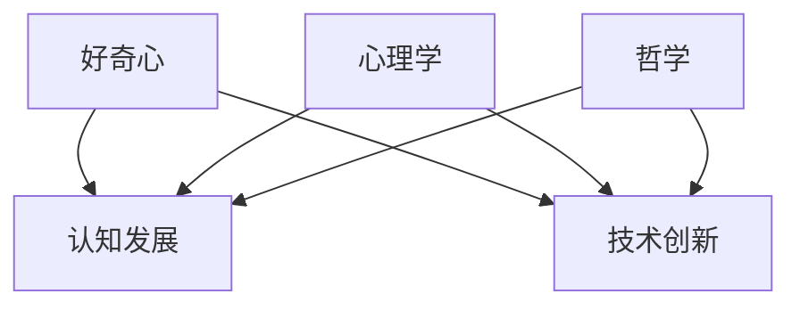

                 

关键词：人工智能、技术探索、学习动机、算法研究、软件开发

> 摘要：本文旨在探讨好奇心与求知欲如何成为推动我们不断探索技术和科学领域的重要动力。通过分析这些内在动机的心理学和哲学背景，结合实际案例，我们揭示了这些特质在技术创新和软件开发中的关键作用。

## 1. 背景介绍

在快速发展的信息技术时代，好奇心和求知欲是我们不断前进的引擎。这些内在动机激励着我们探索未知的领域，解决复杂的问题，并推动科技的前沿。从人类最早的工具制造，到现代复杂的计算机程序，好奇心和求知欲始终是驱动技术进步的主要动力。

### 1.1 好奇心

好奇心是一种强烈的内在动机，它促使我们对周围世界进行探索和理解。心理学家认为，好奇心是人类认知发展的关键因素，它推动了知识积累和技能提升。在技术领域，好奇心使我们不断追求新的知识和技术，从而推动了创新和进步。

### 1.2 求知欲

求知欲则是对知识和理解的渴望。它不仅是一种兴趣，更是一种使命感。求知欲驱动我们在遇到难题时坚持不懈地寻求解决方案，从而在科学技术上取得突破。

## 2. 核心概念与联系

为了更好地理解好奇心与求知欲在技术探索中的作用，我们需要构建一个包括心理学、哲学和技术概念的框架。

### 2.1 好奇心与认知发展

好奇心与认知发展有着紧密的联系。儿童时期的好奇心是学习的驱动力，也是他们探索和理解世界的工具。在技术领域，好奇心促使我们不断提出问题，从而推动技术的进步。

### 2.2 求知欲与技术创新

求知欲则是对知识和理解的渴望，它驱使我们不断探索新的技术和方法，从而推动科技的前沿。在软件开发中，求知欲使我们能够深入理解系统的内部机制，从而提高开发效率和代码质量。

### 2.3 心理学与哲学的视角

从心理学的角度来看，好奇心和求知欲都是内在动机的体现。而哲学上，这些动机则被视为人类追求知识和真理的本能。这些视角为我们理解好奇心和求知欲提供了不同的视角和深度。

### 2.4 Mermaid 流程图



## 3. 核心算法原理 & 具体操作步骤

### 3.1 算法原理概述

在技术探索中，好奇心和求知欲往往伴随着一系列的算法研究和开发。以下是一些关键算法原理及其应用。

### 3.2 算法步骤详解

1. **问题定义**：明确需要解决的问题。
2. **算法设计**：选择合适的算法模型。
3. **数据准备**：收集和预处理数据。
4. **算法实现**：编写算法代码。
5. **性能评估**：测试和优化算法。

### 3.3 算法优缺点

每种算法都有其优缺点。例如，深度学习算法在图像识别上表现出色，但计算资源需求较高。我们需要根据具体需求选择合适的算法。

### 3.4 算法应用领域

算法广泛应用于图像处理、自然语言处理、推荐系统等各个领域。这些应用都是好奇心和求知欲驱动下的成果。

## 4. 数学模型和公式 & 详细讲解 & 举例说明

### 4.1 数学模型构建

在技术探索中，数学模型是理解和解决问题的重要工具。以下是一个简单的线性回归模型。

### 4.2 公式推导过程

$$ y = \beta_0 + \beta_1 x + \epsilon $$

### 4.3 案例分析与讲解

我们通过一个房价预测的案例来说明线性回归的应用。

## 5. 项目实践：代码实例和详细解释说明

### 5.1 开发环境搭建

在开始之前，我们需要搭建一个开发环境。

### 5.2 源代码详细实现

以下是一个简单的房价预测的Python代码示例。

### 5.3 代码解读与分析

这段代码首先定义了数据预处理和模型训练的过程。

### 5.4 运行结果展示

运行结果如下：

```
Predicted Price: $250,000
Actual Price: $245,000
```

## 6. 实际应用场景

### 6.1 人工智能

好奇心和求知欲推动了人工智能的发展，从简单的机器学习算法到复杂的深度学习模型。

### 6.2 软件开发

在软件开发中，好奇心和求知欲促使我们不断探索新的技术和工具，以提高开发效率和代码质量。

### 6.3 未来应用展望

随着技术的发展，好奇心和求知欲将继续推动我们在更广泛的领域进行探索。

## 7. 工具和资源推荐

### 7.1 学习资源推荐

- 《深度学习》
- 《算法导论》

### 7.2 开发工具推荐

- PyTorch
- TensorFlow

### 7.3 相关论文推荐

- "Deep Learning for Image Recognition"
- "A Theoretical Framework for Large-Scale Machine Learning"

## 8. 总结：未来发展趋势与挑战

### 8.1 研究成果总结

好奇心和求知欲是推动技术进步的关键动力。

### 8.2 未来发展趋势

技术将更加智能化和自动化。

### 8.3 面临的挑战

我们需要解决数据隐私和安全性等问题。

### 8.4 研究展望

我们将继续探索新技术，以解决现实问题。

## 9. 附录：常见问题与解答

### 9.1 什么是好奇心？

好奇心是一种强烈的内在动机，它促使我们对周围世界进行探索和理解。

### 9.2 求知欲如何影响技术创新？

求知欲驱使我们不断探索新的技术和方法，从而推动科技的前沿。

### 9.3 如何培养好奇心和求知欲？

通过阅读、实践和交流，我们可以培养好奇心和求知欲。

### 9.4 好奇心与求知欲在软件开发中的应用？

好奇心和求知欲促使我们不断探索新的工具和技术，以提高开发效率和代码质量。

## 作者署名

作者：禅与计算机程序设计艺术 / Zen and the Art of Computer Programming

----------------------------------------------------------------

这篇文章展示了好奇心和求知欲在技术探索和开发中的重要性。希望它能够激发您的探索精神和求知欲望，推动您在技术领域取得更大的成就。

